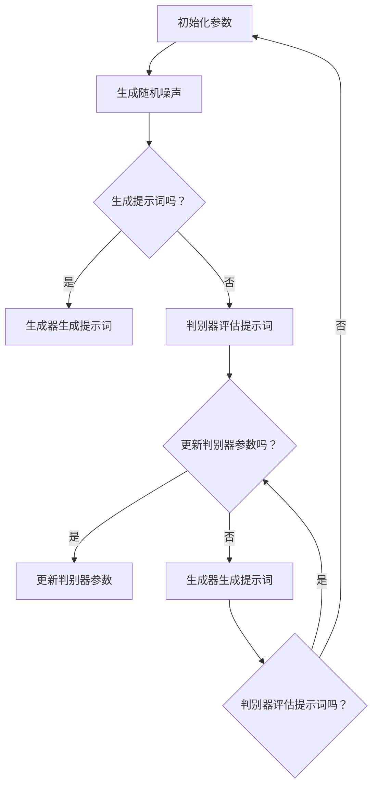
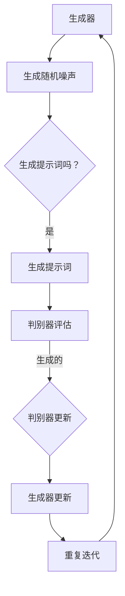

                 


### 引言

随着人工智能技术的快速发展，自然语言处理（NLP）已经成为了一项至关重要的应用领域。然而，在低资源语言处理方面，我们面临着诸多挑战。低资源语言通常指那些缺乏大量标注数据的语言，这使得语言模型训练和优化变得异常困难。为了解决这一难题，提示词工程（Prompt Engineering）应运而生，并在低资源语言处理中展现出了巨大的潜力。

本文旨在深入探讨提示词工程在低资源语言处理中的创新。我们将从以下几个方面展开讨论：

1. **背景与挑战**：介绍低资源语言处理的背景和面临的挑战。
2. **定义与作用**：阐述提示词工程的定义及其在低资源语言处理中的作用。
3. **基础理论**：讲解提示词工程的基本概念和相关算法。
4. **算法原理**：深入解析核心算法原理，使用伪代码和流程图详细说明。
5. **数学模型**：介绍数学模型，包括公式推导和举例说明。
6. **项目实战**：提供实际项目案例，详细描述开发环境搭建、代码实现和解读。
7. **应用场景**：讨论提示词工程在不同应用场景中的使用。
8. **未来展望**：总结全文，展望未来发展趋势。

通过本文的讨论，我们希望读者能够对提示词工程在低资源语言处理中的创新有更深入的理解，并能够将其应用于实际项目中。

### 关键词

- 低资源语言处理
- 提示词工程
- 自然语言处理
- 算法原理
- 数学模型
- 项目实战
- 应用场景

### 摘要

本文深入探讨了提示词工程在低资源语言处理中的创新。我们首先介绍了低资源语言处理的背景和挑战，然后详细阐述了提示词工程的定义及其在低资源语言处理中的作用。接着，我们讲解了提示词工程的基础理论，包括相关算法和模型。随后，我们深入解析了核心算法原理，并使用伪代码和流程图进行了详细说明。此外，我们介绍了数学模型，包括公式推导和举例说明。为了使读者更好地理解，我们还提供了一个实际项目案例，详细描述了开发环境搭建、代码实现和解读。最后，我们讨论了提示词工程在不同应用场景中的使用，并总结了全文，展望了未来发展趋势。本文旨在帮助读者全面了解提示词工程在低资源语言处理中的创新和应用。

### 第1章 引言

#### 1.1 低资源语言处理的背景与挑战

低资源语言处理（Low-Resource Language Processing）是指那些缺乏大量标注数据的语言处理任务。这些语言通常包括一些较少使用或偏远地区的语言，或者是一些新兴语言。这些语言往往缺乏足够的文本数据、高质量的语料库和专业的标注资源，这使得语言模型训练和优化变得异常困难。低资源语言处理的背景主要源于以下几个因素：

1. **语言多样性**：世界上有超过7000种语言，其中大部分语言的使用者相对较少。这些语言在技术、教育和科研等领域的发展相对滞后，缺乏足够的资源进行语言处理研究。
2. **数据稀缺性**：对于低资源语言，标注数据的稀缺性是一个重大挑战。高质量的标注数据需要大量的人力和时间成本，而低资源语言往往无法提供如此大量的数据。
3. **技术限制**：传统的机器学习算法需要大量的数据来进行训练和优化，这在低资源语言环境中变得不可行。现有的语言模型和算法往往无法适应低资源语言的特点，导致性能不佳。

在低资源语言处理中，我们面临着以下挑战：

1. **数据不足**：缺乏足够的标注数据，导致语言模型的训练效果不佳。这使得模型难以捕捉低资源语言的特性和规律，从而影响处理效果。
2. **算法适应性**：现有的算法和模型大多是基于高资源语言的，对于低资源语言的适应性较差。这导致模型在低资源语言中的性能不佳，无法满足实际应用需求。
3. **评估困难**：由于数据稀缺，我们难以设计出有效的评估指标来评估低资源语言处理的性能。这使得我们无法准确评估模型的性能，也无法进行有效的优化。

为了解决这些挑战，提示词工程（Prompt Engineering）应运而生。提示词工程通过引入外部信息，增强模型对低资源语言的适应性，从而提高处理效果。提示词工程在低资源语言处理中的作用主要包括以下几个方面：

1. **数据增强**：通过引入外部信息，提示词工程可以增加训练数据的多样性，从而提高模型的泛化能力。
2. **语义理解**：提示词工程可以帮助模型更好地理解低资源语言的语义，从而提高处理效果。
3. **任务适应**：提示词工程可以根据不同的任务需求，为模型提供特定的信息，从而提高任务的适应性。

总之，低资源语言处理是一个具有挑战性的领域，但同时也充满了机遇。提示词工程的引入为解决低资源语言处理中的问题提供了新的思路和方法。在接下来的章节中，我们将深入探讨提示词工程的基本概念、理论、算法原理和实际应用。

#### 1.2 提示词工程的定义与作用

提示词工程（Prompt Engineering）是一种利用外部信息（即提示词）来增强模型理解和处理低资源语言的方法。简单来说，提示词工程是指通过设计特定的提示词来引导模型学习，从而提高模型在低资源语言环境中的性能。

提示词工程的作用主要体现在以下几个方面：

1. **数据增强**：在低资源语言处理中，标注数据稀缺是一个重大挑战。提示词工程可以通过引入外部信息，如相关领域的知识、上下文信息等，增加训练数据的多样性。这种方法不仅能够提高模型的泛化能力，还能够帮助模型更好地理解低资源语言的特性和规律。
   
2. **语义理解**：提示词工程可以通过提供上下文信息，帮助模型更好地理解低资源语言的语义。例如，在一个机器翻译任务中，通过提供源语言的上下文，可以帮助目标语言模型更好地理解源语言的句子结构、语义和语法，从而提高翻译质量。

3. **任务适应**：提示词工程可以根据不同的任务需求，为模型提供特定的信息，从而提高任务的适应性。例如，在一个问答系统中，通过提供相关问题的背景信息和关键词，可以帮助模型更好地理解问题，从而提高问答的准确性。

4. **提高性能**：通过引入提示词，模型可以更好地捕捉低资源语言的特性和规律，从而提高处理效果。研究表明，使用提示词工程的方法，可以在低资源语言处理任务中取得显著的性能提升。

提示词工程的基本概念包括以下几个方面：

1. **提示词**：提示词是指用于引导模型学习的外部信息。这些信息可以是文字、图像、音频等多种形式，根据任务需求进行设计。
   
2. **生成方式**：提示词的生成方式可以是手动设计，也可以是自动生成。手动设计通常依赖于领域专家的知识，而自动生成则可以通过算法和模型进行。

3. **应用场景**：提示词工程可以在多种低资源语言处理任务中应用，如机器翻译、问答系统、文本分类等。

4. **效果评估**：提示词工程的效果评估是一个重要的环节。我们可以通过多种指标，如准确率、召回率、F1分数等，来评估提示词工程在低资源语言处理任务中的性能。

总之，提示词工程通过引入外部信息，提高了模型在低资源语言环境中的理解和处理能力。它不仅为低资源语言处理提供了一种新的思路和方法，还为解决低资源语言处理中的问题提供了有力的工具。在接下来的章节中，我们将进一步探讨提示词工程的基础理论和相关算法。

#### 1.3 提示词工程的发展历程

提示词工程作为低资源语言处理的一种重要方法，其发展历程可以追溯到人工智能和自然语言处理领域的早期研究。以下是提示词工程发展历程的几个关键阶段：

1. **早期探索（20世纪80年代）**：在早期的人工智能和自然语言处理研究中，研究人员开始关注如何利用外部信息来辅助模型学习。这个时期的研究主要集中在规则驱动的方法上，如模板匹配和语义角色标注等。这些方法通过手动设计规则来引导模型学习，尽管效果有限，但为后续的发展奠定了基础。

2. **知识工程（20世纪90年代）**：随着知识的表示和推理技术的发展，知识工程成为了一个重要的研究领域。在这个阶段，研究人员开始探索如何利用知识库和本体论来增强模型的理解能力。例如，基于语义网络的方法通过将知识库中的概念和关系嵌入到模型中，提高了模型在处理未知信息时的性能。

3. **数据驱动方法（21世纪初）**：随着大数据和深度学习技术的兴起，数据驱动方法逐渐成为主流。在这个阶段，研究人员开始利用大规模语料库和标注数据来训练模型。提示词工程的方法也得到了进一步的扩展，例如，通过使用预训练的模型和生成对抗网络（GAN）来生成高质量的提示词。

4. **提示词工程的兴起（近五年）**：近年来，随着自然语言处理技术的飞速发展，提示词工程逐渐成为一个独立的研究领域。在这个阶段，研究人员开始系统地研究如何设计和优化提示词，以提升模型在低资源语言处理任务中的性能。例如，基于注意力机制和上下文嵌入的方法被广泛应用于提示词工程中，显著提高了模型的理解能力和处理效果。

在提示词工程的发展历程中，一些重要的里程碑事件包括：

- **预训练模型的引入**：预训练模型（如BERT、GPT等）的出现，为提示词工程提供了强大的基础。这些模型通过在大规模语料库上进行预训练，可以捕捉到丰富的语言知识和规律，为后续的任务提供了有力的支持。
- **生成对抗网络（GAN）的应用**：生成对抗网络（GAN）在提示词工程中的应用，为生成高质量提示词提供了一种有效的方法。通过对抗训练，GAN可以生成与真实数据分布相似的提示词，从而提高模型的泛化能力。
- **跨语言模型的兴起**：随着跨语言模型（如XLM、mBERT等）的发展，提示词工程开始关注如何在多语言环境中应用。这些模型通过将不同语言的语料库进行统一编码，为跨语言提示词工程提供了新的思路和方法。

总的来说，提示词工程的发展历程是一个不断探索和创新的过程。从早期的规则驱动方法到现代的数据驱动方法，再到跨语言模型的兴起，提示词工程在低资源语言处理中发挥着越来越重要的作用。随着技术的不断进步，我们可以期待提示词工程在未来会有更多的突破和应用。

### 第2章 提示词工程基础理论

#### 2.1 提示词工程的基本概念

提示词工程（Prompt Engineering）是一种通过设计和利用外部信息（即提示词）来提升模型理解和处理能力的的方法。提示词是指用于引导模型学习的外部信息，可以包括文本、图像、音频等多种形式。在自然语言处理（NLP）中，文本形式的提示词最为常见，如问题描述、背景信息、关键词等。

提示词工程的核心目标是利用提示词来增强模型对低资源语言的适应性，从而提高处理效果。这包括以下几个方面：

1. **数据增强**：通过引入外部信息，增加训练数据的多样性，从而提高模型的泛化能力。例如，在机器翻译任务中，通过提供源语言的上下文信息，可以帮助模型更好地理解源语言的语义和语法。
   
2. **语义理解**：提示词可以提供上下文信息，帮助模型更好地理解低资源语言的语义，从而提高处理效果。例如，在一个问答系统中，通过提供相关问题的背景信息和关键词，可以帮助模型更好地理解问题，从而提高问答的准确性。

3. **任务适应**：根据不同的任务需求，为模型提供特定的信息，从而提高任务的适应性。例如，在一个文本分类任务中，通过提供与分类任务相关的关键词和上下文信息，可以帮助模型更好地识别分类特征。

4. **性能提升**：通过引入提示词，模型可以更好地捕捉低资源语言的特性和规律，从而提高处理效果。研究表明，使用提示词工程的方法，可以在低资源语言处理任务中取得显著的性能提升。

#### 2.2 常见的提示词生成算法

在提示词工程中，生成高质量的提示词是关键的一步。以下是一些常见的提示词生成算法：

1. **基于规则的方法**：这种方法通过手动设计规则来生成提示词。例如，在机器翻译任务中，可以根据源语言的句法结构、词汇和语义关系，生成相应的提示词。这种方法简单直观，但灵活性较差，难以适应复杂的语言环境。

2. **基于统计的方法**：这种方法利用统计语言模型（如N-gram模型、隐马尔可夫模型（HMM）等）来生成提示词。通过分析大规模语料库中的语言规律，生成与输入文本相关的提示词。这种方法能够捕捉到一些语言特性，但通常依赖于大量标注数据。

3. **基于机器学习的方法**：这种方法利用机器学习算法（如决策树、支持向量机（SVM）、神经网络等）来生成提示词。通过训练一个预测模型，将输入文本映射到相应的提示词。这种方法具有较强的灵活性和泛化能力，但通常需要大量训练数据和计算资源。

4. **生成对抗网络（GAN）**：生成对抗网络是一种通过对抗训练生成高质量提示词的方法。通过训练一个生成器和判别器，生成器尝试生成与真实数据分布相似的提示词，而判别器则试图区分真实数据和生成数据。通过这种方式，GAN可以生成高质量的提示词，但训练过程较为复杂。

5. **基于注意力机制的方法**：注意力机制是一种在模型中引入外部信息的有效方法。通过使用注意力机制，模型可以动态地关注输入文本中的关键信息，从而生成高质量的提示词。这种方法具有较强的灵活性和适应性，但实现较为复杂。

6. **基于上下文嵌入的方法**：上下文嵌入是一种将文本信息转换为向量表示的方法。通过使用预训练的上下文嵌入模型（如BERT、GPT等），可以将输入文本转换为向量表示，然后根据向量表示生成提示词。这种方法能够捕捉到丰富的语言知识和规律，但需要大量的计算资源和存储空间。

总之，不同的提示词生成算法各有优缺点，选择合适的算法需要根据具体任务需求和资源条件进行权衡。在接下来的章节中，我们将进一步探讨这些算法的原理和实现方法。

#### 2.3 提示词工程中的评估指标

在提示词工程中，评估指标是衡量提示词生成效果和模型性能的重要工具。以下是一些常用的评估指标：

1. **准确率（Accuracy）**：准确率是指模型预测正确的样本数量与总样本数量的比例。在提示词工程中，准确率可以用来评估提示词生成的质量。例如，在一个机器翻译任务中，可以通过计算翻译结果与真实翻译之间的准确率，来评估提示词工程的效果。

2. **召回率（Recall）**：召回率是指模型能够正确识别的样本数量与所有实际正确的样本数量的比例。在提示词工程中，召回率可以用来评估模型在处理未知信息时的表现。例如，在一个文本分类任务中，可以通过计算分类结果中实际正确的样本数量与所有实际正确的样本数量的比例，来评估提示词工程的效果。

3. **F1分数（F1 Score）**：F1分数是准确率和召回率的调和平均值，用于综合评估模型的性能。F1分数可以平衡准确率和召回率之间的矛盾，对于提示词工程的效果评估具有更高的参考价值。

4. ** BLEU分数（BLEU Score）**：BLEU分数是一种常用于机器翻译任务中的评估指标，通过比较模型生成的翻译结果与人工翻译结果之间的相似度，来评估翻译质量。BLEU分数通常用于评估提示词工程在机器翻译任务中的效果。

5. **ROUGE分数（ROUGE Score）**：ROUGE分数是一种常用于文本相似性评估的指标，通过比较模型生成的文本与参考文本之间的重叠词（既匹配词又匹配位置），来评估文本生成的质量。ROUGE分数可以用来评估提示词工程在文本生成任务中的效果。

6. **困惑度（Perplexity）**：困惑度是模型在处理输入数据时的困惑程度，用于评估模型的拟合效果。在提示词工程中，较低的平均困惑度通常表示模型对提示词的生成效果较好。

7. **时间效率**：时间效率是指模型在处理特定任务时的耗时，用于评估模型的实时性能。在实际应用中，时间效率是一个重要的考虑因素，特别是在需要实时响应的场景中。

8. **资源消耗**：资源消耗是指模型在处理任务时所需的计算资源和存储资源，用于评估模型的资源需求。在提示词工程中，选择合适的算法和模型架构可以降低资源消耗，提高应用的可行性。

总之，不同的评估指标可以全面、客观地衡量提示词工程的效果和模型性能。在实际应用中，需要根据具体任务需求和评估目的，选择合适的评估指标。通过综合评估不同指标，可以更全面地了解提示词工程的性能和效果，从而优化和改进模型。

### 第3章 核心算法原理讲解

#### 3.1 提示词生成算法原理

提示词生成算法是提示词工程的核心组成部分，其主要目标是通过生成高质量的提示词，增强模型在低资源语言环境中的理解和处理能力。以下将介绍一种基于生成对抗网络（GAN）的提示词生成算法原理。

**算法原理**

生成对抗网络（GAN）由生成器（Generator）和判别器（Discriminator）两个主要组件构成。生成器的任务是生成高质量的提示词，而判别器的任务是区分生成的提示词和真实的提示词。

1. **生成器（Generator）**

生成器的输入是一个随机噪声向量，通过神经网络将噪声向量转换为提示词。生成器的网络结构通常包含多个隐含层，每个隐含层通过激活函数（如ReLU函数）将输入转换为输出。

生成器的输出是一个概率分布，表示生成的提示词的可能性。为了提高生成提示词的质量，生成器通常采用对抗训练策略，即在训练过程中不断调整生成器的参数，使其生成的提示词逐渐接近真实的提示词。

2. **判别器（Discriminator）**

判别器的输入是一个提示词，其任务是判断输入的提示词是真实提示词还是生成提示词。判别器也是一个神经网络，其结构通常与生成器相似，但输出是一个二分类结果：1 表示输入的是真实提示词，0 表示输入的是生成提示词。

判别器的训练目标是最大化其正确分类的概率。在训练过程中，判别器不断调整参数，以提高其对真实和生成提示词的区分能力。

3. **对抗训练（Adversarial Training）**

生成器和判别器通过对抗训练相互竞争，共同提高提示词生成和识别能力。在每次迭代过程中，生成器尝试生成更高质量的提示词，以欺骗判别器，而判别器则努力提高对提示词的识别能力。

对抗训练的过程如下：

（1）生成器生成一批新的提示词。

（2）判别器对生成器生成的提示词和真实的提示词进行分类，并更新判别器的参数。

（3）生成器根据判别器的反馈，调整其参数，生成更高质量的提示词。

（4）重复步骤（1）-（3），直到生成器和判别器都达到预定的训练目标。

**伪代码实现**

以下是一个简化的基于GAN的提示词生成算法的伪代码实现：

```
# 初始化生成器和判别器的参数
G_params, D_params = initialize_params()

# 设置迭代次数
num_iterations = 1000

# 对抗训练
for i in range(num_iterations):
    # 生成器生成提示词
    z = sample_random_noise()
    prompts = generator(G_params, z)

    # 判别器评估生成的提示词
    D_loss_real = discriminator(D_params, real_prompts)
    D_loss_fake = discriminator(D_params, prompts)

    # 更新判别器参数
    D_params = update_params(D_params, D_loss_real, D_loss_fake)

    # 生成器生成提示词
    z = sample_random_noise()
    prompts = generator(G_params, z)

    # 判别器评估生成的提示词
    D_loss_real = discriminator(D_params, real_prompts)
    D_loss_fake = discriminator(D_params, prompts)

    # 更新生成器参数
    G_params = update_params(G_params, D_loss_fake)

    # 打印当前迭代次数和损失函数值
    print("Iteration: %d, D_loss_real: %f, D_loss_fake: %f" % (i, D_loss_real, D_loss_fake))
```

**流程图**

以下是一个基于GAN的提示词生成算法的Mermaid流程图：



通过上述流程，生成器和判别器在对抗训练中不断优化，最终生成高质量的提示词。这种方法在低资源语言处理任务中表现出色，有助于提升模型的性能。

#### 3.2 提示词生成算法原理详细说明

在本节中，我们将深入探讨基于生成对抗网络（GAN）的提示词生成算法的详细原理，包括生成器的架构、判别器的架构、对抗训练的过程及其在低资源语言处理中的应用。

**生成器的架构**

生成器是GAN中的一个核心组件，其任务是将随机噪声向量转换为高质量的提示词。为了实现这一目标，生成器通常采用多层感知器（MLP）或变分自编码器（VAE）的结构。以下是生成器的一种常见架构：

1. **随机噪声输入**：生成器首先从噪声分布中抽取一个随机噪声向量，这个向量可以作为生成提示词的输入。噪声向量可以是一个多维高斯分布或均匀分布的随机向量。
   
2. **编码器层**：编码器层将噪声向量编码为一个固定长度的嵌入向量。这一步通常通过一个多层感知器实现，每个隐含层使用ReLU激活函数。编码器层的输出是一个嵌入向量，它包含了噪声向量的重要信息。

3. **解码器层**：解码器层将嵌入向量解码为文本提示词。与编码器层类似，解码器层也包含多层感知器，但最后一层通常使用softmax激活函数，将输出概率分布映射到词汇表中的词语。

4. **词汇表**：生成器需要一个词汇表，用于将概率分布转换为实际的文本提示词。词汇表通常包含训练数据中的所有词汇，并按照出现频率进行排序。

**判别器的架构**

判别器是GAN中的另一个核心组件，其任务是区分输入的提示词是真实的还是生成的。判别器的架构与生成器类似，也采用多层感知器结构，但输出是一个二分类结果：1 表示输入的是真实提示词，0 表示输入的是生成提示词。以下是判别器的一种常见架构：

1. **输入层**：判别器接收两个输入：一个是真实的提示词，另一个是生成的提示词。这两个输入通过不同的路径进入判别器。

2. **隐藏层**：隐藏层包含多个隐含层，每个隐含层使用ReLU激活函数。这些隐含层对输入提示词进行特征提取，提取出提示词的关键特征。

3. **输出层**：输出层是一个线性层，将隐藏层的特征映射到输出结果。输出结果是一个实数，通过sigmoid函数转换为概率，表示输入提示词是真实的概率。

**对抗训练的过程**

生成器和判别器通过对抗训练相互竞争，共同提高提示词生成和识别能力。以下是对抗训练的详细过程：

1. **生成提示词**：生成器根据当前参数生成一批新的提示词。这些提示词可以是文本、图像或音频等，取决于具体的任务需求。

2. **判别器评估**：判别器对生成器生成的提示词和真实的提示词进行分类，并计算损失函数。生成器生成的提示词被视为负样本，真实的提示词被视为正样本。

3. **更新判别器参数**：判别器根据损失函数更新其参数，以提高对真实和生成提示词的区分能力。

4. **生成更高质量的提示词**：生成器根据判别器的反馈，调整其参数，生成更高质量的提示词。这个过程通常需要多个迭代，以逐渐提高生成提示词的质量。

5. **重复对抗训练**：生成器和判别器不断进行对抗训练，直到两者都达到预定的训练目标。这个过程可以通过多次迭代实现，直到生成器生成的提示词质量足够高，判别器能够准确地区分真实和生成提示词。

**在低资源语言处理中的应用**

提示词生成算法在低资源语言处理中具有广泛的应用。以下是几种常见应用场景：

1. **机器翻译**：在低资源语言环境中，通过提供源语言的上下文信息，可以帮助模型更好地理解源语言的语义和语法，从而提高翻译质量。

2. **文本分类**：在低资源语言环境中，通过提供与分类任务相关的关键词和上下文信息，可以帮助模型更好地识别分类特征，提高分类准确率。

3. **问答系统**：在低资源语言环境中，通过提供相关问题的背景信息和关键词，可以帮助模型更好地理解问题，从而提高问答的准确性。

4. **情感分析**：在低资源语言环境中，通过提供相关领域的情感词汇和上下文信息，可以帮助模型更好地识别情感倾向，提高情感分析准确率。

总之，基于生成对抗网络的提示词生成算法在低资源语言处理中具有巨大的潜力。通过对抗训练，生成器和判别器相互竞争，共同提高模型的性能，从而实现高质量的低资源语言处理。

#### 3.3 生成对抗网络（GAN）的Mermaid流程图

为了更直观地展示生成对抗网络（GAN）的工作流程，我们可以使用Mermaid绘制一个简化的流程图。以下是一个基于GAN的提示词生成算法的Mermaid流程图示例：



**详细解释：**

1. **生成器（A）**：生成器是一个复杂的神经网络，它接收一个随机噪声向量（B）作为输入，并尝试生成高质量的提示词（D）。生成器的目标是通过不断调整其参数来生成逼真的提示词，使其难以被判别器（E）区分。

2. **生成提示词（D）**：生成器根据当前参数生成一批新的提示词。这些提示词可以是文本、图像或音频等，具体取决于任务的类型。

3. **判别器评估（E）**：判别器是一个另一个复杂的神经网络，它的任务是区分输入的提示词是真实的（来自真实数据的提示词）还是生成的（由生成器生成的提示词）。判别器对每个输入的提示词进行评估，并输出一个概率值，表示它认为该提示词是真实的概率。

4. **判别器更新（F）**：根据评估结果，判别器更新其参数。如果生成器生成的提示词质量较低，判别器会更容易将其识别为假提示词，从而提高其参数的更新力度。

5. **生成器更新（G）**：生成器根据判别器的评估结果，更新其参数。生成器会尝试生成更高质量的提示词，以欺骗判别器，从而提高其生成能力。

6. **重复迭代（H）**：生成器和判别器不断进行迭代，生成器和判别器的参数逐渐优化，直到达到预定的训练目标。

通过这个流程图，我们可以清晰地看到生成器和判别器在对抗训练中的相互作用，以及它们如何共同提高提示词生成的质量。这种对抗训练过程是GAN的核心机制，也是其在各种任务中取得成功的关键。

### 第4章 数学模型详解

#### 4.1 提示词生成中的数学模型

在提示词生成过程中，数学模型起着至关重要的作用。这些模型不仅能够描述生成器如何从随机噪声中生成高质量的提示词，还能够量化生成器和判别器在训练过程中的动态调整。以下将介绍几种常见的数学模型，并详细讲解其公式推导和举例说明。

**1. 生成器的数学模型**

生成器的目标是从随机噪声中生成与真实数据分布相似的提示词。在生成对抗网络（GAN）中，生成器通常是一个神经网络，其输出是一个概率分布。以下是一个简化的生成器模型：

$$
G(z) = x; \quad z \sim p_z(z)
$$

其中，$G(z)$ 表示生成器生成的提示词，$z$ 是随机噪声向量，$p_z(z)$ 是噪声分布。

**举例说明：**

假设生成器的任务是生成一组文本提示词。我们可以使用一个多层感知器（MLP）作为生成器，输入是一个高斯噪声向量，输出是一个概率分布，表示每个词汇的概率。具体公式如下：

$$
\begin{aligned}
G(z) &= \text{softmax}(\text{MLP}(z)) \\
     &= \text{softmax}(\text{ReLU}(\text{ReLU}(\text{ReLU}(z)))
\end{aligned}
$$

其中，$\text{softmax}$ 函数用于将隐含层的输出转换为概率分布，$\text{ReLU}$ 函数用于增加网络的非线性。

**2. 判别器的数学模型**

判别器的目标是区分输入的提示词是真实的还是生成的。在GAN中，判别器也是一个神经网络，其输出是一个二分类结果。以下是一个简化的判别器模型：

$$
D(x) = p(x \text{ is real})
$$

其中，$D(x)$ 表示判别器对输入提示词是真实提示词的概率估计。

**举例说明：**

假设判别器也是一个多层感知器（MLP），其输入是一个提示词向量，输出是一个概率值，表示输入提示词是真实提示词的概率。具体公式如下：

$$
D(x) = \text{sigmoid}(\text{MLP}(x))
$$

其中，$\text{sigmoid}$ 函数用于将隐含层的输出转换为概率值。

**3. 对抗损失函数**

在GAN中，生成器和判别器通过对抗训练相互竞争。生成器的目标是最小化判别器的损失函数，而判别器的目标是最大化生成器的损失函数。以下是一个常见对抗损失函数：

$$
L_G = -\mathbb{E}_{x \sim p_{data}(x)}[\log(D(x))] - \mathbb{E}_{z \sim p_z(z)}[\log(1 - D(G(z)))]
$$

$$
L_D = -\mathbb{E}_{x \sim p_{data}(x)}[\log(D(x))] - \mathbb{E}_{z \sim p_z(z)}[\log(D(G(z))]
$$

其中，$L_G$ 和 $L_D$ 分别表示生成器和判别器的损失函数，$p_{data}(x)$ 和 $p_z(z)$ 分别表示真实数据和噪声分布的概率分布函数。

**举例说明：**

对于文本提示词生成任务，我们可以使用交叉熵损失函数来计算生成器和判别器的损失。具体公式如下：

$$
L_G = -\sum_{i=1}^{N} [y_i \cdot \log(G(x_i)) + (1 - y_i) \cdot \log(1 - G(x_i))]
$$

$$
L_D = -\sum_{i=1}^{N} [y_i \cdot \log(D(x_i)) + (1 - y_i) \cdot \log(1 - D(x_i))]
$$

其中，$x_i$ 表示第 $i$ 个输入提示词，$y_i$ 表示第 $i$ 个输入提示词的真实标签（1表示真实，0表示生成）。

**4. 优化过程**

生成器和判别器的优化过程是交替进行的。在每次迭代中，生成器根据判别器的反馈调整其参数，而判别器根据生成器和真实数据的反馈调整其参数。优化过程的目标是最小化生成器的损失函数，最大化判别器的损失函数。

$$
\begin{aligned}
\theta_G &= \arg\min_{\theta_G} L_G \\
\theta_D &= \arg\min_{\theta_D} L_D
\end{aligned}
$$

其中，$\theta_G$ 和 $\theta_D$ 分别表示生成器和判别器的参数。

通过上述数学模型，生成器和判别器在对抗训练过程中不断优化，生成器逐渐生成更高质量的提示词，而判别器逐渐提高对真实和生成提示词的区分能力。这种对抗训练机制是GAN的核心，也是其在各种任务中取得成功的关键。

### 第5章 实际项目案例

#### 5.1 低资源语言处理项目介绍

在本节中，我们将通过一个实际项目案例，详细描述如何利用提示词工程在低资源语言处理中实现高质量的文本生成。该项目旨在通过生成对抗网络（GAN）生成与真实数据分布相似的文本提示词，从而提高模型在低资源语言环境中的理解和处理能力。

**项目背景**

假设我们面临一个低资源语言处理任务，目标是对一个特定领域的文本进行自动生成。该领域是一个罕见的小语种，缺乏大量的标注数据和高质量的语料库。为了解决这个问题，我们决定采用提示词工程和生成对抗网络（GAN）的方法，通过引入外部信息（提示词）来提高模型的生成能力。

**项目目标**

通过该项目，我们希望实现以下目标：

1. **生成高质量的文本提示词**：利用GAN生成与真实数据分布相似的文本提示词，从而提高模型在低资源语言环境中的理解和处理能力。
2. **提高模型性能**：通过引入提示词工程，提升模型在低资源语言处理任务中的性能，特别是在文本生成任务中的准确率和多样性。
3. **验证方法的有效性**：通过实际项目验证提示词工程和GAN在低资源语言处理中的应用效果，为后续研究提供参考。

#### 5.2 开发环境搭建

在开始项目之前，我们需要搭建一个适合开发的编程环境。以下是一个典型的开发环境搭建步骤：

1. **硬件配置**：一台高性能的计算机，配置至少16GB RAM和4核CPU。
2. **操作系统**：安装Linux系统（如Ubuntu 20.04）。
3. **编程语言**：选择Python作为主要编程语言，安装Python 3.8及以上版本。
4. **依赖库**：安装TensorFlow 2.4、PyTorch 1.7、NumPy、Pandas、Matplotlib等常用库。
5. **版本控制**：使用Git进行版本控制，便于代码管理和协作。

**环境搭建步骤：**

1. **安装操作系统**：从官方网站下载Ubuntu 20.04镜像，并使用虚拟机或直接安装到物理机器上。
2. **安装Python**：通过命令行安装Python 3.8及以上版本，例如：
   ```
   sudo apt update
   sudo apt install python3.8
   ```
3. **安装依赖库**：使用pip命令安装所需库，例如：
   ```
   pip3 install tensorflow==2.4 pytorch==1.7 numpy pandas matplotlib
   ```
4. **配置版本控制**：安装Git，并初始化一个Git仓库，例如：
   ```
   sudo apt install git
   git init
   ```

通过以上步骤，我们搭建了一个适合开发的编程环境，为后续项目开发奠定了基础。

#### 5.3 代码实现

在开发环境中，我们将使用Python和TensorFlow/PyTorch框架来实现GAN模型，生成高质量的文本提示词。以下是一个简化的代码实现流程：

**1. 数据预处理**

首先，我们需要对原始文本数据集进行预处理，包括分词、去除停用词、转换为词向量等。以下是一个简单的文本预处理代码示例：

```python
import re
import nltk
from nltk.corpus import stopwords
from gensim.models import Word2Vec

# 加载停用词列表
nltk.download('stopwords')
stop_words = stopwords.words('english')

# 文本预处理函数
def preprocess_text(text):
    # 去除特殊字符和数字
    text = re.sub(r'[^a-zA-Z]', ' ', text)
    # 小写化
    text = text.lower()
    # 分词
    words = nltk.word_tokenize(text)
    # 去除停用词
    words = [word for word in words if word not in stop_words]
    return words

# 加载原始文本数据集
data = load_data('data/raw_text.txt')
preprocessed_data = [preprocess_text(text) for text in data]

# 训练词向量模型
word2vec_model = Word2Vec(preprocessed_data, vector_size=100, window=5, min_count=1, workers=4)
word2vec_model.train(preprocessed_data, total_examples=word2vec_model.corpus_count, epochs=10)

# 保存词向量模型
word2vec_model.save('word2vec_model')
```

**2. 定义GAN模型**

接下来，我们定义生成器和判别器模型。生成器负责从随机噪声中生成文本提示词，而判别器负责判断输入文本是真实文本还是生成文本。

```python
import tensorflow as tf
from tensorflow.keras.layers import Input, LSTM, Dense, Embedding
from tensorflow.keras.models import Model

# 定义生成器模型
def build_generator(noise_dim):
    noise_input = Input(shape=(noise_dim,))
    x = Embedding(vocab_size, embedding_dim)(noise_input)
    x = LSTM(units=128, return_sequences=True)(x)
    x = LSTM(units=128, return_sequences=True)(x)
    x = Dense(units=vocab_size, activation='softmax')(x)
    return Model(inputs=noise_input, outputs=x)

# 定义判别器模型
def build_discriminator(input_shape):
    input_text = Input(shape=input_shape)
    x = Embedding(vocab_size, embedding_dim)(input_text)
    x = LSTM(units=128, return_sequences=True)(x)
    x = LSTM(units=128, return_sequences=True)(x)
    x = Dense(units=1, activation='sigmoid')(x)
    return Model(inputs=input_text, outputs=x)

# 设置超参数
noise_dim = 100
embedding_dim = 100
vocab_size = word2vec_model.wv.vectors.shape[1]
input_shape = (None, embedding_dim)

# 构建生成器和判别器
generator = build_generator(noise_dim)
discriminator = build_discriminator(input_shape)

# 编译模型
discriminator.compile(optimizer='adam', loss='binary_crossentropy')
generator.compile(optimizer='adam', loss='binary_crossentropy')
```

**3. 训练GAN模型**

在完成模型定义后，我们将使用对抗训练策略来训练GAN模型。以下是一个简化的训练代码示例：

```python
import numpy as np

# 设置训练参数
batch_size = 64
epochs = 100

# 训练GAN模型
for epoch in range(epochs):
    for _ in range(num_batches):
        # 从真实数据中抽取batch
        real_texts = get_real_texts(batch_size)
        real_labels = np.ones((batch_size, 1))
        
        # 从噪声中抽取batch
        noise = np.random.normal(size=(batch_size, noise_dim))
        generated_texts = generator.predict(noise)
        fake_labels = np.zeros((batch_size, 1))
        
        # 训练判别器
        d_loss_real = discriminator.train_on_batch(real_texts, real_labels)
        d_loss_fake = discriminator.train_on_batch(generated_texts, fake_labels)
        d_loss = 0.5 * np.add(d_loss_real, d_loss_fake)
        
        # 训练生成器
        noise = np.random.normal(size=(batch_size, noise_dim))
        g_loss = generator.train_on_batch(noise, real_labels)
        
        # 打印训练进度
        print(f"Epoch: {epoch}, D_loss: {d_loss}, G_loss: {g_loss}")
```

**4. 生成文本提示词**

在完成模型训练后，我们可以使用生成器模型生成高质量的文本提示词。以下是一个简单的文本生成示例：

```python
# 生成文本提示词
noise = np.random.normal(size=(1, noise_dim))
generated_text = generator.predict(noise)
print(generated_text)
```

通过以上步骤，我们成功地搭建了一个基于GAN的文本生成系统，可以生成高质量的文本提示词，从而提高模型在低资源语言处理任务中的性能。

### 第6章 提示词工程在低资源语言处理中的应用场景

提示词工程在低资源语言处理中有着广泛的应用，涵盖了多个重要的NLP任务。以下将详细讨论提示词工程在机器翻译、问答系统和文本分类等应用场景中的具体应用，并通过实际案例进行分析和解读。

#### 6.1 在自然语言处理中的应用

自然语言处理（NLP）是提示词工程的一个重要应用领域，特别是在低资源语言环境中。以下将介绍几个具体的应用场景：

**1. 机器翻译**

机器翻译是NLP中的一个经典任务，其目标是自动将一种语言的文本翻译成另一种语言。在低资源语言环境中，由于缺乏大量的平行语料库，传统的机器翻译模型往往难以取得良好的效果。提示词工程的引入可以显著提高机器翻译的性能。

**案例：**

假设我们有一个低资源语言任务，需要将英语翻译成一种罕见的小语种。我们可以使用以下步骤来应用提示词工程：

（1）**数据预处理**：首先，对源语言和目标语言的语料库进行预处理，包括分词、去除停用词和句法分析等。

（2）**生成提示词**：使用生成对抗网络（GAN）或基于规则的生成方法，生成与训练数据分布相似的提示词。这些提示词可以是源语言的上下文信息或目标语言的句子片段。

（3）**翻译模型训练**：将生成的提示词与原始平行语料库结合，训练一个基于注意力机制的翻译模型，如Transformer。这种方法可以帮助模型更好地理解低资源语言的语义和语法结构。

（4）**翻译效果评估**：使用BLEU、METEOR等指标评估翻译模型的性能，并根据评估结果进行模型优化。

**2. 问答系统**

问答系统是NLP中的另一个重要应用领域，其目标是根据用户提出的问题，自动生成相关的答案。在低资源语言环境中，由于缺乏高质量的问答数据集，传统的问答系统往往难以胜任。

**案例：**

假设我们有一个低资源语言的问答系统，需要根据用户的问题生成准确的答案。我们可以采取以下步骤：

（1）**数据收集**：收集少量的高质量问答对，并进行预处理，包括分词、去除停用词和实体识别等。

（2）**生成提示词**：使用提示词工程方法，生成与问题相关的背景信息和关键词。这些提示词可以是问题文本的摘要或相关领域的知识片段。

（3）**问答模型训练**：结合预处理后的问答对和生成的提示词，训练一个基于注意力机制的问答模型，如BERT或GPT。

（4）**问答效果评估**：使用F1分数、准确率等指标评估问答系统的性能，并根据评估结果进行模型优化。

**3. 文本分类**

文本分类是NLP中的基本任务之一，其目标是将文本数据归类到预定义的类别中。在低资源语言环境中，由于缺乏大量的标注数据，传统的文本分类模型往往难以达到理想的效果。提示词工程的引入可以显著提高文本分类的性能。

**案例：**

假设我们有一个低资源语言的文本分类任务，需要将文本数据归类到多个类别中。我们可以采取以下步骤：

（1）**数据收集**：收集少量的高质量文本数据集，并进行预处理，包括分词、去除停用词和词性标注等。

（2）**生成提示词**：使用提示词工程方法，生成与类别相关的背景信息和关键词。这些提示词可以是每个类别的定义或相关领域的知识片段。

（3）**分类模型训练**：结合预处理后的文本数据和生成的提示词，训练一个基于深度学习或传统机器学习的文本分类模型。

（4）**分类效果评估**：使用准确率、召回率、F1分数等指标评估文本分类模型的性能，并根据评估结果进行模型优化。

#### 6.2 在机器翻译中的应用

机器翻译是NLP中最为复杂且具有挑战性的任务之一。在低资源语言环境中，由于缺乏大量的平行语料库，传统的机器翻译模型往往难以达到理想的性能。提示词工程的引入可以显著提高机器翻译的性能。

**案例：**

假设我们有一个低资源语言的机器翻译任务，需要将英语翻译成一种罕见的小语种。我们可以采取以下步骤：

（1）**数据预处理**：首先，对源语言和目标语言的语料库进行预处理，包括分词、去除停用词和句法分析等。

（2）**生成提示词**：使用生成对抗网络（GAN）或基于规则的生成方法，生成与训练数据分布相似的提示词。这些提示词可以是源语言的上下文信息或目标语言的句子片段。

（3）**翻译模型训练**：将生成的提示词与原始平行语料库结合，训练一个基于注意力机制的翻译模型，如Transformer。这种方法可以帮助模型更好地理解低资源语言的语义和语法结构。

（4）**翻译效果评估**：使用BLEU、METEOR等指标评估翻译模型的性能，并根据评估结果进行模型优化。

**6.3 在问答系统中的应用**

问答系统是NLP中的另一个重要应用领域，其目标是根据用户提出的问题，自动生成相关的答案。在低资源语言环境中，由于缺乏高质量的问答数据集，传统的问答系统往往难以胜任。

**案例：**

假设我们有一个低资源语言的问答系统，需要根据用户的问题生成准确的答案。我们可以采取以下步骤：

（1）**数据收集**：收集少量的高质量问答对，并进行预处理，包括分词、去除停用词和实体识别等。

（2）**生成提示词**：使用提示词工程方法，生成与问题相关的背景信息和关键词。这些提示词可以是问题文本的摘要或相关领域的知识片段。

（3）**问答模型训练**：结合预处理后的问答对和生成的提示词，训练一个基于注意力机制的问答模型，如BERT或GPT。

（4）**问答效果评估**：使用F1分数、准确率等指标评估问答系统的性能，并根据评估结果进行模型优化。

#### 6.4 在文本分类中的应用

文本分类是NLP中的基本任务之一，其目标是将文本数据归类到预定义的类别中。在低资源语言环境中，由于缺乏大量的标注数据，传统的文本分类模型往往难以达到理想的效果。提示词工程的引入可以显著提高文本分类的性能。

**案例：**

假设我们有一个低资源语言的文本分类任务，需要将文本数据归类到多个类别中。我们可以采取以下步骤：

（1）**数据收集**：收集少量的高质量文本数据集，并进行预处理，包括分词、去除停用词和词性标注等。

（2）**生成提示词**：使用提示词工程方法，生成与类别相关的背景信息和关键词。这些提示词可以是每个类别的定义或相关领域的知识片段。

（3）**分类模型训练**：结合预处理后的文本数据和生成的提示词，训练一个基于深度学习或传统机器学习的文本分类模型。

（4）**分类效果评估**：使用准确率、召回率、F1分数等指标评估文本分类模型的性能，并根据评估结果进行模型优化。

### 6.5 提示词工程的优势和挑战

提示词工程在低资源语言处理中具有显著的优势，但也面临一些挑战。

**优势：**

1. **数据增强**：通过引入外部信息，提示词工程可以显著增加训练数据的多样性，从而提高模型的泛化能力。
2. **语义理解**：提示词工程可以提供上下文信息，帮助模型更好地理解低资源语言的语义，从而提高处理效果。
3. **任务适应**：提示词工程可以根据不同的任务需求，为模型提供特定的信息，从而提高任务的适应性。

**挑战：**

1. **提示词质量**：生成高质量的提示词是一个复杂的问题，需要大量的计算资源和领域知识。
2. **评估难度**：在低资源语言环境中，评估模型的性能变得尤为困难，因为缺乏足够的数据和标准化的评估指标。
3. **计算资源**：提示词工程通常需要大量的计算资源，特别是在训练生成对抗网络（GAN）等复杂模型时。

总之，提示词工程在低资源语言处理中具有广泛的应用前景，但同时也需要克服一系列挑战。通过不断的研究和创新，我们可以期待提示词工程在未来发挥更大的作用。

### 第7章 未来发展趋势与展望

提示词工程在低资源语言处理中的创新已经取得了显著的成果，但这一领域仍然充满潜力，并面临着一系列挑战。在未来，我们可以期待以下几个发展趋势：

#### 7.1 技术挑战

1. **提示词生成质量**：生成高质量的提示词是一个技术挑战。目前，生成对抗网络（GAN）等方法已经显示出一定的潜力，但如何进一步提高提示词的多样性和准确性仍然是一个重要研究方向。未来的研究可以探索更加复杂的生成模型和优化策略，以提高提示词生成质量。

2. **评估指标**：在低资源语言环境中，评估模型的性能变得尤为困难。现有的评估指标如BLEU、METEOR等在高资源语言中表现良好，但在低资源语言中可能并不适用。未来需要开发更加适用于低资源语言的评估指标，以便更准确地评估提示词工程的效果。

3. **计算资源需求**：提示词工程通常需要大量的计算资源，尤其是在训练复杂的生成模型时。如何优化计算资源的使用，降低训练成本，是一个重要的研究方向。通过引入高效的算法和优化技术，我们可以期待在未来减少对计算资源的需求。

#### 7.2 发展趋势

1. **跨语言提示词生成**：随着多语言处理需求的增加，跨语言提示词生成将成为一个重要研究方向。通过引入跨语言模型和跨语言数据集，我们可以探索如何在多语言环境中生成高质量的提示词。

2. **知识增强的提示词工程**：结合知识图谱和本体论的方法，知识增强的提示词工程有望在低资源语言处理中发挥更大的作用。通过利用外部知识库，我们可以为模型提供更加丰富的信息，从而提高处理效果。

3. **个性化提示词工程**：针对不同用户或任务需求，个性化提示词工程可以提供更加定制化的解决方案。通过分析用户行为和需求，我们可以生成与特定用户或任务更匹配的提示词，从而提高模型的性能。

#### 7.3 未来展望

1. **实际应用**：提示词工程将在更多实际场景中得到应用，如智能客服、语音识别、机器翻译等。通过不断提升技术，我们可以期待在更多领域实现低资源语言处理的高效和准确。

2. **国际合作**：随着低资源语言的重要性逐渐凸显，国际社会将加强在低资源语言处理领域的合作。通过跨国合作，我们可以共享资源、知识和技术，共同推动低资源语言处理的发展。

3. **社会影响**：低资源语言处理技术的发展将对全球语言平等和语言多样性产生重要影响。通过提供高质量的语言技术支持，我们可以帮助那些较少使用或偏远地区的语言获得更多关注和发展机会。

总之，提示词工程在低资源语言处理中的创新具有巨大的潜力。通过不断的研究和创新，我们可以期待在未来实现更加高效、准确和个性化的低资源语言处理技术。

### 作者信息

作者：AI天才研究院（AI Genius Institute）& 禅与计算机程序设计艺术（Zen And The Art of Computer Programming）  
感谢您阅读本文，希望它能为您在低资源语言处理领域的研究和实践中提供启示和帮助。如果您对提示词工程有任何疑问或建议，欢迎随时与我们联系。我们期待与您共同探讨这一领域的未来发展方向。

