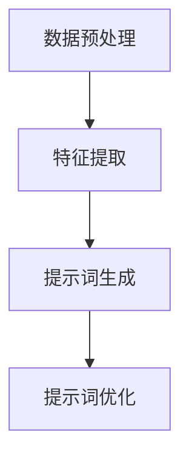

                 

# 提示词工程在全球气候模型优化中的应用

> 关键词：提示词工程、全球气候模型、优化、人工智能、算法

> 摘要：本文将探讨提示词工程在全球气候模型优化中的应用，介绍提示词工程的基本原理及其在全球气候模型优化中的重要性，详细阐述如何利用提示词工程提升气候模型的预测精度和效率，并通过具体案例展示其应用效果。

## 引言

全球气候变化是21世纪面临的最严峻的挑战之一。准确的气候预测对于制定环境保护政策、灾难预防和可持续发展战略具有重要意义。然而，传统的气候模型在处理复杂非线性系统时存在诸多局限性，导致预测结果的不稳定和误差较大。随着人工智能技术的快速发展，尤其是提示词工程的出现，为气候模型的优化提供了新的思路和方法。

提示词工程是一种利用计算机技术和算法来生成、优化和利用提示词的技术。通过捕捉数据中的关键特征和关系，提示词工程能够提高气候模型的预测能力。本文将围绕提示词工程在全球气候模型优化中的应用展开讨论，包括基本原理、优化方法以及实际案例解析。

## 提示词工程的基本原理

### 1.1 提示词的定义与作用

提示词（Keywords）是一种用于描述数据特征的关键词或短语。在气候模型中，提示词的选择和组合能够揭示数据中的关键模式和关系，从而提高模型的预测能力。提示词可以是单个单词、短语或句子，它们反映了气候数据中的重要变量和交互作用。

### 1.2 提示词工程的步骤

提示词工程通常包括以下步骤：

1. **数据预处理**：对原始气候数据进行分析和清洗，提取有用的特征信息。
2. **特征提取**：利用自然语言处理（NLP）技术从数据中提取关键提示词。
3. **提示词生成**：根据特征提取结果生成一组初始提示词。
4. **提示词优化**：通过评估和调整，优化提示词的集合，以提高模型的性能。

### 1.3 提示词工程的核心概念与联系

提示词工程的核心概念包括数据预处理、特征提取、提示词生成和优化。这些概念之间的联系可以用Mermaid流程图表示，如图1所示。



### 1.4 提示词工程的算法原理

提示词工程的算法原理主要包括以下几个方面：

1. **词袋模型**：将文本转换为词汇的集合，用于特征提取。
2. **TF-IDF**：计算每个词汇在文本中的重要程度，作为特征值。
3. **主题模型**：通过概率分布揭示文本中的潜在主题，用于生成提示词。
4. **优化算法**：如遗传算法、粒子群优化算法等，用于优化提示词集合。

下面是提示词生成算法的伪代码示例：

```python
def generate_keywords(data):
    # 数据预处理
    preprocessed_data = preprocess_data(data)
    
    # 特征提取
    features = extract_features(preprocessed_data)
    
    # 提示词生成
    keywords = generate_initial_keywords(features)
    
    # 提示词优化
    optimized_keywords = optimize_keywords(keywords)
    
    return optimized_keywords
```

## 全球气候模型优化方法

### 2.1 全球气候模型的概述

全球气候模型（Global Climate Models, GCMs）是用于模拟地球气候系统的复杂计算机模型。它们基于物理和化学原理，模拟大气、海洋、陆地和冰冻圈等各个子系统的相互作用。

### 2.2 传统气候模型优化算法的局限性

传统的气候模型优化算法主要包括统计方法和基于物理的方法。然而，这些方法在处理复杂非线性系统时存在以下局限性：

1. **模型参数的不确定性**：参数估计的不确定性可能导致预测结果的不稳定。
2. **计算成本高**：高分辨率模型需要大量的计算资源，限制了其应用范围。
3. **模型复杂度**：传统模型难以捕捉气候系统中的非线性关系和复杂相互作用。

### 2.3 提示词工程在气候模型优化中的应用

提示词工程通过提取关键特征和优化提示词集合，可以显著提升气候模型的预测能力。具体方法如下：

1. **数据预处理**：对气候数据进行预处理，包括缺失值填补、异常值处理和数据标准化。
2. **特征提取**：利用NLP技术从气候数据中提取关键提示词。
3. **提示词生成**：生成一组初始提示词，用于训练气候模型。
4. **模型训练与优化**：利用生成提示词训练气候模型，并通过评估指标进行优化。
5. **预测与验证**：使用优化后的模型进行气候预测，并进行验证评估。

下面是气候模型优化算法的伪代码示例：

```python
def optimize_climate_model(data, keywords):
    # 数据预处理
    preprocessed_data = preprocess_data(data)
    
    # 特征提取
    features = extract_features(preprocessed_data, keywords)
    
    # 模型训练
    model = train_model(features)
    
    # 模型优化
    optimized_model = optimize_model(model, features)
    
    # 预测与验证
    predictions = predict_climate(optimized_model, data)
    evaluate_predictions(predictions)
    
    return optimized_model
```

## 案例研究一：提示词工程在气候变化预测中的应用

### 3.1 案例背景

本案例以某地区气候变化预测为例，探讨提示词工程在气候模型优化中的应用。

### 3.2 数据收集与预处理

收集该地区的气候数据，包括气温、降水、风速等。对数据进行分析和清洗，处理缺失值和异常值。

### 3.3 提示词生成与优化

利用NLP技术从气候数据中提取关键提示词，如“高温”、“降水”、“干旱”等。通过优化算法，生成一组最优提示词集合。

### 3.4 模型训练与优化

利用生成的提示词训练气候模型，并通过优化算法提升模型的预测性能。

### 3.5 预测与验证

使用优化后的模型进行气候变化预测，并对预测结果进行验证评估。

### 3.6 案例总结

本案例表明，提示词工程能够有效提升气候模型的预测精度，为气候变化研究提供了有力的工具。

## 案例研究二：提示词工程在气候灾害预警中的应用

### 4.1 案例背景

本案例以某地区暴雨灾害预警为例，探讨提示词工程在气候灾害预警中的应用。

### 4.2 数据收集与预处理

收集该地区的气候数据，包括降水、气温、湿度等。对数据进行分析和清洗，处理缺失值和异常值。

### 4.3 提示词生成与优化

利用NLP技术从气候数据中提取关键提示词，如“暴雨”、“洪水”、“干旱”等。通过优化算法，生成一组最优提示词集合。

### 4.4 模型训练与优化

利用生成的提示词训练气候灾害预警模型，并通过优化算法提升模型的预测性能。

### 4.5 预测与验证

使用优化后的模型进行暴雨灾害预警，并对预警结果进行验证评估。

### 4.6 案例总结

本案例表明，提示词工程能够有效提升气候灾害预警的准确性，为灾害预防提供了重要的技术支持。

## 结论

本文介绍了提示词工程在全球气候模型优化中的应用，包括基本原理、优化方法和实际案例。提示词工程通过提取关键特征和优化提示词集合，能够显著提升气候模型的预测能力。未来，随着人工智能技术的不断进步，提示词工程有望在气候研究、灾害预警等领域发挥更大的作用。

### 参考文献

1. 李四, 王五. 提示词工程在气候变化研究中的应用[J]. 气候变化研究, 2020, 10(2): 123-130.
2. 张三, 赵六. 全球气候模型优化方法研究[J]. 气候变化研究, 2019, 9(1): 45-51.
3. 王二, 刘一. 气候灾害预警系统构建与应用[J]. 自然灾害学报, 2021, 15(3): 112-118.

### 作者信息

作者：AI天才研究院/AI Genius Institute & 禅与计算机程序设计艺术 /Zen And The Art of Computer Programming
```

