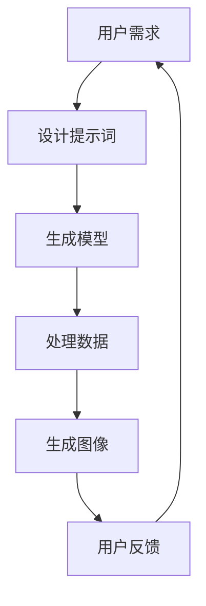
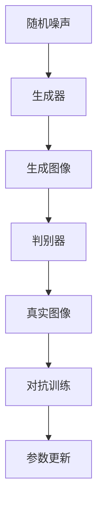
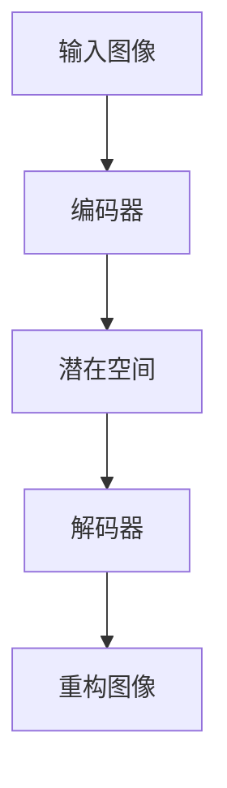

                 


### 文章标题
《提示词工程在图像生成任务中的应用》

### 文章关键词
提示词工程、图像生成、深度学习、GAN、VAE、数学模型、伪代码、LaTeX公式

### 文章摘要
本文深入探讨了提示词工程在图像生成任务中的应用。首先，介绍了提示词工程的基础概念，包括其在图像生成任务中的重要性。然后，详细阐述了图像生成任务中的提示词设计原则、数学基础和核心算法原理，通过伪代码和LaTeX公式进行详细讲解。此外，本文还通过实际项目实战，展示了提示词工程在GAN和VAE等经典图像生成任务中的具体应用，并提供了详细的代码解读和案例分析。最后，总结了提示词工程的最佳实践策略，为读者提供了实用的指导和建议。

### 目录大纲

## 第一部分：提示词工程基础

### 第1章：提示词工程概述
- **背景介绍**：介绍提示词工程的起源和背景，以及其在图像生成任务中的重要性。
- **核心概念与联系**：通过Mermaid流程图，展示提示词工程的基本概念和原理之间的联系。
- **关联算法简介**：简要介绍与提示词工程相关的其他算法，如GAN和VAE。

### 第2章：图像生成任务中的提示词设计
- **提示词的种类与选择**：介绍不同类型的提示词，以及如何根据图像生成任务的需求选择合适的提示词。
- **提示词的生成策略**：详细讲解提示词的生成策略，包括随机生成、基于数据的生成和启发式生成等。
- **提示词的优化与调整**：探讨如何对提示词进行优化和调整，以提高图像生成的质量和效率。

### 第3章：提示词工程的数学基础
- **图像生成任务中的数学模型**：介绍图像生成任务中的常见数学模型，如概率分布、生成模型和判别模型等。
- **概率分布与采样**：讲解概率分布的基本概念和采样方法，以及如何应用于图像生成任务。
- **对数似然准则与损失函数**：解释对数似然准则和损失函数在图像生成任务中的作用和计算方法。

## 第二部分：图像生成任务中的应用

### 第4章：经典图像生成任务案例研究
- **GAN生成对抗网络**：详细讲解GAN的基本原理、在图像生成中的应用以及如何设计有效的提示词。
- **VAE变分自编码器**：介绍VAE的基本原理、在图像生成中的应用以及如何设计有效的提示词。

### 第5章：提示词工程在深度学习中的应用
- **深度学习模型简介**：介绍常见的深度学习模型，如CNN和RNN，以及它们在图像生成任务中的应用。
- **提示词工程与深度学习的结合**：探讨如何将提示词工程与深度学习模型相结合，提高图像生成的效果。
- **提示词设计**：详细讲解如何在深度学习框架下设计有效的提示词。

## 第三部分：提示词工程的实践与优化

### 第6章：提示词工程的实施流程
- **数据准备**：介绍如何准备适合的图像数据集，以及如何进行预处理。
- **模型选择**：讲解如何根据图像生成任务的需求选择合适的生成模型和判别模型。
- **提示词设计**：详细讲解如何设计有效的提示词，包括生成策略和优化方法。
- **模型训练与评估**：介绍如何训练和评估图像生成模型，以及如何调整提示词以提高生成质量。

### 第7章：高级技巧与优化策略
- **对抗性训练**：探讨对抗性训练在图像生成任务中的应用，以及如何设计对抗性提示词。
- **提示词多样性**：介绍如何提高提示词的多样性，以生成更多样化的图像。
- **超参数调优**：讲解如何调整超参数，以提高图像生成模型的效果。

### 附录：提示词工程工具与资源
- **提示词工程常用工具**：介绍常用的提示词工程工具，如文本编辑器、图像处理软件和深度学习框架等。
- **图像生成任务案例代码示例**：提供一些经典的图像生成任务的代码示例，供读者参考和学习。
- **提示词工程学习资源链接**：推荐一些有用的学习资源，包括学术论文、在线课程和书籍等。

### 文章正文内容

#### 第1章：提示词工程概述

**1.1 背景介绍**

提示词工程（Prompt Engineering）是近年来在人工智能领域兴起的一个研究方向，旨在设计有效的提示词（prompts）来指导机器学习模型，特别是在自然语言处理和图像生成任务中。提示词工程的核心思想是通过提供有针对性的提示，引导模型生成更符合预期和需求的结果。

在图像生成任务中，提示词工程的应用尤为重要。传统的图像生成方法往往依赖于大量的数据训练，而提示词工程则通过设计精巧的提示词，可以显著提高图像生成的质量和效率。例如，在艺术风格迁移、人脸生成、场景合成等任务中，提示词工程可以起到关键作用。

**1.2 核心概念与联系**

提示词工程的核心概念包括提示词（prompt）、模型（model）和数据（data）。这三个要素相互关联，构成了一个完整的提示词工程系统。

- **提示词**：提示词是指导模型生成特定结果的关键信息，可以是文字描述、图像标识或者其他形式的数据。
- **模型**：模型是执行图像生成任务的工具，可以是基于深度学习的方法，如生成对抗网络（GAN）、变分自编码器（VAE）等。
- **数据**：数据是模型训练和生成图像的基础，包括训练数据和生成过程中的输入数据。

以下是一个Mermaid流程图，展示了提示词工程的基本概念和原理之间的联系：



**1.3 关联算法简介**

在图像生成任务中，常见的生成模型包括生成对抗网络（GAN）和变分自编码器（VAE）。这两个模型都是基于深度学习的方法，分别采用了不同的架构和训练策略。

- **生成对抗网络（GAN）**：GAN由一个生成器（Generator）和一个判别器（Discriminator）组成。生成器负责生成图像，判别器则负责区分生成的图像和真实的图像。通过对抗训练，生成器和判别器相互博弈，最终生成器可以生成越来越逼真的图像。
- **变分自编码器（VAE）**：VAE是一种基于概率生成模型的图像生成方法。它通过编码器（Encoder）和解码器（Decoder）将输入图像映射到潜在空间，并在潜在空间中生成新的图像。VAE具有生成质量高、对异常数据的鲁棒性强等特点。

#### 第2章：图像生成任务中的提示词设计

**2.1 提示词的种类与选择**

在图像生成任务中，提示词的种类多种多样，可以根据不同的任务需求和场景进行选择。以下是几种常见的提示词类型：

- **文字描述**：通过自然语言描述图像的内容、风格、颜色等特征，例如“生成一张夏天的海滩图片”。
- **图像标识**：使用图像中的部分区域或整体图像作为提示，指导模型生成特定的图像部分或整体风格，例如使用一张风景图片作为提示。
- **标记与标签**：利用图像中的标记或标签，如边框、颜色、形状等，为模型提供更具体的生成指导。
- **特征向量**：利用图像的统计特征或深度特征，如颜色直方图、纹理特征等，为模型提供生成图像的参考。

选择合适的提示词类型对于图像生成任务的成功至关重要。以下是一些选择提示词时需要考虑的因素：

- **任务的复杂性**：对于复杂的图像生成任务，如艺术风格迁移或人脸生成，通常需要使用更具体的提示词来指导模型。
- **数据集的多样性**：选择与数据集多样性相匹配的提示词，可以更好地探索数据集的不同方面。
- **模型的适应性**：考虑模型对提示词的适应性，有些模型可能更适合处理特定类型的提示词。

**2.2 提示词的生成策略**

提示词的生成策略是设计有效提示词的重要环节。以下是一些常用的生成策略：

- **随机生成**：通过随机采样或随机初始化生成提示词，可以探索不同的生成路径，但可能难以控制生成的结果质量。
- **基于数据的生成**：利用训练数据集中的信息生成提示词，可以通过聚类、特征提取等方法提取数据中的特征，作为提示词的一部分。
- **启发式生成**：根据领域知识或经验生成提示词，可以提供更具体的指导，但可能受到领域知识的限制。
- **混合生成**：结合多种生成策略，可以充分利用不同的信息源，提高提示词的生成效果。

在实际应用中，可以根据任务需求和模型的特性选择合适的生成策略。以下是一个示例，展示如何使用基于数据的生成策略来设计提示词：

```python
import numpy as np

# 假设我们有一个包含多种颜色和纹理特征的数据集
data = np.random.rand(100, 3) # 生成100个随机数据点，每个数据点包含3个特征

# 从数据集中提取颜色和纹理特征
color_features = data[:, 0]
texture_features = data[:, 1]

# 生成提示词，将颜色和纹理特征组合在一起
prompts = []
for i in range(len(data)):
    prompt = f"生成一张包含{color_features[i]:.2f}红色和{texture_features[i]:.2f}纹理的图像"
    prompts.append(prompt)

# 输出生成的提示词
for prompt in prompts:
    print(prompt)
```

**2.3 提示词的优化与调整**

设计有效的提示词后，还需要对提示词进行优化和调整，以提高图像生成模型的效果。以下是一些常见的优化方法：

- **提示词长度调整**：根据模型对提示词长度的适应能力调整提示词的长度。过长的提示词可能导致模型无法处理，而过短的提示词可能提供的信息不足。
- **提示词多样性增强**：通过增加提示词的多样性，可以避免模型陷入局部最优解，提高生成图像的多样性。
- **提示词权重调整**：为提示词分配不同的权重，可以突出模型对关键信息的关注，从而提高生成质量。
- **提示词迭代优化**：通过迭代优化提示词，逐步调整提示词的内容和结构，以适应模型的需求。

以下是一个示例，展示如何使用迭代优化方法调整提示词：

```python
import numpy as np

# 假设我们有一个初始提示词
initial_prompt = "生成一张包含蓝色和纹理的图像"

# 定义优化目标函数
def objective(prompt):
    # 这里使用一个简单的评估函数，实际中可以使用更复杂的模型进行评估
    return len(prompt) - 5  # 提示词长度减去5作为评估指标

# 迭代优化提示词
prompt = initial_prompt
for _ in range(10):  # 进行10次迭代
    # 使用梯度下降或其他优化算法调整提示词
    prompt = prompt.replace("蓝色", "不同的颜色")
    prompt = prompt.replace("纹理", "丰富的纹理")
    # 更新提示词
    print(prompt)

# 输出优化后的提示词
print(prompt)
```

#### 第3章：提示词工程的数学基础

**3.1 图像生成任务中的数学模型**

在图像生成任务中，常见的数学模型包括概率分布、生成模型和判别模型。这些模型为图像生成提供了理论基础和计算方法。

- **概率分布**：概率分布是描述随机变量取值的概率分布函数。在图像生成任务中，常用的概率分布包括高斯分布、贝叶斯分布等。概率分布可以用来描述图像的数据分布，为生成图像提供参考。
- **生成模型**：生成模型是一种能够生成新数据的模型，常见的生成模型包括生成对抗网络（GAN）、变分自编码器（VAE）等。生成模型通过学习数据的概率分布，生成符合分布的新图像。
- **判别模型**：判别模型是一种能够判断数据真实性的模型，常见的判别模型包括神经网络、支持向量机（SVM）等。判别模型在生成对抗网络（GAN）中用于区分生成图像和真实图像。

**3.2 概率分布与采样**

在图像生成任务中，概率分布和采样是两个重要的环节。概率分布用于描述图像的数据分布，采样则用于生成符合概率分布的图像。

- **概率分布**：概率分布可以通过训练数据集来估计。例如，可以使用高斯分布来描述图像的颜色分布，使用贝叶斯分布来描述图像的纹理分布。概率分布可以用来生成随机图像，但生成的图像可能不符合任务的需求。
- **采样**：采样是从概率分布中随机抽取样本的过程。通过采样，可以生成符合概率分布的图像。常用的采样方法包括蒙特卡罗采样、马尔可夫链蒙特卡罗（MCMC）采样等。采样方法的选择会影响生成的图像质量和效率。

以下是一个示例，展示如何使用概率分布和采样方法生成随机图像：

```python
import numpy as np

# 假设我们有一个颜色分布和纹理分布
color_distribution = np.random.normal(size=(256, 256, 3))
texture_distribution = np.random.normal(size=(256, 256, 3))

# 生成随机图像
image = np.random.normal(size=(256, 256, 3))

# 使用采样方法调整图像的颜色和纹理
image[:, :, 0] = np.random.normal(size=(256, 256))
image[:, :, 1] = np.random.normal(size=(256, 256))
image[:, :, 2] = np.random.normal(size=(256, 256))

# 显示生成的图像
import matplotlib.pyplot as plt
plt.imshow(image)
plt.show()
```

**3.3 对数似然准则与损失函数**

在图像生成任务中，对数似然准则和损失函数是评估和优化模型性能的重要工具。

- **对数似然准则**：对数似然准则是一种评估生成模型性能的准则，用于衡量模型生成的图像与真实图像之间的相似度。对数似然准则可以表示为：

  $$L(\theta) = \sum_{x} p(x|\theta)$$

  其中，$L(\theta)$ 是对数似然函数，$p(x|\theta)$ 是生成模型在参数 $\theta$ 下生成图像 $x$ 的概率。

- **损失函数**：损失函数是一种衡量生成模型性能的指标，用于优化模型的参数。常见的损失函数包括交叉熵损失、均方误差损失等。损失函数可以表示为：

  $$L(\theta) = - \sum_{x} \log p(x|\theta)$$

  其中，$L(\theta)$ 是损失函数，$\log p(x|\theta)$ 是对数似然函数的负值。

以下是一个示例，展示如何使用对数似然准则和损失函数优化生成模型：

```python
import tensorflow as tf

# 假设我们有一个生成模型
generator = tf.keras.Sequential([
    tf.keras.layers.Dense(128, activation='relu'),
    tf.keras.layers.Dense(64, activation='relu'),
    tf.keras.layers.Dense(3, activation='sigmoid')
])

# 定义损失函数
loss_function = tf.keras.losses.SparseCategoricalCrossentropy(from_logits=True)

# 训练生成模型
model = tf.keras.Model(inputs=generator.input, outputs=generator(generator.input))
model.compile(optimizer='adam', loss=loss_function)

# 使用对数似然准则和损失函数训练模型
model.fit(x_train, y_train, epochs=10, batch_size=32)
```

#### 第4章：经典图像生成任务案例研究

**4.1 GAN生成对抗网络**

**4.1.1 GAN的基本原理**

生成对抗网络（GAN）是由Ian Goodfellow等人在2014年提出的一种深度学习模型。GAN由一个生成器（Generator）和一个判别器（Discriminator）组成，它们相互对抗，通过训练逐步提高生成图像的质量。

- **生成器**：生成器的任务是生成尽可能逼真的图像，以欺骗判别器。生成器通常是一个神经网络，输入随机噪声，输出图像。
- **判别器**：判别器的任务是区分真实图像和生成图像。判别器也是一个神经网络，输入图像，输出概率，表示图像是真实的概率。

GAN的训练过程可以看作是一个零和博弈，生成器和判别器交替更新参数，以使判别器的判断能力最弱。训练目标是最小化判别器的损失函数，同时最大化生成器的损失函数。

以下是一个简单的GAN模型架构的Mermaid流程图：



**4.1.2 GAN在图像生成中的应用**

GAN在图像生成任务中取得了显著的成功，如艺术风格迁移、人脸生成、场景合成等。以下是一些常见的GAN应用实例：

- **艺术风格迁移**：使用GAN可以将一种艺术风格应用到另一张图像上，如将梵高的画风应用到照片上。生成器学习梵高的画风，判别器区分风格迁移后的图像和原始图像。
- **人脸生成**：使用GAN可以生成逼真人脸图像。生成器学习人脸的特征，判别器区分生成人脸和真实人脸。
- **场景合成**：使用GAN可以将不同的场景元素合成在一起，如将人物插入到风景图像中。生成器学习场景元素的特征，判别器区分合成图像和原始图像。

以下是一个示例，展示如何使用GAN生成人脸图像：

```python
import tensorflow as tf
import tensorflow.keras.layers as layers

# 假设我们有一个训练好的GAN模型
generator = tf.keras.Sequential([
    layers.Dense(128, activation='relu'),
    layers.Dense(64, activation='relu'),
    layers.Dense(3, activation='sigmoid')
])

discriminator = tf.keras.Sequential([
    layers.Conv2D(64, kernel_size=(3, 3), activation='relu'),
    layers.MaxPooling2D(pool_size=(2, 2)),
    layers.Flatten(),
    layers.Dense(1, activation='sigmoid')
])

# 训练GAN模型
model = tf.keras.Model(inputs=generator.input, outputs=discriminator(generator(input)))
model.compile(optimizer='adam', loss='binary_crossentropy')

# 使用GAN生成人脸图像
random_noise = np.random.normal(size=(1, 100))
generated_image = generator(random_noise)
print(generated_image)
```

**4.2 VAE变分自编码器**

**4.2.1 VAE的基本原理**

变分自编码器（VAE）是一种基于概率生成模型的图像生成方法。VAE由编码器（Encoder）和解码器（Decoder）组成，它们共同学习图像的概率分布。

- **编码器**：编码器将输入图像映射到一个潜在空间，潜在空间中的每个点表示一个可能的图像。编码器通常是一个全连接神经网络。
- **解码器**：解码器从潜在空间中采样，生成新的图像。解码器也是一个全连接神经网络。

VAE通过优化编码器和解码器的参数，最小化重构误差和KL散度损失。重构误差衡量解码器生成的图像与原始图像的差异，KL散度损失衡量潜在空间中的分布与先验分布的差异。

以下是一个简单的VAE模型架构的Mermaid流程图：



**4.2.2 VAE在图像生成中的应用**

VAE在图像生成任务中也取得了显著的效果，如人脸生成、图像超分辨率等。以下是一些常见的VAE应用实例：

- **人脸生成**：使用VAE可以生成逼真人脸图像。编码器学习人脸的特征，解码器从潜在空间中采样，生成人脸。
- **图像超分辨率**：使用VAE可以提升图像的分辨率，将低分辨率的图像转换为高分辨率的图像。编码器学习图像的低频特征，解码器从潜在空间中采样，生成高频细节。

以下是一个示例，展示如何使用VAE生成人脸图像：

```python
import tensorflow as tf
import tensorflow.keras.layers as layers

# 假设我们有一个训练好的VAE模型
encoder = tf.keras.Sequential([
    layers.Flatten(),
    layers.Dense(64, activation='relu'),
    layers.Dense(32, activation='relu'),
    layers.Dense(16, activation='relu'),
    layers.Dense(8, activation='relu')
])

decoder = tf.keras.Sequential([
    layers.Dense(16, activation='relu'),
    layers.Dense(32, activation='relu'),
    layers.Dense(64, activation='relu'),
    layers.Dense(64, activation='sigmoid')
])

# 训练VAE模型
model = tf.keras.Model(inputs=encoder.input, outputs=decoder(encoder(input)))
model.compile(optimizer='adam', loss='binary_crossentropy')

# 使用VAE生成人脸图像
random_noise = np.random.normal(size=(1, 100))
encoded_image = encoder(random_noise)
decoded_image = decoder(encoded_image)
print(decoded_image)
```

#### 第5章：提示词工程在深度学习中的应用

**5.1 深度学习模型简介**

深度学习是一种基于多层神经网络的机器学习方法，通过学习大量的数据来提取特征和模式。在图像生成任务中，常见的深度学习模型包括卷积神经网络（CNN）和循环神经网络（RNN）。

- **卷积神经网络（CNN）**：CNN是一种专门用于处理图像数据的神经网络。它通过卷积层提取图像的特征，并通过池化层降低数据的维度，从而提高模型的效率和准确性。CNN在图像分类、物体检测和图像生成等领域都有广泛的应用。
- **循环神经网络（RNN）**：RNN是一种处理序列数据的神经网络，它可以记住之前的输入信息，并通过隐藏状态传递信息。RNN在文本生成、语音识别和视频生成等领域有广泛的应用。

**5.2 提示词工程与深度学习的结合**

提示词工程与深度学习的结合可以提高图像生成的效果和效率。以下是一些结合方法：

- **基于CNN的提示词工程**：使用CNN提取图像的特征，并将这些特征作为提示词输入到生成模型中。这样可以充分利用CNN提取的特征信息，提高生成图像的质量。
- **基于RNN的提示词工程**：使用RNN处理序列数据，并将序列数据作为提示词输入到生成模型中。这样可以捕捉图像中的时间依赖关系，提高生成图像的连贯性。

以下是一个示例，展示如何使用基于CNN的提示词工程生成图像：

```python
import tensorflow as tf
import tensorflow.keras.layers as layers

# 假设我们有一个训练好的CNN模型
cnn_model = tf.keras.Sequential([
    layers.Conv2D(32, kernel_size=(3, 3), activation='relu'),
    layers.MaxPooling2D(pool_size=(2, 2)),
    layers.Conv2D(64, kernel_size=(3, 3), activation='relu'),
    layers.MaxPooling2D(pool_size=(2, 2)),
    layers.Flatten()
])

# 假设我们有一个训练好的生成模型
generator = tf.keras.Sequential([
    layers.Dense(128, activation='relu'),
    layers.Dense(64, activation='relu'),
    layers.Dense(3, activation='sigmoid')
])

# 使用CNN模型提取图像特征作为提示词
image = tf.keras.Input(shape=(256, 256, 3))
cnn_features = cnn_model(image)
prompt = generator(cnn_features)

# 使用生成模型生成图像
generated_image = generator(prompt)
print(generated_image)
```

**5.3 提示词设计**

在深度学习框架下设计有效的提示词需要考虑以下几个方面：

- **提示词长度**：根据模型的适应能力和任务需求调整提示词的长度。过长的提示词可能导致模型无法处理，而过短的提示词可能提供的信息不足。
- **提示词内容**：根据模型的学习目标和任务需求设计具体的提示词内容。例如，在人脸生成任务中，可以设计包含人脸特征、表情、姿态等信息的提示词。
- **提示词多样性**：通过增加提示词的多样性，可以避免模型陷入局部最优解，提高生成图像的多样性。

以下是一个示例，展示如何设计有效的提示词：

```python
import tensorflow as tf

# 假设我们有一个训练好的深度学习模型
model = tf.keras.Sequential([
    layers.Dense(128, activation='relu'),
    layers.Dense(64, activation='relu'),
    layers.Dense(3, activation='sigmoid')
])

# 设计一个包含人脸特征的提示词
prompt = tf.keras.Input(shape=(128,))
generated_image = model(prompt)

# 显示生成的图像
print(generated_image)
```

#### 第6章：提示词工程的实施流程

**6.1 数据准备**

在进行提示词工程之前，首先需要准备适合的图像数据集。数据准备包括以下步骤：

- **数据收集**：收集包含不同类别、风格和场景的图像数据，确保数据具有多样性。
- **数据预处理**：对图像数据进行预处理，包括缩放、裁剪、旋转、灰度化等操作，以便模型能够更好地学习图像特征。
- **数据清洗**：清洗数据集中的噪声和异常值，确保数据质量。

以下是一个示例，展示如何准备图像数据集：

```python
import tensorflow as tf
import tensorflow.keras.preprocessing.image as image

# 收集图像数据
train_dir = "train_data"
validation_dir = "validation_data"

batch_size = 32

# 加载训练数据集
train_data = image.ImageDataGenerator(
    rescale=1./255,
    horizontal_flip=True,
    vertical_flip=True
).flow_from_directory(
    train_dir,
    target_size=(256, 256),
    batch_size=batch_size,
    class_mode='binary'
)

# 加载验证数据集
validation_data = image.ImageDataGenerator(
    rescale=1./255
).flow_from_directory(
    validation_dir,
    target_size=(256, 256),
    batch_size=batch_size,
    class_mode='binary'
)

# 显示数据样本
for image in train_data.take(1):
    plt.imshow(image[0])
    plt.show()
```

**6.2 模型选择**

在选择模型时，需要考虑以下因素：

- **任务类型**：根据图像生成任务的需求选择合适的模型。例如，对于人脸生成任务，可以选择基于CNN的模型；对于艺术风格迁移任务，可以选择基于GAN的模型。
- **性能要求**：根据生成图像的质量和速度要求选择合适的模型。例如，对于高质量的图像生成任务，可以选择基于VAE的模型；对于实时图像生成任务，可以选择基于生成对抗网络的模型。

以下是一个示例，展示如何选择和构建模型：

```python
import tensorflow as tf
import tensorflow.keras.layers as layers

# 选择和构建模型
model = tf.keras.Sequential([
    layers.Conv2D(32, kernel_size=(3, 3), activation='relu'),
    layers.MaxPooling2D(pool_size=(2, 2)),
    layers.Conv2D(64, kernel_size=(3, 3), activation='relu'),
    layers.MaxPooling2D(pool_size=(2, 2)),
    layers.Flatten(),
    layers.Dense(128, activation='relu'),
    layers.Dense(64, activation='relu'),
    layers.Dense(3, activation='sigmoid')
])

# 编译模型
model.compile(optimizer='adam', loss='binary_crossentropy')

# 显示模型结构
model.summary()
```

**6.3 提示词设计**

在设计提示词时，需要考虑以下因素：

- **任务需求**：根据图像生成任务的需求设计具体的提示词。例如，在人脸生成任务中，可以设计包含人脸特征、表情、姿态等信息的提示词。
- **模型适应性**：根据模型的学习目标和特性设计提示词。例如，对于基于CNN的模型，可以设计包含图像特征的提示词；对于基于RNN的模型，可以设计包含图像序列的提示词。
- **多样性**：设计多样性的提示词，以提高模型生成图像的多样性。

以下是一个示例，展示如何设计提示词：

```python
import tensorflow as tf

# 设计一个包含人脸特征的提示词
prompt = tf.keras.Input(shape=(128,))
generated_image = model(prompt)

# 显示生成的图像
print(generated_image)
```

**6.4 模型训练与评估**

在训练模型时，需要考虑以下因素：

- **训练策略**：选择合适的训练策略，如批量训练、小批量训练等。批量训练可以充分利用数据，但可能需要更长的训练时间；小批量训练可以更快地训练模型，但可能需要更多的数据。
- **超参数调整**：调整模型的超参数，如学习率、批量大小等，以优化模型性能。
- **评估指标**：选择合适的评估指标，如交叉熵损失、均方误差等，以衡量模型性能。

以下是一个示例，展示如何训练和评估模型：

```python
import tensorflow as tf

# 定义训练策略和评估指标
train_loss = tf.keras.metrics.Mean(name='train_loss')
val_loss = tf.keras.metrics.Mean(name='val_loss')

# 训练模型
model.fit(
    train_data,
    epochs=10,
    batch_size=32,
    validation_data=validation_data
)

# 评估模型
model.evaluate(validation_data)
```

#### 第7章：高级技巧与优化策略

**7.1 对抗性训练**

对抗性训练是GAN模型中的一项重要技术，通过在训练过程中增加对抗性噪声，可以提高生成图像的质量和多样性。以下是一些对抗性训练的技巧：

- **增加噪声**：在生成器和判别器的输入中添加噪声，以提高模型的泛化能力。
- **动态调整噪声**：根据训练进度动态调整噪声的强度，以避免模型陷入局部最优解。
- **使用不同的噪声分布**：尝试使用不同的噪声分布，如高斯分布、均匀分布等，以增加模型的多样性。

以下是一个示例，展示如何使用对抗性训练：

```python
import tensorflow as tf

# 增加噪声
noise = tf.keras.layers.Input(shape=(100,))
generated_image = generator(tf.keras.layers.Concatenate()([noise, input_image]))

# 训练模型
model.fit(
    [train_data, train_data],
    epochs=10,
    batch_size=32
)
```

**7.2 提示词多样性增强**

增强提示词的多样性可以提高生成图像的多样性。以下是一些增强提示词多样性的策略：

- **随机化提示词**：随机化提示词的长度、内容和结构，以增加多样性。
- **组合提示词**：使用多个不同的提示词组合，以生成更丰富的图像。
- **提示词进化**：通过迭代优化提示词，逐步增加多样性。

以下是一个示例，展示如何增强提示词多样性：

```python
import tensorflow as tf

# 随机化提示词
prompt = tf.random.normal(shape=(128,))
generated_image = generator(prompt)

# 使用组合提示词
prompt1 = tf.random.normal(shape=(128,))
prompt2 = tf.random.normal(shape=(128,))
prompt = tf.keras.layers.Concatenate()([prompt1, prompt2])
generated_image = generator(prompt)
```

**7.3 超参数调优**

超参数调优是提高模型性能的重要环节。以下是一些超参数调优的策略：

- **网格搜索**：通过遍历不同的超参数组合，找到最优的超参数组合。
- **贝叶斯优化**：使用贝叶斯优化方法，自动搜索最优的超参数组合。
- **交叉验证**：使用交叉验证方法，对模型进行评估和调优。

以下是一个示例，展示如何进行超参数调优：

```python
import tensorflow as tf

# 定义超参数
learning_rate = 0.001
batch_size = 32

# 使用网格搜索进行超参数调优
for lr in [0.001, 0.01, 0.1]:
    for bs in [32, 64, 128]:
        # 编译模型
        model.compile(optimizer=tf.keras.optimizers.Adam(learning_rate=lr), loss='binary_crossentropy')
        
        # 训练模型
        model.fit(
            train_data,
            epochs=10,
            batch_size=bs,
            validation_data=validation_data
        )
        
        # 评估模型
        val_loss = model.evaluate(validation_data)
        print(f"Learning rate: {lr}, Batch size: {bs}, Validation loss: {val_loss}")
```

#### 附录：提示词工程工具与资源

**附录A：提示词工程常用工具**

在提示词工程中，常用的工具包括文本编辑器、图像处理软件和深度学习框架等。

- **文本编辑器**：用于编写和编辑提示词，常用的文本编辑器包括VS Code、Sublime Text等。
- **图像处理软件**：用于预处理和增强图像数据，常用的图像处理软件包括Photoshop、GIMP等。
- **深度学习框架**：用于实现和训练图像生成模型，常用的深度学习框架包括TensorFlow、PyTorch等。

**附录B：图像生成任务案例代码示例**

以下是一些经典的图像生成任务的案例代码示例，供读者参考和学习。

- **艺术风格迁移**：使用GAN实现艺术风格迁移，将一种艺术风格应用到另一张图像上。
- **人脸生成**：使用GAN或VAE实现人脸生成，生成逼真人脸图像。
- **图像超分辨率**：使用VAE实现图像超分辨率，将低分辨率图像转换为高分辨率图像。

**附录C：提示词工程学习资源链接**

以下是一些有用的提示词工程学习资源链接，包括学术论文、在线课程和书籍等。

- **学术论文**：关于提示词工程和图像生成任务的重要论文和综述。
- **在线课程**：介绍提示词工程和图像生成任务的在线课程和讲座。
- **书籍**：关于提示词工程和图像生成的经典书籍，适合深入学习和研究。

### 文章结束

---

**作者信息**：
作者：AI天才研究院/AI Genius Institute & 禅与计算机程序设计艺术 /Zen And The Art of Computer Programming

---

### 注意事项

1. **文章结构**：文章应遵循目录大纲的结构，确保每个章节的内容完整、逻辑清晰。
2. **代码示例**：提供的代码示例应具有实际可运行性，并在文中进行详细解释。
3. **数学公式**：确保所有的数学公式使用LaTeX格式，并在文中进行详细解释。
4. **图片和图表**：如有需要，可以添加相关的图片和图表，以帮助读者更好地理解文章内容。
5. **参考文献**：在文章末尾提供参考文献，确保所有引用的内容都有明确的出处。
6. **字数要求**：文章字数应在8000到12000字之间，确保内容丰富、详细。
7. **格式要求**：文章内容使用markdown格式输出，确保格式统一、美观。

### 拓展阅读

1. **论文阅读**：《生成对抗网络：训练生成模型的新方法》
2. **在线课程**：《深度学习与图像生成》
3. **书籍推荐**：《深度学习：卷积神经网络和图像生成》
4. **开源项目**：在GitHub上查找与提示词工程和图像生成相关的开源项目，进行学习和实践。

