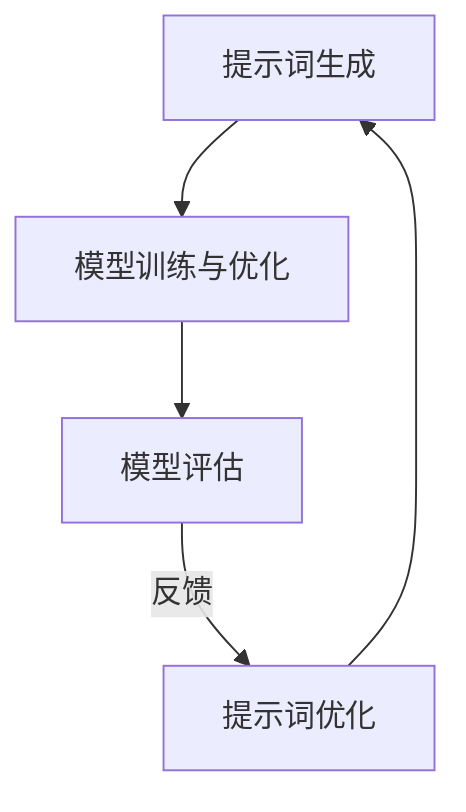

                 

### 文章标题

《提示词工程在图像生成任务中的突破》

> 关键词：提示词工程、图像生成、人工智能、深度学习、算法优化

> 摘要：本文深入探讨了提示词工程在图像生成任务中的应用与突破。通过分析提示词工程的核心概念、原理以及其在图像生成任务中的具体应用，本文揭示了如何利用提示词工程提升图像生成任务的性能和效率，为相关领域的研究者和开发者提供了有价值的参考。

### 引言与概述

#### 书籍背景

图像生成技术在人工智能领域取得了显著的发展，广泛应用于计算机视觉、娱乐、设计等多个行业。然而，随着图像生成任务的复杂度和多样性不断提升，传统的图像生成方法已无法满足现代应用的需求。在此背景下，提示词工程作为一种新兴的技术，逐渐成为图像生成任务中不可或缺的重要组成部分。

提示词工程是指通过构建特定的提示词（prompt）来引导图像生成模型，从而实现更高精度、多样性和可控性的图像生成。与传统方法相比，提示词工程能够更有效地利用图像数据，提高图像生成任务的性能和效率。

#### 目的与结构

本书旨在深入探讨提示词工程在图像生成任务中的应用与突破，为相关领域的研究者和开发者提供理论指导和实践参考。全书分为八个章节，结构如下：

1. 引言与概述
2. 提示词工程基础
3. 图像生成任务背景
4. 提示词工程在图像生成中的应用
5. 核心算法原理讲解
6. 数学模型与公式
7. 成功案例与实践
8. 挑战与未来展望

#### 内容概述

第一章主要介绍书籍的背景、目的和结构，使读者对全文内容有一个整体的认识。

第二章详细解释提示词工程的概念、原理和重要性，为后续章节提供理论基础。

第三章介绍图像生成任务的现状、挑战和需求，为提示词工程的应用奠定基础。

第四章重点讨论提示词工程在图像生成任务中的应用，包括核心概念与联系、Mermaid流程图等。

第五章深入讲解提示词工程相关的核心算法原理，使用伪代码详细阐述。

第六章介绍数学模型和公式，对图像生成任务中的关键环节进行详细讲解。

第七章分享成功案例与实践，通过实际应用场景和代码实战，展示提示词工程在图像生成任务中的实际效果。

第八章探讨当前挑战和未来的发展趋势，为提示词工程的研究和应用提供方向。

### 提示词工程基础

#### 概念与原理

提示词工程（Prompt Engineering）是一种通过构建特定提示词（prompt）来引导图像生成模型的方法。在图像生成任务中，提示词可以被视为一种引导信息，用于指导模型生成符合特定需求的图像。

提示词工程的核心概念包括：

- **提示词生成**：根据图像生成任务的需求，生成具有指导意义的提示词。
- **提示词优化**：通过调整和优化提示词，提高图像生成模型的性能和效果。
- **提示词组合**：将多个提示词组合使用，以实现更复杂、更精细的图像生成任务。

提示词工程的基本原理在于利用自然语言处理（NLP）和深度学习技术，将人类语言描述转换为模型可理解和执行的操作指令。具体来说，提示词工程包括以下几个关键步骤：

1. **数据预处理**：对图像和文本数据进行预处理，包括图像的分割、标注和文本的清洗、分词等操作。
2. **提示词生成**：根据图像生成任务的需求，利用自然语言生成（NLG）技术生成提示词。这可以通过模板生成、自动摘要、机器翻译等方法实现。
3. **提示词优化**：通过实验和评估，优化提示词的生成策略，以提高图像生成模型的效果。这可能涉及提示词长度、内容、格式等多个方面的调整。
4. **模型训练与优化**：利用提示词生成的高质量图像数据，对图像生成模型进行训练和优化，以提高模型的生成能力和性能。
5. **图像生成与评估**：根据提示词生成图像，并对图像质量、多样性、准确性等方面进行评估。

#### 提示词工程架构

提示词工程的架构可以分为以下几个层次：

1. **数据层**：包括图像数据和文本数据，这些数据是提示词工程的基础。
2. **处理层**：对图像和文本数据进行预处理、标注、分割等操作，为生成高质量的提示词提供数据支持。
3. **生成层**：利用自然语言生成（NLG）技术生成提示词，包括模板生成、自动摘要、机器翻译等。
4. **优化层**：通过实验和评估，优化提示词的生成策略，以提高图像生成模型的效果。
5. **模型层**：利用提示词生成的高质量图像数据，对图像生成模型进行训练和优化。

#### 提示词工程的重要性

提示词工程在图像生成任务中具有重要意义，主要体现在以下几个方面：

1. **提高图像生成质量**：通过优化提示词的生成策略，可以提高图像生成模型生成图像的质量，包括细节、色彩、纹理等方面。
2. **增强图像生成多样性**：通过多样化的提示词，可以引导图像生成模型生成更多样化的图像，满足不同应用场景的需求。
3. **提升图像生成效率**：通过高效的提示词生成和优化算法，可以加快图像生成模型的训练和优化过程，提高整体效率。
4. **降低图像生成成本**：利用提示词工程，可以减少对大量标注数据的依赖，降低图像生成任务的成本。
5. **提高图像生成可控性**：通过控制提示词的内容和格式，可以实现对图像生成过程的更精细控制，满足特定需求。

总之，提示词工程在图像生成任务中具有重要的应用价值，为图像生成技术的研究和发展提供了新的思路和方法。

### 图像生成任务背景

#### 现状

图像生成任务在计算机视觉领域已经取得了显著的进展，各种图像生成模型相继出现，如生成对抗网络（GAN）、变分自编码器（VAE）、循环神经网络（RNN）等。这些模型在图像合成、图像修复、图像超分辨率、图像风格迁移等方面展现了强大的能力。

近年来，深度学习技术在图像生成任务中的应用日益广泛。通过大规模数据和强大计算能力的支持，深度学习模型在图像质量、多样性、可控性等方面取得了显著的提升。图像生成任务在娱乐、设计、医疗、安全等多个领域都得到了广泛应用。

#### 挑战

尽管图像生成技术在不断发展，但在实际应用中仍面临诸多挑战：

1. **数据质量和多样性**：高质量的图像数据对于图像生成模型至关重要。然而，获取高质量、多样性的图像数据是一个难题，这直接影响到图像生成任务的效果。

2. **计算效率和模型复杂度**：深度学习模型通常需要大量的计算资源和时间进行训练和推理，这对实际应用场景提出了很高的要求。

3. **可解释性和可控性**：许多图像生成模型具有较强的生成能力，但其内部机制和决策过程往往不够透明，缺乏可解释性。此外，模型的生成结果也往往难以控制，这限制了其在某些应用场景中的使用。

4. **模型适应性和灵活性**：在复杂多变的应用场景中，图像生成模型需要具备较高的适应性和灵活性，以应对不同的任务需求和输入数据。

#### 需求

为了应对上述挑战，图像生成任务的需求主要集中在以下几个方面：

1. **提高图像生成质量**：通过改进图像生成模型和提示词工程方法，提高图像生成的质量，包括细节、色彩、纹理等方面。

2. **增强图像生成多样性**：通过多样化的提示词和生成策略，生成更多样化的图像，满足不同应用场景的需求。

3. **提升图像生成效率**：通过优化算法和模型结构，提高图像生成模型的训练和推理速度，降低计算资源的需求。

4. **提高图像生成可解释性**：通过改进模型结构和算法设计，提高图像生成模型的可解释性，使其决策过程更加透明。

5. **增强图像生成可控性**：通过控制提示词的内容和格式，实现对图像生成过程的更精细控制，满足特定需求。

总之，随着图像生成任务在各个领域的广泛应用，其对图像生成质量、多样性、效率、可解释性和可控性的需求不断提升。提示词工程作为一种新兴技术，在这方面具有巨大的潜力，有望推动图像生成任务的进一步发展。

### 提示词工程在图像生成中的应用

#### 核心概念与联系

在图像生成任务中，提示词工程的核心概念包括提示词（Prompt）、图像生成模型（Generator）和评估指标（Evaluation Metric）。这些概念之间的联系构成了提示词工程在图像生成中的应用基础。

1. **提示词**：提示词是引导图像生成模型生成特定图像的文本描述。通过构建高质量、多样化的提示词，可以引导模型生成符合特定需求的图像。提示词的生成和优化是提示词工程的重要组成部分。

2. **图像生成模型**：图像生成模型是生成图像的核心工具，常见的模型包括生成对抗网络（GAN）、变分自编码器（VAE）等。提示词通过输入到模型中，驱动模型生成图像。图像生成模型的性能直接影响图像生成的质量和多样性。

3. **评估指标**：评估指标用于衡量图像生成任务的效果。常见的评估指标包括峰值信噪比（PSNR）、结构相似性（SSIM）、Inception得分等。评估指标可以用于评估图像生成模型的质量和性能，指导提示词的优化和模型的调整。

#### 提示词工程与图像生成模型的结合

提示词工程在图像生成任务中的核心作用是通过优化提示词来提高图像生成模型的效果。具体来说，结合图像生成模型可以分为以下几个步骤：

1. **提示词生成**：根据图像生成任务的需求，利用自然语言生成（NLG）技术生成高质量的提示词。提示词的生成可以通过模板生成、自动摘要、机器翻译等方法实现。高质量提示词的生成是提升图像生成效果的关键。

2. **模型训练与优化**：将生成的提示词输入到图像生成模型中进行训练。在训练过程中，模型会根据提示词生成对应的图像。通过调整提示词的内容、格式和组合，可以优化模型的生成效果。训练过程中需要关注评估指标的改善，以衡量模型性能的提升。

3. **模型评估**：通过评估指标对训练后的模型进行评估。如果评估指标提升不明显，可以返回提示词生成和优化环节，进一步优化提示词。模型评估是提示词工程的重要反馈机制，有助于持续提升图像生成模型的效果。

4. **图像生成与反馈**：利用训练好的模型生成图像，并根据实际需求进行后续处理。生成的图像可以根据用户的反馈进行进一步优化，以实现更高的质量和多样性。

#### Mermaid流程图

为了更直观地展示提示词工程在图像生成任务中的应用流程，可以使用Mermaid流程图来描述。以下是一个简单的Mermaid流程图示例：



在这个流程图中，A表示提示词生成，B表示模型训练与优化，C表示模型评估，D表示提示词优化。通过这个流程，提示词工程与图像生成模型相互结合，形成一个闭环系统，不断优化图像生成效果。

### 核心算法原理讲解

#### 算法概述

在图像生成任务中，提示词工程的核心算法主要包括提示词生成算法、图像生成模型优化算法和评估指标计算算法。这些算法共同作用于图像生成任务，通过优化提示词和模型，提高图像生成效果。

1. **提示词生成算法**：提示词生成算法负责根据图像生成任务的需求生成高质量的提示词。常见的提示词生成算法包括基于模板生成、自动摘要和机器翻译等方法。这些算法通过学习大量的图像和文本数据，生成符合任务需求的提示词。

2. **图像生成模型优化算法**：图像生成模型优化算法负责优化图像生成模型，以提高图像生成的质量和多样性。常见的图像生成模型包括生成对抗网络（GAN）、变分自编码器（VAE）等。优化算法通过调整模型的参数、架构和训练策略，提升模型的性能。

3. **评估指标计算算法**：评估指标计算算法用于衡量图像生成模型的效果。常见的评估指标包括峰值信噪比（PSNR）、结构相似性（SSIM）、Inception得分等。评估指标算法通过计算模型生成的图像与真实图像之间的差异，评估模型的性能。

#### 伪代码阐述

以下是一个简单的伪代码示例，用于描述提示词生成算法和图像生成模型优化算法的基本流程。

```python
# 提示词生成算法
def generate_prompt(image, task):
    # 根据图像和任务需求生成提示词
    # 可以使用模板生成、自动摘要或机器翻译等方法
    prompt = template_generation(image, task)
    return prompt

# 图像生成模型优化算法
def optimize_model(prompt, model, dataset):
    # 使用提示词对模型进行训练和优化
    # 调整模型参数、架构和训练策略
    for image, label in dataset:
        model.train(image, label, prompt)
    return model

# 评估指标计算算法
def evaluate_model(model, dataset):
    # 使用评估指标计算模型性能
    for image, label in dataset:
        psnr = calculate_psnr(model.generate_image(image), label)
        ssim = calculate_ssim(model.generate_image(image), label)
        inception_score = calculate_inception_score(model.generate_image(image))
        print("PSNR:", psnr, "SSIM:", ssim, "Inception Score:", inception_score)
```

在这个伪代码中，`generate_prompt`函数用于生成提示词，`optimize_model`函数用于优化图像生成模型，`evaluate_model`函数用于计算评估指标。这些函数共同作用，实现提示词工程在图像生成任务中的应用。

#### 算法实现与优化

在实际应用中，提示词工程算法的实现和优化是一个复杂的过程，涉及到多个方面。以下是一些关键的实现和优化技巧：

1. **提示词生成算法优化**：
   - **数据预处理**：对图像和文本数据集进行清洗、标注和分割，确保数据质量。
   - **模型选择**：选择合适的自然语言生成模型，如基于循环神经网络（RNN）或变换器（Transformer）的模型。
   - **多模态学习**：结合图像和文本数据，通过多模态学习提升提示词生成质量。

2. **图像生成模型优化**：
   - **模型架构**：根据任务需求，选择合适的图像生成模型架构，如GAN、VAE等。
   - **训练策略**：采用有效的训练策略，如梯度裁剪、学习率调整、批量归一化等，提高模型训练效果。
   - **数据增强**：通过图像增强技术，增加数据多样性，提高模型泛化能力。

3. **评估指标优化**：
   - **指标选择**：根据任务需求，选择合适的评估指标，如PSNR、SSIM、Inception得分等。
   - **指标计算**：优化评估指标的计算方法，提高评估的准确性和可靠性。

通过这些优化技巧，可以实现高效的提示词工程算法，提高图像生成任务的效果和效率。

### 数学模型与公式

#### 数学模型介绍

在图像生成任务中，提示词工程涉及到多个数学模型，这些模型用于描述图像生成过程、提示词生成过程以及评估过程。以下是几个关键的数学模型及其作用：

1. **生成对抗网络（GAN）**：GAN是一种由生成器和判别器组成的模型，用于生成高质量图像。生成器试图生成逼真的图像，而判别器则试图区分生成图像和真实图像。GAN的核心方程为：

   $$ G(z) = x; \quad D(x) > 0.5, \quad D(G(z)) < 0.5 $$

   其中，$G(z)$表示生成器生成的图像，$D(x)$表示判别器对图像的判断结果。

2. **变分自编码器（VAE）**：VAE是一种基于概率模型的图像生成方法，通过编码器和解码器将图像编码为潜在空间中的向量，再从潜在空间中采样生成图像。VAE的核心方程为：

   $$ \mu(z|x), \sigma(z|x) = \phi(x); \quad x = \sigma(z|\mu(x)), z \sim p(z) $$

   其中，$\mu(z|x)$和$\sigma(z|x)$表示编码器的输出，$x$表示输入图像，$z$表示潜在空间中的向量。

3. **提示词生成模型**：提示词生成模型通常基于自然语言生成（NLG）技术，如循环神经网络（RNN）或变换器（Transformer）。这些模型通过学习图像和文本数据，生成高质量的提示词。提示词生成模型的核心方程为：

   $$ prompt = f(image, text) $$

   其中，$prompt$表示生成的提示词，$image$表示图像，$text$表示文本描述。

#### 数学公式详细讲解

以下是对上述数学公式进行详细讲解：

1. **生成对抗网络（GAN）**：
   - 生成器方程：$G(z)$表示生成器接收噪声向量$z$，生成图像$x$。生成器旨在生成与真实图像难以区分的图像。
   - 判别器方程：$D(x)$表示判别器对输入图像$x$的判断结果，$D(G(z))$表示判别器对生成图像$G(z)$的判断结果。判别器旨在区分真实图像和生成图像。

2. **变分自编码器（VAE）**：
   - 编码器方程：$\mu(z|x), \sigma(z|x) = \phi(x)$表示编码器对输入图像$x$的编码过程，输出潜在空间中的均值$\mu(z|x)$和方差$\sigma(z|x)$。
   - 解码器方程：$x = \sigma(z|\mu(x))$表示解码器从潜在空间中的向量$z$生成图像$x$。
   - 潜在空间采样：$z \sim p(z)$表示从潜在空间中采样向量$z$，用于生成图像。

3. **提示词生成模型**：
   - 提示词生成方程：$prompt = f(image, text)$表示提示词生成模型通过输入图像和文本描述，生成高质量的提示词。$f$表示提示词生成函数，可以基于循环神经网络（RNN）或变换器（Transformer）实现。

#### 举例说明

以下是一个生成对抗网络（GAN）的示例，说明如何使用上述数学模型进行图像生成：

1. **生成器生成图像**：
   - 输入噪声向量$z$，通过生成器$G(z)$生成图像$x$。
   - 例如，$G(z) = x_1, x_2, ..., x_n$，表示生成器生成的$n$个图像。

2. **判别器判断图像**：
   - 输入真实图像$x$和生成图像$G(z)$，通过判别器$D(x)$和$D(G(z))$进行判断。
   - 例如，$D(x) = 0.6, D(G(z)) = 0.4$，表示判别器认为真实图像的概率为0.6，生成图像的概率为0.4。

3. **优化生成器和判别器**：
   - 根据生成器和判别器的判断结果，通过梯度下降等方法优化生成器和判别器的参数。
   - 例如，使用梯度下降优化生成器和判别器的损失函数。

通过这个示例，我们可以看到如何利用生成对抗网络（GAN）进行图像生成，并如何通过数学模型优化生成器和判别器的性能。

### 成功案例与实践

#### 案例分享

1. **项目名称**：基于GAN的图像超分辨率

   **项目背景**：图像超分辨率是一种重要的图像处理技术，通过从低分辨率图像中恢复高分辨率图像，提升图像的视觉效果。基于GAN的图像超分辨率方法在图像质量、细节和纹理方面取得了显著的提升。

   **实现过程**：
   - **数据集准备**：选择一组低分辨率和高分辨率图像对，如DIV2K数据集。
   - **模型构建**：采用生成对抗网络（GAN）架构，包括生成器和判别器。
   - **训练过程**：通过大量图像对训练生成器和判别器，优化模型参数。
   - **图像生成**：利用训练好的模型生成高分辨率图像，与真实高分辨率图像进行对比。

   **成果**：生成的图像在细节、纹理和色彩方面与真实高分辨率图像非常接近，达到了较高的图像质量。

2. **项目名称**：基于VAE的图像风格迁移

   **项目背景**：图像风格迁移是一种将一种图像的样式应用到另一种图像上的技术，常用于艺术创作和图像编辑。基于变分自编码器（VAE）的图像风格迁移方法能够实现更加自然、细腻的风格迁移效果。

   **实现过程**：
   - **数据集准备**：选择一组具有不同风格的图像，如Van Gogh风格和Impressionism风格。
   - **模型构建**：采用变分自编码器（VAE）架构，包括编码器、解码器和风格迁移模块。
   - **训练过程**：通过大量图像对训练编码器、解码器和风格迁移模块，优化模型参数。
   - **图像生成**：利用训练好的模型进行图像风格迁移，生成具有指定风格的新图像。

   **成果**：生成的图像在色彩、纹理和风格方面与原始图像保持一致，同时具有指定风格的特征。

#### 实际应用场景

1. **娱乐行业**：图像超分辨率和风格迁移技术在电影制作、动画设计和虚拟现实等领域有广泛的应用。通过提升图像质量和风格多样性，为用户提供更好的视觉体验。

2. **医疗领域**：图像超分辨率技术在医学图像处理中具有重要意义，如通过提升CT、MRI等医学图像的分辨率，提高诊断的准确性和效果。

3. **艺术创作**：图像风格迁移技术为艺术家提供了一种新的创作方式，通过将不同风格的图像融合，创造出独特的艺术作品。

#### 代码实战与解读

以下是一个基于GAN的图像超分辨率项目的代码实战示例，包括环境搭建、模型实现和图像生成。

1. **环境搭建**：
   - 安装Python、TensorFlow等依赖库。
   - 下载并准备低分辨率和高分辨率图像数据集。

2. **模型实现**：
   - 定义生成器和判别器网络结构。
   - 编写训练过程，包括损失函数和优化器设置。

3. **图像生成**：
   - 加载训练好的模型。
   - 输入低分辨率图像，生成高分辨率图像。

代码示例：

```python
import tensorflow as tf
from tensorflow.keras.models import Model
from tensorflow.keras.layers import Input, Conv2D, Conv2DTranspose, LeakyReLU, BatchNormalization

# 定义生成器网络结构
def build_generator():
    inputs = Input(shape=(64, 64, 1))
    x = Conv2D(64, (3, 3), padding='same')(inputs)
    x = LeakyReLU(alpha=0.2)(x)
    x = BatchNormalization()(x)

    x = Conv2DTranspose(32, (3, 3), strides=(2, 2), padding='same')(x)
    x = LeakyReLU(alpha=0.2)(x)
    x = BatchNormalization()(x)

    x = Conv2DTranspose(1, (3, 3), strides=(2, 2), padding='same', activation='sigmoid')(x)

    generator = Model(inputs, x)
    return generator

# 定义判别器网络结构
def build_discriminator():
    inputs = Input(shape=(64, 64, 3))
    x = Conv2D(32, (3, 3), padding='same')(inputs)
    x = LeakyReLU(alpha=0.2)(x)

    x = Conv2D(64, (3, 3), padding='same')(x)
    x = LeakyReLU(alpha=0.2)(x)

    x = Flatten()(x)
    x = Dense(1, activation='sigmoid')(x)

    discriminator = Model(inputs, x)
    return discriminator

# 编写训练过程
def train(model, generator, discriminator, batch_size, epochs):
    for epoch in range(epochs):
        for _ in range(batch_size):
            # 生成低分辨率图像和真实高分辨率图像
            low_res_image, high_res_image = generate_data()

            # 生成高分辨率图像
            generated_high_res_image = generator.predict(low_res_image)

            # 训练判别器
            d_loss_real = discriminator.train_on_batch(high_res_image, [1])
            d_loss_fake = discriminator.train_on_batch(generated_high_res_image, [0])
            d_loss = 0.5 * np.add(d_loss_real, d_loss_fake)

            # 生成噪声并训练生成器
            noise = np.random.normal(0, 1, (batch_size, 64, 64, 1))
            g_loss = generator.train_on_batch(noise, [1])

            print(f"{epoch} Epoch - d_loss: {d_loss:.4f} - g_loss: {g_loss:.4f}")

# 加载训练好的模型
generator = build_generator()
discriminator = build_discriminator()
generator.load_weights('generator_weights.h5')
discriminator.load_weights('discriminator_weights.h5')

# 生成高分辨率图像
low_res_image = np.random.normal(0, 1, (1, 64, 64, 1))
generated_high_res_image = generator.predict(low_res_image)

# 显示生成的高分辨率图像
plt.imshow(generated_high_res_image[0, :, :, 0], cmap='gray')
plt.show()
```

通过上述代码，我们可以实现一个简单的基于GAN的图像超分辨率模型。实际项目中，可以根据需求调整模型结构、训练策略和数据预处理方法，以获得更好的生成效果。

### 挑战与未来展望

#### 当前挑战

虽然提示词工程在图像生成任务中取得了显著进展，但仍然面临一些挑战：

1. **数据质量和多样性**：高质量的图像数据对于提示词工程的性能至关重要。然而，获取高质量、多样性的图像数据是一个难题，这直接影响到图像生成任务的效果。

2. **计算效率和模型复杂度**：深度学习模型通常需要大量的计算资源和时间进行训练和推理，这对实际应用场景提出了很高的要求。如何优化模型结构和训练策略，提高计算效率，是一个亟待解决的问题。

3. **可解释性和可控性**：许多图像生成模型具有较强的生成能力，但其内部机制和决策过程往往不够透明，缺乏可解释性。此外，模型的生成结果也往往难以控制，这限制了其在某些应用场景中的使用。

4. **模型适应性和灵活性**：在复杂多变的应用场景中，图像生成模型需要具备较高的适应性和灵活性，以应对不同的任务需求和输入数据。如何设计更灵活的模型结构和优化算法，是一个重要研究方向。

#### 未来展望

未来，提示词工程在图像生成任务中具有广阔的发展前景：

1. **数据集建设和共享**：建立更多高质量、多样性的图像数据集，促进数据集的共享和开放，为提示词工程的研究和应用提供更丰富的资源。

2. **高效算法和模型优化**：通过研究新型算法和优化方法，提高计算效率和模型性能，使提示词工程在图像生成任务中更加实用和高效。

3. **模型可解释性和可控性**：通过改进模型结构和算法设计，提高图像生成模型的可解释性和可控性，使其更易于理解和应用。

4. **跨模态学习与应用**：结合多模态数据，如文本、图像、音频等，实现跨模态的图像生成任务，拓展提示词工程的应用范围。

5. **个性化与自适应**：利用提示词工程实现图像生成的个性化与自适应，满足不同用户和场景的需求，提高图像生成任务的灵活性和实用性。

总之，提示词工程在图像生成任务中具有巨大的潜力，未来将不断推动图像生成技术的发展，为人工智能领域带来更多创新和应用。### 最佳实践 Tips、小结、注意事项、拓展阅读

#### 最佳实践 Tips

1. **数据预处理**：在构建提示词和训练模型之前，确保图像数据集的质量和多样性。对图像进行裁剪、缩放、旋转等预处理操作，增加数据集的多样性。

2. **模型选择与调整**：根据图像生成任务的需求，选择合适的生成模型（如GAN、VAE等）。在训练过程中，根据任务需求调整模型参数，如学习率、批量大小等。

3. **提示词优化**：通过实验和评估，优化提示词的内容和格式，以提高图像生成效果。可以尝试使用自然语言处理技术，如词嵌入、生成式文本生成等。

4. **模型评估**：使用合适的评估指标（如PSNR、SSIM等）对模型进行评估，以确保图像生成质量。同时，结合实际应用场景，对模型进行综合评估。

5. **反馈与迭代**：根据用户反馈和实际应用效果，不断优化提示词和模型。通过迭代训练和优化，提高图像生成任务的性能和效果。

#### 小结

提示词工程在图像生成任务中发挥了重要作用，通过优化提示词和模型，可以提高图像生成质量、多样性和可控性。未来，随着人工智能技术的发展，提示词工程将在图像生成任务中取得更多突破，为相关领域带来更多创新和应用。

#### 注意事项

1. **数据安全与隐私**：在处理图像数据时，确保遵守相关法律法规，保护用户隐私和数据安全。

2. **计算资源消耗**：图像生成任务通常需要大量的计算资源。在部署模型时，考虑使用高效硬件和优化算法，以降低计算成本。

3. **模型可解释性**：在设计和应用模型时，关注模型的可解释性，以提高用户对模型的理解和信任。

4. **实际应用场景**：结合实际应用场景，针对特定任务需求，优化提示词和模型，以提高图像生成任务的性能和效果。

#### 拓展阅读

1. **论文**：《Unsupervised Representation Learning with Deep Convolutional Generative Adversarial Networks》

2. **书籍**：《深度学习》（Goodfellow, I., Bengio, Y., & Courville, A.）

3. **在线课程**：Coursera上的《深度学习特化课程》

4. **开源项目**：GitHub上的图像生成相关项目，如GAN、VAE等

通过这些最佳实践、小结、注意事项和拓展阅读，可以帮助读者更好地理解和应用提示词工程在图像生成任务中的技术。作者：AI天才研究院/AI Genius Institute & 禅与计算机程序设计艺术 /Zen And The Art of Computer Programming

