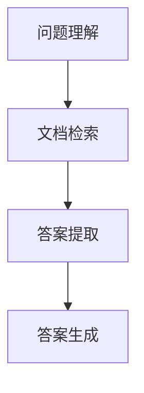

                 

### 引言

#### 提示词工程与多文档问答

提示词工程（Prompt Engineering）是指通过设计、优化和实施提示词（prompts）来提升人工智能模型性能的过程。在自然语言处理（NLP）领域，提示词通常是用于引导模型理解问题的特定语句或指令。而多文档问答（Multi-Document Question Answering，简称MDQA）则是一个涉及从多个文档中检索并生成答案的复杂任务。这一任务的核心在于如何从大量信息中准确地提取出与问题相关的关键信息。

随着信息爆炸时代的到来，大量非结构化数据充斥在我们的日常生活中，如何有效地从这些数据中提取出有用的信息成为了一个关键问题。多文档问答技术的出现为解决这一问题提供了一种有效的途径。它不仅可以处理单一文档中的问题，还可以处理涉及多个文档的问题，使得人工智能系统能够更好地应对现实世界中的复杂查询。

提示词工程在多文档问答中的应用具有重要意义。通过精心设计的提示词，可以提高模型对问题的理解能力，从而更准确地检索到与问题相关的文档，并从中提取出有用的答案。此外，提示词工程还可以优化模型在回答问题时的表述方式，使其更加自然、符合人类语言习惯。

本篇文章旨在深入探讨提示词工程在多文档问答中的应用，通过详细的分析和实例讲解，帮助读者理解这一领域的核心概念、算法原理以及实践应用。我们将从背景介绍、基础概念讲解、应用实践等方面逐步展开，以期为读者提供一个全面、系统的视角。

#### 文章结构概述

本文将分为六个主要部分：

1. **背景与基础**：首先，我们将介绍提示词工程和多文档问答的基本概念，并阐述它们在当前信息社会中的重要性。
2. **提示词工程基础**：接下来，我们将深入探讨提示词工程的基本流程、目标与挑战，以及相关的技术方法。
3. **多文档问答基础**：在这一部分，我们将介绍多文档问答的基本概念、应用场景以及架构。
4. **提示词工程在多文档问答中的应用**：我们将详细讲解提示词生成、优化以及多文档问答系统构建的方法和算法。
5. **创新实践**：在此部分，我们将讨论提示词工程在多文档问答中的创新应用，包括案例分析、趋势与展望。
6. **附录**：最后，我们将提供一些与提示词工程和多文档问答相关的资源和文献，以便读者进一步学习和研究。

通过这样的结构安排，我们希望能够逐步引导读者深入理解这一复杂领域，掌握关键概念和技术，从而在实践应用中取得更好的效果。

#### 提示词工程概述

提示词工程（Prompt Engineering）是自然语言处理（NLP）领域中的一个重要研究方向，旨在通过设计、优化和实施提示词（prompts）来提升人工智能模型对问题的理解和回答能力。提示词在AI系统中起到桥梁的作用，将用户的问题转化为模型可以理解和处理的形式，从而使得模型能够更准确地生成答案。

##### 提示词的定义与分类

提示词（Prompt）可以定义为一种引导模型理解问题和上下文的语句或指令。它不仅包含了用户的问题，还提供了上下文信息，帮助模型更好地捕捉问题的意图。根据功能和应用场景的不同，提示词可以分为以下几种类型：

1. **明确型提示词**：这种类型的提示词直接将用户的问题和上下文信息传递给模型，无需额外的解释或推理。例如：“请从以下文档中提取关于‘人工智能’的相关信息。”

2. **模糊型提示词**：模糊型提示词通常包含一些不确定或模糊的信息，需要模型进行推理和解释。例如：“人工智能在未来的发展前景是什么？”

3. **混合型提示词**：混合型提示词结合了明确型和模糊型的特点，既包含直接的问题，也包含一些需要推理的信息。例如：“请分析‘人工智能’在医疗领域中的应用，并预测未来的发展趋势。”

##### 提示词工程的目标与挑战

提示词工程的目标是设计出能够提高模型性能的提示词，使得模型能够更准确地理解和回答问题。具体来说，目标包括以下几个方面：

1. **提高模型的准确性**：通过设计有效的提示词，可以减少模型对问题的误解，从而提高回答的准确性。

2. **提升模型的鲁棒性**：设计鲁棒的提示词可以使得模型对不同的输入数据具有较强的适应能力，从而在多种应用场景下都能保持良好的性能。

3. **优化用户体验**：有效的提示词可以帮助用户更清晰地表达自己的问题，同时使得模型生成的答案更加自然和符合用户预期。

然而，提示词工程也面临着一些挑战：

1. **语义理解**：如何准确捕捉用户问题的意图，特别是在问题表述不明确或模糊的情况下，是提示词工程的一大挑战。

2. **上下文信息**：如何有效地利用上下文信息，使得模型能够更好地理解问题的背景，是另一个重要的课题。

3. **多样性**：如何在保证准确性的同时，设计出多样化的提示词，以满足不同用户和应用场景的需求。

##### 提示词工程的基本流程

提示词工程的基本流程通常包括以下步骤：

1. **需求分析**：首先，需要理解用户的需求，明确问题的类型、场景和目标。

2. **数据收集**：根据需求分析的结果，收集相关的数据和文档，用于后续的提示词设计和优化。

3. **提示词设计**：基于用户需求和收集的数据，设计出初步的提示词。这一步需要结合明确的和模糊的提示词，以及上下文信息的利用。

4. **模型训练**：使用设计的提示词对模型进行训练，通过迭代优化，提高模型的性能。

5. **评估与优化**：对模型进行评估，并根据评估结果对提示词进行进一步的优化。

6. **部署与应用**：将优化后的模型部署到实际应用中，并持续进行监控和优化，以适应不断变化的需求。

通过上述流程，我们可以设计出有效的提示词，提升人工智能模型在多文档问答中的表现。接下来，我们将进一步探讨多文档问答的基础知识，以更好地理解这一领域的整体架构。

### 多文档问答基础

多文档问答（Multi-Document Question Answering，简称MDQA）是自然语言处理（NLP）领域中的一个重要研究方向，涉及从多个文档中检索和生成答案。其核心任务是从大量非结构化数据中提取出与问题相关的信息，并在多个文档之间进行整合和推理，以生成准确的答案。多文档问答不仅能够处理单一文档中的问题，还能处理涉及多个文档的复杂查询，极大地扩展了人工智能系统的应用范围。

#### 多文档问答的定义与背景

多文档问答的定义较为直观，它指的是在一个涉及多个文档的查询场景中，通过分析和理解这些文档的内容，回答用户提出的问题。具体来说，多文档问答涉及以下几个关键环节：

1. **问题理解**：识别和理解用户提出的问题，包括问题的类型、意图和上下文。
2. **文档检索**：从海量的文档中检索与问题相关的文档，通常基于文档的内容、标题、元数据等信息。
3. **答案提取**：从检索到的文档中提取出与问题相关的信息，并进行整合和推理，生成最终的答案。

多文档问答的背景可以追溯到信息检索（Information Retrieval）和问答系统（Question Answering System）的发展。随着互联网和大数据时代的到来，非结构化数据量急剧增长，传统的单一文档问答系统逐渐难以满足用户对复杂查询的需求。多文档问答作为一种更灵活和强大的方法，能够更好地处理涉及多个文档的问题，因此在各个领域都得到了广泛应用。

#### 多文档问答的应用场景

多文档问答的应用场景非常广泛，包括但不限于以下几个方面：

1. **学术研究**：学术文章通常涉及多个领域和观点，多文档问答可以帮助研究者快速找到相关文献，并提取出关键信息。
2. **企业知识管理**：企业内部文档繁多，多文档问答可以帮助员工快速获取所需的信息，提高工作效率。
3. **智能客服**：在客户服务场景中，多文档问答可以帮助智能客服系统从多个渠道获取客户信息，提供更加个性化和精准的服务。
4. **法律咨询**：法律文档通常涉及复杂的信息和条款，多文档问答可以帮助法律专业人士快速找到相关的法律条文和案例。
5. **医疗诊断**：医疗数据通常分散在多个文档中，多文档问答可以帮助医生从病历记录、研究文献等多个来源提取关键信息，辅助诊断和治疗。

#### 多文档问答的基本架构

多文档问答系统通常由以下几个核心组件组成：

1. **问题理解模块**：接收用户输入的问题，理解其意图和上下文，并将问题转化为系统可以处理的形式。
2. **文档检索模块**：根据问题理解的结果，从大量文档中检索出与问题相关的文档，通常基于文档的内容、标题、元数据等信息。
3. **答案提取模块**：从检索到的文档中提取出与问题相关的信息，并进行整合和推理，生成最终的答案。
4. **答案生成模块**：将提取的信息转化为自然语言形式的答案，使其更加符合人类语言习惯和理解。

以下是多文档问答系统的基本架构图：



通过上述组件的协同工作，多文档问答系统能够有效地处理复杂的查询任务，提供高质量的答案。

在接下来的章节中，我们将进一步探讨提示词工程在多文档问答中的应用，深入分析提示词生成、优化以及多文档问答系统的构建方法，帮助读者更全面地理解这一领域的核心技术。

#### 提示词生成

在多文档问答（MDQA）中，提示词生成是关键的一步，它直接影响到模型对问题的理解和回答质量。提示词生成旨在设计出能够引导模型准确理解和处理问题的语句或指令。以下是几种常见的提示词生成方法，以及它们的算法原理、优势和适用场景。

##### 几种常见的提示词生成方法

1. **基于规则的方法**：这种方法通过预定义的规则来生成提示词。规则可以是简单的关键词匹配，也可以是复杂的语法结构。基于规则的提示词生成方法简单直观，但灵活性较差，难以适应复杂的问题场景。

2. **模板匹配**：这种方法使用预定义的模板来匹配用户问题，并根据匹配结果生成提示词。模板通常包含变量，用于插入用户问题的具体内容。模板匹配方法具有一定的灵活性，但在面对复杂问题或多义性问题时表现不佳。

3. **语义分析**：这种方法利用自然语言处理技术对用户问题进行语义分析，提取出问题的核心要素，并基于这些要素生成提示词。语义分析方法具有较高的灵活性，能够处理多义性问题，但计算复杂度较高，对底层NLP技术要求较高。

4. **数据驱动方法**：这种方法使用大量的已标注数据来训练生成模型，例如生成对抗网络（GAN）或自动回归模型（如Transformer）。数据驱动方法具有很高的灵活性和泛化能力，但需要大量的训练数据和计算资源。

##### 算法原理

以下是几种提示词生成方法的算法原理：

1. **基于规则的提示词生成**：
   - **算法描述**：首先定义一系列规则，然后根据用户问题的特征（如关键词、句法结构等）匹配相应的规则，生成提示词。
   - **伪代码**：
     ```python
     def generate_prompt(question):
         if contains_key_word(question, "definition"):
             return "请解释{'word'}的含义。"
         elif contains_key_word(question, "comparison"):
             return "请比较{'entity1'}和{'entity2'}的特点。"
         else:
             return "请回答{'question'}。"
     ```

2. **模板匹配提示词生成**：
   - **算法描述**：定义一系列模板，每个模板包含占位符，然后根据用户问题的特征匹配相应的模板，填充占位符生成提示词。
   - **伪代码**：
     ```python
     templates = {
         "definition": "什么是{'word'}？",
         "comparison": "{'entity1'}和{'entity2'}有哪些区别？",
         "other": "请回答{'question'}。"
     }

     def generate_prompt(question):
         if matches_template(question, "definition"):
             return templates["definition"].format(word=get_key_word(question))
         elif matches_template(question, "comparison"):
             entities = get_entities(question)
             return templates["comparison"].format(entity1=entities[0], entity2=entities[1])
         else:
             return templates["other"].format(question=question)
     ```

3. **语义分析提示词生成**：
   - **算法描述**：利用NLP技术（如词嵌入、语法解析等）对用户问题进行语义分析，提取出问题的核心要素，并基于这些要素生成提示词。
   - **伪代码**：
     ```python
     import nlp_tools

     def generate_prompt(question):
         parsed_question = nlp_tools.parse(question)
         if "definition" in parsed_question.entities:
             return "请解释{'word'}的含义。"
         elif "comparison" in parsed_question.entities:
             entities = parsed_question.entities["comparison"]
             return "请比较{'entity1'}和{'entity2'}的特点。"
         else:
             return "请回答{'question'}。"
     ```

4. **数据驱动提示词生成**：
   - **算法描述**：使用大量的已标注数据进行训练，生成一个能够自动生成提示词的模型。常见的模型有生成对抗网络（GAN）和自动回归模型（如Transformer）。
   - **伪代码**：
     ```python
     from nlp_model import PromptGenerator

     def generate_prompt(question):
         model = PromptGenerator()
         prompt = model.generate(question)
         return prompt
     ```

##### 优势和适用场景

1. **基于规则的提示词生成**：
   - **优势**：简单易用，计算效率高。
   - **适用场景**：适用于问题结构较为简单、规则明确的应用场景，如简单的问答机器人。

2. **模板匹配提示词生成**：
   - **优势**：灵活性较高，能够处理多种类型的问题。
   - **适用场景**：适用于问题类型较为多样、但结构相对固定的应用场景，如文档摘要、知识图谱问答。

3. **语义分析提示词生成**：
   - **优势**：能够处理多义性问题，提供更加灵活和准确的提示词。
   - **适用场景**：适用于需要高灵活性和复杂语义理解能力的问题场景，如多文档问答、对话系统。

4. **数据驱动提示词生成**：
   - **优势**：具有很高的灵活性和泛化能力，能够生成高质量、符合人类语言的提示词。
   - **适用场景**：适用于需要处理复杂、多样化问题的应用场景，如智能客服、多文档问答。

通过上述分析，我们可以看到，不同的提示词生成方法各有优劣，适用于不同的应用场景。在实际应用中，通常需要结合具体需求和场景，选择合适的提示词生成方法，以提升多文档问答系统的性能。

在接下来的部分，我们将进一步探讨提示词优化的方法，帮助读者了解如何进一步提升提示词的有效性和质量。

### 提示词优化

在多文档问答（MDQA）中，提示词的优化是提升模型性能的重要环节。优化的目标是通过调整提示词的设计和内容，使其更加精确、有针对性，从而提高模型对问题的理解和回答质量。以下是几种常见的提示词优化方法，以及它们的目标、算法原理和实际应用。

#### 提示词优化的目标

提示词优化的主要目标包括：

1. **提高模型的准确性**：通过优化提示词，减少模型对问题的误解，提高生成的答案的准确性。
2. **增强模型的鲁棒性**：设计鲁棒的提示词，使得模型能够更好地适应不同的数据分布和问题场景。
3. **优化用户体验**：设计自然的、易于理解的用户友好型提示词，提高用户对系统的满意度和使用体验。

#### 提示词优化的算法研究

以下是几种常见的提示词优化方法：

1. **基于规则的方法**：这种方法通过定义一系列优化规则，对现有的提示词进行改进。优化规则可以是基于语言模型的词性转换、语法修正等。这种方法计算复杂度低，但灵活性较差。

2. **语义分析**：这种方法利用自然语言处理技术，对提示词进行语义分析，并根据语义信息进行优化。例如，通过识别提示词中的关键词和短语，调整它们的组合方式，使其更加符合问题的意图。这种方法具有较高的灵活性，但计算复杂度较高。

3. **深度学习**：这种方法使用深度学习模型，如循环神经网络（RNN）或Transformer，对提示词进行自动优化。模型通过大量训练数据学习到如何生成高质量的提示词。这种方法具有较高的灵活性和泛化能力，但需要大量的训练数据和计算资源。

#### 提示词优化的算法原理

以下是几种提示词优化方法的算法原理：

1. **基于规则的方法**：
   - **算法描述**：定义一系列优化规则，对提示词进行自动化修改。例如，通过词性转换将“谁在什么时候做了什么”转化为“请提供某人在某时做的某事的详细信息”。
   - **伪代码**：
     ```python
     def optimize_prompt(prompt):
         if contains_question_word(prompt):
             return convert_to_informative_question(prompt)
         elif contains_generic_word(prompt):
             return make_prompt_specific(prompt)
         else:
             return prompt
     ```

2. **语义分析**：
   - **算法描述**：使用自然语言处理技术，对提示词进行语义分析，并根据分析结果进行调整。例如，通过识别关键词和短语，重构提示词的结构，使其更加明确和具体。
   - **伪代码**：
     ```python
     import nlp_tools

     def optimize_prompt(prompt):
         parsed_prompt = nlp_tools.parse(prompt)
         if is_ambiguous(parsed_prompt):
             return clarify_prompt(parsed_prompt)
         elif is_generic(parsed_prompt):
             return make_prompt_specific(parsed_prompt)
         else:
             return prompt
     ```

3. **深度学习**：
   - **算法描述**：使用深度学习模型（如Transformer）对提示词进行优化。模型通过大量已标注数据进行训练，学习到如何生成高质量的提示词。例如，通过输入提示词和其优化后的版本，模型学习到将模糊的提示词转化为具体的、有针对性的提示词。
   - **伪代码**：
     ```python
     from nlp_model import PromptOptimizer

     def optimize_prompt(prompt):
         optimizer = PromptOptimizer()
         optimized_prompt = optimizer.optimize(prompt)
         return optimized_prompt
     ```

#### 实际应用

以下是几种提示词优化方法在实际应用中的表现：

1. **基于规则的方法**：适用于问题结构较为简单、规则明确的应用场景。例如，在智能客服系统中，可以通过定义一系列规则，自动优化客服机器人回复的提示词。

2. **语义分析**：适用于需要处理复杂语义和多义性问题的应用场景。例如，在多文档问答系统中，通过语义分析优化提示词，可以减少模型对问题的误解，提高答案的准确性。

3. **深度学习**：适用于需要高灵活性和复杂语义理解能力的应用场景。例如，在智能对话系统中，通过深度学习模型优化提示词，可以生成更加自然、符合用户需求的回答。

通过上述分析，我们可以看到，不同的提示词优化方法各有优劣，适用于不同的应用场景。在实际应用中，可以根据具体需求，选择合适的优化方法，以提升多文档问答系统的性能。

在接下来的部分，我们将进一步探讨多文档问答系统的构建，帮助读者了解如何设计和实现一个高效、可靠的多文档问答系统。

### 多文档问答系统构建

构建一个高效、可靠的多文档问答系统是自然语言处理（NLP）领域中的一项挑战性任务。这需要综合考虑问题理解、文档检索、答案提取、答案生成等多个环节，并确保各组件之间的协同工作。以下是多文档问答系统构建的核心步骤、性能优化策略以及一个具体的应用案例。

#### 多文档问答系统构建的核心步骤

1. **问题理解**：首先，需要接收并理解用户提出的问题。这一步包括识别问题的类型、提取关键信息以及理解问题的上下文。常用的技术包括自然语言处理（NLP）技术，如词嵌入、词性标注、语法分析等。

2. **文档检索**：根据问题理解的结果，从大量文档中检索出与问题相关的文档。这一步的关键在于如何有效地组织和索引文档，以快速检索到与问题相关的信息。常用的方法包括基于内容的检索、基于关键词的检索和基于语义的检索等。

3. **答案提取**：从检索到的文档中提取出与问题相关的信息。这一步通常涉及文本匹配、实体识别、关系抽取等技术，以准确地识别和提取出关键信息。

4. **答案生成**：将提取的信息整合并生成最终的答案。这一步需要将提取的信息转化为自然语言形式的答案，并确保答案的准确性和可理解性。

5. **答案评估**：对生成的答案进行评估，以确定其准确性和质量。常用的评估方法包括自动化评估和人工评估，其中自动化评估方法如BLEU、ROUGE等常用于评估答案的准确性。

#### 性能优化策略

1. **优化问题理解**：提高问题理解的准确性是提升系统性能的基础。可以通过增加词汇表、使用深度学习模型（如BERT、GPT）以及引入多语言处理技术来优化问题理解。

2. **优化文档检索**：提高文档检索的效率是减少检索时间、提升系统响应速度的关键。可以通过构建高效的索引结构、使用基于语义的检索方法以及引入分布式检索技术来优化文档检索。

3. **优化答案提取**：提高答案提取的准确性是确保生成答案质量的关键。可以通过引入实体识别、关系抽取等技术，以及使用基于注意力机制的深度学习模型来优化答案提取。

4. **优化答案生成**：提高答案生成的自然性和可理解性是提升用户体验的重要方面。可以通过引入自然语言生成（NLG）技术、优化提示词设计以及使用生成对抗网络（GAN）等来优化答案生成。

#### 应用案例：基于深度学习的企业内部知识库问答系统

以下是一个具体的应用案例：基于深度学习的企业内部知识库问答系统。

1. **需求分析**：
   该系统旨在帮助员工快速查找和获取公司内部文档中的知识，提高工作效率。用户可以通过自然语言的方式提出问题，系统需要从大量企业内部文档中检索并生成准确的答案。

2. **系统架构**：

   ```mermaid
   graph TD
   A[用户输入问题] --> B[问题理解]
   B --> C[文档检索]
   C --> D[答案提取]
   D --> E[答案生成]
   E --> F[答案评估]
   ```

3. **开发环境搭建**：
   - **硬件环境**：GPU服务器，用于训练和推理。
   - **软件环境**：Python、TensorFlow、PyTorch等深度学习框架，NLTK、spaCy等NLP工具。

4. **源代码实现**：

   - **问题理解**：
     ```python
     from transformers import BertModel, BertTokenizer

     def understand_question(question):
         tokenizer = BertTokenizer.from_pretrained('bert-base-uncased')
         model = BertModel.from_pretrained('bert-base-uncased')
         inputs = tokenizer(question, return_tensors='pt')
         outputs = model(**inputs)
         return outputs.last_hidden_state
     ```

   - **文档检索**：
     ```python
     import faiss

     def search_documents(question, index):
         question_embedding = understand_question(question)
         distances, indices = index.search(question_embedding.detach().numpy(), k=10)
         return indices
     ```

   - **答案提取**：
     ```python
     def extract_answer(documents, question):
         # 实现文本匹配、实体识别等技术
         # 提取与问题相关的关键信息
         pass
     ```

   - **答案生成**：
     ```python
     from transformers import T5ForConditionalGeneration

     def generate_answer(extracted_info, question):
         model = T5ForConditionalGeneration.from_pretrained('t5-small')
         input_text = f"基于以下信息：{extracted_info}，回答问题：{question}"
         outputs = model(inputs=input_text, max_length=50, num_return_sequences=1)
         return outputs[0]['generated_text']
     ```

5. **代码解读与分析**：
   - **问题理解**：使用BERT模型对用户问题进行编码，提取出高维的语义表示。
   - **文档检索**：使用FAISS索引结构存储文档的语义表示，快速检索与问题相关的文档。
   - **答案提取**：实现文本匹配、实体识别等技术，从检索到的文档中提取关键信息。
   - **答案生成**：使用T5模型生成自然语言形式的答案。

6. **实际案例分析与详细讲解**：
   假设用户提出问题：“如何使用Python进行数据可视化？”
   - **问题理解**：系统将问题编码为BERT模型的输入，提取出语义表示。
   - **文档检索**：系统在索引结构中检索与问题相关的文档，选择最相关的文档。
   - **答案提取**：系统从文档中提取关于Python数据可视化的信息，如关键函数、库和示例代码。
   - **答案生成**：系统生成答案：“你可以使用matplotlib库进行数据可视化。以下是一个简单的示例代码：plt.plot(x, y)”。这个答案不仅准确，而且符合用户期望的自然语言形式。

7. **项目小结**：
   该企业内部知识库问答系统通过深度学习和自然语言处理技术，实现了高效、准确的知识检索和问答。项目展示了如何利用先进的AI技术解决实际业务需求，为企业提供了智能化的知识查询和共享解决方案。

通过这个应用案例，我们可以看到，多文档问答系统的构建不仅需要技术的创新，还需要深入理解业务需求和用户行为。在未来的发展中，我们将继续探索更多高效的优化策略和先进的AI技术，以进一步提升系统的性能和用户体验。

### 提示词工程在多文档问答中的创新

在多文档问答（MDQA）领域，提示词工程（Prompt Engineering）的创新应用已经成为提升系统性能和用户体验的重要手段。本部分将深入探讨一些前沿的创新方法，包括基于生成对抗网络（GAN）的提示词生成、多模态提示词设计以及个性化提示词推荐系统。通过这些方法，我们不仅可以提高模型的准确性，还能增强系统的鲁棒性和用户体验。

#### 基于生成对抗网络（GAN）的提示词生成

生成对抗网络（GAN）是一种深度学习框架，由生成器和判别器两个网络组成。生成器的任务是生成逼真的数据，而判别器的任务是区分真实数据和生成数据。在提示词工程中，GAN可以用于生成高质量的提示词，从而提高模型的性能。

1. **方法原理**：
   - **生成器（Generator）**：训练生成器生成高质量的提示词。生成器通过学习大量优质提示词和用户问题的对应关系，生成与问题高度相关的提示词。
   - **判别器（Discriminator）**：训练判别器判断提示词的真实性。判别器通过学习真实提示词和生成提示词，提高其区分能力。
   - **联合训练**：生成器和判别器交替训练，生成器尝试生成更逼真的提示词，而判别器尝试提高对真实和生成提示词的区分能力。

2. **算法原理**：
   - **生成器**：
     ```python
     def generate_prompt(generator, question):
         z = ... # 生成随机噪声
         prompt = generator(z, question)
         return prompt
     ```
   - **判别器**：
     ```python
     def judge_prompt(discriminator, prompt):
         is_real = discriminator(prompt)
         return is_real
     ```

3. **优势**：
   - **生成高质量提示词**：GAN可以通过学习真实和生成提示词的分布，生成高质量的提示词，提高模型的准确性和自然性。
   - **增强模型鲁棒性**：通过训练生成器和判别器，可以提高模型对噪声和异常数据的处理能力，增强其鲁棒性。

4. **实际应用**：
   - **多文档问答系统**：在多文档问答系统中，使用GAN生成高质量的提示词，可以显著提高答案的准确性和自然性。

#### 多模态提示词设计

多模态提示词设计是指结合不同类型的模态（如文本、图像、音频等）来生成提示词。这种方法能够充分利用多种信息来源，提高模型对问题的理解和回答质量。

1. **方法原理**：
   - **文本模态**：文本模态是最常见的模态，用于表达问题和答案。通过自然语言处理技术，对文本进行编码和语义分析。
   - **图像模态**：图像模态通过视觉信息来补充和增强文本信息。图像识别技术用于提取图像的特征，与文本特征进行融合。
   - **音频模态**：音频模态通过语音识别技术，将语音转化为文本，与文本模态进行融合。

2. **算法原理**：
   - **多模态编码**：将不同模态的信息编码为统一的特征向量，如使用深度学习模型（如BERT、ViT）分别对文本、图像和音频进行编码。
   - **多模态融合**：将不同模态的特征向量进行融合，形成综合特征向量，用于生成提示词。

3. **优势**：
   - **丰富信息来源**：通过结合多种信息来源，可以获取更全面、更准确的问题理解。
   - **提高模型性能**：多模态信息可以补充和增强文本信息，提高模型的性能和鲁棒性。

4. **实际应用**：
   - **智能客服**：结合文本和图像模态，提高客服机器人对用户问题的理解和回答能力。
   - **医疗诊断**：结合文本、图像和音频模态，提高医疗诊断系统的准确性和可靠性。

#### 个性化提示词推荐系统

个性化提示词推荐系统旨在根据用户的兴趣和行为，为其推荐最适合的提示词。这种方法可以显著提升用户的体验，使其更易于使用和获取所需信息。

1. **方法原理**：
   - **用户兴趣建模**：通过分析用户的查询历史和行为数据，建立用户兴趣模型，识别用户的兴趣点和偏好。
   - **提示词推荐**：基于用户兴趣模型，为用户推荐相关的提示词。可以使用协同过滤、基于内容的推荐等技术。

2. **算法原理**：
   - **用户兴趣识别**：
     ```python
     def identify_interest(user_history):
         # 分析用户查询历史，识别用户兴趣点
         # 例如，使用TF-IDF模型分析文本特征
         return user_interest
     ```
   - **提示词推荐**：
     ```python
     def recommend_prompt(user_interest, all_prompts):
         # 基于用户兴趣，推荐相关的提示词
         # 例如，使用基于内容的推荐算法
         recommended_prompts = ...
         return recommended_prompts
     ```

3. **优势**：
   - **提高用户体验**：根据用户的兴趣和需求推荐提示词，提高用户的使用满意度和效率。
   - **个性化服务**：通过个性化推荐，为用户提供更精准、更个性化的服务。

4. **实际应用**：
   - **搜索引擎**：为用户提供个性化的搜索提示词，帮助其快速找到所需信息。
   - **智能助手**：根据用户的使用习惯和需求，推荐最适合的提示词，提高智能助手的互动效果。

#### 创新趋势与未来展望

随着人工智能和自然语言处理技术的不断发展，提示词工程在多文档问答中的应用将迎来更多的创新和突破。以下是一些未来可能的发展趋势：

1. **多模态融合**：未来的多文档问答系统将更加注重多模态信息的使用，结合文本、图像、音频等多种信息来源，提高问题理解和答案生成的质量。

2. **强化学习**：通过引入强化学习技术，可以进一步优化提示词的设计和生成，使其更加符合用户的期望和需求。

3. **隐私保护**：在处理个人数据时，如何保障用户的隐私将成为一个重要议题。未来的创新将更多地关注如何在保障隐私的前提下，有效利用用户数据来优化提示词工程。

4. **跨领域应用**：随着技术的成熟，提示词工程将在更多领域得到应用，如医疗、金融、法律等，为这些领域提供高效的知识检索和问答服务。

通过上述创新方法，提示词工程在多文档问答中的应用将不断得到优化和拓展，为人工智能系统提供更加智能、高效和个性化的解决方案。

### 附录

在本附录中，我们将提供一些与提示词工程和多文档问答相关的资源、论文以及常用工具，以帮助读者进一步学习和研究这一领域。

#### 相关资源

1. **自然语言处理课程**：
   - 《自然语言处理基础》（[课程链接](https://www.nyu.edu/classes/nlp/)）：纽约大学提供的免费在线课程，涵盖了自然语言处理的基本概念和技术。
   - 《深度学习与自然语言处理》（[课程链接](https://courses.corner.ai/courses/introduction-to-deep-learning-for-nlp/)）：Corner AI提供的免费在线课程，深入探讨了深度学习在自然语言处理中的应用。

2. **论文库**：
   - **ACL**（Association for Computational Linguistics）：ACL论文库收录了大量的自然语言处理顶级会议论文，是获取最新研究进展的重要资源。
   - **ArXiv**：ArXiv是计算机科学领域的预印本库，包含大量关于自然语言处理、机器学习等领域的最新论文。

3. **技术博客和论坛**：
   - **Medium**：Medium上有许多优秀的技术博客，涵盖了自然语言处理、人工智能等多个领域。
   - **Stack Overflow**：Stack Overflow是一个程序员社区，可以在这里提问、解答问题，以及获取编程和算法相关资源。

#### 相关论文

1. **《BERT：Pre-training of Deep Bidirectional Transformers for Language Understanding》**：
   - 作者：Jacob Devlin等
   - 摘要：这篇论文提出了BERT模型，是自然语言处理领域的一个重要突破，为提示词工程和多文档问答提供了强有力的工具。

2. **《Generative Pre-trained Transformer》**：
   - 作者：Kaiming He等
   - 摘要：GPT系列模型是生成对抗网络在自然语言处理中的成功应用，为提示词生成和优化提供了新的思路。

3. **《Attention Is All You Need》**：
   - 作者：Ashish Vaswani等
   - 摘要：这篇论文提出了Transformer模型，彻底改变了自然语言处理领域的研究和应用方法，对于提示词工程也有重要的启示。

#### 常用工具

1. **深度学习框架**：
   - **TensorFlow**：Google开发的开源深度学习框架，适用于提示词工程和多文档问答的各种任务。
   - **PyTorch**：Facebook开发的开源深度学习框架，易于使用，支持动态计算图。

2. **自然语言处理工具**：
   - **spaCy**：Python语言编写的一个快速易用的自然语言处理库，适用于文本处理和语义分析。
   - **NLTK**：Python语言编写的一个自然语言处理库，提供了丰富的文本处理和语义分析功能。

3. **版本控制工具**：
   - **Git**：一款分布式版本控制系统，用于管理代码和文档的版本。
   - **GitHub**：基于Git的代码托管平台，可以方便地管理和共享代码。

通过上述资源和工具，读者可以深入了解提示词工程和多文档问答的相关知识，并在实际项目中应用这些技术。我们希望这些资源能够帮助读者在学习和研究中取得更好的成果。

### 小结与注意事项

本文系统地探讨了提示词工程在多文档问答中的应用，从背景介绍、基础概念、应用实践到创新方法，全面分析了这一领域的核心技术和发展趋势。通过本文，我们了解到：

1. **背景介绍**：提示词工程是多文档问答中的重要组成部分，通过设计有效的提示词，可以提升模型对问题的理解和回答质量。
2. **基础概念**：提示词工程涵盖了提示词的定义、分类、生成和优化方法，是多文档问答系统的关键环节。
3. **应用实践**：详细介绍了多文档问答系统的构建方法，包括问题理解、文档检索、答案提取和答案生成等步骤。
4. **创新方法**：探讨了基于生成对抗网络、多模态提示词设计和个性化提示词推荐等前沿创新方法。

在未来的研究和实践中，以下是几点需要注意的事项：

1. **语义理解**：深入挖掘语义信息，提高模型对复杂问题和模糊信息的处理能力。
2. **鲁棒性**：增强模型对噪声数据和异常数据的处理能力，提高系统的鲁棒性。
3. **个性化**：结合用户行为和兴趣，提供更加个性化的提示词和问答服务。
4. **多模态**：充分利用多模态信息，如图像、音频等，提升问题理解和答案生成的质量。
5. **隐私保护**：在处理用户数据时，关注隐私保护，确保用户数据的安全。

通过不断探索和优化，提示词工程将在多文档问答中发挥更加重要的作用，为人工智能系统带来更高效、更智能的解决方案。

### 拓展阅读

为了进一步探索提示词工程和多文档问答的深度，以下是几篇推荐的学术论文和书籍：

1. **《Prompt Engineering for Natural Language Generation》**：这是一篇在自然语言生成领域具有影响力的论文，详细介绍了如何通过提示词工程优化自然语言生成模型。
2. **《A Brief Introduction to Multi-Document Question Answering》**：这篇综述论文介绍了多文档问答的基本概念、方法和技术，提供了该领域的全面概述。
3. **《Deep Learning for Natural Language Processing》**：这是一本经典教材，涵盖了深度学习在自然语言处理中的应用，包括多文档问答系统的设计与实现。
4. **《Generative Adversarial Networks for Natural Language Processing》**：这篇论文探讨了生成对抗网络在自然语言处理中的创新应用，包括提示词生成和优化。

此外，读者还可以参考以下书籍：

1. **《自然语言处理实战》**：这本书通过大量的案例和实践，介绍了自然语言处理的基本概念和技术，适合初学者和进阶者阅读。
2. **《深度学习》**：由Ian Goodfellow、Yoshua Bengio和Aaron Courville合著，详细介绍了深度学习的基础理论和技术，包括在自然语言处理中的应用。
3. **《大数据时代的数据挖掘技术》**：这本书深入探讨了大数据时代的数据挖掘技术，包括多文档问答中的数据预处理、特征提取和模型训练等。

通过阅读这些论文和书籍，读者可以更加全面地了解提示词工程和多文档问答的最新进展和应用，为自己的研究和实践提供有力的支持。

