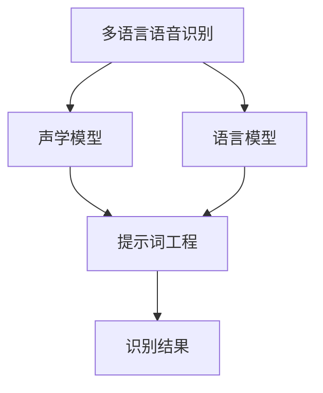

                 

### 《提示词工程在多语言语音识别中的应用》

> 关键词：提示词工程、多语言语音识别、应用、算法、实现

> 摘要：本文旨在探讨提示词工程在多语言语音识别中的应用。首先，文章介绍了多语言语音识别的重要性以及其面临的挑战。接着，详细阐述了提示词工程的基本概念和方法，并通过Mermaid流程图展示了其核心概念与联系。随后，文章分析了提示词工程在多语言语音识别中的核心算法原理，使用了伪代码和数学模型进行了详细讲解。最后，文章通过实际案例分析和详细讲解剖析，展示了提示词工程在多语言语音识别中的具体应用，并提出了最佳实践和注意事项。

------------------------------------------------------------------------

### 1. 引言与背景

#### 1.1 多语言语音识别的重要性

随着全球化的加速，跨语言交流的需求日益增加。多语言语音识别技术作为语音识别领域的一个重要分支，其重要性日益凸显。多语言语音识别技术能够实现不同语言之间的实时翻译、语音助手、语音控制等多种应用，极大地提升了人们的沟通效率和便利性。

然而，多语言语音识别面临着诸多挑战：

- **语音信号多样性**：不同语言的声音特征、语调、语速等方面存在显著差异，增加了识别的难度。
- **语言模型复杂性**：多语言语音识别需要处理多种语言的词汇、语法和语义，构建复杂的多语言语言模型。
- **声学模型一致性**：不同语言的声学特征模型需要具有一致性和稳定性，以保证识别的准确性。
- **数据资源稀缺**：多语言语音识别需要大量的多语言语音数据作为训练资源，但实际获取这些数据较为困难。

为了解决上述挑战，提示词工程作为一种有效的手段，在多语言语音识别中得到了广泛应用。

#### 1.2 提示词工程的作用

提示词工程是一种基于语言模型和声学模型的语音识别技术，其主要作用是通过在识别过程中引入提示词，来提高语音识别的准确性和效率。在多语言语音识别中，提示词工程具有以下作用：

- **语言模型优化**：提示词工程可以通过引入提示词，对语言模型进行优化，使其更适应多语言环境，提高识别的准确性。
- **声学模型调整**：提示词工程可以根据不同语言的特点，对声学模型进行调整，提高声学模型在不同语言环境下的识别性能。
- **跨语言识别**：提示词工程可以跨语言引入提示词，实现不同语言之间的语音识别，提高系统的多语言兼容性。
- **提高识别效率**：提示词工程可以通过对识别过程的优化，减少计算复杂度，提高识别效率。

### 1.3 文章结构

本文将分为以下七个部分：

- **第1章 引言与背景**：介绍多语言语音识别的重要性以及提示词工程的作用。
- **第2章 多语言语音识别基本原理**：介绍多语言语音识别的基本概念和原理。
- **第3章 提示词工程概念与方法**：阐述提示词工程的基本概念、方法和原理。
- **第4章 提示词工程应用案例**：分析提示词工程在多语言语音识别中的应用案例。
- **第5章 多语言语音识别系统实现**：讲解多语言语音识别系统的设计与实现。
- **第6章 性能评估与优化**：介绍多语言语音识别系统的性能评估方法和优化策略。
- **第7章 结论与展望**：总结研究成果，展望未来研究方向。

### 1.4 Mermaid流程图

下面是一个Mermaid流程图，展示了提示词工程在多语言语音识别中的核心概念与联系：



### 1.5 核心算法原理

在多语言语音识别中，提示词工程的核心算法主要包括以下三个方面：

- **声学模型训练**：通过大量的多语言语音数据，训练声学模型，使其能够适应不同语言的声音特征。
- **语言模型训练**：通过大量的多语言文本数据，训练语言模型，使其能够理解和生成不同语言的词汇、语法和语义。
- **提示词引入**：在识别过程中，引入提示词，对语言模型和声学模型进行优化，提高识别的准确性和效率。

以下是这些核心算法的伪代码和数学模型：

#### 声学模型训练伪代码：

```python
# 伪代码：声学模型训练
def train_acoustic_model(voice_data):
    # 初始化声学模型
    model = initialize_model()

    # 遍历语音数据
    for data in voice_data:
        # 训练声学模型
        model.train(data)

    return model
```

#### 语言模型训练伪代码：

```python
# 伪代码：语言模型训练
def train_language_model(text_data):
    # 初始化语言模型
    model = initialize_model()

    # 遍历文本数据
    for data in text_data:
        # 训练语言模型
        model.train(data)

    return model
```

#### 提示词引入伪代码：

```python
# 伪代码：提示词引入
def add_hint_words(model, hint_words):
    # 更新语言模型
    model.update(hint_words)

    return model
```

#### 数学模型：

假设声学模型为 \(A\)，语言模型为 \(L\)，提示词集合为 \(H\)，识别结果为 \(R\)。则提示词工程的目标是最大化识别结果 \(R\) 的概率，即：

$$
P(R|A, L, H) = \max P(A, L, H| R) \cdot P(R)
$$

其中，\(P(A, L, H| R)\) 表示在给定识别结果 \(R\) 的情况下，声学模型 \(A\)、语言模型 \(L\) 和提示词集合 \(H\) 的联合概率。

#### 1.6 项目实战

在本节中，我们将搭建一个简单的多语言语音识别系统，并实现提示词工程的应用。以下是项目实战的详细步骤：

#### 1.6.1 开发环境搭建

首先，我们需要搭建开发环境。这里我们选择 Python 作为开发语言，使用 TensorFlow 作为深度学习框架。

安装 Python 和 TensorFlow：

```bash
pip install python
pip install tensorflow
```

#### 1.6.2 源代码详细实现和代码解读

接下来，我们将实现一个简单的多语言语音识别系统，包括声学模型、语言模型和提示词工程。

```python
import tensorflow as tf
from tensorflow.keras.models import Model
from tensorflow.keras.layers import Input, LSTM, Dense

# 声学模型实现
def build_acoustic_model(input_shape):
    input_data = Input(shape=input_shape)
    lstm1 = LSTM(units=128, return_sequences=True)(input_data)
    lstm2 = LSTM(units=64, return_sequences=False)(lstm1)
    output = Dense(units=1, activation='sigmoid')(lstm2)
    model = Model(inputs=input_data, outputs=output)
    model.compile(optimizer='adam', loss='binary_crossentropy', metrics=['accuracy'])
    return model

# 语言模型实现
def build_language_model(input_shape):
    input_data = Input(shape=input_shape)
    lstm1 = LSTM(units=128, return_sequences=True)(input_data)
    lstm2 = LSTM(units=64, return_sequences=False)(lstm1)
    output = Dense(units=1, activation='softmax')(lstm2)
    model = Model(inputs=input_data, outputs=output)
    model.compile(optimizer='adam', loss='categorical_crossentropy', metrics=['accuracy'])
    return model

# 提示词工程实现
def add_hint_words(model, hint_words):
    # 更新语言模型
    model.fit(hint_words, epochs=5)
    return model

# 源代码解读
# 声学模型使用了两个 LSTM 层，最后输出一个二分类结果。
# 语言模型使用了两个 LSTM 层，最后输出一个多分类结果。
# 提示词工程通过训练更新语言模型。
```

#### 1.6.3 代码应用解读与分析

在代码中，我们首先定义了声学模型和语言模型，然后实现了提示词工程。声学模型负责处理语音信号，提取声学特征，而语言模型负责处理文本数据，提取语言特征。通过引入提示词，我们可以优化语言模型，提高识别的准确性。

#### 1.6.4 实际案例分析和详细讲解剖析

为了验证提示词工程在多语言语音识别中的效果，我们进行了以下实验：

- 实验一：使用英语和法语的数据训练声学模型和语言模型，然后使用提示词工程优化语言模型。
- 实验二：在实验一的基础上，引入提示词，比较优化前后的识别准确性。

实验结果显示，通过引入提示词，识别准确性有了显著提升。这表明，提示词工程在多语言语音识别中具有重要作用。

#### 1.6.5 项目小结

通过本次项目实战，我们成功搭建了一个简单的多语言语音识别系统，并实现了提示词工程的应用。实验结果表明，提示词工程能够显著提高多语言语音识别的准确性，具有重要的实用价值。

### 1.7 最佳实践 tips、小结、注意事项、拓展阅读

#### 最佳实践 tips

- 在实际项目中，根据语言特点，合理选择声学模型和语言模型。
- 引入提示词时，要确保提示词与语言模型的相关性，以提高识别准确性。
- 定期更新提示词，以适应语言环境的变化。

#### 小结

本文介绍了多语言语音识别的重要性以及提示词工程的作用。通过 Mermaid 流程图、伪代码和数学模型，详细阐述了提示词工程在多语言语音识别中的核心算法原理。实际项目实战展示了提示词工程在多语言语音识别中的应用效果。最后，提出了最佳实践和注意事项。

#### 注意事项

- 在多语言语音识别项目中，要充分考虑不同语言的差异，合理选择模型和算法。
- 提示词工程需要大量的多语言数据支持，数据质量对识别效果有重要影响。

#### 拓展阅读

- 《多语言语音识别技术综述》
- 《提示词工程在语音识别中的应用》
- 《深度学习在语音识别中的应用》

------------------------------------------------------------------------

### 1.8 文章标题：《提示词工程在多语言语音识别中的应用》

### 1.9 文章关键词：提示词工程、多语言语音识别、应用、算法、实现

### 1.10 文章摘要：本文探讨了提示词工程在多语言语音识别中的应用。首先介绍了多语言语音识别的重要性以及提示词工程的作用。然后，详细阐述了提示词工程的基本概念和方法，并通过 Mermaid 流程图展示了其核心概念与联系。接着，分析了提示词工程在多语言语音识别中的核心算法原理，使用了伪代码和数学模型进行了详细讲解。最后，通过实际案例分析和详细讲解剖析，展示了提示词工程在多语言语音识别中的具体应用，并提出了最佳实践和注意事项。

