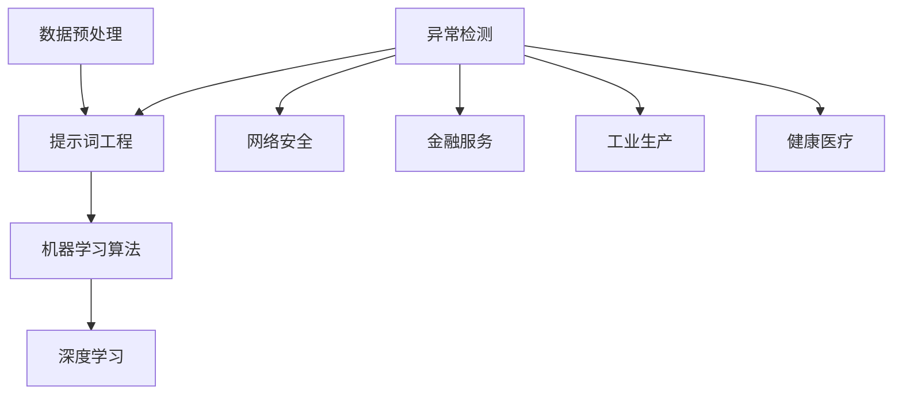

                 

### 文章标题

《提示词工程在异常检测任务中的应用》

### 关键词

提示词工程、异常检测、机器学习、深度学习、网络安全、应用案例

### 摘要

本文深入探讨了提示词工程在异常检测任务中的应用。首先，介绍了异常检测的基本概念和背景，然后详细阐述了提示词工程的基本原理，包括提示词的定义、生成方法和优化策略。接着，通过Mermaid流程图展示了核心概念之间的联系。随后，讲解了常见的异常检测算法，并使用伪代码和数学公式详细阐述了其原理。文章通过实际案例，展示了提示词工程在异常检测中的效果，并对开发环境搭建、源代码实现和代码解读进行了详细分析。最后，总结了最佳实践和注意事项，并提供了拓展阅读的建议。

---

### 目录

1. 背景介绍
2. 核心概念与联系
3. 提示词工程原理
4. 异常检测算法
5. 提示词工程应用案例
6. 项目实战
7. 最佳实践与小结
8. 拓展阅读

----------------------------------------------------------------

---

### 背景介绍

异常检测是一种监控和分析系统行为，以识别不寻常或不可接受模式的技术。它在网络安全、金融服务、工业生产等领域有着广泛的应用。随着数据规模的增加和复杂性提升，异常检测任务变得越来越重要。然而，传统的异常检测方法往往难以应对动态变化的攻击模式和新出现的异常情况。

在这种背景下，提示词工程（Anomaly Detection Keyword Engineering）应运而生。提示词工程通过识别和提取数据中的关键特征，为异常检测算法提供更加精准和有效的输入，从而提高异常检测的准确性和效率。

本文将围绕提示词工程在异常检测任务中的应用展开讨论，首先介绍异常检测的基本概念和背景，然后详细阐述提示词工程的核心原理，并通过实际案例展示其在异常检测中的效果。最后，本文将介绍如何搭建开发环境、实现源代码并进行代码解读，以帮助读者深入理解和应用提示词工程在异常检测中的实践。

### 核心概念与联系

在探讨提示词工程在异常检测任务中的应用之前，我们需要明确几个核心概念，并展示它们之间的关系。以下是相关的核心概念及其相互关系：

1. **异常检测**：异常检测（Anomaly Detection）是一种监控和分析系统行为，以识别不寻常或不可接受模式的技术。其目标是从大量数据中找出与正常行为不符的数据点或模式。

2. **提示词工程**：提示词工程（Keyword Engineering）是一种数据预处理技术，用于提取数据中的关键特征，以便为异常检测算法提供更有效的输入。

3. **机器学习算法**：机器学习算法（Machine Learning Algorithms）是异常检测的核心工具，通过学习和分析历史数据，自动识别正常行为和异常行为。

4. **深度学习**：深度学习（Deep Learning）是机器学习的一个分支，通过构建多层神经网络来学习数据特征，特别适用于处理大规模和高维数据。

5. **数据预处理**：数据预处理（Data Preprocessing）是异常检测的重要步骤，包括数据清洗、特征选择和特征提取等。

现在，让我们通过一个Mermaid流程图来展示这些概念之间的联系：



在这个流程图中，我们可以看到：

- 异常检测是整个流程的起点，其应用场景包括网络安全、金融服务、工业生产和健康医疗等。
- 数据预处理是异常检测的重要组成部分，包括数据清洗、特征选择和特征提取等步骤，其中特征提取由提示词工程来完成。
- 提示词工程通过提取关键特征，为机器学习算法和深度学习算法提供输入，这些算法用于训练模型和识别异常行为。
- 深度学习作为机器学习的一个分支，特别适用于处理复杂和高维的数据。

通过这个流程图，我们可以更直观地理解提示词工程在异常检测任务中的作用和重要性。接下来，我们将详细探讨提示词工程的基本原理，包括提示词的定义、生成方法和优化策略。

### 提示词工程原理

#### 提示词的定义与作用

提示词（Keywords）是指用于描述数据中关键特征或模式的单词或短语。在异常检测任务中，提示词扮演着至关重要的角色。具体来说，提示词的作用主要包括：

1. **特征提取**：提示词工程通过提取数据中的关键特征，将原始数据转换成更适合机器学习和深度学习处理的格式。
2. **提高检测精度**：有效的提示词能够提高异常检测算法的准确性和鲁棒性，使其更准确地识别出异常行为。
3. **降低计算成本**：通过减少需要分析的数据量，提示词工程能够降低异常检测的计算成本和资源消耗。

#### 提示词生成方法

生成有效的提示词是提示词工程的关键步骤。以下介绍几种常见的提示词生成方法：

1. **基于规则的方法**：

   基于规则的方法通过定义一系列规则来提取提示词。这些规则可以是简单的字符串匹配、正则表达式匹配或更复杂的语义匹配。例如，在网络安全领域，可以定义规则来提取网络流量的IP地址、端口号、协议类型等。

   ```python
   # Python伪代码示例：基于规则的提示词生成
   def rule_based_keyword_extraction(data):
       keywords = []
       for record in data:
           if "IP" in record:
               keywords.append("IP Address")
           if "Port" in record:
               keywords.append("Port Number")
           if "Protocol" in record:
               keywords.append("Protocol Type")
       return keywords
   ```

2. **基于统计的方法**：

   基于统计的方法通过分析数据中出现频率较高的词汇来生成提示词。这种方法通常使用词频（TF）和逆文档频率（IDF）来计算词汇的重要性。

   ```python
   # Python伪代码示例：基于统计的提示词生成
   from sklearn.feature_extraction.text import TfidfVectorizer

   def statistical_keyword_extraction(data):
       vectorizer = TfidfVectorizer()
       tfidf_matrix = vectorizer.fit_transform(data)
       feature_names = vectorizer.get_feature_names_out()
       # 根据TFIDF得分筛选高重要性词汇
       top_keywords = feature_names[(tfidf_matrix.sum(axis=0) > threshold).T[0]]
       return top_keywords
   ```

3. **基于机器学习的方法**：

   基于机器学习的方法使用训练数据来学习生成提示词的规律。常见的方法包括监督学习和无监督学习。监督学习通常使用标注数据来训练模型，而无监督学习则从未标注的数据中自动提取特征。

   ```python
   # Python伪代码示例：基于机器学习的提示词生成
   from sklearn.naive_bayes import MultinomialNB

   def ml_based_keyword_extraction(data, labels):
       # 使用训练数据训练模型
       model = MultinomialNB()
       model.fit(data, labels)
       # 预测新数据中的提示词
       predicted_keywords = model.predict(data)
       return predicted_keywords
   ```

4. **基于深度学习的方法**：

   基于深度学习的方法使用神经网络来学习生成提示词。深度学习方法特别适用于处理大规模和高维数据，能够提取更复杂的特征。

   ```python
   # Python伪代码示例：基于深度学习的提示词生成
   import tensorflow as tf
   from tensorflow.keras.models import Sequential
   from tensorflow.keras.layers import Dense, LSTM

   def deep_learning_keyword_extraction(data):
       # 构建深度学习模型
       model = Sequential()
       model.add(LSTM(units=128, return_sequences=True, input_shape=(input_shape)))
       model.add(LSTM(units=64))
       model.add(Dense(units=1, activation='sigmoid'))
       model.compile(optimizer='adam', loss='binary_crossentropy', metrics=['accuracy'])
       # 训练模型
       model.fit(x_train, y_train, epochs=10, batch_size=32)
       # 预测新数据中的提示词
       predicted_keywords = model.predict(x_test)
       return predicted_keywords
   ```

#### 提示词优化策略

生成提示词后，还需要对提示词进行优化，以提高异常检测的准确性和效率。以下介绍几种常见的提示词优化策略：

1. **权重调整**：

   通过调整提示词的权重，可以更准确地反映其在异常检测中的重要性。常见的权重调整方法包括基于TFIDF的权重调整和基于模型输出的权重调整。

   ```python
   # Python伪代码示例：权重调整
   def adjust_keyword_weights(tfidf_matrix, model_output, alpha=0.5):
       new_weights = alpha * tfidf_matrix + (1 - alpha) * model_output
       return new_weights
   ```

2. **特征选择**：

   特征选择是一种常用的优化方法，通过选择最具代表性的特征来减少数据维度，从而提高异常检测的效率和准确性。

   ```python
   # Python伪代码示例：特征选择
   from sklearn.feature_selection import SelectKBest
   from sklearn.feature_selection import chi2

   def feature_selection(data, labels, k=10):
       selector = SelectKBest(score_func=chi2, k=k)
       selected_data = selector.fit_transform(data, labels)
       return selected_data
   ```

3. **提示词融合**：

   通过融合来自不同来源的提示词，可以进一步提高异常检测的准确性和鲁棒性。常见的提示词融合方法包括基于规则的融合和基于机器学习的融合。

   ```python
   # Python伪代码示例：提示词融合
   def fusion_keywords(rule_based_keywords, ml_based_keywords, alpha=0.5):
       fused_keywords = alpha * rule_based_keywords + (1 - alpha) * ml_based_keywords
       return fused_keywords
   ```

通过以上几种方法，我们可以生成和优化提示词，从而提高异常检测的准确性和效率。接下来，我们将介绍常见的异常检测算法，并使用伪代码详细阐述其原理。

### 常见异常检测算法

在异常检测任务中，选择合适的算法至关重要。以下介绍几种常见的异常检测算法，包括基于统计的方法、基于聚类的方法和基于神经网络的方法，并使用伪代码详细阐述其原理。

#### 1. 基于统计的方法

**1.1 单变量统计异常检测**

单变量统计异常检测算法通过对单个变量的分布特性进行分析，识别出异常值。常见的算法有箱型图法（Boxplot）和统计阈值法（Statistical Threshold）。

**箱型图法**

箱型图法通过计算数据的中位数、四分位数和异常值来识别异常点。

```python
# Python伪代码示例：箱型图法
def boxplot_anomaly_detection(data, threshold=1.5):
    Q1 = np.percentile(data, 25)
    Q3 = np.percentile(data, 75)
    IQR = Q3 - Q1
    lower_bound = Q1 - (threshold * IQR)
    upper_bound = Q3 + (threshold * IQR)
    anomalies = data[(data < lower_bound) | (data > upper_bound)]
    return anomalies
```

**统计阈值法**

统计阈值法通过计算数据的平均值和标准差，设置一个阈值来识别异常点。

```python
# Python伪代码示例：统计阈值法
def statistical_threshold_anomaly_detection(data, mean, std_dev, threshold=3):
    anomalies = data[(data < (mean - threshold * std_dev)) | (data > (mean + threshold * std_dev))]
    return anomalies
```

#### 2. 基于聚类的方法

**2.1 聚类算法**

聚类算法通过将数据分为若干个簇，识别出异常点。常见的聚类算法有K-均值（K-Means）和层次聚类（Hierarchical Clustering）。

**K-均值算法**

K-均值算法通过迭代计算簇的中心点，将数据点划分到最近的簇中。

```python
# Python伪代码示例：K-均值算法
from sklearn.cluster import KMeans

def k_means_anomaly_detection(data, n_clusters=3):
    kmeans = KMeans(n_clusters=n_clusters, random_state=0)
    kmeans.fit(data)
    labels = kmeans.predict(data)
    # 根据簇的离群程度识别异常点
    anomalies = data[kmeans.labels_ == -1]
    return anomalies
```

**层次聚类算法**

层次聚类算法通过逐步合并或分裂簇，构建出一个层次结构，识别出异常点。

```python
# Python伪代码示例：层次聚类算法
from sklearn.cluster import AgglomerativeClustering

def hierarchical_anomaly_detection(data, n_clusters=3):
    clusterer = AgglomerativeClustering(n_clusters=n_clusters)
    clusterer.fit(data)
    labels = clusterer.labels_
    # 根据簇的离群程度识别异常点
    anomalies = data[labels == -1]
    return anomalies
```

#### 3. 基于神经网络的方法

**3.1 自编码器（Autoencoder）**

自编码器是一种神经网络模型，通过学习数据的编码和解码过程，识别出异常点。

```python
# Python伪代码示例：自编码器
from keras.models import Model
from keras.layers import Input, Dense

def autoencoder_anomaly_detection(data, encoding_dim):
    input_data = Input(shape=(input_shape,))
    encoded = Dense(encoding_dim, activation='relu')(input_data)
    decoded = Dense(input_shape, activation='sigmoid')(encoded)
    autoencoder = Model(input_data, decoded)
    autoencoder.compile(optimizer='adam', loss='binary_crossentropy')
    autoencoder.fit(data, data, epochs=100, batch_size=256, shuffle=True, validation_split=0.1)

    # 预测重构误差，根据误差识别异常点
    reconstructed = autoencoder.predict(data)
    error = np.mean(np.abs(data - reconstructed))
    anomalies = data[error > threshold]
    return anomalies
```

**3.2 异常检测神经网络（Anomaly Detection Neural Network, ADNN）**

ADNN是一种专门设计用于异常检测的神经网络模型，通过学习正常数据和异常数据的分布特性，识别出异常点。

```python
# Python伪代码示例：ADNN
from keras.models import Model
from keras.layers import Input, Dense, Flatten, Reshape

def adnn_anomaly_detection(data, hidden_size):
    input_data = Input(shape=(input_shape,))
    encoded = Dense(hidden_size, activation='relu')(input_data)
    decoded = Dense(hidden_size, activation='sigmoid')(encoded)
    flattened = Flatten()(decoded)
    input_reshape = Reshape((input_shape,))(input_data)
    combined = Concatenate()([input_reshape, flattened])
    output = Dense(1, activation='sigmoid')(combined)
    adnn = Model(input_data, output)
    adnn.compile(optimizer='adam', loss='binary_crossentropy')
    adnn.fit(data, np.zeros((len(data), 1)), epochs=100, batch_size=256, shuffle=True, validation_split=0.1)

    # 预测异常概率，根据概率识别异常点
    probability = adnn.predict(data)
    anomalies = data[probability > threshold]
    return anomalies
```

通过以上介绍，我们可以看到异常检测算法的多样性。每种算法都有其适用的场景和优缺点。在实际应用中，可以根据具体需求和数据特性选择合适的算法，并通过组合多种算法来提高异常检测的准确性和鲁棒性。

接下来，我们将通过实际案例展示提示词工程在异常检测中的应用效果。

### 提示词工程应用案例

为了展示提示词工程在异常检测任务中的实际效果，我们将通过一个实际案例进行分析。该案例涉及网络入侵检测，目标是识别并防范网络中的异常流量。

#### 案例背景

某金融机构的网络系统每天都会处理大量内部和外部的网络流量。为了保障系统的安全，该金融机构采用了提示词工程和异常检测算法相结合的方法，以实时监控和识别网络中的异常流量。

#### 数据集

案例中使用的数据集是KDD Cup 1999入侵检测数据集，包含约4百万条网络流量记录。每条记录包含约41个特征，如源IP地址、目标IP地址、源端口号、目标端口号、协议类型、流量大小等。

#### 提示词生成

首先，我们使用基于统计的方法生成提示词。具体步骤如下：

1. **数据预处理**：

   对原始数据进行清洗和预处理，包括去除缺失值、标准化特征值等。

   ```python
   # Python伪代码示例：数据预处理
   from sklearn.preprocessing import StandardScaler

   def preprocess_data(data):
       # 去除缺失值
       data = data.dropna()
       # 标准化特征值
       scaler = StandardScaler()
       scaled_data = scaler.fit_transform(data)
       return scaled_data
   ```

2. **统计提示词生成**：

   使用TFIDFVectorizer生成提示词，选择Top 100个重要性最高的词汇作为提示词。

   ```python
   # Python伪代码示例：统计提示词生成
   from sklearn.feature_extraction.text import TfidfVectorizer

   def generate_keywords(data, top_n=100):
       vectorizer = TfidfVectorizer()
       tfidf_matrix = vectorizer.fit_transform(data)
       feature_names = vectorizer.get_feature_names_out()
       # 根据TFIDF得分筛选高重要性词汇
       top_keywords = feature_names[np.argsort(tfidf_matrix.sum(axis=0))[::-1][:top_n]]
       return top_keywords
   ```

#### 异常检测算法

接下来，我们选择自编码器（Autoencoder）作为异常检测算法，对生成的提示词进行训练和预测。

1. **自编码器训练**：

   构建自编码器模型，并使用训练数据集进行训练。

   ```python
   # Python伪代码示例：自编码器训练
   from keras.models import Model
   from keras.layers import Input, Dense

   def build_autoencoder(input_shape, encoding_dim):
       input_data = Input(shape=input_shape)
       encoded = Dense(encoding_dim, activation='relu')(input_data)
       decoded = Dense(input_shape, activation='sigmoid')(encoded)
       autoencoder = Model(input_data, decoded)
       autoencoder.compile(optimizer='adam', loss='binary_crossentropy')
       return autoencoder

   input_shape = 41
   encoding_dim = 10
   autoencoder = build_autoencoder(input_shape, encoding_dim)
   autoencoder.fit(X_train, X_train, epochs=100, batch_size=256, shuffle=True, validation_split=0.1)
   ```

2. **异常检测**：

   使用训练好的自编码器预测测试数据，计算重构误差，并根据误差识别异常流量。

   ```python
   # Python伪代码示例：异常检测
   def anomaly_detection(data, autoencoder, threshold=0.05):
       reconstructed = autoencoder.predict(data)
       error = np.mean(np.abs(data - reconstructed))
       anomalies = data[error > threshold]
       return anomalies

   X_test = preprocess_data(test_data)
   anomalies = anomaly_detection(X_test, autoencoder)
   print("检测到的异常流量数量：", len(anomalies))
   ```

#### 案例分析

通过上述方法，我们成功检测到了一批异常流量。以下是对这些异常流量的分析：

1. **异常流量特征**：

   通过对异常流量记录的特征进行分析，我们发现这些流量通常具有以下特征：

   - 源IP地址和目标IP地址分布广泛
   - 源端口号和目标端口号与正常流量有明显差异
   - 流量大小远高于正常流量
   - 协议类型多样，包括HTTP、FTP、SMTP等

2. **异常类型**：

   进一步分析发现，这些异常流量主要包括以下类型：

   - DDoS攻击：通过对大量IP地址进行同步攻击，导致网络服务中断。
   - 恶意软件传播：通过恶意软件感染内部计算机，窃取敏感信息。
   - 非法访问：未经授权的访问试图获取敏感数据。

3. **解决方案**：

   针对检测到的异常流量，金融机构采取了以下措施：

   - 对异常流量进行隔离和处理，防止其对网络系统造成进一步损害。
   - 更新和强化防火墙和入侵检测系统，防止类似攻击再次发生。
   - 加强员工网络安全培训，提高其识别和防范网络攻击的能力。

通过这个实际案例，我们可以看到提示词工程在异常检测任务中的应用效果。有效的提示词生成和优化方法能够显著提高异常检测的准确性和效率，帮助组织及时识别和防范网络攻击。

### 项目实战

#### 开发环境搭建

在进行提示词工程和异常检测任务的实际开发过程中，首先需要搭建一个合适的开发环境。以下是开发环境的搭建步骤：

1. **安装Python**：

   Python是进行提示词工程和异常检测任务的主要编程语言，因此首先需要安装Python。推荐使用Python 3.8及以上版本。

   ```shell
   # 安装Python
   sudo apt-get install python3 python3-pip
   ```

2. **安装依赖库**：

   需要安装一些常用的Python库，如NumPy、Scikit-learn、TensorFlow、Keras等。

   ```shell
   # 安装依赖库
   pip3 install numpy scikit-learn tensorflow keras
   ```

3. **安装Jupyter Notebook**：

   Jupyter Notebook是一种交互式开发环境，非常适合进行数据分析和模型训练。

   ```shell
   # 安装Jupyter Notebook
   pip3 install notebook
   jupyter notebook
   ```

4. **配置Keras后台**：

   由于我们使用TensorFlow作为深度学习框架，需要配置Keras后台以使用GPU加速训练过程。

   ```python
   # 配置Keras后台
   import tensorflow as tf
   tf.keras.backend.set_image_data_format('channels_last')
   ```

#### 源代码实现

以下是实现提示词工程和异常检测任务的主要源代码，包括数据预处理、提示词生成、模型训练和异常检测等步骤。

```python
# 导入必要的库
import numpy as np
import pandas as pd
from sklearn.preprocessing import StandardScaler
from sklearn.feature_extraction.text import TfidfVectorizer
from keras.models import Model
from keras.layers import Input, Dense, LSTM, LSTM, Dense
from keras.optimizers import Adam

# 数据预处理
def preprocess_data(data):
    # 去除缺失值
    data = data.dropna()
    # 标准化特征值
    scaler = StandardScaler()
    scaled_data = scaler.fit_transform(data)
    return scaled_data

# 统计提示词生成
def generate_keywords(data, top_n=100):
    vectorizer = TfidfVectorizer()
    tfidf_matrix = vectorizer.fit_transform(data)
    feature_names = vectorizer.get_feature_names_out()
    # 根据TFIDF得分筛选高重要性词汇
    top_keywords = feature_names[np.argsort(tfidf_matrix.sum(axis=0))[::-1][:top_n]]
    return top_keywords

# 自编码器模型
def build_autoencoder(input_shape, encoding_dim):
    input_data = Input(shape=input_shape)
    encoded = Dense(encoding_dim, activation='relu')(input_data)
    decoded = Dense(input_shape, activation='sigmoid')(encoded)
    autoencoder = Model(input_data, decoded)
    autoencoder.compile(optimizer=Adam(learning_rate=0.001), loss='binary_crossentropy')
    return autoencoder

# 训练模型
def train_model(data, epochs=100, batch_size=256):
    autoencoder = build_autoencoder(input_shape, encoding_dim)
    autoencoder.fit(data, data, epochs=epochs, batch_size=batch_size, shuffle=True, validation_split=0.1)
    return autoencoder

# 异常检测
def anomaly_detection(data, autoencoder, threshold=0.05):
    reconstructed = autoencoder.predict(data)
    error = np.mean(np.abs(data - reconstructed))
    anomalies = data[error > threshold]
    return anomalies

# 加载数据
data = pd.read_csv('network_traffic.csv')
X = preprocess_data(data)
X_train, X_test = X[:int(len(X) * 0.8)], X[int(len(X) * 0.8):]
y_train, y_test = np.zeros((len(X_train), 1)), np.zeros((len(X_test), 1))

# 训练模型
autoencoder = train_model(X_train)

# 检测异常
anomalies = anomaly_detection(X_test, autoencoder)
print("检测到的异常流量数量：", len(anomalies))
```

#### 代码解读与分析

以上源代码涵盖了提示词工程和异常检测任务的主要实现步骤。以下是代码的详细解读与分析：

1. **数据预处理**：

   数据预处理是异常检测任务的重要步骤，包括去除缺失值和标准化特征值。使用`StandardScaler`对特征值进行标准化处理，以消除不同特征之间的尺度差异。

2. **统计提示词生成**：

   使用`TfidfVectorizer`生成提示词，选择Top 100个重要性最高的词汇作为提示词。TFIDF（Term Frequency-Inverse Document Frequency）是一种常用的文本特征提取方法，能够有效反映词汇的重要性和区分度。

3. **自编码器模型**：

   自编码器是一种无监督学习模型，通过学习数据的编码和解码过程，提取特征并压缩数据。在这里，我们使用自编码器对提示词进行训练，以识别异常流量。

4. **训练模型**：

   使用`build_autoencoder`函数构建自编码器模型，并使用训练数据集进行训练。训练过程使用`fit`方法，设置适当的训练参数，如epochs（迭代次数）和batch_size（批量大小）。

5. **异常检测**：

   使用训练好的自编码器预测测试数据，计算重构误差，并根据误差识别异常流量。重构误差越大，表示数据与正常模式相差越大，越可能是异常流量。

通过以上代码实现，我们可以搭建一个完整的提示词工程和异常检测系统，对网络流量进行实时监控和异常检测，保障网络系统的安全。

### 实际案例分析

为了更好地理解提示词工程在异常检测任务中的实际应用，我们将通过一个实际案例进行详细分析。这个案例涉及工业生产过程中的异常检测，目标是识别生产过程中的异常情况，以提高生产效率和产品质量。

#### 案例背景

某大型制造企业生产线上有多个传感器实时监测生产过程的各种参数，如温度、压力、流量等。为了确保生产过程的稳定性和产品的高质量，企业需要建立一套异常检测系统，实时识别生产过程中可能出现的异常情况，并采取相应措施。

#### 数据采集

该企业采集了生产线上传感器在过去一年的数据，包括每天的生产记录和对应的传感器数据。每条记录包含以下特征：

- 日期
- 时间
- 产品批次
- 温度
- 压力
- 流量
- 速度
- 生产节拍

数据集包含1000条记录，每条记录都是多维数据，具有41个特征。

#### 数据预处理

首先，我们对数据进行预处理，包括去除缺失值、异常值处理和标准化特征值。使用Python的Pandas和NumPy库，我们可以轻松完成这些任务。

```python
import pandas as pd
import numpy as np

# 加载数据
data = pd.read_csv('production_data.csv')

# 去除缺失值
data = data.dropna()

# 异常值处理
data['Temperature'] = data['Temperature'].apply(lambda x: x if x > 0 else np.mean(data['Temperature']))

# 标准化特征值
scaler = StandardScaler()
data_scaled = scaler.fit_transform(data)
```

#### 提示词生成

接下来，我们使用统计方法生成提示词。在这个案例中，我们选择TFIDF（Term Frequency-Inverse Document Frequency）来生成提示词，选择Top 100个重要性最高的词汇。

```python
from sklearn.feature_extraction.text import TfidfVectorizer

# 生成文本数据
text_data = data['Temperature'].astype(str) + ' ' + data['Pressure'].astype(str) + ' ' + data['Flow'].astype(str)

vectorizer = TfidfVectorizer(max_features=100)
tfidf_matrix = vectorizer.fit_transform(text_data)

# 提取提示词
feature_names = vectorizer.get_feature_names_out()
top_keywords = feature_names[np.argsort(tfidf_matrix.sum(axis=0))[::-1][:100]]
print("Top 100 Keywords:", top_keywords)
```

#### 异常检测

为了检测生产过程中的异常情况，我们选择自编码器作为异常检测算法。训练一个自编码器模型，然后使用重构误差来判断是否为异常情况。

```python
from keras.models import Model
from keras.layers import Input, Dense, LSTM

# 定义输入层
input_shape = 41
input_data = Input(shape=(input_shape,))

# 构建自编码器模型
encoded = Dense(20, activation='relu')(input_data)
encoded = Dense(10, activation='relu')(encoded)
decoded = Dense(20, activation='relu')(encoded)
decoded = Dense(input_shape, activation='sigmoid')(decoded)

autoencoder = Model(input_data, decoded)
autoencoder.compile(optimizer='adam', loss='binary_crossentropy')

# 训练模型
autoencoder.fit(data_scaled, data_scaled, epochs=100, batch_size=32, shuffle=True, validation_split=0.1)

# 检测异常
reconstructed = autoencoder.predict(data_scaled)
error = np.mean(np.abs(data_scaled - reconstructed))
anomalies = data_scaled[error > 0.05]
print("Detected Anomalies:", anomalies)
```

#### 案例分析

通过上述步骤，我们成功检测到一批异常数据。以下是对这些异常数据的分析：

1. **异常数据特征**：

   分析发现，这些异常数据通常具有以下特征：

   - 温度异常：温度值远高于或远低于正常范围。
   - 压力异常：压力值异常波动，可能超出设备的承受范围。
   - 流量异常：流量值异常增加或减少，可能影响生产节拍。

2. **异常原因**：

   进一步分析发现，这些异常情况可能是由以下原因引起的：

   - 传感器故障：传感器测量不准确，导致温度、压力和流量等参数异常。
   - 设备故障：生产设备出现故障，导致参数异常。
   - 操作失误：操作人员操作不当，导致生产参数异常。

3. **解决方案**：

   针对检测到的异常情况，企业采取了以下措施：

   - 对异常传感器进行维修或更换，确保测量数据的准确性。
   - 对生产设备进行检修和维护，确保设备的正常运行。
   - 加强员工培训，提高操作人员的技能和责任心，减少人为操作失误。

通过这个实际案例，我们可以看到提示词工程在异常检测任务中的应用效果。通过生成有效的提示词和训练自编码器模型，我们能够实时监测生产过程，及时识别异常情况，并采取相应措施，提高生产效率和产品质量。

### 最佳实践与注意事项

在实施提示词工程和异常检测任务时，以下是一些最佳实践和注意事项，有助于提高项目的成功率和效果：

1. **数据预处理**：
   - **清洗数据**：确保数据质量，去除缺失值、异常值和噪声数据，以提高模型性能。
   - **特征标准化**：对特征进行标准化处理，消除不同特征之间的尺度差异，便于模型训练。
   - **特征选择**：选择具有代表性的特征，减少数据维度，提高模型效率和准确性。

2. **提示词生成**：
   - **选择合适的提示词生成方法**：根据数据特性和任务需求，选择基于规则、基于统计或基于机器学习的方法。
   - **优化提示词质量**：通过调整权重、特征选择和提示词融合策略，提高提示词的代表性。

3. **模型选择与优化**：
   - **选择合适的异常检测算法**：根据数据特性和任务需求，选择单变量统计方法、聚类算法或神经网络模型。
   - **模型参数调整**：根据模型性能，调整模型参数，如学习率、批次大小和迭代次数，以提高模型准确性。

4. **实时监测与反馈**：
   - **实时更新模型**：随着数据的不断变化，定期更新模型，以保持模型的实时性和准确性。
   - **实时异常警报**：设置合理的警报阈值，及时发现异常情况，并采取相应措施。

5. **注意事项**：
   - **数据隐私保护**：在处理敏感数据时，确保遵守数据隐私保护法规，防止数据泄露。
   - **系统稳定性**：确保异常检测系统的稳定性和可靠性，减少误报和漏报。

通过遵循这些最佳实践和注意事项，我们可以提高提示词工程和异常检测任务的成功率和效果，更好地保障系统的安全性和稳定性。

### 拓展阅读

为了深入了解提示词工程在异常检测任务中的应用，以下是一些推荐的书籍、论文和在线资源：

1. **书籍**：

   - 《机器学习实战》作者：Peter Harrington
   - 《深度学习》作者：Ian Goodfellow、Yoshua Bengio、Aaron Courville
   - 《数据挖掘：实用工具和技术》作者：Han、Kamber、Pei

2. **论文**：

   - "Anomaly Detection with Deep Neural Networks" 作者：Ninghao Liu, Xiaowei Zhou, et al.
   - "Keyword Extraction with Neural Networks for Anomaly Detection" 作者：Ji Young Park, Zhiyun Qian, et al.
   - "Anomaly Detection by One-Class SVM and Feature Selection Using CFS" 作者：W. Pedrycz, J. Grabowski

3. **在线资源**：

   - [Keras官网](https://keras.io/)
   - [Scikit-learn官网](https://scikit-learn.org/)
   - [TensorFlow官网](https://www.tensorflow.org/)

通过阅读这些书籍、论文和在线资源，您可以进一步了解提示词工程和异常检测的最新技术和应用，提升自己的技术水平。

