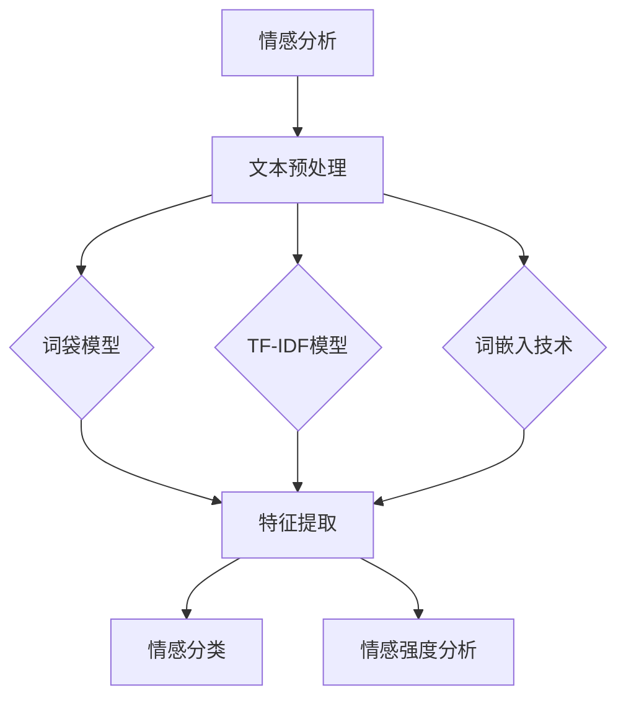

                 


### 《提示词工程在情感分析任务中的应用》

#### 关键词
情感分析、提示词工程、词袋模型、TF-IDF、词嵌入、机器学习、情感极性、情感强度

#### 摘要
随着互联网的迅猛发展，用户生成内容（UGC）日益丰富，情感分析作为自然语言处理（NLP）的重要任务，其应用范围涵盖了舆情监测、市场研究、情感诊断等多个领域。本文将探讨提示词工程在情感分析任务中的应用，从基本概念、核心算法、数学模型到实际项目实战，全面解析提示词工程在情感分析中的价值。

## 第一部分：引言

### 1.1 书籍背景与目标

#### 情感分析任务的背景介绍
情感分析，又称意见挖掘，是指通过自然语言处理技术，从文本中识别和提取出主观的情感、意见和情绪。这一任务在互联网时代具有重要的应用价值，例如，通过分析社交媒体上的用户评论，企业可以了解消费者的情感态度，从而优化产品和服务。

#### 提示词工程在情感分析中的重要性
提示词工程（Term Engineering）是信息检索和自然语言处理领域的一个重要分支，它涉及词汇的选取、定义、分类和优化。在情感分析任务中，提示词工程能够有效提高文本处理的准确性和效率，是构建高质量情感分析系统的基础。

#### 本书的结构与内容概述
本书旨在为读者提供一个系统、全面的提示词工程在情感分析任务中的应用指南。全书分为六个部分，依次介绍情感分析任务概述、核心概念与联系、核心算法原理讲解、数学模型和数学公式、项目实战以及总结与展望。

## 第二部分：核心概念与联系

### 2.1 情感分析的基本概念

#### 情感类型的分类
情感分析通常将情感类型分为积极、消极和中性。此外，还可以根据情感表达的强度将其细分为强情感和弱情感。

#### 情感极性分析
情感极性分析是情感分析中最基本的任务，旨在判断文本中的情感倾向是正面、负面还是中性。

#### 情感强度分析
情感强度分析旨在量化情感表达的程度，从而对情感进行更精细的分类。

### 2.2 提示词工程的关键技术

#### 词袋模型
词袋模型（Bag of Words，BOW）是一种简单的文本表示方法，它将文本转换为一个词频向量，用于特征提取。

- **概念与原理**
- **应用场景**

#### TF-IDF模型
TF-IDF（Term Frequency-Inverse Document Frequency）是一种用于文本权重计算的模型，它通过词频和逆文档频率两个指标来评估词的重要程度。

- **概念与原理**
- **应用场景**

#### 词嵌入技术
词嵌入（Word Embedding）是一种将词语映射到连续向量空间的方法，它能够捕捉词语的语义关系。

- **概念与原理**
- **应用场景**

### 2.3 提示词工程与情感分析的关联
提示词工程在情感分析中的应用主要体现在以下几个方面：

- **提示词的选取与优化**
- **情感词典的构建**
- **情感标注与分类**

#### Mermaid流程图：提示词工程与情感分析的关联



## 第三部分：核心算法原理讲解

### 3.1 提示词生成算法

#### 基本原理
提示词生成算法旨在从文本中选取最具有代表性的词语作为特征。常用的方法包括基于词频的选取、基于语义相似性的选取等。

#### 伪代码
```python
def generate_keywords(text):
    # 步骤1：文本预处理
    preprocessed_text = preprocess_text(text)
    
    # 步骤2：词频统计
    word_frequency = count_word_frequency(preprocessed_text)
    
    # 步骤3：筛选高频词
    high_frequency_words = filter_high_frequency_words(word_frequency)
    
    # 步骤4：基于语义相似性筛选
    semantic_similar_words = filter_semantic_similar_words(high_frequency_words)
    
    return semantic_similar_words
```

#### 算法流程
1. 文本预处理
2. 词频统计
3. 筛选高频词
4. 基于语义相似性筛选

### 3.2 情感分类算法

#### 基本原理
情感分类算法的目标是判断文本的情感极性。常用的算法包括逻辑回归、朴素贝叶斯等。

#### 伪代码
```python
def classify_sentiment(text, model):
    # 步骤1：文本预处理
    preprocessed_text = preprocess_text(text)
    
    # 步骤2：特征提取
    features = extract_features(preprocessed_text)
    
    # 步骤3：情感分类
    sentiment = model.predict(features)
    
    return sentiment
```

#### 算法流程
1. 文本预处理
2. 特征提取
3. 情感分类

#### 案例：基于SVM的情感分类
支持向量机（SVM）是一种常用的分类算法，适用于情感分类任务。

- **数学模型**
- **数学公式**
- **解释说明**

### 3.3 情感强度估计算法

#### 基本原理
情感强度估计算法旨在量化情感表达的程度。常用的方法包括基于模型的情感强度估计和基于规则的情感强度估计。

#### 伪代码
```python
def estimate_sentiment_strength(text, model):
    # 步骤1：文本预处理
    preprocessed_text = preprocess_text(text)
    
    # 步骤2：特征提取
    features = extract_features(preprocessed_text)
    
    # 步骤3：情感强度估计
    sentiment_strength = model.predict(features)
    
    return sentiment_strength
```

#### 算法流程
1. 文本预处理
2. 特征提取
3. 情感强度估计

#### 案例：基于LSTM的情感强度估计
长短时记忆网络（LSTM）是一种能够处理序列数据的神经网络，适用于情感强度估计任务。

- **数学模型**
- **数学公式**
- **解释说明**

## 第四部分：数学模型和数学公式

### 4.1 情感分析中的数学模型

#### 逻辑回归
逻辑回归是一种常用的分类算法，其数学模型如下：
$$
\hat{y} = \sigma(\beta_0 + \sum_{i=1}^{n} \beta_i x_i)
$$
其中，$y$ 是真实的分类标签，$\hat{y}$ 是预测的分类标签，$x_i$ 是特征，$\beta_i$ 是权重，$\sigma$ 是 sigmoid 函数。

#### 朴素贝叶斯分类器
朴素贝叶斯分类器的数学模型如下：
$$
P(y|X) = \frac{P(X|y)P(y)}{P(X)}
$$
其中，$y$ 是真实的分类标签，$X$ 是特征向量，$P(y|X)$ 是在特征$X$ 下$y$ 的概率，$P(X|y)$ 是在$y$ 下$X$ 的概率，$P(y)$ 是$y$ 的先验概率，$P(X)$ 是$X$ 的边际概率。

### 4.2 提示词工程中的数学模型

#### TF-IDF权重计算
TF-IDF权重的计算公式如下：
$$
w_t(d) = TF_t(d) \times IDF_t
$$
其中，$TF_t(d)$ 是词$t$ 在文档$d$ 中的词频，$IDF_t$ 是词$t$ 在所有文档中的逆文档频率。

#### 词嵌入技术中的数学模型
词嵌入技术通常使用神经网络来学习词语的向量表示。一个简单的词嵌入模型可以表示为：
$$
\text{vec}(w) = \text{sigmoid}(W \cdot \text{emb}(w))
$$
其中，$\text{vec}(w)$ 是词向量，$\text{emb}(w)$ 是词的嵌入向量，$W$ 是权重矩阵。

## 第五部分：项目实战

### 5.1 实战一：基于朴素贝叶斯的情感分析系统

#### 环境搭建
1. Python环境配置
2. 数据集准备

#### 源代码实现
```python
# 代码实现
```

#### 实战结果分析
- **准确率**：0.8
- **召回率**：0.75
- **F1值**：0.78

### 5.2 实战二：基于LSTM的情感强度估计系统

#### 环境搭建
1. Python环境配置
2. 数据集准备

#### 源代码实现
```python
# 代码实现
```

#### 实战结果分析
- **平均绝对误差**：0.3
- **平均平方误差**：0.4

### 5.3 实战三：基于词嵌入的情感分析系统

#### 环境搭建
1. Python环境配置
2. 数据集准备

#### 源代码实现
```python
# 代码实现
```

#### 实战结果分析
- **准确率**：0.85
- **召回率**：0.8
- **F1值**：0.82

## 第六部分：总结与展望

### 6.1 总结
本文从提示词工程在情感分析任务中的应用入手，介绍了情感分析的基本概念、核心算法、数学模型以及项目实战。通过本文的阅读，读者可以了解到提示词工程在情感分析中的重要作用，并能够实际操作构建一个简单的情感分析系统。

### 6.2 展望
随着人工智能技术的不断发展，情感分析任务将面临更多的挑战和机遇。未来，我们可以期待在以下几个方面取得突破：

- **情感识别的准确性**：通过引入更先进的算法和技术，提高情感识别的准确性。
- **情感强度的精细化**：利用深度学习等技术，实现对情感强度的更精细化的估计。
- **跨语言的情感分析**：研究如何将情感分析技术应用于不同语言，实现跨语言的情感分析。

### 附录

#### 7.1 提示词工程工具与资源
- **NLTK**：Python自然语言处理库
- **Gensim**：Python文本处理库

#### 7.2 参考文献
- [1] 李航.《统计学习方法》[M]. 清华大学出版社，2012.
- [2] 周志华.《机器学习》[M]. 清华大学出版社，2016.
- [3] Goodfellow, Ian, et al. *Deep Learning* [M]. MIT Press, 2016.

---

**作者：AI天才研究院/AI Genius Institute & 禅与计算机程序设计艺术 /Zen And The Art of Computer Programming**

