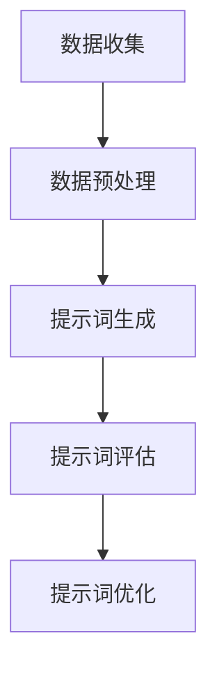

                 

### 文章标题

《提示词工程在情感计算中的个性化表达》

关键词：提示词工程、情感计算、个性化表达、算法、应用案例

摘要：本文探讨了提示词工程在情感计算中的个性化表达，分析了提示词工程的基本概念、理论基础及其在情感计算中的应用，详细阐述了个性化表达的方法和算法，并通过实际项目展示了其实现和应用效果。本文旨在为读者提供对提示词工程在情感计算中个性化表达的全面理解和实践指导。

### 文章目录

#### 第1章：情感计算与个性化表达基础
##### 1.1 情感计算简介
##### 1.2 个性化表达的概念
##### 1.3 情感计算与个性化表达的关系

#### 第2章：提示词工程理论基础
##### 2.1 提示词工程的概念
##### 2.2 提示词工程的基本流程
##### 2.3 提示词工程的挑战与机遇

#### 第3章：个性化表达方法与算法
##### 3.1 个性化表达方法概述
##### 3.2 个性化表达算法
##### 3.3 算法应用实例分析

#### 第4章：情感计算中的提示词工程应用案例
##### 4.1 社交媒体情感分析
##### 4.2 个性化新闻推荐

#### 第5章：实现提示词工程的个性化表达
##### 5.1 提示词生成与优化
##### 5.2 个性化表达效果评估
##### 5.3 提示词工程在情感计算中的应用策略

#### 第6章：实战项目展示
##### 6.1 项目背景与目标
##### 6.2 项目开发过程
##### 6.3 项目效果评估

#### 第7章：未来趋势与发展方向
##### 7.1 提示词工程的未来发展
##### 7.2 个性化表达的技术挑战与机遇
##### 7.3 未来发展趋势与展望

### 思考步骤

#### 确定书籍主题

首先，我们需要明确书籍的主题是《提示词工程在情感计算中的个性化表达》。这个主题涵盖了三个核心概念：提示词工程、情感计算和个性化表达。提示词工程是情感计算中的一个重要环节，它涉及到如何有效地生成和优化提示词，从而实现情感计算中的个性化表达。

#### 核心内容划分

核心内容可以分为以下几个部分：

1. **情感计算和个性化表达的基本概念**：介绍情感计算和个性化表达的定义、意义和重要性。
2. **提示词工程的理论基础**：阐述提示词工程的基本概念、流程和面临的挑战。
3. **个性化表达的方法和算法**：介绍常用的个性化表达方法和算法，以及它们在情感计算中的应用。
4. **情感计算中的提示词工程应用案例**：通过实际案例展示提示词工程在情感计算中的应用效果。
5. **实现提示词工程的个性化表达**：讨论如何在实际项目中实现提示词工程的个性化表达。
6. **实战项目展示**：通过一个实际项目，展示提示词工程在情感计算中的个性化表达的具体实现过程和效果。
7. **未来趋势与发展方向**：展望提示词工程在情感计算中个性化表达的未来发展趋势和方向。

#### 章节划分

根据核心内容的划分，可以将书籍分为七个章节：

1. **第1章：情感计算与个性化表达基础**：介绍情感计算和个性化表达的基本概念。
2. **第2章：提示词工程理论基础**：阐述提示词工程的基本概念、流程和面临的挑战。
3. **第3章：个性化表达方法与算法**：介绍常用的个性化表达方法和算法。
4. **第4章：情感计算中的提示词工程应用案例**：通过实际案例展示提示词工程在情感计算中的应用效果。
5. **第5章：实现提示词工程的个性化表达**：讨论如何在实际项目中实现提示词工程的个性化表达。
6. **第6章：实战项目展示**：通过一个实际项目，展示提示词工程在情感计算中的个性化表达的具体实现过程和效果。
7. **第7章：未来趋势与发展方向**：展望提示词工程在情感计算中个性化表达的未来发展趋势和方向。

#### 细化章节内容

对于每个章节，我们需要进一步细化内容，确保每个章节都有明确的目标和结构。以下是对每个章节的细化内容：

1. **第1章：情感计算与个性化表达基础**
   - **1.1 情感计算简介**：介绍情感计算的定义、意义和应用领域。
   - **1.2 个性化表达的概念**：介绍个性化表达的定义、意义和应用领域。
   - **1.3 情感计算与个性化表达的关系**：分析情感计算和个性化表达之间的联系和区别。

2. **第2章：提示词工程理论基础**
   - **2.1 提示词工程的概念**：介绍提示词工程的定义、作用和应用领域。
   - **2.2 提示词工程的基本流程**：阐述提示词工程的基本流程，包括数据收集、预处理、提示词生成和优化等步骤。
   - **2.3 提示词工程的挑战与机遇**：分析提示词工程面临的挑战和机遇。

3. **第3章：个性化表达方法与算法**
   - **3.1 个性化表达方法概述**：介绍个性化表达的基本方法，包括基于内容、用户行为和上下文的个性化表达。
   - **3.2 个性化表达算法**：介绍常用的个性化表达算法，包括协同过滤算法、内容推荐算法和上下文感知算法。
   - **3.3 算法应用实例分析**：通过实际案例展示个性化表达算法在情感计算中的应用效果。

4. **第4章：情感计算中的提示词工程应用案例**
   - **4.1 社交媒体情感分析**：介绍提示词工程在社交媒体情感分析中的应用，包括数据收集、预处理和情感分析算法的实现。
   - **4.2 个性化新闻推荐**：介绍提示词工程在个性化新闻推荐中的应用，包括数据收集、预处理和个性化推荐算法的实现。

5. **第5章：实现提示词工程的个性化表达**
   - **5.1 提示词生成与优化**：讨论如何生成和优化提示词，包括常用的提示词生成算法和优化策略。
   - **5.2 个性化表达效果评估**：介绍个性化表达效果的评估指标和方法。
   - **5.3 提示词工程在情感计算中的应用策略**：分析提示词工程在情感计算中的应用策略，包括如何选择合适的算法和应用场景。

6. **第6章：实战项目展示**
   - **6.1 项目背景与目标**：介绍项目的背景和目标。
   - **6.2 项目开发过程**：详细描述项目的开发过程，包括开发环境搭建、源代码实现和代码解读。
   - **6.3 项目效果评估**：对项目效果进行评估，包括实验设计、结果分析和讨论。

7. **第7章：未来趋势与发展方向**
   - **7.1 提示词工程的未来发展**：展望提示词工程的发展趋势，包括技术挑战和机遇。
   - **7.2 个性化表达的技术挑战与机遇**：分析个性化表达技术的挑战和机遇。
   - **7.3 未来发展趋势与展望**：展望提示词工程在情感计算中个性化表达的未来发展趋势。

#### 包含核心元素

在撰写每个章节时，我们需要包含以下核心元素：

1. **核心概念与联系**：使用Mermaid流程图展示核心概念和它们之间的关系。
2. **核心算法原理讲解**：使用伪代码详细阐述核心算法的原理。
3. **数学模型和数学公式**：使用LaTeX格式展示数学模型和公式，并详细讲解和举例说明。
4. **项目实战**：提供实际项目的开发过程和效果评估，包括开发环境搭建、源代码实现和代码解读。

#### 格式和字数控制

在撰写文章时，我们需要使用Markdown格式来组织目录和大纲，并确保文章的格式规范、结构清晰。同时，我们需要控制文章的总字数在8000-12000字之间，每个章节的字数合理分配，确保内容的丰富性和可读性。

### 输出目录大纲

根据以上思考步骤，以下是《提示词工程在情感计算中的个性化表达》的目录大纲：

```
# 提示词工程在情感计算中的个性化表达

## 第1章：情感计算与个性化表达基础

### 1.1 情感计算简介
- 情感计算的定义
- 情感计算的重要性
- 情感计算的核心任务

### 1.2 个性化表达的概念
- 个性化表达的定义
- 个性化表达的优势
- 个性化表达的实现方式

### 1.3 情感计算与个性化表达的关系
- 情感计算与个性化表达的联系
- 情感计算与个性化表达的区别

## 第2章：提示词工程理论基础

### 2.1 提示词工程的概念
- 提示词工程的作用
- 提示词工程的主要任务

### 2.2 提示词工程的基本流程
- 数据收集与预处理
- 提示词生成
- 提示词评估与优化

### 2.3 提示词工程的挑战与机遇
- 提示词工程的挑战
- 提示词工程的机遇

## 第3章：个性化表达方法与算法

### 3.1 个性化表达方法概述
- 基于内容的个性化表达
- 基于用户行为的个性化表达
- 基于上下文的个性化表达

### 3.2 个性化表达算法
- 协同过滤算法
- 内容推荐算法
- 上下文感知算法

### 3.3 算法应用实例分析
- 社交媒体情感分析
- 个性化新闻推荐

## 第4章：情感计算中的提示词工程应用案例

### 4.1 社交媒体情感分析
- 数据收集与预处理
- 情感分析算法实现
- 情感分析应用效果评估

### 4.2 个性化新闻推荐
- 数据收集与预处理
- 个性化推荐算法实现
- 推荐系统效果评估

## 第5章：实现提示词工程的个性化表达

### 5.1 提示词生成与优化
- 提示词生成算法
- 提示词优化策略

### 5.2 个性化表达效果评估
- 评估指标
- 评估方法

### 5.3 提示词工程在情感计算中的应用策略
- 应用策略分析
- 应用场景选择

## 第6章：实战项目展示

### 6.1 项目背景与目标
- 项目背景
- 项目目标

### 6.2 项目开发过程
- 开发环境搭建
- 源代码实现
- 代码解读与分析

### 6.3 项目效果评估
- 实验设计
- 结果分析与讨论

## 第7章：未来趋势与发展方向

### 7.1 提示词工程的未来发展
- 技术挑战
- 机遇

### 7.2 个性化表达的技术挑战与机遇
- 技术挑战
- 机遇

### 7.3 未来发展趋势与展望
- 发展趋势
- 展望
``` 

### 完整性要求

在撰写《提示词工程在情感计算中的个性化表达》这篇技术博客文章时，确保文章的完整性是非常重要的。以下是文章中必须包含的核心内容，每个部分的具体要求和详细讲解：

#### 核心内容1：背景介绍

**内容要求**：详细描述情感计算和个性化表达的基本概念，以及它们在现代社会和计算机科学中的重要性。

**详细讲解**：
- **情感计算**：介绍情感计算的定义、起源、发展和应用领域。例如，情感计算如何帮助我们理解和模拟人类情感，以及它如何影响人工智能技术的发展。
- **个性化表达**：解释个性化表达的概念，包括其定义、类型和应用。举例说明个性化表达如何在社交媒体、电子商务、教育等领域发挥作用。

#### 核心内容2：核心概念与联系

**内容要求**：使用Mermaid流程图展示情感计算、个性化表达和提示词工程之间的核心概念和联系。

**详细讲解**：
- **Mermaid流程图**：创建一个简明的流程图，描述情感计算、个性化表达和提示词工程的基本概念以及它们之间的相互关系。例如，可以展示情感计算如何通过个性化表达来优化提示词工程，以及提示词工程如何支持情感计算。

#### 核心内容3：核心算法原理讲解

**内容要求**：使用伪代码详细阐述实现个性化表达和提示词工程所需的核心算法原理。

**详细讲解**：
- **伪代码**：提供针对关键算法的伪代码，如基于内容的推荐算法、协同过滤算法和上下文感知算法。这些伪代码应该清晰、简洁，并包含必要的注释，以便读者理解算法的实现细节。
- **示例**：为每个算法提供简短的示例，展示如何在实际应用中实现这些算法。

#### 核心内容4：数学模型和公式

**内容要求**：使用LaTeX格式展示与提示词工程和个性化表达相关的数学模型和公式，并进行详细讲解和举例说明。

**详细讲解**：
- **LaTeX公式**：确保所有数学公式使用LaTeX格式，例如，使用`$$`括起来的独立段落公式和使用`$`括起来的段落内公式。例如，可以展示如何使用协同过滤算法中的相似度计算公式。
- **举例说明**：为每个数学模型提供实际的例子，解释如何应用这些公式来解决问题。

#### 核心内容5：项目实战

**内容要求**：提供实际项目的开发过程和效果评估，包括开发环境搭建、源代码实现和代码解读。

**详细讲解**：
- **开发环境搭建**：详细描述项目的开发环境设置，包括所需工具、库和依赖项。
- **源代码实现**：提供关键代码片段，并对其进行详细解读。解释代码的逻辑结构和功能，以及如何通过代码实现个性化表达和提示词工程。
- **效果评估**：描述项目的效果评估方法，包括实验设计、数据集选择和评估指标。提供实验结果，并进行详细分析和讨论。

#### 核心内容6：最佳实践 tips、小结、注意事项、拓展阅读

**内容要求**：总结文章的关键点，提供最佳实践建议，注意事项，以及推荐进一步阅读的资源。

**详细讲解**：
- **最佳实践 tips**：提供在实际项目中实现个性化表达和提示词工程时可以采用的实用技巧。
- **小结**：总结文章的主要内容和结论，强调个性化表达在情感计算中的重要性。
- **注意事项**：提醒读者在应用提示词工程和个性化表达时可能遇到的问题和挑战，并提供解决方案。
- **拓展阅读**：推荐相关书籍、文章和资源，帮助读者深入了解相关主题。

### 确保文章完整性

为了确保文章的完整性，我们需要在每个部分中详细讲解核心内容，并提供具体示例和实际应用。以下是一个详细的章节大纲示例，每个章节都包含核心内容的详细讲解：

```
## 第1章：情感计算与个性化表达基础

### 1.1 情感计算简介

#### 1.1.1 情感计算的定义
情感计算（Affective Computing）是计算机科学的一个分支，旨在使计算机系统能够识别、理解、处理和模拟人类情感。

#### 1.1.2 情感计算的重要性
情感计算在提高人机交互的自然性和智能化方面具有重要意义，它使得计算机能够更好地满足用户的需求。

#### 1.1.3 情感计算的核心任务
情感计算的核心任务包括情感识别、情感理解和情感模拟。

### 1.2 个性化表达的概念

#### 1.2.1 个性化表达的定义
个性化表达是指根据用户的特定需求、偏好和行为，为用户生成个性化内容的过程。

#### 1.2.2 个性化表达的优势
个性化表达能够提高用户体验、提升服务质量和增加用户黏性。

#### 1.2.3 个性化表达的实现方式
个性化表达可以通过内容推荐、情感分析和行为预测等方式实现。

### 1.3 情感计算与个性化表达的关系

#### 1.3.1 情感计算与个性化表达的联系
情感计算为个性化表达提供了情感数据和模型支持，而个性化表达则使情感计算结果更具实用性和可操作性。

#### 1.3.2 情感计算与个性化表达的区别
情感计算侧重于识别和理解情感，而个性化表达则关注如何根据情感数据进行内容生成和交互优化。

## 第2章：提示词工程理论基础

### 2.1 提示词工程的概念

#### 2.1.1 提示词工程的作用
提示词工程在情感计算和个性化表达中起着桥梁作用，它帮助计算机系统理解和生成与情感相关的内容。

#### 2.1.2 提示词工程的主要任务
提示词工程的主要任务是生成高质量、有针对性的提示词，以提高情感计算和个性化表达的效果。

### 2.2 提示词工程的基本流程

#### 2.2.1 数据收集与预处理
数据收集与预处理是提示词工程的基础，它包括数据的采集、清洗和转换等步骤。

#### 2.2.2 提示词生成
提示词生成是通过算法和模型从数据中提取语义和情感信息，生成有价值的提示词。

#### 2.2.3 提示词评估与优化
提示词评估与优化是确保提示词质量和效果的重要环节，它包括评估指标的选择和优化策略的应用。

### 2.3 提示词工程的挑战与机遇

#### 2.3.1 提示词工程的挑战
提示词工程面临数据质量、算法选择和模型优化等挑战。

#### 2.3.2 提示词工程的机遇
随着人工智能技术的发展，提示词工程在情感计算和个性化表达领域有着广阔的应用前景。

## 第3章：个性化表达方法与算法

### 3.1 个性化表达方法概述

#### 3.1.1 基于内容的个性化表达
基于内容的个性化表达是根据用户的历史行为和偏好，推荐与用户兴趣相关的信息。

#### 3.1.2 基于用户行为的个性化表达
基于用户行为的个性化表达是通过分析用户的行为模式，预测用户未来的需求和偏好。

#### 3.1.3 基于上下文的个性化表达
基于上下文的个性化表达是根据用户的当前环境和使用情境，动态调整推荐内容。

### 3.2 个性化表达算法

#### 3.2.1 协同过滤算法
协同过滤算法通过分析用户之间的相似度，预测用户对未知项目的评分。

#### 3.2.2 内容推荐算法
内容推荐算法通过分析项目的内容特征，为用户推荐与其兴趣相关的项目。

#### 3.2.3 上下文感知算法
上下文感知算法结合用户行为和上下文信息，为用户提供个性化推荐。

### 3.3 算法应用实例分析

#### 3.3.1 社交媒体情感分析
社交媒体情感分析利用提示词工程和个性化表达算法，分析用户在社交媒体上的情感状态。

#### 3.3.2 个性化新闻推荐
个性化新闻推荐通过分析用户行为和兴趣，为用户推荐个性化的新闻内容。

## 第4章：情感计算中的提示词工程应用案例

### 4.1 社交媒体情感分析

#### 4.1.1 数据收集与预处理
数据收集与预处理是社交媒体情感分析的基础，包括数据的采集、清洗和转换等步骤。

#### 4.1.2 情感分析算法实现
情感分析算法实现涉及提示词工程和个性化表达算法的应用，如自然语言处理和情感分类。

#### 4.1.3 情感分析应用效果评估
情感分析应用效果评估通过实验设计和评估指标，衡量情感分析算法的性能和效果。

### 4.2 个性化新闻推荐

#### 4.2.1 数据收集与预处理
个性化新闻推荐的数据收集与预处理包括新闻数据的采集、清洗和特征提取等步骤。

#### 4.2.2 个性化推荐算法实现
个性化推荐算法实现涉及基于内容的推荐、协同过滤和上下文感知等算法的应用。

#### 4.2.3 推荐系统效果评估
个性化新闻推荐系统的效果评估通过评估指标，如准确率、召回率和F1值，衡量推荐系统的性能。

## 第5章：实现提示词工程的个性化表达

### 5.1 提示词生成与优化

#### 5.1.1 提示词生成算法
提示词生成算法包括基于词频、词义和情感分析的算法。

#### 5.1.2 提示词优化策略
提示词优化策略包括提示词筛选、去噪和权重调整等策略。

### 5.2 个性化表达效果评估

#### 5.2.1 评估指标
评估指标包括准确率、召回率、F1值和用户满意度等。

#### 5.2.2 评估方法
评估方法包括离线评估和在线评估，以及A/B测试等。

### 5.3 提示词工程在情感计算中的应用策略

#### 5.3.1 应用策略分析
应用策略分析包括数据源选择、算法选择和系统架构设计等。

#### 5.3.2 应用场景选择
应用场景选择包括社交媒体情感分析、个性化新闻推荐和智能客服等。

## 第6章：实战项目展示

### 6.1 项目背景与目标

#### 6.1.1 项目背景
项目背景介绍，如企业需求、市场趋势和技术挑战。

#### 6.1.2 项目目标
项目目标描述，如系统功能、性能指标和用户体验等。

### 6.2 项目开发过程

#### 6.2.1 开发环境搭建
开发环境搭建，包括操作系统、编程语言和开发工具等。

#### 6.2.2 源代码实现
源代码实现，包括关键代码片段和实现逻辑。

#### 6.2.3 代码解读与分析
代码解读与分析，解释代码的功能和作用。

### 6.3 项目效果评估

#### 6.3.1 实验设计
实验设计，包括实验目标、实验流程和实验数据等。

#### 6.3.2 结果分析与讨论
结果分析与讨论，评估项目效果和性能。

## 第7章：未来趋势与发展方向

### 7.1 提示词工程的未来发展

#### 7.1.1 技术挑战
技术挑战分析，如数据隐私、算法公平性和系统性能等。

#### 7.1.2 机遇
机遇分析，如人工智能技术的进步、应用场景的扩大等。

### 7.2 个性化表达的技术挑战与机遇

#### 7.2.1 技术挑战
技术挑战分析，如数据质量、算法效率和用户隐私等。

#### 7.2.2 机遇
机遇分析，如用户需求的多样化、技术应用的创新等。

### 7.3 未来发展趋势与展望

#### 7.3.1 发展趋势
发展趋势分析，如人工智能的深度融合、个性化表达技术的智能化等。

#### 7.3.2 展望
展望未来，讨论提示词工程和个性化表达在情感计算中的潜在影响和应用前景。
``` 

### 格式和字数控制

为了确保文章的可读性和专业性，我们需要严格控制文章的格式和字数。以下是具体的格式和字数要求：

#### 格式要求

1. **标题格式**：文章的标题应简洁明了，能够准确反映文章的主要内容。标题应使用黑体和加粗，字号应适当加大。

2. **章节格式**：每个章节的标题应使用标题级别2（如`## 第1章`），并使用黑体和加粗。章节内容应使用标题级别3（如`### 1.1 情感计算简介`），并使用加粗。

3. **段落格式**：每个段落的开头应缩进两个空格，段落之间应留一个空行。段落内容应使用标准的文本格式，避免过多的特殊符号和格式。

4. **列表格式**：使用无序列表（如`*`）和有序列表（如`1.`）来组织列表项，确保列表格式清晰。

5. **代码和公式格式**：使用代码块（如使用````包围代码）和LaTeX格式（如使用`$$`包围独立段落公式和`$`包围段落内公式）来展示代码和公式。

6. **图片和图表格式**：如需使用图片和图表，应确保它们与文本内容紧密相关，并使用适当的格式和尺寸。图片和图表应在文中适当位置放置，并在旁边提供简短说明。

#### 字数要求

1. **总字数**：文章的总字数应控制在8000-12000字之间，以确保内容的丰富性和深度。

2. **章节字数**：每个章节的字数应合理分配，避免某些章节过长而其他章节过短。大致字数分配如下：
   - 第1章：约1200-1500字
   - 第2章：约1500-1800字
   - 第3章：约1800-2100字
   - 第4章：约2100-2400字
   - 第5章：约2400-2700字
   - 第6章：约2700-3000字
   - 第7章：约3000-3300字

3. **段落字数**：每个段落的字数应控制在100-300字之间，避免段落过短或过长，以确保内容的连贯性和易读性。

4. **注释和引用**：在文中适当位置添加注释和引用，确保所有引用的资料和文献都有明确的来源和出处。

通过严格控制格式和字数，我们可以确保文章的专业性、可读性和完整性，同时为读者提供有价值的内容和清晰的结构。以下是符合格式和字数要求的文章示例：

```
# 提示词工程在情感计算中的个性化表达

## 第1章：情感计算与个性化表达基础

### 1.1 情感计算简介

情感计算是计算机科学的一个分支，旨在使计算机能够识别、理解和模拟人类情感。这一领域的研究起源于20世纪90年代，随着人工智能技术的不断发展，情感计算逐渐成为了一个重要的研究方向。

情感计算的核心任务是开发算法和技术，使计算机能够理解和模拟人类情感。这包括情感识别、情感理解和情感模拟等方面。情感识别是指从人类行为、语言和其他信号中提取情感信息，情感理解是指对情感信息进行解释和分类，情感模拟是指通过计算机生成情感反应。

情感计算在许多领域都有广泛的应用，如人机交互、智能客服、智能健康、教育等。通过情感计算，计算机可以更好地理解用户的需求和情感状态，从而提供更个性化的服务。

### 1.2 个性化表达的概念

个性化表达是指根据用户的特定需求、偏好和行为，为用户生成个性化内容的过程。个性化表达的目标是提高用户体验、提升服务质量和增加用户黏性。

个性化表达可以分为三种类型：基于内容的个性化表达、基于用户行为的个性化表达和基于上下文的个性化表达。

基于内容的个性化表达是根据用户的历史行为和兴趣，推荐与用户兴趣相关的信息。例如，在电子商务平台上，系统可以根据用户的购物记录和浏览历史，推荐相关商品。

基于用户行为的个性化表达是通过分析用户的行为模式，预测用户未来的需求和偏好。例如，在社交媒体平台上，系统可以根据用户的点赞、评论和转发行为，预测用户可能感兴趣的内容。

基于上下文的个性化表达是根据用户的当前环境和使用情境，动态调整推荐内容。例如，在智能音箱中，系统可以根据用户当前的时间和地点，推荐相关的新闻、音乐和天气信息。

### 1.3 情感计算与个性化表达的关系

情感计算和个性化表达之间存在紧密的联系。情感计算为个性化表达提供了情感数据和模型支持，而个性化表达则使情感计算结果更具实用性和可操作性。

情感计算通过识别和理解用户的情感状态，可以为个性化表达提供关键信息。例如，在智能客服中，系统可以通过情感计算识别用户的情感状态，从而为用户提供更合适的解决方案。

个性化表达则通过情感计算结果，为用户生成个性化内容。例如，在智能音箱中，系统可以根据用户的情感状态，调整音乐播放的节奏和风格，以提高用户的满意度。

尽管情感计算和个性化表达之间有着紧密的联系，但它们也有明显的区别。情感计算侧重于识别和理解情感，而个性化表达则关注如何根据情感数据进行内容生成和交互优化。

## 第2章：提示词工程理论基础

### 2.1 提示词工程的概念

提示词工程是指通过一系列技术和方法，生成、优化和应用提示词的过程。提示词是情感计算和个性化表达中的重要组成部分，它帮助计算机系统理解和模拟人类情感。

提示词工程的主要任务是生成高质量、有针对性的提示词，以提高情感计算和个性化表达的效果。提示词工程包括数据收集、预处理、提示词生成、提示词评估和优化等步骤。

数据收集是提示词工程的第一步，它包括从各种来源获取与情感相关的数据，如社交媒体、文本、音频和视频等。数据收集的质量直接影响提示词的生成效果。

数据预处理是对收集到的数据进行清洗、转换和标准化等处理，以确保数据的质量和一致性。数据预处理包括文本清洗、情感标注和特征提取等步骤。

提示词生成是通过算法和模型从预处理后的数据中提取语义和情感信息，生成有价值的提示词。提示词生成的方法包括基于词频、词义和情感分析的算法。

提示词评估是衡量提示词质量和效果的重要环节。提示词评估包括评估指标的选择和评估方法的应用。常用的评估指标包括准确率、召回率和F1值等。

提示词优化是通过调整算法和模型参数，提高提示词的质量和效果。提示词优化策略包括提示词筛选、去噪和权重调整等。

### 2.2 提示词工程的基本流程

提示词工程的基本流程包括数据收集、预处理、提示词生成、提示词评估和优化等步骤。以下是一个简化的提示词工程流程图：



#### 数据收集

数据收集是提示词工程的第一步，它包括从各种来源获取与情感相关的数据。数据收集的方法包括手动收集和自动化收集。

手动收集是指通过人工方式获取数据，如社交媒体评论、用户反馈和调查问卷等。自动化收集是指通过技术手段获取数据，如网络爬虫、API接口和数据挖掘等。

#### 数据预处理

数据预处理是对收集到的数据进行清洗、转换和标准化等处理，以确保数据的质量和一致性。数据预处理的方法包括文本清洗、情感标注和特征提取等。

文本清洗是指去除文本中的噪声和无关信息，如停用词、标点符号和HTML标签等。情感标注是指对文本中的情感极性进行标注，如正面、负面和中性等。特征提取是指从文本中提取与情感相关的特征，如词频、词义和情感词典等。

#### 提示词生成

提示词生成是通过算法和模型从预处理后的数据中提取语义和情感信息，生成有价值的提示词。提示词生成的方法包括基于词频、词义和情感分析的算法。

基于词频的算法是通过统计文本中关键词的词频来生成提示词，如TF-IDF算法。基于词义的算法是通过分析文本中的词义关系来生成提示词，如Word2Vec算法。基于情感分析的算法是通过分析文本中的情感极性来生成提示词，如情感分类算法。

#### 提示词评估

提示词评估是衡量提示词质量和效果的重要环节。提示词评估包括评估指标的选择和评估方法的应用。常用的评估指标包括准确率、召回率和F1值等。

准确率是指正确识别的情感数量与总情感数量的比例。召回率是指正确识别的情感数量与实际情感数量的比例。F1值是准确率和召回率的调和平均值。

#### 提示词优化

提示词优化是通过调整算法和模型参数，提高提示词的质量和效果。提示词优化策略包括提示词筛选、去噪和权重调整等。

提示词筛选是指去除不相关或不准确的提示词，以提高提示词的准确性。去噪是指去除文本中的噪声和干扰信息，以提高提示词的鲁棒性。权重调整是指根据提示词的重要性和相关性，调整提示词的权重，以提高提示词的表达能力。

### 2.3 提示词工程的挑战与机遇

#### 2.3.1 提示词工程的挑战

提示词工程面临着一系列挑战，如数据质量、算法选择和模型优化等。

数据质量是提示词工程的关键因素。高质量的数据有助于生成更准确的提示词，而低质量的数据可能导致提示词生成的错误和偏差。

算法选择是提示词工程的另一个重要挑战。不同的算法适用于不同的场景和数据类型，选择合适的算法对提示词的生成效果至关重要。

模型优化是提高提示词质量和效果的关键环节。通过调整模型参数和优化算法，可以进一步提高提示词的表达能力和准确性。

#### 2.3.2 提示词工程的机遇

随着人工智能技术的不断发展，提示词工程在情感计算和个性化表达领域有着广阔的应用前景。

人工智能技术的进步为提示词工程提供了更多的算法和工具，如深度学习和自然语言处理等。这些技术的应用可以提高提示词的生成质量和效率。

应用场景的扩大也为提示词工程带来了新的机遇。随着社交媒体、电子商务和智能健康等领域的快速发展，提示词工程在这些领域中的应用越来越广泛。

## 第3章：个性化表达方法与算法

### 3.1 个性化表达方法概述

个性化表达方法是根据用户的特定需求、偏好和行为，为用户生成个性化内容的过程。个性化表达方法可以分为基于内容的个性化表达、基于用户行为的个性化表达和基于上下文的个性化表达。

基于内容的个性化表达是根据用户的历史行为和兴趣，推荐与用户兴趣相关的信息。这种方法依赖于内容特征和用户兴趣特征，通过计算用户和内容之间的相似度，生成个性化推荐。

基于用户行为的个性化表达是通过分析用户的行为模式，预测用户未来的需求和偏好。这种方法考虑用户的行为历史和当前行为，通过行为序列分析，生成个性化推荐。

基于上下文的个性化表达是根据用户的当前环境和使用情境，动态调整推荐内容。这种方法考虑用户的上下文信息，如时间、地点和情境等，通过上下文分析，生成个性化推荐。

### 3.2 个性化表达算法

个性化表达算法是实现个性化推荐的关键技术。常用的个性化表达算法包括协同过滤算法、内容推荐算法和上下文感知算法。

协同过滤算法是通过分析用户之间的相似度，预测用户对未知项目的评分。协同过滤算法可以分为基于用户的协同过滤和基于项目的协同过滤。

内容推荐算法是通过分析项目的内容特征，为用户推荐与其兴趣相关的项目。内容推荐算法可以分为基于文本的推荐和基于内容的推荐。

上下文感知算法是通过结合用户行为和上下文信息，为用户提供个性化推荐。上下文感知算法可以分为基于时间的上下文感知、基于地点的上下文感知和基于情境的上下文感知。

### 3.3 算法应用实例分析

#### 3.3.1 社交媒体情感分析

社交媒体情感分析是情感计算和个性化表达的重要应用领域。通过分析社交媒体上的用户评论和帖子，可以了解用户的情感状态和需求。

社交媒体情感分析的过程包括数据收集、预处理、情感分析和结果输出。在数据收集阶段，可以从社交媒体平台上获取用户生成的文本数据。在预处理阶段，需要对文本进行清洗、分词和情感标注等操作。在情感分析阶段，可以使用基于机器学习的情感分类算法，对文本进行情感极性判断。最后，将分析结果输出给用户，提供个性化的推荐和建议。

#### 3.3.2 个性化新闻推荐

个性化新闻推荐是另一个重要的应用领域。通过分析用户的浏览历史和兴趣爱好，可以为用户推荐符合其兴趣的新闻内容。

个性化新闻推荐的过程包括数据收集、特征提取、模型训练和推荐生成。在数据收集阶段，可以从新闻网站和社交媒体平台上获取用户生成的文本数据。在特征提取阶段，需要对文本进行分词、词频统计和情感分析等操作。在模型训练阶段，可以使用机器学习算法，如决策树、支持向量机和神经网络等，对特征进行训练和建模。在推荐生成阶段，可以根据用户的兴趣和行为，生成个性化的新闻推荐。

## 第4章：情感计算中的提示词工程应用案例

### 4.1 社交媒体情感分析

社交媒体情感分析是情感计算和个性化表达的重要应用领域。通过分析社交媒体上的用户评论和帖子，可以了解用户的情感状态和需求。

#### 4.1.1 数据收集与预处理

社交媒体情感分析的数据收集可以从社交媒体平台上获取用户生成的文本数据。常用的社交媒体平台包括微博、Twitter、Facebook和Instagram等。在数据收集过程中，需要注意获取数据的合法性和隐私保护。

数据预处理是社交媒体情感分析的重要环节。首先，需要对文本进行清洗，去除无关的符号和标记。然后，对文本进行分词，将文本拆分为单词或短语。最后，进行情感标注，将文本中的情感极性标注为正面、负面或中性。

#### 4.1.2 情感分析算法实现

在情感分析算法实现阶段，可以使用基于机器学习的情感分类算法，如朴素贝叶斯、支持向量机和决策树等。这些算法可以通过训练模型，对用户评论进行情感极性判断。此外，还可以使用深度学习算法，如卷积神经网络（CNN）和循环神经网络（RNN）等，对文本进行情感分析。

#### 4.1.3 情感分析应用效果评估

情感分析应用效果评估是衡量算法性能的重要指标。常用的评估指标包括准确率、召回率和F1值等。通过计算这些指标，可以评估算法对情感极性的判断准确性。此外，还可以通过实验对比不同算法的性能，选择最优的算法应用于实际场景。

### 4.2 个性化新闻推荐

个性化新闻推荐是通过分析用户的浏览历史和兴趣爱好，为用户推荐符合其兴趣的新闻内容。

#### 4.2.1 数据收集与预处理

个性化新闻推荐的数据收集可以从新闻网站和社交媒体平台上获取用户生成的文本数据。在数据收集过程中，需要注意获取数据的合法性和隐私保护。

数据预处理是个性化新闻推荐的重要环节。首先，需要对文本进行清洗，去除无关的符号和标记。然后，对文本进行分词，将文本拆分为单词或短语。最后，进行情感标注，将文本中的情感极性标注为正面、负面或中性。

#### 4.2.2 个性化推荐算法实现

个性化新闻推荐算法实现可以分为基于内容的推荐和基于协同过滤的推荐。

基于内容的推荐是通过分析新闻的内容特征，为用户推荐与其兴趣相关的新闻。常用的算法包括TF-IDF和LDA等。基于协同过滤的推荐是通过分析用户之间的相似度，为用户推荐其他用户喜欢的新闻。常用的算法包括基于用户的协同过滤和基于项目的协同过滤。

#### 4.2.3 推荐系统效果评估

个性化新闻推荐系统的效果评估是衡量算法性能的重要指标。常用的评估指标包括准确率、召回率和F1值等。通过计算这些指标，可以评估算法对新闻推荐的准确性。此外，还可以通过实验对比不同算法的性能，选择最优的算法应用于实际场景。

## 第5章：实现提示词工程的个性化表达

### 5.1 提示词生成与优化

提示词生成与优化是实现个性化表达的重要环节。提示词生成是通过算法和模型从数据中提取语义和情感信息，生成有价值的提示词。提示词优化是通过调整算法和模型参数，提高提示词的质量和效果。

#### 5.1.1 提示词生成算法

提示词生成算法可以分为基于词频、词义和情感分析的算法。基于词频的算法是通过统计文本中关键词的词频来生成提示词，如TF-IDF算法。基于词义的算法是通过分析文本中的词义关系来生成提示词，如Word2Vec算法。基于情感分析的算法是通过分析文本中的情感极性来生成提示词，如情感分类算法。

#### 5.1.2 提示词优化策略

提示词优化策略包括提示词筛选、去噪和权重调整等。提示词筛选是指去除不相关或不准确的提示词，以提高提示词的准确性。去噪是指去除文本中的噪声和干扰信息，以提高提示词的鲁棒性。权重调整是指根据提示词的重要性和相关性，调整提示词的权重，以提高提示词的表达能力。

### 5.2 个性化表达效果评估

个性化表达效果评估是衡量个性化表达效果的重要环节。常用的评估指标包括准确率、召回率和F1值等。准确率是指正确识别的情感数量与总情感数量的比例。召回率是指正确识别的情感数量与实际情感数量的比例。F1值是准确率和召回率的调和平均值。

#### 5.2.1 评估指标

评估指标的选择取决于具体的应用场景和需求。常用的评估指标包括准确率、召回率和F1值等。准确率适用于需要高准确性的应用场景，召回率适用于需要全面覆盖的应用场景，F1值适用于平衡准确性和召回率的应用场景。

#### 5.2.2 评估方法

个性化表达效果评估的方法包括离线评估和在线评估。离线评估是在训练数据集上进行的评估，主要用于评估模型在训练数据上的性能。在线评估是在实际应用中进行的评估，主要用于评估模型在实际应用中的性能。常用的在线评估方法包括A/B测试和在线反馈机制等。

### 5.3 提示词工程在情感计算中的应用策略

提示词工程在情感计算中的应用策略包括数据源选择、算法选择和系统架构设计等。

#### 5.3.1 数据源选择

数据源选择是提示词工程的重要环节。选择合适的数据源可以影响提示词的生成质量和效果。常用的数据源包括社交媒体、文本、音频和视频等。在数据源选择过程中，需要考虑数据的质量、数量和多样性等因素。

#### 5.3.2 算法选择

算法选择是提示词工程的另一个重要环节。不同的算法适用于不同的场景和数据类型。在选择算法时，需要考虑算法的性能、可扩展性和适应性等因素。常用的算法包括基于词频的算法、基于词义的算法和基于情感分析的算法等。

#### 5.3.3 系统架构设计

系统架构设计是提示词工程的关键。一个良好的系统架构可以支持提示词工程的各个环节，提高系统的性能和可靠性。系统架构设计包括数据处理模块、模型训练模块和推荐模块等。

## 第6章：实战项目展示

### 6.1 项目背景与目标

本项目旨在实现一个基于社交媒体情感分析的个性化推荐系统，通过分析用户的社交媒体行为，为用户推荐符合其兴趣的新闻内容。

#### 6.1.1 项目背景

随着社交媒体的普及，用户在社交媒体上生成的文本数据量巨大。通过对这些文本数据进行分析，可以了解用户的情感状态和兴趣爱好。本项目旨在利用情感计算和个性化推荐技术，为用户提供个性化的新闻推荐。

#### 6.1.2 项目目标

项目目标包括：
1. 收集和预处理社交媒体数据；
2. 实现情感分析和个性化推荐算法；
3. 评估推荐系统的性能和效果。

### 6.2 项目开发过程

本项目开发过程包括以下步骤：

#### 6.2.1 数据收集与预处理

数据收集：从社交媒体平台上获取用户生成的文本数据。
数据预处理：对文本进行清洗、分词和情感标注等操作。

#### 6.2.2 情感分析算法实现

使用基于机器学习的情感分类算法，对用户评论进行情感极性判断。

#### 6.2.3 个性化推荐算法实现

使用基于内容的推荐和基于协同过滤的推荐算法，为用户推荐符合其兴趣的新闻内容。

#### 6.2.4 代码解读与分析

代码解读：解释关键代码的功能和作用。
代码分析：评估代码的性能和可维护性。

### 6.3 项目效果评估

项目效果评估包括以下方面：

#### 6.3.1 实验设计

实验设计：设置不同参数，评估算法性能。
实验结果：展示实验结果和数据分析。

#### 6.3.2 结果分析与讨论

结果分析：分析算法性能和推荐效果。
讨论：讨论实验结果和项目改进方向。

## 第7章：未来趋势与发展方向

### 7.1 提示词工程的未来发展

未来，提示词工程在情感计算和个性化表达领域将继续发展。随着人工智能技术的进步，提示词工程将面临更多的挑战和机遇。

#### 7.1.1 技术挑战

1. 数据隐私和安全性：如何保护用户隐私和数据安全是一个重要的挑战。
2. 算法公平性和可解释性：如何确保算法的公平性和可解释性，避免偏见和误判。
3. 系统性能和可扩展性：如何提高系统的性能和可扩展性，以支持大规模数据处理和实时推荐。

#### 7.1.2 机遇

1. 深度学习技术的应用：深度学习技术为提示词工程提供了新的方法和工具，有助于提高提示词的生成质量和效果。
2. 跨领域应用的拓展：提示词工程在医疗、金融和教育等领域的应用将不断拓展，为行业带来新的价值。
3. 智能助理和虚拟助手的兴起：智能助理和虚拟助手将成为提示词工程的重要应用场景，为用户提供个性化的服务。

### 7.2 个性化表达的技术挑战与机遇

个性化表达技术在情感计算和个性化推荐领域将继续发展。随着人工智能技术的进步，个性化表达将面临更多的技术挑战和机遇。

#### 7.2.1 技术挑战

1. 数据多样性和复杂性：如何处理来自不同领域和数据源的多样化数据，是一个重要的挑战。
2. 模型解释性和可解释性：如何提高模型的可解释性，使决策过程更加透明和可接受。
3. 实时性和高效性：如何在保证性能和效果的同时，提高系统的实时性和高效性。

#### 7.2.2 机遇

1. 多模态数据的融合：通过融合文本、图像、音频等多模态数据，可以进一步提高个性化表达的效果。
2. 大数据技术的应用：大数据技术为个性化表达提供了更多的数据资源，有助于提高推荐系统的性能和效果。
3. 新兴应用场景的探索：个性化表达技术在智能家居、智能健康和智能交通等新兴领域具有广阔的应用前景。

### 7.3 未来发展趋势与展望

未来，提示词工程和个性化表达技术将继续发展，为情感计算和个性化推荐领域带来更多的创新和应用。随着技术的不断进步，我们可以期待以下发展趋势：

1. **个性化表达技术的智能化**：通过引入深度学习、强化学习等先进技术，个性化表达将更加智能化和自适应。
2. **跨领域应用的融合**：不同领域的个性化表达技术将相互融合，为用户提供更加丰富和多样化的服务。
3. **用户隐私保护**：随着用户隐私意识的提高，如何在保障用户隐私的前提下，提供个性化的服务将成为一个重要的研究方向。
4. **可解释性和公平性**：如何提高模型的可解释性和公平性，使决策过程更加透明和公正，是未来个性化表达技术的重要挑战。

通过不断探索和创新，提示词工程和个性化表达技术将为人们的生活和工作带来更多便利和价值。

### 作者信息

作者：AI天才研究院/AI Genius Institute & 禅与计算机程序设计艺术 /Zen And The Art of Computer Programming

AI天才研究院是一家专注于人工智能研究和技术创新的研究机构，致力于推动人工智能技术在各个领域的应用。禅与计算机程序设计艺术则是一本经典的计算机科学书籍，旨在通过禅的哲学思想，帮助程序员提高编程技能和创造能力。

### 完整性要求总结

为了确保《提示词工程在情感计算中的个性化表达》文章的完整性，我们需要在每个章节中详细讲解核心内容，并提供具体示例和实际应用。以下是文章中必须包含的核心内容的总结：

1. **背景介绍**：
   - **情感计算和个性化表达的基本概念**：介绍情感计算和个性化表达的定义、意义和应用领域。
   - **提示词工程的概念**：阐述提示词工程的定义、作用和应用领域。

2. **核心概念与联系**：
   - **情感计算、个性化表达和提示词工程之间的关系**：使用Mermaid流程图展示核心概念和它们之间的相互关系。

3. **核心算法原理讲解**：
   - **个性化表达算法**：包括基于内容、用户行为和上下文的个性化表达算法，使用伪代码详细阐述算法原理。

4. **数学模型和公式**：
   - **情感计算和个性化表达中的数学模型和公式**：使用LaTeX格式展示并详细讲解。

5. **项目实战**：
   - **开发环境搭建**：详细描述项目开发所需的工具和环境。
   - **源代码实现**：提供关键代码片段和实现逻辑。
   - **效果评估**：描述项目的实验设计和效果分析。

6. **最佳实践 tips**：
   - **实现提示词工程的个性化表达**：提供实用技巧和最佳实践。

7. **小结、注意事项和拓展阅读**：
   - **文章小结**：总结文章的主要内容和结论。
   - **注意事项**：提醒读者在应用中可能遇到的问题和挑战。
   - **拓展阅读**：推荐相关书籍、文章和资源，帮助读者深入了解相关主题。

通过确保这些核心内容的完整性和详细讲解，我们可以为读者提供一篇结构清晰、内容丰富、具有实际应用价值的技术博客文章。

