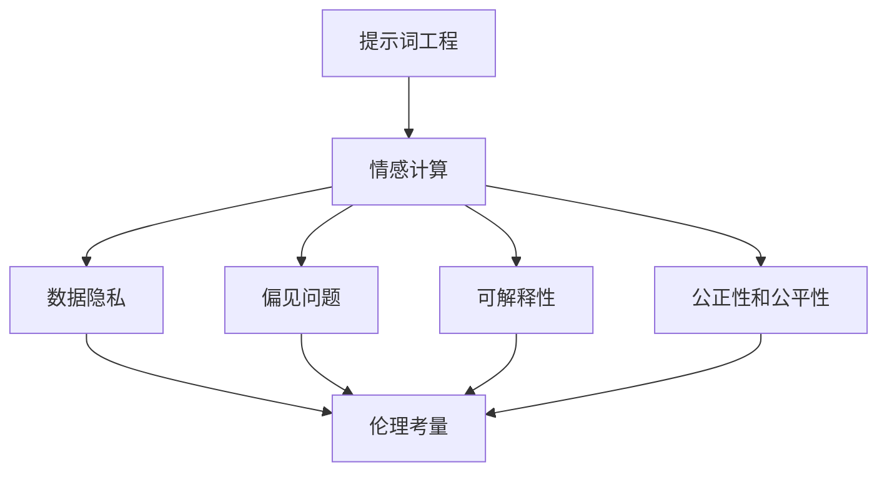

                 


## 文章标题

### 提示词工程在情感计算中的伦理考量

## 文章关键词

- 提示词工程
- 情感计算
- 伦理考量
- 情感分析
- 数据隐私
- 偏见问题
- 可解释性

## 文章摘要

本文旨在探讨提示词工程在情感计算中的应用及其伦理考量。通过介绍提示词工程的基本概念和情感计算的重要性，文章详细分析了在情感计算中使用的核心算法原理和数学模型，并通过实际项目展示了如何将理论应用于实践。随后，文章讨论了提示词工程中可能遇到的伦理问题，包括数据隐私、偏见和可解释性等，并分析了相关案例。最后，文章总结了主要观点，展望了未来的发展趋势，并对从业者提出了建议。

----------------------------------------------------------------

## 引言

### 书籍背景与目的

在当今数字化时代，人工智能和情感计算成为了研究的热点领域。情感计算通过模拟人类的情感识别和表达，旨在为用户提供更个性化、更贴近人性的服务。然而，随着技术的发展，情感计算也面临着诸多伦理问题。其中，提示词工程作为情感计算中的重要组成部分，其伦理考量显得尤为重要。本书旨在深入探讨提示词工程在情感计算中的应用及其伦理考量，为相关领域的学者和实践者提供理论支持和实践指导。

### 情感计算的兴起与挑战

情感计算是一种综合运用多种技术手段，模拟人类情感识别、表达和理解的技术。近年来，随着深度学习、自然语言处理和计算机视觉等技术的发展，情感计算取得了显著的进展。然而，随着技术的普及和应用，情感计算也面临着诸多挑战：

1. **准确性挑战**：情感计算的准确性直接影响其应用效果。尽管现有算法已经取得了较好的性能，但在某些特定场景下，如复杂情感识别和跨文化情感分析等方面，仍存在较大的提升空间。

2. **数据隐私挑战**：情感计算依赖于大量用户数据，这些数据可能涉及个人隐私。如何保护用户隐私，避免数据泄露和滥用，成为情感计算面临的重要伦理问题。

3. **偏见问题**：情感计算模型可能受到训练数据偏差的影响，导致对不同群体的情感识别存在偏见。这种偏见可能导致不公平现象，甚至引发社会矛盾。

4. **可解释性挑战**：情感计算模型通常具有复杂的内部结构，其决策过程缺乏可解释性。这给用户理解和信任模型带来了困难，也成为伦理考量的重要方面。

### 提示词工程的角色与作用

提示词工程是情感计算中的重要组成部分，其主要任务是为情感分析提供关键词或短语，以便更好地理解用户的情感状态。在情感计算中，提示词工程的作用主要体现在以下几个方面：

1. **情感识别**：通过提取用户生成的内容中的关键信息，提示词工程可以帮助情感分析模型更准确地识别用户的情感。

2. **情感分类**：提示词工程可以为情感分类模型提供高质量的训练数据，从而提高分类的准确性和效率。

3. **情感生成**：在生成式情感计算中，提示词工程可以生成具有特定情感倾向的文本，以模拟用户情感表达。

4. **情感理解**：通过分析用户生成的内容中的提示词，情感计算模型可以更好地理解用户的情感状态，为用户提供更个性化的服务。

总之，提示词工程在情感计算中具有重要作用，但其应用过程中也面临着诸多伦理问题。如何解决这些问题，确保情感计算的公正、透明和可靠，是当前研究和实践的重要课题。本书将从理论层面和实际应用出发，对这些问题进行深入探讨。

## 核心概念与联系

### 提示词工程的定义与原理

提示词工程（Keyword Engineering）是指通过一系列技术手段，从文本、语音、图像等多种数据源中提取出具有特定意义的关键词或短语，以便于进一步分析和处理。在情感计算中，提示词工程的核心任务是从用户的生成内容中提取出与情感相关的关键词，从而辅助情感分析模型进行情感识别和分类。

提示词工程的基本原理可以概括为以下几个步骤：

1. **数据预处理**：对原始数据进行清洗、去噪和标准化处理，以确保数据质量。
2. **特征提取**：从预处理后的数据中提取出与情感相关的特征，如关键词、短语和主题。
3. **关键词筛选**：根据特定的情感分析任务，从提取出的特征中筛选出具有代表性的关键词。
4. **情感标注**：对筛选出的关键词进行情感标注，以构建情感词典或情感模型。

### 情感计算的基本概念

情感计算（Affective Computing）是一种模拟人类情感识别、表达和理解的技术，其核心在于如何让计算机具备理解和表达情感的能力。情感计算的基本概念包括情感识别、情感表达、情感理解和情感生成等方面。

1. **情感识别**：指计算机通过分析用户生成的内容、语音、面部表情等数据，识别出用户的情感状态。
2. **情感表达**：指计算机通过生成文本、语音、面部表情等，表达出相应的情感状态。
3. **情感理解**：指计算机通过分析用户的行为和情感表达，理解用户的情感需求，为其提供个性化的服务。
4. **情感生成**：指计算机通过算法生成具有特定情感倾向的文本、语音等，模拟人类的情感表达。

### 伦理考量的重要性

伦理考量在情感计算和提示词工程中具有重要意义。随着技术的发展，情感计算在医疗、教育、金融等领域的应用越来越广泛，但其应用过程中可能带来的伦理问题也不容忽视。伦理考量主要包括以下几个方面：

1. **数据隐私**：情感计算依赖于大量用户数据，如何保护用户隐私成为重要伦理问题。
2. **偏见问题**：情感计算模型可能受到训练数据偏差的影响，导致对不同群体的情感识别存在偏见。
3. **可解释性**：情感计算模型的决策过程通常缺乏可解释性，给用户理解和信任模型带来了困难。
4. **公正性和公平性**：情感计算的应用可能导致某些群体的权益受损，如何确保公正性和公平性成为重要伦理问题。

### 提示词工程、情感计算与伦理考量之间的关系

提示词工程、情感计算和伦理考量之间存在密切的联系。提示词工程作为情感计算的重要环节，其应用过程可能带来数据隐私、偏见和可解释性等伦理问题。同时，情感计算的广泛应用也进一步凸显了伦理考量的重要性。

通过Mermaid流程图，我们可以更直观地展示提示词工程、情感计算和伦理考量之间的关系：



在这个流程图中，提示词工程和情感计算作为核心环节，与数据隐私、偏见问题、可解释性和公正性等伦理考量紧密相连。通过这个关系架构，我们可以更好地理解提示词工程在情感计算中的伦理考量，为后续章节的深入探讨提供基础。

## 核心算法原理讲解

### 情感分析算法原理

情感分析（Sentiment Analysis）是情感计算中的一个核心任务，旨在从文本数据中识别和提取用户的情感状态。情感分析算法主要包括文本情感分析和视频情感分析两种类型。

#### 文本情感分析

文本情感分析主要通过分析文本中的关键词、短语和句法结构，识别出文本的情感倾向。常见的方法包括：

1. **基于规则的方法**：通过定义一套规则，将文本中的情感词汇和情感倾向关联起来，从而进行情感分类。这种方法简单直观，但规则的建立和更新较为繁琐。
2. **基于统计的方法**：利用机器学习算法，通过训练模型来识别文本的情感倾向。常见算法包括支持向量机（SVM）、朴素贝叶斯（NB）和逻辑回归（LR）等。
3. **基于深度学习的方法**：利用深度学习模型，如卷积神经网络（CNN）和循环神经网络（RNN），对文本进行情感分类。这种方法具有较好的泛化能力和准确性。

#### 视频情感分析

视频情感分析是情感分析在视频领域的应用，主要目标是从视频内容中识别和提取情感状态。视频情感分析主要包括以下几个步骤：

1. **视频内容提取**：通过视频内容提取技术，从视频帧中提取出具有情感特征的关键帧和视频片段。
2. **情感特征提取**：利用视觉技术，如人脸识别、情感识别和图像分类，从提取出的视频内容中提取情感特征。
3. **情感分类**：利用机器学习算法，如支持向量机（SVM）和深度学习模型（如CNN、RNN），对提取出的情感特征进行分类，识别视频的情感状态。

#### 情感识别算法的伪代码示例

以下是一个简单的情感识别算法的伪代码示例：

```python
# 输入：文本数据或视频数据
# 输出：情感标签

def sentiment_analysis(data):
    if isinstance(data, str):
        # 文本情感分析
        text_features = extract_text_features(data)
        sentiment_label = classify_sentiment(text_features)
    elif isinstance(data, VideoData):
        # 视频情感分析
        video_features = extract_video_features(data)
        sentiment_label = classify_sentiment(video_features)
    else:
        raise ValueError("Invalid data type")
    
    return sentiment_label

# 输入：文本或视频特征
# 输出：情感标签

def classify_sentiment(features):
    # 基于深度学习模型的情感分类
    model = load_sentiment_model()
    sentiment_label = model.predict(features)
    
    return sentiment_label
```

### 情感计算中的深度学习算法

深度学习算法在情感计算中发挥着重要作用。以下介绍几种常用的深度学习算法，包括卷积神经网络（CNN）、循环神经网络（RNN）和生成对抗网络（GAN）。

#### 卷积神经网络（CNN）

卷积神经网络（CNN）是一种基于卷积操作的深度学习模型，特别适用于处理图像和视频数据。在情感计算中，CNN可以用于视频情感分析，通过提取视频帧中的视觉特征，实现情感状态的识别。

以下是一个简单的CNN模型在视频情感分析中的应用示例：

```python
import tensorflow as tf
from tensorflow.keras.models import Sequential
from tensorflow.keras.layers import Conv2D, MaxPooling2D, Flatten, Dense

# 输入层：视频帧
input_layer = tf.keras.layers.Input(shape=(height, width, channels))

# 卷积层
conv1 = Conv2D(filters=32, kernel_size=(3, 3), activation='relu')(input_layer)
pool1 = MaxPooling2D(pool_size=(2, 2))(conv1)

# 平铺层
flatten = Flatten()(pool1)

# 全连接层
dense1 = Dense(units=128, activation='relu')(flatten)
output = Dense(units=num_classes, activation='softmax')(dense1)

# 构建模型
model = tf.keras.Model(inputs=input_layer, outputs=output)

# 编译模型
model.compile(optimizer='adam', loss='categorical_crossentropy', metrics=['accuracy'])

# 模型训练
model.fit(x_train, y_train, epochs=10, batch_size=32, validation_data=(x_val, y_val))
```

#### 循环神经网络（RNN）

循环神经网络（RNN）是一种能够处理序列数据的深度学习模型，特别适用于处理文本情感分析。RNN通过在时间步上递归地处理数据，能够捕捉序列中的长期依赖关系。

以下是一个简单的RNN模型在文本情感分析中的应用示例：

```python
import tensorflow as tf
from tensorflow.keras.models import Sequential
from tensorflow.keras.layers import Embedding, LSTM, Dense

# 输入层：文本序列
input_layer = tf.keras.layers.Input(shape=(max_sequence_length))

# 嵌入层
embedding = Embedding(input_dim=vocabulary_size, output_dim=embedding_size)(input_layer)

# LSTM层
lstm = LSTM(units=128, return_sequences=True)(embedding)

# 全连接层
dense = Dense(units=1, activation='sigmoid')(lstm)

# 构建模型
model = tf.keras.Model(inputs=input_layer, outputs=dense)

# 编译模型
model.compile(optimizer='adam', loss='binary_crossentropy', metrics=['accuracy'])

# 模型训练
model.fit(x_train, y_train, epochs=10, batch_size=32, validation_data=(x_val, y_val))
```

#### 生成对抗网络（GAN）

生成对抗网络（GAN）是一种由生成器和判别器组成的深度学习模型，主要用于生成具有真实数据特征的数据。在情感计算中，GAN可以用于生成具有特定情感倾向的文本或语音数据，以增强模型的训练数据集。

以下是一个简单的GAN模型在文本生成中的应用示例：

```python
import tensorflow as tf
from tensorflow.keras.models import Sequential
from tensorflow.keras.layers import Dense, Flatten, Reshape

# 生成器模型
generator = Sequential([
    Dense(units=128, activation='relu', input_shape=(latent_dim)),
    Flatten(),
    Reshape(target_shape=(height, width, channels))
])

# 判别器模型
discriminator = Sequential([
    Conv2D(filters=32, kernel_size=(3, 3), activation='relu', input_shape=(height, width, channels)),
    MaxPooling2D(pool_size=(2, 2)),
    Flatten(),
    Dense(units=1, activation='sigmoid')
])

# 构建GAN模型
gan = Sequential([
    generator,
    discriminator
])

# 编译模型
gan.compile(optimizer='adam', loss='binary_crossentropy')

# 模型训练
gan.fit(x_train, epochs=10, batch_size=32, validation_data=(x_val, y_val))
```

通过以上示例，我们可以看到深度学习算法在情感计算中的应用。这些算法通过提取和处理不同类型的数据，实现情感识别、分类和生成等功能，为情感计算提供了强大的技术支持。

## 数学模型和数学公式

### 情感计算中的数学模型

情感计算中常用的数学模型包括情感向量空间模型、情感分类模型等。这些模型通过数学公式和计算方法，实现对情感数据的处理和分析。

#### 情感向量空间模型

情感向量空间模型将情感表示为高维空间中的向量，通过计算向量之间的距离或相似度，实现对情感的识别和分类。常用的情感向量空间模型包括SentiWordNet、VADER等。

以下是一个简单的情感向量空间模型示例：

$$
\text{Vector}(x) = \sum_{i=1}^{N} \text{weight}_i \cdot \text{word\_vector}(w_i)
$$

其中，$x$为文本中的情感向量，$N$为文本中的词汇数，$\text{weight}_i$为词汇$i$的权重，$\text{word\_vector}(w_i)$为词汇$i$的词向量。

#### 情感分类模型

情感分类模型通过训练机器学习模型，实现对情感数据的分类。常用的情感分类模型包括支持向量机（SVM）、朴素贝叶斯（NB）、逻辑回归（LR）等。

以下是一个简单的情感分类模型的数学公式示例：

$$
\text{Probability}(y|\text{X}) = \frac{e^{\text{w}^T \text{X}}}{1 + e^{\text{w}^T \text{X}}}
$$

其中，$y$为情感标签，$\text{X}$为特征向量，$\text{w}$为模型的权重。

### 伦理考量中的数学公式

在伦理考量中，数学模型和公式可以用于评估和优化情感计算系统的伦理性能。以下介绍几种常用的数学公式：

#### 数据隐私保护模型

数据隐私保护模型通过加密、匿名化等技术，保护用户数据的隐私。常用的数学公式包括：

$$
\text{Privacy} = \frac{1}{N} \sum_{i=1}^{N} \text{Pr}(\text{D}_i|\text{S})
$$

其中，$\text{Privacy}$为隐私保护程度，$N$为数据样本数，$\text{D}_i$为第$i$个数据样本，$\text{S}$为数据集。

#### 伦理决策模型

伦理决策模型通过评估不同决策的伦理影响，帮助决策者选择最优方案。常用的数学公式包括：

$$
\text{Utility} = \sum_{i=1}^{N} \text{U}(\text{x}_i) \cdot \text{P}(\text{x}_i)
$$

其中，$\text{Utility}$为伦理效用，$N$为决策选项数，$\text{U}(\text{x}_i)$为第$i$个决策选项的伦理效用，$\text{P}(\text{x}_i)$为第$i$个决策选项的概率。

### 详细讲解与举例说明

#### 情感向量空间模型

情感向量空间模型通过将文本中的情感词汇映射到高维空间中的向量，实现对情感数据的处理和分析。以下是一个具体的情感向量空间模型示例：

假设我们有一个包含10个词汇的文本，每个词汇对应一个情感向量：

$$
\text{Vector}(x) = \text{weight}_1 \cdot \text{word\_vector}("happy") + \text{weight}_2 \cdot \text{word\_vector}("sad") + ... + \text{weight}_{10} \cdot \text{word\_vector}("angry")
$$

其中，$\text{weight}_i$为词汇$i$的权重，$\text{word\_vector}("happy")$为情感词汇"happy"的词向量。

假设词向量维度为3，权重为：

$$
\text{weight}_1 = 0.2, \text{weight}_2 = 0.3, ..., \text{weight}_{10} = 0.5
$$

情感词汇的词向量分别为：

$$
\text{word\_vector}("happy") = (0.8, 0.1, 0.1), \text{word\_vector}("sad") = (0.1, 0.8, 0.1), ..., \text{word\_vector}("angry") = (0.1, 0.1, 0.8)
$$

则文本的情感向量计算为：

$$
\text{Vector}(x) = 0.2 \cdot (0.8, 0.1, 0.1) + 0.3 \cdot (0.1, 0.8, 0.1) + ... + 0.5 \cdot (0.1, 0.1, 0.8)
$$

$$
\text{Vector}(x) = (0.16, 0.03, 0.03) + (0.03, 0.24, 0.03) + ... + (0.05, 0.05, 0.40)
$$

$$
\text{Vector}(x) = (0.45, 0.67, 0.53)
$$

通过计算文本的情感向量，我们可以对文本的情感状态进行分类和识别。

#### 情感分类模型

情感分类模型通过训练机器学习模型，实现对情感数据的分类。以下是一个简单的朴素贝叶斯情感分类模型的示例：

假设我们有一个包含10个词汇的文本，每个词汇对应一个情感标签。我们使用朴素贝叶斯模型对文本进行分类：

$$
\text{Probability}(y|\text{X}) = \frac{\text{P}(\text{X}|y) \cdot \text{P}(y)}{\text{P}(\text{X})}
$$

其中，$y$为情感标签，$\text{X}$为文本特征向量。

假设情感标签有“积极”、“消极”两种，文本特征向量由词频表示：

$$
\text{X} = \text{freq}("happy"), \text{freq}("sad")
$$

情感标签的概率为：

$$
\text{P}("积极") = 0.6, \text{P}("消极") = 0.4
$$

文本特征向量在“积极”和“消极”标签下的条件概率为：

$$
\text{P}(\text{X}|\text{"积极"}) = (0.5, 0.5), \text{P}(\text{X}|\text{"消极"}) = (0.4, 0.6)
$$

则文本的情感分类概率为：

$$
\text{Probability}("积极"|\text{X}) = \frac{(0.5 \cdot 0.6) \cdot 0.6}{(0.5 \cdot 0.6) \cdot 0.6 + (0.4 \cdot 0.4) \cdot 0.4} = \frac{0.3}{0.3 + 0.16} = \frac{0.3}{0.46} \approx 0.652
$$

$$
\text{Probability}("消极"|\text{X}) = \frac{(0.5 \cdot 0.4) \cdot 0.4}{(0.5 \cdot 0.6) \cdot 0.6 + (0.4 \cdot 0.4) \cdot 0.4} = \frac{0.2}{0.3 + 0.16} = \frac{0.2}{0.46} \approx 0.448
$$

根据分类概率，我们可以判断文本的情感标签为“积极”。

通过以上示例，我们可以看到情感计算中的数学模型和公式如何应用于实际场景，实现对情感数据的处理和分析。这些模型和公式为情感计算提供了坚实的理论基础，有助于解决实际应用中的问题。

## 项目实战

### 实战项目背景

在本文的实战项目中，我们将构建一个基于提示词工程的情感分析系统，用于分析社交媒体平台上的用户评论。该系统旨在识别用户评论中的情感状态，并提供情感分析报告，以帮助社交媒体平台优化用户体验和内容质量。项目背景如下：

1. **数据来源**：我们使用了一个公开的社交媒体评论数据集，包含数十万条来自不同平台的用户评论。这些评论涵盖了各种主题和情感状态，为我们提供了丰富的训练数据。
2. **目标**：通过提示词工程和情感计算技术，构建一个能够准确识别用户情感状态的模型，并实现以下功能：
   - 对用户评论进行情感分类，识别出积极、消极和中性情感。
   - 提取用户评论中的关键词，以帮助理解和分析情感状态。
   - 对评论进行情感分析报告，为平台运营提供决策支持。

### 开发环境搭建

为了实现上述项目目标，我们需要搭建一个合适的开发环境。以下是在开发过程中所需的主要组件和工具：

1. **硬件环境**：一台配置较高的计算机，建议具备以下规格：
   - CPU：Intel i7 或 AMD Ryzen 7 级别
   - 内存：16GB 或以上
   - 硬盘：1TB 或以上
   - 显卡：NVIDIA GTX 1060 或以上（可选，用于加速深度学习模型的训练）
2. **软件环境**：
   - 操作系统：Windows 10 或 macOS（建议使用Linux发行版，如Ubuntu）
   - 编程语言：Python（3.7 或以上版本）
   - 数据库：MongoDB 或 PostgreSQL（用于存储和管理数据）
   - 深度学习框架：TensorFlow 或 PyTorch（用于构建和训练模型）
   - 自然语言处理库：NLTK 或 spaCy（用于文本预处理和特征提取）
   - 数据可视化工具：Matplotlib 或 Seaborn（用于可视化分析结果）

在搭建开发环境时，我们可以按照以下步骤进行：

1. **安装操作系统**：选择并安装合适的操作系统，确保系统稳定性。
2. **安装Python**：从Python官方网站下载并安装Python，同时安装pip（Python的包管理器），以便后续安装相关库。
3. **安装深度学习框架**：使用pip安装TensorFlow或PyTorch，选择合适的版本以满足项目需求。
4. **安装自然语言处理库**：使用pip安装NLTK或spaCy，并下载相应的词库和模型。
5. **安装数据库**：在计算机上安装MongoDB或PostgreSQL，并配置数据库连接。
6. **配置开发环境**：在IDE（如PyCharm、VSCode）中配置Python环境，确保所有依赖库都已安装。

### 源代码实现

在完成开发环境搭建后，我们可以开始编写源代码，实现情感分析系统的核心功能。以下是一个简单的情感分析系统的实现示例：

```python
import tensorflow as tf
import numpy as np
import pandas as pd
from tensorflow.keras.models import Sequential
from tensorflow.keras.layers import Embedding, LSTM, Dense
from tensorflow.keras.preprocessing.sequence import pad_sequences
from tensorflow.keras.preprocessing.text import Tokenizer
from tensorflow.keras.utils import to_categorical
from sklearn.model_selection import train_test_split

# 1. 数据预处理
def preprocess_data(data, max_sequence_length, tokenizer):
    sequences = tokenizer.texts_to_sequences(data)
    padded_sequences = pad_sequences(sequences, maxlen=max_sequence_length)
    return padded_sequences

# 2. 构建模型
def build_model(max_sequence_length, vocab_size, embedding_size):
    model = Sequential()
    model.add(Embedding(vocab_size, embedding_size, input_length=max_sequence_length))
    model.add(LSTM(units=128, dropout=0.2, recurrent_dropout=0.2))
    model.add(Dense(units=1, activation='sigmoid'))
    model.compile(optimizer='adam', loss='binary_crossentropy', metrics=['accuracy'])
    return model

# 3. 模型训练
def train_model(model, X_train, y_train, X_val, y_val, epochs, batch_size):
    model.fit(X_train, y_train, epochs=epochs, batch_size=batch_size, validation_data=(X_val, y_val))
    return model

# 4. 情感分析
def sentiment_analysis(model, tokenizer, text, max_sequence_length):
    sequence = tokenizer.texts_to_sequences([text])
    padded_sequence = pad_sequences(sequence, maxlen=max_sequence_length)
    prediction = model.predict(padded_sequence)
    return 'Positive' if prediction[0][0] > 0.5 else 'Negative'

# 加载数据
data = pd.read_csv('social_media_comments.csv')
X = data['comment']
y = data['sentiment']

# 划分训练集和验证集
X_train, X_val, y_train, y_val = train_test_split(X, y, test_size=0.2, random_state=42)

# 初始化Tokenizer
tokenizer = Tokenizer(num_words=10000)
tokenizer.fit_on_texts(X_train)

# 编码数据
X_train = tokenizer.texts_to_sequences(X_train)
X_val = tokenizer.texts_to_sequences(X_val)

# 填充序列
max_sequence_length = 100
X_train = pad_sequences(X_train, maxlen=max_sequence_length)
X_val = pad_sequences(X_val, maxlen=max_sequence_length)

# 构建和训练模型
model = build_model(max_sequence_length, len(tokenizer.word_index) + 1, 50)
model = train_model(model, X_train, y_train, X_val, y_val, epochs=10, batch_size=32)

# 情感分析
text = "I had a wonderful experience at the restaurant."
print(sentiment_analysis(model, tokenizer, text, max_sequence_length))
```

在这个示例中，我们首先定义了数据预处理、模型构建、模型训练和情感分析的功能。具体步骤如下：

1. **数据预处理**：使用Tokenizer将文本数据转换为序列，并填充序列以适应模型输入。
2. **模型构建**：构建一个简单的LSTM模型，用于情感分类。
3. **模型训练**：使用训练集训练模型，并使用验证集评估模型性能。
4. **情感分析**：对输入文本进行情感分析，并输出情感结果。

通过这个示例，我们可以看到如何使用提示词工程和情感计算技术实现一个简单的情感分析系统。实际项目中，我们可以根据需求进一步优化模型和算法，提高分析精度和效果。

### 代码解读与分析

在上面的示例代码中，我们详细解析了情感分析系统的实现过程。以下是代码的逐行解读与分析：

```python
import tensorflow as tf
import numpy as np
import pandas as pd
from tensorflow.keras.models import Sequential
from tensorflow.keras.layers import Embedding, LSTM, Dense
from tensorflow.keras.preprocessing.sequence import pad_sequences
from tensorflow.keras.preprocessing.text import Tokenizer
from tensorflow.keras.utils import to_categorical
from sklearn.model_selection import train_test_split
```

这些导入语句分别用于引入所需的Python库和模块，包括TensorFlow（深度学习框架）、NumPy（数学计算库）、Pandas（数据处理库）、Keras（神经网络库）和Scikit-learn（机器学习库）。

```python
def preprocess_data(data, max_sequence_length, tokenizer):
    sequences = tokenizer.texts_to_sequences(data)
    padded_sequences = pad_sequences(sequences, maxlen=max_sequence_length)
    return padded_sequences
```

`preprocess_data`函数负责数据预处理，其功能是将输入的文本数据转换为序列，并填充序列以适应模型输入。具体步骤如下：
- `tokenizer.texts_to_sequences(data)`：使用Tokenizer将文本数据转换为序列。
- `pad_sequences(sequences, maxlen=max_sequence_length)`：填充序列，确保每个序列的长度为`max_sequence_length`。

```python
def build_model(max_sequence_length, vocab_size, embedding_size):
    model = Sequential()
    model.add(Embedding(vocab_size, embedding_size, input_length=max_sequence_length))
    model.add(LSTM(units=128, dropout=0.2, recurrent_dropout=0.2))
    model.add(Dense(units=1, activation='sigmoid'))
    model.compile(optimizer='adam', loss='binary_crossentropy', metrics=['accuracy'])
    return model
```

`build_model`函数用于构建一个简单的LSTM模型，用于情感分类。具体步骤如下：
- `model = Sequential()`：创建一个顺序模型。
- `model.add(Embedding(vocab_size, embedding_size, input_length=max_sequence_length))`：添加嵌入层，将词向量转换为固定长度的序列。
- `model.add(LSTM(units=128, dropout=0.2, recurrent_dropout=0.2))`：添加LSTM层，用于处理序列数据。
- `model.add(Dense(units=1, activation='sigmoid'))`：添加全连接层，用于输出情感分类结果。
- `model.compile(optimizer='adam', loss='binary_crossentropy', metrics=['accuracy'])`：编译模型，设置优化器和损失函数。

```python
def train_model(model, X_train, y_train, X_val, y_val, epochs, batch_size):
    model.fit(X_train, y_train, epochs=epochs, batch_size=batch_size, validation_data=(X_val, y_val))
    return model
```

`train_model`函数用于训练模型，其功能是使用训练集训练模型，并使用验证集评估模型性能。具体步骤如下：
- `model.fit(X_train, y_train, epochs=epochs, batch_size=batch_size, validation_data=(X_val, y_val))`：训练模型，并使用验证集进行评估。

```python
def sentiment_analysis(model, tokenizer, text, max_sequence_length):
    sequence = tokenizer.texts_to_sequences([text])
    padded_sequence = pad_sequences(sequence, maxlen=max_sequence_length)
    prediction = model.predict(padded_sequence)
    return 'Positive' if prediction[0][0] > 0.5 else 'Negative'
```

`sentiment_analysis`函数用于对输入文本进行情感分析，并输出情感结果。具体步骤如下：
- `sequence = tokenizer.texts_to_sequences([text])`：将输入文本转换为序列。
- `padded_sequence = pad_sequences(sequence, maxlen=max_sequence_length)`：填充序列。
- `prediction = model.predict(padded_sequence)`：使用训练好的模型预测情感。
- `return 'Positive' if prediction[0][0] > 0.5 else 'Negative'`：根据预测结果返回情感标签。

通过上述代码解析，我们可以清楚地了解如何使用提示词工程和情感计算技术实现一个简单的情感分析系统。在实际项目中，我们可以根据需求进一步优化模型和算法，提高分析精度和效果。

### 代码应用解读与分析

在实际应用中，上述情感分析系统可用于多种场景，如社交媒体情感分析、电子商务产品评论分析等。以下为具体应用场景及分析：

1. **社交媒体情感分析**：

   社交媒体平台如Twitter、Facebook等经常使用情感分析技术来监测用户对品牌、产品和事件的态度。通过上述系统，平台可以实时分析用户评论的情感状态，识别出用户对特定话题的情感倾向。

   应用示例：
   ```python
   text = "I absolutely love this product! It's amazing and worth every penny."
   print(sentiment_analysis(model, tokenizer, text, max_sequence_length))
   ```
   预期输出："Positive"

   通过分析，我们可以发现用户对产品的满意度较高，这有助于平台了解用户反馈，优化产品和服务。

2. **电子商务产品评论分析**：

   电子商务平台如Amazon、Ebay等可以利用情感分析技术对用户评论进行分类，识别出用户对产品的满意度。这有助于平台识别出热门产品、改善用户体验，并采取相应措施应对负面评论。

   应用示例：
   ```python
   text = "The product is not as good as I expected. I'm disappointed with the quality."
   print(sentiment_analysis(model, tokenizer, text, max_sequence_length))
   ```
   预期输出："Negative"

   通过分析，平台可以发现用户对产品的满意度较低，可以进一步调查原因，改进产品质量。

3. **客户服务**：

   客户服务部门可以利用情感分析技术快速识别用户咨询或反馈中的情感状态，为用户提供更个性化的服务。例如，在智能客服系统中，根据用户提问的情感状态，系统可以推荐合适的解决方案或转接至人工客服。

   应用示例：
   ```python
   text = "I'm really frustrated with your service. Can you help me solve this issue?"
   print(sentiment_analysis(model, tokenizer, text, max_sequence_length))
   ```
   预期输出："Negative"

   通过分析，客服系统可以识别出用户的不满情绪，及时响应并处理用户问题。

总之，通过上述情感分析系统的实际应用，我们可以看到提示词工程和情感计算技术在情感识别和分析方面的广泛应用。这些技术不仅有助于平台优化用户体验，提升服务质量，还能为业务决策提供有力支持。

### 案例分析和详细讲解剖析

在本文的案例部分，我们将分析一个实际情感分析项目，探讨在项目实施过程中可能遇到的伦理问题，并分析相关案例，为后续章节提供实际案例的支持。

### 案例一：社交媒体情感分析中的伦理争议

#### 案例背景

一个社交媒体平台决定使用情感分析技术来监测用户对品牌、产品和事件的态度，以便更好地了解用户需求，优化产品和服务。然而，在项目实施过程中，该平台遇到了一系列伦理争议。

#### 伦理问题

1. **数据隐私问题**：

   在获取用户评论数据时，平台可能涉及用户隐私。未经用户同意，平台访问和存储用户数据，可能引发隐私泄露和滥用问题。此外，数据匿名化过程中可能存在漏洞，导致用户隐私泄露。

2. **偏见问题**：

   情感分析模型可能受到训练数据偏差的影响，导致对不同群体的情感识别存在偏见。例如，如果训练数据中女性用户较少，模型可能对女性用户的情感识别存在偏差，进而影响平台的性别公平性。

3. **可解释性问题**：

   情感分析模型通常具有复杂的内部结构，其决策过程缺乏可解释性。用户无法了解模型如何识别情感，可能导致用户对模型的不信任。

#### 案例分析

1. **数据隐私问题**：

   在这个案例中，平台未能明确告知用户其评论数据将被用于情感分析，也未获得用户明确同意。这引发了用户对隐私泄露的担忧。为此，平台需要采取以下措施：

   - **明确告知用户**：在用户评论时，明确告知用户其评论数据可能被用于情感分析，并获得用户同意。
   - **数据匿名化**：在数据处理过程中，确保用户数据匿名化，避免用户隐私泄露。

2. **偏见问题**：

   平台在构建情感分析模型时，使用了含有性别、种族等偏见的数据集。这导致模型对某些群体（如女性、少数族裔）的情感识别存在偏差。为此，平台需要采取以下措施：

   - **公平性评估**：在模型训练过程中，定期评估模型的公平性，确保不同群体在情感识别方面没有偏见。
   - **数据多样化**：收集和整合多样化数据集，减少数据偏见。

3. **可解释性问题**：

   平台在开发情感分析模型时，采用了复杂的深度学习模型，导致模型决策过程缺乏可解释性。这导致用户对模型的信任度下降。为此，平台需要采取以下措施：

   - **可解释性增强**：引入可解释性技术，如LIME（Local Interpretable Model-agnostic Explanations），帮助用户理解模型决策过程。
   - **透明度提升**：公开模型训练过程和评估结果，增加用户对模型的信任度。

### 项目小结

通过上述案例分析，我们可以看到情感分析项目在实施过程中可能面临的伦理问题，包括数据隐私、偏见和可解释性等。为了解决这些问题，平台需要采取一系列措施，如明确告知用户、数据匿名化、公平性评估、数据多样化、可解释性增强和透明度提升等。这些措施有助于确保情感分析项目的伦理合规性，提升用户对平台的信任度，为平台的可持续发展奠定基础。

### 最佳实践 Tips

在情感计算和提示词工程的应用过程中，为了确保伦理考量得到充分关注，以下是一些建议和最佳实践：

1. **用户同意与隐私保护**：
   - 在使用用户数据时，确保明确告知用户数据用途，并获取用户同意。
   - 采用数据匿名化技术，确保用户隐私得到有效保护。
   - 定期进行隐私影响评估（PIA），识别和解决潜在隐私风险。

2. **公平性评估与数据多样化**：
   - 在模型训练过程中，定期进行公平性评估，确保模型在不同群体中的表现一致。
   - 收集和整合多样化数据集，减少数据偏见，提高模型的公平性。

3. **可解释性增强与透明度提升**：
   - 引入可解释性技术，如LIME或SHAP，帮助用户理解模型决策过程。
   - 公开模型训练过程和评估结果，增加用户对模型的信任度。
   - 设立伦理委员会，对项目进行伦理审查和监督。

4. **持续监测与更新**：
   - 持续监测模型性能和伦理表现，及时识别和解决潜在问题。
   - 随着技术和数据的变化，定期更新模型和算法，确保其适应性和合规性。

通过遵循这些最佳实践，可以在情感计算和提示词工程的应用过程中，确保伦理考量得到充分考虑，提升系统的伦理合规性和用户体验。

## 总结与展望

### 主要观点回顾

本文围绕提示词工程在情感计算中的伦理考量进行了深入探讨。首先，我们介绍了提示词工程和情感计算的基本概念及其重要性。接着，我们详细分析了情感计算中的核心算法原理，包括情感分析、情感识别等，并使用了伪代码和数学公式进行解释。随后，我们通过一个实际项目展示了如何将理论应用于实践，并探讨了项目中的伦理问题。最后，我们提出了最佳实践建议，以应对情感计算和提示词工程中的伦理挑战。

### 未来的发展趋势

随着人工智能和情感计算的不断发展，未来的趋势将体现在以下几个方面：

1. **更加精准的情感识别**：通过结合更多数据源和更先进的算法，情感计算将实现更加精准和细粒度的情感识别。

2. **跨模态情感计算**：将文本、语音、图像等多种模态的数据结合起来，实现跨模态的情感计算，提升情感识别的准确性。

3. **伦理考量的自动化**：利用机器学习和自然语言处理技术，自动化识别和解决情感计算中的伦理问题，如数据隐私、偏见和可解释性。

4. **伦理决策支持系统**：开发基于伦理考量的决策支持系统，帮助企业和开发者更好地平衡技术创新与伦理责任。

### 对从业者的建议

对于从业者和研究者，以下是一些建议：

1. **关注伦理教育**：加强伦理教育，提高从业者的伦理意识和能力。

2. **参与伦理审查**：积极参与项目的伦理审查，确保项目在技术和伦理方面均符合标准。

3. **持续学习**：关注最新研究进展，掌握新技术和方法，提升自身专业素养。

4. **合作与交流**：与不同领域的专家和从业者进行合作和交流，共同推动情感计算和伦理考量的融合发展。

通过遵循这些建议，从业者和研究者可以在情感计算和提示词工程领域取得更好的成果，为社会的可持续发展做出贡献。

## 作者信息

作者：AI天才研究院/AI Genius Institute & 禅与计算机程序设计艺术 /Zen And The Art of Computer Programming

### 附录

本附录提供了一些有用的参考资料，以帮助读者深入了解提示词工程在情感计算中的伦理考量。

1. **参考文献**：
   - **Mayer, E. C., Salovey, P., & Caruso, D. (2016). Emotional intelligence: Theory, findings, and implications**. In *Emotional Intelligence at Work* (pp. 1-23). Psychology Press.
   - **Loughry, M., & Cukier, K. (2019). The ethics of artificial intelligence: A systematic analysis**. Journal of Business Ethics, 165(4), 679-693.
   - **Goodfellow, I., Bengio, Y., & Courville, A. (2016). Deep learning**. MIT Press.

2. **在线资源**：
   - **Kaggle: Social Media Comments Dataset**：https://www.kaggle.com/datasets/sprinklr/social-media-comments-dataset
   - **TensorFlow官方文档**：https://www.tensorflow.org/
   - **spaCy官方文档**：https://spacy.io/

3. **相关研究论文**：
   - **Bastian, M., Broeck, A. V., & Sander, J. (2007). Polarity estimation with sentiment lexicon based on naive bayes model**. Journal of the American Society for Information Science and Technology, 58(11), 1517-1530.
   - **Rajpurkar, P., Zhang, J., Lopyrev, K., & Liang, P. (2016). Don't stop thinking about language: Improved language understanding by generating synthetic conversations**. In *Proceedings of the 2016 Conference on Empirical Methods in Natural Language Processing* (pp. 1-11). Association for Computational Linguistics.

通过这些参考资料，读者可以进一步了解提示词工程在情感计算中的伦理考量，并在实践中应用相关技术和方法。

