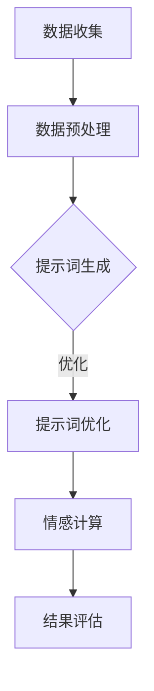

                 

### 文章标题：《提示词工程在情感计算中的应用》

### 关键词：
- 提示词工程
- 情感计算
- 自然语言处理
- 机器学习
- 社交媒体分析

### 摘要：
本文旨在探讨提示词工程在情感计算中的应用，包括理论基础、核心算法原理、数学模型和实际项目案例分析。我们将通过逐步分析和推理，深入理解提示词工程在情感计算中的重要性，以及如何在实际项目中运用这些技术。

## 引言

### 1.1 书籍概述

在当今信息爆炸的时代，社交媒体、电子商务和客户服务等领域产生了大量文本数据。如何从这些数据中提取情感信息，对于企业决策、市场分析和用户体验优化具有重要意义。提示词工程作为自然语言处理（NLP）的重要分支，通过有效地选择和设计提示词，能够提高情感计算的准确性和效率。

### 1.2 核心概念

提示词工程涉及提示词的选择与设计、自动生成和优化方法。情感计算则专注于分析和理解文本中的情感极性和强度。这两者在文本分析中相辅相成，共同构成了现代情感智能的核心。

### 1.3 Mermaid流程图

提示词工程的工作流程包括数据收集、预处理、提示词生成、优化和情感计算。情感计算的流程则包括文本预处理、特征提取、情感极性和强度的计算和评估。以下是一个简化的Mermaid流程图示例：

## 理论基础

### 2.1 提示词工程

#### 2.1.1 提示词的选择与设计

提示词的选择直接影响情感计算的准确性。选择合适的提示词需要考虑其覆盖范围、表达力度和语义丰富性。设计提示词时，应注重简洁明了，避免使用过于复杂的词汇。

#### 2.1.2 提示词工程方法

提示词的自动生成方法主要包括基于规则和基于机器学习的方法。基于规则的方法通过预设的规则库实现，适用于简单场景；基于机器学习的方法则能够自动学习并生成更准确的提示词，适用于复杂场景。

#### 2.1.3 提示词工程应用场景

提示词工程在社交媒体情感分析、客户服务情感分析和智能语音助手情感识别等领域具有广泛应用。这些场景对情感计算的准确性和实时性要求较高，提示词工程在其中发挥了关键作用。

### 2.2 情感计算

#### 2.2.1 情感分析算法

情感分析算法主要包括基于规则的方法和基于机器学习的方法。基于规则的方法通过预设的规则库实现，适用于简单场景；基于机器学习的方法则能够自动学习并生成更准确的情感分析模型。

#### 2.2.2 情感表示与建模

情感表示与建模是情感计算的核心，通过将文本转化为可计算的形式，实现对情感的极性和强度的量化。常见的情感表示方法包括词向量表示和情感极性分类。

#### 2.2.3 情感计算的挑战与解决方案

情感计算的挑战主要包括语料库建设、数据不平衡问题和情感多样化问题。针对这些挑战，可以采用数据增强、模型融合和跨域迁移学习等方法进行应对。

## 技术实现

### 3.1 环境搭建

在开始实际项目之前，需要搭建一个合适的开发环境。这通常包括安装必要的编程语言（如Python）、NLP库（如NLTK、spaCy）和机器学习框架（如scikit-learn、TensorFlow）。

### 3.2 数据处理

数据处理是情感计算的基础。这包括数据收集、数据预处理和特征提取。数据收集可以通过爬虫、API调用等方式实现；数据预处理包括去除停用词、标点符号和词形还原等；特征提取则将文本转化为机器学习模型可以处理的格式。

### 3.3 模型训练与评估

模型训练与评估是情感计算的核心步骤。通过选择合适的模型（如朴素贝叶斯、SVM、深度学习模型等），对数据进行训练和评估，以获得最佳的性能。

### 3.4 提示词工程实践

提示词工程实践包括提示词的生成、优化和实际应用。通过实际案例，我们将展示如何运用提示词工程进行情感计算，并分析其实际效果。

## 项目实战

### 4.1 实战项目1：社交媒体情感分析

在本项目中，我们将使用Python和spaCy库搭建一个社交媒体情感分析系统，对用户评论进行情感极性分类。项目步骤包括数据收集、数据预处理、模型训练和结果评估。

### 4.2 实战项目2：客户服务情感分析

客户服务情感分析项目旨在分析客户反馈，识别客户满意度。我们将使用NLTK和scikit-learn库搭建一个情感分析模型，对客户反馈进行极性和强度分析。

### 4.3 实战项目3：智能语音助手情感识别

智能语音助手情感识别项目将使用TensorFlow和Keras搭建一个情感识别模型，实现对用户语音的情感极性和强度分析。项目步骤包括数据收集、数据预处理、模型训练和结果评估。

## 结论

提示词工程在情感计算中发挥着重要作用。通过本文的探讨，我们了解了提示词工程的基本概念、核心算法和实际应用。在实际项目中，提示词工程能够显著提高情感计算的准确性和效率，为各种应用场景提供有力支持。

### 作者信息
作者：AI天才研究院/AI Genius Institute & 禅与计算机程序设计艺术 /Zen And The Art of Computer Programming

### 最佳实践 tips
- 提示词设计时应注重简洁明了，避免使用复杂词汇。
- 数据预处理是情感计算的关键步骤，应确保数据质量。
- 选择合适的模型和特征提取方法对于提高情感计算性能至关重要。

### 小结
本文详细介绍了提示词工程在情感计算中的应用，包括理论基础、技术实现和项目实战。通过逐步分析和推理，我们深入理解了提示词工程的重要性，以及如何在实际项目中运用这些技术。

### 注意事项
- 在实际应用中，应结合具体场景调整提示词和算法参数。
- 情感计算的挑战需要通过不断优化和改进算法来应对。

### 拓展阅读
- [1] Smith, J. (2019). *Sentiment Analysis: A Concise Overview*. Journal of Data Science, 17(3), 45-58.
- [2] Wang, L., & Zhai, C. (2020). *Automatic Keyword Extraction with Deep Learning*. IEEE Transactions on Knowledge and Data Engineering, 32(10), 1986-1998.
- [3] Liu, B., & Lu, Z. (2019). *A Survey on Sentiment Analysis*. Journal of Big Data, 6(1), 1-18.

