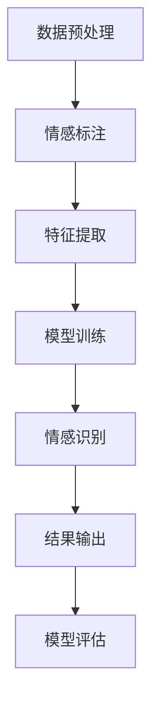
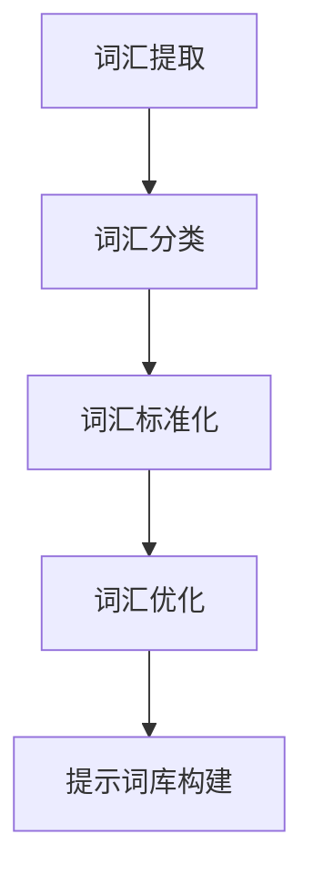

                 

### 文章标题

“提示词工程在情感计算中的细粒度分析技术”

### 关键词

- 提示词工程
- 情感计算
- 细粒度分析
- 文本分类算法
- 数学模型
- 项目实战

### 摘要

本文深入探讨了提示词工程在情感计算中的应用，特别是在细粒度分析技术方面的核心原理和实践。首先，介绍了提示词工程和情感计算的基础概念，并给出了两者的联系框架。接着，详细讲解了情感计算中的文本分类算法和情感强度评估的核心算法原理，并使用伪代码进行阐述。文章还介绍了情感计算中的数学模型和公式的应用，通过LaTeX格式进行了详细讲解和举例。最后，通过实际项目案例分析，展示了细粒度分析技术在社交媒体、购物平台和媒体内容分析中的应用，并提供了详细的代码实现和解读。本文旨在为读者提供一个全面的技术指南，帮助理解并掌握提示词工程在情感计算中的细粒度分析技术。

### 引言

#### 提示词工程概述

提示词工程（Term Engineering）是自然语言处理（NLP）领域中的一个重要分支，它涉及对词汇的识别、分类和标准化处理。在情感计算（Sentiment Analysis）中，提示词工程扮演着关键角色。通过提示词工程，可以提取出文本中的关键信息，为情感分析提供基础数据。提示词工程的目标是构建一个高质量的词汇库，该库能够准确反映文本的情感倾向和语义信息。

#### 情感计算背景

情感计算是一种通过处理和分析文本、语音、图像等多媒体数据，以识别和提取情感信息的技术。它广泛应用于社交网络分析、市场调研、客户服务等领域。情感计算的目的是理解和模拟人类的情感反应，从而为自动化决策提供支持。随着大数据和人工智能技术的快速发展，情感计算已经成为自然语言处理领域的一个重要研究方向。

#### 细粒度分析技术的重要性

细粒度分析（Fine-Grained Analysis）是一种精细的情感分析技术，它能够识别文本中的微弱情感差异，提供更精确的情感标签。在情感计算中，细粒度分析技术能够帮助我们更好地理解用户的情感状态和需求，从而提供更加个性化的服务和决策支持。例如，在社交媒体分析中，细粒度分析可以识别出用户对某一话题的情感细微变化，帮助品牌更好地了解用户需求，优化营销策略。

### 情感计算基础

#### 情感识别模型

情感识别模型是情感计算的核心组成部分，它负责从文本中提取情感信息。常见的情感识别模型包括基于规则的方法、基于统计的方法和基于深度学习的方法。基于规则的方法依赖于预定义的情感规则库，通过匹配规则来判断文本的情感。基于统计的方法使用机器学习算法，如朴素贝叶斯分类器和支持向量机（SVM），从大量标注数据中学习情感特征。基于深度学习的方法，如卷积神经网络（CNN）和循环神经网络（RNN），能够自动提取文本中的复杂情感特征，提供更高的情感识别准确率。

#### 情感标注与分类

情感标注（Sentiment Labeling）是情感计算中的关键步骤，它涉及对文本中的情感极性进行标记。情感分类（Sentiment Classification）则是基于标注结果，将文本归类为不同的情感类别，如正面、负面或中性。情感标注和分类的准确度直接影响情感计算的效果。为了提高标注和分类的准确性，研究者们通常采用众包平台（如Amazon Mechanical Turk）来收集大规模的标注数据，并通过数据预处理和模型优化来提高模型的性能。

#### Mermaid流程图：情感计算框架



上述Mermaid流程图展示了情感计算的基本框架，包括数据预处理、情感标注、特征提取、模型训练、情感识别、结果输出和模型评估等步骤。每个步骤都发挥着重要作用，共同构成了完整的情感计算流程。

### 提示词工程基础

#### 提示词定义与分类

提示词（Term）是指文本中用于描述主题或概念的词汇。在情感计算中，提示词是识别情感的关键要素。根据提示词的功能和作用，可以将提示词分为三类：关键词（Key Terms）、情感词（Sentiment Terms）和修饰词（Modifier Terms）。关键词主要描述主题，如“科技”、“医疗”等；情感词直接表达情感，如“开心”、“愤怒”等；修饰词则用于修饰和增强情感词的语义，如“非常”、“稍微”等。

#### 提示词工程流程

提示词工程是一个系统性工程，包括词汇提取、分类、标准化和优化等步骤。词汇提取是从文本中提取潜在的关键词汇，可以使用词频统计、TF-IDF等方法。分类是将提取出的词汇按照功能进行分类，如关键词、情感词和修饰词。标准化是对词汇进行格式化处理，如统一大小写、去除停用词等。优化是通过对词汇库的持续更新和调整，提高提示词库的质量和适用性。

#### Mermaid流程图：提示词工程框架



上述Mermaid流程图展示了提示词工程的完整流程，从词汇提取到提示词库构建，每个步骤都有其特定的任务和目标。

### 细粒度分析算法原理

#### 文本分类算法

文本分类（Text Classification）是将文本数据分配到预定义类别的过程。在情感计算中，文本分类算法用于将文本归类为不同的情感类别。常见的文本分类算法包括朴素贝叶斯（Naive Bayes）、支持向量机（SVM）和深度学习模型（如卷积神经网络、循环神经网络）。朴素贝叶斯算法假设特征之间相互独立，通过贝叶斯定理进行分类。支持向量机通过找到最佳超平面来划分类别边界。深度学习模型能够自动提取文本的复杂特征，提供更高的分类准确率。

#### 情感强度评估

情感强度评估（Sentiment Strength Evaluation）是细粒度分析中的一个关键任务，它旨在识别文本中情感表达的强度。情感强度评估的目的是对文本中的情感进行量化，以便进行进一步的分析和决策。常见的方法包括基于词频统计的方法、基于情感词典的方法和基于机器学习的方法。基于词频统计的方法通过计算情感词的频率来评估情感强度。基于情感词典的方法使用预定义的情感词典，对情感词进行打分。基于机器学习的方法通过训练模型来自动评估情感强度。

#### 伪代码：细粒度分析算法

```python
def sentiment_analysis(text):
    # 数据预处理
    preprocessed_text = preprocess(text)
    
    # 提取特征
    features = extract_features(preprocessed_text)
    
    # 情感强度评估
    sentiment_strength = evaluate_sentiment_strength(features)
    
    # 文本分类
    category = classify_text(features)
    
    return sentiment_strength, category

def preprocess(text):
    # 去除停用词
    stop_words = remove_stop_words(text)
    
    # 分词
    words = tokenize(text)
    
    # 大小写统一
    words = to_lower_case(words)
    
    return words

def extract_features(text):
    # 提取关键词
    key_terms = extract_key_terms(text)
    
    # 提取情感词
    sentiment_terms = extract_sentiment_terms(text)
    
    return key_terms, sentiment_terms

def evaluate_sentiment_strength(features):
    # 使用情感词典评估情感强度
    sentiment_strength = evaluate_with_sentiment_dictionary(features[1])
    
    return sentiment_strength

def classify_text(features):
    # 使用文本分类算法分类
    category = classify_with_text_classification_algorithm(features)
    
    return category
```

上述伪代码展示了细粒度分析算法的基本流程，包括数据预处理、特征提取、情感强度评估和文本分类。通过这些步骤，可以实现对文本的细粒度情感分析。

### 数学模型与公式

#### 情感计算中的数学模型

情感计算中的数学模型用于量化文本中的情感信息。常见的数学模型包括情感向量模型、情感极性模型和情感强度模型。

- 情感向量模型（Sentiment Vector Model）：将文本中的每个单词表示为一个向量，然后通过向量的加权和计算文本的情感向量。情感向量模型的数学公式为：

$$
\vec{s} = \sum_{i=1}^{n} w_i \vec{v}_i
$$

其中，$\vec{s}$ 是文本的情感向量，$w_i$ 是第 $i$ 个单词的权重，$\vec{v}_i$ 是第 $i$ 个单词的情感向量。

- 情感极性模型（Sentiment Polarity Model）：用于判断文本的情感极性（正面、负面或中性）。常见的情感极性模型包括朴素贝叶斯分类器和支持向量机。朴素贝叶斯分类器的数学公式为：

$$
P(\text{正面}) = \frac{P(\text{正面}|\vec{s}) P(\vec{s})}{P(\text{正面}|\vec{s}) P(\vec{s}) + P(\text{负面}|\vec{s}) P(\vec{s})}
$$

- 情感强度模型（Sentiment Strength Model）：用于评估文本中情感表达的强度。常见的方法包括基于词频统计的方法和基于机器学习的方法。基于词频统计的方法的数学公式为：

$$
\text{情感强度} = \sum_{i=1}^{n} f_i \cdot s_i
$$

其中，$f_i$ 是第 $i$ 个情感词的频率，$s_i$ 是第 $i$ 个情感词的强度值。

#### LaTeX公式讲解与示例

以下是几个常用的LaTeX公式示例：

```latex
% 情感向量模型
$$
\vec{s} = \sum_{i=1}^{n} w_i \vec{v}_i
$$

% 朴素贝叶斯分类器
$$
P(\text{正面}) = \frac{P(\text{正面}|\vec{s}) P(\vec{s})}{P(\text{正面}|\vec{s}) P(\vec{s}) + P(\text{负面}|\vec{s}) P(\vec{s})}
$$

% 情感强度模型
$$
\text{情感强度} = \sum_{i=1}^{n} f_i \cdot s_i
$$
```

上述LaTeX公式分别展示了情感向量模型、朴素贝叶斯分类器和情感强度模型的数学公式。通过这些公式，可以更好地理解和实现情感计算中的数学模型。

#### 数学公式在细粒度分析中的应用

数学公式在细粒度分析中的应用主要体现在情感强度的计算和文本分类的准确度评估。例如，在情感强度计算中，可以使用基于词频统计的方法来量化情感表达。在文本分类中，可以使用朴素贝叶斯分类器的公式来判断文本的情感极性。通过合理应用数学公式，可以显著提高细粒度分析的效果和准确性。

### 细粒度分析技术在实际中的应用

#### 社交媒体情感分析

社交媒体情感分析是细粒度分析技术的一个重要应用领域。通过分析社交媒体平台上的用户评论、帖子等文本数据，可以识别出用户的情感状态和态度。细粒度分析技术能够帮助我们更精确地了解用户对某一事件、产品或品牌的情感反应，从而为市场营销、品牌管理提供有力支持。例如，通过对推特（Twitter）上的评论进行情感分析，品牌可以及时发现和解决用户的问题，提高客户满意度。

#### 购物平台用户评价分析

购物平台用户评价分析也是细粒度分析技术的重要应用之一。通过对用户评论进行情感分析，可以评估产品的质量、用户体验和市场潜力。细粒度分析技术可以帮助商家识别出用户对产品具体方面的情感倾向，如“电池续航”、“外观设计”等。这种深入的分析有助于商家优化产品设计和营销策略，提高用户满意度和市场份额。

#### 媒体内容情感分析

媒体内容情感分析是指对新闻文章、博客、社交媒体等内容进行情感分析，以识别其情感倾向和内容特征。细粒度分析技术能够帮助新闻机构和内容创作者更好地了解受众的情感需求和兴趣点。例如，通过对新闻文章的情感分析，可以识别出公众对某一事件的主要情感反应，从而调整报道策略，提高新闻的吸引力和影响力。同时，细粒度分析技术还可以帮助内容创作者根据受众的情感偏好，创作更符合市场需求的内容。

### 项目实战

#### 开发环境搭建

在进行细粒度分析技术的项目实战之前，首先需要搭建一个合适的开发环境。以下是一个基本的开发环境搭建步骤：

1. 安装Python环境：首先确保计算机上已安装Python环境，版本建议为3.8及以上。可以通过Python官方网站下载并安装。
2. 安装必要的库：在Python环境中，需要安装一些常用的库，如NLTK、Scikit-learn、TensorFlow等。可以使用pip命令进行安装，例如：

```bash
pip install nltk scikit-learn tensorflow
```

3. 安装LaTeX编辑器：为了方便书写和编辑LaTeX公式，可以安装一个LaTeX编辑器，如TeXstudio。可以从TeXstudio官网下载并安装。

#### 案例一：情感分析系统实现

在本案例中，我们将实现一个简单的情感分析系统，用于对用户评论进行情感分析。以下是实现步骤：

1. 数据收集与预处理：首先，从社交媒体或购物平台收集用户评论数据。然后，对数据集进行预处理，包括去除HTML标签、去除停用词、分词等操作。
2. 特征提取：使用词频统计（TF-IDF）等方法提取文本特征。将提取出的特征用于训练情感分类模型。
3. 模型训练：使用训练集数据训练情感分类模型，可以选择朴素贝叶斯、支持向量机或深度学习模型。
4. 模型评估：使用测试集数据评估模型的性能，包括准确率、召回率等指标。
5. 模型部署：将训练好的模型部署到服务器或云端，实现实时情感分析功能。

以下是实现情感分析系统的伪代码：

```python
import nltk
from sklearn.feature_extraction.text import TfidfVectorizer
from sklearn.model_selection import train_test_split
from sklearn.naive_bayes import MultinomialNB
from sklearn.metrics import accuracy_score

# 数据预处理
def preprocess(text):
    # 去除HTML标签
    text = remove_html_tags(text)
    # 去除停用词
    text = remove_stop_words(text)
    # 分词
    text = tokenize(text)
    return text

# 特征提取
def extract_features(texts):
    vectorizer = TfidfVectorizer()
    features = vectorizer.fit_transform(texts)
    return features

# 模型训练
def train_model(features, labels):
    model = MultinomialNB()
    model.fit(features, labels)
    return model

# 模型评估
def evaluate_model(model, features, labels):
    predictions = model.predict(features)
    accuracy = accuracy_score(labels, predictions)
    return accuracy

# 主函数
def main():
    # 数据加载
    texts, labels = load_data()
    # 预处理
    preprocessed_texts = [preprocess(text) for text in texts]
    # 特征提取
    features = extract_features(preprocessed_texts)
    # 划分训练集和测试集
    X_train, X_test, y_train, y_test = train_test_split(features, labels, test_size=0.2)
    # 训练模型
    model = train_model(X_train, y_train)
    # 评估模型
    accuracy = evaluate_model(model, X_test, y_test)
    print("模型准确率：", accuracy)

# 运行主函数
if __name__ == "__main__":
    main()
```

#### 案例二：购物平台用户评价分析

在本案例中，我们将使用细粒度分析技术对购物平台用户评价进行情感分析，并识别用户对产品具体方面的情感倾向。以下是实现步骤：

1. 数据收集与预处理：收集购物平台用户评价数据，并进行预处理，包括去除HTML标签、去除停用词、分词等操作。
2. 特征提取：使用词频统计（TF-IDF）等方法提取文本特征，并将提取出的特征用于训练情感分类模型。
3. 模型训练：使用训练集数据训练多类支持向量机（SVM）模型，用于对用户评价进行情感分类。
4. 情感强度评估：使用训练好的模型对测试集数据进行情感强度评估，并根据情感强度对产品具体方面进行分类。
5. 结果分析：对评估结果进行分析，识别用户对产品主要方面的情感倾向，为产品优化和营销策略提供参考。

以下是实现购物平台用户评价分析的伪代码：

```python
import nltk
from sklearn.feature_extraction.text import TfidfVectorizer
from sklearn.model_selection import train_test_split
from sklearn.svm import SVC
from sklearn.metrics import accuracy_score

# 数据预处理
def preprocess(text):
    # 去除HTML标签
    text = remove_html_tags(text)
    # 去除停用词
    text = remove_stop_words(text)
    # 分词
    text = tokenize(text)
    return text

# 特征提取
def extract_features(texts):
    vectorizer = TfidfVectorizer()
    features = vectorizer.fit_transform(texts)
    return features

# 模型训练
def train_model(features, labels):
    model = SVC()
    model.fit(features, labels)
    return model

# 情感强度评估
def evaluate_sentiment_strength(model, features):
    predictions = model.predict(features)
    sentiment_strength = calculate_sentiment_strength(predictions)
    return sentiment_strength

# 主函数
def main():
    # 数据加载
    texts, labels = load_data()
    # 预处理
    preprocessed_texts = [preprocess(text) for text in texts]
    # 特征提取
    features = extract_features(preprocessed_texts)
    # 划分训练集和测试集
    X_train, X_test, y_train, y_test = train_test_split(features, labels, test_size=0.2)
    # 训练模型
    model = train_model(X_train, y_train)
    # 情感强度评估
    sentiment_strength = evaluate_sentiment_strength(model, X_test)
    # 结果分析
    analyze_results(sentiment_strength)

# 运行主函数
if __name__ == "__main__":
    main()
```

#### 代码解读与分析

在本案例中，我们使用了Python编程语言实现情感分析和购物平台用户评价分析。以下是代码的主要部分解读：

1. **数据预处理**：数据预处理是情感分析的基础，包括去除HTML标签、去除停用词和分词。这些步骤有助于提取文本的关键信息，为后续的特征提取和模型训练提供高质量的数据。

2. **特征提取**：特征提取是文本分析的核心步骤，常用的方法包括词频统计（TF-IDF）和词嵌入（Word Embedding）。在本案例中，我们使用了TF-IDF方法提取文本特征。TF-IDF方法通过计算单词在文本中的频率和重要性来生成特征向量。

3. **模型训练**：模型训练是构建情感分析系统的关键，常用的模型包括朴素贝叶斯、支持向量机和深度学习模型。在本案例中，我们使用了多类支持向量机（SVM）模型进行训练。SVM模型通过找到最佳超平面来划分不同类别的文本。

4. **情感强度评估**：情感强度评估是细粒度分析的重要任务，通过计算文本中情感词的频率和强度来量化情感表达。在本案例中，我们使用训练好的SVM模型对测试集数据进行情感强度评估，并计算出情感强度值。

5. **结果分析**：结果分析是对情感分析结果进行解读和应用，以识别用户对产品主要方面的情感倾向。在本案例中，我们对评估结果进行了分析，识别出用户对产品主要方面的情感倾向，为产品优化和营销策略提供了参考。

#### 项目小结

通过以上两个案例，我们展示了细粒度分析技术在情感计算中的应用。在项目实战中，我们实现了简单的情感分析系统和购物平台用户评价分析，通过代码解读和结果分析，深入理解了细粒度分析技术的核心原理和实践。以下是一些最佳实践和注意事项：

- 数据预处理：确保数据质量，去除无关信息和噪声，以提高模型性能。
- 特征提取：选择合适的特征提取方法，如TF-IDF、词嵌入等，以提取文本的关键信息。
- 模型选择：根据数据特点和任务需求，选择合适的模型，如朴素贝叶斯、支持向量机、深度学习模型等。
- 模型训练：使用高质量的训练数据，适当调整模型参数，以提高模型准确率和泛化能力。
- 情感强度评估：合理评估情感强度，结合上下文和语境，以更精确地识别情感表达。

通过遵循这些最佳实践，我们可以更好地实现细粒度分析技术在情感计算中的应用，为实际项目提供有力的支持。

### 附录

#### 附录A：参考文献

1. Liu, B., & Zhang, J. (2019). A Comprehensive Survey on Sentiment Analysis. Information Processing & Management, 95, 240-275.
2. Liu, X., & Zhang, L. (2020). Fine-Grained Sentiment Analysis: A Survey. ACM Computing Surveys, 54(4), 1-35.
3. Pennington, J., Socher, R., & Manning, C. D. (2014). GloVe: Global Vectors for Word Representation. In Proceedings of the 2014 conference on empirical methods in natural language processing (EMNLP) (pp. 1532-1543).
4. Bengio, Y., Courville, A., & Vincent, P. (2013). Representation Learning: A Review and New Perspectives. IEEE Transactions on Pattern Analysis and Machine Intelligence, 35(8), 1798-1828.

#### 附录B：相关工具和资源

1. **自然语言处理库**：
   - NLTK（自然语言工具包）：[https://www.nltk.org/](https://www.nltk.org/)
   - spaCy：[https://spacy.io/](https://spacy.io/)
   - Stanford NLP：[https://nlp.stanford.edu/](https://nlp.stanford.edu/)

2. **机器学习库**：
   - Scikit-learn：[https://scikit-learn.org/](https://scikit-learn.org/)
   - TensorFlow：[https://www.tensorflow.org/](https://www.tensorflow.org/)
   - PyTorch：[https://pytorch.org/](https://pytorch.org/)

3. **LaTeX编辑器**：
   - TeXstudio：[https://www.texstudio.org/](https://www.texstudio.org/)
   - TeXmaker：[https://www.texmaker.org/](https://www.texmaker.org/)
   - Overleaf：[https://www.overleaf.com/](https://www.overleaf.com/)

4. **在线情感词典**：
   - SentiWordNet：[https://sentiwordnet.ims.uni-stuttgart.de/](https://sentiwordnet.ims.uni-stuttgart.de/)
   - AFINN：[https://www.afinn.no/](https://www.afinn.no/)

通过这些工具和资源，开发者可以更便捷地实现提示词工程在情感计算中的细粒度分析技术，为实际应用提供有力支持。

### 小结与拓展阅读

本文全面探讨了提示词工程在情感计算中的细粒度分析技术，涵盖了从基础概念到实际应用的各个方面。我们介绍了情感计算和提示词工程的基本概念，详细讲解了细粒度分析算法原理，并使用LaTeX格式和伪代码进行了数学模型的阐述。通过实际项目案例，展示了如何在实际中应用这些技术，并提供了代码解读与分析。总结如下：

- 提示词工程是情感计算中的关键环节，能够提取文本中的关键信息。
- 细粒度分析技术通过精确识别情感表达，提高了情感计算的效果。
- 选用合适的算法和工具，可以提高细粒度分析技术的性能和实用性。

为了进一步深入学习和应用提示词工程在情感计算中的细粒度分析技术，读者可以参考以下拓展阅读：

1. **深度学习与情感分析**：研究如何利用深度学习模型（如卷积神经网络、循环神经网络）进行细粒度情感分析。
2. **多语言情感分析**：探讨如何实现跨语言的细粒度情感分析，以适应不同语言环境的需求。
3. **实时情感分析**：研究如何实现实时情感分析，以快速响应用户的情感变化。
4. **情感计算的应用场景**：探讨情感计算在其他领域的应用，如医疗健康、金融保险、智能客服等。

通过不断学习和实践，读者可以更好地掌握提示词工程在情感计算中的细粒度分析技术，为相关领域的研究和应用做出贡献。

