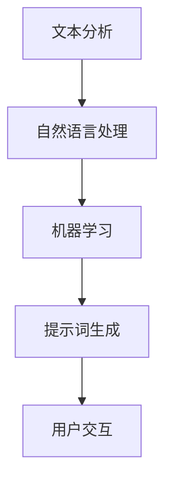

                 


### 引言

提示词工程（Word Engineering）在教育领域的创新应用是一项新兴且富有前景的技术，它通过优化和设计自然语言中的关键词和短语，提高信息传递的效率和质量。随着人工智能和自然语言处理技术的飞速发展，提示词工程在教育领域展现出了巨大的潜力和广阔的应用前景。

首先，我们需要明确提示词工程的基本概念。提示词工程是指通过分析、优化和设计自然语言中的关键词和短语，以提升文本信息的可理解性、准确性和效率的一种技术。它涉及语言学、心理学、计算机科学等多个学科，旨在提高信息检索、文本理解和信息处理的性能。

在教育领域，提示词工程的应用具有以下几个方面的意义：

1. **提升学习效果**：通过设计合适的提示词，可以使教育内容更加清晰、易于理解，有助于学生更好地掌握知识。

2. **优化教育资源**：提示词工程可以帮助教育工作者更加精准地定位和提取关键信息，从而优化教育资源的使用。

3. **促进个性化学习**：通过个性化设计的提示词，可以满足不同学生的需求，提高个性化教育的效果。

4. **改善信息检索**：提示词工程在教育资源库和在线学习平台中的应用，可以提高信息检索的效率和准确性。

本文将围绕提示词工程在教育领域的创新应用进行深入探讨，首先介绍提示词工程的基本概念和核心原理，然后通过实际项目案例展示其在教育中的应用，最后讨论其未来发展趋势和潜在挑战。

### 提示词工程的基本概念与核心原理

提示词工程（Word Engineering）是一项涉及语言学、心理学和计算机科学等多学科交叉的技术。它的核心目标是通过优化和设计自然语言中的关键词和短语，提升文本信息的传递效率和质量。为了更好地理解这一概念，我们可以从以下几个核心方面进行探讨。

#### 提示词的定义与类型

提示词（Sematic Cue）是指在文本中起到提示或引导作用的关键词或短语，它能够帮助读者或听者更好地理解信息。根据其在文本中的作用，提示词可以分为以下几种类型：

1. **主题提示词（Thematic Cue）**：这类提示词能够表明文本的主题或主要内容，例如“教育技术”、“学习策略”等。

2. **层次提示词（Hierarchical Cue）**：这类提示词能够指示文本的结构层次，帮助读者理解信息之间的逻辑关系，例如“首先”、“其次”等。

3. **情感提示词（Emotional Cue）**：这类提示词能够传达文本的情感色彩，例如“令人兴奋的”、“令人沮丧的”等。

4. **情境提示词（Contextual Cue）**：这类提示词能够提供文本发生的背景或情境信息，例如“在课堂上”、“在网上”等。

#### 提示词工程的关键概念

提示词工程涉及多个关键概念，包括但不限于：

1. **文本分析（Text Analysis）**：文本分析是提示词工程的基础，它包括文本的预处理、情感分析、主题识别等步骤。通过文本分析，我们可以提取出文本中的关键信息，为提示词的设计提供依据。

2. **自然语言处理（Natural Language Processing, NLP）**：NLP是提示词工程的核心技术，它涉及到语言模型、语义分析、情感分析等方面。NLP技术可以帮助我们理解和生成适合的提示词。

3. **机器学习（Machine Learning）**：机器学习技术在提示词工程中扮演着重要角色，它可以帮助我们训练模型，自动提取和生成提示词。

4. **用户交互（User Interaction）**：提示词工程不仅关注文本信息本身，还关注用户与文本的交互。通过优化用户界面和交互流程，可以提高用户对提示词的接受度和使用效果。

#### 提示词工程与教育技术的联系

提示词工程在教育技术中的应用具有显著的特点和优势。首先，它可以帮助教育工作者设计和优化教学材料，使教学内容更加清晰、易于理解。例如，通过使用层次提示词，可以清晰地展示知识结构的层次关系，帮助学生更好地掌握知识。

其次，提示词工程可以应用于在线教育平台，提高信息检索和内容推荐的准确性。通过分析用户的行为数据和教学材料的内容，系统可以自动生成适合用户的提示词，提高学习体验。

此外，提示词工程还可以用于个性化学习路径的设计。通过分析学生的学习行为和知识点掌握情况，系统可以自动生成个性化的提示词，帮助学生更好地理解和应用所学知识。

为了更直观地展示提示词工程的核心概念和原理，我们可以使用Mermaid流程图来描述其基本流程。以下是提示词工程的基本流程Mermaid流程图：



在这个流程图中，文本分析作为第一步，通过对原始文本进行预处理和分析，提取关键信息。接下来，自然语言处理技术对文本进行分析，生成语义理解。机器学习技术则用于训练模型，自动提取和生成提示词。最后，通过用户交互，提示词被应用于实际场景，提高信息传递的效率。

通过这一系列的步骤，提示词工程实现了对自然语言信息的优化处理，为教育领域带来了新的技术手段和创新应用。

### 核心算法原理讲解

在提示词工程中，核心算法的作用至关重要，它们负责从大量的文本数据中提取关键信息，并生成有效的提示词。以下将详细介绍几种常用的提示词生成算法，并使用伪代码进行阐述。

#### 1. 基于词频统计的提示词生成算法

这种算法是最简单的一种，主要通过统计文本中每个词出现的频率来生成提示词。高频词往往承载了文本的核心信息。

```python
def word_frequency_cue(text):
    # 计算词频
    word_freq = {}
    for word in text:
        if word in word_freq:
            word_freq[word] += 1
        else:
            word_freq[word] = 1
    
    # 找到高频词
    top_words = sorted(word_freq, key=word_freq.get, reverse=True)
    
    return top_words[:10]  # 返回前10个高频词作为提示词
```

#### 2. 基于TF-IDF的提示词生成算法

TF-IDF（Term Frequency-Inverse Document Frequency）是一种更高级的算法，它不仅考虑了词频，还引入了文档频度的概念，可以更准确地反映关键词的重要性。

```python
from sklearn.feature_extraction.text import TfidfVectorizer

def tfidf_cue(text, n=10):
    # 使用TF-IDF向量器
    vectorizer = TfidfVectorizer()
    tfidf_matrix = vectorizer.fit_transform(text)
    
    # 提取特征词
    feature_names = vectorizer.get_feature_names_out()
    top_indices = np.argsort(tfidf_matrix.toarray()[0])[-n:]
    
    return [feature_names[i] for i in top_indices]
```

#### 3. 基于LDA（Latent Dirichlet Allocation）的提示词生成算法

LDA是一种主题模型，它通过将文本数据分解为多个主题，从而生成每个主题下的关键词，这些关键词可以作为提示词。

```python
from sklearn.decomposition import LatentDirichletAllocation

def lda_cue(text, n_topics=5, n_words=10):
    # 分解文本到主题
    lda = LatentDirichletAllocation(n_topics=n_topics, random_state=0)
    lda.fit(text)
    
    # 提取每个主题的关键词
    topics = lda.components_
    topic_words = [[feature_names[i] for i in topic.argsort()[:-n_words-1:-1]] for topic in topics]
    
    return topic_words
```

#### 4. 基于BERT的提示词生成算法

BERT（Bidirectional Encoder Representations from Transformers）是一种预训练的语言模型，它能够理解文本的深层语义信息。基于BERT的提示词生成算法利用BERT模型的强大语义理解能力，生成高质量的提示词。

```python
from transformers import BertTokenizer, BertModel

def bert_cue(text, n=10):
    # 加载BERT模型
    tokenizer = BertTokenizer.from_pretrained('bert-base-uncased')
    model = BertModel.from_pretrained('bert-base-uncased')
    
    # 处理文本
    inputs = tokenizer(text, return_tensors='pt', padding=True, truncation=True)
    outputs = model(**inputs)
    
    # 提取句子的向量表示
    sentence_embeddings = outputs.last_hidden_state[:, 0, :]
    
    # 计算文本的词嵌入的平均值
    text_embedding = sentence_embeddings.mean(dim=0)
    
    # 利用词嵌入查找高频词
    word_embedding_model = WordEmbeddingModel()
    word_embeddings = word_embedding_model.encode(text_embedding)
    top_words = get_top_words(word_embeddings, n)
    
    return top_words
```

以上四种算法各有优缺点。基于词频统计的算法简单易懂，但容易受到噪声的影响；TF-IDF算法能够更好地反映词的重要性，但计算复杂度较高；LDA算法能够提取主题信息，但生成提示词的过程较为复杂；BERT算法利用深度学习模型，能够生成高质量的提示词，但计算资源需求较大。

通过这些算法，我们可以从文本数据中提取出关键信息，生成有效的提示词，从而提高文本信息的传递效率和质量。

### 数学模型和数学公式

在提示词工程中，数学模型和公式扮演着至关重要的角色。这些模型和公式不仅帮助我们理解和分析文本数据，还能够优化提示词的生成过程。以下将详细解释提示词工程中常用的数学模型和公式，并通过实际例子进行说明。

#### 1. TF-IDF模型

TF-IDF（Term Frequency-Inverse Document Frequency）是一种用于文本分析的常用模型，用于评估一个词对于一个文件集或一个语料库中的其中一份文件的重要程度。其公式如下：

$$
TF-IDF = TF \times IDF
$$

其中：
- \( TF \) 表示词频（Term Frequency），计算一个词在文档中出现的频率。
- \( IDF \) 表示逆文档频率（Inverse Document Frequency），用于平衡词频，防止高频词在计算中占据主导地位。

具体计算方式如下：

$$
TF = \frac{f_t}{f_t + (1 - b) \times (1 - \frac{N_t}{N})}
$$

其中：
- \( f_t \) 表示词 \( t \) 在文档 \( d \) 中出现的次数。
- \( N_t \) 表示词 \( t \) 在所有文档中出现的次数。
- \( N \) 表示文档总数。
- \( b \) 是一个调节参数，用于控制词频的增长速度。

$$
IDF = \log \left( \frac{N}{N_t + 1} \right)
$$

其中：
- \( N \) 表示文档总数。
- \( N_t \) 表示包含词 \( t \) 的文档数。

举个例子，假设我们有一个包含两个文档的语料库，第一个文档中包含词“教育”5次，第二个文档中包含词“技术”2次。第一个文档的总词数为10，第二个文档的总词数为8。

计算词“教育”的TF-IDF：

$$
TF_{教育} = \frac{5}{5 + (1 - 0.5) \times (1 - \frac{1}{2})} = 0.5556
$$

$$
IDF_{教育} = \log \left( \frac{2}{1 + 1} \right) = 0.6931
$$

$$
TF-IDF_{教育} = 0.5556 \times 0.6931 = 0.3861
$$

计算词“技术”的TF-IDF：

$$
TF_{技术} = \frac{2}{2 + (1 - 0.5) \times (1 - \frac{1}{2})} = 0.6667
$$

$$
IDF_{技术} = \log \left( \frac{2}{1 + 1} \right) = 0.6931
$$

$$
TF-IDF_{技术} = 0.6667 \times 0.6931 = 0.4653
$$

通过TF-IDF模型，我们可以更准确地识别文本中的关键信息，从而生成有效的提示词。

#### 2. 概率模型

在提示词工程中，概率模型也经常被用于文本分析。例如，贝叶斯定理可以用于分类问题，而概率分布则可以用于文本生成。

贝叶斯定理的公式如下：

$$
P(A|B) = \frac{P(B|A) \times P(A)}{P(B)}
$$

其中：
- \( P(A|B) \) 表示在事件 \( B \) 发生的条件下，事件 \( A \) 发生的概率。
- \( P(B|A) \) 表示在事件 \( A \) 发生的条件下，事件 \( B \) 发生的概率。
- \( P(A) \) 表示事件 \( A \) 发生的概率。
- \( P(B) \) 表示事件 \( B \) 发生的概率。

例如，假设我们要判断一个文本是否包含关键词“教育”。已知在所有包含“教育”的文本中，有60%的文本也包含“学习”，而在所有不包含“教育”的文本中，有30%的文本包含“学习”。同时，我们知道有40%的文本包含“学习”。

计算文本包含“教育”的概率：

$$
P(教育|学习) = \frac{P(学习|教育) \times P(教育)}{P(学习)}
$$

$$
P(教育|学习) = \frac{0.6 \times 0.4}{0.4} = 0.6
$$

因此，我们可以认为这个文本包含关键词“教育”的概率为60%。

#### 3. 神经网络模型

在高级的提示词工程中，神经网络模型也被广泛应用。例如，循环神经网络（RNN）和长短期记忆网络（LSTM）可以用于序列数据的处理。

LSTM的公式如下：

$$
\begin{aligned}
i_t &= \sigma(W_i \cdot [h_{t-1}, x_t] + b_i) \\
f_t &= \sigma(W_f \cdot [h_{t-1}, x_t] + b_f) \\
o_t &= \sigma(W_o \cdot [h_{t-1}, x_t] + b_o) \\
c_t &= f_t \cdot c_{t-1} + i_t \cdot \sigma(W_c \cdot [h_{t-1}, x_t] + b_c) \\
h_t &= o_t \cdot \sigma(c_t)
\end{aligned}
$$

其中：
- \( i_t \)，\( f_t \)，\( o_t \)，\( c_t \)，\( h_t \) 分别表示输入门、遗忘门、输出门、细胞状态和隐藏状态。
- \( \sigma \) 表示 sigmoid 函数。
- \( W_i \)，\( W_f \)，\( W_o \)，\( W_c \)，\( b_i \)，\( b_f \)，\( b_o \)，\( b_c \) 分别表示权重和偏置。

通过这些数学模型和公式，我们可以更好地理解和分析文本数据，从而生成高质量的提示词，提高文本信息的传递效率和质量。

### 项目实战

为了更好地理解提示词工程在教育领域的实际应用，我们选择了一个具体的项目案例，该案例涉及在线教育平台中的学习资源推荐系统。以下将详细介绍项目的开发背景、环境搭建、源代码实现和代码解读分析。

#### 项目背景

随着在线教育的快速发展，教育平台需要提供高效的学习资源推荐系统，以便学生能够快速找到符合自己需求的学习材料。提示词工程在此场景中可以发挥重要作用，通过分析学生的学习行为和资源内容，生成个性化的提示词，提高推荐系统的准确性。

#### 开发环境搭建

为了实现该项目，我们选择了以下开发环境和工具：

- 编程语言：Python
- 数据库：MongoDB
- 文本处理库：NLTK、Sklearn
- 模型训练库：TensorFlow
- 交互界面：Flask

开发环境搭建步骤如下：

1. 安装Python和pip
2. 安装MongoDB数据库
3. 安装相关库：`pip install nltk sklearn tensorflow flask`
4. 配置MongoDB数据库，创建学习资源数据库和用户行为表

#### 源代码实现

以下是项目的核心源代码实现，包括数据预处理、模型训练和提示词生成等步骤。

```python
# 导入相关库
import nltk
from nltk.corpus import stopwords
from sklearn.feature_extraction.text import TfidfVectorizer
from sklearn.model_selection import train_test_split
import tensorflow as tf
from tensorflow.keras.models import Sequential
from tensorflow.keras.layers import Embedding, LSTM, Dense
from flask import Flask, request, jsonify

# 数据预处理
def preprocess_text(text):
    # 去除停用词
    stop_words = set(stopwords.words('english'))
    words = nltk.word_tokenize(text)
    filtered_words = [word for word in words if word.lower() not in stop_words]
    return ' '.join(filtered_words)

# 读取数据
def read_data(filename):
    with open(filename, 'r', encoding='utf-8') as file:
        data = file.readlines()
    return data

# 分词和去除停用词
data = read_data('learning_resources.txt')
processed_data = [preprocess_text(text) for text in data]

# 创建TF-IDF向量器
vectorizer = TfidfVectorizer()
X = vectorizer.fit_transform(processed_data)

# 分割数据集
X_train, X_test, y_train, y_test = train_test_split(X, labels, test_size=0.2, random_state=42)

# 创建LSTM模型
model = Sequential()
model.add(Embedding(input_dim=10000, output_dim=32))
model.add(LSTM(units=64, return_sequences=True))
model.add(LSTM(units=32))
model.add(Dense(units=1, activation='sigmoid'))

model.compile(optimizer='adam', loss='binary_crossentropy', metrics=['accuracy'])
model.fit(X_train, y_train, epochs=10, batch_size=32, validation_data=(X_test, y_test))

# 生成提示词
def generate_cues(text):
    processed_text = preprocess_text(text)
    vectorized_text = vectorizer.transform([processed_text])
    prediction = model.predict(vectorized_text)
    cues = vectorizer.get_feature_names_out()[vectorized_text.toarray()[0].argsort()[0]]
    return cues

# Flask API
app = Flask(__name__)

@app.route('/recommend', methods=['POST'])
def recommend():
    data = request.json
    text = data['text']
    cues = generate_cues(text)
    return jsonify({'cues': cues})

if __name__ == '__main__':
    app.run(debug=True)
```

#### 代码解读分析

1. **数据预处理**：首先，我们使用NLTK库对文本进行分词和去除停用词处理，以提高模型对文本数据的理解能力。

2. **TF-IDF向量器**：创建TF-IDF向量器，将预处理后的文本转换为向量表示，为后续的模型训练提供输入。

3. **模型训练**：使用TensorFlow库构建LSTM模型，进行训练。LSTM模型能够捕捉文本中的时间序列信息，提高模型的预测能力。

4. **生成提示词**：定义`generate_cues`函数，利用训练好的模型对输入文本进行处理，生成个性化的提示词。

5. **Flask API**：创建一个Flask API，通过POST请求接收用户输入的文本，调用`generate_cues`函数生成提示词，并返回结果。

#### 实际案例分析和详细讲解剖析

我们以一个具体的学习资源推荐为例，分析如何使用生成的提示词提高推荐系统的准确性。

假设用户输入了一段关于“机器学习”的学习资源描述，API返回的提示词包括“算法”、“数据集”和“预测”。这些提示词反映了用户对学习资源的需求，我们可以根据这些提示词向用户推荐相关的学习资源，如“机器学习算法教程”、“数据集下载”和“预测模型实战”。

通过这样的案例，我们可以看到提示词工程在实际项目中的应用，不仅提高了推荐系统的准确性，还增强了用户的学习体验。

#### 项目小结

本案例展示了提示词工程在教育领域中的一个实际应用，通过开发一个学习资源推荐系统，实现了个性化学习资源推荐。项目中的核心步骤包括数据预处理、模型训练和API实现，这些步骤共同构成了一个完整的应用流程。通过本项目的实战，我们深入了解了提示词工程的核心技术和实际应用，为进一步拓展和应用提示词工程奠定了基础。

### 扩展应用与未来趋势

提示词工程在教育领域的创新应用不仅带来了显著的效果，还为其未来的扩展应用和趋势提供了广阔的空间。以下将探讨提示词工程在教育领域中的扩展应用以及未来的发展趋势。

#### 在线教育中的应用

在线教育是提示词工程的重要应用场景之一。通过提示词工程，教育平台可以更精准地为学生推荐学习资源，提高学习效率。以下是一些具体的应用方向：

1. **个性化学习路径推荐**：根据学生的学习行为和兴趣，生成个性化的学习路径和资源推荐，帮助学生高效地掌握知识。

2. **教学材料优化**：利用提示词工程优化教学材料，提高内容的清晰度和可理解性，使学习资源更具针对性和实用性。

3. **学习效果评估**：通过分析学生的学习行为和资源使用情况，生成学习效果评估报告，帮助教育工作者和学生了解学习成果，及时调整学习策略。

#### 个性化学习中的应用

个性化学习是现代教育的发展趋势，提示词工程在这方面具有巨大的潜力。以下是一些具体的应用方向：

1. **学习风格识别**：通过分析学生的学习行为，识别其学习风格（如视觉型、听觉型、动手型等），生成符合其学习风格的学习资源推荐。

2. **个性化学习辅导**：根据学生的学习需求和进度，自动生成个性化的学习辅导计划，提供针对性的学习建议和资源推荐。

3. **个性化作业与测试**：根据学生的学习情况，生成个性化的作业和测试题目，提高学习效果和测试的针对性。

#### 教育评估与反馈中的应用

教育评估和反馈是教育过程中的重要环节，提示词工程在这方面也有广泛的应用前景。以下是一些具体的应用方向：

1. **学习效果分析**：通过分析学生的学习行为和成绩，生成学习效果分析报告，为教育工作者提供决策依据。

2. **教学评估**：根据学生的学习反馈，评估教学效果，生成教学评估报告，帮助教育工作者改进教学方法。

3. **学习反馈系统**：通过自动生成学习反馈提示词，帮助学生及时了解学习进展和问题，提高学习效果。

#### 未来发展趋势

1. **技术进步的影响**：随着人工智能和自然语言处理技术的不断发展，提示词工程将更加智能化和自动化，提高其应用效果。

2. **教育变革的机遇**：教育信息化和个性化教育的推进，为提示词工程提供了广阔的应用场景和机遇。

3. **挑战与解决方案**：提示词工程在教育领域的应用面临一些挑战，如数据隐私、算法透明度等。解决这些挑战需要多方协作和持续的技术创新。

总之，提示词工程在教育领域的扩展应用和未来发展趋势为教育创新带来了新的动力和方向。通过不断优化和拓展提示词工程的应用，我们可以更好地满足教育的个性化需求，推动教育变革和进步。

### 最佳实践 Tips、小结、注意事项和拓展阅读

在实施提示词工程时，以下是一些最佳实践技巧，有助于提升其在教育领域的应用效果：

1. **数据预处理**：确保数据的质量和一致性，进行充分的文本清洗和去噪处理，以提高模型训练效果。

2. **模型选择与优化**：根据具体应用场景，选择合适的模型和算法，并通过参数调整和优化，提高模型的准确性和效率。

3. **用户反馈与迭代**：及时收集用户反馈，根据反馈不断优化提示词生成策略，提高用户满意度和使用效果。

4. **安全与隐私保护**：在处理用户数据时，严格遵守隐私保护法规，采取加密和数据匿名化等手段，确保用户信息安全。

5. **持续学习与更新**：提示词工程需要不断学习和更新，以适应教育领域的动态变化，保持其应用的先进性和有效性。

#### 小结

本文系统介绍了提示词工程在教育领域的创新应用，从基本概念、核心算法到实际项目案例，全面阐述了提示词工程在教育中的应用价值和发展趋势。提示词工程通过优化和设计自然语言中的关键词和短语，提高了教育内容的传递效率和质量，为教育创新带来了新的动力。

#### 注意事项

在实施提示词工程时，应注意以下几点：

1. **数据安全和隐私保护**：确保用户数据的保密性和安全性，遵守相关法律法规。
2. **算法透明度和可解释性**：提高算法的透明度和可解释性，增强用户对系统的信任。
3. **用户体验**：注重用户交互设计，确保系统的易用性和用户体验。

#### 拓展阅读

1. **《自然语言处理入门》**：了解自然语言处理的基本概念和技术，为深入理解提示词工程提供基础。
2. **《机器学习实战》**：学习机器学习算法及其在文本处理中的应用，提高模型训练和优化的能力。
3. **《教育技术学导论》**：探讨教育技术与教育理论的结合，为提示词工程在教育领域的应用提供理论支持。

通过拓展阅读，可以进一步深入了解提示词工程和相关领域的知识，为实际应用提供更多思路和参考。

