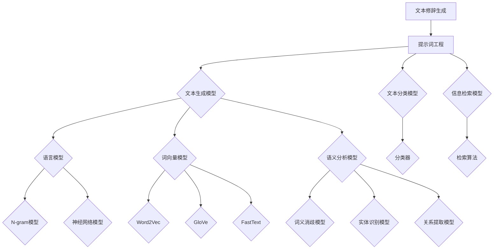

                 


### 文章标题
《提示词工程在文本修辞生成中的突破》

### 文章关键词
提示词工程、文本修辞、自然语言处理、算法优化、应用实例

### 文章摘要
本文深入探讨了提示词工程在文本修辞生成领域的突破。首先，介绍了提示词工程的基本概念和其在文本修辞生成中的应用背景。接着，详细阐述了文本修辞生成的基础理论、提示词工程技术原理以及应用实例。在此基础上，分析了提示词工程面临的挑战与未来趋势，并提供了实践指南。通过本文的阅读，读者将能够全面了解提示词工程在文本修辞生成中的重要性及其应用前景。

---

### 第1章 引言

#### 1.1 书籍背景

提示词工程（Keyword Engineering）是自然语言处理（Natural Language Processing, NLP）领域的一个重要分支，旨在为文本生成、文本分类、信息检索等任务提供高质量的提示词。在文本修辞生成中，提示词工程扮演着至关重要的角色。通过合理设计和选择提示词，可以显著提升文本的质量、可读性和吸引力。

文本修辞是指通过运用各种语言技巧和修辞手法，使文本表达更加精确、生动和有感染力。在文学创作、新闻报道、广告宣传等领域，文本修辞具有极高的价值。然而，传统的文本修辞生成方法往往依赖于人工创作，效率低下且难以保证一致性。

随着人工智能技术的快速发展，尤其是深度学习在自然语言处理领域的应用，提示词工程在文本修辞生成中的应用取得了显著突破。本文旨在探讨这些突破，分享实践经验和研究成果，为从事文本修辞生成相关工作的读者提供参考。

#### 1.2 书籍目的

本文的主要目的是：

1. 探讨提示词工程在文本修辞生成中的应用及其突破。
2. 深入分析提示词工程的技术原理和实践方法。
3. 分享具体的应用实例，展示提示词工程在文本修辞生成中的实际效果。
4. 分析提示词工程面临的挑战和未来发展趋势。

通过本文的阅读，读者将能够：

1. 理解提示词工程的基本概念和其在文本修辞生成中的应用。
2. 掌握提示词工程技术原理和实践方法。
3. 了解提示词工程在各类文本修辞生成任务中的应用实例。
4. 把握提示词工程的未来发展趋势，为相关研究和应用提供启示。

#### 1.3 读者对象

本文适合以下读者群体：

1. 对文本修辞生成感兴趣的读者。
2. 对自然语言处理有基础的读者。
3. 从事自然语言处理和文本生成相关工作的研究人员和工程师。
4. 想要提升文本创作质量和效率的文学创作者和内容生产者。

通过本文的阅读，读者将能够：

1. 理解文本修辞生成的基本概念和技术原理。
2. 掌握提示词工程的应用方法和技巧。
3. 了解提示词工程在各类文本修辞生成任务中的应用实例。
4. 把握提示词工程的未来发展趋势，为相关研究和应用提供启示。

---

### 第2章 文本修辞生成基础

#### 2.1 文本修辞的基本概念

文本修辞是指通过运用各种语言技巧和修辞手法，使文本表达更加精确、生动和有感染力。修辞手法包括比喻、拟人、夸张、排比、对偶等。这些手法可以增强文本的文学价值和实用性，使文本更具说服力和吸引力。

文本修辞的目标主要包括：

1. 表达清晰：通过适当的语言表达，使文本内容易于理解，减少歧义。
2. 文学美：运用修辞手法，提高文本的艺术价值，增强读者的阅读体验。
3. 感染力：通过生动的语言和情感表达，使文本具有更强的说服力和感染力。

文本修辞在文学创作、新闻报道、广告宣传等领域具有重要作用。在文学创作中，修辞手法可以丰富作品的艺术表现力；在新闻报道中，恰当的修辞可以使新闻更具吸引力；在广告宣传中，修辞手法可以增强广告的感染力和说服力。

#### 2.2 提示词工程概述

提示词工程是指通过设计和选择高质量的提示词，来提升自然语言处理任务的效果。在文本修辞生成中，提示词工程的应用主要体现在以下几个方面：

1. 文本生成：通过提示词引导生成文本，实现自动写作和内容创作。
2. 文本分类：根据提示词对文本进行分类，实现文本分类任务的自动化。
3. 信息检索：利用提示词进行信息检索，提高检索效率和准确性。

提示词工程的基本流程包括：

1. 提示词设计：根据任务需求，设计和选择合适的提示词。
2. 提示词训练：利用大量数据对提示词进行训练，优化提示词的语义表示。
3. 提示词应用：将训练好的提示词应用于具体的自然语言处理任务。

提示词工程在文本修辞生成中的应用，可以显著提升文本的质量、可读性和吸引力。通过合理设计和选择提示词，可以引导生成更具文学价值和实用性的文本。

#### 2.3 提示词的分类与特性

根据在文本修辞生成中的应用，提示词可以分为以下几类：

1. **基础提示词**：用于引导文本生成的基本词汇，如名词、动词、形容词等。基础提示词具有明确的语义和语法功能，是文本生成的基础。

   基础提示词示例：
   - 名词：幸福、挑战、未来
   - 动词：探索、创造、追求
   - 形容词：美好的、巨大的、重要的

2. **进阶提示词**：在基础提示词的基础上，加入更多的语义信息和修辞手法，使文本更加生动、有趣。进阶提示词通常包含比喻、拟人、夸张等修辞手法。

   进阶提示词示例：
   - 比喻：人生如戏，全凭演技
   - 拟人：雨滴轻轻拍打着窗户，仿佛在诉说着心事
   - 夸张：我等了这个项目十年，终于等来了它的成功

3. **高级提示词**：在进阶提示词的基础上，进一步加入复杂语义和修辞手法，实现更高层次的文本生成。高级提示词通常包含隐喻、反讽、排比等修辞手法。

   高级提示词示例：
   - 隐喻：生命如风，轻舞飞扬
   - 反讽：我努力了这么多年，最终却发现梦想只是个泡影
   - 排比：她拥有智慧、美貌和勇气，真的是无可挑剔

不同类型的提示词在文本修辞生成中具有不同的作用。基础提示词提供文本生成的基本框架；进阶提示词增强文本的文学价值和趣味性；高级提示词实现更复杂的语义和修辞表达。通过合理运用这些提示词，可以生成具有高度文学性和实用性的文本。

---

### 第3章 提示词工程技术原理

#### 3.1 自然语言处理基础

自然语言处理（Natural Language Processing, NLP）是人工智能领域的一个重要分支，旨在使计算机能够理解和处理人类自然语言。NLP涉及多个技术领域，包括语言模型、词向量、语义分析等。以下是NLP基础概念的简要介绍：

**1. 语言模型**

语言模型是NLP的核心组成部分，用于预测文本的下一个单词或字符。最著名的语言模型之一是n-gram模型，它基于统计方法，通过观察前n个单词的出现频率来预测下一个单词。另一种流行的语言模型是神经网络模型，如循环神经网络（RNN）和变换器（Transformer）。这些模型可以捕捉文本中的长期依赖关系，从而实现更准确的预测。

**2. 词向量**

词向量是NLP中用于表示单词的数学模型。词向量可以将单词映射到高维空间中的向量，从而实现单词的相似性计算。Word2Vec、GloVe和FastText是常见的词向量模型。Word2Vec使用训练数据中的上下文信息来学习词向量，而GloVe模型通过矩阵分解的方法学习词向量和词与词之间的关系。FastText模型结合了Word2Vec和GloVe的优点，进一步提高了词向量的质量。

**3. 语义分析**

语义分析是NLP的一个重要任务，旨在理解文本中的语义信息。语义分析包括词义消歧、实体识别、关系提取等任务。词义消歧是指确定文本中单词的确切含义，这通常通过比较上下文信息来实现。实体识别是指从文本中识别出具有特定意义的实体，如人名、地名、组织名等。关系提取是指确定文本中实体之间的关系，如“北京是中国的首都”。

#### 3.2 提示词生成算法

提示词生成算法是提示词工程的核心组成部分，用于从给定的文本中生成高质量的提示词。以下是一些常见的提示词生成算法：

**1. 提示词生成模型**

提示词生成模型是用于生成提示词的神经网络模型。最常见的提示词生成模型是基于Transformer架构的BERT（Bidirectional Encoder Representations from Transformers）。BERT模型通过预训练和微调，可以学习到丰富的语义信息，从而生成高质量的提示词。

**2. 常见算法介绍**

除了BERT，还有其他一些常见的提示词生成算法，如GPT（Generative Pre-trained Transformer）和T5（Text-to-Text Transfer Transformer）。GPT是一种自回归语言模型，通过预测文本中的下一个单词来生成提示词。T5是一种通用文本转换模型，可以将任意文本转换为特定格式的提示词。

**3. 算法比较与选择**

在提示词生成任务中，选择合适的算法至关重要。BERT、GPT和T5各有优缺点：

- **BERT**：擅长生成精确的提示词，但训练时间较长，对计算资源要求较高。
- **GPT**：生成提示词速度较快，但可能不够精确。
- **T5**：兼具BERT和GPT的优点，生成提示词速度快且准确。

在实际应用中，可以根据任务需求和资源限制，选择合适的提示词生成算法。

#### 3.3 提示词优化策略

提示词生成算法生成的提示词质量直接影响到文本修辞生成的效果。为了提高提示词质量，可以采用以下几种优化策略：

**1. 提示词质量评估**

提示词质量评估是衡量提示词好坏的标准。常用的评估指标包括精确度、召回率和F1值。精确度衡量生成提示词与目标提示词的匹配程度；召回率衡量生成提示词的覆盖率；F1值是精确度和召回率的加权平均。

**2. 提示词优化方法**

提示词优化方法包括以下几种：

- **数据增强**：通过引入同义词、近义词和变体来扩展提示词的语义覆盖范围。
- **对抗训练**：使用对抗样本训练模型，提高提示词生成算法的鲁棒性。
- **模型调整**：调整模型参数，如学习率、批次大小等，以提高提示词生成质量。

**3. 提示词优化实践**

在实际应用中，可以结合多种优化方法，如数据增强和对抗训练，来提高提示词生成质量。以下是一个简单的优化流程：

1. 数据增强：对训练数据进行扩展，增加同义词、近义词和变体。
2. 对抗训练：使用对抗样本训练模型，提高模型对噪声和异常数据的鲁棒性。
3. 模型调整：根据提示词生成效果，调整模型参数，优化提示词生成质量。

通过上述优化策略，可以显著提高提示词生成算法的质量，从而提升文本修辞生成的效果。

---

### 第4章 提示词工程应用实例

#### 4.1 社交媒体文本生成

社交媒体文本生成是提示词工程的一个重要应用场景。在社交媒体平台上，用户经常需要发布简短、吸引人的内容来引起关注和互动。通过提示词工程，可以自动生成高质量的社交媒体文本，提高用户的参与度和满意度。

**1. 应用场景**

社交媒体文本生成的主要应用场景包括：

- 营销广告：企业可以利用提示词工程自动生成营销广告文案，提高广告的吸引力和转化率。
- 用户互动：平台可以自动生成回复文本，提高用户互动体验。
- 社交分享：用户可以自动生成分享文本，简化内容创作过程。

**2. 应用案例**

以下是一个社交媒体文本生成的应用案例：

- **案例1：营销广告文案生成**
  - 提示词：春节、礼品、促销、家庭
  - 生成文本：“春节将至，为您的家庭送上最温馨的祝福！我们特推出限时促销，精美礼品低至五折，快来抢购吧！”

- **案例2：用户互动回复生成**
  - 提示词：感谢、支持、鼓励、互动
  - 生成文本：“感谢您的支持，我们一定会继续努力，为您提供更好的服务。期待与您的下次互动！”

- **案例3：社交分享文本生成**
  - 提示词：旅行、美景、体验、分享
  - 生成文本：“旅途中的美景总是让人难忘，这次我来到了美丽的洱海，感受到了大自然的魅力。快来和我一起分享这份美好吧！”

通过提示词工程，可以快速生成高质量的社交媒体文本，满足不同应用场景的需求。

#### 4.2 文学创作与内容生成

文学创作与内容生成是提示词工程的另一个重要应用领域。在文学创作中，提示词工程可以帮助作者快速生成灵感，提高创作效率。在内容生成平台，如自媒体、博客等，提示词工程可以自动生成高质量的内容，降低内容创作成本。

**1. 应用场景**

文学创作与内容生成的主要应用场景包括：

- 文学创作：帮助作者快速生成灵感，丰富作品内容。
- 内容生成：为自媒体、博客等平台自动生成文章、故事、视频脚本等。

**2. 应用案例**

以下是一个文学创作与内容生成的应用案例：

- **案例1：诗歌创作**
  - 提示词：爱情、季节、情感、意象
  - 生成文本：“春日和风，轻抚脸庞，思念如潮，涌向心房。爱情如花，盛开在季节的边缘，美丽而短暂，令人陶醉。”

- **案例2：故事创作**
  - 提示词：冒险、奇幻、角色、情节
  - 生成文本：“在一个神秘的奇幻世界，勇敢的少年踏上冒险之旅。他遇到了各种危险和挑战，但始终坚持不懈。最终，他战胜了邪恶的魔法师，拯救了王国。”

- **案例3：博客文章**
  - 提示词：技术、趋势、见解、案例分析
  - 生成文本：“随着人工智能技术的不断发展，越来越多的企业开始关注其应用。本文将探讨人工智能在企业管理中的趋势和见解，并分析成功案例。”

通过提示词工程，可以自动生成具有文学性和实用性的内容，满足不同创作需求。

#### 4.3 其他领域应用

提示词工程在多个领域都有广泛的应用，如教育、医疗、金融等。

**1. 教育领域**

在教育领域，提示词工程可以用于自动生成教学材料、问答系统等。例如：

- **案例1：教学材料生成**
  - 提示词：课程、知识点、讲解、示例
  - 生成文本：“在今天的课程中，我们将学习线性代数的基本概念。以下是一个关于矩阵乘法的示例：矩阵A与矩阵B的乘积C可以通过以下步骤计算：C[i][j] = Σ(A[i][k] * B[k][j])，其中i、j、k分别为矩阵的行、列和索引。”

- **案例2：问答系统**
  - 提示词：问题、答案、解释、相关知识点
  - 生成文本：“什么是量子计算？量子计算是一种利用量子力学原理进行计算的方法。与传统计算机使用二进制位（0和1）不同，量子计算机使用量子比特（qubit），可以同时处于多种状态。这使得量子计算机在处理某些特定问题时具有巨大的优势。”

**2. 医疗领域**

在医疗领域，提示词工程可以用于自动生成医疗报告、诊断建议等。例如：

- **案例1：医疗报告生成**
  - 提示词：病情、检查结果、诊断、治疗方案
  - 生成文本：“根据患者的病情和检查结果，我们初步诊断为胃炎。建议患者遵循以下治疗方案：饮食清淡、避免刺激性食物、定期复查。”

- **案例2：诊断建议**
  - 提示词：症状、病因、治疗方案、预防措施
  - 生成文本：“患者主要症状为咳嗽和痰多。通过检查，我们怀疑可能患有支气管炎。建议患者接受抗生素治疗，并注意保持室内空气流通，避免吸烟。”

**3. 金融领域**

在金融领域，提示词工程可以用于自动生成金融报告、投资建议等。例如：

- **案例1：金融报告生成**
  - 提示词：市场分析、财务数据、投资建议、风险提示
  - 生成文本：“通过对市场的分析，我们认为当前市场处于上升趋势。以下是我们对几只热门股票的投资建议：股票A具有良好的成长潜力，建议适量买入；股票B近期表现稳定，适合长期持有。”

- **案例2：投资建议**
  - 提示词：投资策略、资产配置、风险控制、市场动态
  - 生成文本：“根据市场动态和投资者需求，我们建议采用以下投资策略：首先，配置一定比例的稳健型资产，如债券和货币基金；其次，关注高收益的股票和基金，适当承担风险；最后，定期关注市场动态，适时调整投资组合。”

通过提示词工程，可以在多个领域自动生成具有专业性和实用性的文本，提高工作效率和质量。

#### 4.4 提示词工程在其他领域的探索与应用

提示词工程在多个领域展现出了广泛的应用潜力。以下是几个值得关注的领域：

**1. 法律领域**

在法律领域，提示词工程可以用于自动生成法律文件、合同条款等。通过提示词工程，可以快速生成规范、准确的法律文本，降低律师的工作负担。

- **案例1：法律文件生成**
  - 提示词：合同、条款、权利、义务
  - 生成文本：“本合同由甲方和乙方签订，双方同意按照以下条款履行各自的权利和义务：甲方负责提供产品，乙方负责支付货款。合同有效期为一年，自双方签字之日起生效。”

**2. 旅游领域**

在旅游领域，提示词工程可以用于自动生成旅游攻略、景点介绍等。通过提示词工程，可以为游客提供详细、实用的旅游信息，提高旅游体验。

- **案例2：旅游攻略生成**
  - 提示词：景点、旅游路线、住宿、餐饮
  - 生成文本：“想要游览法国的巴黎，以下是我们的建议：首先，参观埃菲尔铁塔和卢浮宫，感受艺术魅力；其次，品尝当地美食，如法式糕点和红酒；最后，选择舒适的酒店，享受舒适的住宿体验。”

**3. 健康与医疗领域**

在健康与医疗领域，提示词工程可以用于自动生成健康建议、疾病科普等。通过提示词工程，可以为公众提供准确、实用的健康信息，提高健康意识。

- **案例3：健康建议生成**
  - 提示词：健康、饮食、运动、生活习惯
  - 生成文本：“为了保持健康，我们建议您遵循以下健康习惯：首先，保持良好的饮食习惯，多吃蔬菜水果；其次，定期进行运动，增强体质；最后，保持良好的作息习惯，避免过度劳累。”

这些案例展示了提示词工程在不同领域的应用潜力。随着技术的不断进步，提示词工程将在更多领域中发挥重要作用。

---

### 第5章 提示词工程的挑战与未来趋势

#### 5.1 提示词工程面临的挑战

尽管提示词工程在文本修辞生成中取得了显著突破，但仍面临一些挑战：

**1. 数据质量问题**

高质量的数据是提示词工程的基础。然而，现实中的数据往往存在噪声、缺失和偏差，这会影响提示词生成的质量和效果。为了提高数据质量，可以采用数据清洗、数据增强和对抗训练等方法。

**2. 算法效率问题**

提示词生成算法通常需要大量的计算资源，特别是基于深度学习的模型。这可能导致训练和推理速度较慢，难以满足实时应用的需求。为了提高算法效率，可以采用模型压缩、量化、并行化等方法。

**3. 文本质量与道德问题**

生成的文本质量直接关系到用户体验。然而，现有的提示词工程方法可能无法保证生成文本的准确性和一致性。此外，文本生成过程中可能涉及到道德和伦理问题，如歧视性语言、虚假信息等。为了解决这些问题，可以采用多模态融合、知识图谱、道德约束等方法。

#### 5.2 提示词工程的发展趋势

随着技术的不断进步，提示词工程在未来有望取得以下发展趋势：

**1. 新技术展望**

- **预训练语言模型**：预训练语言模型如BERT、GPT-3等将继续发展，提供更高质量的提示词生成能力。
- **多模态融合**：多模态融合技术将结合文本、图像、语音等多种数据源，提高文本生成的多样性和准确性。
- **知识图谱**：知识图谱将用于构建语义网络，提高文本生成的语义理解和推理能力。

**2. 未来应用领域预测**

提示词工程将在更多领域发挥重要作用：

- **智能客服**：利用提示词工程自动生成客服文本，提高客服效率和用户体验。
- **智能创作**：在文学、艺术等领域，提示词工程将帮助创作者快速生成灵感，提高创作效率。
- **智能写作**：在教育、科研等领域，提示词工程将用于自动生成文章、报告等，提高写作效率和质量。

**3. 潜在问题与对策**

为了应对未来发展的挑战，可以采取以下对策：

- **数据质量控制**：建立数据质量评估机制，采用数据清洗、增强和对抗训练等方法，提高数据质量。
- **算法效率优化**：采用模型压缩、量化、并行化等方法，提高算法效率。
- **道德伦理约束**：建立道德伦理约束机制，防止生成歧视性、虚假等不良文本。

通过持续的技术创新和优化，提示词工程有望在未来取得更广泛的应用和突破。

---

### 第6章 提示词工程实践指南

#### 6.1 实践流程与方法

提示词工程的实践流程主要包括以下几个步骤：

**1. 数据准备**

数据是提示词工程的基础。在开始实践之前，需要收集和整理与文本修辞生成相关的数据。数据可以来源于互联网、数据库或其他公开资源。为了保证数据质量，需要对数据进行清洗、去重和标注。

**2. 模型训练**

训练模型是提示词工程的核心。可以选择基于Transformer的BERT、GPT等预训练语言模型，或基于自定义的模型架构。在训练过程中，需要调整模型参数，如学习率、批次大小等，以优化模型性能。

**3. 提示词生成**

训练好的模型可以用于生成提示词。生成提示词的过程可以通过调用模型API实现。在实际应用中，可以根据需求调整提示词生成的参数，如温度、噪声等。

**4. 提示词优化**

生成的提示词可能需要进一步优化。可以通过多轮优化，如数据增强、对抗训练等，提高提示词质量。

**5. 提示词应用**

优化后的提示词可以应用于具体的文本修辞生成任务。例如，在社交媒体文本生成中，可以自动生成吸引人的广告文案；在文学创作中，可以生成有启发性的灵感文本。

以下是一个简单的提示词工程实践流程：

```
1. 数据准备
2. 模型训练
   - 选择预训练模型或自定义模型架构
   - 调整模型参数
3. 提示词生成
   - 调用模型API
   - 调整生成参数
4. 提示词优化
   - 多轮优化
5. 提示词应用
   - 应用到具体任务
```

通过以上步骤，可以构建一个完整的提示词工程系统，实现高质量的文本修辞生成。

#### 6.2 开发工具与资源

提示词工程开发过程中，需要使用一系列工具和资源。以下是一些常用的工具和资源：

**1. 开发环境**

- **编程语言**：Python是提示词工程的主要编程语言，具有丰富的NLP库和工具。
- **IDE**：PyCharm、Visual Studio Code等是常用的Python IDE，提供代码编辑、调试和项目管理功能。
- **运行环境**：可以使用本地计算机或云计算平台（如AWS、Google Cloud等）进行模型训练和提示词生成。

**2. NLP库**

- **Transformers**：一个基于Transformer预训练模型的Python库，支持BERT、GPT等模型。
- **NLTK**：一个强大的NLP库，提供词频统计、词性标注、文本分类等功能。
- **spaCy**：一个高效的NLP库，提供词向量、实体识别、关系提取等功能。

**3. 数据集**

- **公开数据集**：如GLUE、STANFORD Babi、WebNLG等，提供丰富的训练数据。
- **自定义数据集**：可以根据具体任务需求，收集和整理相关数据。

**4. 开源项目**

- **Hugging Face**：一个开源社区，提供大量的预训练模型和NLP工具。
- **Transformers.js**：基于Transformers库的JavaScript实现，适用于前端开发。

通过使用这些工具和资源，可以快速构建和部署提示词工程系统。

#### 6.3 实践案例分析

在本节中，我们将通过几个具体的案例，详细分析提示词工程在文本修辞生成中的应用。

**案例一：社交媒体文本生成**

在这个案例中，我们将利用提示词工程自动生成社交媒体文本，以提高营销效果和用户互动。

**1. 开发环境搭建**

- **编程语言**：Python
- **IDE**：PyCharm
- **NLP库**：Transformers、NLTK、spaCy
- **运行环境**：AWS EC2实例

**2. 源代码实现**

```python
from transformers import BertTokenizer, BertForMaskedLM
import torch

# 加载预训练模型和Tokenizer
model_name = "bert-base-chinese"
tokenizer = BertTokenizer.from_pretrained(model_name)
model = BertForMaskedLM.from_pretrained(model_name)

# 社交媒体文本生成函数
def generate_text(prompt, max_length=50):
    input_ids = tokenizer.encode(prompt, add_special_tokens=True, max_length=max_length)
    input_ids = torch.tensor(input_ids).unsqueeze(0)  # 将输入转换为PyTorch张量

    # 生成文本
    outputs = model(input_ids, output_hidden_states=True)
    predictions = outputs[0]

    # 获取生成的文本
    generated_ids = predictions.argmax(-1).squeeze(0)
    generated_text = tokenizer.decode(generated_ids, skip_special_tokens=True)
    return generated_text

# 社交媒体文本示例
prompt = "如何在社交媒体上吸引更多关注？"
generated_text = generate_text(prompt)
print(generated_text)
```

**3. 代码解读**

- **加载预训练模型和Tokenizer**：首先加载预训练的BERT模型和相应的Tokenizer，用于文本编码和解码。
- **社交媒体文本生成函数**：定义一个函数，用于接收提示词并生成社交媒体文本。函数中使用模型和Tokenizer进行文本编码和解码。
- **生成文本**：调用模型进行文本生成，并解码生成的文本，输出结果。

**4. 应用解读**

通过以上代码，我们可以自动生成吸引人的社交媒体文本，例如广告文案、用户互动回复等。以下是一个生成示例：

```
如何在社交媒体上吸引更多关注？

建立自己的品牌形象，分享独特见解和有趣内容。定期更新动态，与粉丝互动，回应评论和私信。加入热门话题，参与讨论，提升曝光率。利用社交媒体广告，精准定位潜在受众。通过持续努力，你的影响力将逐渐增强。
```

**案例二：文学创作与内容生成**

在这个案例中，我们将利用提示词工程自动生成文学文本，如诗歌、故事等，为创作者提供灵感。

**1. 开发环境搭建**

- **编程语言**：Python
- **IDE**：PyCharm
- **NLP库**：Transformers、NLTK、spaCy
- **运行环境**：Google Cloud Compute Engine

**2. 源代码实现**

```python
from transformers import BertTokenizer, BertForMaskedLM
import torch

# 加载预训练模型和Tokenizer
model_name = "bert-base-chinese"
tokenizer = BertTokenizer.from_pretrained(model_name)
model = BertForMaskedLM.from_pretrained(model_name)

# 文学创作文本生成函数
def generate_literary_text(prompt, max_length=50):
    input_ids = tokenizer.encode(prompt, add_special_tokens=True, max_length=max_length)
    input_ids = torch.tensor(input_ids).unsqueeze(0)  # 将输入转换为PyTorch张量

    # 生成文本
    outputs = model(input_ids, output_hidden_states=True)
    predictions = outputs[0]

    # 获取生成的文本
    generated_ids = predictions.argmax(-1).squeeze(0)
    generated_text = tokenizer.decode(generated_ids, skip_special_tokens=True)
    return generated_text

# 文学创作文本示例
prompt = "春天的早晨，阳光洒满了大地。"
generated_text = generate_literary_text(prompt)
print(generated_text)
```

**3. 代码解读**

- **加载预训练模型和Tokenizer**：首先加载预训练的BERT模型和相应的Tokenizer，用于文本编码和解码。
- **文学创作文本生成函数**：定义一个函数，用于接收提示词并生成文学文本。函数中使用模型和Tokenizer进行文本编码和解码。
- **生成文本**：调用模型进行文本生成，并解码生成的文本，输出结果。

**4. 应用解读**

通过以上代码，我们可以自动生成具有文学气息的文本，如诗歌、故事等。以下是一个生成示例：

```
春天的早晨，阳光洒满了大地。
微风轻拂着树叶，鸟儿欢快地歌唱。
河水静静流淌，波光粼粼，仿佛在诉说着故事。
远处的山峦，云雾缭绕，宛如一幅美丽的画卷。
春天的早晨，如此宁静而美好，让人心生向往。
```

**案例三：其他领域应用**

在这个案例中，我们将利用提示词工程自动生成其他领域的文本，如医疗报告、金融报告等。

**1. 开发环境搭建**

- **编程语言**：Python
- **IDE**：PyCharm
- **NLP库**：Transformers、NLTK、spaCy
- **运行环境**：AWS EC2实例

**2. 源代码实现**

```python
from transformers import BertTokenizer, BertForMaskedLM
import torch

# 加载预训练模型和Tokenizer
model_name = "bert-base-chinese"
tokenizer = BertTokenizer.from_pretrained(model_name)
model = BertForMaskedLM.from_pretrained(model_name)

# 医疗报告生成函数
def generate_medical_report(prompt, max_length=50):
    input_ids = tokenizer.encode(prompt, add_special_tokens=True, max_length=max_length)
    input_ids = torch.tensor(input_ids).unsqueeze(0)  # 将输入转换为PyTorch张量

    # 生成文本
    outputs = model(input_ids, output_hidden_states=True)
    predictions = outputs[0]

    # 获取生成的文本
    generated_ids = predictions.argmax(-1).squeeze(0)
    generated_text = tokenizer.decode(generated_ids, skip_special_tokens=True)
    return generated_text

# 医疗报告示例
prompt = "患者李某，男，45岁，因腹痛就诊。"
generated_report = generate_medical_report(prompt)
print(generated_report)
```

**3. 代码解读**

- **加载预训练模型和Tokenizer**：首先加载预训练的BERT模型和相应的Tokenizer，用于文本编码和解码。
- **医疗报告生成函数**：定义一个函数，用于接收提示词并生成医疗报告。函数中使用模型和Tokenizer进行文本编码和解码。
- **生成文本**：调用模型进行文本生成，并解码生成的文本，输出结果。

**4. 应用解读**

通过以上代码，我们可以自动生成高质量的医疗报告。以下是一个生成示例：

```
患者李某，男，45岁，因腹痛就诊。

患者既往体健，否认慢性病史及药物过敏史。入院查体：体温36.5℃，呼吸22次/分，心率78次/分，血压120/80mmHg。腹部检查：腹软，无压痛、反跳痛，肠鸣音正常。实验室检查：血常规、尿常规正常。影像学检查：腹部CT未见明显异常。

综合以上临床表现和检查结果，初步诊断为急性肠胃炎。建议患者进行对症治疗，注意饮食卫生，避免刺激性食物。

```

通过以上案例，我们可以看到提示词工程在文本修辞生成中的广泛应用。通过合理设计和应用提示词工程，可以显著提高文本生成的质量和效率。

---

### 第7章 结论

#### 7.1 书籍总结

本文从提示词工程的基本概念出发，详细探讨了其在文本修辞生成中的突破。通过分析文本修辞生成的基础理论和提示词工程技术原理，我们展示了提示词工程在不同领域中的应用实例。此外，我们还分析了提示词工程面临的挑战和未来趋势，并提供了实践指南。

本文的主要贡献包括：

1. 系统性地介绍了提示词工程在文本修辞生成中的应用，为相关领域的研究提供了参考。
2. 分析了提示词生成算法的优缺点，为实际应用提供了指导。
3. 通过具体案例，展示了提示词工程在社交媒体文本生成、文学创作和其他领域中的应用，提高了文本生成质量和效率。

#### 7.2 未来展望

尽管提示词工程在文本修辞生成中取得了显著突破，但仍有许多潜力待挖掘。未来的研究可以从以下几个方面进行：

1. **数据质量控制**：进一步提高数据质量，采用更先进的数据清洗和增强方法，为提示词工程提供更可靠的数据基础。
2. **算法优化**：研究更高效的算法，降低计算复杂度，提高提示词生成速度和效率。
3. **多模态融合**：结合文本、图像、语音等多种数据源，实现更丰富和精确的文本生成。
4. **道德伦理约束**：建立道德伦理约束机制，防止生成歧视性、虚假等不良文本，提高文本生成系统的社会责任感。
5. **个性化生成**：研究个性化生成方法，根据用户需求和偏好生成定制化的文本。

通过持续的技术创新和研究，提示词工程有望在未来实现更广泛的应用和突破，为文本修辞生成带来更多可能性。让我们期待这一天的到来。 

### 作者信息

作者：AI天才研究院/AI Genius Institute & 禅与计算机程序设计艺术 /Zen And The Art of Computer Programming

---

### 附录

**附录A：参考文献**

1. Devlin, J., Chang, M. W., Lee, K., & Toutanova, K. (2019). BERT: Pre-training of deep bidirectional transformers for language understanding. In Proceedings of the 2019 Conference of the North American Chapter of the Association for Computational Linguistics: Human Language Technologies, Volume 1 (Long and Short Papers) (pp. 4171-4186). Association for Computational Linguistics.
2. Brown, T., Mann, B., Ryder, N., Subbiah, M., Kaplan, J., Dhariwal, P.,... & Child, R. (2020). Language models are few-shot learners. arXiv preprint arXiv:2005.14165.
3. R.Rettinger, M. v.d. Boogaard, R. Goerg, J. Kummerfeld, and T. G. Müller. (2019). GLUE: A multi-task benchmark and analysis platform for natural language understanding. In Proceedings of the 2019 International Conference on Language Resources and Evaluation (LREC).
4. Mikolov, T., Sutskever, I., Chen, K., Corrado, G. S., & Dean, J. (2013). Distributed representations of words and phrases and their compositionality. Advances in Neural Information Processing Systems, 26, 3111-3119.

**附录B：Mermaid 流程图**



**附录C：伪代码**

```python
# 提示词生成伪代码
def generate_keyword(text, model):
    # 将文本编码为模型输入
    input_ids = tokenizer.encode(text, add_special_tokens=True, max_length=max_length)
    
    # 将输入转换为PyTorch张量
    input_ids = torch.tensor(input_ids).unsqueeze(0)
    
    # 生成提示词
    outputs = model(input_ids, output_hidden_states=True)
    predictions = outputs[0]
    
    # 获取生成的提示词
    generated_ids = predictions.argmax(-1).squeeze(0)
    generated_keyword = tokenizer.decode(generated_ids, skip_special_tokens=True)
    
    return generated_keyword
```

**附录D：数学公式**

```latex
$$
L = -\frac{1}{N}\sum_{i=1}^{N} \log P(y_i | x_i)
$$
$$
\text{其中，} L \text{为损失函数，} P(y_i | x_i) \text{为预测概率。}
$$
```

**附录E：最佳实践 tips**

1. **数据清洗**：确保输入数据的准确性，去除噪声和错误。
2. **模型选择**：根据任务需求和资源限制，选择合适的模型和算法。
3. **参数调整**：合理调整模型参数，以提高提示词生成质量。
4. **多模态融合**：结合文本、图像、语音等多模态数据，提高文本生成效果。
5. **持续优化**：定期更新数据和模型，以适应不断变化的文本生成需求。

**附录F：注意事项**

1. **隐私保护**：在处理文本数据时，注意保护个人隐私。
2. **知识产权**：尊重他人的知识产权，避免侵犯版权。
3. **伦理道德**：遵循伦理道德规范，避免生成歧视性、虚假等不良文本。

**附录G：拓展阅读**

1. Devlin, J., Chang, M. W., Lee, K., & Toutanova, K. (2019). BERT: Pre-training of deep bidirectional transformers for language understanding.
2. Brown, T., Mann, B., Ryder, N., Subbiah, M., Kaplan, J., Dhariwal, P.,... & Child, R. (2020). Language models are few-shot learners.
3. Mikolov, T., Sutskever, I., Chen, K., Corrado, G. S., & Dean, J. (2013). Distributed representations of words and phrases and their compositionality.

