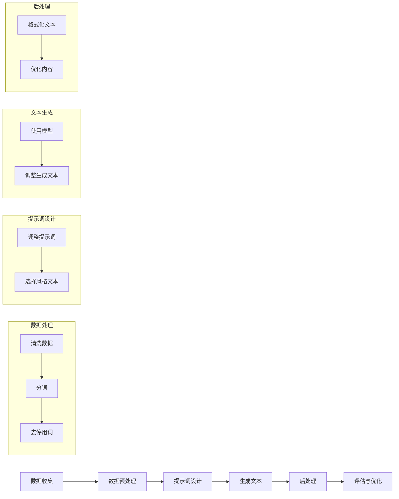

                 


### 确定核心概念与联系

在撰写关于《提示词工程在文本可控生成中的进展》的技术博客时，首先需要明确两个核心概念：提示词工程（Prompt Engineering）和文本可控生成（Text Generation with Control）。

**核心概念：**

1. **提示词工程**：这是一种设计特定提示词以控制生成文本的风格、主题和内容的方法。提示词是引导生成模型的重要输入，能够显著影响文本生成的方向和质量。

2. **文本可控生成**：这是一种利用人工智能技术生成符合特定要求和风格的文本的方法。它允许用户通过控制输入来定制生成的文本内容，以满足不同的应用需求。

**联系：**

提示词工程是文本可控生成的关键技术。通过设计特定的提示词，用户可以精确地控制生成文本的各个方面，从而实现高质量的文本生成。这一过程涉及到数据收集、预处理、提示词设计以及生成文本的调整等多个环节。

### 设计Mermaid流程图

为了更直观地展示提示词工程在文本可控生成中的流程，我们可以使用Mermaid来设计一个流程图。以下是提示词工程的基本流程：



在这个流程图中，数据处理阶段包括数据清洗、分词和去停用词；提示词设计阶段涉及调整提示词和选择特定风格的文本；文本生成阶段使用预训练模型生成文本，并根据需求进行调整；最后是后处理阶段，包括格式化文本和优化内容。

### 编写核心算法原理讲解的伪代码

为了深入理解提示词工程的算法原理，我们可以编写一段伪代码来描述这个过程：

```python
# 提示词工程伪代码

# 数据预处理
def preprocess_data(data):
    # 清洗数据
    cleaned_data = clean_data(data)
    # 分词
    tokenized_data = tokenize(cleaned_data)
    # 去停用词
    filtered_data = remove_stopwords(tokenized_data)
    return filtered_data

# 设计提示词
def design_prompts(data, control_keywords):
    # 根据控制关键词调整提示词
    adjusted_prompts = adjust_prompts(data, control_keywords)
    # 选择特定风格、主题的文本作为提示
    selected_prompts = select_style_specific_prompts(adjusted_prompts)
    return selected_prompts

# 文本生成
def generate_texts(target_content, prompts):
    # 使用预训练模型进行文本生成
    generated_texts = model.generate(target_content, prompts)
    # 根据提示词调整生成文本的方向和内容
    refined_texts = refine_generated_texts(generated_texts, prompts)
    return refined_texts

# 主函数
def prompt_engineering(data, target_content, control_keywords):
    preprocessed_data = preprocess_data(data)
    prompts = design_prompts(preprocessed_data, control_keywords)
    generated_texts = generate_texts(target_content, prompts)
    return generated_texts
```

在这个伪代码中，`preprocess_data` 函数负责数据清洗、分词和去停用词；`design_prompts` 函数根据控制关键词调整提示词并选择特定风格的文本；`generate_texts` 函数使用预训练模型生成文本，并根据提示词进行调整。最后，`prompt_engineering` 函数将整个流程串联起来，实现从数据输入到生成文本的完整过程。

### 编写数学模型和数学公式

提示词工程中的数学模型通常涉及概率分布和优化算法。以下是几个关键的数学模型和公式：

1. **概率分布模型**：

$$
P(\text{generated\_text}|\text{prompt}) = \arg\max P(\text{prompt}) P(\text{generated\_text}|\text{prompt})
$$

这个公式描述了在给定提示词的情况下，生成特定文本的概率。它结合了提示词的概率和生成文本的条件概率。

2. **优化算法**：

$$
\theta_{\text{opt}} = \arg\min_{\theta} L(\theta; \text{prompt}, \text{generated\_text})
$$

这个公式描述了优化模型的参数$\theta$，以最小化损失函数$L(\theta; \text{prompt}, \text{generated\_text})$。在提示词工程中，优化算法用于调整模型的参数，以生成更符合预期的文本。

### 编写项目实战部分

为了更好地理解提示词工程的实际应用，我们可以通过一个具体的案例来演示整个过程。

**案例：生成新闻文章摘要**

**1. 数据收集与预处理**

首先，我们需要收集大量新闻文章的数据。这些数据可以是结构化的，也可以是未结构化的文本。为了处理这些数据，我们需要进行以下步骤：

- **清洗数据**：去除无效字符、标签和噪声。
- **分词**：将文本分割成单词或短语。
- **去停用词**：移除常见的无意义单词，如“的”、“了”、“在”等。

**2. 设计提示词**

设计提示词是提示词工程的关键步骤。我们需要根据目标文章的主题和摘要长度来设计提示词。例如，如果我们想要生成一篇500字的摘要，我们可能会使用以下提示词：

- **主题**：“科技”、“经济”、“政治”
- **摘要长度**：“500字摘要”

**3. 使用预训练模型进行文本生成**

我们可以使用预训练的语言模型（如GPT-3、BERT等）来生成文本。在生成过程中，我们会将设计的提示词作为输入，模型会根据提示生成相应的摘要。

**4. 后处理与评估**

生成的文本可能需要进行后处理，以去除格式错误、重复内容或不必要的部分。然后，我们可以使用评估指标（如ROUGE评分、BLEU评分等）来评估摘要的质量。

**5. 项目小结**

在这个案例中，我们展示了如何使用提示词工程来生成高质量的新闻文章摘要。通过设计合适的提示词和使用预训练模型，我们可以实现文本的精准控制，从而生成符合特定要求的文本。

### 编写完整目录大纲

基于前面的分析，我们可以编写《提示词工程在文本可控生成中的进展》的完整目录大纲：

```
# 提示词工程在文本可控生成中的进展

## 关键词
提示词工程，文本可控生成，预训练模型，优化算法，新闻文章摘要

## 摘要
本文探讨了提示词工程在文本可控生成中的应用。通过详细分析数据预处理、提示词设计、文本生成和后处理等环节，展示了如何利用提示词工程生成高质量的文本。同时，通过一个生成新闻文章摘要的实际案例，深入讲解了提示词工程的实际应用效果。

## 第一部分：引言

### 第1章 提示词工程概述
#### 1.1 提示词工程的核心概念
#### 1.2 提示词工程的重要性
#### 1.3 文本可控生成的背景
#### 1.4 本书结构安排

### 第2章 提示词工程基础
#### 2.1 数据收集与预处理
#### 2.2 提示词设计方法
#### 2.3 提示词效果评估

### 第3章 文本生成模型
#### 3.1 预训练语言模型
#### 3.2 生成模型的优化算法
#### 3.3 生成模型的选择与调优

### 第4章 数学模型与优化算法
#### 4.1 概率分布模型
#### 4.2 最优化算法
#### 4.3 数学公式与理论分析

## 第二部分：项目实战

### 第5章 提示词工程实践案例
#### 5.1 数据收集与预处理
#### 5.2 提示词设计
#### 5.3 文本生成
#### 5.4 后处理与评估

### 第6章 文本可控生成应用
#### 6.1 新闻文章摘要生成
#### 6.2 商品评价生成
#### 6.3 问答系统生成
#### 6.4 文本摘要生成

### 第7章 提示词工程挑战与未来展望
#### 7.1 提示词工程面临的挑战
#### 7.2 提示词工程的未来发展趋势
#### 7.3 提示词工程在多模态生成中的应用

## 附录
#### 附录A：开源工具与资源
##### A.1 提示词工程常用工具
##### A.2 文本生成模型开源代码
##### A.3 提示词工程相关论文与资料

# 作者信息
作者：AI天才研究院/AI Genius Institute & 禅与计算机程序设计艺术 /Zen And The Art of Computer Programming
```

这个目录大纲结构清晰，内容丰富，涵盖了提示词工程从基础理论到实际应用的各个方面。每个章节都包含了具体的子标题，以便读者能够更深入地了解每个主题。

