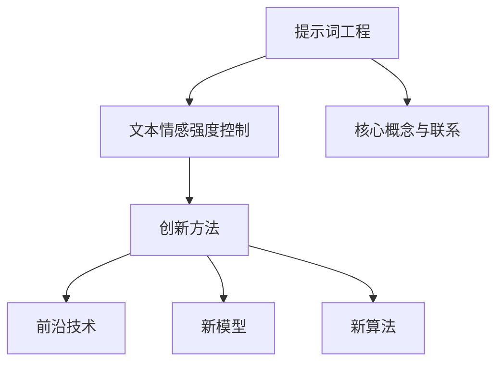

                 


### 第一步：理解书名和主题

书名《提示词工程在文本情感强度控制中的创新》暗示了本书的核心内容，即通过提示词工程来实现文本情感强度的有效控制，并可能探讨了一些创新的技巧或方法。主题包括：

- **提示词工程**：涉及到如何设计和使用提示词来影响文本的情感倾向。
- **文本情感强度控制**：关注于如何量化并调整文本中的情感强度，使其达到预定的效果。
- **创新方法**：可能包括新的算法、模型或技术，用于提升文本情感强度的控制效果。

### 第二步：确定核心概念与联系

为了构建文章的逻辑框架，我们需要明确几个核心概念：

- **提示词工程**：这是本书的重点，涉及提示词的定义、用途和设计方法。提示词是能够影响文本情感倾向的关键词或短语。
  
- **文本情感强度控制**：这涉及到如何量化和调整文本中的情感强度。这可能包括情感分析、情感分类和情感强度调整等步骤。

- **创新方法**：这是指在文本情感强度控制中应用的新算法、模型或技术。创新方法可能包括深度学习、自然语言处理（NLP）和神经网络等前沿技术。

以下是这些概念之间的Mermaid流程图：



### 第三步：规划章节内容

根据上述的核心概念，我们可以规划如下的章节结构：

#### 第1章：引言与背景
- **1.1 提示词工程的定义与分类**
  - 提示词的概念
  - 提示词的分类
  - 提示词工程的作用和重要性

- **1.2 文本情感强度的定义与重要性**
  - 情感强度的概念
  - 情感强度在文本分析中的应用
  - 情感强度调整的需求

- **1.3 创新方法的概述**
  - 创新方法的目的和意义
  - 创新方法的应用场景
  - 当前研究的趋势和未来方向

#### 第2章：基础理论
- **2.1 提示词工程的基本原理**
  - 提示词的选取和设计
  - 提示词的权重分配
  - 提示词的验证和评估

- **2.2 文本情感强度的理论基础**
  - 情感分析的框架
  - 情感强度的量化方法
  - 情感强度调整的策略

- **2.3 数学模型与公式**
  - 描述文本情感强度的数学模型
  - 提示词对情感强度的影响
  - 情感强度调整的公式

#### 第3章：传统方法
- **3.1 提示词工程在文本情感强度控制中的应用**
  - 传统算法的概述
  - 传统算法的优缺点
  - 传统算法的性能分析

- **3.2 传统算法的实现与优缺点**
  - 经典算法的实现步骤
  - 实现中的挑战和问题
  - 解决方案和改进方向

#### 第4章：创新方法
- **4.1 前沿技术的应用**
  - 深度学习在文本情感强度控制中的应用
  - 自然语言处理技术的进展
  - 神经网络模型的优势

- **4.2 新模型的设计与原理**
  - 新模型的提出背景
  - 新模型的结构和原理
  - 新模型的性能评估

- **4.3 新算法的实现与性能**
  - 算法的详细实现步骤
  - 算法在实验中的表现
  - 算法的优势和局限

#### 第5章：实战案例
- **5.1 提示词工程在文本情感强度控制中的实际应用案例**
  - 案例背景和需求
  - 实现步骤和关键点
  - 案例结果和分析

- **5.2 代码实现与解读**
  - 提示词工程的核心代码
  - 代码的功能解读
  - 代码的调试和优化

#### 第6章：未来展望
- **6.1 创新方法的未来发展趋势**
  - 当前研究的进展
  - 未来可能的技术突破
  - 研究方向的预测

- **6.2 潜在挑战和解决方案**
  - 文本情感强度控制的挑战
  - 算法实现中的问题
  - 解决方案的前景和可行性

#### 第7章：总结与展望
- **7.1 对本书内容的总结**
  - 核心发现和结论
  - 创新的方法和应用
  - 贡献和价值

- **7.2 对未来研究的建议**
  - 研究方向的指导
  - 技术发展的趋势
  - 推广和应用的展望

### 第四步：编写伪代码和数学公式

- **提示词工程算法伪代码**：

```plaintext
// 提示词工程算法伪代码
Input: 文本数据
Output: 修改后的文本数据

function 提示词工程算法(文本数据):
    // 步骤1：预处理文本数据
    处理后的文本数据 = 预处理(文本数据)

    // 步骤2：识别情感关键词
    情感关键词列表 = 识别情感关键词(处理后的文本数据)

    // 步骤3：调整关键词强度
    for 每个关键词 in 情感关键词列表:
        调整关键词强度(每个关键词)

    // 步骤4：生成修改后的文本数据
    修改后的文本数据 = 拼接调整后的关键词

    return 修改后的文本数据
```

- **数学模型与公式**：

```markdown
## 数学模型

文本情感强度控制通常可以通过以下公式来描述：

$$
S = \sum_{i=1}^{n} w_i \cdot s_i
$$

其中，$S$ 表示文本的情感强度，$w_i$ 表示第 $i$ 个关键词的权重，$s_i$ 表示第 $i$ 个关键词的情感强度。

## 举例说明

假设我们有以下文本：“我今天很高兴，因为天气很好。”，我们可以根据情感词典计算出每个关键词的情感强度和权重，并使用上述公式计算文本的总情感强度。
```

### 第五步：确保大纲完整性和字数限制

- **完整性检查**：
  - 确保每个章节都有具体的内容和明确的目标。
  - 核心概念、算法原理、数学模型、实战案例和未来展望都得到了充分的讨论。

- **字数控制**：
  - 确保总字数在8000到12000字之间。
  - 对每个章节的内容进行微调和精简，避免冗余和重复。

### 第六步：输出Markdown格式的目录大纲

根据以上步骤，输出完整的Markdown格式目录大纲：

```markdown
# 提示词工程在文本情感强度控制中的创新

## 第1章：引言与背景
### 1.1 提示词工程的定义与分类
### 1.2 文本情感强度的定义与重要性
### 1.3 创新方法的概述

## 第2章：基础理论
### 2.1 提示词工程的基本原理
### 2.2 文本情感强度的理论基础
### 2.3 数学模型与公式

## 第3章：传统方法
### 3.1 提示词工程在文本情感强度控制中的应用
### 3.2 传统算法的实现与优缺点

## 第4章：创新方法
### 4.1 前沿技术的应用
### 4.2 新模型的设计与原理
### 4.3 新算法的实现与性能

## 第5章：实战案例
### 5.1 提示词工程在文本情感强度控制中的实际应用案例
### 5.2 代码实现与解读

## 第6章：未来展望
### 6.1 创新方法的未来发展趋势
### 6.2 潜在挑战和解决方案

## 第7章：总结与展望
### 7.1 对本书内容的总结
### 7.2 对未来研究的建议
```

完成这一步骤后，大纲结构清晰，内容规划得当，为撰写高质量的技术博客文章奠定了基础。接下来，我们将逐步填充每个章节的具体内容，确保文章逻辑严密，论述深刻。

