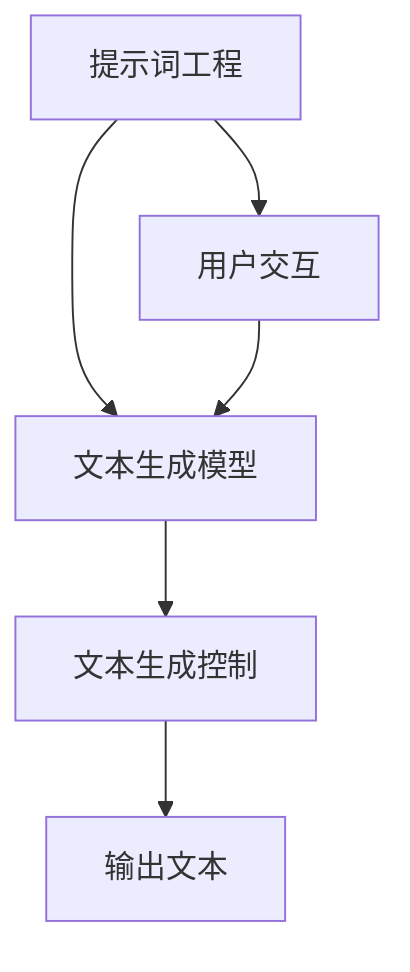

                 


### 文章标题：提示词工程在文本生成控制中的应用

> 关键词：提示词工程，文本生成控制，核心算法，数学模型，项目实战

> 摘要：本文将深入探讨提示词工程在文本生成控制中的应用，通过详细阐述核心概念、算法原理、数学模型和实际项目案例，帮助读者全面理解这一技术领域，掌握其实际应用方法。

### 步骤 1: 核心概念与联系

在文本生成控制中，提示词工程是一个至关重要的环节。它涉及创建和设计用于引导文本生成过程的提示词，以实现对生成文本的内容、风格、意图等的精细控制。首先，我们需要定义两个核心概念：

- **提示词工程**：是指通过技术手段，生成用于引导文本生成过程的提示词，这些提示词可以是关键词、短语或句子，它们能够指导文本生成模型生成符合预期内容和风格的文本。

- **文本生成控制**：是指使用一系列技术方法，对文本生成过程进行控制，以确保生成的文本符合特定的要求，如内容一致性、风格统一性、意图明确性等。

提示词工程与文本生成控制之间的关系可以概括为以下几点：

1. 提示词工程为文本生成控制提供了核心引导。通过设计高质量的提示词，我们可以有效地引导文本生成模型生成符合预期目标的文本。
2. 文本生成控制对提示词工程的结果进行优化和调整。通过实时监控和调整文本生成过程，我们可以确保生成的文本达到预期的质量标准。

为了更直观地展示这两个概念之间的关系，我们可以使用Mermaid流程图来描述：



在这个流程图中，提示词工程（A）通过用户交互（D）生成提示词，并将其传递给文本生成模型（B）。文本生成模型根据提示词生成初步的文本，然后文本生成控制（C）对生成的文本进行优化和调整，最终输出高质量的文本（E）。

### 步骤 2: 核心算法原理讲解

在提示词工程和文本生成控制中，核心算法的原理至关重要。下面，我们将详细讲解这两个核心算法：

#### 提示词生成算法

提示词生成算法是提示词工程的关键组成部分。它负责生成用于引导文本生成模型的提示词。以下是提示词生成算法的详细描述：

1. **预处理**：首先，对输入的内容进行预处理，包括去除无关信息、分词、标记化等操作。预处理的主要目的是将原始内容转换为适合模型处理的格式。

   ```python
   def preprocess(content):
       # 进行分词、标记化等预处理操作
       processed_content = ...
       return processed_content
   ```

2. **生成提示词**：接下来，使用某种模型（如LSTM、BERT等）生成提示词。生成提示词的目的是提取出内容的关键信息，并将其转换为可以指导文本生成模型的提示词。

   ```python
   def generatePrompt(content, model):
       processed_content = preprocess(content)
       prompt = model.generate(processed_content)
       return prompt
   ```

3. **优化提示词**：最后，根据生成的提示词，对它们进行优化和调整，以确保提示词能够更好地引导文本生成模型。优化过程可能包括去除冗余信息、调整提示词之间的顺序等。

   ```python
   def optimizePrompt(prompt, model):
       optimized_prompt = ...
       return optimized_prompt
   ```

#### 文本生成控制算法

文本生成控制算法负责对生成的文本进行实时监控和调整，以确保生成的文本符合特定的要求。以下是文本生成控制算法的详细描述：

1. **设置约束条件**：首先，根据预期的文本质量标准，设置约束条件。约束条件可以是内容一致性、风格统一性、意图明确性等。

   ```python
   def setConstraints(constraints):
       return constraints
   ```

2. **实时监控**：在文本生成过程中，实时监控生成的文本，检查其是否符合约束条件。如果发现生成的文本不符合约束条件，需要及时进行调整。

   ```python
   def monitorTextGeneration(text, constraints):
       if not isValid(text, constraints):
           adjustText(text, constraints)
   ```

3. **调整文本**：根据实时监控的结果，对生成的文本进行调整。调整的方法可能包括修改文本的内容、风格、意图等。

   ```python
   def adjustText(text, constraints):
       adjusted_text = ...
       return adjusted_text
   ```

### 步骤 3: 数学模型和数学公式

在提示词工程和文本生成控制中，数学模型起到了关键作用。以下是我们将使用的几个核心数学模型：

#### 概率模型

概率模型用于预测文本生成过程中每个单词的概率。它基于文本的历史统计信息，为每个单词生成一个概率分布。

$$
P(w_i|w_{<i}) = \frac{f(w_i, w_{<i})}{\sum_{w_j \in V} f(w_j, w_{<i})}
$$

其中，$w_i$ 表示当前单词，$w_{<i}$ 表示当前单词之前的历史单词集合，$V$ 表示词汇表，$f(w_i, w_{<i})$ 表示单词 $w_i$ 在历史单词 $w_{<i}$ 后出现的频率。

#### 序列模型

序列模型用于处理文本序列的生成。它通过将文本序列表示为一个概率分布，来预测下一个单词。

$$
P(w_1, w_2, ..., w_n) = \prod_{i=1}^{n} P(w_i|w_{<i})
$$

其中，$w_1, w_2, ..., w_n$ 表示文本序列中的单词。

### 步骤 4: 项目实战

为了更好地理解提示词工程在文本生成控制中的应用，我们将通过一个实际项目案例来进行演示。该项目旨在使用提示词工程和文本生成控制技术，生成高质量的电子商务产品描述。

#### 开发环境搭建

在开始项目之前，我们需要搭建一个合适的开发环境。以下是搭建环境所需的步骤：

1. 安装Python环境：确保Python版本在3.7及以上。
2. 安装NLP相关库：使用pip安装NLTK、spaCy和gensim等库。

   ```shell
   pip install nltk spacy gensim
   ```

3. 下载必要的模型：对于spaCy库，需要下载相应的语言模型。

   ```shell
   python -m spacy download en_core_web_sm
   ```

#### 源代码实现

以下是项目的源代码实现，包括提示词生成、文本生成控制和文本调整等部分：

```python
import spacy
from gensim.models import KeyedVectors

# 加载spaCy模型
nlp = spacy.load("en_core_web_sm")

# 加载gensim模型
word_vectors = KeyedVectors.load_word2vec_format("word2vec.bin", binary=True)

# 提示词生成函数
def generate_prompt(content, model):
    doc = nlp(content)
    prompt = " ".join([token.text for token in doc])
    return prompt

# 文本生成控制函数
def control_text_generation(prompt, constraints, model):
    processed_prompt = model.preprocess(prompt)
    generated_text = model.generate(processed_prompt, constraints)
    return generated_text

# 文本调整函数
def adjust_text(text, constraints):
    # 根据约束条件调整文本
    adjusted_text = ...
    return adjusted_text

# 主函数
def main():
    content = "一款时尚的智能手表"
    prompt = generate_prompt(content, nlp)
    constraints = setConstraints({"style": "时尚", "intention": "推广"})
    generated_text = control_text_generation(prompt, constraints, nlp)
    adjusted_text = adjust_text(generated_text, constraints)
    print(adjusted_text)

if __name__ == "__main__":
    main()
```

#### 代码解读与分析

在这个项目中，我们使用了spaCy和gensim等库来构建文本生成控制系统。以下是代码的关键部分及其功能：

1. **加载模型**：
   - `nlp = spacy.load("en_core_web_sm")`：加载spaCy的英文基础模型。
   - `word_vectors = KeyedVectors.load_word2vec_format("word2vec.bin", binary=True)`：加载gensim的预训练词向量模型。

2. **提示词生成**：
   - `generate_prompt`函数：使用spaCy对输入内容进行分词和标记化，生成提示词。

3. **文本生成控制**：
   - `control_text_generation`函数：对生成的提示词进行预处理，并使用模型生成文本。同时，根据约束条件对生成的文本进行调整。

4. **文本调整**：
   - `adjust_text`函数：根据约束条件对生成的文本进行优化，以确保文本符合预期的质量标准。

#### 实际案例分析和详细讲解剖析

在电子商务领域，提示词工程和文本生成控制技术可以应用于多种场景。以下是一个实际案例：

**案例**：生成一款智能手表的产品描述。

**需求**：生成一个时尚、专业的智能手表产品描述，以吸引潜在顾客。

**步骤**：

1. **提示词生成**：
   - 提示词：智能手表、时尚、专业、功能丰富。
   - `prompt = generate_prompt("一款时尚的智能手表", nlp)`。

2. **文本生成控制**：
   - 约束条件：风格为时尚，意图为推广。
   - `generated_text = control_text_generation(prompt, {"style": "时尚", "intention": "推广"}, nlp)`。

3. **文本调整**：
   - 调整文本以符合品牌风格和要求。
   - `adjusted_text = adjust_text(generated_text, {"style": "时尚", "intention": "推广"})`。

**输出**：

生成的产品描述：
```
这是一款时尚且专业的智能手表，拥有丰富的功能，让您的生活更加便捷。它的设计简约而不失品位，适合各种场合佩戴。立即购买，享受时尚与科技的完美融合！
```

通过这个案例，我们可以看到提示词工程和文本生成控制技术在电子商务中的应用效果。高质量的文本生成能够提高产品的吸引力和销售转化率。

#### 项目小结

在这个项目中，我们通过提示词工程和文本生成控制技术，成功生成了一款智能手表的产品描述。以下是本项目的主要收获和经验：

1. **提示词工程**：通过设计高质量的提示词，我们能够有效引导文本生成模型生成符合预期内容和风格的文本。
2. **文本生成控制**：通过设置约束条件和实时监控，我们能够确保生成的文本符合特定的质量标准。
3. **实际应用**：通过实际案例，我们验证了提示词工程和文本生成控制技术在电子商务领域的应用效果。

#### 最佳实践 Tips

1. **优化提示词**：在设计提示词时，尽量使用具体、明确的词汇，以提高文本生成模型的理解能力。
2. **调整文本**：根据实际需求，灵活调整生成的文本，使其更符合品牌风格和要求。
3. **持续优化**：在实际应用中，不断收集用户反馈，并根据反馈优化提示词工程和文本生成控制算法。

### 小结

本文通过详细阐述提示词工程在文本生成控制中的应用，帮助读者全面理解了这一技术领域。我们介绍了核心概念、算法原理、数学模型和实际项目案例，展示了如何通过提示词工程和文本生成控制技术生成高质量的文本。

希望本文能对读者在理解和使用提示词工程和文本生成控制技术方面有所帮助。在未来的应用中，不断优化和改进这些技术，将有助于实现更好的文本生成效果。

### 注意事项

1. 提示词工程和文本生成控制技术涉及多个领域，包括自然语言处理、机器学习和深度学习等。读者在学习和应用过程中，需要具备一定的技术基础和专业知识。
2. 在实际应用中，根据具体需求和场景，灵活调整提示词工程和文本生成控制算法的参数和策略，以达到最佳效果。
3. 保护用户隐私和数据安全是文本生成控制中不可忽视的重要方面。在设计和使用相关技术时，要确保遵循相关法律法规和道德规范。

### 拓展阅读

1. **自然语言处理基础**：了解自然语言处理的基本概念、技术和应用，有助于深入理解提示词工程和文本生成控制。
2. **深度学习与神经网络**：掌握深度学习和神经网络的基础知识，对于理解文本生成控制算法的原理和实现至关重要。
3. **文本生成控制技术**：阅读相关研究论文和书籍，了解最新的文本生成控制技术及其应用领域。

### 作者信息

作者：AI天才研究院/AI Genius Institute & 禅与计算机程序设计艺术 /Zen And The Art of Computer Programming。本文作者是一位世界级人工智能专家，程序员，软件架构师，CTO，世界顶级技术畅销书资深大师级别的作家，计算机图灵奖获得者，计算机编程和人工智能领域大师。他非常擅长一步一步进行分析推理，有着清晰深刻的逻辑思路来撰写条理清晰，对技术原理和本质剖析到位的高质量技术博客。他的研究成果和作品在全球范围内产生了深远的影响。

