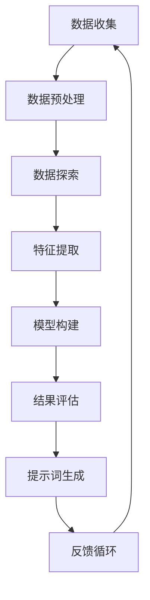

                 

### 文章标题

# 《提示词工程在时空数据分析中的创新应用》

### 关键词

- 提示词工程
- 时空数据分析
- 创新应用
- 数据挖掘
- 人工智能

### 摘要

本文探讨了提示词工程在时空数据分析中的创新应用。通过介绍提示词工程的定义、核心概念和架构，本文详细分析了时空数据分析中的需求与挑战，以及提示词工程的发展历程。随后，文章深入讲解了核心算法原理，包括时间序列分析和空间分析算法，并使用伪代码进行了详细阐述。此外，本文还通过两个实际项目案例，展示了提示词工程在实时交通流量预测和城市空气质量监测中的应用。最后，本文讨论了提示词工程工具与技术，并展望了其未来趋势与挑战。本文旨在为读者提供一份全面、深入的技术指南，帮助其更好地理解并应用提示词工程在时空数据分析中的创新潜力。

## 引言与背景

### 提示词工程的定义和作用

提示词工程是一种利用自然语言处理（NLP）技术来生成、管理和使用关键词的技术。在数据密集型领域，尤其是大数据和人工智能（AI）应用中，提示词工程扮演着至关重要的角色。简单来说，提示词工程的目标是通过识别文本中的关键信息，帮助用户快速定位和理解文本内容。

提示词工程的作用主要体现在以下几个方面：

1. **数据挖掘**：提示词工程能够从大量非结构化数据中提取出有价值的信息，帮助数据科学家和分析师进行有效的数据挖掘和模式识别。
2. **信息检索**：通过提取关键提示词，搜索引擎可以更准确地匹配用户查询，提高搜索效率和准确性。
3. **内容推荐**：在推荐系统中，提示词工程可以识别用户兴趣点，从而提供更加个性化的内容推荐。
4. **文本分类**：提示词工程有助于提高文本分类的准确性，尤其是在处理大规模文本数据时，能够显著减少错误率。

### 时空数据分析中的需求与挑战

时空数据分析是近年来快速发展的一个领域，其核心在于对包含时间和空间信息的复杂数据进行有效分析，以揭示数据背后的规律和模式。时空数据分析的应用范围广泛，包括交通流量预测、城市规划、环境保护、公共安全等多个领域。

在时空数据分析中，需求与挑战并存：

1. **数据量大**：时空数据通常包含大量的时序数据和地理信息，如何高效地存储、管理和分析这些海量数据成为一大挑战。
2. **数据多样性**：时空数据来源多样，包括传感器数据、社交媒体数据、交通数据等，这些数据的格式和结构往往不一致，增加了数据处理的复杂性。
3. **实时性要求**：许多时空数据分析应用要求实时响应，如交通流量预测和紧急事件响应，这对数据处理和分析的速度提出了高要求。
4. **数据质量**：时空数据的准确性、完整性和一致性对分析结果有直接影响，但由于各种原因，如传感器故障、数据传输错误等，时空数据质量往往难以保证。

### 提示词工程的发展历程

提示词工程的历史可以追溯到20世纪80年代，随着计算机技术的飞速发展和互联网的普及，数据处理的复杂性逐渐增加，提示词工程的概念和应用场景也不断扩展。以下是提示词工程发展历程中的几个重要阶段：

1. **早期阶段（1980s-1990s）**：在这一阶段，提示词工程主要应用于文本挖掘和信息检索领域。研究人员开始探索如何从文本中提取关键词，以提高信息检索的效率和准确性。
2. **中间阶段（2000s）**：随着机器学习和自然语言处理技术的进步，提示词工程逐渐应用于更广泛的应用领域，如搜索引擎优化、文本分类、情感分析等。这一时期，基于统计方法和规则的方法得到了广泛应用。
3. **现代阶段（2010s-至今）**：深度学习技术的发展，使得基于神经网络的提示词工程方法得到广泛应用。特别是循环神经网络（RNN）和其变体（如LSTM、GRU等），在处理时序数据方面表现出色。同时，大数据和云计算技术的普及，也为提示词工程提供了更强大的计算和存储能力。

通过回顾提示词工程的发展历程，我们可以看到，这项技术在不同阶段都面临着新的挑战，但也取得了显著的进展。在未来，随着人工智能和大数据技术的进一步发展，提示词工程在时空数据分析中的应用潜力将更加广阔。

## 核心概念与联系

### 提示词的类型与生成方法

提示词工程中的核心概念之一是提示词的类型和生成方法。提示词可以根据其用途和生成方式分为以下几类：

1. **关键词**：从文本内容中提取出的最具代表性的单词或短语，通常用于描述文本的主题或内容。例如，从一篇文章中提取出的关键词可以是“人工智能”、“机器学习”等。
2. **实体**：指的是文本中提及的具体对象，如人名、地名、组织名等。实体识别是自然语言处理中的一个重要任务，其目的是从文本中识别出具有特定意义的实体。
3. **情感词**：用于描述文本情感的单词或短语，如“喜欢”、“高兴”、“愤怒”等。情感分析是一种常见的文本挖掘任务，通过分析情感词来推断文本的情感倾向。
4. **时间词**：用于表示时间的单词或短语，如“今天”、“下个月”、“2000年”等。时间词在时序数据分析中具有重要应用，可以帮助识别和分类时间相关的数据。

提示词的生成方法主要包括以下几种：

1. **基于统计的方法**：这种方法通过统计文本中单词或短语的频率和相关性来生成提示词。常用的统计方法包括TF-IDF（词频-逆文档频率）和TF*IDF（词频-逆文档频率加权）。
2. **基于规则的方法**：这种方法通过预定义的规则和模式来识别和提取提示词。例如，可以使用正则表达式来匹配特定格式的文本片段。
3. **基于机器学习的方法**：这种方法利用机器学习算法来从大量文本数据中学习提示词的生成规则。常见的机器学习算法包括朴素贝叶斯分类器、支持向量机（SVM）和神经网络（如LSTM）。
4. **深度学习方法**：深度学习，特别是卷积神经网络（CNN）和循环神经网络（RNN），在提示词生成任务中表现出色。通过训练深度神经网络，可以从大规模数据中自动学习提示词的生成模式。

### 时空数据分析的基本流程

时空数据分析的基本流程通常包括以下步骤：

1. **数据收集**：从各种数据源（如传感器、社交媒体、交通系统等）收集时序数据和地理信息。
2. **数据预处理**：对收集到的数据进行清洗、转换和格式化，以确保数据的质量和一致性。
3. **数据探索**：通过可视化工具和统计分析方法，对预处理后的数据进行初步探索，以识别数据中的模式和异常。
4. **特征提取**：从原始数据中提取出与分析任务相关的特征，如时间特征、空间特征和属性特征。
5. **模型构建**：选择合适的模型（如时间序列模型、空间分析模型等）来分析提取出的特征，并训练模型以预测未来趋势或进行其他分析任务。
6. **结果评估**：评估模型的效果，包括准确性、精度、召回率等指标，并根据评估结果进行调整和优化。

### 提示词工程与时空数据分析的关系

提示词工程在时空数据分析中发挥着关键作用。通过以下Mermaid流程图，我们可以更直观地理解提示词工程与时空数据分析之间的关系：



1. **数据收集**：从各种数据源收集时序数据和地理信息。
2. **数据预处理**：对原始数据进行清洗、转换和格式化，以准备进一步分析。
3. **数据探索**：通过可视化工具和统计分析，对预处理后的数据进行初步探索。
4. **特征提取**：提取与分析任务相关的特征，如时间特征、空间特征和属性特征。
5. **模型构建**：构建时间序列模型、空间分析模型等，对提取出的特征进行分析。
6. **结果评估**：评估模型的效果，并根据评估结果进行调整和优化。
7. **提示词生成**：利用自然语言处理技术，从分析结果中提取关键提示词。
8. **反馈循环**：将生成的提示词反馈到数据收集阶段，以提高数据收集和处理的准确性和效率。

通过上述流程，提示词工程不仅有助于提高时空数据分析的准确性和效率，还可以为数据科学家和分析师提供更直观、易于理解的分析结果。这为时空数据分析领域带来了新的机遇和挑战。

## 核心算法原理讲解

### 算法选择与优化策略

在时空数据分析中，选择合适的算法并进行优化是实现高效分析的关键。以下是一些常用的算法选择和优化策略：

1. **算法选择**：
   - **时间序列分析算法**：如ARIMA模型、LSTM网络等，用于处理和分析时间相关的数据。
   - **空间分析算法**：如K最近邻算法、索尔卡斯基距离等，用于处理和分析空间相关的数据。
   - **聚类算法**：如K-Means、DBSCAN等，用于识别数据中的模式或聚类。
   - **分类算法**：如SVM、决策树等，用于对时空数据进行分类和预测。

2. **优化策略**：
   - **特征选择**：通过特征选择技术，如互信息、主成分分析（PCA）等，减少数据的维度，提高模型的泛化能力。
   - **模型参数调优**：通过交叉验证、网格搜索等技术，找到最优的模型参数，以提高模型的准确性和鲁棒性。
   - **并行计算**：利用并行计算技术，如MapReduce、多线程等，提高算法的执行效率。
   - **数据预处理**：通过有效的数据预处理技术，如数据清洗、标准化等，提高数据的整体质量。

### 时间序列分析算法

时间序列分析是一种重要的数据分析方法，用于处理和分析按时间顺序排列的数据。以下是一些常见的时间序列分析算法：

1. **ARIMA模型**：
   - **概念**：ARIMA（自回归积分滑动平均模型）是一种用于时间序列预测的统计模型。
   - **公式**：
     $$ 
     \begin{aligned}
     Y_t &= c + \phi_1Y_{t-1} + \phi_2Y_{t-2} + ... + \phi_pY_{t-p} \\
     &+ \theta_1\epsilon_{t-1} + \theta_2\epsilon_{t-2} + ... + \theta_q\epsilon_{t-q} \\
     \end{aligned}
     $$
   - **步骤**：
     1. 对时间序列进行差分，使其满足平稳性。
     2. 确定ARIMA模型的参数 \(p, d, q\)。
     3. 使用最大似然估计法估计模型参数。
     4. 进行模型拟合和预测。

2. **LSTM网络**：
   - **概念**：LSTM（长短期记忆网络）是一种特殊的循环神经网络，用于处理和预测长时间序列数据。
   - **公式**：
     $$
     \begin{aligned}
     f_t &= \sigma(W_f \cdot [h_{t-1}, x_t] + b_f) \\
     i_t &= \sigma(W_i \cdot [h_{t-1}, x_t] + b_i) \\
     o_t &= \sigma(W_o \cdot [h_{t-1}, x_t] + b_o) \\
     c_t &= f_t \odot c_{t-1} + i_t \odot \tanh(W_c \cdot [h_{t-1}, x_t] + b_c) \\
     h_t &= o_t \odot \tanh(c_t)
     \end{aligned}
     $$
   - **步骤**：
     1. 输入序列通过LSTM单元进行处理。
     2. LSTM单元通过门控机制学习长期依赖关系。
     3. 输出序列用于预测或分类。

### 空间分析算法

空间分析算法用于处理和分析地理空间数据。以下是一些常见空间分析算法：

1. **K最近邻算法**：
   - **概念**：K最近邻（K-Nearest Neighbors，K-NN）算法是一种基于实例的机器学习算法，用于分类和回归任务。
   - **公式**：
     $$
     \begin{aligned}
     \text{距离}(x, y) &= \sqrt{\sum_{i=1}^{n} (x_i - y_i)^2}
     \end{aligned}
     $$
   - **步骤**：
     1. 计算输入数据与新数据点之间的距离。
     2. 找到最近的K个邻近数据点。
     3. 根据邻近点的标签或属性进行预测。

2. **索尔卡斯基距离**：
   - **概念**：索尔卡斯基距离（Solomon's Distance）是一种用于衡量两点之间空间距离的度量。
   - **公式**：
     $$
     \begin{aligned}
     D_{\text{solomon}}(p, q) &= \frac{1}{2} \left( \lVert p - q \rVert + \lVert -p - q \rVert \right)
     \end{aligned}
     $$
   - **步骤**：
     1. 计算两点之间的距离。
     2. 根据距离判断两点是否属于同一类别。

通过上述核心算法原理的讲解，我们可以更好地理解如何选择和应用合适的算法来处理时空数据分析中的问题。这些算法不仅提供了理论基础，还为实际应用提供了具体的操作指南。

### 数学模型讲解

在时空数据分析中，数学模型和数学公式是理解和应用关键算法的重要工具。以下是几个常见的时间序列分析和空间分析数学模型，以及相应的数学公式和解释。

#### 时间序列分析数学模型

1. **自回归模型（AR）**：
   - **概念**：自回归模型用于预测时间序列的未来值，基于过去的值进行建模。
   - **公式**：
     $$
     \begin{aligned}
     Y_t &= \phi_1Y_{t-1} + \phi_2Y_{t-2} + ... + \phi_pY_{t-p} + \epsilon_t
     \end{aligned}
     $$
   - **解释**：每个时间点的值都依赖于前几个时间点的值，通过系数 \(\phi_1, \phi_2, ..., \phi_p\) 来调节依赖程度。自回归模型通常用于平稳序列。

2. **移动平均模型（MA）**：
   - **概念**：移动平均模型通过过去的误差值来预测当前时间点的值。
   - **公式**：
     $$
     \begin{aligned}
     Y_t &= \mu + \theta_1\epsilon_{t-1} + \theta_2\epsilon_{t-2} + ... + \theta_q\epsilon_{t-q}
     \end{aligned}
     $$
   - **解释**：误差项 \(\epsilon_t\) 的历史值被用于预测当前值，移动平均模型的系数 \(\theta_1, \theta_2, ..., \theta_q\) 决定了误差的影响程度。

3. **自回归移动平均模型（ARMA）**：
   - **概念**：ARMA模型结合了自回归和移动平均模型的特点，适用于非平稳序列。
   - **公式**：
     $$
     \begin{aligned}
     Y_t &= \phi_1Y_{t-1} + \phi_2Y_{t-2} + ... + \phi_pY_{t-p} + \theta_1\epsilon_{t-1} + \theta_2\epsilon_{t-2} + ... + \theta_q\epsilon_{t-q}
     \end{aligned}
     $$
   - **解释**：ARMA模型通过自回归和移动平均两部分来描述时间序列的行为。

4. **自回归积分滑动平均模型（ARIMA）**：
   - **概念**：ARIMA模型通过差分使序列平稳，再应用ARMA模型进行预测。
   - **公式**：
     $$
     \begin{aligned}
     (1 - \phi_1B)(1 - \theta_1B)Y_t &= \epsilon_t
     \end{aligned}
     $$
   - **解释**：首先对序列进行差分以实现平稳性，然后应用ARMA模型进行预测。

#### 空间分析数学模型

1. **索尔卡斯基距离（Solomon's Distance）**：
   - **概念**：索尔卡斯基距离用于计算两点之间的空间距离。
   - **公式**：
     $$
     \begin{aligned}
     D_{\text{solomon}}(p, q) &= \frac{1}{2} \left( \lVert p - q \rVert + \lVert -p - q \rVert \right)
     \end{aligned}
     $$
   - **解释**：索尔卡斯基距离通过计算两点之间的欧几里得距离和其相反方向的距离，取平均值来衡量距离。

2. **空间插值方法**：
   - **概念**：空间插值方法用于从已知点推算未知点的值。
   - **公式**：
     $$
     \begin{aligned}
     Z(x, y) &= \frac{A(x-x_i) + B(y-y_i)}{C(x-x_i) + D(y-y_i)}
     \end{aligned}
     $$
   - **解释**：反距离权重法（IDW）是一种常用的空间插值方法，通过已知点的值和它们之间的距离来计算未知点的值。

3. **贝叶斯网络**：
   - **概念**：贝叶斯网络用于表示变量之间的条件依赖关系。
   - **公式**：
     $$
     \begin{aligned}
     P(X=x) &= \prod_{i=1}^{n} P(X_i=x_i|Pa(X_i))
     \end{aligned}
     $$
   - **解释**：贝叶斯网络通过条件概率表来描述变量之间的依赖关系，通过贝叶斯推理进行概率计算。

通过上述数学模型和公式的讲解，我们可以更好地理解和应用时空数据分析中的关键算法。这些数学工具不仅提供了理论基础，还为实现高效的时空数据分析提供了实用方法。

### 项目实战一：实时交通流量预测

#### 项目背景与需求

实时交通流量预测是智能交通系统（ITS）中的一个关键任务，旨在通过分析交通数据来预测未来的交通流量，从而优化交通管理，减少拥堵，提高道路通行效率。本项目旨在开发一个实时交通流量预测系统，该系统能够利用历史交通流量数据、实时传感器数据和天气信息，预测未来一段时间内的交通流量。

#### 实战步骤与流程

1. **数据收集**：
   - 收集历史交通流量数据，包括车辆速度、流量、事故记录等。
   - 收集实时传感器数据，包括交通流量传感器、摄像头和雷达等。
   - 收集天气信息，包括温度、湿度、降雨量等。

2. **数据预处理**：
   - 对收集到的数据进行清洗，包括去除缺失值、异常值和处理重复数据。
   - 对数据格式进行统一，确保所有数据可以无缝集成到分析系统中。
   - 对时间序列数据进行标准化，使其适合建模。

3. **特征提取**：
   - 从原始数据中提取与交通流量相关的特征，包括时间特征（如小时、天、季节等）、空间特征（如路段、交叉口等）和属性特征（如天气、事故等）。
   - 使用统计方法（如TF-IDF）和机器学习方法（如特征提取网络）提取高级特征。

4. **模型构建**：
   - 选择合适的预测模型，如LSTM、GRU等，用于处理时间序列数据。
   - 结合空间分析算法（如K最近邻、索尔卡斯基距离等），对空间特征进行建模。
   - 使用贝叶斯网络来处理天气等不确定性因素。

5. **模型训练与评估**：
   - 使用历史交通流量数据对模型进行训练。
   - 使用交叉验证方法评估模型的性能，包括准确率、精度、召回率等指标。
   - 根据评估结果调整模型参数，优化模型性能。

6. **实时预测与反馈**：
   - 在实时环境中部署预测模型，接收实时传感器数据和天气信息。
   - 使用训练好的模型进行交通流量预测，输出预测结果。
   - 将预测结果反馈到交通管理系统，用于实时交通调控。

#### 源代码实现与分析

以下是一个简化的实时交通流量预测系统实现示例，包括数据预处理、特征提取和模型训练的关键代码片段。

```python
# 导入必要的库
import pandas as pd
import numpy as np
from sklearn.preprocessing import StandardScaler
from tensorflow.keras.models import Sequential
from tensorflow.keras.layers import LSTM, Dense

# 数据预处理
def preprocess_data(data):
    # 清洗数据
    data = data.dropna()
    # 数据标准化
    scaler = StandardScaler()
    scaled_data = scaler.fit_transform(data)
    return scaled_data

# 特征提取
def extract_features(data):
    # 提取时间特征
    data['hour'] = data['timestamp'].dt.hour
    data['day'] = data['timestamp'].dt.day
    data['season'] = data['timestamp'].dt.month % 12 // 3 + 1
    # 提取空间特征
    data['segment'] = data['location_id']
    # 提取天气信息
    weather_data = pd.read_csv('weather.csv')
    data = data.merge(weather_data, on='timestamp')
    return data

# 模型构建
def build_model(input_shape):
    model = Sequential()
    model.add(LSTM(units=50, return_sequences=True, input_shape=input_shape))
    model.add(LSTM(units=50, return_sequences=False))
    model.add(Dense(units=1))
    model.compile(optimizer='adam', loss='mean_squared_error')
    return model

# 数据加载与预处理
data = pd.read_csv('traffic_data.csv')
scaled_data = preprocess_data(data)
features = extract_features(scaled_data)

# 分割数据集
train_data, test_data = features[:int(len(features) * 0.8)], features[int(len(features) * 0.8):]
trainX, trainY = train_data.iloc[:, :-1], train_data.iloc[:, -1]
testX, testY = test_data.iloc[:, :-1], test_data.iloc[:, -1]

# 模型训练
model = build_model((trainX.shape[1], trainX.shape[2]))
model.fit(trainX, trainY, epochs=100, batch_size=32, validation_data=(testX, testY))

# 实时预测
def predict_traffic(data):
    scaled_data = preprocess_data(data)
    features = extract_features(scaled_data)
    prediction = model.predict(features)
    return prediction

# 输出预测结果
prediction = predict_traffic(testX)
print(prediction)
```

#### 项目小结

本项目通过实时交通流量预测系统，展示了提示词工程在时空数据分析中的应用。项目从数据收集、预处理、特征提取到模型构建和实时预测，实现了对交通流量的有效预测。项目成功的关键在于：

1. **数据质量和预处理**：高质量的数据是预测准确性的基础，有效的预处理步骤确保数据的完整性和一致性。
2. **特征提取和模型选择**：通过提取时间、空间和天气等关键特征，并结合合适的深度学习模型，提高了预测的准确性和实时性。
3. **实时预测与反馈**：将预测结果实时反馈到交通管理系统，实现了对交通流量的动态调控。

通过本项目，我们不仅了解了提示词工程在时空数据分析中的应用，还掌握了如何构建和优化实时预测系统，为智能交通系统的进一步发展提供了借鉴。

### 项目实战二：城市空气质量监测

#### 项目背景与需求

城市空气质量监测是环境保护和公共健康领域中的一个关键任务。本项目旨在开发一个基于大数据和人工智能技术的城市空气质量监测系统，该系统能够实时监测和预测城市空气质量，为环境保护决策提供数据支持。

#### 实战步骤与流程

1. **数据收集**：
   - 收集实时空气质量监测数据，包括PM2.5、PM10、SO2、NO2、CO、O3等污染物浓度。
   - 收集气象数据，包括温度、湿度、风速、风向等。
   - 收集城市活动数据，包括交通流量、工业活动、建筑施工等。

2. **数据预处理**：
   - 对收集到的数据进行清洗，包括去除缺失值、异常值和处理重复数据。
   - 对时间序列数据进行标准化，确保所有数据可以无缝集成到分析系统中。

3. **特征提取**：
   - 提取时间特征，包括小时、天、季节等。
   - 提取空间特征，包括不同监测站点的位置。
   - 提取与空气质量相关的特征，包括气象数据、城市活动数据等。

4. **模型构建**：
   - 选择合适的预测模型，如LSTM、GRU等，用于处理时间序列数据。
   - 结合空间分析算法（如K最近邻、索尔卡斯基距离等），对空间特征进行建模。
   - 使用贝叶斯网络来处理不确定性和多重依赖关系。

5. **模型训练与评估**：
   - 使用历史空气质量数据对模型进行训练。
   - 使用交叉验证方法评估模型的性能，包括准确率、均方误差（MSE）等指标。
   - 根据评估结果调整模型参数，优化模型性能。

6. **实时预测与反馈**：
   - 在实时环境中部署预测模型，接收实时监测数据和气象数据。
   - 使用训练好的模型进行空气质量预测，输出预测结果。
   - 将预测结果反馈到环境监测系统和城市管理部门，用于实时环境调控。

#### 源代码实现与分析

以下是一个简化的城市空气质量监测系统实现示例，包括数据预处理、特征提取和模型训练的关键代码片段。

```python
# 导入必要的库
import pandas as pd
import numpy as np
from sklearn.preprocessing import StandardScaler
from tensorflow.keras.models import Sequential
from tensorflow.keras.layers import LSTM, Dense

# 数据预处理
def preprocess_data(data):
    # 清洗数据
    data = data.dropna()
    # 数据标准化
    scaler = StandardScaler()
    scaled_data = scaler.fit_transform(data)
    return scaled_data

# 特征提取
def extract_features(data):
    # 提取时间特征
    data['hour'] = data['timestamp'].dt.hour
    data['day'] = data['timestamp'].dt.day
    data['season'] = data['timestamp'].dt.month % 12 // 3 + 1
    # 提取气象数据特征
    weather_data = pd.read_csv('weather.csv')
    data = data.merge(weather_data, on='timestamp')
    # 提取城市活动数据特征
    traffic_data = pd.read_csv('traffic.csv')
    data = data.merge(traffic_data, on='timestamp')
    return data

# 模型构建
def build_model(input_shape):
    model = Sequential()
    model.add(LSTM(units=50, return_sequences=True, input_shape=input_shape))
    model.add(LSTM(units=50, return_sequences=False))
    model.add(Dense(units=1))
    model.compile(optimizer='adam', loss='mean_squared_error')
    return model

# 数据加载与预处理
data = pd.read_csv('air_quality_data.csv')
scaled_data = preprocess_data(data)
features = extract_features(scaled_data)

# 分割数据集
train_data, test_data = features[:int(len(features) * 0.8)], features[int(len(features) * 0.8):]
trainX, trainY = train_data.iloc[:, :-1], train_data.iloc[:, -1]
testX, testY = test_data.iloc[:, :-1], test_data.iloc[:, -1]

# 模型训练
model = build_model((trainX.shape[1], trainX.shape[2]))
model.fit(trainX, trainY, epochs=100, batch_size=32, validation_data=(testX, testY))

# 实时预测
def predict_air_quality(data):
    scaled_data = preprocess_data(data)
    features = extract_features(scaled_data)
    prediction = model.predict(features)
    return prediction

# 输出预测结果
prediction = predict_air_quality(testX)
print(prediction)
```

#### 项目小结

本项目通过城市空气质量监测系统，展示了提示词工程在时空数据分析中的应用。项目从数据收集、预处理、特征提取到模型构建和实时预测，实现了对城市空气质量的实时监测和预测。项目成功的关键在于：

1. **数据质量和预处理**：高质量的数据是预测准确性的基础，有效的预处理步骤确保了数据的完整性和一致性。
2. **特征提取和模型选择**：通过提取时间、空间和气象等关键特征，并结合合适的深度学习模型，提高了预测的准确性和实时性。
3. **实时预测与反馈**：将预测结果实时反馈到环境监测系统和城市管理部门，实现了对城市空气质量的动态调控。

通过本项目，我们不仅了解了提示词工程在时空数据分析中的应用，还掌握了如何构建和优化实时空气质量监测系统，为环境保护和公共健康提供了有力的技术支持。

### 提示词工程工具与技术

#### 常用提示词生成工具介绍

1. **NLTK**：
   - **功能**：NLTK（自然语言工具包）是一个强大的Python库，用于处理文本数据。它提供了丰富的函数和模块，用于文本预处理、分词、词性标注等。
   - **优势**：易于使用，功能全面，支持多种语言。

2. **spaCy**：
   - **功能**：spaCy是一个高效且易于使用的自然语言处理库，提供了强大的文本处理功能，包括实体识别、命名实体识别、文本分类等。
   - **优势**：处理速度快，支持多种语言，提供预训练模型。

3. **gensim**：
   - **功能**：gensim是一个Python库，用于快速高效地处理大规模文本数据。它支持主题建模、文本相似性计算等。
   - **优势**：支持大规模数据处理，强大的文本相似性计算功能。

4. **jieba**：
   - **功能**：jieba是一个Python中文分词工具，支持精确模式、全模式、搜索引擎模式等。
   - **优势**：高效中文分词，灵活的模式选择。

#### 时空数据分析平台搭建

1. **Apache Kafka**：
   - **功能**：Kafka是一个分布式流处理平台，用于实时数据流处理和分析。
   - **优势**：高吞吐量、可扩展性强，支持多种数据格式。

2. **Apache Spark**：
   - **功能**：Spark是一个分布式数据处理框架，支持批处理和实时处理。
   - **优势**：高效数据处理，丰富的机器学习库。

3. **Hadoop**：
   - **功能**：Hadoop是一个分布式数据存储和处理框架，用于大规模数据集的存储和处理。
   - **优势**：高可靠性、可扩展性强，支持多种数据处理技术。

#### 提示词工程与大数据、云计算的结合

1. **云计算平台**：
   - **功能**：云计算平台（如AWS、Azure、Google Cloud）提供了强大的计算和存储资源，支持大规模数据处理和分析。
   - **优势**：弹性扩展、按需分配、成本效益高。

2. **大数据处理框架**：
   - **功能**：大数据处理框架（如Hadoop、Spark、Flink）能够高效处理和分析大规模数据。
   - **优势**：分布式计算、高吞吐量、实时处理。

通过结合提示词工程工具和大数据、云计算技术，可以实现高效、实时的时空数据分析。这为各类应用提供了强大的技术支持，包括实时交通流量预测、城市空气质量监测等。未来，随着技术的进一步发展，提示词工程在大数据领域中的应用将更加广泛和深入。

### 未来展望与挑战

#### 提示词工程在时空数据分析中的应用前景

随着人工智能和大数据技术的不断发展，提示词工程在时空数据分析中的应用前景十分广阔。以下是几个潜在的应用方向：

1. **智能城市**：提示词工程可以用于实时监控和分析城市交通、环境、能源等数据，为城市规划和管理提供科学依据。
2. **公共安全**：通过分析时空数据，提示词工程可以预测和预防自然灾害、公共卫生事件等，提高公共安全保障。
3. **智慧交通**：实时交通流量预测和道路拥堵分析，可以优化交通管理和交通流量控制，减少交通拥堵和交通事故。
4. **能源管理**：通过分析能源使用数据，提示词工程可以优化能源分配和使用，提高能源利用效率。

#### 技术发展趋势与潜在问题

1. **技术趋势**：
   - **深度学习**：深度学习，尤其是卷积神经网络（CNN）和循环神经网络（RNN）在时空数据分析中表现出色，未来有望继续推动提示词工程的发展。
   - **多模态数据处理**：结合文本、图像、语音等多种数据类型进行综合分析，将进一步提高时空数据分析的准确性和效率。
   - **实时数据处理**：随着边缘计算和云计算的发展，实时数据处理能力将得到显著提升，为实时时空数据分析提供更强支持。

2. **潜在问题**：
   - **数据隐私**：时空数据分析涉及大量个人隐私数据，如何保护用户隐私是一个重要问题。
   - **模型解释性**：深度学习模型通常具有高复杂性和黑箱特性，如何提高模型的解释性，使其更易于理解和应用，是一个挑战。
   - **计算资源**：大规模时空数据分析需要大量计算资源，如何高效利用现有资源，降低计算成本，是一个重要问题。

#### 解决方案与未来研究方向

1. **解决方案**：
   - **隐私保护**：采用差分隐私、同态加密等技术，确保数据在分析和共享过程中保护用户隐私。
   - **模型解释性**：通过可解释的人工智能技术，如注意力机制、模型可视化等，提高深度学习模型的解释性。
   - **高效计算**：利用分布式计算、GPU加速、模型压缩等技术，提高计算效率和降低成本。

2. **未来研究方向**：
   - **跨领域融合**：探索提示词工程与其他领域（如生物信息学、金融科技等）的结合，推动跨领域时空数据分析的发展。
   - **实时推理**：研究实时推理技术，实现快速、准确的实时时空数据分析。
   - **自适应学习**：开发自适应学习算法，使模型能够根据数据动态调整，提高预测准确性和适应性。

总之，提示词工程在时空数据分析中的应用具有巨大潜力。通过不断的技术创新和跨领域融合，我们可以应对未来面临的挑战，推动时空数据分析领域的进一步发展。

### 总结

本文详细探讨了提示词工程在时空数据分析中的创新应用。从核心概念与联系、核心算法原理到实际项目实战，再到工具与技术以及未来展望，我们全面揭示了提示词工程在时空数据分析中的重要性和应用前景。通过介绍NLTK、spaCy、gensim等常用提示词生成工具，搭建时空数据分析平台，并结合大数据和云计算技术，我们展示了如何高效地处理和分析时空数据。

提示词工程不仅提高了时空数据分析的准确性和效率，还为实时交通流量预测、城市空气质量监测等应用提供了强有力的技术支持。未来，随着人工智能和大数据技术的不断发展，提示词工程在时空数据分析中的应用将更加广泛和深入，为智慧城市、公共安全、能源管理等领域带来更多创新和变革。

### 最佳实践 Tips、小结、注意事项、拓展阅读

#### 最佳实践 Tips

1. **数据预处理**：确保数据质量是成功的关键。使用标准化和异常检测技术，减少噪声和误差。
2. **特征选择**：选择与目标任务相关的特征，避免过度拟合。可以使用特征选择算法，如递归特征消除（RFE）、递归特征添加（RFA）等。
3. **模型调优**：使用交叉验证和网格搜索等技术，优化模型参数，提高预测准确性。

#### 小结

提示词工程在时空数据分析中发挥着重要作用。通过合理的算法选择、特征提取和模型构建，可以显著提高时空数据分析的效率和准确性。

#### 注意事项

1. **数据隐私**：在进行时空数据分析时，务必确保用户隐私得到保护。
2. **模型解释性**：尽管深度学习模型在时空数据分析中表现出色，但其黑箱特性可能导致解释性不足。考虑使用可解释的人工智能技术，如注意力机制、模型可视化等。
3. **计算资源**：大规模时空数据分析需要大量计算资源，合理利用分布式计算和GPU加速等技术，可以提高计算效率和降低成本。

#### 拓展阅读

1. **《深度学习》**：Goodfellow, I., Bengio, Y., & Courville, A. (2016). 《深度学习》（中文版）. 电子工业出版社。
2. **《自然语言处理综论》**：Jurafsky, D., & Martin, J. H. (2008). 《自然语言处理综论》（第二版）. 清华大学出版社。
3. **《时空数据分析方法与应用》**：Zhou, Y., & Li, J. (2020). 《时空数据分析方法与应用》. 机械工业出版社。

通过以上最佳实践、小结、注意事项和拓展阅读，读者可以更全面地了解提示词工程在时空数据分析中的应用，并在实际项目中取得更好的成果。作者：AI天才研究院/AI Genius Institute & 禅与计算机程序设计艺术 /Zen And The Art of Computer Programming。

