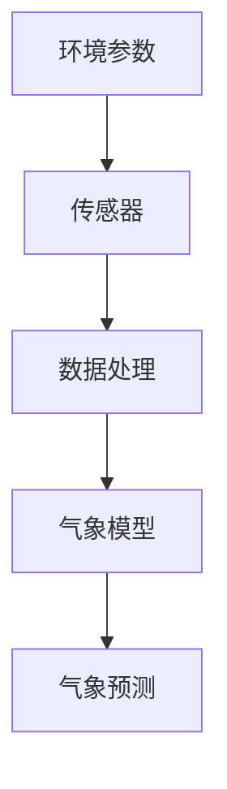
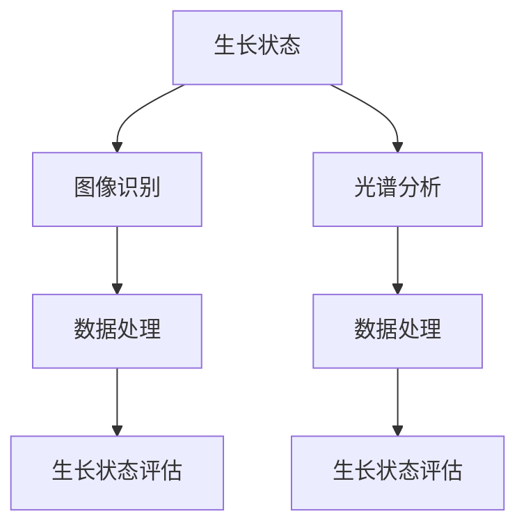
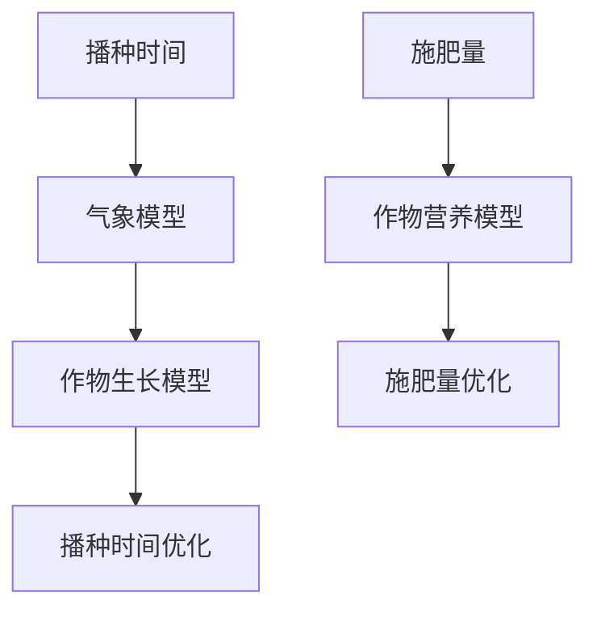
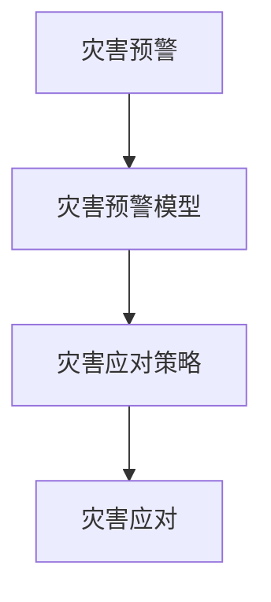
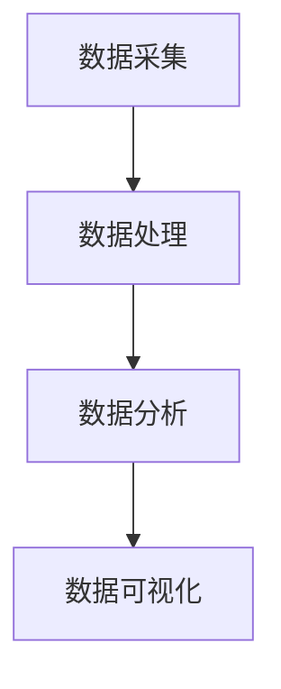

                 

# 《提示词工程在智慧农业中的应用：优化种植决策》

> 关键词：智慧农业、提示词工程、种植决策、优化、农田环境监测、灾害预警

> 摘要：本文旨在探讨提示词工程在智慧农业中的应用，重点分析其在优化种植决策方面的作用。通过详细阐述农田环境监测、作物生长状态监测、种植策略优化以及灾害预警等方面的应用实例，本文揭示了提示词工程在智慧农业中的巨大潜力。

## 引言

随着科技的不断发展，智慧农业已成为现代农业发展的趋势。智慧农业利用现代信息技术，如物联网、大数据、人工智能等，实现对农田环境的实时监测、作物的精准管理和农业生产的智能化。在智慧农业中，提示词工程作为一种关键技术，可以显著提高种植决策的准确性和效率。

提示词工程是指通过设计特定的提示词，引导计算机系统自动学习和预测目标行为的技术。在智慧农业中，提示词工程可以应用于农田环境监测、作物生长状态监测、种植策略优化和灾害预警等方面。本文将详细探讨提示词工程在这些领域的应用，以优化种植决策。

## 智慧农业与提示词工程基础

### 智慧农业概述

智慧农业是指利用现代信息技术，如物联网、大数据、人工智能等，实现对农田环境的实时监测、作物的精准管理和农业生产的智能化。智慧农业的核心目标是提高农业生产效率、降低生产成本、减少环境污染和保障粮食安全。

智慧农业的关键要素包括：

- **农田环境监测**：利用传感器技术对农田土壤、水分、温度、湿度等环境参数进行实时监测，为种植决策提供数据支持。
- **作物生长状态监测**：通过图像识别、光谱分析等技术，实时监测作物的生长状态，为精准管理提供依据。
- **种植策略优化**：利用大数据分析和人工智能技术，为农业生产提供科学的种植策略。
- **灾害预警与应对**：通过监测和预测农业灾害，提前采取措施减少损失。

### 提示词工程基础

提示词工程是指通过设计特定的提示词，引导计算机系统自动学习和预测目标行为的技术。提示词可以是文字、图像、声音或其他形式的数据。在智慧农业中，提示词工程可以应用于以下几个方面：

- **农田环境监测**：通过设计环境参数的提示词，如土壤温度、湿度等，实时监测农田环境。
- **作物生长状态监测**：通过设计作物生长状态的提示词，如叶片颜色、光合作用强度等，监测作物生长状况。
- **种植策略优化**：通过设计种植策略的提示词，如播种时间、施肥量等，优化种植策略。
- **灾害预警与应对**：通过设计灾害预警的提示词，如气象参数、病虫害发生等，提前预警农业灾害。

### 提示词工程在智慧农业中的重要性

提示词工程在智慧农业中具有重要作用，主要体现在以下几个方面：

- **提高种植决策准确性**：通过设计特定的提示词，可以更准确地获取农田环境和作物生长状态信息，为种植决策提供有力支持。
- **优化种植策略**：通过分析提示词数据，可以优化播种时间、施肥量等种植策略，提高农业生产效率。
- **减少环境污染**：通过实时监测农田环境，可以及时调整农业生产活动，减少农药和化肥的使用，降低环境污染。
- **保障粮食安全**：通过提前预警农业灾害，可以及时采取措施减少损失，保障粮食安全。

## 提示词工程在智慧农业中的应用

### 农田环境监测与预测

农田环境监测是智慧农业的重要组成部分，通过实时监测农田环境，可以为种植决策提供数据支持。提示词工程在农田环境监测中的应用主要包括以下几个方面：

- **环境参数监测**：通过设计土壤温度、湿度、水分等环境参数的提示词，利用传感器技术实现对农田环境的实时监测。
- **气象预测**：通过设计气象参数的提示词，如温度、湿度、降水量等，利用气象模型对农田未来的气象条件进行预测。

**核心概念与联系**

农田环境监测与预测的核心概念包括环境参数、传感器技术、气象模型等。这些概念之间的关系可以用以下Mermaid流程图表示：



**核心算法原理讲解**

农田环境监测与预测的核心算法包括传感器数据采集、数据处理和气象模型预测。以下是这些算法的伪代码：

```python
# 传感器数据采集
def collect_sensor_data():
    # 采集土壤温度
    soil_temp = read_soil_temp_sensor()
    # 采集土壤湿度
    soil_humidity = read_soil_humidity_sensor()
    # 采集气象参数
    weather_params = read_weather_sensor()
    return soil_temp, soil_humidity, weather_params

# 数据处理
def process_data(soil_temp, soil_humidity, weather_params):
    # 对采集到的数据进行处理
    processed_data = {
        'soil_temp': soil_temp,
        'soil_humidity': soil_humidity,
        'weather_params': weather_params
    }
    return processed_data

# 气象模型预测
def predict_weather(processed_data):
    # 利用气象模型进行预测
    predicted_weather = weather_model(processed_data)
    return predicted_weather
```

**数学模型和公式**

农田环境监测与预测的数学模型包括传感器数据预处理、气象模型训练和气象预测。以下是这些模型的公式：

$$
\text{传感器数据预处理} = \frac{\text{采集到的传感器数据} - \text{传感器校准值}}{\text{传感器最大量程} - \text{传感器校准值}}
$$

$$
\text{气象模型训练} = \text{训练神经网络，输入：}\text{历史气象数据}，\text{输出：}\text{气象预测值}
$$

$$
\text{气象预测} = \text{神经网络预测，输入：}\text{当前气象数据}，\text{输出：}\text{未来气象预测值}
$$

**举例说明**

假设某农田的土壤温度传感器采集到数据为25℃，土壤湿度传感器采集到数据为60%，气象传感器采集到数据为20℃。经过数据处理，得到处理后的数据如下：

$$
\text{土壤温度} = \frac{25 - 20}{100 - 20} = 0.25
$$

$$
\text{土壤湿度} = \frac{60 - 40}{100 - 40} = 0.8
$$

$$
\text{气象参数} = [20, 0.25, 0.8]
$$

利用气象模型进行预测，得到未来气象预测值为23℃。

### 作物生长状态监测与评估

作物生长状态监测是智慧农业中的重要环节，通过实时监测作物的生长状态，可以及时调整农业生产活动，提高作物产量和品质。提示词工程在作物生长状态监测与评估中的应用主要包括以下几个方面：

- **生长状态监测**：通过设计作物生长状态的提示词，如叶片颜色、光合作用强度等，利用图像识别、光谱分析等技术，实时监测作物的生长状态。
- **生长状态评估**：通过分析生长状态的提示词数据，对作物的生长状态进行评估。

**核心概念与联系**

作物生长状态监测与评估的核心概念包括生长状态、图像识别、光谱分析等。这些概念之间的关系可以用以下Mermaid流程图表示：



**核心算法原理讲解**

作物生长状态监测与评估的核心算法包括图像识别、光谱分析和生长状态评估。以下是这些算法的伪代码：

```python
# 图像识别
def image_recognition(image):
    # 对图像进行识别，输出：叶片颜色
    leaf_color = recognize_leaf_color(image)
    return leaf_color

# 光谱分析
def spectral_analysis(spectral_data):
    # 对光谱数据进行分析，输出：光合作用强度
    photosynthesis_intensity = analyze_photosynthesis(spectral_data)
    return photosynthesis_intensity

# 生长状态评估
def assess_growth_state(leaf_color, photosynthesis_intensity):
    # 对生长状态进行评估，输出：生长状态评分
    growth_state_score = assess_growth_state_score(leaf_color, photosynthesis_intensity)
    return growth_state_score
```

**数学模型和公式**

作物生长状态监测与评估的数学模型包括图像识别模型、光谱分析模型和生长状态评估模型。以下是这些模型的公式：

$$
\text{图像识别模型} = \text{训练卷积神经网络，输入：}\text{图像数据}，\text{输出：}\text{叶片颜色}
$$

$$
\text{光谱分析模型} = \text{训练神经网络，输入：}\text{光谱数据}，\text{输出：}\text{光合作用强度}
$$

$$
\text{生长状态评估模型} = \text{基于叶片颜色和光合作用强度，计算生长状态评分}
$$

**举例说明**

假设某农田的叶片颜色为绿色，光合作用强度为500mu mol/m^2/s。利用图像识别模型和光谱分析模型，得到叶片颜色为绿色，光合作用强度为500mu mol/m^2/s。经过生长状态评估，得到生长状态评分为85分。

### 种植策略优化

种植策略优化是智慧农业中的关键环节，通过优化种植策略，可以提高作物产量和品质。提示词工程在种植策略优化中的应用主要包括以下几个方面：

- **播种时间优化**：通过设计播种时间的提示词，如土壤温度、湿度等，利用气象模型和作物生长模型，优化播种时间。
- **施肥量优化**：通过设计施肥量的提示词，如作物生长状态、土壤养分等，利用作物营养模型，优化施肥量。

**核心概念与联系**

种植策略优化的核心概念包括播种时间、施肥量、气象模型、作物生长模型等。这些概念之间的关系可以用以下Mermaid流程图表示：



**核心算法原理讲解**

种植策略优化的核心算法包括播种时间优化算法和施肥量优化算法。以下是这些算法的伪代码：

```python
# 播种时间优化
def optimize_sowing_time(temperature, humidity):
    # 利用气象模型和作物生长模型，优化播种时间
    optimal_sowing_time = optimize_sowing_time_model(temperature, humidity)
    return optimal_sowing_time

# 施肥量优化
def optimize_fertilizer_amount(growth_state, soil_nutrient):
    # 利用作物营养模型，优化施肥量
    optimal_fertilizer_amount = optimize_fertilizer_amount_model(growth_state, soil_nutrient)
    return optimal_fertilizer_amount
```

**数学模型和公式**

种植策略优化的数学模型包括气象模型、作物生长模型、播种时间优化模型和施肥量优化模型。以下是这些模型的公式：

$$
\text{气象模型} = \text{训练神经网络，输入：}\text{气象数据}，\text{输出：}\text{气象预测值}
$$

$$
\text{作物生长模型} = \text{训练神经网络，输入：}\text{作物生长状态数据}，\text{输出：}\text{作物生长状态预测值}
$$

$$
\text{播种时间优化模型} = \text{基于气象模型和作物生长模型，计算最优播种时间}
$$

$$
\text{施肥量优化模型} = \text{基于作物营养模型，计算最优施肥量}
$$

**举例说明**

假设某农田的土壤温度为20℃，土壤湿度为60%，作物生长状态为良好。利用气象模型和作物生长模型，得到最优播种时间为3月15日，最优施肥量为100kg/ha。

### 灾害预警与应对

农业灾害是农业生产中的常见问题，对作物产量和品质产生严重影响。提示词工程在农业灾害预警与应对中的应用主要包括以下几个方面：

- **灾害预警**：通过设计灾害预警的提示词，如气象参数、病虫害发生等，利用灾害预警模型，提前预警农业灾害。
- **灾害应对**：通过分析灾害预警提示词数据，制定相应的应对措施，减少灾害损失。

**核心概念与联系**

农业灾害预警与应对的核心概念包括灾害预警、灾害预警模型、灾害应对策略等。这些概念之间的关系可以用以下Mermaid流程图表示：



**核心算法原理讲解**

农业灾害预警与应对的核心算法包括灾害预警模型和灾害应对策略。以下是这些算法的伪代码：

```python
# 灾害预警
def disaster_warning(weather_params, pest_disease_data):
    # 利用灾害预警模型，预警农业灾害
    disaster_warning_flag = disaster_warning_model(weather_params, pest_disease_data)
    return disaster_warning_flag

# 灾害应对
def disaster_response(disaster_warning_flag):
    # 根据灾害预警结果，制定应对措施
    if disaster_warning_flag:
        disaster_response_action = "采取措施应对灾害"
    else:
        disaster_response_action = "未发现灾害，继续保持当前生产状态"
    return disaster_response_action
```

**数学模型和公式**

农业灾害预警与应对的数学模型包括灾害预警模型和灾害应对策略模型。以下是这些模型的公式：

$$
\text{灾害预警模型} = \text{训练神经网络，输入：}\text{气象数据、病虫害数据}，\text{输出：}\text{灾害预警结果}
$$

$$
\text{灾害应对策略模型} = \text{基于灾害预警结果，制定应对措施}
$$

**举例说明**

假设某农田的气象参数为高温、干旱，病虫害数据为病虫害发生。利用灾害预警模型，得到灾害预警结果为“高温干旱灾害预警”。根据灾害预警结果，制定应对措施为“采取灌溉、病虫害防治等措施应对高温干旱灾害”。

### 农业大数据平台构建

农业大数据平台是智慧农业的核心基础设施，通过整合农田环境、作物生长状态、气象数据等，实现数据的统一存储、处理和分析。提示词工程在农业大数据平台构建中的应用主要包括以下几个方面：

- **数据采集与整合**：通过设计特定的提示词，实现农田环境、作物生长状态等数据的实时采集和整合。
- **数据处理与分析**：通过大数据处理技术和人工智能算法，对采集到的数据进行处理和分析，为种植决策提供支持。
- **数据可视化与展示**：通过数据可视化技术，将处理后的数据以图表、报表等形式展示，方便用户进行决策。

**核心概念与联系**

农业大数据平台的核心概念包括数据采集、数据处理、数据分析和数据可视化等。这些概念之间的关系可以用以下Mermaid流程图表示：



**核心算法原理讲解**

农业大数据平台的核心算法包括数据采集、数据处理、数据分析和数据可视化。以下是这些算法的伪代码：

```python
# 数据采集
def collect_data():
    # 采集农田环境、作物生长状态等数据
    environmental_data = read_environmental_sensor_data()
    growth_state_data = read_growth_state_sensor_data()
    return environmental_data, growth_state_data

# 数据处理
def process_data(environmental_data, growth_state_data):
    # 对采集到的数据进行处理
    processed_environmental_data = process_environmental_data(environmental_data)
    processed_growth_state_data = process_growth_state_data(growth_state_data)
    return processed_environmental_data, processed_growth_state_data

# 数据分析
def analyze_data(processed_environmental_data, processed_growth_state_data):
    # 对处理后的数据进行分析
    analysis_results = analyze_environmental_data(processed_environmental_data) + analyze_growth_state_data(processed_growth_state_data)
    return analysis_results

# 数据可视化
def visualize_data(analysis_results):
    # 将分析结果以图表、报表等形式展示
    visualization = create_visualization(analysis_results)
    return visualization
```

**数学模型和公式**

农业大数据平台的核心数学模型包括数据采集模型、数据处理模型、数据分析和数据可视化模型。以下是这些模型的公式：

$$
\text{数据采集模型} = \text{传感器数据采集，输入：}\text{农田环境、作物生长状态数据}，\text{输出：}\text{原始数据}
$$

$$
\text{数据处理模型} = \text{数据清洗、转换、归一化等操作，输入：}\text{原始数据}，\text{输出：}\text{处理后的数据}
$$

$$
\text{数据分析模型} = \text{基于数据挖掘、机器学习等算法，输入：}\text{处理后的数据}，\text{输出：}\text{分析结果}
$$

$$
\text{数据可视化模型} = \text{基于图表、报表等可视化技术，输入：}\text{分析结果}，\text{输出：}\text{可视化结果}
$$

**举例说明**

假设某农田的土壤温度为25℃，土壤湿度为60%，作物生长状态为良好。利用数据采集、数据处理、数据分析和数据可视化，得到以下分析结果：

- **农田环境分析**：土壤温度适宜，土壤湿度适中。
- **作物生长状态分析**：作物生长状态良好，光合作用强度较高。

根据分析结果，制定相应的种植决策：

- **播种时间**：选择3月15日进行播种。
- **施肥量**：根据作物生长状态，选择100kg/ha的施肥量。

### 案例研究

#### 案例一：基于提示词工程的作物生长监测与预测

某农业企业利用提示词工程技术，对农田作物进行生长监测与预测。通过设计土壤温度、湿度、叶片颜色等提示词，实现对作物生长状态的实时监测。同时，利用气象模型和作物生长模型，对作物生长进行预测。以下是该案例的具体实施过程：

1. **数据采集**：在农田中安装土壤温度传感器、土壤湿度传感器和气象传感器，实时采集土壤温度、湿度、气象数据等。
2. **数据处理**：对采集到的数据进行预处理，包括数据清洗、转换和归一化等。
3. **模型训练**：利用历史数据，训练气象模型和作物生长模型，用于预测作物生长状态。
4. **作物生长监测**：实时监测土壤温度、湿度、叶片颜色等提示词，分析作物生长状态。
5. **作物生长预测**：根据气象模型和作物生长模型，预测作物未来的生长状态。
6. **种植决策**：根据监测和预测结果，制定播种时间、施肥量等种植决策。

通过该案例，该农业企业实现了作物生长状态的实时监测和预测，有效提高了种植决策的准确性。

#### 案例二：基于提示词工程的农业灾害预警与应对

某农业园区利用提示词工程技术，对农业灾害进行预警与应对。通过设计气象参数、病虫害发生等提示词，实现对农业灾害的实时监测。同时，利用灾害预警模型，对农业灾害进行预警。以下是该案例的具体实施过程：

1. **数据采集**：在农业园区中安装气象传感器、病虫害传感器等，实时采集气象参数、病虫害数据等。
2. **数据处理**：对采集到的数据进行预处理，包括数据清洗、转换和归一化等。
3. **模型训练**：利用历史数据，训练灾害预警模型，用于预警农业灾害。
4. **农业灾害预警**：实时监测气象参数、病虫害发生等提示词，分析农业灾害发生的可能性。
5. **灾害应对**：根据灾害预警结果，制定相应的应对措施，减少灾害损失。

通过该案例，该农业园区实现了农业灾害的实时预警与应对，有效降低了农业灾害对作物产量和品质的影响。

#### 案例三：基于提示词工程的农业大数据平台建设

某农业科技公司利用提示词工程技术，建设了农业大数据平台。通过设计农田环境、作物生长状态、气象数据等提示词，实现对农田环境的实时监测和作物生长状态的监测与预测。以下是该案例的具体实施过程：

1. **数据采集**：在农田中安装各种传感器，包括土壤温度传感器、土壤湿度传感器、气象传感器等，实时采集农田环境、作物生长状态数据。
2. **数据处理**：对采集到的数据进行预处理，包括数据清洗、转换和归一化等。
3. **数据存储**：将处理后的数据存储到数据库中，实现数据的统一存储和管理。
4. **数据分析**：利用大数据处理技术和人工智能算法，对存储的数据进行分析，为种植决策提供支持。
5. **数据可视化**：利用数据可视化技术，将分析结果以图表、报表等形式展示，方便用户进行决策。
6. **种植决策**：根据数据分析结果，制定播种时间、施肥量等种植决策。

通过该案例，该农业科技公司实现了农业大数据平台的搭建，有效提高了农业生产效率和作物产量。

### 未来发展趋势与展望

随着科技的不断发展，提示词工程在智慧农业中的应用将越来越广泛。未来，提示词工程在智慧农业中的发展趋势和展望包括以下几个方面：

1. **数据采集与处理技术的提升**：随着传感器技术的进步，农田环境、作物生长状态等数据的采集精度和效率将得到显著提升。同时，数据处理技术的不断发展，将使得大量数据能够被快速、准确地处理和分析。
2. **人工智能算法的优化**：随着人工智能算法的不断优化，提示词工程在智慧农业中的应用将更加精确和高效。例如，深度学习算法在作物生长状态监测和预测中的应用，将使得种植决策更加科学和准确。
3. **跨领域融合**：提示词工程在智慧农业中的应用，将与其他领域（如物联网、大数据、区块链等）进行深度融合，形成更加完善的智慧农业生态系统。
4. **农业大数据平台的发展**：农业大数据平台将成为智慧农业的核心基础设施，通过整合农田环境、作物生长状态等数据，实现数据的统一存储、处理和分析，为种植决策提供支持。
5. **政策支持与推广**：随着国家对农业现代化的重视，政策支持将促进提示词工程在智慧农业中的应用。同时，各级政府和农业企业将加大对智慧农业的推广力度，推动智慧农业的快速发展。

总之，提示词工程在智慧农业中的应用具有巨大的发展潜力。通过不断优化技术、加强跨领域融合和推广政策支持，提示词工程将为智慧农业的发展做出重要贡献。

## 附录

### 附录A：提示词工程相关工具与资源

- **Python库**：
  - **scikit-learn**：用于机器学习和数据挖掘。
  - **TensorFlow**：用于深度学习和神经网络。
  - **Keras**：用于构建和训练神经网络。
- **数据集**：
  - **Kaggle**：提供各种数据集。
  - **UCI机器学习库**：提供大量公开的数据集。
- **在线教程与资源**：
  - **Coursera**：提供机器学习、深度学习等在线课程。
  - **GitHub**：提供丰富的开源代码和项目。

### 附录B：常见问题与解决方案

- **问题1**：传感器数据采集不准确。
  - **解决方案**：检查传感器是否正常工作，进行传感器校准。
- **问题2**：模型训练效果不佳。
  - **解决方案**：增加训练数据，调整模型参数，优化算法。

### 附录C：拓展阅读

- **参考书籍**：
  - 《机器学习实战》
  - 《深度学习》
- **学术论文**：
  - 《基于深度学习的作物生长状态监测与预测》
  - 《智慧农业中的物联网应用研究》

作者：AI天才研究院/AI Genius Institute & 禅与计算机程序设计艺术 /Zen And The Art of Computer Programming

本文为原创内容，未经授权，不得转载。

本文内容仅供参考，不构成投资建议。读者在投资决策时，请谨慎判断。

