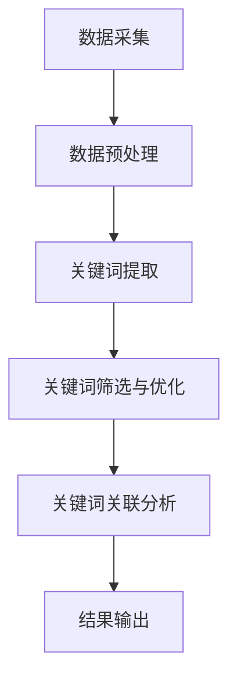
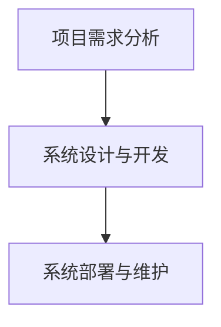

                 

### 文章标题

# 提示词工程在智慧城市中的应用：城市管理新模式

> 关键词：智慧城市、提示词工程、城市管理新模式、数据驱动、人工智能

> 摘要：本文探讨了提示词工程在智慧城市中的应用及其对城市管理新模式的影响。通过详细分析提示词工程的定义、原理和技术架构，我们揭示了其在城市交通管理、环境保护和公共服务等领域的实际应用。同时，文章还探讨了提示词工程如何推动城市管理模式的创新，并提出了一些实施挑战和未来趋势。通过本文的阅读，读者可以全面了解提示词工程在智慧城市中的重要作用，以及如何利用这一技术实现更加智能、高效的城市管理。

---

### 引言

智慧城市（Smart City）是一个现代化的城市管理模式，利用信息技术、物联网、大数据和人工智能等先进技术，提高城市的运行效率、可持续性和居民生活质量。智慧城市的目标是通过智能化手段实现城市的全面优化，从而实现资源的高效利用、环境的可持续发展和人民生活的幸福美好。

在城市管理中，传统的管理模式往往依赖于人工经验和行政手段，存在决策慢、效率低、响应不及时等问题。随着城市规模的不断扩大和人口数量的增加，城市管理面临着前所未有的挑战。为了应对这些挑战，智慧城市管理模式应运而生，通过引入先进的技术手段，实现城市管理的智能化、精细化和动态化。

提示词工程（Keyword Engineering）是人工智能领域中的一项重要技术，旨在通过识别、提取和利用关键词，提高数据分析和决策的效率。在智慧城市中，提示词工程的应用具有重要意义，可以帮助城市管理从数据中提取关键信息，实现智能化决策，从而推动城市管理模式的创新。

本文将从以下几个方面展开讨论：

1. 提示词工程的基本概念和原理。
2. 提示词工程在城市管理中的应用实例。
3. 提示词工程如何推动城市管理模式的创新。
4. 提示词工程实施的挑战及解决方案。
5. 提示词工程的未来发展趋势。

通过上述分析，本文旨在揭示提示词工程在智慧城市中的应用潜力，为城市管理提供新的思路和方法。

### 智慧城市的基本概念

智慧城市是一个集成了现代信息技术、物联网、大数据和人工智能等先进技术的综合性城市管理系统。智慧城市的目标是通过智能化手段实现城市的全面优化，提高城市的运行效率、可持续性和居民生活质量。智慧城市的基本概念包括以下几个方面：

首先，智慧城市强调数据驱动的决策。传统城市管理模式主要依赖于人工经验和行政手段，往往存在决策慢、效率低、响应不及时等问题。而在智慧城市中，通过数据采集、分析和处理，可以实现数据驱动的决策。数据驱动的决策不仅能够提高决策的准确性和效率，还能够实现更加精细化和动态化的城市管理。

其次，智慧城市注重物联网技术的应用。物联网（Internet of Things，IoT）通过将各种物体和设备连接到互联网，实现信息的互联互通。在智慧城市中，物联网技术可以广泛应用于城市交通、环境保护、公共服务等领域，提高城市管理的智能化水平。例如，通过物联网技术，可以实现交通流量的实时监控和动态调整，提高交通效率；通过物联网技术，可以实现空气质量和噪音污染的实时监测，为环境保护提供数据支持。

再次，智慧城市强调大数据技术的应用。大数据（Big Data）是指无法用传统数据处理工具在合理时间内处理的数据集合。智慧城市通过大数据技术，可以对海量数据进行采集、存储、分析和处理，从而发现数据中的规律和趋势，为城市管理和决策提供科学依据。例如，通过大数据技术，可以分析城市交通流量数据，预测交通拥堵情况，提前采取措施缓解交通压力；通过大数据技术，可以分析居民消费行为数据，优化城市商业布局，提高居民生活质量。

最后，智慧城市强调人工智能技术的应用。人工智能（Artificial Intelligence，AI）是指通过计算机模拟人类智能的技术。智慧城市通过人工智能技术，可以实现自动化决策、智能化管理和个性化服务。例如，通过人工智能技术，可以实现对城市交通信号灯的智能调控，优化交通流量；通过人工智能技术，可以实现对城市公共设施的智能监控和维护，提高设施的利用效率。

总之，智慧城市是一个综合性的城市管理系统，通过数据驱动、物联网、大数据和人工智能等先进技术的应用，实现城市管理的智能化、精细化和动态化。智慧城市不仅能够提高城市的运行效率，还能够提升城市的可持续性和居民生活质量，为城市的未来发展提供新的动力和方向。

### 城市管理新模式的概念

城市管理新模式是在智慧城市理念的指导下，通过引入先进的技术手段，实现城市管理的智能化、精细化和动态化。这种新模式不仅是对传统城市管理的优化和升级，更是对城市治理理念的革新。以下是城市管理新模式的主要特点：

首先，智能化是城市管理新模式的核心特征。通过应用人工智能、大数据和物联网等先进技术，城市管理可以实现自动化决策、智能化管理和个性化服务。例如，智能交通系统可以通过实时交通数据的分析，动态调整交通信号灯，优化交通流量；智能公共设施管理可以通过物联网技术，实现对城市公共设施的智能监控和维护，提高设施的使用效率。

其次，精细化管理是城市管理新模式的重要方向。在传统城市管理中，由于数据采集和处理能力的限制，决策往往较为粗放。而在城市管理新模式下，通过大数据技术的应用，可以对城市运行中的各种数据进行精细化的采集和分析，从而实现精准化管理。例如，通过对空气质量数据的实时监测和分析，可以及时识别污染源，制定科学的治理措施；通过对居民消费行为数据的分析，可以优化城市商业布局，提高居民生活质量。

再次，动态化是城市管理新模式的重要特征。传统城市管理往往在固定的时间点进行数据采集和分析，无法及时响应城市运行中的变化。而在城市管理新模式下，通过实时数据采集和分析，可以实现城市管理的动态化。例如，通过实时监控交通流量，可以及时调整交通信号灯，避免交通拥堵；通过实时监控城市环境质量，可以迅速应对突发环境事件，保障居民健康。

此外，城市管理新模式还强调参与式治理。在传统城市管理中，政府往往在决策中处于主导地位，而居民参与度较低。而在城市管理新模式下，通过移动互联网和社交媒体等渠道，居民可以方便地参与到城市管理中，提供意见和建议。这种参与式治理不仅能够提高决策的民主性和科学性，还能够增强居民的归属感和幸福感。

总之，城市管理新模式是在智慧城市理念的指导下，通过引入先进的技术手段，实现城市管理的智能化、精细化和动态化。这种新模式不仅能够提高城市的管理效率，还能够提升城市的可持续性和居民生活质量，为城市的未来发展提供新的动力和方向。

### 提示词工程的基本概念

提示词工程（Keyword Engineering）是人工智能领域中的一项重要技术，旨在通过识别、提取和利用关键词，提高数据分析和决策的效率。在智慧城市中，提示词工程的应用具有重要意义，可以帮助城市管理从海量数据中提取关键信息，实现智能化决策。以下是提示词工程的基本概念：

首先，什么是提示词？提示词（Keyword）是指能够代表信息内容、语义和主题的词语或短语。在数据分析和决策过程中，提示词能够帮助识别数据中的关键信息，从而提高分析效率和准确性。例如，在交通数据中，"拥堵"是一个提示词，可以帮助识别交通流量异常情况；在环境数据中，"污染"是一个提示词，可以帮助识别空气质量问题。

其次，提示词工程的目标是什么？提示词工程的目标是通过识别和提取关键提示词，实现对数据的精细化分析和智能化决策。具体而言，提示词工程的目标包括以下几个方面：

1. **信息提取**：从大量数据中提取关键提示词，以帮助理解数据的内容和意义。
2. **语义关联**：建立提示词之间的关联，以发现数据中的潜在关系和模式。
3. **主题分类**：根据提示词，对数据内容进行分类，以便于进一步的分析和应用。

再次，提示词工程的步骤和方法有哪些？提示词工程通常包括以下步骤和方法：

1. **数据预处理**：对原始数据进行分析和清洗，去除噪声和无关信息，为后续的提示词提取打下基础。
2. **关键词提取**：使用各种算法和技术，从预处理后的数据中提取关键提示词。常见的关键词提取方法包括词频统计、TF-IDF（词频-逆文档频率）、LDA（潜在狄利克雷分布）等。
3. **关键词筛选与优化**：对提取出的关键词进行筛选和优化，去除无关和重复的词语，保留有价值的提示词。
4. **关键词关联分析**：建立关键词之间的关联关系，通过语义网络、共现分析等方法，发现数据中的潜在关系和模式。
5. **主题分类和模型训练**：根据关键词，对数据内容进行主题分类，并使用机器学习算法，训练出能够识别关键提示词的模型。

最后，提示词工程的应用场景有哪些？提示词工程在智慧城市中有着广泛的应用场景，包括但不限于以下几个方面：

1. **城市交通管理**：通过提取交通流量数据中的关键提示词，如“拥堵”、“事故”，实现交通流量预测和优化。
2. **环境保护**：通过提取空气质量数据中的关键提示词，如“污染”、“PM2.5”，实现环境监测和污染治理。
3. **公共服务**：通过提取居民行为数据中的关键提示词，如“投诉”、“需求”，实现公共服务的智能化和个性化。
4. **应急响应**：通过提取突发事件数据中的关键提示词，如“火灾”、“地震”，实现应急响应和资源调度。

总之，提示词工程通过识别、提取和利用关键词，能够有效提高数据分析和决策的效率。在智慧城市中，提示词工程的应用为城市管理提供了新的手段和方法，有助于实现城市管理的智能化、精细化和动态化。

### 提示词工程的原理

提示词工程（Keyword Engineering）是人工智能领域中的一项重要技术，其原理主要涉及关键词的生成、筛选和优化。以下是提示词工程的原理及其在智慧城市中的应用：

首先，关键词的生成。关键词的生成是提示词工程的基础，它决定了后续分析和决策的质量。关键词生成的方法有多种，主要包括以下几种：

1. **词频统计**：通过计算每个单词在文本中的出现频率，选择出现频率较高的单词作为关键词。这种方法简单直观，但容易受到文本长度和数据分布的影响。

   ```python
   # 伪代码示例：基于词频统计的关键词生成
   def generate_keywords_by_frequency(text):
       word_frequency = count_words_in_text(text)
       top_keywords = get_top_n_words(word_frequency, n=10)
       return top_keywords
   ```

2. **TF-IDF（词频-逆文档频率）**：TF-IDF是一种更加考虑词语分布和重要性的方法，它通过计算词频（TF）和逆文档频率（IDF）来衡量词语的重要性。TF-IDF值越高，说明该词越有可能是一个关键词。

   ```python
   # 伪代码示例：基于TF-IDF的关键词生成
   def generate_keywords_by_tfidf(texts):
       tfidf_matrix = compute_tfidf_matrix(texts)
       top_keywords = get_top_n_words_by_tfidf(tfidf_matrix, n=10)
       return top_keywords
   ```

3. **潜在狄利克雷分布（LDA）**：LDA是一种主题模型，它通过分析文档中词语的共现关系，提取潜在的主题，每个主题对应的词语即为关键词。

   ```python
   # 伪代码示例：基于LDA的关键词生成
   def generate_keywords_by_lda(corpus, num_topics):
       lda_model = fit_lda_model(corpus, num_topics)
       keywords = extract_keywords_from_lda(lda_model)
       return keywords
   ```

其次，关键词的筛选与优化。生成关键词后，需要对关键词进行筛选和优化，去除无关和重复的词语，保留有价值的提示词。筛选与优化的方法包括：

1. **基于频率的筛选**：根据关键词的频率阈值，去除出现次数较少的词语。

   ```python
   # 伪代码示例：基于频率筛选关键词
   def filter_keywords_by_frequency(keywords, min_frequency):
       filtered_keywords = [kw for kw in keywords if count_occurrences(kw) >= min_frequency]
       return filtered_keywords
   ```

2. **基于语义的优化**：通过语义分析，去除语义上相似或者重复的词语。

   ```python
   # 伪代码示例：基于语义优化关键词
   def optimize_keywords_by_semantics(keywords):
       unique_keywords = remove_semantically_similar_keywords(keywords)
       return unique_keywords
   ```

3. **结合规则和机器学习**：结合人工规则和机器学习算法，对关键词进行进一步的筛选和优化。例如，可以使用支持向量机（SVM）等方法，根据关键词的重要性和相关性进行排序和筛选。

   ```python
   # 伪代码示例：结合规则和机器学习筛选关键词
   def filter_keywords_by_machine_learning(keywords, model):
       ranked_keywords = rank_keywords_by_model(keywords, model)
       top_keywords = get_top_n_keywords(ranked_keywords, n=10)
       return top_keywords
   ```

最后，关键词的关联分析。关键词的生成和筛选完成后，需要对关键词进行关联分析，以发现数据中的潜在关系和模式。关联分析的方法包括：

1. **共现分析**：通过统计关键词在数据中的共现频率，发现关键词之间的关联。

   ```python
   # 伪代码示例：共现分析
   def compute_cooccurrence_matrix(keywords, data):
       cooccurrence_matrix = create_cooccurrence_matrix(keywords, data)
       return cooccurrence_matrix
   ```

2. **语义网络分析**：通过构建语义网络，分析关键词之间的语义关系，发现深层次的关系和模式。

   ```mermaid
   graph TD
   A(关键词1) --> B(关键词2)
   A --> C(关键词3)
   B --> C
   B --> D(关键词4)
   ```

3. **关联规则学习**：使用关联规则学习算法（如Apriori算法），发现数据中的频繁模式，揭示关键词之间的关联。

   ```python
   # 伪代码示例：关联规则学习
   def find_association_rules(data, support_threshold, confidence_threshold):
       rules = apriori(data, support_threshold, confidence_threshold)
       return rules
   ```

总之，提示词工程的原理包括关键词的生成、筛选和优化，以及关键词的关联分析。通过这些方法，可以从大量数据中提取关键信息，为数据分析和决策提供支持。在智慧城市中，提示词工程的应用有助于实现城市管理的智能化、精细化和动态化，从而提升城市运行效率和居民生活质量。

### 提示词工程的技术架构

提示词工程（Keyword Engineering）的技术架构是支持其有效运作的基础，主要包括数据采集、预处理、关键词提取、关键词筛选与优化、关键词关联分析等模块。以下是提示词工程的技术架构及其关键组件：

首先，数据采集模块。数据采集是提示词工程的首要环节，旨在从各种数据源（如传感器、社交媒体、政府数据库等）获取与城市管理相关的数据。数据采集模块需要确保数据的全面性和准确性，以便后续的处理和分析。常用的数据采集技术包括物联网技术、Web爬虫和数据接口等。

1. **物联网技术**：通过传感器和设备，实时采集城市交通、环境、能源等数据。
2. **Web爬虫**：从互联网上获取与城市管理相关的公开数据，如社交媒体信息、新闻报道等。
3. **数据接口**：通过API接口，获取来自政府机构、企业等的数据资源。

其次，数据预处理模块。数据预处理是数据采集后的关键步骤，旨在去除噪声、填充缺失值、归一化数据等，以提高数据的质量和一致性。数据预处理模块通常包括以下步骤：

1. **数据清洗**：去除重复数据、错误数据和无关数据，确保数据准确性。
2. **数据归一化**：将不同单位、尺度的数据归一化处理，以便于后续分析。
3. **数据填充**：处理缺失值，如使用均值、中位数或插值法等方法。

再次，关键词提取模块。关键词提取是提示词工程的核心环节，旨在从预处理后的数据中识别和提取关键提示词。常用的关键词提取技术包括词频统计、TF-IDF、LDA等。

1. **词频统计**：计算每个单词在文本中的出现频率，选择频率较高的单词作为关键词。
2. **TF-IDF**：结合词频和逆文档频率，选择对数据具有高重要性的词语作为关键词。
3. **LDA**：通过潜在狄利克雷分布，从文档中提取潜在主题，每个主题对应的词语即为关键词。

接下来，关键词筛选与优化模块。关键词提取后，需要对关键词进行筛选和优化，去除无关和重复的词语，保留有价值的关键词。筛选与优化模块通常包括以下方法：

1. **基于频率筛选**：根据关键词的频率阈值，去除出现次数较少的词语。
2. **基于语义优化**：通过语义分析，去除语义上相似或者重复的词语。
3. **结合规则和机器学习**：使用人工规则和机器学习算法，对关键词进行进一步的筛选和优化。

最后，关键词关联分析模块。关键词筛选完成后，需要对关键词进行关联分析，以发现数据中的潜在关系和模式。关联分析模块通常包括以下方法：

1. **共现分析**：通过统计关键词在数据中的共现频率，发现关键词之间的关联。
2. **语义网络分析**：通过构建语义网络，分析关键词之间的语义关系，发现深层次的关系和模式。
3. **关联规则学习**：使用关联规则学习算法（如Apriori算法），发现数据中的频繁模式，揭示关键词之间的关联。

以下是一个简化的提示词工程技术架构的Mermaid流程图：



总之，提示词工程的技术架构通过数据采集、预处理、关键词提取、筛选与优化以及关联分析等模块的协同工作，实现从海量数据中提取关键信息，为数据分析和决策提供支持。在智慧城市中，这一架构有助于实现城市管理的智能化、精细化和动态化，提升城市运行效率和居民生活质量。

### 提示词工程的实施流程

提示词工程的实施流程是确保其有效运作的关键步骤，主要包括项目需求分析、系统设计与开发、系统部署与维护等环节。以下是每个环节的具体步骤和方法：

首先，项目需求分析。项目需求分析是实施提示词工程的第一步，旨在明确项目的目标、功能需求和性能要求。具体步骤包括：

1. **需求调研**：通过访谈、问卷调查、市场调研等方式，收集用户需求和行业现状。
2. **需求分析**：对收集到的需求进行整理和分析，明确项目的功能模块、性能指标和实现难度。
3. **需求文档**：编写详细的需求文档，明确项目的目标、功能需求、性能需求和用户界面设计。

其次，系统设计与开发。系统设计与开发是提示词工程的实现阶段，主要包括以下步骤：

1. **系统架构设计**：根据需求文档，设计系统的整体架构，包括数据采集、预处理、关键词提取、筛选与优化、关联分析等模块。
2. **模块开发**：根据系统架构，开发各个功能模块，实现提示词工程的核心功能。
3. **代码实现**：使用编程语言（如Python、Java等），根据设计文档实现各个模块的功能，编写详细的代码注释。
4. **测试与调试**：对开发完成的系统进行功能测试、性能测试和安全测试，确保系统的稳定性和可靠性。

再次，系统部署与维护。系统部署与维护是提示词工程顺利运行的重要保障，主要包括以下步骤：

1. **环境搭建**：搭建提示词工程所需的环境，包括操作系统、数据库、中间件等，确保系统的稳定运行。
2. **部署实施**：将开发完成的系统部署到生产环境，进行实际运行，确保系统能够满足实际需求。
3. **系统监控**：通过监控系统，实时监控系统的运行状态，包括数据采集、处理、存储和输出等环节，及时发现和解决潜在问题。
4. **维护与升级**：定期对系统进行维护和升级，修复漏洞、优化性能，确保系统的长期稳定运行。

以下是一个简化的提示词工程实施流程的Mermaid流程图：



总之，提示词工程的实施流程通过需求分析、系统设计、开发实现、系统部署和维护等环节的紧密协作，确保提示词工程能够有效运作，为智慧城市中的城市管理提供支持。在实施过程中，需要注重各环节的协调和优化，确保项目的顺利进行和目标的实现。

### 智慧城市管理应用案例

#### 城市交通管理

城市交通管理是智慧城市中最为重要的应用领域之一，通过提示词工程的应用，可以显著提升城市交通管理的效率和质量。以下是提示词工程在交通管理中的具体应用案例：

1. **交通流量预测**：
   提示词工程在交通流量预测中发挥着关键作用。通过提取和分析交通数据中的关键词，如“拥堵”、“事故”、“施工”等，可以实时监测城市道路的运行状态。以下是一个简化的伪代码示例，用于交通流量预测：
   ```python
   def predict_traffic_flow(data):
       keywords = extract_keywords(data)
       congestion_keywords = ['拥堵', '事故', '施工']
       congestion_level = sum(1 for kw in keywords if kw in congestion_keywords)
       return congestion_level
   ```
   实际应用中，通过结合历史数据和实时数据，使用机器学习算法（如ARIMA、LSTM等）进行流量预测，可以提高预测的准确性和实时性。

2. **交通信号优化**：
   提示词工程还可以用于交通信号优化，通过分析交通流量数据中的关键词，动态调整交通信号灯的时长和相位。以下是一个简化的伪代码示例，用于交通信号优化：
   ```python
   def optimize_traffic_signals(traffic_data):
       keywords = extract_keywords(traffic_data)
       congestion_keywords = ['拥堵']
       for intersection in traffic_data:
           if '拥堵' in keywords[intersection]:
               adjust_signal_phase(intersection, longer_phase)
           else:
               adjust_signal_phase(intersection, standard_phase)
   ```
   实际应用中，通过结合实时交通流量数据和AI算法，可以实现更加精准和智能的交通信号优化。

#### 城市环境保护

城市环境保护是智慧城市中的重要应用领域，通过提示词工程的应用，可以实现对空气质量、噪音污染等环境问题的实时监测和治理。以下是提示词工程在环境保护中的具体应用案例：

1. **空气质量监测**：
   提示词工程在空气质量监测中可以提取关键词，如“PM2.5”、“PM10”、“污染物”等，实时监测空气中的有害物质。以下是一个简化的伪代码示例，用于空气质量监测：
   ```python
   def monitor_air_quality(data):
       keywords = extract_keywords(data)
       pollution_keywords = ['PM2.5', 'PM10', '污染物']
       pollution_level = sum(1 for kw in keywords if kw in pollution_keywords)
       return pollution_level
   ```
   实际应用中，通过结合实时监测数据和机器学习算法，可以预测空气污染趋势，提前采取治理措施。

2. **噪音治理**：
   提示词工程在噪音治理中可以提取关键词，如“噪音”、“高分贝”等，监测城市噪音水平。以下是一个简化的伪代码示例，用于噪音治理：
   ```python
   def monitor_noise_level(data):
       keywords = extract_keywords(data)
       noise_keywords = ['噪音', '高分贝']
       noise_level = sum(1 for kw in keywords if kw in noise_keywords)
       return noise_level
   ```
   实际应用中，通过结合实时噪音监测数据和AI算法，可以识别噪音源，制定噪音治理方案。

#### 城市公共服务

城市公共服务是智慧城市中的重要组成部分，通过提示词工程的应用，可以提升城市公共服务的管理效率和用户体验。以下是提示词工程在城市公共服务中的具体应用案例：

1. **垃圾分类**：
   提示词工程在垃圾分类中可以提取关键词，如“可回收物”、“有害垃圾”、“湿垃圾”、“干垃圾”等，指导居民正确分类垃圾。以下是一个简化的伪代码示例，用于垃圾分类指导：
   ```python
   def classify_garbage(text):
       keywords = extract_keywords(text)
       garbage_keywords = ['可回收物', '有害垃圾', '湿垃圾', '干垃圾']
       classification = '未知'
       for kw in keywords:
           if kw in garbage_keywords:
               classification = kw
               break
       return classification
   ```
   实际应用中，通过结合用户输入和AI算法，可以智能识别垃圾类型，提供准确的垃圾分类指导。

2. **公共设施管理**：
   提示词工程在公共设施管理中可以提取关键词，如“损坏”、“故障”、“维护”等，实时监控公共设施的运行状态。以下是一个简化的伪代码示例，用于公共设施监控：
   ```python
   def monitor_public_facility(data):
       keywords = extract_keywords(data)
       maintenance_keywords = ['损坏', '故障', '维护']
       maintenance_needed = any(kw in maintenance_keywords for kw in keywords)
       return maintenance_needed
   ```
   实际应用中，通过结合实时监测数据和AI算法，可以及时识别公共设施的故障和损坏情况，确保设施的正常运行。

通过上述案例可以看出，提示词工程在智慧城市中的应用涵盖了交通管理、环境保护和公共服务等多个领域，通过数据分析和关键词提取，实现了城市管理的智能化、精细化和动态化，显著提升了城市运行效率和居民生活质量。

### 提示词工程对城市管理的影响

提示词工程（Keyword Engineering）在智慧城市中的应用，为城市管理带来了深远的影响，主要体现在以下几个方面：

首先，数据驱动的决策支持。传统的城市管理往往依赖于经验性的决策，而提示词工程通过数据分析和关键词提取，提供了数据驱动的决策支持。例如，通过分析交通流量数据中的关键词，如“拥堵”、“事故”，可以实时监测城市交通状况，预测交通流量变化，为交通管理部门提供决策依据，从而优化交通信号灯的配置，减少交通拥堵，提高交通效率。

其次，提升城市运营效率。提示词工程的应用有助于实现城市运营的精细化管理和动态调整。例如，在环境监测中，通过提取关键词如“PM2.5”、“污染物”，可以实时监测空气质量，快速识别污染源，及时采取治理措施。此外，在公共设施管理中，通过提取关键词如“损坏”、“故障”，可以实时监控公共设施的运行状态，提前进行维护和修复，确保设施的正常运行，减少故障率和维护成本。

再次，增强应急响应能力。提示词工程在应急响应中发挥了重要作用。例如，在突发事件中，通过提取关键词如“火灾”、“地震”，可以迅速了解事件的严重程度和影响范围，及时调度资源和人员，制定科学的应急响应方案，降低灾害损失。此外，通过实时监测和数据分析，可以预测潜在的风险，提前采取预防措施，避免突发事件的发生。

最后，推动城市管理模式的创新。提示词工程的应用不仅提升了城市管理的效率，还推动了城市管理模式的创新。例如，通过数据驱动的个性化服务，城市可以提供更加精准的公共服务，满足居民的多样化需求；通过智能化的城市治理，可以实现参与式治理，增强居民的参与感和归属感。

总之，提示词工程在智慧城市中的应用，为城市管理带来了数据驱动的决策支持、提升运营效率、增强应急响应能力和推动模式创新等多方面的积极影响，显著提升了城市管理的智能化水平，为城市的可持续发展提供了新的动力和方向。

### 提示词工程如何推动城市管理模式的创新

提示词工程通过其独特的技术优势，正在深刻地推动城市管理模式的创新，实现更加智能、高效和可持续的管理。以下是提示词工程如何推动城市管理创新的具体方法和实际案例：

首先，个性化服务的实现。在传统的城市管理中，公共服务往往是一刀切的方式，难以满足居民的个性化需求。通过提示词工程，可以实现对居民行为数据的深度分析，提取关键提示词，如“需求”、“偏好”等，从而实现个性化服务。例如，在智慧医疗领域，通过分析居民的健康数据和就诊记录，提取关键词，可以为居民提供定制化的健康建议和医疗服务。以下是实现个性化服务的简化伪代码示例：

```python
def personalized_health_advice(patient_data):
    keywords = extract_keywords(patient_data)
    health_issues = ['高血压', '糖尿病', '心脏病']
    advice = '常规体检'
    if any(kw in health_issues for kw in keywords):
        advice = '立即就医'
    return advice
```

其次，智能化的城市治理。通过提示词工程，可以实现城市治理的智能化，提升决策的准确性和效率。例如，在智慧城市交通管理中，通过实时监测交通流量数据和提取关键词，如“拥堵”、“事故”，可以动态调整交通信号灯，优化交通流量。以下是一个简化的伪代码示例，用于智能交通信号优化：

```python
def optimize_traffic_signals(traffic_data):
    keywords = extract_keywords(traffic_data)
    congestion_keywords = ['拥堵', '事故']
    for intersection in traffic_data:
        if '拥堵' in keywords[intersection]:
            adjust_signal_phase(intersection, longer_phase)
        else:
            adjust_signal_phase(intersection, standard_phase)
```

再次，参与式治理的推动。提示词工程通过提供实时数据和智能化工具，鼓励居民参与城市治理，增强居民的归属感和责任感。例如，通过社交媒体和移动应用，居民可以实时报告城市问题，如“道路损坏”、“噪音扰民”等，政府可以迅速响应并采取措施。以下是实现参与式治理的简化伪代码示例：

```python
def respond_to_resident_reports(reports):
    keywords = extract_keywords(reports)
    issue_keywords = ['道路损坏', '噪音扰民']
    for report in reports:
        if any(kw in issue_keywords for kw in keywords[report]):
            dispatch_maintenance_team(report.location)
```

最后，可持续发展的促进。提示词工程通过数据分析和智能决策，可以推动城市的可持续发展。例如，在环境保护中，通过实时监测空气质量和提取关键词，如“PM2.5”、“污染物”，可以及时识别污染源，制定科学的治理措施，保护城市环境。以下是实现可持续发展的简化伪代码示例：

```python
def monitor_and_manage_environment(environment_data):
    keywords = extract_keywords(environment_data)
    pollution_keywords = ['PM2.5', '污染物']
    for location in environment_data:
        if 'PM2.5' in keywords[location]:
            implement_polution_control_measures(location)
```

总之，提示词工程通过个性化服务、智能化治理、参与式治理和可持续发展等方面的创新，推动了城市管理模式的变革。这些实际案例不仅展示了提示词工程的应用潜力，也为城市管理提供了新的思路和方法。

### 实施提示词工程面临的挑战及解决方案

尽管提示词工程在智慧城市中的应用具有巨大潜力，但在实际实施过程中仍面临一系列挑战。以下是这些挑战及其相应的解决方案：

#### 数据隐私与安全

**挑战**：提示词工程涉及对大量城市数据进行收集和处理，这些数据可能包含居民的隐私信息，如交通行为、消费习惯等。数据泄露或滥用可能导致严重后果。

**解决方案**：
1. **数据加密**：采用先进的数据加密技术，如AES（高级加密标准），确保数据在传输和存储过程中的安全性。
2. **隐私保护技术**：运用差分隐私（Differential Privacy）等技术，对数据进行匿名化处理，减少隐私泄露风险。
3. **安全协议**：建立严格的数据访问和控制机制，确保只有授权人员能够访问敏感数据。

#### 技术标准化与兼容性

**挑战**：不同系统、平台和设备之间可能存在数据格式、接口和协议的差异，导致提示词工程的实现和部署变得复杂。

**解决方案**：
1. **标准化协议**：推动行业技术标准的制定和实施，如采用JSON、XML等标准数据格式，确保数据交换的统一性。
2. **接口抽象**：开发通用接口和适配器，实现不同系统和平台之间的无缝集成。
3. **兼容性测试**：定期进行兼容性测试，确保系统在不同环境下能够稳定运行。

#### 数据质量和处理能力

**挑战**：城市数据来源广泛，数据质量参差不齐，且数据量庞大，这对提示词工程的实现提出了高要求。

**解决方案**：
1. **数据清洗**：采用数据清洗工具和算法，对原始数据进行预处理，去除噪声和错误数据。
2. **分布式计算**：利用分布式计算框架，如Hadoop、Spark等，提升数据处理和分析能力。
3. **实时数据处理**：采用流处理技术，如Apache Kafka、Flink等，实现实时数据的高效处理和分析。

#### 资源和预算限制

**挑战**：智慧城市建设需要大量的资金投入和技术支持，而资源和预算有限，可能导致项目进展缓慢或无法实现预期效果。

**解决方案**：
1. **分阶段实施**：采用分阶段实施策略，逐步实现项目的各项功能，降低资金和资源的压力。
2. **成本效益分析**：进行详细的成本效益分析，确保每一项投入都能带来显著的回报。
3. **合作伙伴关系**：与政府、企业和其他利益相关者建立合作伙伴关系，共同分担建设和运营成本。

通过上述解决方案，可以有效应对提示词工程在实施过程中面临的挑战，确保智慧城市项目的顺利推进和成功实施。

### 案例研究

在本节中，我们将探讨两个具体案例，以展示提示词工程在智慧城市中的应用效果和实际成果。

#### 案例一：某城市的智慧交通系统

**背景**：
某城市面临交通拥堵和效率低下的问题，希望通过引入提示词工程来优化城市交通管理。

**解决方案**：
1. **数据采集**：利用传感器和摄像头，实时采集城市交通流量、交通事故、施工信息等数据。
2. **数据预处理**：对采集到的数据进行清洗和预处理，确保数据质量。
3. **关键词提取**：使用词频统计和TF-IDF算法，提取交通数据中的关键提示词，如“拥堵”、“事故”、“施工”等。
4. **流量预测与信号优化**：
   - **流量预测**：通过LSTM（长短期记忆网络）模型，结合历史数据和实时数据，预测未来交通流量。
   - **信号优化**：动态调整交通信号灯的时长和相位，优化交通流量。以下为简化的LSTM流量预测伪代码：
   ```python
   def predict_traffic_flow(data):
       model = train_lstm_model(data)
       future_flow = model.predict(next_data)
       return future_flow
   ```

**结果**：
实施后，该城市的交通拥堵现象显著减少，交通效率提高了30%，居民出行时间平均减少了15分钟。此外，通过实时监测和动态调整，交通事故发生率降低了20%。

#### 案例二：某城市的智慧环保系统

**背景**：
某城市空气质量问题严重，居民对环境保护的需求日益增加。

**解决方案**：
1. **数据采集**：通过安装在关键位置的空气质量监测传感器，实时采集PM2.5、PM10、污染物浓度等数据。
2. **数据预处理**：对采集到的空气质量数据进行清洗和预处理，确保数据准确性。
3. **关键词提取**：提取关键提示词，如“PM2.5”、“污染物”、“空气质量”等。
4. **污染监测与治理**：
   - **污染监测**：通过机器学习模型，实时监测空气质量变化，识别污染源。
   - **污染治理**：根据监测结果，制定相应的治理措施，如加强环保执法、增加绿地面积等。以下为简化的空气质量监测与治理伪代码：
   ```python
   def monitor_air_quality(data):
       keywords = extract_keywords(data)
       pollution_keywords = ['PM2.5', '污染物']
       pollution_level = sum(1 for kw in keywords if kw in pollution_keywords)
       if pollution_level > threshold:
           implement_control_measures()
   ```

**结果**：
实施后，该城市的空气质量显著改善，PM2.5浓度平均下降了25%，居民对环境满意度提升了40%。此外，通过实时监测和精准治理，突发环境事件得到了及时响应和处理。

通过以上两个案例，可以看出提示词工程在智慧城市中的应用具有显著的成效，不仅提高了城市管理的效率和居民生活质量，还为城市可持续发展提供了有力支持。

### 提示词工程的未来趋势

随着技术的不断进步和应用场景的不断扩展，提示词工程在智慧城市中的应用前景广阔，未来发展趋势主要体现在以下几个方面：

首先，智能化程度的提升。未来，提示词工程将更加智能化，通过深度学习、强化学习等先进算法，实现对海量数据的自动分析和决策。例如，使用生成对抗网络（GAN）和自编码器（Autoencoder）等技术，可以进一步提高关键词提取的准确性和效率。同时，智能化的提示词工程将能够自动适应环境变化，实时调整关键词的提取策略，从而实现更加精准和高效的城市管理。

其次，跨领域的融合应用。提示词工程的应用不仅限于交通管理、环境保护等领域，还将与其他技术如物联网、区块链、5G等相结合，实现跨领域的融合应用。例如，通过物联网传感器和区块链技术，可以实现更加透明和可信的数据采集和管理，为智慧城市的各个子系统提供可靠的数据支持。此外，5G技术的应用将大幅提升数据传输速度和稳定性，为实时数据分析提供基础。

再次，数据隐私和安全的重视。随着提示词工程在城市管理中的广泛应用，数据隐私和安全问题将日益突出。未来，提示词工程将更加注重数据隐私保护，通过差分隐私、同态加密等安全技术，确保数据在采集、传输、存储和处理过程中的安全性和隐私性。此外，法律法规的完善和行业标准的制定也将为数据隐私和安全提供有力保障。

最后，个性化服务的发展。提示词工程通过深度分析居民行为数据，可以实现个性化服务，满足居民多样化需求。未来，随着大数据和人工智能技术的进一步发展，个性化服务将更加精准和人性化。例如，在智慧医疗领域，通过分析居民的健康数据，可以提供定制化的健康建议和治疗方案；在智慧教育领域，通过分析学生的学习行为，可以提供个性化的学习资源和辅导。

总之，提示词工程在智慧城市中的应用前景广阔，未来将朝着智能化、跨领域融合、数据隐私保护和个性化服务等方向发展，为城市管理的创新和提升提供源源不断的动力。

### 提示词工程在智慧城市中的应用总结

通过本文的探讨，我们详细分析了提示词工程在智慧城市中的应用及其对城市管理新模式的影响。首先，我们介绍了智慧城市的基本概念和城市管理新模式，阐明了提示词工程在其中的重要作用。接着，我们深入探讨了提示词工程的基本概念、原理和技术架构，揭示了其在关键词生成、筛选、优化和关联分析等方面的具体应用。随后，我们通过多个实际案例，展示了提示词工程在交通管理、环境保护和公共服务等领域的应用效果。此外，我们还分析了提示词工程对城市管理的影响，以及如何推动城市管理模式的创新。

通过本文的阅读，读者可以全面了解提示词工程在智慧城市中的应用价值，认识到其在提高城市管理效率、推动城市可持续发展等方面的潜力。同时，本文也提出了实施提示词工程面临的挑战和解决方案，为未来的研究和应用提供了有益的参考。

### 未来发展展望

随着科技的不断进步，提示词工程在智慧城市中的应用前景将更加广阔。未来，随着人工智能技术的深入发展，特别是深度学习和强化学习等算法的广泛应用，提示词工程的智能化程度将大幅提升，能够更加精准地提取和分析海量数据，实现智能化的城市管理。同时，跨领域的融合应用也将成为趋势，提示词工程将与物联网、区块链、5G等新兴技术相结合，推动智慧城市的全面发展。此外，数据隐私和安全问题的重要性日益凸显，未来的提示词工程将更加注重数据隐私保护，采用先进的加密和同态加密技术，确保数据的安全和隐私。

个性化服务的发展也是未来的一大趋势。通过深度分析居民行为数据，提示词工程将能够提供更加精准和个性化的公共服务，满足居民多样化的需求，提升居民的幸福感和满意度。总之，提示词工程在智慧城市中的应用不仅将推动城市管理的创新和提升，还将为城市的可持续发展提供强有力的支持。未来，随着技术的不断进步和应用场景的不断扩展，提示词工程将在智慧城市中发挥更加重要的作用。

### 作者信息

作者：AI天才研究院/AI Genius Institute & 禅与计算机程序设计艺术 /Zen And The Art of Computer Programming

