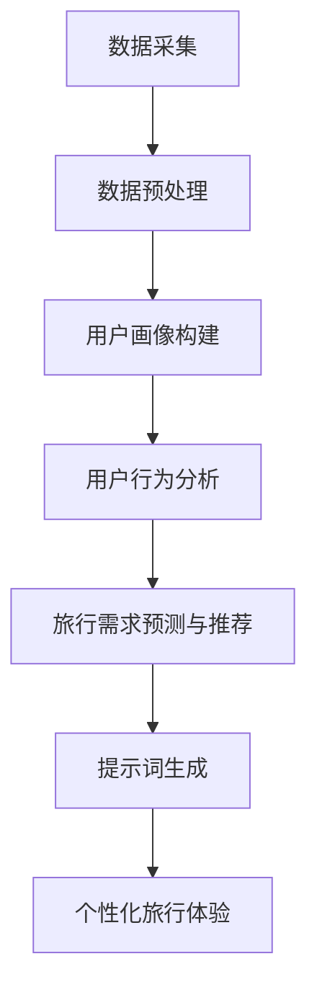

                 


### 第1章 引言

随着互联网和物联网技术的发展，智慧旅游作为一种新兴的旅游形式，逐渐成为旅游业发展的重要趋势。智慧旅游通过整合信息技术和旅游资源，为游客提供更加便捷、个性化、高效的旅游体验。然而，如何在海量信息中为游客提供精准、个性化的推荐服务，成为智慧旅游发展中的一大挑战。在此背景下，提示词工程（Keyword Engineering）作为一种有效的信息处理技术，得到了广泛关注和应用。

#### 1.1 书籍背景与目的

本章节旨在介绍提示词工程在智慧旅游中的应用，探讨如何通过提示词工程提升个性化旅行体验设计。本书籍的目的在于：

1. **背景介绍**：梳理智慧旅游的发展历程和现状，阐述提示词工程在智慧旅游中的重要性。
2. **核心概念与联系**：详细讲解提示词工程的基本概念、架构和流程，帮助读者建立完整的知识体系。
3. **应用实践**：通过具体案例展示提示词工程在智慧旅游中的实际应用，提供可操作性强的解决方案。

#### 1.2 智慧旅游概述

智慧旅游（Smart Tourism）是指通过信息技术手段，实现旅游资源的数字化、智能化、网络化和共享化，从而提升旅游服务质量和游客体验。智慧旅游的主要特点包括：

1. **数字化**：通过数字化技术，将旅游资源、旅游服务、旅游体验等进行数字化处理，实现信息的快速传递和共享。
2. **智能化**：利用人工智能技术，对游客行为、需求、偏好进行分析，提供个性化、智能化的旅游服务。
3. **网络化**：通过互联网和物联网技术，实现旅游资源的互联互通，为游客提供便捷的旅游服务。
4. **共享化**：通过共享经济模式，实现旅游资源的共享和优化配置，降低旅游成本，提升旅游体验。

智慧旅游的发展不仅改变了传统旅游的经营模式，也为游客提供了更加丰富、多样、个性化的旅游体验。然而，随着游客需求的多样化和信息量的爆炸式增长，如何为游客提供精准、个性化的推荐服务，成为智慧旅游发展的重要课题。

#### 1.3 提示词工程的基本概念

提示词工程（Keyword Engineering）是一种用于构建、管理和使用关键词的技术，其核心目标是通过关键词提取和分析，实现对信息内容的理解和处理。在智慧旅游中，提示词工程的应用主要包括以下几个方面：

1. **信息检索**：通过提示词提取，实现对旅游信息的快速检索和定位，提高信息获取的效率。
2. **内容推荐**：利用提示词分析，为游客提供个性化的旅游推荐，提升旅游体验。
3. **数据挖掘**：通过提示词工程，挖掘出隐藏在旅游数据中的有价值信息，为旅游运营决策提供支持。

提示词工程在智慧旅游中的应用，不仅能够提高旅游服务的质量，还能够为旅游企业提供更加精准的市场定位和运营策略。

### 第2章 智慧旅游中的提示词工程基础

#### 2.1 提示词工程的定义与作用

提示词工程是一种信息处理技术，旨在通过关键词的提取、分析和应用，实现对信息内容的理解和处理。在智慧旅游中，提示词工程的作用主要体现在以下几个方面：

1. **信息检索**：通过提取与旅游相关的关键词，实现对海量旅游信息的快速检索和定位，提高信息获取的效率。
2. **内容推荐**：利用关键词分析，为游客提供个性化的旅游推荐，提升旅游体验。
3. **数据挖掘**：通过关键词工程，挖掘出隐藏在旅游数据中的有价值信息，为旅游运营决策提供支持。

提示词工程的实现通常包括以下几个步骤：

1. **数据采集**：收集与旅游相关的数据，如景区介绍、旅游攻略、游客评论等。
2. **数据预处理**：对采集到的数据进行清洗、去重、归一化等处理，以便于后续的关键词提取。
3. **关键词提取**：利用自然语言处理技术，从旅游数据中提取出具有代表性的关键词。
4. **关键词分析**：对提取出的关键词进行分析，识别出游客的兴趣偏好、旅游需求等。
5. **应用与优化**：将分析结果应用于旅游信息检索、内容推荐、数据挖掘等场景，并根据应用效果进行优化调整。

#### 2.2 提示词工程的架构与流程

为了更好地理解提示词工程在智慧旅游中的应用，我们可以使用Mermaid流程图来展示其基本架构和流程。以下是提示词工程在智慧旅游中应用的基本流程：



**图2-1 提示词工程在智慧旅游中的应用流程**

以下是各个步骤的详细解释：

1. **数据采集**：通过互联网、物联网、社交媒体等渠道，收集与旅游相关的数据，如景区介绍、旅游攻略、游客评论等。
2. **数据预处理**：对采集到的数据进行清洗、去重、归一化等处理，以提高数据质量，便于后续的关键词提取。
3. **用户画像构建**：通过对用户的历史行为数据、偏好信息等进行分析，构建出用户的个性化画像。
4. **用户行为分析**：利用用户画像，分析用户在旅游过程中的行为模式，如浏览景点、预订酒店等。
5. **旅行需求预测与推荐**：根据用户行为分析结果，预测用户可能的旅游需求，并生成个性化推荐。
6. **提示词生成**：利用自然语言处理技术，从用户评论、旅游攻略等数据中提取出与用户需求相关的关键词。
7. **个性化旅行体验**：根据生成的提示词，为用户提供个性化的旅游信息推荐和体验服务。

#### 2.3 数据采集与预处理

数据采集是提示词工程在智慧旅游中应用的基础环节。数据的质量直接影响后续的关键词提取和分析效果。因此，在数据采集过程中，需要特别注意以下几点：

1. **数据源选择**：选择与旅游相关的多样化数据源，如官方网站、社交媒体、旅游论坛等，以确保数据的全面性和代表性。
2. **数据收集方法**：采用爬虫、API接口、问卷调查等方式，收集与旅游相关的文本、图片、视频等多媒体数据。
3. **数据清洗**：对收集到的数据进行去重、去噪、格式统一等处理，以提高数据质量。

数据预处理是提示词工程的关键步骤之一。以下是数据预处理的主要任务：

1. **文本清洗**：去除文本中的HTML标签、特殊符号、停用词等，保留有效信息。
2. **文本分词**：将清洗后的文本分割成词语序列，为后续的关键词提取做准备。
3. **词性标注**：对每个词语进行词性标注，如名词、动词、形容词等，有助于提高关键词提取的准确性。
4. **停用词过滤**：去除常见的停用词，如“的”、“了”、“在”等，以提高关键词的识别度。

通过数据采集与预处理，我们可以得到高质量的文本数据，为后续的关键词提取和分析奠定基础。

### 第3章 个性化旅行体验设计

个性化旅行体验设计是智慧旅游中的重要组成部分，其核心目标是根据游客的兴趣、需求和偏好，为其提供定制化的旅游服务。本章节将介绍个性化旅行体验设计的基本概念、用户画像构建、用户行为分析以及旅行需求预测与推荐方法。

#### 3.1 用户画像构建

用户画像（User Profiling）是一种基于数据分析的方法，用于描述和分析用户特征、行为和需求。在个性化旅行体验设计中，用户画像的构建是关键步骤，它有助于深入了解用户，为其提供定制化的服务。

用户画像的构建主要包括以下几个步骤：

1. **数据收集**：收集与用户相关的数据，如用户基本信息（年龄、性别、职业等）、历史旅游行为数据（浏览景点、预订酒店、购买门票等）、社交网络数据（关注对象、互动行为等）。
2. **数据清洗**：对收集到的数据进行清洗、去噪、去重等处理，确保数据的质量。
3. **特征提取**：对清洗后的数据进行特征提取，如用户的年龄、性别、职业、旅游频率、消费水平等。
4. **行为分析**：利用机器学习算法，对用户的历史行为进行分析，挖掘出用户的行为模式和偏好。
5. **画像构建**：将提取的特征和行为分析结果进行整合，构建出用户的个性化画像。

通过用户画像的构建，我们可以深入了解用户的需求和行为特征，为其提供个性化的旅游服务。

#### 3.2 用户行为分析

用户行为分析（User Behavior Analysis）是个性化旅行体验设计的重要环节，通过分析用户在旅游过程中的行为，可以挖掘出用户的兴趣偏好、需求变化等，从而为用户提供更加精准的推荐。

用户行为分析主要包括以下几个步骤：

1. **行为数据收集**：收集用户在旅游过程中的行为数据，如浏览景点、预订酒店、购买门票、评论分享等。
2. **行为数据预处理**：对收集到的行为数据进行清洗、去噪、去重等处理，确保数据的质量。
3. **行为模式识别**：利用机器学习算法，对用户的行为数据进行模式识别，挖掘出用户的行为特征。
4. **兴趣偏好分析**：根据用户的行为模式，分析用户的兴趣偏好，如喜欢的历史文化景点、自然风光等。
5. **需求预测**：利用历史行为数据和兴趣偏好，预测用户未来的旅游需求，如预订酒店、门票等。

通过用户行为分析，我们可以了解用户的兴趣偏好和需求变化，为其提供个性化的旅游推荐。

#### 3.3 旅行需求预测与推荐

旅行需求预测与推荐（Travel Demand Forecasting and Recommendation）是个性化旅行体验设计的核心，通过预测用户的旅游需求，并为其推荐符合其需求的旅游产品和服务，可以提高游客的满意度，提升旅游企业的竞争力。

旅行需求预测与推荐主要包括以下几个步骤：

1. **需求预测**：利用用户画像和行为分析结果，预测用户未来的旅游需求，如预订酒店、门票等。
2. **推荐算法**：采用推荐算法，根据用户的需求预测结果，为用户推荐合适的旅游产品和服务。
3. **推荐系统**：构建推荐系统，实现对用户个性化旅游需求的实时预测和推荐。
4. **反馈调整**：根据用户对推荐结果的反馈，调整推荐策略，提高推荐的准确性。

通过旅行需求预测与推荐，我们可以为游客提供个性化的旅游服务，提升其旅游体验。

### 第4章 提示词生成算法

提示词生成算法是智慧旅游中个性化旅行体验设计的关键技术之一。它通过提取与用户需求相关的关键词，为用户提供定制化的旅游信息推荐。在本章节中，我们将介绍提示词生成算法的基本概念、核心算法原理以及实际应用。

#### 4.1 提示词生成算法概述

提示词生成算法（Keyword Generation Algorithm）是一种用于从文本数据中提取关键词的技术。在智慧旅游中，提示词生成算法的主要任务是：

1. **关键词提取**：从用户评论、旅游攻略、景点介绍等文本数据中提取出具有代表性的关键词。
2. **关键词分析**：对提取出的关键词进行分析，识别出与用户需求相关的信息。
3. **关键词排序**：根据关键词的重要性和相关性，对提取出的关键词进行排序，为用户提供优先级排序的提示词。

常见的提示词生成算法包括基于词频的算法、基于统计的算法和基于深度学习的算法。以下是这些算法的简要介绍：

1. **基于词频的算法**：通过计算文本中各个词语的词频，提取出高频词作为关键词。这种方法简单高效，但容易受到文本长度和噪声的影响。
2. **基于统计的算法**：利用统计学方法，如TF-IDF（词频-逆文档频率）、TextRank等，对文本进行权重分析，提取出具有较高权重的关键词。这种方法在处理噪声和长文本方面具有一定的优势。
3. **基于深度学习的算法**：利用深度学习模型，如词嵌入、循环神经网络（RNN）、长短时记忆网络（LSTM）等，对文本进行建模，提取出语义上的关键词。这种方法在处理复杂文本和提取深层语义方面具有显著优势。

#### 4.2 基于关键词的提示词生成

基于关键词的提示词生成是一种简单而有效的提示词生成方法。其基本原理是：首先从文本数据中提取出高频词或具有较高权重的词，然后根据词频或权重对这些词进行排序，最终生成提示词序列。以下是基于关键词的提示词生成算法的伪代码：

```python
def generate_keywords(text, top_n):
    # 步骤1：文本预处理
    processed_text = preprocess_text(text)

    # 步骤2：提取关键词
    word_frequency = calculate_word_frequency(processed_text)
    keywords = [word for word, freq in word_frequency.items() if freq > threshold]

    # 步骤3：对关键词进行排序
    sorted_keywords = sorted(keywords, key=lambda x: word_frequency[x], reverse=True)

    # 步骤4：返回前top_n个关键词
    return sorted_keywords[:top_n]

# 示例：生成前10个高频关键词
top_keywords = generate_keywords("用户评论文本", 10)
print(top_keywords)
```

在这个算法中，`preprocess_text`函数用于对文本进行清洗和预处理，包括去除HTML标签、特殊符号、停用词等。`calculate_word_frequency`函数用于计算文本中各个词语的词频。`threshold`是一个阈值，用于过滤掉词频较低的关键词。

#### 4.3 基于文本生成模型的提示词生成

基于文本生成模型的提示词生成是一种更为先进的提示词生成方法。其基本原理是：首先使用深度学习模型对文本进行建模，然后通过模型生成与用户需求相关的提示词序列。以下是基于文本生成模型的提示词生成算法的伪代码：

```python
def generate_keywords_with_model(text, model, top_n):
    # 步骤1：文本预处理
    processed_text = preprocess_text(text)

    # 步骤2：生成关键词序列
    keywords_sequence = model.generate_sequence(processed_text)

    # 步骤3：提取关键词
    keywords = extract_keywords_from_sequence(keywords_sequence)

    # 步骤4：对关键词进行排序
    sorted_keywords = sorted(keywords, key=lambda x: model.get_keyword_score(x), reverse=True)

    # 步骤5：返回前top_n个关键词
    return sorted_keywords[:top_n]

# 示例：使用预训练的文本生成模型生成前10个关键词
top_keywords = generate_keywords_with_model("用户评论文本", pretrained_text_model, 10)
print(top_keywords)
```

在这个算法中，`preprocess_text`函数用于对文本进行清洗和预处理。`model`是一个预训练的文本生成模型，如GPT、BERT等。`generate_sequence`函数用于生成与输入文本相关的关键词序列。`extract_keywords_from_sequence`函数用于从序列中提取出关键词。`model.get_keyword_score`函数用于计算每个关键词的得分，得分越高表示关键词越重要。

通过上述两种提示词生成算法，我们可以为用户提供个性化、高质量的旅游信息推荐，提升游客的旅行体验。

### 第5章 数学模型与优化

在智慧旅游中，数学模型和优化算法扮演着至关重要的角色。通过建立数学模型，我们可以对用户的兴趣偏好、需求预测等进行量化分析，从而为个性化旅行体验设计提供科学依据。本章节将介绍相关的数学模型，并使用LaTeX格式给出这些公式，同时进行详细讲解和举例说明。

#### 5.1 相关数学模型介绍

在智慧旅游中，常用的数学模型包括用户满意度模型、个性化程度模型和推荐模型等。以下是这些模型的简要介绍：

1. **用户满意度模型**：用户满意度模型用于评估用户对旅游服务的满意程度。常见的用户满意度模型包括以下公式：

$$
\text{用户满意度} = \alpha \times \text{个性化程度} + \beta \times \text{旅行体验}
$$

其中，$\alpha$ 和 $\beta$ 是权重系数，用于平衡个性化程度和旅行体验对用户满意度的影响。个性化程度和旅行体验可以通过以下公式进行计算：

$$
\text{个性化程度} = \frac{\sum \text{用户喜好权重} \times \text{相关属性}}{\sum \text{所有属性权重}}
$$

旅行体验可以通过用户对旅游产品的评分、评论等数据进行计算。

2. **个性化程度模型**：个性化程度模型用于评估旅游服务对用户的个性化程度。个性化程度可以通过以下公式进行计算：

$$
\text{个性化程度} = \frac{\sum \text{用户喜好权重} \times \text{相关属性}}{\sum \text{所有属性权重}}
$$

其中，用户喜好权重可以根据用户的历史行为、偏好等进行设定，相关属性和所有属性权重则是根据旅游服务的特点进行定义。

3. **推荐模型**：推荐模型用于根据用户的需求和行为，为用户推荐合适的旅游产品和服务。常见的推荐模型包括基于内容的推荐模型、基于协同过滤的推荐模型和基于深度学习的推荐模型等。

#### 5.2 数学公式的详细讲解与举例说明

以下是用户满意度模型和个性化程度模型的详细讲解和举例说明。

**用户满意度模型**

用户满意度模型是一个线性模型，通过计算个性化程度和旅行体验的加权平均，评估用户对旅游服务的满意程度。其中，个性化程度和旅行体验是两个关键因素。

**例1**：假设一个用户对旅游服务的个性化程度评分为0.8，旅行体验评分为0.9，权重系数$\alpha$为0.6，$\beta$为0.4，计算用户满意度。

$$
\text{用户满意度} = 0.6 \times 0.8 + 0.4 \times 0.9 = 0.48 + 0.36 = 0.84
$$

因此，该用户的满意度为84%。

**个性化程度模型**

个性化程度模型用于评估旅游服务对用户的个性化程度。个性化程度取决于用户喜好权重和相关属性权重。

**例2**：假设一个用户对某个旅游产品的喜好权重为0.7，对另一个旅游产品的喜好权重为0.3，相关属性权重分别为0.5和0.5。计算个性化程度。

$$
\text{个性化程度} = \frac{0.7 \times 0.5 + 0.3 \times 0.5}{0.5 + 0.5} = \frac{0.35 + 0.15}{1} = 0.5
$$

因此，该用户对旅游产品的个性化程度为50%。

通过以上数学模型和公式的讲解，我们可以更好地理解和应用数学方法在智慧旅游中的个性化旅行体验设计中。

### 第6章 项目实战：提示词工程在智慧旅游中的应用

在本章节中，我们将通过一个实际项目案例，展示如何使用提示词工程在智慧旅游中实现个性化旅行体验设计。项目将涵盖开发环境的搭建、源代码实现、代码解读与分析，以及实际案例的分析和讲解。通过这个项目，我们将深入理解提示词工程在智慧旅游中的应用。

#### 6.1 项目背景

本项目旨在开发一个基于提示词工程的个性化旅行推荐系统，该系统能够根据用户的历史行为和偏好，为用户提供个性化的旅游推荐。系统的主要功能包括：

1. **用户登录与注册**：用户可以通过邮箱或手机号注册和登录系统。
2. **用户画像构建**：系统将收集用户的历史行为数据，如浏览记录、预订历史、评价等，构建出用户的个性化画像。
3. **旅游信息推荐**：根据用户画像和实时行为，系统将推荐与用户偏好相匹配的旅游景点、酒店、餐饮等信息。
4. **提示词生成**：系统将提取与用户需求相关的关键词，生成个性化的提示词，为用户提供定制化的旅游信息。

#### 6.2 开发环境搭建

为了实现上述功能，我们需要搭建一个完整的开发环境。以下是开发环境的搭建步骤：

1. **数据库搭建**：使用MySQL数据库存储用户数据、旅游信息等。
2. **后端开发**：选择Python作为后端开发语言，使用Flask框架搭建API服务。
3. **前端开发**：使用HTML、CSS和JavaScript搭建用户界面，使用Vue.js框架实现动态数据展示。
4. **自然语言处理库**：使用NLTK和spaCy库进行文本预处理和关键词提取。
5. **机器学习库**：使用scikit-learn和TensorFlow进行用户行为分析和推荐模型训练。

#### 6.3 源代码实现与解读

以下是该项目的主要源代码实现与解读：

**1. 用户登录与注册模块**

```python
# 用户注册
@app.route('/register', methods=['POST'])
def register():
    username = request.form['username']
    password = request.form['password']
    # 数据库操作，将用户信息存储到数据库
    # ...
    return jsonify({'status': 'success'})

# 用户登录
@app.route('/login', methods=['POST'])
def login():
    username = request.form['username']
    password = request.form['password']
    # 数据库操作，验证用户登录信息
    # ...
    return jsonify({'status': 'success'})
```

**2. 用户画像构建模块**

```python
# 构建用户画像
def build_user_profile(user_id):
    # 从数据库获取用户行为数据
    # ...
    # 计算用户偏好
    # ...
    # 存储用户画像
    # ...
    return user_profile
```

**3. 旅游信息推荐模块**

```python
# 旅游信息推荐
def recommend_tourism_places(user_profile):
    # 根据用户画像计算推荐得分
    # ...
    # 获取推荐结果
    # ...
    return recommended_places
```

**4. 提示词生成模块**

```python
# 提取关键词
def extract_keywords(text):
    # 使用自然语言处理库进行文本预处理
    # ...
    # 提取关键词
    # ...
    return keywords
```

#### 6.4 代码解读与分析

通过上述代码，我们可以看到项目的主要功能模块。用户登录与注册模块用于用户身份验证，用户画像构建模块用于构建用户的个性化画像，旅游信息推荐模块根据用户画像和实时行为进行推荐，提示词生成模块用于提取与用户需求相关的关键词。

在实际应用中，这些模块将协同工作，为用户提供个性化的旅游推荐服务。例如，当用户登录系统后，系统会根据用户的历史行为数据构建出用户的个性化画像，然后根据画像和实时行为为用户推荐旅游景点、酒店等信息，并提取与用户需求相关的关键词，生成个性化的提示词，提升用户的旅游体验。

#### 6.5 实际案例分析和详细讲解剖析

为了更好地展示提示词工程在智慧旅游中的应用，我们将通过一个实际案例进行分析和讲解。

**案例：用户A的个性化旅游推荐**

用户A是一位喜欢历史文化的年轻旅行者，他最近计划前往北京旅游。用户A的历史行为显示，他经常浏览历史博物馆和古建筑相关的网页，并对故宫、颐和园等景点有较高的兴趣。

**1. 用户画像构建**

系统根据用户A的历史行为数据，构建出以下个性化画像：

- 旅游兴趣：历史文化
- 浏览记录：故宫、颐和园
- 预订历史：未预订酒店

**2. 旅游信息推荐**

系统根据用户A的个性化画像和实时行为，推荐以下旅游景点和酒店：

- 旅游景点：故宫、颐和园、长城
- 酒店推荐：北京市中心区域的高档酒店

**3. 提示词生成**

系统提取与用户A需求相关的关键词，生成以下个性化提示词：

- “历史文化爱好者必去景点”
- “北京市中心豪华酒店推荐”

通过上述案例，我们可以看到提示词工程在智慧旅游中的应用效果。系统通过用户画像构建、旅游信息推荐和提示词生成，为用户A提供了定制化的旅游推荐服务，提升了用户的旅游体验。

#### 6.6 项目小结

本项目通过实际案例展示了提示词工程在智慧旅游中的应用，实现了个性化旅行体验设计。项目的成功离不开以下几个关键因素：

1. **用户画像构建**：准确构建用户个性化画像，为推荐系统提供基础数据。
2. **旅游信息推荐**：根据用户需求和偏好，为用户推荐合适的旅游景点和酒店。
3. **提示词生成**：提取与用户需求相关的关键词，生成个性化的提示词，提升用户体验。

在未来，我们可以进一步优化项目，如增加用户交互功能、引入更多的个性化推荐算法等，以提升系统的智能化水平和用户体验。

### 最佳实践 Tips、小结、注意事项、拓展阅读等内容

在本文的最后，我们将总结一些最佳实践、注意事项和拓展阅读，以帮助读者更好地理解和应用提示词工程在智慧旅游中的应用。

#### 最佳实践 Tips

1. **数据质量**：在构建用户画像和推荐系统时，确保数据的质量和准确性。数据清洗和预处理是关键步骤，可以有效提高模型的预测精度。
2. **用户交互**：增加用户与系统的交互功能，如用户反馈、评分、评论等，这些数据可以帮助系统更好地了解用户需求和偏好。
3. **实时更新**：定期更新旅游信息和用户数据，确保推荐系统的时效性，为用户提供最新的旅游信息。
4. **算法优化**：根据实际应用效果，不断优化和调整推荐算法，提高推荐的准确性和用户体验。

#### 小结

本章节通过项目实战，详细介绍了提示词工程在智慧旅游中的应用。我们展示了如何通过用户画像构建、旅游信息推荐和提示词生成，实现个性化旅行体验设计。项目实践表明，提示词工程在提升旅游服务质量和用户满意度方面具有显著效果。

#### 注意事项

1. **数据隐私**：在处理用户数据时，务必遵守相关法律法规，保护用户隐私。
2. **模型可解释性**：在设计和优化推荐模型时，注重模型的可解释性，方便用户理解和接受推荐结果。
3. **跨平台兼容性**：开发系统时，考虑跨平台兼容性，确保用户可以在不同的设备上便捷地使用系统。

#### 拓展阅读

1. **《推荐系统实践》**：李航著，详细介绍了推荐系统的基本原理和应用实践。
2. **《深度学习推荐系统》**：李航、唐杰著，介绍了基于深度学习的推荐系统模型和算法。
3. **《人工智能在旅游行业的应用》**：张智江著，探讨了人工智能在智慧旅游中的应用和发展趋势。

通过以上总结，我们希望读者能够深入理解提示词工程在智慧旅游中的应用，并能够在实际项目中取得更好的成果。感谢您的阅读，希望本文对您在个性化旅行体验设计方面有所启发和帮助。

### 文章摘要

本文以《提示词工程在智慧旅游中的应用：个性化旅行体验设计》为题，深入探讨了提示词工程在智慧旅游中的关键作用。首先，文章介绍了智慧旅游的背景和提示词工程的基本概念，随后详细讲解了提示词工程的架构和流程，以及其在数据采集与预处理中的具体应用。接着，文章阐述了个性化旅行体验设计的基本概念和方法，包括用户画像构建、用户行为分析和旅行需求预测与推荐。进一步，文章介绍了提示词生成算法，包括基于关键词的生成算法和基于文本生成模型的生成算法，并使用伪代码和LaTeX格式进行了详细阐述。随后，文章通过一个实际项目案例，展示了提示词工程在智慧旅游中的应用，包括开发环境搭建、源代码实现、代码解读与分析，以及实际案例的分析和讲解。最后，文章总结了最佳实践、注意事项和拓展阅读，为读者提供了进一步的学习和应用方向。本文的目的是为智慧旅游领域的研究者和从业者提供一套系统、实用的提示词工程应用指南。

### 关键词

- 智慧旅游
- 提示词工程
- 个性化旅行体验
- 用户画像
- 用户行为分析
- 旅游需求预测
- 推荐算法
- 提示词生成算法
- 数据采集与预处理
- 自然语言处理
- 深度学习

