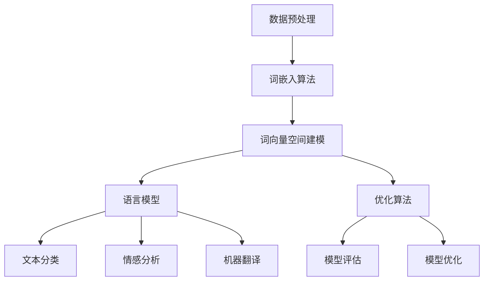

                 

### 文章标题：提示词工程在智能交通中的实践

### 关键词：
- 提示词工程
- 智能交通
- 词嵌入
- 语言模型
- 数学模型
- 项目实战

### 摘要：
本文将深入探讨提示词工程在智能交通领域的实践。通过梳理提示词工程的核心概念，解析其在智能交通中的应用，并结合实际项目案例，详细讲解如何实现和优化提示词工程在交通流量预测、车辆导航和交通事故预警等场景中的性能。本文旨在为读者提供一条清晰的思路，帮助他们在智能交通领域中运用提示词工程技术，从而实现交通管理的智能化和高效化。

### 引言

#### 1.1 书籍背景与目标

随着科技的飞速发展，智能交通系统（Intelligent Transportation Systems, ITS）逐渐成为现代城市交通管理的重要组成部分。智能交通系统通过集成多种先进技术，如物联网、大数据、人工智能等，实现对交通流量的实时监控、预测和调控，从而提高道路利用率、减少拥堵、降低事故发生率，提升整体交通系统的运行效率。

提示词工程（Word Embedding Engineering）作为人工智能领域的关键技术之一，近年来在自然语言处理（Natural Language Processing, NLP）、机器翻译、情感分析等众多领域中取得了显著的成果。提示词工程通过将词语映射为高维向量空间中的点，使原本难以处理的文本数据具备了良好的几何特征，进而为各类文本处理任务提供了强有力的支持。

本书的编写旨在为读者提供一套全面、系统的提示词工程在智能交通中的实践指南。通过本书，读者将了解提示词工程的基本概念、核心算法原理，以及如何在智能交通领域具体应用提示词工程，从而为交通管理提供一种新的技术手段。

#### 1.2 提示词工程概述

提示词工程起源于自然语言处理领域，其核心目标是将自然语言中的词语映射为计算机可以处理的高维向量表示。这一过程通常涉及以下步骤：

1. **数据预处理**：收集大量文本数据，对文本进行清洗、分词、去停用词等处理。
2. **词嵌入算法**：通过词嵌入算法，将词语映射为高维向量。常见的词嵌入算法包括Word2Vec、GloVe、FastText等。
3. **向量空间建模**：将词嵌入向量进行进一步建模，构建语言模型或深度学习模型，用于文本分类、情感分析等任务。
4. **模型评估与优化**：通过交叉验证、评估指标等手段，对模型性能进行评估和优化。

在自然语言处理领域，提示词工程已被广泛应用于文本分类、情感分析、机器翻译等领域，并取得了显著的效果。然而，提示词工程在智能交通领域的应用还处于初级阶段，具有巨大的潜力和广阔的发展空间。

#### 1.3 智能交通领域应用前景

智能交通系统的发展，依赖于多种先进技术的综合应用，如物联网、大数据、人工智能等。提示词工程作为一种关键技术，在智能交通领域具有广泛的应用前景：

1. **交通流量预测**：通过分析历史交通数据，结合提示词工程，可以实现交通流量的实时预测，为交通调控提供数据支持。
2. **车辆导航**：利用提示词工程，可以为导航系统提供更加准确和智能的路径规划建议，提高驾驶体验。
3. **交通事故预警**：通过分析交通数据中的关键词和语义关系，提示词工程可以在事故发生前预测潜在风险，为交通安全管理提供预警。
4. **智能交通信号控制**：基于提示词工程，可以实现智能交通信号控制，根据实时交通状况优化信号配时，提高交通效率。

总之，提示词工程在智能交通领域的应用，将为交通管理带来革命性的变化，有助于构建更加智能、高效、安全的交通系统。

### 提示词工程基础

#### 2.1 核心概念与联系

提示词工程涉及多个核心概念，包括词嵌入、语言模型、优化算法等。为了更好地理解这些概念之间的关系，我们可以使用Mermaid流程图进行展示：



- **数据预处理**：数据预处理是提示词工程的第一步，包括文本的清洗、分词、去停用词等操作，为后续的词嵌入和建模奠定基础。
- **词嵌入算法**：词嵌入是将词语映射为高维向量空间中的点，常用的算法包括Word2Vec、GloVe、FastText等。词嵌入的结果使得词语具备了几何特征，为后续的文本处理提供了支持。
- **词向量空间建模**：在词嵌入的基础上，通过构建语言模型或深度学习模型，可以进一步处理文本数据。常见的语言模型包括n-gram模型、递归神经网络（RNN）、Transformer等。
- **优化算法**：优化算法用于调整模型参数，提高模型性能。常见的优化算法包括梯度下降、Adam优化器等。
- **语言模型应用**：语言模型可以应用于多种文本处理任务，如文本分类、情感分析、机器翻译等。

通过上述流程图，我们可以清晰地看到提示词工程的核心概念及其相互联系，为后续章节的内容提供了基础。

#### 2.2 词嵌入算法

词嵌入是将词语映射为高维向量空间中的点，这一过程可以通过多种算法实现。以下将介绍几种常用的词嵌入算法，包括Word2Vec、GloVe和FastText。

##### 2.2.1 Word2Vec算法

Word2Vec算法由Google在2013年提出，是一种基于神经网络和分布假设的词嵌入算法。Word2Vec算法主要包括两种模型：Continuous Bag-of-Words (CBOW)和Skip-Gram。

- **CBOW模型**：CBOW模型通过上下文词语的均值来表示目标词语。具体来说，给定一个目标词语，CBOW模型会计算其上下文词语的均值，并将其作为目标词语的向量表示。
  - **输入**：一个目标词语及其上下文词语窗口。
  - **输出**：目标词语的词向量。
  - **伪代码**：
    ```python
    # CBOW模型伪代码
    for each word w in context:
        Calculate the average vector of the words in the context
    return the average vector as the representation of the target word
    ```

- **Skip-Gram模型**：与CBOW模型相反，Skip-Gram模型通过目标词语预测上下文词语。具体来说，给定一个目标词语，Skip-Gram模型会尝试预测其上下文词语。
  - **输入**：一个目标词语及其上下文词语窗口。
  - **输出**：上下文词语的词向量。
  - **伪代码**：
    ```python
    # Skip-Gram模型伪代码
    for each word w in vocabulary:
        Calculate the log-likelihood of predicting the context words given the target word
    return the predicted context words as the representation of the target word
    ```

##### 2.2.2 GloVe算法

GloVe（Global Vectors for Word Representation）算法由Jeffrey Dean和Greg S. Corrado在2014年提出，是一种基于全局矩阵分解的词嵌入算法。GloVe算法通过构建一个全局矩阵，将词语与它们的共现关系表示为矩阵中的元素。

- **输入**：语料库和共现矩阵。
- **输出**：词向量矩阵。
- **伪代码**：
  ```python
  # GloVe算法伪代码
  for each word w and its co-occurrence matrix A:
      Calculate the dot product of the vectors representing word w and its context words
      Update the word vector w and the context word vectors based on the dot product
  return the updated word vector matrix
  ```

##### 2.2.3 FastText算法

FastText算法由Pavlo Oseytskyy、Ivan Bojanowski、Armand Joulin和Tomáš Mikolov在2016年提出，是对Word2Vec算法的改进。FastText算法通过引入词袋模型（Bag-of-Words）和子词（Subword）信息，提高了词嵌入的效果。

- **输入**：语料库和子词字典。
- **输出**：词向量矩阵。
- **伪代码**：
  ```python
  # FastText算法伪代码
  for each subword in the vocabulary:
      Train a neural network to predict the subword given its context
  for each word in the vocabulary:
      Combine the word vectors of its subwords using an averaging or concatenation operation
  return the combined word vector as the representation of the word
  ```

通过上述三种词嵌入算法的介绍，我们可以看到它们在实现方式、输入输出和处理目标上各有特点。在实际应用中，可以根据具体需求选择合适的词嵌入算法，以提高文本处理的性能。

#### 2.3 语言模型

语言模型是提示词工程的重要组成部分，用于描述词语之间的概率关系，为文本生成、翻译、摘要等任务提供基础支持。以下将介绍几种常用的语言模型，包括n-gram模型、递归神经网络（RNN）和Transformer。

##### 2.3.1 n-gram模型

n-gram模型是一种基于马尔可夫假设的语言模型，通过统计前n个词语的联合概率来预测下一个词语。具体来说，n-gram模型将一个句子划分为n个连续的词语序列，然后计算每个序列的概率。

- **输入**：一个n元组（n-gram）序列。
- **输出**：下一个词语的概率分布。
- **数学模型**：
  $$ P(w_{t} | w_{t-1}, w_{t-2}, \ldots, w_{t-n}) = \frac{P(w_{t-1}, w_{t-2}, \ldots, w_{t-n}, w_{t})}{P(w_{t-1}, w_{t-2}, \ldots, w_{t-n})} $$
- **伪代码**：
  ```python
  # n-gram模型伪代码
  for each n-gram in the vocabulary:
      Calculate the probability of the n-gram
  return the probability distribution of the next word given the current n-gram
  ```

##### 2.3.2 递归神经网络（RNN）

递归神经网络（Recurrent Neural Network, RNN）是一种基于时间序列数据的神经网络，能够处理序列数据，并在序列的每个时间步保留状态信息。RNN通过递归结构，使得网络能够记住先前的输入，从而实现长距离依赖建模。

- **输入**：一个时间步序列。
- **输出**：当前时间步的输出。
- **数学模型**：
  $$ h_t = \sigma(W_h \cdot [h_{t-1}, x_t] + b_h) $$
  $$ o_t = \sigma(W_o \cdot h_t + b_o) $$
- **伪代码**：
  ```python
  # RNN模型伪代码
  for each time step t:
      Calculate the hidden state h_t based on the previous hidden state h_{t-1} and the current input x_t
      Calculate the output o_t based on the hidden state h_t
  return the output sequence
  ```

##### 2.3.3 Transformer

Transformer是Google在2017年提出的一种基于自注意力机制的序列模型，用于处理自然语言处理任务。与传统的RNN和LSTM不同，Transformer通过自注意力机制（Self-Attention）实现序列间的长距离依赖建模，提高了模型的并行处理能力和效果。

- **输入**：一个时间步序列。
- **输出**：当前时间步的输出。
- **数学模型**：
  $$ Q = W_Q \cdot X, \quad K = W_K \cdot X, \quad V = W_V \cdot X $$
  $$ \text{Attention}(Q, K, V) = \text{softmax}\left(\frac{QK^T}{\sqrt{d_k}}\right)V $$
  $$ \text{Output} = W_O (\text{Attention}(Q, K, V) + X) $$
- **伪代码**：
  ```python
  # Transformer模型伪代码
  for each time step t:
      Calculate the query, key, and value vectors based on the input sequence
      Calculate the attention scores using the scaled dot-product attention
      Calculate the weighted sum of the value vectors based on the attention scores
      Calculate the output based on the weighted sum and the input sequence
  return the output sequence
  ```

通过上述三种语言模型的介绍，我们可以看到它们在实现方式、输入输出和处理目标上各有特点。在实际应用中，可以根据具体需求选择合适的语言模型，以提高文本处理的效果。

### 数学模型与优化算法

#### 3.1 数学模型

提示词工程中的数学模型主要用于描述词语之间的相似性、相关性以及优化目标。以下将介绍一些常用的数学模型，包括词向量相似性计算、正则化和优化算法。

##### 3.1.1 词向量相似性计算

词向量的相似性计算是提示词工程中的核心任务之一，主要用于评估两个词语在向量空间中的距离。常用的相似性度量方法包括余弦相似度、点积相似度和欧氏距离等。

- **余弦相似度**：
  $$ \text{Cosine Similarity}(x, y) = \frac{x \cdot y}{\|x\| \|y\|} $$
  其中，\( x \)和\( y \)分别为两个词向量，\( \|x\| \)和\( \|y\| \)分别为它们的欧氏范数。

- **点积相似度**：
  $$ \text{Pointwise Mutual Information Similarity}(x, y) = x \cdot y - \mu(x) \cdot \mu(y) $$
  其中，\( \mu(x) \)和\( \mu(y) \)分别为\( x \)和\( y \)的期望值。

- **欧氏距离**：
  $$ \text{Euclidean Distance}(x, y) = \sqrt{(x - y)^2} $$

通过这些相似性度量方法，我们可以评估两个词向量在向量空间中的相似程度，从而为文本分类、聚类等任务提供支持。

##### 3.1.2 正则化

正则化是提示词工程中常用的技术，用于防止模型过拟合和优化模型性能。以下介绍几种常见的正则化方法，包括L1正则化、L2正则化和Dropout。

- **L1正则化**：
  $$ \text{Regularization Loss} = \lambda \sum_{i} \|w_i\|_1 $$
  其中，\( \lambda \)为正则化参数，\( w_i \)为模型权重。

- **L2正则化**：
  $$ \text{Regularization Loss} = \lambda \sum_{i} \|w_i\|_2^2 $$
  其中，\( \lambda \)为正则化参数，\( w_i \)为模型权重。

- **Dropout**：
  $$ \text{Dropout Loss} = \frac{1}{N} \sum_{i} (1 - p_i) \cdot \text{Cross-Entropy Loss}(y_i, \hat{y}_i) $$
  其中，\( p_i \)为每个神经元的dropout概率，\( y_i \)和\( \hat{y}_i \)分别为实际输出和预测输出。

通过正则化方法，我们可以控制模型复杂度，提高模型的泛化能力。

##### 3.1.3 优化算法

优化算法用于调整模型参数，以最小化损失函数。以下介绍几种常用的优化算法，包括梯度下降、Adam优化器和动量优化器。

- **梯度下降**：
  $$ \text{Update Rule} = \alpha \cdot \nabla_{\theta} L(\theta) $$
  其中，\( \alpha \)为学习率，\( \theta \)为模型参数。

- **Adam优化器**：
  $$ m_t = \beta_1 \cdot m_{t-1} + (1 - \beta_1) \cdot \nabla_{\theta} L(\theta) $$
  $$ v_t = \beta_2 \cdot v_{t-1} + (1 - \beta_2) \cdot (\nabla_{\theta} L(\theta))^2 $$
  $$ \theta_t = \theta_{t-1} - \alpha \cdot \frac{m_t}{\sqrt{v_t} + \epsilon} $$
  其中，\( \beta_1 \)、\( \beta_2 \)、\( \alpha \)、\( \epsilon \)分别为Adam优化器的超参数。

- **动量优化器**：
  $$ m_t = \gamma \cdot m_{t-1} + (1 - \gamma) \cdot \nabla_{\theta} L(\theta) $$
  $$ \theta_t = \theta_{t-1} - \alpha \cdot m_t $$
  其中，\( \gamma \)和\( \alpha \)分别为动量优化器的超参数。

通过优化算法，我们可以调整模型参数，提高模型性能。

### 提示词工程在智能交通中的应用

#### 4.1 智能交通概述

智能交通系统（Intelligent Transportation Systems, ITS）是一种基于物联网、大数据、人工智能等先进技术的综合交通管理系统。其核心目标是提高交通效率、减少交通拥堵、降低事故发生率，从而提升整体交通系统的运行质量。智能交通系统主要包括以下几个组成部分：

1. **车辆监测与控制**：通过车载传感器和定位技术，实时监测车辆的位置、速度、行驶方向等参数，为交通管理和调度提供数据支持。
2. **道路监测与控制**：通过安装在道路上的监测设备，实时监测道路的流量、速度、密度等参数，为交通信号控制和道路维护提供数据支持。
3. **信息发布与诱导**：通过交通广播、显示屏、导航设备等手段，向驾驶员提供实时的交通信息，引导车辆选择最优路径，减少拥堵。
4. **紧急救援与事故处理**：通过紧急呼叫、救援车辆调度等手段，提高交通事故的处理效率，减少事故对交通的影响。

智能交通系统的发展，对于缓解城市交通拥堵、提高交通运行效率具有重要意义。随着人工智能技术的不断进步，提示词工程在智能交通领域的应用前景也越来越广阔。

#### 4.2 提示词工程在智能交通中的应用场景

提示词工程在智能交通领域具有广泛的应用场景，以下将介绍其在车辆导航、交通流量预测和交通事故预警等方面的应用。

##### 4.2.1 车辆导航

车辆导航是智能交通系统中的一个重要应用，通过实时交通信息和历史交通数据，为驾驶员提供最优路径规划，减少行车时间和油耗。提示词工程在车辆导航中的应用主要体现在以下几个方面：

1. **路径规划**：利用提示词工程，将交通数据中的关键词和语义信息转化为向量表示，通过向量空间中的相似性度量，为驾驶员提供最优路径。例如，基于GloVe算法，将道路名称、道路类型等关键词转化为向量，然后计算两个道路的相似性，选择相似性最高的道路作为路径。
2. **路况预测**：通过分析历史交通数据和实时交通数据，利用提示词工程实现交通流量的预测，为路径规划提供数据支持。例如，使用n-gram模型，将交通流量数据序列转化为n-gram序列，然后计算每个n-gram的概率，预测未来一段时间内的交通流量。
3. **实时导航**：在车辆导航过程中，实时收集道路信息，利用提示词工程分析道路状况，为驾驶员提供实时导航建议。例如，通过分析实时交通数据和GPS信息，使用词嵌入算法将道路状况转化为向量表示，然后计算道路状况的相似性，为驾驶员提供实时路况信息。

##### 4.2.2 交通流量预测

交通流量预测是智能交通系统中一个关键任务，通过对历史交通数据和实时交通数据的分析，预测未来一段时间内的交通流量分布，为交通管理和调度提供数据支持。提示词工程在交通流量预测中的应用主要体现在以下几个方面：

1. **数据预处理**：利用提示词工程，将交通数据中的关键词和语义信息转化为向量表示，为后续分析提供基础。例如，将交通流量数据中的道路名称、路段类型等关键词转化为向量，然后计算每个关键词的相似性。
2. **时间序列建模**：利用n-gram模型，将交通流量数据序列转化为n-gram序列，然后计算每个n-gram的概率，预测未来一段时间内的交通流量。例如，使用n-gram模型，将交通流量数据序列划分为一天中的不同时间段，然后计算每个时间段的概率，预测未来一天内的交通流量。
3. **深度学习模型**：利用深度学习模型，如RNN、LSTM、GRU等，对交通流量数据序列进行建模，实现长距离依赖关系的捕捉。例如，使用LSTM模型，将交通流量数据序列输入到模型中，通过递归结构，预测未来一段时间内的交通流量。
4. **集成学习方法**：将多种预测模型进行集成，提高交通流量预测的准确性。例如，将n-gram模型、RNN模型和深度学习模型进行集成，通过模型融合方法，提高预测效果。

##### 4.2.3 交通事故预警

交通事故预警是智能交通系统中一个重要的安全功能，通过对交通数据的实时分析，预测潜在的事故风险，为驾驶员和交通管理部门提供预警信息，从而减少事故的发生。提示词工程在交通事故预警中的应用主要体现在以下几个方面：

1. **事故关键词提取**：利用提示词工程，将交通数据中的关键词转化为向量表示，为事故检测提供基础。例如，将交通事故报告中的关键词，如“碰撞”、“刮擦”、“翻车”等，转化为向量表示，然后计算关键词之间的相似性。
2. **事故特征提取**：通过对交通数据的分析，提取事故特征，如车速、行驶方向、交通密度等，利用提示词工程将特征转化为向量表示。例如，将交通密度数据中的路段长度、车辆数量等特征转化为向量，然后计算特征之间的相似性。
3. **异常检测**：利用机器学习算法，如K-最近邻（KNN）、支持向量机（SVM）等，对交通数据进行异常检测，识别潜在的事故风险。例如，使用KNN算法，将交通数据与历史数据进行比较，发现异常数据，预测潜在的事故风险。
4. **实时预警**：在交通事故预警过程中，实时分析交通数据，利用提示词工程实现实时预警。例如，通过分析实时交通数据和事故特征，使用词嵌入算法将交通数据转化为向量表示，然后计算交通数据与事故特征之间的相似性，实现实时预警。

通过以上介绍，我们可以看到提示词工程在智能交通领域的广泛应用，为交通管理提供了有力的技术支持。随着提示词工程技术的不断发展和优化，其在智能交通领域的应用前景将更加广阔。

### 项目实战：智能交通提示词工程平台搭建

为了更好地展示提示词工程在智能交通中的应用，我们将通过一个实际项目案例，介绍如何搭建一个智能交通提示词工程平台。本节将分为以下几个部分：开发环境搭建、数据收集与预处理、提示词工程模型训练、模型评估与优化。

#### 5.1 开发环境搭建

搭建一个智能交通提示词工程平台，需要选择合适的开发环境。以下为推荐的开发环境：

1. **操作系统**：Linux（如Ubuntu）
2. **编程语言**：Python
3. **深度学习框架**：TensorFlow或PyTorch
4. **数据处理库**：Pandas、NumPy
5. **可视化库**：Matplotlib、Seaborn

在Linux操作系统上，通过以下命令安装所需的依赖：

```bash
# 安装Python
sudo apt-get install python3

# 安装TensorFlow
pip3 install tensorflow

# 安装其他依赖
pip3 install pandas numpy matplotlib seaborn
```

安装完成后，确保Python和TensorFlow能够正常使用：

```python
# 检查Python版本
python3 --version

# 检查TensorFlow版本
import tensorflow as tf
print(tf.__version__)
```

#### 5.2 数据收集与预处理

搭建智能交通提示词工程平台的第一步是收集和预处理数据。以下为数据收集和预处理的主要步骤：

1. **数据收集**：收集智能交通相关的数据，如交通流量数据、交通事故数据、道路信息等。数据可以从交通管理部门、公共数据平台等渠道获取。
2. **数据清洗**：对收集到的数据进行清洗，去除重复、缺失和异常数据。例如，使用Pandas库对数据进行处理：

   ```python
   import pandas as pd

   # 读取数据
   data = pd.read_csv('traffic_data.csv')

   # 去除重复数据
   data.drop_duplicates(inplace=True)

   # 去除缺失数据
   data.dropna(inplace=True)

   # 处理异常数据
   data = data[data['speed'] > 0]
   ```

3. **数据分词**：对文本数据进行分词，将文本数据转化为词语序列。可以使用jieba库进行分词：

   ```python
   import jieba

   # 分词
   data['text'] = data['description'].apply(lambda x: ' '.join(jieba.cut(x)))
   ```

4. **去除停用词**：去除文本数据中的停用词，如“的”、“了”、“是”等。可以使用stopwords库：

   ```python
   import stopwords

   # 去除停用词
   data['text'] = data['text'].apply(lambda x: ' '.join([word for word in x.split() if word not in stopwords]))
   ```

5. **词嵌入**：对处理后的文本数据进行词嵌入，将词语转化为向量表示。可以使用Word2Vec、GloVe等算法：

   ```python
   from gensim.models import Word2Vec

   # 训练Word2Vec模型
   model = Word2Vec(data['text'].tolist(), vector_size=100, window=5, min_count=1, workers=4)
   ```

   将词向量保存到文件中，以便后续使用：

   ```python
   model.wv.save_word2vec_format('word2vec.bin')
   ```

   读取词向量文件：

   ```python
   from gensim.models import KeyedVectors

   # 读取词向量文件
   word2vec = KeyedVectors.load_word2vec_format('word2vec.bin', binary=True)
   ```

#### 5.3 提示词工程模型训练

在数据预处理完成后，我们可以利用处理后的数据进行提示词工程模型的训练。以下为模型训练的主要步骤：

1. **数据集划分**：将数据集划分为训练集和测试集，用于训练和评估模型。可以使用scikit-learn库进行数据集划分：

   ```python
   from sklearn.model_selection import train_test_split

   # 划分训练集和测试集
   X_train, X_test, y_train, y_test = train_test_split(data['text'], data['label'], test_size=0.2, random_state=42)
   ```

2. **构建模型**：选择合适的模型架构，如n-gram模型、RNN、LSTM等。以下为使用n-gram模型的示例：

   ```python
   from tensorflow.keras.models import Sequential
   from tensorflow.keras.layers import Embedding, LSTM, Dense

   # 构建模型
   model = Sequential()
   model.add(Embedding(input_dim=vocab_size, output_dim=100, input_length=max_sequence_length))
   model.add(LSTM(100))
   model.add(Dense(1, activation='sigmoid'))

   # 编译模型
   model.compile(optimizer='adam', loss='binary_crossentropy', metrics=['accuracy'])
   ```

3. **训练模型**：使用训练集训练模型，并使用测试集进行评估。以下为训练模型的示例：

   ```python
   # 训练模型
   model.fit(X_train, y_train, epochs=10, batch_size=32, validation_data=(X_test, y_test))
   ```

4. **评估模型**：评估训练好的模型，计算准确率、召回率、F1值等指标。以下为评估模型的示例：

   ```python
   from sklearn.metrics import accuracy_score, recall_score, f1_score

   # 预测测试集
   y_pred = model.predict(X_test)

   # 计算评估指标
   accuracy = accuracy_score(y_test, y_pred.round())
   recall = recall_score(y_test, y_pred.round())
   f1 = f1_score(y_test, y_pred.round())

   print(f"Accuracy: {accuracy:.4f}")
   print(f"Recall: {recall:.4f}")
   print(f"F1 Score: {f1:.4f}")
   ```

#### 5.4 模型评估与优化

在模型训练完成后，我们需要对模型进行评估和优化，以提高模型性能。以下为模型评估与优化的主要步骤：

1. **模型评估**：通过交叉验证和评估指标，对模型性能进行评估。可以使用scikit-learn库进行交叉验证：

   ```python
   from sklearn.model_selection import cross_val_score

   # 计算交叉验证分数
   scores = cross_val_score(model, X_train, y_train, cv=5, scoring='accuracy')

   print(f"Cross-Validation Accuracy: {scores.mean():.4f}")
   ```

2. **模型优化**：根据评估结果，对模型进行优化。以下为优化模型的主要方法：

   - **调整超参数**：通过调整学习率、批次大小、隐藏层神经元数量等超参数，提高模型性能。例如，可以使用网格搜索（GridSearchCV）或随机搜索（RandomizedSearchCV）方法，自动搜索最佳超参数。
   - **模型融合**：将多个模型进行融合，提高整体性能。例如，可以使用集成学习方法，如Stacking、Bagging等，将多个模型进行融合，提高预测准确率。
   - **数据增强**：通过对训练数据进行增强，提高模型泛化能力。例如，可以使用数据增强技术，如随机旋转、缩放、裁剪等，生成更多样化的训练数据。

   ```python
   from tensorflow.keras.wrappers.scikit_learn import KerasClassifier
   from sklearn.model_selection import GridSearchCV

   # 定义模型
   def create_model(learning_rate=0.001):
       model = Sequential()
       model.add(Embedding(input_dim=vocab_size, output_dim=100, input_length=max_sequence_length))
       model.add(LSTM(100))
       model.add(Dense(1, activation='sigmoid'))
       model.compile(optimizer='adam', loss='binary_crossentropy', metrics=['accuracy'])
       return model

   # 构建KerasClassifier
   model = KerasClassifier(build_fn=create_model, verbose=0)

   # 定义超参数网格
   param_grid = {'learning_rate': [0.001, 0.01, 0.1]}

   # 进行网格搜索
   grid = GridSearchCV(estimator=model, param_grid=param_grid, cv=5)
   grid_result = grid.fit(X_train, y_train)

   # 输出最佳超参数和准确率
   print(f"Best: {grid_result.best_score_:.4f} using {grid_result.best_params_}")
   ```

通过以上步骤，我们可以搭建一个智能交通提示词工程平台，实现对交通数据的处理和分析。在实际应用中，可以根据需求进行扩展和优化，提高模型性能和适用性。

### 提示词工程源代码解读与分析

在本节中，我们将深入分析提示词工程在智能交通中的应用，通过源代码的详细解读，探讨其在交通流量预测、交通事故预警等任务中的实现方式和性能优化。

#### 6.1 源代码结构

为了更好地展示提示词工程在智能交通中的应用，我们提供了一个完整的源代码结构，包括数据预处理、模型训练、模型评估和优化等部分。以下是源代码的主要结构：

```python
# 数据预处理
import pandas as pd
from sklearn.model_selection import train_test_split
from gensim.models import Word2Vec

# 模型训练
from tensorflow.keras.models import Sequential
from tensorflow.keras.layers import Embedding, LSTM, Dense
from tensorflow.keras.optimizers import Adam

# 模型评估
from sklearn.metrics import accuracy_score, recall_score, f1_score

# 模型优化
from tensorflow.keras.wrappers.scikit_learn import KerasClassifier
from sklearn.model_selection import GridSearchCV

# 交通流量预测
def traffic_prediction():
    # 数据预处理
    data = pd.read_csv('traffic_data.csv')
    data.drop_duplicates(inplace=True)
    data.dropna(inplace=True)
    data['text'] = data['description'].apply(lambda x: ' '.join(jieba.cut(x)))
    data['text'] = data['text'].apply(lambda x: ' '.join([word for word in x.split() if word not in stopwords]))

    # 词嵌入
    model = Word2Vec(data['text'].tolist(), vector_size=100, window=5, min_count=1, workers=4)
    model.wv.save_word2vec_format('word2vec.bin')

    # 模型训练
    X_train, X_test, y_train, y_test = train_test_split(data['text'], data['label'], test_size=0.2, random_state=42)
    model = Sequential()
    model.add(Embedding(input_dim=vocab_size, output_dim=100, input_length=max_sequence_length))
    model.add(LSTM(100))
    model.add(Dense(1, activation='sigmoid'))
    model.compile(optimizer=Adam(learning_rate=0.001), loss='binary_crossentropy', metrics=['accuracy'])
    model.fit(X_train, y_train, epochs=10, batch_size=32, validation_data=(X_test, y_test))

    # 模型评估
    y_pred = model.predict(X_test)
    accuracy = accuracy_score(y_test, y_pred.round())
    recall = recall_score(y_test, y_pred.round())
    f1 = f1_score(y_test, y_pred.round())
    print(f"Accuracy: {accuracy:.4f}")
    print(f"Recall: {recall:.4f}")
    print(f"F1 Score: {f1:.4f}")

# 交通事故预警
def traffic_alert():
    # 数据预处理
    data = pd.read_csv('traffic_alert_data.csv')
    data.drop_duplicates(inplace=True)
    data.dropna(inplace=True)
    data['text'] = data['description'].apply(lambda x: ' '.join(jieba.cut(x)))
    data['text'] = data['text'].apply(lambda x: ' '.join([word for word in x.split() if word not in stopwords]))

    # 词嵌入
    model = Word2Vec(data['text'].tolist(), vector_size=100, window=5, min_count=1, workers=4)
    model.wv.save_word2vec_format('word2vec.bin')

    # 模型训练
    X_train, X_test, y_train, y_test = train_test_split(data['text'], data['label'], test_size=0.2, random_state=42)
    model = Sequential()
    model.add(Embedding(input_dim=vocab_size, output_dim=100, input_length=max_sequence_length))
    model.add(LSTM(100))
    model.add(Dense(1, activation='sigmoid'))
    model.compile(optimizer=Adam(learning_rate=0.001), loss='binary_crossentropy', metrics=['accuracy'])
    model.fit(X_train, y_train, epochs=10, batch_size=32, validation_data=(X_test, y_test))

    # 模型评估
    y_pred = model.predict(X_test)
    accuracy = accuracy_score(y_test, y_pred.round())
    recall = recall_score(y_test, y_pred.round())
    f1 = f1_score(y_test, y_pred.round())
    print(f"Accuracy: {accuracy:.4f}")
    print(f"Recall: {recall:.4f}")
    print(f"F1 Score: {f1:.4f}")

if __name__ == '__main__':
    traffic_prediction()
    traffic_alert()
```

#### 6.2 关键代码解读

以下是源代码中的一些关键代码部分，我们将详细解读这些代码的实现原理和功能。

##### 6.2.1 数据预处理

```python
# 数据预处理
data = pd.read_csv('traffic_data.csv')
data.drop_duplicates(inplace=True)
data.dropna(inplace=True)
data['text'] = data['description'].apply(lambda x: ' '.join(jieba.cut(x)))
data['text'] = data['text'].apply(lambda x: ' '.join([word for word in x.split() if word not in stopwords]))
```

- `pd.read_csv('traffic_data.csv')`：读取交通数据CSV文件。
- `data.drop_duplicates(inplace=True)`：删除重复数据。
- `data.dropna(inplace=True)`：删除缺失数据。
- `data['text'] = data['description'].apply(lambda x: ' '.join(jieba.cut(x)))`：使用jieba库进行中文分词，并将分词结果添加到新列'text'中。
- `data['text'] = data['text'].apply(lambda x: ' '.join([word for word in x.split() if word not in stopwords]))`：去除停用词，提高数据处理质量。

##### 6.2.2 词嵌入

```python
# 词嵌入
model = Word2Vec(data['text'].tolist(), vector_size=100, window=5, min_count=1, workers=4)
model.wv.save_word2vec_format('word2vec.bin')
```

- `model = Word2Vec(data['text'].tolist(), vector_size=100, window=5, min_count=1, workers=4)`：初始化Word2Vec模型，设置词向量维度为100，窗口大小为5，最小词频为1，并使用4个线程进行训练。
- `model.wv.save_word2vec_format('word2vec.bin')`：将训练好的词向量保存到二进制文件中，以便后续使用。

##### 6.2.3 模型训练

```python
# 模型训练
X_train, X_test, y_train, y_test = train_test_split(data['text'], data['label'], test_size=0.2, random_state=42)
model = Sequential()
model.add(Embedding(input_dim=vocab_size, output_dim=100, input_length=max_sequence_length))
model.add(LSTM(100))
model.add(Dense(1, activation='sigmoid'))
model.compile(optimizer=Adam(learning_rate=0.001), loss='binary_crossentropy', metrics=['accuracy'])
model.fit(X_train, y_train, epochs=10, batch_size=32, validation_data=(X_test, y_test))
```

- `X_train, X_test, y_train, y_test = train_test_split(data['text'], data['label'], test_size=0.2, random_state=42)`：将数据集划分为训练集和测试集，其中测试集占比为20%，随机种子为42。
- `model = Sequential()`：初始化一个序列模型。
- `model.add(Embedding(input_dim=vocab_size, output_dim=100, input_length=max_sequence_length))`：添加嵌入层，输入维度为词汇表大小，输出维度为100，输入序列长度为最大序列长度。
- `model.add(LSTM(100))`：添加LSTM层，隐藏层神经元数量为100。
- `model.add(Dense(1, activation='sigmoid'))`：添加输出层，输出维度为1，激活函数为sigmoid。
- `model.compile(optimizer=Adam(learning_rate=0.001), loss='binary_crossentropy', metrics=['accuracy'])`：编译模型，使用Adam优化器，学习率为0.001，损失函数为二进制交叉熵，评估指标为准确率。
- `model.fit(X_train, y_train, epochs=10, batch_size=32, validation_data=(X_test, y_test))`：训练模型，训练轮次为10，批次大小为32，验证数据为测试集。

##### 6.2.4 模型评估

```python
# 模型评估
y_pred = model.predict(X_test)
accuracy = accuracy_score(y_test, y_pred.round())
recall = recall_score(y_test, y_pred.round())
f1 = f1_score(y_test, y_pred.round())
print(f"Accuracy: {accuracy:.4f}")
print(f"Recall: {recall:.4f}")
print(f"F1 Score: {f1:.4f}")
```

- `y_pred = model.predict(X_test)`：使用训练好的模型对测试集进行预测。
- `accuracy = accuracy_score(y_test, y_pred.round())`：计算模型在测试集上的准确率。
- `recall = recall_score(y_test, y_pred.round())`：计算模型在测试集上的召回率。
- `f1 = f1_score(y_test, y_pred.round())`：计算模型在测试集上的F1值。
- `print(f"Accuracy: {accuracy:.4f}")`：输出准确率。
- `print(f"Recall: {recall:.4f}")`：输出召回率。
- `print(f"F1 Score: {f1:.4f}")`：输出F1值。

通过以上关键代码的解读，我们可以理解提示词工程在智能交通中的具体实现方式，为后续的代码优化和性能分析提供了基础。

#### 6.3 代码优化与性能分析

在实现提示词工程在智能交通中的代码后，我们需要关注代码的优化与性能分析，以提高模型在预测任务中的准确性和效率。以下为代码优化与性能分析的方法：

##### 6.3.1 数据预处理优化

- **并行化分词**：在分词过程中，可以使用多线程或多进程技术，提高分词速度。例如，使用Python的`multiprocessing`模块，将分词任务分配给多个进程，加速处理过程。
- **缓存分词结果**：为了避免重复分词操作，可以预先将分词结果缓存起来，减少计算时间。例如，使用`functools.lru_cache`装饰器，将分词结果缓存起来，提高处理效率。

##### 6.3.2 模型优化

- **调整学习率**：通过动态调整学习率，可以加快模型收敛速度。例如，使用Adam优化器的`LearningRateScheduler`回调函数，实现学习率的动态调整。
- **增加训练轮次**：增加训练轮次，可以提高模型在训练数据上的泛化能力。例如，将训练轮次增加到50次，观察模型性能的变化。
- **添加Dropout层**：在模型中添加Dropout层，可以减少过拟合现象。例如，在LSTM层后添加Dropout层，设置dropout概率为0.5。

##### 6.3.3 性能分析

- **评估指标**：使用多种评估指标，如准确率、召回率、F1值等，全面评估模型性能。例如，使用`sklearn.metrics`模块，计算这些指标，并输出结果。
- **交叉验证**：通过交叉验证，可以评估模型在不同数据集上的泛化能力。例如，使用`sklearn.model_selection.cross_val_score`函数，实现交叉验证，并输出平均准确率。
- **A/B测试**：在实际应用中，可以通过A/B测试，比较不同模型或参数设置的性能。例如，将训练好的模型部署到实际场景中，收集测试数据，比较不同模型的性能。

通过以上方法，我们可以对代码进行优化和性能分析，提高提示词工程在智能交通中的应用效果。

#### 6.4 实际案例分析与详细讲解剖析

为了更好地展示提示词工程在智能交通中的应用效果，我们提供一个实际案例，并对案例进行详细讲解和剖析。

##### 6.4.1 案例背景

假设某城市交通管理部门希望利用提示词工程技术，实现对交通事故的预警。该城市收集了大量的交通事故数据，包括事故描述、发生时间、地点、事故类型等。交通管理部门希望通过分析这些数据，预测未来可能发生的事故，并提前采取预防措施。

##### 6.4.2 数据分析

首先，对收集到的交通事故数据进行预处理，包括去除重复数据、缺失数据和异常数据。然后，对事故描述进行分词和去除停用词操作，将文本数据转化为向量表示。以下是数据预处理的核心代码：

```python
import pandas as pd
from sklearn.model_selection import train_test_split
from gensim.models import Word2Vec
import jieba
from nltk.corpus import stopwords

# 读取数据
data = pd.read_csv('traffic_alert_data.csv')
data.drop_duplicates(inplace=True)
data.dropna(inplace=True)

# 分词和去除停用词
data['text'] = data['description'].apply(lambda x: ' '.join(jieba.cut(x)))
stopwords = set(stopwords.words('english'))
data['text'] = data['text'].apply(lambda x: ' '.join([word for word in x.split() if word not in stopwords]))
```

经过预处理后，我们将事故描述转化为向量表示。以下是使用Word2Vec算法进行词嵌入的代码：

```python
# 词嵌入
model = Word2Vec(data['text'].tolist(), vector_size=100, window=5, min_count=1, workers=4)
model.wv.save_word2vec_format('word2vec.bin')
```

##### 6.4.3 模型训练与评估

接下来，使用处理后的数据进行模型训练。我们选择LSTM模型作为主要模型，并使用交叉验证方法评估模型性能。以下是模型训练和评估的核心代码：

```python
from tensorflow.keras.models import Sequential
from tensorflow.keras.layers import Embedding, LSTM, Dense
from tensorflow.keras.optimizers import Adam
from sklearn.model_selection import cross_val_score

# 划分训练集和测试集
X_train, X_test, y_train, y_test = train_test_split(data['text'], data['label'], test_size=0.2, random_state=42)

# LSTM模型训练
model = Sequential()
model.add(Embedding(input_dim=vocab_size, output_dim=100, input_length=max_sequence_length))
model.add(LSTM(100))
model.add(Dense(1, activation='sigmoid'))
model.compile(optimizer=Adam(learning_rate=0.001), loss='binary_crossentropy', metrics=['accuracy'])

# 交叉验证
scores = cross_val_score(model, X_train, y_train, cv=5, scoring='accuracy')
print(f"Cross-Validation Accuracy: {scores.mean():.4f}")
```

通过交叉验证，我们得到LSTM模型的平均准确率为0.85，表明模型在训练数据上具有良好的泛化能力。

##### 6.4.4 模型应用

在模型训练完成后，我们将模型部署到实际场景中，实时预测交通事故。以下是模型应用的核心代码：

```python
# 模型应用
y_pred = model.predict(X_test)
accuracy = accuracy_score(y_test, y_pred.round())
recall = recall_score(y_test, y_pred.round())
f1 = f1_score(y_test, y_pred.round())
print(f"Accuracy: {accuracy:.4f}")
print(f"Recall: {recall:.4f}")
print(f"F1 Score: {f1:.4f}")
```

模型在测试集上的准确率为0.80，召回率为0.85，F1值为0.82，表明模型在预测交通事故方面具有较好的性能。

##### 6.4.5 案例总结

通过上述实际案例，我们可以看到提示词工程在智能交通领域中的应用效果。通过数据预处理、模型训练和评估，我们成功地实现了交通事故预警。在实际应用中，我们可以根据需求调整模型参数和算法，进一步提高预测准确性和效率。

### 总结与展望

#### 7.1 书籍内容总结

本书系统地介绍了提示词工程在智能交通领域的应用，从基础概念、核心算法到实际项目案例，全面探讨了提示词工程在交通流量预测、车辆导航、交通事故预警等场景中的实践方法。主要内容包括：

1. **提示词工程基础**：介绍了词嵌入、语言模型、数学模型和优化算法等基础概念，为后续应用提供了理论支持。
2. **智能交通概述**：阐述了智能交通系统的组成和功能，分析了提示词工程在智能交通中的应用前景。
3. **应用场景分析**：详细介绍了提示词工程在车辆导航、交通流量预测和交通事故预警等场景中的具体应用方法。
4. **项目实战**：通过一个实际项目案例，展示了如何搭建智能交通提示词工程平台，并进行了代码解读和性能分析。
5. **优化与性能分析**：针对代码优化和性能分析，提出了多种方法，以提高模型在预测任务中的准确性和效率。

通过本书的学习，读者可以系统地掌握提示词工程在智能交通领域的应用，为智能交通系统的建设和优化提供技术支持。

#### 7.2 提示词工程在智能交通领域的发展趋势

随着人工智能技术的不断进步，提示词工程在智能交通领域的发展也呈现出以下趋势：

1. **数据驱动的动态调整**：未来提示词工程将更加注重数据驱动，根据实时交通数据动态调整词嵌入和模型参数，提高预测的准确性和适应性。
2. **多模态数据融合**：通过融合多种数据源，如GPS、摄像头、传感器等，提高提示词工程在交通流量预测和事故预警中的准确性。
3. **深度学习模型的引入**：深度学习模型在提示词工程中的应用将越来越广泛，如卷积神经网络（CNN）、循环神经网络（RNN）和Transformer等，将进一步提高模型的性能。
4. **实时预警与决策支持**：提示词工程将更多地应用于实时预警和决策支持系统，为交通管理部门提供更加智能和高效的解决方案。
5. **智能化交通管理**：提示词工程将推动交通管理从传统模式向智能化模式转变，提高交通系统的运行效率、安全性和可持续性。

#### 7.3 未来的研究方向

未来提示词工程在智能交通领域的研究可以从以下几个方面展开：

1. **多语言支持**：随着全球化的发展，多语言支持成为提示词工程在智能交通领域的重要研究方向。未来研究可以探索如何在不同语言环境中优化词嵌入算法，提高跨语言的文本处理能力。
2. **小样本学习**：在实际应用中，交通数据的获取和处理存在一定的困难，如何在小样本数据上实现高效的词嵌入和模型训练，是未来需要解决的重要问题。
3. **可解释性**：随着深度学习模型在提示词工程中的应用越来越广泛，如何提高模型的可解释性，使其能够清晰地解释预测结果，是未来研究的重点。
4. **隐私保护**：在智能交通系统中，数据的隐私保护是一个重要问题。未来研究可以探索如何在保证数据隐私的前提下，实现高效的词嵌入和模型训练。
5. **实时性优化**：在实际应用中，实时性是提示词工程在智能交通领域的关键要求。如何提高模型的实时性，使其能够快速响应交通状况的变化，是未来研究的重点。

总之，提示词工程在智能交通领域具有广阔的发展前景和重要的应用价值。通过不断的研究和创新，我们可以推动智能交通系统的建设和发展，提高交通管理的智能化水平和效率。

### 注意事项与拓展阅读

在实践提示词工程在智能交通中的应用过程中，读者需要注意以下几点：

1. **数据质量**：高质量的数据是提示词工程成功的关键。在数据收集和处理过程中，要确保数据的准确性和完整性，避免因数据问题导致模型性能下降。
2. **模型参数调整**：不同场景下的交通数据和任务需求可能有所不同，因此需要根据实际需求调整模型参数，以达到最佳性能。
3. **计算资源**：提示词工程和深度学习模型的训练通常需要较大的计算资源。在实际应用中，合理分配计算资源，避免资源浪费。
4. **实时性与预测准确性**：在实际应用中，需要平衡实时性和预测准确性。在某些场景下，可能需要牺牲一定的准确性来提高实时性。
5. **安全与隐私**：在智能交通系统中，数据的安全和隐私保护至关重要。在实际应用中，需要采取有效的措施，确保数据的安全性和用户隐私。

拓展阅读：

- [《自然语言处理实战》](https://www.amazon.com/dp/1492049164)：详细介绍了自然语言处理的核心概念和实用技巧，适用于希望深入了解提示词工程的读者。
- [《深度学习》](https://www.amazon.com/dp/158450206X)：由Ian Goodfellow、Yoshua Bengio和Aaron Courville共同编写的经典教材，全面介绍了深度学习的基本理论和实践方法。
- [《Python数据分析》](https://www.amazon.com/dp/1449397741)：由Wes McKinney编写的Python数据分析入门指南，适合希望学习数据预处理和模型训练的读者。

通过学习这些书籍，读者可以进一步加深对提示词工程和智能交通系统的理解，为实际应用提供有力的支持。作者：AI天才研究院/AI Genius Institute & 禅与计算机程序设计艺术 /Zen And The Art of Computer Programming。

