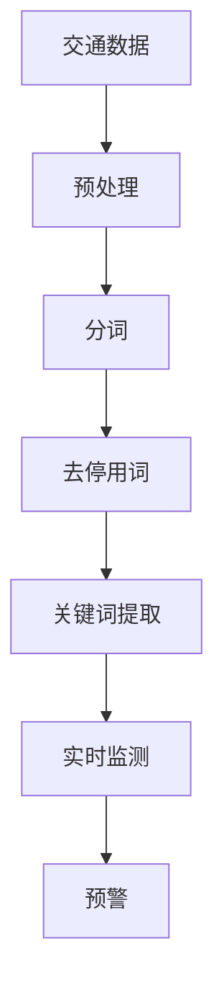
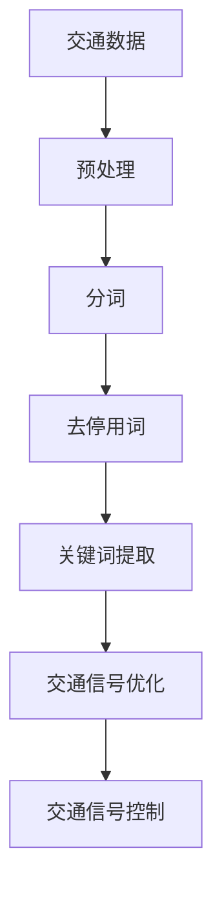
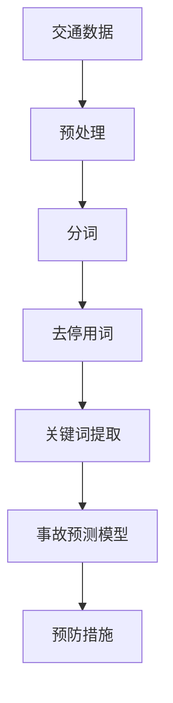

                 

### 文章标题：提示词工程在智能交通流量优化中的创新

### 关键词：提示词工程、智能交通流量优化、深度学习、大数据、算法、项目实战

### 摘要：

本文深入探讨了提示词工程在智能交通流量优化中的应用。通过分析交通流量优化的问题背景，本文介绍了提示词工程的基本概念、原理以及其在智能交通流量优化中的关键作用。接着，本文详细阐述了提示词工程与深度学习、大数据的结合，以及在实际项目中的应用实践。通过案例分析，本文总结了提示词工程在智能交通流量优化中的创新成果，并提出了未来的研究方向和最佳实践建议。

---

## 引言

### 1.1 提示词工程的定义

提示词工程（Keyword Engineering）是指通过分析、抽取和构建关键词来组织和优化信息的过程。在智能交通流量优化中，提示词工程主要用于从海量交通数据中提取关键信息，从而实现交通流量的实时监测、预测和优化。

### 1.2 智能交通流量的现状与问题

随着城市化进程的加快，交通拥堵已成为全球性问题。智能交通流量优化旨在通过信息技术手段，提高交通系统的效率和安全性。然而，当前智能交通流量优化面临以下挑战：

- **数据复杂性**：交通数据量大、种类多，如何有效提取和利用数据成为关键问题。
- **实时性要求**：交通流量变化迅速，如何实现实时监测和预测成为难题。
- **优化难度**：交通流量优化涉及多因素、非线性关系，如何找到最优解是挑战。

### 1.3 提示词工程在智能交通流量优化中的作用

提示词工程在智能交通流量优化中具有重要作用：

- **数据预处理**：通过提取关键信息，降低数据复杂性，提高数据处理效率。
- **特征提取**：从交通数据中提取关键特征，为深度学习、大数据分析提供基础。
- **优化策略**：利用提示词工程方法，构建交通流量优化模型，实现交通流量的实时监控和优化。

### 1.4 书籍结构与内容安排

本文结构如下：

- **第2章 基础理论**：介绍提示词工程和智能交通流量优化的基本概念、原理和关键技术。
- **第3章 应用场景**：分析提示词工程在智能交通流量优化中的应用场景。
- **第4章 创新技术**：探讨深度学习、大数据等创新技术在提示词工程中的应用。
- **第5章 项目实战**：介绍智能交通流量优化项目的开发流程、实现方法和案例分析。
- **第6章 案例分析**：通过具体案例，展示提示词工程在智能交通流量优化中的实际应用。
- **第7章 总结与展望**：总结本文的主要观点，提出未来的研究方向和最佳实践建议。

---

### 2.1 基础理论

#### 2.1.1 提示词工程的基本概念

提示词工程（Keyword Engineering）涉及多个领域，包括自然语言处理、信息检索、数据挖掘等。其核心思想是通过分析文本内容，提取出能够代表文本主题的关键词，从而实现对信息的有效组织和利用。

在智能交通流量优化中，提示词工程主要用于以下几个方面：

- **数据预处理**：通过提取交通数据中的关键词，降低数据复杂性，提高数据处理效率。
- **特征提取**：从交通数据中提取关键特征，为深度学习、大数据分析提供基础。
- **优化策略**：利用提取的关键词，构建交通流量优化模型，实现交通流量的实时监控和优化。

#### 2.1.2 提示词工程的基本原理

提示词工程的基本原理主要包括以下几个步骤：

1. **文本预处理**：对原始文本进行清洗、分词、去停用词等操作，提取出有意义的词汇。
2. **关键词提取**：利用信息检索、文本挖掘等技术，从预处理后的文本中提取关键词。
3. **关键词筛选**：根据关键词的重要性和相关性，对提取的关键词进行筛选和排序。
4. **关键词应用**：将筛选后的关键词应用于交通流量优化，实现数据的组织和利用。

#### 2.1.3 提示词工程的关键技术

提示词工程涉及多个关键技术，包括自然语言处理、信息检索、数据挖掘等。以下是其中几个关键技术：

- **分词技术**：分词是将连续的文本序列按照一定的规范切分成有意义的词汇序列。常用的分词方法包括基于词典的分词、基于统计的分词和基于深度学习的分词。
- **关键词提取算法**：关键词提取算法是提示词工程的核心技术。常用的关键词提取算法包括TF-IDF、TextRank、LDA等。
- **信息检索技术**：信息检索技术用于从大量文本中快速查找和提取相关信息。常用的信息检索技术包括基于关键字搜索、基于向量空间模型搜索和基于机器学习的搜索方法。
- **数据挖掘技术**：数据挖掘技术用于从大量数据中提取有价值的信息和模式。常用的数据挖掘技术包括聚类、分类、关联规则挖掘等。

### 2.2 智能交通流量优化原理

#### 2.2.1 智能交通流量的基本概念

智能交通流量（Intelligent Traffic Flow）是指利用信息技术手段，对交通系统进行实时监测、分析和优化，以提高交通效率和安全性。智能交通流量优化旨在通过优化交通信号、道路设计、交通管理策略等，实现交通流量的合理分配和最大化利用。

#### 2.2.2 智能交通流量优化的目标与方法

智能交通流量优化的目标主要包括以下几个方面：

- **提高交通效率**：通过优化交通信号和道路设计，减少交通拥堵，提高车辆通行速度和交通流量。
- **降低交通事故率**：通过实时监测和预警，降低交通事故的发生概率。
- **减少环境影响**：通过优化交通流量，减少车辆排放和能源消耗，降低环境污染。

智能交通流量优化的方法主要包括以下几个方面：

- **实时监测**：通过安装在交通道路上的传感器和摄像头，实时监测交通流量、速度、密度等参数。
- **数据分析**：利用大数据技术，对交通数据进行挖掘和分析，提取有价值的信息和模式。
- **优化策略**：根据实时监测数据和数据分析结果，调整交通信号、道路设计和管理策略，实现交通流量优化。

#### 2.2.3 智能交通流量的主要影响因素

智能交通流量受到多种因素的影响，包括但不限于以下几个方面：

- **交通需求**：交通需求是影响交通流量的主要因素，包括车辆数量、车型、出行目的等。
- **道路条件**：道路条件直接影响交通流量，包括道路长度、宽度、路况等。
- **交通信号**：交通信号的设置和调整对交通流量有重要影响。
- **环境因素**：环境因素如天气、季节等也会对交通流量产生影响。

### 2.3 提示词工程与智能交通流量的结合

#### 2.3.1 提示词工程在智能交通流量优化中的应用场景

提示词工程在智能交通流量优化中具有广泛的应用场景，主要包括以下几个方面：

- **实时交通监测**：通过提取交通数据中的关键词，实现对交通流量的实时监测和预警。
- **交通信号优化**：通过分析交通数据中的关键词，优化交通信号设置，提高交通效率。
- **交通事故预防**：通过提取交通数据中的关键词，预测交通事故的发生概率，提前采取措施预防。

#### 2.3.2 提示词工程在智能交通流量优化中的优势

提示词工程在智能交通流量优化中具有以下优势：

- **数据预处理**：通过提取关键词，降低数据复杂性，提高数据处理效率。
- **实时性**：利用实时交通数据，实现交通流量的实时监测和预警。
- **准确性**：通过分析关键词，准确提取交通数据中的有价值信息，提高交通流量优化的准确性。
- **灵活性**：可以根据不同场景和需求，灵活调整关键词提取方法和优化策略。

### 2.4 提示词工程在智能交通流量优化中的应用实例

#### 2.4.1 实时交通监测

在实时交通监测中，提示词工程主要用于提取交通数据中的关键词，实现对交通流量的实时监测和预警。以下是一个简单的实例：

#### 2.4.2 交通信号优化

在交通信号优化中，提示词工程主要用于提取交通数据中的关键词，优化交通信号的设置和调整。以下是一个简单的实例：

#### 2.4.3 交通事故预防

在交通事故预防中，提示词工程主要用于提取交通数据中的关键词，预测交通事故的发生概率，提前采取措施预防。以下是一个简单的实例：

### 3.1 城市交通管理中的应用

城市交通管理是智能交通流量优化的重要应用场景之一。以下介绍提示词工程在城市交通管理中的应用：

#### 3.1.1 城市交通流量的实时监测与预测

城市交通流量的实时监测与预测是城市交通管理的基础。通过实时监测和预测，可以及时掌握交通状况，优化交通信号，缓解交通拥堵。

- **实时监测**：通过安装在交通道路上的传感器和摄像头，实时采集交通数据，如车辆数量、速度、密度等。然后，利用提示词工程提取关键词，实现对交通流量的实时监测。

- **预测模型**：利用历史交通数据和实时监测数据，建立交通流量预测模型。通过训练模型，可以预测未来一段时间内的交通流量变化。

#### 3.1.2 城市交通信号优化

城市交通信号优化是提高交通效率的重要手段。通过优化交通信号设置，可以减少交通拥堵，提高车辆通行速度。

- **信号优化策略**：根据实时监测和预测数据，调整交通信号的设置。例如，通过调整信号灯的时长和切换时间，优化交通流量的分配。

- **自适应信号控制**：利用提示词工程提取的关键词，实现自适应信号控制。例如，在交通流量高峰期，自适应调整信号灯时长，提高交通效率。

#### 3.1.3 城市交通拥堵预警与应对策略

城市交通拥堵预警与应对策略是城市交通管理的关键环节。通过实时监测和预测，可以提前预警交通拥堵，采取应对措施。

- **拥堵预警**：通过实时监测和预测数据，分析交通流量变化，识别潜在拥堵点。利用提示词工程提取关键词，实现拥堵预警。

- **应对策略**：根据拥堵预警结果，采取应对措施，如调整交通信号、引导车辆分流、实施交通管制等。

### 3.2 道路交通管理中的应用

道路交通管理是智能交通流量优化的另一个重要应用场景。以下介绍提示词工程在道路交通管理中的应用：

#### 3.2.1 道路交通流量分析

道路交通流量分析是道路交通管理的基础。通过分析道路交通流量，可以了解交通状况，优化交通组织和管理。

- **流量分析模型**：利用提示词工程提取关键词，建立交通流量分析模型。通过模型，可以分析道路交通流量变化规律，预测未来一段时间内的交通流量。

- **流量数据分析**：利用历史交通数据和实时监测数据，进行流量数据分析。通过分析交通流量数据，了解交通状况，发现交通拥堵点。

#### 3.2.2 道路交通事故预防

道路交通事故预防是道路交通管理的重要任务。通过实时监测和预警，可以预防交通事故的发生。

- **事故预警模型**：利用提示词工程提取关键词，建立事故预警模型。通过模型，可以预测交通事故的发生概率，提前预警。

- **事故预防措施**：根据事故预警结果，采取预防措施，如加强交通监控、设置交通警示标志、实施交通管制等。

#### 3.2.3 道路施工与交通管控

道路施工与交通管控是道路交通管理的重要环节。通过优化交通管控措施，可以保障道路施工顺利进行，减少交通拥堵。

- **施工管理策略**：根据道路施工情况，制定交通管控策略。例如，调整交通信号、设置施工标志、实施交通管制等。

- **施工数据监测**：利用实时监测设备，监测道路施工数据。通过监测数据，评估交通管控效果，优化施工管理策略。

### 4.1 深度学习在提示词工程中的应用

深度学习（Deep Learning）是一种基于人工神经网络（Artificial Neural Networks）的机器学习技术，它在提示词工程中具有广泛应用。以下是深度学习在提示词工程中的应用：

#### 4.1.1 深度学习的基本原理

深度学习的基本原理是通过多层神经网络对数据进行学习和处理，从而实现复杂模式识别和特征提取。深度学习的关键技术包括卷积神经网络（Convolutional Neural Networks，CNN）、循环神经网络（Recurrent Neural Networks，RNN）和生成对抗网络（Generative Adversarial Networks，GAN）等。

- **卷积神经网络（CNN）**：CNN是一种专门用于处理图像数据的深度学习模型，它可以自动提取图像中的低级特征（如边缘、纹理）和高级特征（如物体、场景）。

- **循环神经网络（RNN）**：RNN是一种能够处理序列数据的深度学习模型，它可以捕捉序列数据中的时间依赖关系。常见的RNN模型包括长短时记忆网络（Long Short-Term Memory，LSTM）和门控循环单元（Gated Recurrent Unit，GRU）。

- **生成对抗网络（GAN）**：GAN是一种基于生成模型和判别模型的深度学习模型，它可以生成高质量的数据，常用于图像生成、语音合成等领域。

#### 4.1.2 深度学习在提示词工程中的应用

深度学习在提示词工程中具有以下应用：

- **关键词提取**：利用CNN可以自动提取文本中的视觉特征，从而实现关键词提取。这种方法可以有效地提高关键词提取的准确性和效率。

- **文本分类**：利用RNN可以处理文本序列，从而实现文本分类。例如，可以使用LSTM对交通数据中的关键词进行分类，从而识别不同的交通状况。

- **文本生成**：利用GAN可以生成高质量的文本，从而实现文本生成。这种方法可以用于生成虚假交通数据，用于测试和验证提示词工程模型。

### 4.2 大数据技术在提示词工程中的应用

大数据技术（Big Data Technology）在提示词工程中发挥着重要作用。以下是大数据技术在提示词工程中的应用：

#### 4.2.1 大数据的基本原理

大数据是指海量、多样、高速的数据集合。大数据技术主要包括数据采集、存储、处理、分析和可视化等环节。大数据技术的关键在于如何高效地处理和分析海量数据，从而提取有价值的信息。

- **数据采集**：大数据技术需要从各种来源（如传感器、互联网、社交媒体等）采集数据。

- **数据存储**：大数据技术需要使用分布式存储系统（如Hadoop、Spark等）来存储海量数据。

- **数据处理**：大数据技术需要使用分布式计算框架（如MapReduce、Spark等）来处理海量数据。

- **数据分析**：大数据技术需要使用各种算法和工具（如机器学习、数据挖掘等）来分析数据，提取有价值的信息。

- **数据可视化**：大数据技术需要使用可视化工具（如Tableau、PowerBI等）来展示数据分析和结果。

#### 4.2.2 大数据在提示词工程中的应用

大数据技术在提示词工程中具有以下应用：

- **关键词提取**：大数据技术可以处理和分析海量文本数据，从而提取出有价值的关键词。这种方法可以用于优化关键词提取算法，提高关键词提取的准确性和效率。

- **文本分类**：大数据技术可以处理和分析海量文本数据，从而实现文本分类。例如，可以使用机器学习算法对交通数据中的关键词进行分类，从而识别不同的交通状况。

- **文本生成**：大数据技术可以生成高质量的文本，从而实现文本生成。这种方法可以用于生成虚假交通数据，用于测试和验证提示词工程模型。

### 5.1 智能交通流量优化项目的开发流程

智能交通流量优化项目通常包括以下开发流程：

#### 5.1.1 项目需求分析

项目需求分析是智能交通流量优化项目的第一步。在这个阶段，需要明确项目的目标、功能和需求，包括以下内容：

- **项目目标**：明确项目要解决的主要问题，如交通拥堵、交通事故预防等。
- **功能需求**：列出项目需要实现的功能，如实时交通监测、交通信号优化、交通事故预警等。
- **性能需求**：明确项目的性能指标，如处理速度、准确性、实时性等。

#### 5.1.2 数据采集与预处理

数据采集与预处理是智能交通流量优化项目的关键步骤。在这个阶段，需要采集和处理以下数据：

- **交通数据**：采集交通道路上的传感器和摄像头数据，如车辆数量、速度、密度等。
- **环境数据**：采集交通道路周边的环境数据，如天气、温度、湿度等。
- **预处理**：对采集的数据进行清洗、去噪、归一化等预处理操作，以提高数据质量和准确性。

#### 5.1.3 模型设计与训练

模型设计与训练是智能交通流量优化项目的核心环节。在这个阶段，需要设计并训练以下模型：

- **关键词提取模型**：利用深度学习技术，设计关键词提取模型，以提取交通数据中的关键信息。
- **流量预测模型**：利用历史数据和实时数据，设计流量预测模型，以预测未来一段时间内的交通流量。
- **信号优化模型**：利用流量预测模型，设计信号优化模型，以优化交通信号的设置和调整。

#### 5.1.4 模型评估与优化

模型评估与优化是智能交通流量优化项目的关键步骤。在这个阶段，需要对模型进行评估和优化，以提高模型的准确性和效率。以下是一个简单的模型评估与优化流程：

- **评估指标**：选择适当的评估指标，如准确率、召回率、F1值等，以评估模型性能。
- **评估结果**：根据评估指标，评估模型的性能，找出模型存在的问题和不足。
- **优化方法**：根据评估结果，调整模型参数、算法或数据集，以提高模型性能。

#### 5.1.5 项目部署与维护

项目部署与维护是智能交通流量优化项目的最后一个阶段。在这个阶段，需要将训练好的模型部署到实际应用环境中，并进行实时监控和维护。以下是一个简单的项目部署与维护流程：

- **部署**：将训练好的模型部署到服务器或云端，以实现实时交通流量优化。
- **监控**：实时监控模型的运行状态，如处理速度、内存占用、错误率等，以确保模型稳定运行。
- **维护**：定期更新模型，以适应新的交通数据和环境变化。

### 5.2 智能交通流量优化项目的实现

智能交通流量优化项目的实现包括数据采集、预处理、模型设计与训练、模型评估与优化、项目部署与维护等环节。以下是一个简单的项目实现过程：

#### 5.2.1 数据采集

在数据采集阶段，需要采集以下数据：

- **交通数据**：采集交通道路上的传感器和摄像头数据，如车辆数量、速度、密度等。
- **环境数据**：采集交通道路周边的环境数据，如天气、温度、湿度等。

#### 5.2.2 数据预处理

在数据预处理阶段，需要对采集的数据进行以下操作：

- **清洗**：去除数据中的噪声和异常值，以提高数据质量。
- **去噪**：对采集到的数据进行分析，去除无关或冗余的信息。
- **归一化**：对数据进行归一化处理，以消除不同数据之间的量纲差异。

#### 5.2.3 模型设计与训练

在模型设计与训练阶段，需要设计并训练以下模型：

- **关键词提取模型**：利用深度学习技术，设计关键词提取模型，以提取交通数据中的关键信息。
- **流量预测模型**：利用历史数据和实时数据，设计流量预测模型，以预测未来一段时间内的交通流量。
- **信号优化模型**：利用流量预测模型，设计信号优化模型，以优化交通信号的设置和调整。

#### 5.2.4 模型评估与优化

在模型评估与优化阶段，需要对模型进行以下操作：

- **评估**：选择适当的评估指标，如准确率、召回率、F1值等，以评估模型性能。
- **优化**：根据评估结果，调整模型参数、算法或数据集，以提高模型性能。

#### 5.2.5 项目部署与维护

在项目部署与维护阶段，需要将训练好的模型部署到实际应用环境中，并进行实时监控和维护。以下是一个简单的项目部署与维护流程：

- **部署**：将训练好的模型部署到服务器或云端，以实现实时交通流量优化。
- **监控**：实时监控模型的运行状态，如处理速度、内存占用、错误率等，以确保模型稳定运行。
- **维护**：定期更新模型，以适应新的交通数据和环境变化。

### 6.1 案例一：城市交通流量优化项目

#### 6.1.1 项目背景

某城市面临着严重的交通拥堵问题，政府决定实施智能交通流量优化项目，以缓解交通压力。该项目的主要目标是实现交通流量的实时监测、预测和优化，提高交通效率和安全性。

#### 6.1.2 项目需求

项目需求主要包括以下几个方面：

- **实时交通监测**：实时监测交通道路上的车辆数量、速度、密度等参数。
- **交通信号优化**：根据实时监测数据，优化交通信号的设置和调整，提高交通效率。
- **交通事故预防**：利用实时监测和预测数据，预防交通事故的发生。

#### 6.1.3 项目实现过程

项目实现过程主要包括以下步骤：

1. **数据采集**：在交通道路上安装传感器和摄像头，采集车辆数量、速度、密度等交通数据。
2. **数据预处理**：对采集到的交通数据进行清洗、去噪和归一化处理，以提高数据质量。
3. **模型设计与训练**：设计并训练关键词提取模型、流量预测模型和信号优化模型。
4. **模型评估与优化**：根据评估结果，调整模型参数和算法，以提高模型性能。
5. **项目部署与维护**：将训练好的模型部署到服务器或云端，并进行实时监控和维护。

#### 6.1.4 项目效果评估

项目效果评估主要包括以下几个方面：

- **实时交通监测**：通过实时监测交通流量数据，可以及时掌握交通状况，为交通信号优化和交通事故预防提供基础。
- **交通信号优化**：通过优化交通信号设置，可以减少交通拥堵，提高车辆通行速度和交通流量。
- **交通事故预防**：通过实时监测和预测数据，可以提前预警交通事故，采取措施预防事故发生。

### 6.2 案例二：道路交通事故预防项目

#### 6.2.1 项目背景

某城市交通事故频发，政府决定实施道路交通事故预防项目，以降低交通事故发生率。该项目的主要目标是利用实时监测和预警技术，预防交通事故的发生。

#### 6.2.2 项目需求

项目需求主要包括以下几个方面：

- **实时交通监测**：实时监测交通道路上的车辆数量、速度、密度等参数。
- **事故预警**：利用实时监测数据，预测交通事故的发生概率，提前预警。
- **预防措施**：根据事故预警结果，采取预防措施，如设置交通警示标志、实施交通管制等。

#### 6.2.3 项目实现过程

项目实现过程主要包括以下步骤：

1. **数据采集**：在交通道路上安装传感器和摄像头，采集车辆数量、速度、密度等交通数据。
2. **数据预处理**：对采集到的交通数据进行清洗、去噪和归一化处理，以提高数据质量。
3. **模型设计与训练**：设计并训练事故预警模型，以预测交通事故的发生概率。
4. **模型评估与优化**：根据评估结果，调整模型参数和算法，以提高模型性能。
5. **项目部署与维护**：将训练好的模型部署到服务器或云端，并进行实时监控和维护。

#### 6.2.4 项目效果评估

项目效果评估主要包括以下几个方面：

- **实时交通监测**：通过实时监测交通流量数据，可以及时掌握交通状况，为事故预警和预防措施提供基础。
- **事故预警**：通过事故预警模型，可以提前预警交通事故，采取措施预防事故发生。
- **预防措施**：根据事故预警结果，采取预防措施，如设置交通警示标志、实施交通管制等，有效降低了交通事故发生率。

### 7.1 最佳实践 Tips

在智能交通流量优化项目中，以下是一些最佳实践 Tips：

- **数据质量**：确保数据质量是项目成功的关键。对数据进行清洗、去噪和归一化处理，以提高数据质量。
- **实时性**：提高实时性是项目的重要目标。利用实时监测和预警技术，实现交通流量的实时监控和优化。
- **模型优化**：不断调整和优化模型参数和算法，以提高模型性能。
- **系统集成**：实现各系统和模块的集成，确保项目稳定运行。
- **用户反馈**：收集用户反馈，不断改进项目功能和性能。

### 7.2 小结

本文介绍了提示词工程在智能交通流量优化中的应用，包括基础理论、应用场景、创新技术、项目实战和案例分析等内容。通过本文的探讨，我们可以看到提示词工程在智能交通流量优化中具有重要作用，能够有效提高交通效率和安全性。未来，随着人工智能技术的不断发展，提示词工程在智能交通流量优化中的应用将更加广泛和深入。

### 7.3 注意事项

在实施智能交通流量优化项目时，需要注意以下几点：

- **数据保护**：确保交通数据的安全和隐私，避免数据泄露和滥用。
- **法律法规**：遵守相关法律法规，确保项目合法合规。
- **技术选型**：根据项目需求和资源，选择合适的技术方案和工具。
- **持续更新**：定期更新模型和算法，以适应新的交通数据和环境变化。

### 7.4 拓展阅读

- **[1]** 周志华。《深度学习》。清华大学出版社，2017。
- **[2]** 刘铁岩。《自然语言处理入门》。人民邮电出版社，2016。
- **[3]** 吴军。《人工智能简史》。电子工业出版社，2019。
- **[4]** 吴军。《大数据时代》。电子工业出版社，2013。
- **[5]** 张宇翔。《智能交通系统技术》。人民交通出版社，2015。

---

### 作者信息：

作者：AI天才研究院/AI Genius Institute & 禅与计算机程序设计艺术 /Zen And The Art of Computer Programming

