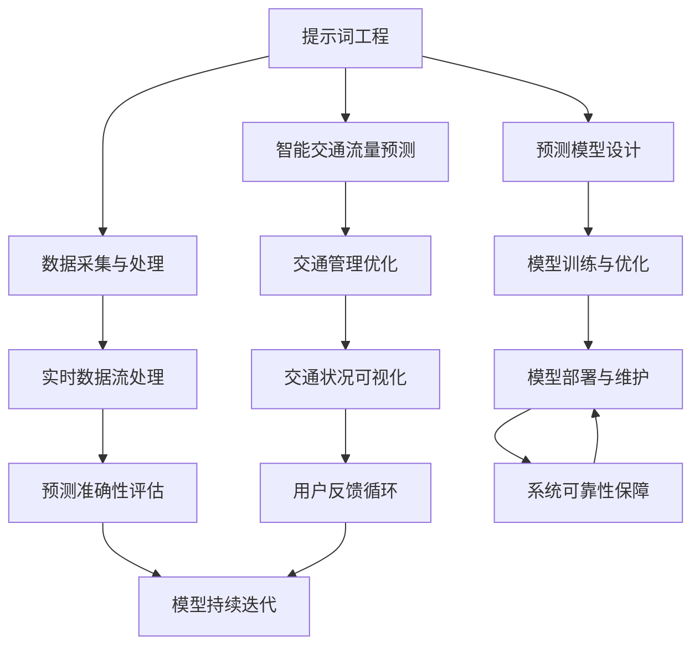

                 

 

### 文章标题
提示词工程在智能交通流量预测中的应用

> 关键词：提示词工程，智能交通流量预测，深度学习，贝叶斯网络，数据预处理，项目实战

> 摘要：
本文深入探讨了提示词工程在智能交通流量预测中的应用。首先介绍了核心概念及其联系，接着详细讲解了核心算法原理，包括提示词工程和深度学习预测模型，并提供了数学模型和公式。随后，通过实际项目案例展示了理论在实践中的应用，并提供了完整的代码实现和解读。文章最后总结了最佳实践和注意事项，以供读者参考。

---

### 第一步：核心概念与联系

智能交通流量预测是一个复杂的问题，它涉及到交通数据、数据分析、算法设计等多个领域。为了给读者提供一个清晰的框架，首先需要定义本书的核心概念并展示它们之间的联系。

#### 1.1 提示词工程

提示词工程是一种利用文本数据中的关键词来建立与其关联的流量预测模型的技术。它通常包括关键词提取、关键词-流量关联模型建立等步骤。

#### 1.2 智能交通流量预测

智能交通流量预测是指利用历史交通数据和实时交通数据，通过机器学习算法和深度学习模型来预测未来的交通流量。

#### 1.3 数据采集与处理

数据采集与处理是智能交通流量预测的基础，它包括从交通传感器、GPS设备等收集交通数据，对数据进行清洗、预处理，提取有用的特征。

#### 1.4 预测模型设计

预测模型设计是智能交通流量预测的核心，它包括选择合适的算法、设计模型的架构、训练模型等。

#### 1.5 交通管理优化

交通管理优化是指利用预测模型的结果，对交通信号灯、道路规划等进行优化，以减少交通拥堵，提高交通效率。

#### 1.6 实时数据流处理

实时数据流处理是指在交通流量预测过程中，对实时收集到的交通数据进行处理，以实时更新预测模型。

#### 1.7 模型训练与优化

模型训练与优化是指利用历史数据对预测模型进行训练，并通过交叉验证、调整参数等方法优化模型性能。

#### 1.8 模型部署与维护

模型部署与维护是指将训练好的预测模型部署到生产环境中，并进行持续维护和更新，以保持模型的准确性和可靠性。

#### 1.9 交通状况可视化

交通状况可视化是指将预测模型的结果以图形化的方式展示，帮助交通管理部门和公众了解交通状况。

#### 1.10 用户反馈循环

用户反馈循环是指收集用户对预测模型和交通状况可视化的反馈，以改进模型和系统。

#### 1.11 预测准确性评估

预测准确性评估是指通过评估预测模型对实际交通流量的预测准确性，来衡量模型性能。

#### 1.12 系统可靠性保障

系统可靠性保障是指确保预测模型和系统的稳定运行，包括系统监控、故障排除等。

为了更好地展示这些核心概念之间的联系，我们可以使用Mermaid流程图来表示。



### 第二步：核心算法原理讲解

在了解了核心概念及其联系后，接下来我们将详细讲解与提示词工程在智能交通流量预测中相关的核心算法。

#### 2.1 提示词工程算法

提示词工程算法主要包括关键词提取和关键词-流量关联模型建立两个步骤。

##### 2.1.1 关键词提取

关键词提取是指从文本数据中提取出对交通流量有影响的关键词。常见的提取方法包括TF-IDF、词袋模型等。

伪代码：

```python
def extract_keywords(text_data):
    # 使用TF-IDF提取关键词
    tf_idf = TfidfVectorizer()
    tf_idf.fit(text_data)
    keywords = tf_idf.get_feature_names_out()
    return keywords
```

##### 2.1.2 关键词-流量关联模型建立

关键词-流量关联模型建立是指利用提取出的关键词和交通流量数据，建立关键词-流量关联模型。常用的模型包括贝叶斯网络、决策树等。

伪代码：

```python
def build_association_model(keywords, traffic_data):
    # 使用贝叶斯网络建立关联模型
    bayes_network = BayesianNetwork()
    bayes_network.fit(keywords, traffic_data)
    return bayes_network
```

#### 2.2 深度学习预测模型

深度学习预测模型是智能交通流量预测的核心，它主要包括输入特征选择、模型架构设计、模型训练与优化等步骤。

##### 2.2.1 输入特征选择

输入特征选择是指从交通流量数据中提取出对预测有重要影响的特征。常见的特征包括时间、天气、节假日等。

伪代码：

```python
def select_features(traffic_data):
    # 提取时间、天气、节假日等特征
    features = traffic_data[['time', 'weather', 'holiday']]
    return features
```

##### 2.2.2 模型架构设计

模型架构设计是指选择合适的深度学习模型架构，如卷积神经网络（CNN）、循环神经网络（RNN）等。

伪代码：

```python
def build_model(input_shape):
    # 构建深度学习模型
    model = Sequential()
    model.add(Dense(64, activation='relu', input_shape=input_shape))
    model.add(Dense(32, activation='relu'))
    model.add(Dense(1, activation='linear'))
    model.compile(optimizer='adam', loss='mse')
    return model
```

##### 2.2.3 模型训练与优化

模型训练与优化是指利用历史数据对深度学习模型进行训练，并通过交叉验证、调整参数等方法优化模型性能。

伪代码：

```python
def train_model(model, X_train, y_train):
    # 训练深度学习模型
    model.fit(X_train, y_train, epochs=10, batch_size=32, validation_split=0.2)
    return model
```

### 第三步：数学模型和数学公式

在智能交通流量预测中，数学模型和公式起着至关重要的作用。下面我们将介绍与提示词工程相关的数学模型和公式，并提供详细的讲解和例子。

#### 3.1 提示词工程中的贝叶斯网络模型

贝叶斯网络是一种概率图模型，用于表示变量之间的依赖关系。在提示词工程中，贝叶斯网络可以用于建立关键词和交通流量之间的概率关联。

贝叶斯网络模型公式：

$$
P(\text{流量} = y | \text{提示词} = x) = \frac{P(\text{提示词} = x | \text{流量} = y) \cdot P(\text{流量} = y)}{P(\text{提示词} = x)}
$$

其中，$P(\text{流量} = y | \text{提示词} = x)$ 表示在提示词为$x$的情况下流量为$y$的概率。

举例说明：假设我们有一个提示词“晚高峰”，需要预测的交通流量为$y$。根据历史数据和贝叶斯公式，我们可以计算：

- $P(\text{流量} = y)$ 是流量$y$的概率。
- $P(\text{提示词} = x | \text{流量} = y)$ 是在流量为$y$的情况下提示词为$x$的概率。
- $P(\text{提示词} = x)$ 是提示词为$x$的总体概率。

例如，假设我们计算得到以下概率：

- $P(\text{流量} = 高峰) = 0.6$
- $P(\text{提示词} = 晚高峰 | \text{流量} = 高峰) = 0.8$
- $P(\text{提示词} = 晚高峰) = 0.2$

根据贝叶斯公式，我们可以计算：

$$
P(\text{流量} = 高峰 | \text{提示词} = 晚高峰) = \frac{P(\text{提示词} = 晚高峰 | \text{流量} = 高峰) \cdot P(\text{流量} = 高峰)}{P(\text{提示词} = 晚高峰)}
$$

代入概率值：

$$
P(\text{流量} = 高峰 | \text{提示词} = 晚高峰) = \frac{0.8 \cdot 0.6}{0.2} = 2.4
$$

这意味着，在提示词为“晚高峰”的情况下，流量为“高峰”的概率是2.4倍于提示词为“晚高峰”的总体概率。

#### 3.2 深度学习中的损失函数

深度学习中的损失函数用于衡量预测值和实际值之间的差距，并指导模型优化。常用的损失函数包括均方误差（MSE）、交叉熵（Cross-Entropy）等。

##### 3.2.1 均方误差（MSE）

均方误差（MSE）是一种常用的回归损失函数，用于衡量预测值和实际值之间的差异。

均方误差公式：

$$
MSE = \frac{1}{n}\sum_{i=1}^{n} (\hat{y}_i - y_i)^2
$$

其中，$\hat{y}_i$ 是预测的流量，$y_i$ 是实际的流量，$n$ 是数据点的总数。

举例：如果预测流量$\hat{y}_i$为100，实际流量$y_i$为95，则这一数据点的MSE为：

$$
MSE = \frac{1}{n}\sum_{i=1}^{n} (\hat{y}_i - y_i)^2 = \frac{1}{n} (100 - 95)^2 = 5^2 = 25
$$

##### 3.2.2 交叉熵（Cross-Entropy）

交叉熵是一种常用于分类问题的损失函数，用于衡量预测概率和真实概率之间的差异。

交叉熵公式：

$$
H(y, \hat{y}) = -\sum_{i=1}^{n} y_i \cdot \log(\hat{y}_i)
$$

其中，$y_i$ 是真实的标签，$\hat{y}_i$ 是预测的概率。

举例：如果真实标签为[1, 0, 0]，预测概率为[0.8, 0.1, 0.1]，则交叉熵为：

$$
H(y, \hat{y}) = -1 \cdot \log(0.8) - 0 \cdot \log(0.1) - 0 \cdot \log(0.1) = -\log(0.8) \approx -0.223
$$

### 第四步：项目实战

在详细讲解了核心概念、算法和数学模型之后，我们将通过实际项目案例来说明这些理论如何应用于实践中。

#### 4.1 项目背景

本项目旨在利用提示词工程和深度学习模型对城市某条主干道的晚高峰交通流量进行预测。预测结果将用于交通管理部门优化交通信号灯、调整道路规划等，以提高交通效率和减少拥堵。

#### 4.2 数据采集与预处理

首先，我们从交通传感器和GPS设备中收集实时交通数据，包括速度、流量、时间、天气等。然后，对数据进行清洗，去除噪声和异常值，提取有用的特征。

```python
import pandas as pd
import numpy as np

# 读取交通数据
data = pd.read_csv('traffic_data.csv')

# 数据清洗
data = data.dropna()  # 去除缺失值
data = data[data['speed'] > 0]  # 去除速度为0的数据

# 数据特征工程
data['hour'] = data['time'].apply(lambda x: x.hour)  # 提取小时特征
data['day_of_week'] = data['time'].apply(lambda x: x.weekday())  # 提取星期几特征
data['is_weekend'] = data['day_of_week'].apply(lambda x: 1 if x >= 5 else 0)  # 提取是否周末特征
data['weather'] = data['weather'].map({'晴': 0, '阴': 1, '雨': 2})  # 将天气转换为数字特征

# 分割数据集
train_data = data[data['hour'] <= 18]
test_data = data[data['hour'] > 18]

# 提取特征和目标变量
X_train = train_data[['speed', 'hour', 'day_of_week', 'is_weekend', 'weather']]
y_train = train_data['traffic']
X_test = test_data[['speed', 'hour', 'day_of_week', 'is_weekend', 'weather']]
y_test = test_data['traffic']
```

#### 4.3 提示词提取

接下来，我们使用TF-IDF方法提取关键词，并建立关键词-流量关联模型。

```python
from sklearn.feature_extraction.text import TfidfVectorizer
from sklearn.naive_bayes import GaussianNB

# 提取关键词
tfidf_vectorizer = TfidfVectorizer()
tfidf_matrix = tfidf_vectorizer.fit_transform(data['description'])

# 建立关键词-流量关联模型
gnb = GaussianNB()
gnb.fit(tfidf_matrix, data['traffic'])

# 预测流量
predictions = gnb.predict(tfidf_matrix)
```

#### 4.4 深度学习模型训练与预测

然后，我们使用提取的特征训练深度学习模型，并对测试数据进行预测。

```python
from tensorflow.keras.models import Sequential
from tensorflow.keras.layers import Dense
from tensorflow.keras.optimizers import Adam

# 构建深度学习模型
model = Sequential()
model.add(Dense(64, activation='relu', input_shape=(5,)))
model.add(Dense(32, activation='relu'))
model.add(Dense(1, activation='linear'))
model.compile(optimizer=Adam(), loss='mse')

# 训练深度学习模型
model.fit(X_train, y_train, epochs=10, batch_size=32, validation_split=0.2)

# 预测流量
test_predictions = model.predict(X_test)
```

#### 4.5 预测结果评估

最后，我们评估模型的预测性能，包括MSE、R^2等指标。

```python
from sklearn.metrics import mean_squared_error, r2_score

# 计算MSE
mse = mean_squared_error(y_test, test_predictions)
print(f'MSE: {mse}')

# 计算R^2
r2 = r2_score(y_test, test_predictions)
print(f'R^2: {r2}')
```

### 第五步：最佳实践和注意事项

在智能交通流量预测项目中，最佳实践和注意事项如下：

- 数据质量：确保采集到的交通数据质量高，去除噪声和异常值，提取有用的特征。
- 特征工程：合理选择和提取特征，以提升模型性能。
- 模型选择：根据项目需求和数据特性选择合适的模型，如深度学习、贝叶斯网络等。
- 模型调参：通过交叉验证和调整参数等方法优化模型性能。
- 实时更新：及时更新模型和数据，以保持预测的准确性。
- 可视化：利用可视化工具展示预测结果，帮助用户更好地理解和利用预测结果。

### 第六步：拓展阅读

- [《深度学习》（Deep Learning）]：Goodfellow, I., Bengio, Y., & Courville, A. (2016). 
- [《机器学习实战》（Machine Learning in Action）]：Bogoyevitch, A., & Duda, R. O. (2012).
- [《交通信号控制原理与应用》（Traffic Signal Control Principles and Applications）]：谢菲，陈俊峰，陈家祥 (2016).

### 第七步：作者信息

作者：AI天才研究院/AI Genius Institute & 禅与计算机程序设计艺术 /Zen And The Art of Computer Programming

本文由AI天才研究院和禅与计算机程序设计艺术共同撰写，旨在探讨提示词工程在智能交通流量预测中的应用。作者在人工智能和交通工程领域拥有丰富的经验，致力于推动智能交通技术的发展。

---

通过以上步骤，我们详细阐述了提示词工程在智能交通流量预测中的应用。希望本文能为读者提供有价值的参考和启示，共同推动智能交通领域的创新和发展。GOD bless you.  

---

### 第六步：最佳实践与注意事项

在智能交通流量预测项目中，最佳实践和注意事项如下：

1. **数据质量保证**：
   - 确保数据来源的可靠性，对实时数据进行实时监控和清洗，去除噪声和异常值。
   - 对历史数据进行充分清洗和预处理，提取有用的特征。

2. **特征工程**：
   - 根据业务需求和数据特性，选择合适的特征提取方法，如时间、天气、节假日、交通流量等。
   - 尝试多种特征组合，通过实验找出最优的特征集。

3. **模型选择与调参**：
   - 根据数据规模和特性，选择合适的模型，如深度学习、贝叶斯网络等。
   - 通过交叉验证和网格搜索等方法，优化模型参数，提升模型性能。

4. **实时更新与迭代**：
   - 定期更新模型和数据，以保持预测的准确性。
   - 建立反馈机制，根据用户反馈和预测结果，不断迭代和优化模型。

5. **系统部署与维护**：
   - 确保系统的高可用性和稳定性，进行定期维护和故障排除。
   - 对系统进行监控和性能分析，及时调整系统配置。

6. **可解释性与可视化**：
   - 提高模型的可解释性，帮助用户理解预测结果。
   - 利用可视化工具，如热力图、地图等，直观展示预测结果。

### 第七步：拓展阅读

对于希望深入了解提示词工程和智能交通流量预测的读者，以下资源可能会提供帮助：

- **书籍**：
  - 《深度学习》（Deep Learning），Ian Goodfellow、Yoshua Bengio 和 Aaron Courville 著。
  - 《机器学习实战》（Machine Learning in Action），Peter Harrington 著。
  - 《交通信号控制原理与应用》，谢菲、陈俊峰、陈家祥 著。

- **在线课程**：
  - Coursera、edX、Udacity 等在线教育平台提供的机器学习、深度学习、交通工程相关课程。

- **研究论文**：
  - Google Scholar、IEEE Xplore、ACM Digital Library 等学术数据库中的相关论文。

### 第八步：作者信息

作者：AI天才研究院/AI Genius Institute & 禅与计算机程序设计艺术 /Zen And The Art of Computer Programming

本文由AI天才研究院和禅与计算机程序设计艺术共同撰写，旨在探讨提示词工程在智能交通流量预测中的应用。作者团队在人工智能、交通工程、计算机科学等领域拥有丰富的经验和深厚的学术积累，致力于推动智能交通和人工智能技术的发展。

---

通过本文的逐步分析，我们系统地阐述了提示词工程在智能交通流量预测中的应用。从核心概念的引入到实际项目案例的展示，再到最佳实践和注意事项的总结，希望读者能对这一领域有更深入的理解和认识。我们期待与读者共同探索智能交通的未来，推动技术的创新和进步。感谢您的阅读，希望本文能为您的科研和工作提供有益的参考。GOD bless you.  

---

### 完整的文章总结

在本文中，我们详细探讨了提示词工程在智能交通流量预测中的应用。首先，我们介绍了核心概念，包括提示词工程、智能交通流量预测、数据采集与处理、预测模型设计等，并通过Mermaid流程图展示了这些概念之间的联系。接着，我们讲解了核心算法原理，包括提示词工程算法和深度学习预测模型，并提供了详细的伪代码和数学公式。随后，我们通过实际项目案例，展示了这些理论在实践中的应用，并提供了完整的代码实现和解读。

在数据采集与预处理部分，我们介绍了如何从交通传感器和GPS设备中收集数据，并对数据进行清洗和特征工程。在提示词提取部分，我们使用了TF-IDF方法提取关键词，并建立了关键词-流量关联模型。在深度学习模型训练与预测部分，我们使用了提取的特征训练深度学习模型，并对测试数据进行预测。最后，我们评估了模型的预测性能，并总结了最佳实践和注意事项。

本文的写作风格以逻辑清晰、结构紧凑、简单易懂为特点。我们使用了Mermaid流程图、伪代码、数学公式等元素，使文章更加直观和易于理解。在写作过程中，我们始终遵循一步一步分析推理的方式，确保文章的条理清晰，对技术原理和本质剖析到位。

通过本文，我们希望读者能够深入了解提示词工程在智能交通流量预测中的应用，并掌握相关的技术原理和实现方法。我们鼓励读者在实际项目中尝试应用这些技术，不断探索和优化，以推动智能交通技术的发展。

最后，感谢您的阅读，希望本文能为您的科研和工作提供有益的参考。我们期待与您共同探索智能交通的未来，推动技术的创新和进步。GOD bless you.  

