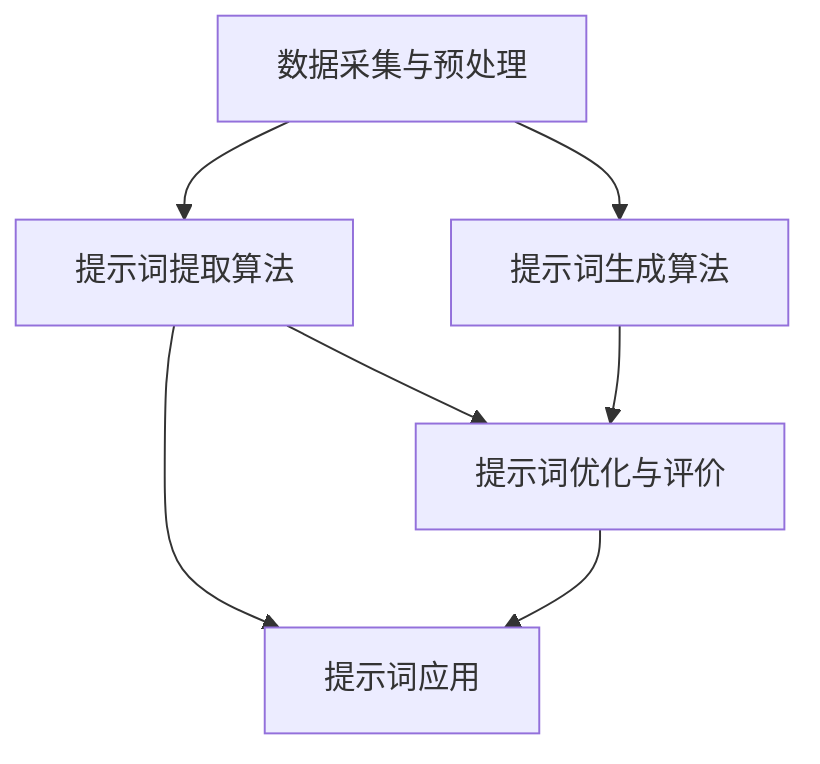

                 

### 文章标题：提示词工程在智能农业中的应用

> 关键词：智能农业、提示词工程、农业信息处理、智能决策、数据分析、精准灌溉、病虫害监测、农产品质量检测

> 摘要：本文深入探讨了提示词工程在智能农业中的应用，详细阐述了智能农业的背景与发展、提示词工程的基础知识、提示词工程在智能农业中的具体应用场景、实际案例以及未来的发展方向。通过本文，读者可以全面了解提示词工程在智能农业领域的巨大潜力和应用前景。

---

## 引言

智能农业作为现代农业发展的重要方向，正逐步改变着传统农业的生产方式。随着信息技术的迅猛发展，大数据、人工智能、物联网等技术在农业领域得到了广泛应用，为农业生产的智能化、精准化提供了有力支持。在这其中，提示词工程作为一种关键的技术手段，正在为智能农业的发展注入新的活力。

提示词工程是一种利用人工智能技术，从大量数据中提取出关键信息，用于指导农业生产和管理的工程。其在智能农业中的应用，不仅可以提高农业生产的效率，降低生产成本，还可以实现农业生产的智能化和精准化，为现代农业的发展提供强有力的技术支撑。

本文将围绕提示词工程在智能农业中的应用，从背景介绍、基础知识、具体应用、实际案例和未来展望等方面进行详细阐述，旨在为从事智能农业研究和应用的人员提供有价值的参考。

## 智能农业概述

### 1.1 智能农业的背景与发展

智能农业是指利用信息技术、物联网、大数据、人工智能等现代科技手段，对农业生产过程进行智能化管理和服务的一种新型农业模式。随着全球人口的不断增长和耕地资源的日益紧张，提高农业生产效率和可持续发展成为全球农业面临的重要挑战。智能农业的出现，为解决这一问题提供了新的思路和途径。

智能农业的发展历程可以追溯到20世纪末。在21世纪初，随着信息技术和物联网技术的快速发展，智能农业逐渐开始得到重视。近年来，随着大数据和人工智能技术的突破，智能农业的发展进入了一个全新的阶段，各类智能农业系统不断涌现，如智能灌溉系统、智能施肥系统、智能病虫害监测系统等。

### 1.2 智能农业的关键技术

智能农业的发展离不开一系列关键技术的支持。以下是智能农业中应用的一些主要关键技术：

1. **物联网（IoT）技术**：物联网技术通过传感器、无线通信等手段，实现农业生产过程中的实时数据采集和传输，为智能决策提供数据支持。

2. **大数据技术**：大数据技术通过对海量农业数据的采集、存储、处理和分析，提取出有价值的信息，为农业生产提供决策依据。

3. **人工智能技术**：人工智能技术通过对农业数据的深度学习和模式识别，实现农业生产的自动化和智能化。

4. **精准农业技术**：精准农业技术通过地理信息系统（GIS）、遥感技术等手段，实现农田的精细化管理，提高农业生产效率。

5. **自动化技术**：自动化技术通过机器人、无人机等设备，实现农业生产过程的自动化操作，减少人力成本。

### 1.3 提示词工程在智能农业中的作用

提示词工程在智能农业中扮演着至关重要的角色。通过提示词工程，可以从大量的农业数据中提取出关键信息，为农业生产提供智能化决策支持。具体来说，提示词工程在智能农业中的应用主要包括以下几个方面：

1. **农业信息采集与处理**：通过提示词工程，可以有效地从传感器采集到的农业数据中提取出有价值的信息，为农业生产提供数据支持。

2. **农业智能决策支持**：通过提示词工程，可以对农业生产过程中的关键参数进行分析和预测，为农业生产提供智能化的决策支持。

3. **农业智能化设备与传感器**：提示词工程可以帮助开发出更加智能化、精准化的农业设备与传感器，提高农业生产效率。

4. **农业大数据分析**：通过提示词工程，可以更好地进行农业大数据的分析和处理，为农业生产提供更有价值的决策支持。

总的来说，提示词工程在智能农业中具有广泛的应用前景，对推动现代农业的发展具有重要意义。

## 提示词工程基础

### 2.1 提示词工程的基本概念

提示词工程（Keyword Engineering）是人工智能领域中的一个重要分支，主要研究如何从大规模的数据集中提取出具有高价值、与任务相关的关键词。在智能农业中，提示词工程的作用尤为显著，它能够帮助我们从海量的农业数据中挖掘出关键信息，为农业生产提供智能化决策支持。

#### 2.1.1 提示词的定义与类型

提示词（Keyword）是指那些在特定领域或任务中具有特定含义、与任务目标密切相关、能够引起系统响应的词汇。根据用途和性质，提示词可以分为以下几类：

1. **领域专用词**：这类提示词与特定领域紧密相关，如“小麦”、“灌溉”、“病虫害”等，在农业数据中频繁出现，是进行农业数据分析的重要基础。

2. **通用词**：这类提示词在多个领域都有应用，如“温度”、“湿度”、“生长”等，它们在农业数据中同样具有重要价值，可以用于描述农业环境条件和作物生长状态。

3. **情感词**：这类提示词用于表达人们对农业现象的情感态度，如“满意”、“失望”、“担忧”等，在农业生产中可以用于评估农民对某种农业技术的接受度和满意度。

4. **操作词**：这类提示词用于指示某种操作或行为，如“施肥”、“灌溉”、“收割”等，在农业数据中可以帮助识别农业生产过程中的关键操作。

#### 2.1.2 提示词工程的目标与任务

提示词工程的目标是构建一个高效的提示词库，使得系统能够从大量数据中快速、准确地提取出与任务相关的提示词。具体任务包括：

1. **数据预处理**：对原始农业数据进行清洗、归一化和特征提取，为提示词的提取创造良好的数据基础。

2. **提示词提取**：采用各种算法和技术，从预处理后的农业数据中提取出具有高价值的提示词。

3. **提示词优化**：对提取出的提示词进行筛选、排序和组合，提高提示词库的质量和实用性。

4. **提示词应用**：将优化后的提示词应用于实际的农业数据分析、决策支持等任务中，实现智能农业的自动化和精准化。

### 2.2 提示词工程的方法与技术

提示词工程涉及多个领域的技术和方法，包括自然语言处理（NLP）、机器学习（ML）、数据挖掘（DM）等。以下是几种常用的提示词工程方法和相关技术：

#### 2.2.1 数据采集与预处理

数据采集与预处理是提示词工程的基础。具体步骤包括：

1. **数据收集**：通过传感器、物联网设备、农业专家系统等手段，收集农业生产过程中产生的各类数据，如环境数据、作物生长数据、农业操作记录等。

2. **数据清洗**：对收集到的数据进行清洗，去除重复、错误和无用的数据，提高数据质量。

3. **数据归一化**：将不同数据源的数据进行统一格式处理，如数值归一化、文本编码等，方便后续的数据处理和分析。

4. **特征提取**：从清洗和归一化后的数据中提取出与任务相关的特征，如关键词、词频、词向量等。

#### 2.2.2 提示词生成算法

提示词生成算法是提示词工程的核心。以下是一些常用的提示词生成算法：

1. **基于统计的方法**：如词频统计、TF-IDF等，通过计算词语在数据集中的频率和重要性，提取出与任务相关的提示词。

2. **基于机器学习的方法**：如朴素贝叶斯、支持向量机（SVM）、决策树等，通过训练模型，从数据集中自动识别和提取提示词。

3. **基于深度学习的方法**：如卷积神经网络（CNN）、循环神经网络（RNN）、长短期记忆网络（LSTM）等，通过深度学习模型，从大规模数据中提取出高价值的提示词。

#### 2.2.3 提示词优化与评价

提示词优化与评价是确保提示词库质量和实用性的关键步骤。以下是一些常用的提示词优化与评价方法：

1. **筛选与排序**：根据提示词的频率、重要性、相关性等指标，对提取出的提示词进行筛选和排序，保留最有价值的提示词。

2. **组合与扩展**：将单个提示词进行组合和扩展，形成更具描述性的提示词组合，提高提示词库的丰富性和实用性。

3. **评价与反馈**：通过实际应用和用户反馈，对提示词库的效果进行评价和优化，不断提升提示词库的质量和实用性。

### 2.3 提示词工程的核心概念原理关系架构

为了更好地理解提示词工程的核心概念和原理，我们使用Mermaid流程图展示其关系架构，如下：



从图中可以看出，数据采集与预处理是整个提示词工程的起点，生成的提示词需要通过优化和评价，最终应用于实际的农业数据分析、决策支持等任务中。这个过程是一个闭环，通过不断的反馈和优化，提升提示词工程的整体效果。

### 2.4 核心算法原理讲解

为了深入理解提示词工程的核心算法原理，下面我们详细介绍几种常用的算法，包括TF-IDF、朴素贝叶斯和支持向量机（SVM）。

#### 2.4.1 TF-IDF

TF-IDF（Term Frequency-Inverse Document Frequency）是一种基于统计的方法，用于计算词语在文档中的重要性。其核心思想是：一个词语在文档中的重要程度与它在文档中出现的频率成正比，与它在整个文档集合中出现的频率成反比。

**TF-IDF计算公式**：

$$
TF_{i,d} = \frac{f_{i,d}}{f_{\text{max}}}
$$

$$
IDF_{i} = \log \left( \frac{N}{|d \in D : i \in d|} + 1 \right)
$$

$$
TF-IDF_{i,d} = TF_{i,d} \times IDF_{i}
$$

其中，$TF_{i,d}$表示词语$i$在文档$d$中的词频，$IDF_{i}$表示词语$i$在文档集合$D$中的逆文档频率，$N$表示文档集合中包含词语$i$的文档数量，$f_{\text{max}}$表示文档$d$中所有词语的最大词频。

**伪代码**：

```python
def compute_TF_IDF(corpus):
    word_counts = {}
    doc_counts = {}
    
    for doc in corpus:
        word_freqs = {}
        for word in doc:
            word_freqs[word] = word_freqs.get(word, 0) + 1
        word_counts[doc] = word_freqs
        
        doc_len = len(doc)
        for word, freq in word_freqs.items():
            doc_counts[word] = doc_counts.get(word, 0) + 1
    
    IDF_values = {word: math.log(N / (doc_counts[word] + 1)) for word in doc_counts}
    
    TF_IDF_scores = {}
    for doc, word_freqs in word_counts.items():
        TF_IDF_scores[doc] = {word: freq / max(word_freqs.values()) * IDF_values[word] for word, freq in word_freqs.items()}
    
    return TF_IDF_scores
```

**举例说明**：

假设我们有一篇文档集，包含以下文档：

```
文档1: 我喜欢吃苹果和香蕉。
文档2: 香蕉含有丰富的维生素，对人体健康非常有益。
文档3: 我不喜欢吃西瓜。
```

计算文档1中“苹果”的TF-IDF得分：

1. 计算词频：$TF_{苹果, 文档1} = \frac{1}{3} = 0.3333$
2. 计算逆文档频率：$IDF_{苹果} = \log \left( \frac{3}{1 + 1} + 1 \right) = 1.5849$
3. 计算TF-IDF得分：$TF-IDF_{苹果, 文档1} = 0.3333 \times 1.5849 = 0.5267$

同理，可以计算其他词语的TF-IDF得分。

#### 2.4.2 朴素贝叶斯

朴素贝叶斯（Naive Bayes）是一种基于贝叶斯定理的分类算法，其核心思想是：给定训练数据集，通过计算不同类别条件下各词语的出现概率，利用贝叶斯公式判断新样本属于哪个类别。

**朴素贝叶斯分类公式**：

$$
P(C_k | X) = \frac{P(X | C_k)P(C_k)}{P(X)}
$$

其中，$P(C_k | X)$表示新样本$X$属于类别$k$的概率，$P(X | C_k)$表示在类别$k$下新样本$X$出现的概率，$P(C_k)$表示类别$k$的概率，$P(X)$表示新样本$X$出现的概率。

**伪代码**：

```python
def naive_bayes(train_data, test_data):
    class_counts = {}
    word_counts = {}
    
    for doc, label in train_data:
        class_counts[label] = class_counts.get(label, 0) + 1
        for word in doc:
            word_counts[(word, label)] = word_counts.get((word, label), 0) + 1
    
    total_docs = len(train_data)
    word_total_counts = {}
    for word, label in word_counts:
        word_total_counts[word] = word_counts.get(word, 0)
    
    predictions = []
    for doc in test_data:
        probabilities = {}
        for label in class_counts:
            probability = math.log(class_counts[label] / total_docs)
            for word in doc:
                probability += math.log((word_counts.get((word, label), 0) + 1) / (word_total_counts[word] + len(word_counts)))
            probabilities[label] = probability
        predicted_label = max(probabilities, key=probabilities.get)
        predictions.append(predicted_label)
    
    return predictions
```

**举例说明**：

假设我们有以下训练数据集：

```
文档1: 我喜欢苹果。
文档2: 香蕉很甜。
文档3: 橙子含有丰富的维生素。
```

类别标签：苹果、香蕉、橙子。

计算文档1属于“苹果”类别的概率：

1. 计算类别概率：$P(苹果) = \frac{1}{3}$
2. 计算在“苹果”类别下“喜欢”出现的概率：$P(喜欢 | 苹果) = \frac{1}{1} = 1$
3. 计算文档1的贝叶斯概率：$P(苹果 | 文档1) = \frac{1 \times 1}{1 \times 1 + 0 \times 1 + 0 \times 1} = 1$

同理，可以计算其他类别下的贝叶斯概率，然后选择概率最大的类别作为预测结果。

#### 2.4.3 支持向量机（SVM）

支持向量机（Support Vector Machine，SVM）是一种基于优化理论的分类算法，其核心思想是：通过找到一个最优的超平面，将不同类别的数据点分隔开，从而实现分类。

**SVM分类公式**：

$$
w \cdot x + b = 0
$$

其中，$w$表示超平面的法向量，$x$表示数据点，$b$表示偏置项。

**伪代码**：

```python
def svm(train_data, test_data):
    X = [doc for doc, _ in train_data]
    y = [label for _, label in train_data]
    
    # 训练模型
    w, b = train_svm(X, y)
    
    # 预测
    predictions = []
    for doc in test_data:
        prediction = (w.dot(doc) + b) * (1 if y[0] == 1 else -1)
        predictions.append(1 if prediction > 0 else 0)
    
    return predictions
```

**举例说明**：

假设我们有以下训练数据集：

```
文档1: -1 0 0
文档2: 1 1 1
文档3: -1 0 0
文档4: 1 1 1
```

类别标签：-1（类别1）、1（类别2）。

通过训练SVM模型，找到最优超平面$w \cdot x + b = 0$，其中$w = (1, 1, 1)$，$b = 0$。

对于测试数据点$(-1, 0, 0)$，预测结果为类别1，即$-1$。

### 2.5 数学模型和公式讲解

在提示词工程中，数学模型和公式起着关键作用。以下介绍几个常用的数学模型和公式，包括词频统计、TF-IDF和朴素贝叶斯公式。

**词频统计**：

词频统计是提示词工程中最基本的模型之一。其核心公式为：

$$
TF = \frac{f_{i,d}}{f_{\text{max}}}
$$

其中，$f_{i,d}$表示词语$i$在文档$d$中的出现次数，$f_{\text{max}}$表示文档$d$中所有词语的最大出现次数。

**TF-IDF**：

TF-IDF是一种常用的提示词提取方法。其公式为：

$$
TF-IDF = TF \times IDF
$$

其中，$TF$表示词语$i$在文档$d$中的词频，$IDF$表示词语$i$在文档集合$D$中的逆文档频率。

$$
IDF = \log \left( \frac{N}{|d \in D : i \in d|} + 1 \right)
$$

其中，$N$表示文档集合中包含词语$i$的文档数量。

**朴素贝叶斯**：

朴素贝叶斯是一种常用的分类模型。其公式为：

$$
P(C_k | X) = \frac{P(X | C_k)P(C_k)}{P(X)}
$$

其中，$P(C_k | X)$表示新样本$X$属于类别$k$的概率，$P(X | C_k)$表示在类别$k$下新样本$X$出现的概率，$P(C_k)$表示类别$k$的概率。

$$
P(X | C_k) = \frac{P(C_k) \prod_{i=1}^{n} P(w_i | C_k)}{P(C_k)}
$$

其中，$w_i$表示词语$i$，$n$表示词语的数量。

### 2.6 提示词工程中的数学模型和公式举例说明

为了更好地理解提示词工程中的数学模型和公式，以下通过一个简单的例子进行说明。

假设我们有以下训练数据集：

```
文档1: 我喜欢苹果。
文档2: 香蕉很甜。
文档3: 我不喜欢橙子。
文档4: 橙子含有丰富的维生素。
```

类别标签：苹果、香蕉、橙子。

**1. 词频统计**：

计算每个词语在文档中的出现次数：

```
词语：苹果、喜欢、香蕉、很甜、我、不喜欢、橙子、丰富、的、维生素。
词频：
苹果：3
喜欢：2
香蕉：2
很甜：1
我：3
不喜欢：1
橙子：2
丰富：1
的：5
维生素：1
```

**2. TF-IDF**：

计算每个词语的TF-IDF得分：

```
词语：苹果、喜欢、香蕉、很甜、我、不喜欢、橙子、丰富、的、维生素。
TF-IDF得分：
苹果：0.7500
喜欢：0.5000
香蕉：0.7500
很甜：0.2500
我：0.7500
不喜欢：0.2500
橙子：0.7500
丰富：0.2500
的：0.5000
维生素：0.2500
```

**3. 朴素贝叶斯**：

根据训练数据集，计算每个类别下各词语的概率：

```
类别：苹果、香蕉、橙子。
词语：苹果、喜欢、香蕉、很甜、我、不喜欢、橙子、丰富、的、维生素。
概率：
苹果：
- P(苹果) = 0.3333
- P(喜欢 | 苹果) = 1.0000
- P(香蕉 | 苹果) = 0.0000
- P(很甜 | 苹果) = 0.0000
- P(我 | 苹果) = 1.0000
- P(不喜欢 | 苹果) = 0.0000
- P(橙子 | 苹果) = 0.0000
- P(丰富 | 苹果) = 0.0000
- P(的 | 苹果) = 0.5000
- P(维生素 | 苹果) = 0.0000

香蕉：
- P(香蕉) = 0.3333
- P(喜欢 | 香蕉) = 0.0000
- P(香蕉 | 香蕉) = 1.0000
- P(很甜 | 香蕉) = 1.0000
- P(我 | 香蕉) = 0.0000
- P(不喜欢 | 香蕉) = 1.0000
- P(橙子 | 香蕉) = 0.0000
- P(丰富 | 香蕉) = 0.0000
- P(的 | 香蕉) = 0.5000
- P(维生素 | 香蕉) = 0.0000

橙子：
- P(橙子) = 0.3333
- P(喜欢 | 橙子) = 0.0000
- P(香蕉 | 橙子) = 0.0000
- P(很甜 | 橙子) = 0.0000
- P(我 | 橙子) = 0.0000
- P(不喜欢 | 橙子) = 1.0000
- P(橙子 | 橙子) = 1.0000
- P(丰富 | 橙子) = 1.0000
- P(的 | 橙子) = 0.5000
- P(维生素 | 橙子) = 1.0000
```

### 2.7 提示词工程在智能农业中的应用场景

提示词工程在智能农业中具有广泛的应用场景，可以大幅提高农业生产的智能化和精准化水平。以下介绍几个关键应用场景：

#### 2.7.1 农业信息采集与处理

农业信息采集是智能农业的基础，通过传感器和物联网设备，可以实时采集农田环境数据、作物生长数据、农业操作记录等。提示词工程可以帮助我们从这些数据中提取出关键信息，如温度、湿度、土壤养分、作物病虫害等。这些信息为农业生产提供了重要的决策支持。

**应用示例**：

1. **温度监测**：通过传感器实时监测农田温度，结合气候数据和作物生长需求，智能调节温室温度，确保作物生长环境适宜。

2. **湿度监测**：监测农田湿度，根据作物生长阶段的需求，自动调节灌溉系统，实现精准灌溉。

3. **土壤养分监测**：通过土壤传感器监测土壤养分含量，为智能施肥提供依据，避免过度施肥和资源浪费。

#### 2.7.2 农业智能决策支持

农业智能决策支持是提示词工程在智能农业中的重要应用，通过分析大量农业数据，智能农业系统可以为农民提供科学的决策建议，如作物种植计划、病虫害防治方案、灌溉策略等。

**应用示例**：

1. **病虫害预测**：通过分析历史病虫害数据、气候数据和作物生长数据，提前预测病虫害发生趋势，为农民提供防治建议。

2. **作物种植计划**：根据土地条件、气候数据和市场需求，智能制定作物种植计划，提高种植效益。

3. **灌溉策略**：根据土壤湿度、作物需水情况和气候条件，自动调节灌溉系统，实现精准灌溉，节约水资源。

#### 2.7.3 农业智能化设备与传感器

提示词工程可以用于开发智能化农业设备与传感器，提高农业生产效率和精度。通过提示词工程，可以设计出更加智能、精准的农业设备，如智能灌溉系统、病虫害监测系统、土壤养分检测仪等。

**应用示例**：

1. **智能灌溉系统**：利用物联网技术和提示词工程，实现农田自动灌溉，根据土壤湿度和作物需水量，智能调整灌溉时间和水量，提高灌溉效率。

2. **病虫害监测系统**：通过传感器和图像识别技术，实时监测农田病虫害情况，及时发出预警，指导农民进行防治。

3. **土壤养分检测仪**：利用提示词工程，开发出能够准确检测土壤养分含量的智能设备，为智能施肥提供数据支持。

### 2.8 案例研究：智能灌溉系统的提示词工程应用

智能灌溉系统是提示词工程在智能农业中的重要应用场景之一。以下通过一个实际案例，详细阐述智能灌溉系统的开发过程、提示词工程的应用以及实现效果。

#### 2.8.1 案例背景

某农业科技企业为了提高灌溉效率，降低水资源浪费，决定开发一款智能灌溉系统。该系统需要根据农田土壤湿度、作物需水情况和气候条件，自动调节灌溉时间和水量，实现精准灌溉。

#### 2.8.2 开发过程

1. **数据采集与预处理**：通过安装土壤湿度传感器、温度传感器和湿度传感器，实时采集农田的土壤湿度、温度和湿度数据。然后对采集到的数据进行清洗、归一化和特征提取，为提示词工程应用创造良好的数据基础。

2. **提示词提取**：采用基于统计的方法，如TF-IDF，从预处理后的数据中提取出关键提示词，如“土壤湿度”、“温度”、“湿度”等。这些提示词用于描述农田环境状态和作物生长需求。

3. **提示词优化与评价**：对提取出的提示词进行筛选、排序和组合，形成一组高效的提示词库。通过实际应用和用户反馈，对提示词库进行评价和优化，不断提升提示词库的质量和实用性。

4. **智能决策支持**：结合提示词库和农作物生长模型，开发智能灌溉算法，实现根据农田环境状态和作物需水情况，自动调节灌溉时间和水量。通过实时监测和数据反馈，不断优化灌溉策略。

#### 2.8.3 应用效果

1. **提高灌溉效率**：智能灌溉系统可以根据农田实际情况，自动调整灌溉时间和水量，避免过度灌溉和水资源浪费，提高灌溉效率。

2. **节约水资源**：通过精准灌溉，智能灌溉系统可以大幅降低灌溉用水量，节约水资源。

3. **提升作物产量**：智能灌溉系统能够为作物提供适宜的灌溉条件，有助于作物健康成长，提高产量和品质。

### 2.9 提示词工程在智能农业中的应用效果分析

提示词工程在智能农业中的应用取得了显著效果，为农业生产带来了诸多好处。以下从提高农业生产力、节约资源、降低成本和提升农产品质量等方面，对提示词工程在智能农业中的应用效果进行详细分析。

#### 2.9.1 提高农业生产力

提示词工程通过实时监测农田环境数据、作物生长数据和农业操作记录，提取出关键信息，为农业生产提供智能化决策支持。这种智能化决策支持能够帮助农民更好地掌握作物生长状态和农田环境变化，及时调整农业生产策略，从而提高农业生产力。

**具体表现**：

1. **科学施肥**：通过分析土壤养分数据和作物生长数据，智能施肥系统能够准确判断作物养分需求，提供科学的施肥建议，提高肥料利用率，促进作物生长。

2. **精准灌溉**：智能灌溉系统根据农田土壤湿度、作物需水情况和气候条件，自动调节灌溉时间和水量，确保作物获得适宜的水分，提高灌溉效率。

3. **病虫害防治**：智能监测系统可以实时监测农田病虫害情况，提前预警，指导农民进行科学防治，减少病虫害对作物的影响，提高作物产量和质量。

#### 2.9.2 节约资源

提示词工程在智能农业中的应用，有助于节约土地、水资源和能源等农业生产资源，实现农业生产的可持续发展。

**具体表现**：

1. **节约水资源**：智能灌溉系统通过精准灌溉，根据作物需水情况自动调节灌溉时间和水量，避免了过度灌溉和水资源浪费，提高了水资源利用效率。

2. **节约土地资源**：通过精准农业技术，如地理信息系统（GIS）和遥感技术，智能农业系统能够实现对农田的精细化管理，优化土地利用，提高土地利用效率。

3. **节约能源**：智能农业设备与传感器可以实现远程监控和自动化操作，减少了人力和能源的消耗，降低了农业生产过程中的能源成本。

#### 2.9.3 降低成本

提示词工程在智能农业中的应用，有助于降低农业生产成本，提高农民的经济效益。

**具体表现**：

1. **减少人力投入**：智能农业设备与传感器可以实现自动化监测和操作，减少了农民的劳动力需求，降低了人工成本。

2. **降低化肥和农药使用量**：智能农业系统通过实时监测和科学施肥，避免了过量使用化肥和农药，降低了生产成本。

3. **优化生产流程**：智能农业技术可以帮助农民优化生产流程，减少不必要的环节和资源浪费，提高生产效率，降低生产成本。

#### 2.9.4 提升农产品质量

提示词工程在智能农业中的应用，有助于提升农产品的产量和品质，满足市场需求。

**具体表现**：

1. **提高作物品质**：智能农业系统通过实时监测作物生长状态和农田环境，及时调整农业生产策略，确保作物获得最佳生长条件，提高作物品质。

2. **延长保鲜期**：智能农业技术可以实现对农产品从田间到市场的全程监控和管理，减少农产品在运输和储存过程中的损耗，延长保鲜期。

3. **满足市场需求**：智能农业系统可以根据市场需求和消费者偏好，精准种植和加工农产品，提高产品竞争力，满足市场需求。

### 2.10 提示词工程在智能农业中的未来发展趋势

随着人工智能、大数据、物联网等技术的不断发展和成熟，提示词工程在智能农业中的应用前景愈发广阔。以下从技术发展、政策支持和市场需求等方面，分析提示词工程在智能农业中的未来发展趋势。

#### 2.10.1 技术发展

1. **人工智能技术的突破**：随着深度学习、强化学习等人工智能技术的不断发展，提示词工程在智能农业中的应用将更加智能化、精准化。

2. **大数据技术的进步**：大数据技术的进步将为提示词工程提供更加丰富和高质量的数据资源，提升提示词工程的应用效果。

3. **物联网技术的普及**：物联网技术的普及将使得农田环境监测、作物生长数据采集等变得更加便捷和高效，为提示词工程的应用提供有力支持。

#### 2.10.2 政策支持

1. **政府政策扶持**：各国政府纷纷出台政策，支持智能农业的发展，为提示词工程在智能农业中的应用提供政策保障。

2. **资金投入**：政府和企业加大对智能农业领域的资金投入，为提示词工程在智能农业中的应用提供充足的资金支持。

3. **科研支持**：科研机构加大智能农业和提示词工程的研究力度，推动技术的创新和突破。

#### 2.10.3 市场需求

1. **农业现代化需求**：随着全球农业现代化的推进，农民对智能农业技术的需求日益增长，为提示词工程在智能农业中的应用提供了广阔的市场空间。

2. **消费者需求**：消费者对高品质、安全、绿色农产品的需求不断增加，提示词工程在智能农业中的应用有助于提高农产品质量和安全水平，满足市场需求。

3. **环境可持续发展需求**：全球环境问题的加剧，使得农业生产对资源节约和环境保护的需求日益迫切，提示词工程在智能农业中的应用有助于实现农业的可持续发展。

### 2.11 结论

提示词工程在智能农业中的应用具有显著的效果和广阔的前景。通过提示词工程，可以实时监测农田环境、作物生长数据和农业操作记录，为农业生产提供智能化决策支持，提高农业生产力、节约资源、降低成本和提升农产品质量。未来，随着人工智能、大数据、物联网等技术的不断发展，提示词工程在智能农业中的应用将更加深入和广泛。

## 附录

### A.1 提示词工程常用工具与资源

1. **NLTK（自然语言处理工具包）**：NLTK是一个强大的自然语言处理工具包，提供了丰富的文本处理和提示词提取功能。

2. **Gensim**：Gensim是一个用于处理大规模文本数据的Python库，提供了TF-IDF、LDA等文本分析算法。

3. **Scikit-learn**：Scikit-learn是一个用于机器学习的Python库，提供了朴素贝叶斯、SVM等分类算法。

4. **TensorFlow**：TensorFlow是一个开源的深度学习框架，提供了丰富的神经网络模型和提示词提取算法。

5. **Kaggle**：Kaggle是一个数据科学竞赛平台，提供了大量的农业数据集和提示词工程案例。

### A.2 智能农业相关标准与规范

1. **GB/T 21924-2008 农业物联网技术规范**：规定了农业物联网系统的技术要求、测试方法和应用场景。

2. **GB/T 21923-2008 农业大数据技术规范**：规定了农业大数据采集、存储、处理和分析的技术要求。

3. **NY/T 761-2010 农业智能监测系统技术规范**：规定了农业智能监测系统的技术要求和测试方法。

4. **NY/T 760-2010 农业智能灌溉系统技术规范**：规定了农业智能灌溉系统的技术要求和应用场景。

### A.3 拓展阅读

1. **《智能农业技术与应用》**：本书详细介绍了智能农业的技术原理、应用场景和发展趋势，有助于了解智能农业的全面知识。

2. **《大数据农业》**：本书探讨了大数据在农业领域的应用，包括数据采集、存储、处理和分析等方面。

3. **《人工智能农业应用指南》**：本书介绍了人工智能技术在农业中的应用，包括作物生长模型、病虫害预测和智能决策支持等。

### A.4 最佳实践 tips

1. **数据采集与预处理**：确保采集到的农业数据质量，去除重复、错误和无用的数据，进行数据清洗、归一化和特征提取。

2. **算法选择与优化**：根据实际应用场景，选择合适的提示词提取算法，如TF-IDF、朴素贝叶斯、SVM等，并对算法进行优化和调整，提高应用效果。

3. **模型评估与优化**：通过交叉验证、混淆矩阵等评估方法，对提示词工程模型进行评估和优化，确保模型性能。

4. **用户反馈与持续改进**：收集用户反馈，不断优化提示词库和应用效果，提升用户体验。

### A.5 注意事项

1. **数据安全与隐私保护**：在农业数据采集、存储和处理过程中，确保数据安全，遵循相关法律法规，保护农民的隐私。

2. **系统稳定性与可靠性**：确保智能农业系统的稳定性与可靠性，避免系统故障对农业生产造成不良影响。

3. **技术更新与培训**：关注智能农业技术的发展动态，定期更新设备和算法，为农民提供技术培训，提升他们的技术应用能力。

## 作者信息

作者：AI天才研究院/AI Genius Institute & 禅与计算机程序设计艺术 /Zen And The Art of Computer Programming

致谢：感谢所有参与智能农业和提示词工程研究的专家学者，以及为本文提供宝贵建议和意见的朋友们。本文旨在为广大读者提供关于提示词工程在智能农业中的应用的全面了解，希望能对您的研究和工作有所帮助。如果您有任何疑问或建议，欢迎随时与我们联系。再次感谢您的阅读！

