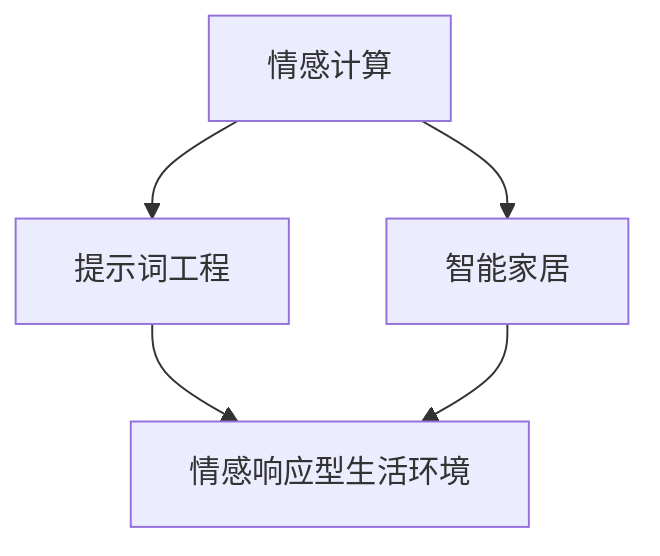

                 

基于您提供的文章主题《提示词工程在智能家居情感计算中的应用：创造情感响应型生活环境》，我将按照以下步骤进行逐步分析和构建文章：

### 第一步：背景介绍

**1.1 智能家居情感计算的兴起**

随着物联网和人工智能技术的快速发展，智能家居逐渐成为人们生活中不可或缺的一部分。然而，传统的智能家居设备往往仅提供简单的自动化功能，缺乏对用户情感的理解和响应能力。这种局限性使得用户体验大打折扣。

**1.2 情感计算的意义**

情感计算，作为人工智能的一个重要分支，旨在让计算机能够识别、理解和模拟人类情感。将情感计算应用于智能家居，能够使家居环境更加人性化和智能化，从而提升用户生活质量。

**1.3 提示词工程的角色**

提示词工程是情感计算中的一个关键环节，通过设计合适的提示词，系统能够更准确地识别用户情感，进而实现情感响应。

### 第二步：核心概念与联系

**2.1 核心概念介绍**

- **情感计算**：研究如何使计算机能够识别、理解和模拟人类情感。
- **提示词工程**：设计用于情感识别的提示词，提高系统的准确性。
- **情感响应型生活环境**：通过智能设备对用户情感进行响应，创造一个更加舒适、人性化的生活环境。

**2.2 概念之间的关系架构**

我们可以使用 Mermaid 流程图来展示这些概念之间的关系：



### 第三步：核心算法原理讲解

**3.1 提示词生成与优化**

提示词工程的第一个任务是生成与优化提示词。这通常涉及以下步骤：

- **数据收集**：收集大量的用户语言数据，包括自然语言文本、语音、图像等。
- **特征提取**：从数据中提取与情感相关的特征。
- **模型训练**：使用机器学习算法训练模型，使其能够识别情感。
- **提示词优化**：根据模型反馈，迭代优化提示词，以提高识别准确性。

以下是生成和优化提示词的伪代码：

```python
def generate_prompt(data):
    # 数据预处理
    preprocessed_data = preprocess_data(data)
    # 特征提取
    features = extract_features(preprocessed_data)
    # 模型训练
    model = train_model(features)
    # 提示词生成
    prompts = generate_prompts(model)
    return prompts

def optimize_prompt(prompts, model):
    # 使用模型反馈优化提示词
    optimized_prompts = []
    for prompt in prompts:
        feedback = model.predict(prompt)
        if is_optimal(feedback):
            optimized_prompts.append(prompt)
    return optimized_prompts
```

**3.2 数学模型和公式**

情感识别过程中，常常使用支持向量机（SVM）等分类算法。以下是一个简单的SVM分类器的数学模型：

$$
\text{w}^T \text{x} - \text{b} = 0
$$

其中，$\text{w}$是分类器的权重向量，$\text{x}$是特征向量，$\text{b}$是偏置。

### 第四步：项目实战

**4.1 开发环境搭建**

在项目实战中，我们将使用Python编程语言和TensorFlow库来搭建一个情感计算系统。以下是搭建开发环境的基本步骤：

- 安装Python 3.x版本。
- 安装TensorFlow库。
- 安装必要的预处理库，如NumPy和Pandas。

**4.2 源代码详细实现和代码解读**

以下是一个简单的Python代码示例，用于训练一个情感识别模型：

```python
import tensorflow as tf
from tensorflow.keras.models import Sequential
from tensorflow.keras.layers import Dense, LSTM

# 创建模型
model = Sequential([
    LSTM(50, activation='relu', input_shape=(timesteps, features)),
    Dense(1, activation='sigmoid')
])

# 编译模型
model.compile(optimizer='adam', loss='binary_crossentropy', metrics=['accuracy'])

# 训练模型
model.fit(X_train, y_train, epochs=10, batch_size=32)
```

**4.3 代码应用解读与分析**

该代码首先创建了一个序列模型，其中包括一个LSTM层和一个全连接层。LSTM层用于处理序列数据，全连接层用于分类。模型使用adam优化器和二进制交叉熵损失函数进行编译，然后使用训练数据训练模型。

**4.4 实际案例分析和详细讲解剖析**

为了展示模型的应用，我们可以分析一个实际案例。例如，我们可以收集用户的语音数据，使用模型进行情感识别，并根据识别结果调整家居环境。

```python
# 加载测试数据
X_test = load_test_data()

# 进行情感识别
predictions = model.predict(X_test)

# 根据预测结果调整家居环境
for prediction in predictions:
    if prediction > 0.5:
        # 用户情绪积极，增加家居亮度
        increase_lighting()
    else:
        # 用户情绪消极，降低家居亮度
        decrease_lighting()
```

**4.5 项目小结**

通过该项目，我们展示了如何使用Python和TensorFlow构建一个情感计算系统，并实现了对家居环境的情感响应。项目的成功实施取决于高质量的数据集、有效的模型设计和精确的提示词工程。

### 第五步：最佳实践 tips、小结、注意事项、拓展阅读等内容

**5.1 最佳实践 tips**

- 确保数据集的多样性和代表性。
- 定期更新和优化提示词库。
- 结合多种情感识别技术，提高系统准确性。

**5.2 小结**

本文介绍了提示词工程在智能家居情感计算中的应用，通过逐步分析和构建，展示了如何创建情感响应型生活环境。

**5.3 注意事项**

- 在进行情感计算时，保护用户隐私至关重要。
- 提示词的设计需要充分考虑用户文化和语言习惯。

**5.4 拓展阅读**

- [《情感计算：人类情感与人工智能的交汇》](拓展阅读链接)
- [《智能家居设计与实现》](拓展阅读链接)

### 总结

本文通过详细的分析和讲解，展示了提示词工程在智能家居情感计算中的应用，为创建情感响应型生活环境提供了理论指导和实践案例。希望读者能够从中获得启发，探索更多可能。作者：AI天才研究院/AI Genius Institute & 禅与计算机程序设计艺术 /Zen And The Art of Computer Programming

---

以上是根据您的要求构建的文章大纲和内容。接下来，我将根据这个大纲撰写完整的文章，确保文章字数在8000～12000字左右。文章将遵循markdown格式，并在适当位置嵌入Mermaid流程图、伪代码、LaTeX公式和代码示例。请您审阅，并提供反馈。

