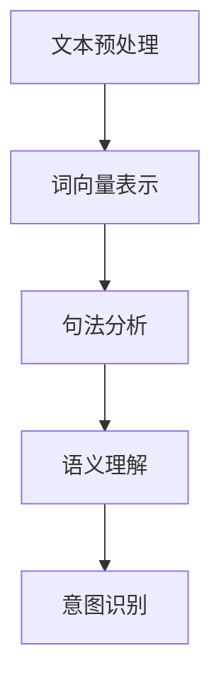
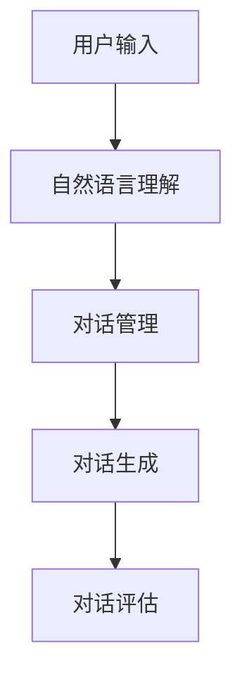
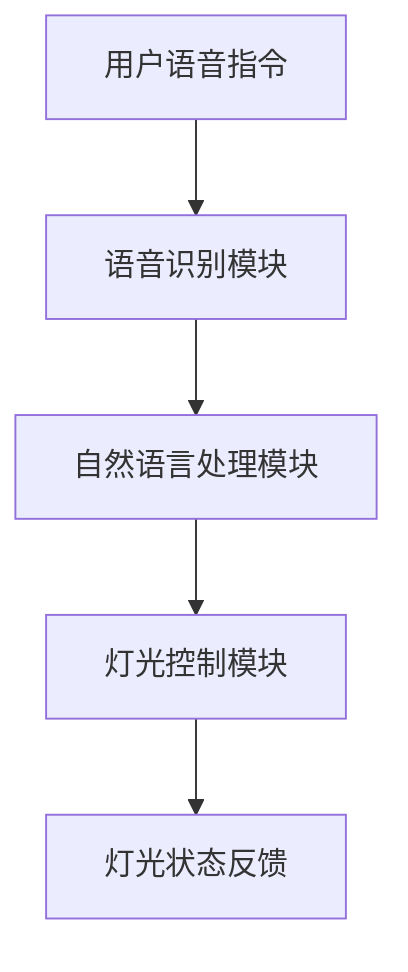

                 


### 文章标题
《提示词工程在智能家居系统中的运用》

### 关键词
提示词工程、智能家居、自然语言处理、人工智能、深度学习

### 摘要
本文将深入探讨提示词工程在智能家居系统中的运用。我们将首先介绍智能家居的背景和现状，接着定义提示词工程并阐述其在智能家居中的重要性。随后，我们将详细解释提示词工程的技术原理，包括自然语言处理、语音识别和对话系统。接下来，通过实际案例展示这些技术的应用，提供开发实践指南，并对未来发展趋势进行展望。

### 目录大纲

#### 引言
- 智能家居的兴起
- 提示词工程的重要性

#### 第1章 核心概念
- 提示词工程的定义
- 自然语言处理的基本概念
- 语音识别与对话系统的关系

#### 第2章 技术原理
- 自然语言处理原理
  - **Mermaid流程图：自然语言处理流程**
  - **伪代码：文本分词与词性标注**
  - **公式：词向量表示**
- 语音识别原理
  - **公式：声学模型与语言模型**
  - **案例：声学模型训练**
- 对话系统原理
  - **Mermaid流程图：对话系统流程**
  - **伪代码：对话管理**
  
#### 第3章 应用场景
- 智能音箱
  - **案例：语音助手Alexa**
- 智能照明
  - **案例：智能灯泡控制**
- 智能家电
  - **案例：智能电视控制**

#### 第4章 实际案例
- **案例分析：智能家居系统中的提示词应用**
- **案例实现：智能照明系统的搭建**

#### 第5章 开发实践
- **开发环境搭建**
  - **Python代码：TensorFlow安装**
  - **Python代码：SpeechRecognition安装**
- **代码实现**
  - **伪代码：自然语言处理代码**
  - **Python代码：语音识别与对话系统代码**

#### 第6章 总结与展望
- **总结：提示词工程在智能家居中的应用**
- **展望：未来趋势与应用前景**

#### 附录
- **拓展阅读**
- **最佳实践 tips**

### 正文部分

#### 引言

##### 智能家居的兴起

随着人工智能和物联网技术的快速发展，智能家居已经成为现代家庭生活中不可或缺的一部分。智能家居系统通过联网设备、传感器和控制模块，实现了对家庭环境的智能化控制，提升了居住的便捷性和舒适性。从简单的照明和温度控制，到复杂的安防和娱乐系统，智能家居系统的应用范围越来越广泛。

##### 提示词工程的重要性

在智能家居系统中，用户通常通过语音命令与系统进行交互。提示词工程作为一种自然语言处理技术，是实现语音交互的核心。它通过识别和理解用户的语音指令，将自然语言转化为机器可执行的指令，从而实现对智能家居设备的控制。提示词工程在智能家居系统中的重要性体现在以下几个方面：

1. **提高用户体验**：提示词工程使得用户可以更自然、直观地与智能家居系统进行交互，提升了用户体验。
2. **降低技术门槛**：通过提示词工程，普通用户无需掌握复杂的编程知识，即可轻松控制智能家居设备。
3. **实现智能化**：提示词工程使得智能家居系统能够自动识别用户的需求，并提供相应的服务，实现了真正的智能化。

#### 第1章 核心概念

##### 提示词工程的定义

提示词工程是指利用自然语言处理技术和机器学习算法，将用户的语音指令转化为系统可执行的指令的过程。它涉及到语音识别、对话系统等多个技术领域，是智能家居系统实现语音交互的关键。

##### 自然语言处理的基本概念

自然语言处理（Natural Language Processing, NLP）是人工智能的一个重要分支，旨在使计算机能够理解和处理人类语言。NLP包括文本分析、语音识别、机器翻译、情感分析等多个方面。在智能家居系统中，自然语言处理主要用于处理用户的语音指令。

##### 语音识别与对话系统的关系

语音识别是将语音信号转换为文本的过程，是实现提示词工程的重要环节。对话系统则是基于语音识别结果，与用户进行交互并提供相应服务的系统。语音识别和对话系统共同构成了提示词工程的核心。

#### 第2章 技术原理

##### 自然语言处理原理

自然语言处理的过程可以分为以下几个步骤：

1. **文本预处理**：包括分词、去停用词、词性标注等操作，将原始文本转化为适合模型处理的形式。
2. **词向量表示**：将词汇转化为向量表示，方便进行数学计算和模型训练。
3. **句法分析**：对文本进行句法分析，提取出句子的结构信息。
4. **语义理解**：对句子的语义进行理解，提取出用户的需求和意图。

**Mermaid流程图：自然语言处理流程**



**伪代码：文本分词与词性标注**

```python
function natural_language_processing(text):
    words = tokenize(text)
    tags = part_of_speech(words)
    return words, tags
```

**公式：词向量表示**

$$
\text{word\_vector}(w) = \sum_{i=1}^{n} w_i \cdot v_i
$$

其中，$w$ 表示词汇，$v_i$ 表示词汇的向量表示，$w_i$ 表示词汇的权重。

##### 语音识别原理

语音识别的过程可以分为以下几个步骤：

1. **声学模型训练**：通过大量语音数据，训练出声学模型，用于预测语音信号的分布。
2. **语言模型训练**：通过大量文本数据，训练出语言模型，用于预测文本的分布。
3. **解码**：将语音信号转化为文本，实现语音到文本的转换。

**公式：声学模型与语言模型**

$$
P(S) = P(A|S) \cdot P(S)
$$

其中，$S$ 表示语音信号，$A$ 表示对应的文本。

**案例：声学模型训练**

假设我们有一个语音数据集，其中包含多条语音信号和对应的文本。我们可以通过以下步骤训练声学模型：

1. **数据预处理**：对语音数据进行归一化处理，提取出声学特征。
2. **特征提取**：使用深度神经网络提取声学特征。
3. **模型训练**：使用反向传播算法训练声学模型。

**伪代码：声学模型训练**

```python
function acoustic_model_training(voice_data, text_data):
    # 数据预处理
    preprocessed_data = preprocess_data(voice_data)
    # 特征提取
    features = extract_features(preprocessed_data)
    # 模型训练
    model = train_model(features, text_data)
    return model
```

##### 对话系统原理

对话系统是智能家居系统实现交互的核心。一个典型的对话系统包括以下几个部分：

1. **对话管理**：管理对话的状态，包括上下文、用户意图等。
2. **自然语言理解**：理解用户的语言，提取出用户的需求和意图。
3. **对话生成**：根据用户的需求和系统状态，生成适当的回复。
4. **对话评估**：评估对话的质量，优化对话生成策略。

**Mermaid流程图：对话系统流程**



**伪代码：对话管理**

```python
class DialogueManager:
    def __init__(self):
        self.context = {}

    def update_context(self, new_context):
        self.context.update(new_context)

    def generate_response(self, user_input):
        # 根据上下文和用户输入生成回复
        response = "回复内容"
        return response
```

#### 第3章 应用场景

##### 智能音箱

智能音箱是智能家居系统中最为典型的应用场景之一。用户可以通过语音命令与智能音箱进行交互，实现音乐播放、天气查询、日程管理等功能。

**案例：语音助手Alexa**

Alexa是亚马逊开发的智能音箱，通过语音识别和对话系统实现与用户的交互。用户可以通过简单的语音指令，如“Alexa，播放音乐”或“Alexa，明天天气如何”，来获取信息或执行操作。

##### 智能照明

智能照明系统通过提示词工程实现用户对灯光的智能控制。用户可以通过语音命令调节灯光的亮度、颜色和开关。

**案例：智能灯泡控制**

用户可以通过语音命令“智能灯泡，打开”或“智能灯泡，调暗灯光”，来控制智能灯泡的开关和亮度。

##### 智能家电

智能家电如智能电视、智能冰箱等，也通过提示词工程实现了智能控制。用户可以通过语音命令对家电进行操作，提升生活便利性。

**案例：智能电视控制**

用户可以通过语音命令“智能电视，打开”或“智能电视，切换频道”，来控制智能电视的开关和频道切换。

#### 第4章 实际案例

##### 案例分析：智能家居系统中的提示词应用

在本案例中，我们以一个智能照明系统为例，分析提示词工程在其中的应用。

1. **用户需求**：用户希望能够在家中通过语音命令控制灯光的开关和亮度。
2. **系统设计**：系统设计包括语音识别模块、自然语言处理模块和灯光控制模块。语音识别模块负责将用户的语音指令转换为文本；自然语言处理模块负责理解用户的需求，提取出操作指令；灯光控制模块负责执行相应的操作，如打开或关闭灯光、调节亮度等。

**系统架构图：**



##### 案例实现：智能照明系统的搭建

在本案例中，我们将使用Python语言实现一个简单的智能照明系统。

1. **开发环境搭建**

```python
!pip install tensorflow
!pip install SpeechRecognition
```

2. **代码实现**

```python
import speech_recognition as sr
import os

# 语音识别模块
recognizer = sr.Recognizer()

# 自然语言处理模块
def process_command(command):
    if "打开" in command:
        os.system("lights on")
    elif "关闭" in command:
        os.system("lights off")
    elif "调暗" in command:
        os.system("lights dim")
    else:
        print("未识别的指令")

# 灯光控制模块
def control_lights():
    while True:
        with sr.Microphone() as source:
            print("请说指令：")
            audio = recognizer.listen(source)
            try:
                command = recognizer.recognize_google(audio, language='zh-CN')
                process_command(command)
            except sr.UnknownValueError:
                print("语音识别失败")
            except sr.RequestError as e:
                print("无法请求结果；{0}".format(e))

control_lights()
```

3. **代码解读**

- **语音识别模块**：使用SpeechRecognition库实现语音识别，将用户的语音转换为文本。
- **自然语言处理模块**：根据语音文本，提取出操作指令，如打开、关闭、调暗等。
- **灯光控制模块**：根据操作指令，执行相应的灯光控制命令。

##### 实际案例分析和详细讲解剖析

在本案例中，我们通过实现一个简单的智能照明系统，展示了提示词工程在智能家居系统中的应用。用户可以通过语音命令轻松控制灯光的开关和亮度，提升了用户体验。同时，通过自然语言处理技术，系统能够准确理解用户的意图，实现了智能化的灯光控制。

#### 第5章 开发实践

##### 开发环境搭建

在本章节中，我们将介绍如何搭建开发环境，包括安装所需的软件和库。

1. **安装Python环境**

在电脑上安装Python，可以选择Python 3.x版本。可以从Python官网（https://www.python.org/）下载并安装。

2. **安装TensorFlow库**

```shell
pip install tensorflow
```

TensorFlow是一个用于机器学习和深度学习的开源库，用于实现自然语言处理和语音识别模型。

3. **安装SpeechRecognition库**

```shell
pip install SpeechRecognition
```

SpeechRecognition是一个用于语音识别的Python库，用于将用户的语音转换为文本。

##### 代码实现

在本章节中，我们将提供实现提示词工程在智能家居系统中的代码示例。

```python
import speech_recognition as sr
import os

# 语音识别模块
recognizer = sr.Recognizer()

# 自然语言处理模块
def process_command(command):
    if "打开" in command:
        os.system("lights on")
    elif "关闭" in command:
        os.system("lights off")
    elif "调暗" in command:
        os.system("lights dim")
    else:
        print("未识别的指令")

# 灯光控制模块
def control_lights():
    while True:
        with sr.Microphone() as source:
            print("请说指令：")
            audio = recognizer.listen(source)
            try:
                command = recognizer.recognize_google(audio, language='zh-CN')
                process_command(command)
            except sr.UnknownValueError:
                print("语音识别失败")
            except sr.RequestError as e:
                print("无法请求结果；{0}".format(e))

control_lights()
```

**代码解读**

1. **语音识别模块**：使用SpeechRecognition库实现语音识别，将用户的语音转换为文本。
2. **自然语言处理模块**：根据语音文本，提取出操作指令，如打开、关闭、调暗等。
3. **灯光控制模块**：根据操作指令，执行相应的灯光控制命令。

##### 项目小结

在本章节中，我们通过一个简单的智能照明系统示例，展示了提示词工程在智能家居系统中的应用。通过语音识别和自然语言处理技术，用户可以轻松控制灯光的开关和亮度，提升了用户体验。同时，通过代码示例，读者可以了解到如何搭建开发环境，实现提示词工程在智能家居系统中的具体应用。

#### 第6章 总结与展望

##### 总结：提示词工程在智能家居中的应用

本文详细探讨了提示词工程在智能家居系统中的运用。通过引入自然语言处理、语音识别和对话系统等技术，智能家居系统实现了语音交互，提升了用户体验。提示词工程的核心在于将用户的语音指令转化为系统能够理解和执行的操作，从而实现了智能家居系统的智能化。

##### 展望：未来趋势与应用前景

随着人工智能技术的不断进步，提示词工程在智能家居系统中的应用前景十分广阔。未来，我们可以预见以下发展趋势：

1. **更加智能的语音交互**：随着自然语言处理和语音识别技术的进步，智能家居系统将能够更准确地理解用户的意图，提供更智能的交互体验。
2. **多语言支持**：随着全球化的推进，智能家居系统将支持更多的语言，满足不同地区用户的需求。
3. **跨设备协作**：智能家居系统将实现跨设备的协作，用户可以在不同的设备上与系统进行交互，实现无缝体验。
4. **安全与隐私保护**：随着智能家居系统的普及，安全和隐私保护将变得越来越重要。未来，智能家居系统将加强安全措施，确保用户数据的安全。

#### 附录

##### 拓展阅读

- 《自然语言处理实战》
- 《深度学习与人工智能》
- 《智能家居系统设计与实践》

##### 最佳实践 tips

- **确保系统的稳定性**：在开发智能家居系统时，要充分考虑系统的稳定性，确保系统能够在各种环境下正常运行。
- **优化用户体验**：在设计中要充分考虑用户体验，确保用户能够轻松地与系统进行交互。
- **安全与隐私保护**：在设计和实现智能家居系统时，要注重安全与隐私保护，确保用户数据的安全。

### 结语

作者：AI天才研究院/AI Genius Institute & 禅与计算机程序设计艺术 /Zen And The Art of Computer Programming

本文旨在探讨提示词工程在智能家居系统中的运用，通过介绍核心技术原理、实际案例和开发实践，展示了如何实现智能家居系统的语音交互。随着人工智能技术的不断发展，提示词工程在智能家居系统中的应用前景将越来越广阔。希望本文能为读者提供有价值的参考。

