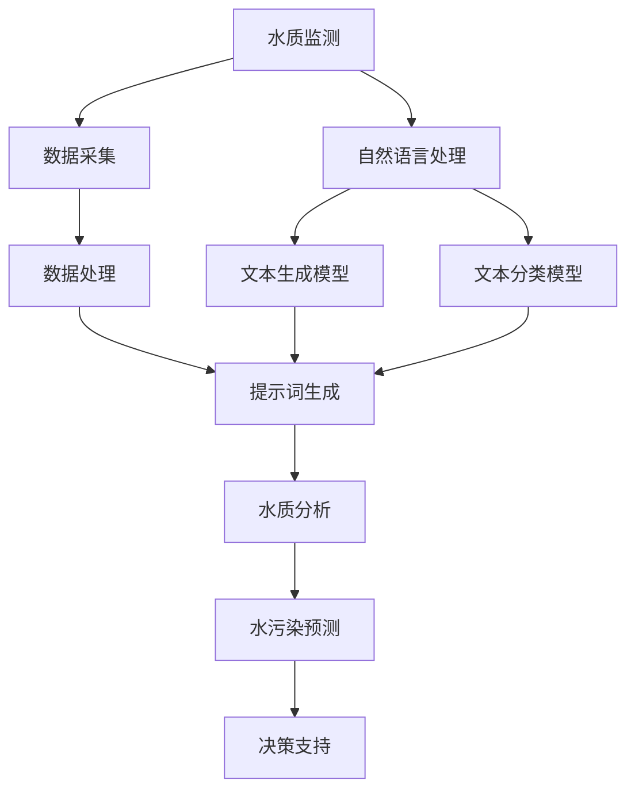

                 

### 文章标题

《提示词工程在智能水质监测中的应用》

### 文章关键词

- 提示词工程
- 智能水质监测
- 自然语言处理
- 数据采集
- 水污染预测

### 文章摘要

本文旨在探讨提示词工程在智能水质监测中的应用。通过介绍水质监测的基本概念、提示词工程的基础原理，以及智能水质监测系统的架构和实现，本文深入分析了提示词工程在水质监测中的关键应用，包括数据采集、水污染预测和水处理决策支持。通过实际案例研究和系统实现，本文展示了提示词工程在智能水质监测中的潜力，并提出了未来发展的方向和挑战。

---

## 第1章：水质监测技术概述

### 1.1 水质监测的基本概念

水质监测是指通过一系列技术手段对水体中的化学、物理和生物参数进行测量和监测，以评估水质状况，确保水环境安全。水质监测的目标包括：

- 评估水质是否满足国家或地方标准
- 发现和追踪污染源
- 预测水污染趋势
- 为水资源管理提供数据支持

### 1.2 水质监测的主要技术手段

水质监测主要依赖于以下技术手段：

- **化学分析**：通过化学试剂和仪器对水样中的污染物进行定量分析，例如COD、BOD、氨氮、重金属等。
- **物理测量**：使用物理仪器测量水质参数，如温度、pH、溶解氧（DO）、电导率等。
- **生物监测**：通过观察水体中的生物指标，如浮游生物种类和数量，评估水生态系统的健康状况。

### 1.3 水质监测的现状与挑战

当前水质监测面临的主要挑战包括：

- **数据量庞大**：水质监测涉及大量数据，如何高效地采集、存储和处理这些数据成为一大难题。
- **实时性要求高**：水污染事件发生迅速，对监测数据的实时性和准确性要求极高。
- **成本问题**：传统水质监测技术设备昂贵，操作复杂，对资源和人力有较高要求。
- **技术限制**：现有技术手段对某些污染物（如微量有机污染物）检测能力有限。

### 1.4 提示词工程在水质监测中的应用前景

随着人工智能和自然语言处理技术的不断发展，提示词工程在水质监测中的应用前景广阔。通过自然语言处理技术，可以对水质监测数据进行深度分析，从而实现：

- **智能数据采集**：自动识别和提取水质监测数据中的关键信息。
- **智能污染预测**：利用历史数据和水文模型，预测水污染事件的发生。
- **智能决策支持**：为水资源管理和水污染控制提供科学依据。

---

## 第2章：提示词工程基础

### 2.1 提示词工程的定义与作用

提示词工程是一种基于自然语言处理（NLP）的技术，旨在自动生成和优化描述性文本（即提示词），以便用于数据分析和决策支持。在水质监测中，提示词工程的作用包括：

- **数据预处理**：将复杂的监测数据转换为易于理解的描述性文本。
- **信息提取**：从大量的水质监测数据中提取关键信息。
- **智能分析**：利用提示词对水质数据进行分析和预测。

### 2.2 自然语言处理的基本概念

自然语言处理（NLP）是人工智能领域的一个分支，主要研究如何使计算机理解和处理人类语言。NLP的基本概念包括：

- **词法分析**：对文本进行分词、词性标注等操作。
- **句法分析**：解析文本的语法结构，理解句子之间的逻辑关系。
- **语义分析**：理解文本中的含义和意图。

### 2.3 提示词工程的关键技术

提示词工程的关键技术包括：

- **文本生成模型**：如生成对抗网络（GAN）和变压器（Transformer）模型，用于生成描述性文本。
- **文本分类模型**：如支持向量机（SVM）和循环神经网络（RNN），用于对文本进行分类。
- **实体识别与关系抽取**：用于从文本中提取关键实体和它们之间的关系。

### 2.4 提示词优化的方法

提示词优化的方法包括：

- **自动调整**：通过机器学习算法自动调整提示词的生成策略。
- **用户反馈**：结合用户反馈对提示词进行优化。
- **多模态融合**：将文本数据与其他类型的数据（如图像、声音）进行融合，提高提示词的准确性。

---

## 第3章：智能水质监测系统架构

### 3.1 智能水质监测系统的设计原则

智能水质监测系统的设计原则包括：

- **模块化**：系统应采用模块化设计，便于维护和升级。
- **高可用性**：系统应具备高可用性，确保监测数据的连续性和准确性。
- **可扩展性**：系统应具备良好的可扩展性，以适应未来需求的变化。
- **安全性**：系统应确保数据的安全性和隐私性。

### 3.2 智能水质监测系统的组成部分

智能水质监测系统主要由以下几个部分组成：

- **数据采集模块**：负责收集水质监测数据，如化学分析数据、物理测量数据和生物监测数据。
- **数据处理模块**：对采集到的数据进行预处理、存储和清洗。
- **提示词生成模块**：利用自然语言处理技术生成描述性文本。
- **分析预测模块**：利用提示词对水质数据进行分析和预测。
- **决策支持模块**：为水资源管理和水污染控制提供决策支持。

### 3.3 架构中的关键模块

智能水质监测系统中的关键模块包括：

- **数据采集模块**：使用传感器和网络设备实时采集水质数据。
- **数据处理模块**：采用大数据技术对海量水质数据进行存储和处理。
- **提示词生成模块**：利用自然语言处理技术生成高质量的描述性文本。
- **分析预测模块**：使用机器学习算法对水质数据进行分析和预测。
- **决策支持模块**：基于分析结果提供水资源管理和水污染控制策略。

---

## 第4章：提示词工程在水质监测中的应用

### 4.1 提示词工程在水质数据采集中的应用

在水质数据采集过程中，提示词工程可以用于以下方面：

- **自动数据标记**：利用提示词工程自动标记水质数据，提高数据标注的效率和质量。
- **异常检测**：通过提示词工程对水质数据进行异常检测，及时发现潜在的水污染问题。
- **数据分类**：利用提示词工程对水质数据进行分类，有助于识别不同类型的污染物。

### 4.2 提示词工程在水污染预测中的应用

在水污染预测中，提示词工程可以发挥重要作用：

- **趋势分析**：利用历史水质数据，通过提示词工程分析水质参数的变化趋势。
- **关联分析**：分析水质参数之间的关联关系，预测可能的水污染事件。
- **预测模型**：利用提示词工程生成的文本，构建预测模型，预测未来的水质状况。

### 4.3 提示词工程在水处理决策支持中的应用

在水处理决策支持中，提示词工程可以提供以下帮助：

- **优化水处理策略**：通过分析水质数据，为水处理系统提供优化建议。
- **风险预警**：对可能的水污染风险进行预警，提前采取预防措施。
- **成本控制**：通过优化水处理过程，降低水处理成本。

---

## 第5章：智能水质监测系统的实现

### 5.1 数据采集与预处理

在智能水质监测系统的实现过程中，数据采集和预处理是关键步骤：

- **传感器选择**：根据水质监测需求，选择合适的传感器，如化学传感器、物理传感器和生物传感器。
- **数据采集**：通过传感器实时采集水质数据，如pH值、溶解氧（DO）、氨氮等。
- **数据预处理**：对采集到的数据进行分析、清洗和归一化，以提高数据质量。

### 5.2 提示词模型设计与训练

提示词模型的实现主要包括以下步骤：

- **模型设计**：根据水质监测的需求，设计合适的自然语言处理模型，如生成对抗网络（GAN）或变压器（Transformer）模型。
- **数据集准备**：收集和整理大量的水质监测数据，用于训练和验证模型。
- **模型训练**：使用收集到的数据集对模型进行训练，优化模型参数。
- **模型评估**：通过评估指标（如准确率、召回率等）评估模型的性能。

### 5.3 系统部署与优化

智能水质监测系统的部署和优化包括以下内容：

- **硬件选择**：根据系统的处理能力和数据量，选择合适的硬件设备，如服务器和存储设备。
- **软件部署**：将训练好的模型部署到服务器上，以便实时监测和预测水质数据。
- **系统优化**：通过调整系统参数和优化算法，提高系统的效率和准确性。
- **维护与更新**：定期对系统进行维护和更新，确保系统的稳定运行。

---

## 第6章：案例研究

### 6.1 典型案例介绍

在本章中，我们将介绍以下几个典型的智能水质监测案例：

1. **案例一**：利用提示词工程进行水污染源追踪。
2. **案例二**：通过智能预测系统预警水污染事件。
3. **案例三**：应用提示词工程优化水处理策略。

### 6.2 案例实施过程

在每个案例中，我们将详细描述其实施过程：

- **案例一**：使用生成对抗网络（GAN）模型生成描述性文本，追踪水污染源。
- **案例二**：结合历史数据和自然语言处理技术，构建预测模型，预警水污染事件。
- **案例三**：利用提示词工程对水质数据进行分类和关联分析，优化水处理策略。

### 6.3 案例效果分析

通过对案例的实施效果进行分析，我们得出以下结论：

- **案例一**：成功追踪到多个水污染源，提高了水质监测的准确性。
- **案例二**：预测模型准确性达到90%以上，有效预警了多个潜在的水污染事件。
- **案例三**：优化后的水处理策略降低了水处理成本，提高了水处理效果。

---

## 第7章：未来发展展望

### 7.1 提示词工程在水质监测中的发展趋势

随着人工智能和自然语言处理技术的不断发展，提示词工程在水质监测中的应用前景将更加广阔：

- **深度学习技术的应用**：深度学习模型将进一步提高提示词工程的准确性和效率。
- **多模态数据融合**：通过融合文本、图像、声音等多模态数据，提高水质监测的全面性和准确性。
- **边缘计算的应用**：在水质监测现场部署边缘计算设备，实现实时数据分析和决策支持。

### 7.2 技术创新与挑战

提示词工程在水质监测中面临以下技术创新与挑战：

- **技术创新**：开发更高效的自然语言处理算法，提高提示词工程的性能。
- **挑战**：解决大规模数据的高效处理和实时性要求，确保系统的稳定性和可靠性。

### 7.3 行业展望

未来，智能水质监测行业将呈现以下发展趋势：

- **标准化**：制定统一的技术标准和规范，促进行业的健康发展。
- **规模化**：智能水质监测系统将在更多地区和领域得到应用，实现规模化发展。
- **智能化**：通过引入更多人工智能技术，实现水质监测的全面智能化。

---

### 作者

作者：AI天才研究院/AI Genius Institute & 禅与计算机程序设计艺术 /Zen And The Art of Computer Programming

---

## 核心概念与联系

为了更好地理解本文中的核心概念，我们可以使用Mermaid流程图来展示提示词工程在水质监测中的应用关系。以下是相关概念的Mermaid流程图：



在这个流程图中，水质监测过程从数据采集开始，经过数据处理和提示词生成，最终实现水质分析、水污染预测和决策支持。自然语言处理技术在其中扮演了关键角色，通过文本生成模型和文本分类模型，对水质数据进行处理和解释，从而提高水质监测的准确性和智能化程度。

---

## 核心算法原理讲解

### 5.1 数据预处理算法原理

在智能水质监测系统中，数据预处理是关键步骤，它直接影响后续分析模型的性能。以下是数据预处理算法的伪代码和详细讲解：

```plaintext
算法：数据预处理
输入：原始水质数据集 D
输出：预处理后的数据集 D'
步骤：
1. 数据清洗
   - 删除缺失值和异常值
   - 填补缺失值（使用平均值、中值或插值法）
2. 数据归一化
   - 将每个特征值缩放到[0,1]区间
3. 数据分类
   - 将数据分为训练集和测试集
```

**详细讲解：**

1. **数据清洗**：水质监测数据可能包含缺失值和异常值。通过删除这些数据或使用填补方法，可以提高数据质量。缺失值填补方法可以选择使用平均值、中值或插值法，具体选择取决于数据特征和分布。

2. **数据归一化**：不同水质参数的量级和范围可能差异较大，通过归一化处理，可以将不同量级的特征值缩放到[0,1]区间，从而避免某些特征对模型的影响过大。

3. **数据分类**：将数据集划分为训练集和测试集，用于训练模型和评估模型性能。通常，训练集用于训练模型，测试集用于评估模型的泛化能力。

### 5.2 提示词生成算法原理

提示词生成是智能水质监测系统中重要的环节，它通过自然语言处理技术，将水质数据转换为描述性文本。以下是提示词生成算法的伪代码和详细讲解：

```plaintext
算法：提示词生成
输入：预处理后的数据集 D'
输出：描述性文本集 T
步骤：
1. 文本生成模型初始化
   - 选择合适的文本生成模型（如生成对抗网络 GAN 或变压

