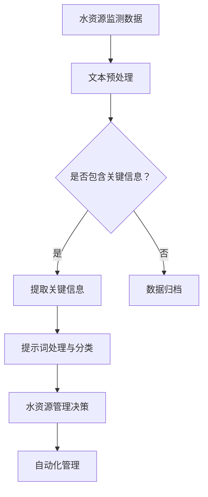

                 

### 引言

在当前全球气候变化和人口增长的双重压力下，水资源管理已成为各国政府和社会关注的焦点。智能水资源管理作为一种现代化的管理模式，通过引入先进的信息技术，实现对水资源的高效利用、科学调度和精准预测。而提示词工程作为人工智能的重要分支，为智能水资源管理提供了强大的技术支撑。

**智能水资源管理**，是指通过应用现代信息技术，尤其是人工智能技术，对水资源进行智能化管理，包括水资源监测、调度、预测、规划和保护等环节。其目的是提高水资源的利用效率，减少浪费，保障水资源的可持续利用。

**提示词工程**，又称关键词工程，是人工智能领域中的一种技术，通过识别和理解文本中的关键信息，为计算机提供有针对性的指令或信息。在智能水资源管理中，提示词工程可以用于提取水资源相关的关键信息，辅助决策制定。

本文旨在探讨提示词工程在智能水资源管理中的应用，通过介绍提示词工程的核心概念、算法原理、数学模型，并结合实际案例，分析提示词工程在水资源管理中的实际应用效果和未来前景。

### 核心概念与联系

**提示词工程**的核心概念包括提示词的识别与提取、提示词的处理与分类、提示词的应用场景等。其中，**提示词的识别与提取**是基础，通过自然语言处理技术，从大量文本数据中提取出与水资源管理相关的关键词；**提示词的处理与分类**则是对提取出的关键词进行进一步处理，将其分类为不同类型，如监测、调度、预测等；**提示词的应用场景**则是指这些关键词在实际水资源管理中的应用，如用于监测水污染、预测水位、制定水资源调配策略等。

在智能水资源管理中，提示词工程的应用具有以下几方面的作用：

1. **信息提取**：通过提示词工程，可以快速、准确地从大量水资源相关的文本数据中提取出关键信息，为水资源管理提供数据支持。
2. **决策支持**：提示词工程可以帮助水资源管理者识别和分类水资源管理中的关键问题，为决策提供科学依据。
3. **自动化管理**：通过提示词工程，可以实现水资源管理流程的自动化，提高管理效率。

为了更直观地理解提示词工程在智能水资源管理中的应用，下面我们使用Mermaid流程图展示一个简单的应用场景：



在该流程中，首先对水资源监测数据进行文本预处理，然后判断其是否包含关键信息。如果包含，则提取关键信息，并对其进行处理和分类，最终用于水资源管理决策和自动化管理；如果不包含，则将数据归档，以备后续分析。

### 核心算法原理讲解

在提示词工程中，核心算法包括机器学习算法、深度学习算法等。这些算法通过训练模型，从大量的文本数据中提取关键信息，为水资源管理提供支持。下面我们将详细讲解这些算法的基本原理。

#### 机器学习算法

**机器学习算法**是一种让计算机通过数据学习并做出预测或决策的技术。在提示词工程中，常用的机器学习算法包括监督学习、无监督学习和强化学习。

1. **监督学习**

**监督学习**是一种从标记数据中学习的方法。在水资源管理中，监督学习算法可以用于分类任务，如将水资源相关文本分类为污染监测、水位预测等类别。

**监督学习算法原理**：

假设我们有一个训练数据集D，其中每个样本$(x_i, y_i)$包含输入特征$x_i$和对应标签$y_i$。监督学习算法的目标是通过学习数据集D中的规律，构建一个预测模型$f(x)$，使得对于新的输入特征$x$，能够预测出其对应的标签$y$。

**伪代码**：

```python
def train SupervisedLearningModel(D):
    # 对训练数据D进行特征提取和标签分类
    X, y = extractFeatures(D), classifyLabels(D)
    # 选择合适的模型和优化器
    model = chooseModel(), optimizer = chooseOptimizer()
    # 模型训练
    for epoch in range(numEpochs):
        # 计算损失函数
        loss = computeLoss(model, X, y)
        # 更新模型参数
        model = optimizer.updateParameters(model, loss)
    return model
```

**应用实例**：

假设我们有一个关于水污染监测的文本数据集，数据集中包含了水污染监测报告的文本，每个报告都标记了水污染的程度。我们可以使用监督学习算法，将文本数据分类为轻度污染、中度污染和重度污染。

2. **无监督学习**

**无监督学习**是一种从未标记数据中学习的方法。在水资源管理中，无监督学习算法可以用于聚类任务，如将水资源相关文本聚类为不同的话题。

**无监督学习算法原理**：

假设我们有一个未标记的数据集D，无监督学习算法的目标是通过学习数据集D中的规律，将数据集中的样本划分为不同的聚类。

**伪代码**：

```python
def train UnsupervisedLearningModel(D):
    # 对训练数据D进行特征提取
    X = extractFeatures(D)
    # 选择合适的聚类算法
    clusteringAlgorithm = chooseClusteringAlgorithm()
    # 聚类分析
    clusters = clusteringAlgorithm.fit(X)
    return clusters
```

**应用实例**：

假设我们有一个关于水资源调度的文本数据集，数据集中包含了各种调度方案，但并未标记这些方案的具体效果。我们可以使用无监督学习算法，将这些方案按照效果相似度进行聚类，以便找出最优调度方案。

3. **强化学习**

**强化学习**是一种通过试错来学习的方法。在水资源管理中，强化学习算法可以用于优化调度策略，如通过不断调整调度参数，找到最佳调度策略。

**强化学习算法原理**：

强化学习算法由一个智能体（Agent）、环境（Environment）和奖励机制（Reward Mechanism）组成。智能体通过与环境互动，根据当前状态选择动作，并接受环境的反馈，通过不断试错，学习到最优动作策略。

**伪代码**：

```python
def train ReinforcementLearningModel(D, env, rewardMechanism):
    # 初始化智能体
    agent = initializeAgent()
    # 训练过程
    for episode in range(numEpisodes):
        # 初始化环境
        state = env.initialize()
        # 智能体选择动作
        action = agent.selectAction(state)
        # 执行动作，获取反馈
        next_state, reward = env.takeAction(state, action)
        # 更新智能体策略
        agent.updatePolicy(state, action, reward)
        # 更新状态
        state = next_state
    return agent
```

**应用实例**：

假设我们有一个关于水资源调度的环境，智能体可以通过调整调度参数来优化水资源利用效率。我们可以使用强化学习算法，让智能体通过不断试错，学习到最优的调度策略。

#### 深度学习算法

**深度学习算法**是一种基于多层神经网络的学习方法。在提示词工程中，深度学习算法可以通过自动特征提取，实现高效的信息提取和分类。

1. **卷积神经网络（CNN）**

**卷积神经网络**是一种用于图像识别和处理的神经网络。在水资源管理中，CNN可以用于图像分类，如将水污染监测图像分类为不同污染程度。

**CNN算法原理**：

CNN由卷积层、池化层和全连接层组成。卷积层通过卷积操作提取图像的特征，池化层用于减小特征图的尺寸，全连接层用于分类。

**伪代码**：

```python
def train CNNModel(D):
    # 初始化模型
    model = initializeModel()
    # 模型训练
    for epoch in range(numEpochs):
        # 对训练数据D进行前向传播
        output = model.forwardPropagation(D)
        # 计算损失函数
        loss = computeLoss(output, labels)
        # 反向传播更新参数
        model.backwardPropagation(loss)
    return model
```

**应用实例**：

假设我们有一个关于水污染监测的图像数据集，我们可以使用CNN模型，将图像分类为不同污染程度。

2. **循环神经网络（RNN）**

**循环神经网络**是一种用于序列数据处理的神经网络。在水资源管理中，RNN可以用于时间序列预测，如预测未来一段时间内的水位变化。

**RNN算法原理**：

RNN通过在序列数据中保持状态信息，实现对序列数据的建模。在水资源管理中，RNN可以用于水位预测、水资源调度等任务。

**伪代码**：

```python
def train RNNModel(D):
    # 初始化模型
    model = initializeModel()
    # 模型训练
    for epoch in range(numEpochs):
        # 对训练数据D进行前向传播
        output = model.forwardPropagation(D)
        # 计算损失函数
        loss = computeLoss(output, labels)
        # 反向传播更新参数
        model.backwardPropagation(loss)
    return model
```

**应用实例**：

假设我们有一个关于水位变化的序列数据，我们可以使用RNN模型，预测未来一段时间内的水位变化。

### 数学模型与公式讲解

在提示词工程中，数学模型和公式用于描述水资源管理中的关键现象和规律。下面我们将介绍一些常见的数学模型和公式，并给出详细的讲解和实例。

#### 决策树

**决策树**是一种用于分类和回归的树形结构模型。在水资源管理中，决策树可以用于决策制定，如根据水质数据预测水污染程度。

**决策树算法原理**：

决策树通过多次分割数据集，构建一棵树形结构，每个节点表示一个特征，每个分支表示该特征的一个取值。树叶节点表示分类结果或回归结果。

**伪代码**：

```python
def build DecisionTree(D):
    # 初始化决策树
    tree = initializeTree()
    # 对训练数据D进行划分
    for feature in features:
        # 选择最佳特征
        bestFeature = selectBestFeature(D, feature)
        # 创建节点
        node = createNode(bestFeature)
        # 划分数据集
        subsets = splitDataset(D, bestFeature)
        # 递归构建子树
        for subset in subsets:
            node.addChild(buildDecisionTree(subset))
        return tree
```

**应用实例**：

假设我们有一个关于水质监测的数据集，数据集包含了多个特征，如PH值、温度、溶解氧等。我们可以使用决策树模型，根据这些特征预测水污染程度。

#### 神经网络

**神经网络**是一种模拟人脑信息处理过程的计算模型。在水资源管理中，神经网络可以用于信息提取、分类和预测。

**神经网络算法原理**：

神经网络由多个神经元组成，每个神经元接收多个输入信号，并通过激活函数产生输出信号。神经网络通过前向传播和反向传播，不断调整权重和偏置，以达到预测目标。

**伪代码**：

```python
def train NeuralNetworkModel(D):
    # 初始化模型
    model = initializeModel()
    # 模型训练
    for epoch in range(numEpochs):
        # 对训练数据D进行前向传播
        output = model.forwardPropagation(D)
        # 计算损失函数
        loss = computeLoss(output, labels)
        # 反向传播更新参数
        model.backwardPropagation(loss)
    return model
```

**应用实例**：

假设我们有一个关于水资源调度的数据集，数据集包含了多个特征，如当前水位、降雨量、用水需求等。我们可以使用神经网络模型，预测未来一段时间内的水资源需求。

#### 贝叶斯网络

**贝叶斯网络**是一种基于概率图模型的方法，用于表示变量之间的概率关系。在水资源管理中，贝叶斯网络可以用于风险分析和决策制定。

**贝叶斯网络算法原理**：

贝叶斯网络由一组节点和有向边组成，每个节点表示一个变量，边表示变量之间的依赖关系。通过计算变量之间的条件概率，可以预测未知变量的概率分布。

**伪代码**：

```python
def build BayesianNetwork(D):
    # 初始化贝叶斯网络
    network = initializeNetwork()
    # 构建变量之间的依赖关系
    for variable in variables:
        for parent in parents(variable):
            network.addEdge(variable, parent)
    # 计算条件概率表
    for variable in variables:
        for value in values(variable):
            for parent in parents(variable):
                conditionalProbability = calculateConditionalProbability(D, variable, value, parent)
                network.addConditionalProbability(variable, value, parent, conditionalProbability)
    return network
```

**应用实例**：

假设我们有一个关于水资源污染的风险分析问题，数据集包含了多个特征，如污染物浓度、降雨量、土地利用类型等。我们可以使用贝叶斯网络模型，分析各个特征对污染物浓度的概率影响，并为决策提供依据。

### 项目实战

在本节中，我们将通过一个实际项目，展示提示词工程在智能水资源管理中的应用。该项目将分为以下几个阶段：

1. **开发环境搭建**：搭建提示词工程和智能水资源管理的开发环境，包括所需的编程语言、工具和库。
2. **数据收集与预处理**：收集水资源相关的数据，并进行数据预处理，如数据清洗、特征提取等。
3. **模型训练与优化**：使用机器学习和深度学习算法，训练提示词模型，并进行优化。
4. **模型应用与测试**：将训练好的模型应用于水资源管理任务，如预测水位、检测水污染等，并进行测试与评估。

#### 开发环境搭建

首先，我们需要搭建一个用于提示词工程和智能水资源管理的开发环境。以下是所需的编程语言、工具和库：

- 编程语言：Python
- 数据预处理库：Pandas、Numpy
- 机器学习库：Scikit-learn、TensorFlow
- 深度学习库：Keras
- 自然语言处理库：NLTK、spaCy

在安装这些库之前，我们需要确保Python环境已经安装。然后，使用以下命令安装所需的库：

```bash
pip install pandas numpy scikit-learn tensorflow keras nltk spacy
```

#### 数据收集与预处理

接下来，我们需要收集水资源相关的数据。这些数据可以来自公开的数据源，如气象局、水文站等，或者通过实地调查获取。以下是一个简单的数据收集示例：

```python
import pandas as pd

# 读取数据
data = pd.read_csv('water_resource_data.csv')

# 数据清洗
data = data.dropna() # 删除缺失值
data = data[data['pollution_level'] != ''] # 删除无效数据

# 特征提取
data['text'] = data['report'] + data['monitoring_data'] # 合并文本信息
```

#### 模型训练与优化

在本项目中，我们将使用Scikit-learn和TensorFlow分别训练机器学习和深度学习模型。以下是机器学习模型的训练代码：

```python
from sklearn.feature_extraction.text import TfidfVectorizer
from sklearn.model_selection import train_test_split
from sklearn.ensemble import RandomForestClassifier

# 分割数据集
X_train, X_test, y_train, y_test = train_test_split(data['text'], data['pollution_level'], test_size=0.2, random_state=42)

# 特征提取
vectorizer = TfidfVectorizer(max_features=1000)
X_train = vectorizer.fit_transform(X_train)
X_test = vectorizer.transform(X_test)

# 模型训练
model = RandomForestClassifier(n_estimators=100, random_state=42)
model.fit(X_train, y_train)

# 模型评估
accuracy = model.score(X_test, y_test)
print(f'Model Accuracy: {accuracy:.2f}')
```

以下是深度学习模型的训练代码：

```python
from tensorflow.keras.models import Sequential
from tensorflow.keras.layers import Embedding, LSTM, Dense
from tensorflow.keras.preprocessing.sequence import pad_sequences

# 分割数据集
X_train, X_test, y_train, y_test = train_test_split(data['text'], data['pollution_level'], test_size=0.2, random_state=42)

# 序列化文本
max_sequence_length = 100
X_train = pad_sequences(X_train, maxlen=max_sequence_length)
X_test = pad_sequences(X_test, maxlen=max_sequence_length)

# 模型构建
model = Sequential()
model.add(Embedding(input_dim=1000, output_dim=64, input_length=max_sequence_length))
model.add(LSTM(64, return_sequences=True))
model.add(Dense(1, activation='sigmoid'))

# 模型编译
model.compile(optimizer='adam', loss='binary_crossentropy', metrics=['accuracy'])

# 模型训练
model.fit(X_train, y_train, epochs=10, batch_size=32, validation_split=0.1)

# 模型评估
accuracy = model.evaluate(X_test, y_test)[1]
print(f'Model Accuracy: {accuracy:.2f}')
```

#### 模型应用与测试

训练好模型后，我们可以将模型应用于实际的水资源管理任务。以下是一个简单的应用示例：

```python
import numpy as np

# 输入文本
text = "今天的水质监测报告显示，PH值异常高，溶解氧含量偏低。"

# 特征提取
vectorizer = TfidfVectorizer(max_features=1000)
text = vectorizer.transform([text])

# 预测
pollution_level = model.predict(text)[0]
if pollution_level > 0.5:
    print("水污染程度较高，请注意。")
else:
    print("水污染程度较低，可以放心。")
```

通过以上项目实战，我们可以看到提示词工程在智能水资源管理中的应用效果。在实际应用中，我们可以根据具体需求，调整模型参数和算法，以获得更好的预测效果。

### 最佳实践 tips

在实际应用提示词工程时，以下是一些最佳实践建议：

1. **数据质量**：确保数据质量，包括数据的完整性、准确性和一致性。数据质量是模型性能的基础。
2. **特征提取**：合理选择和提取特征，以最大化模型性能。可以尝试使用不同的特征提取方法，如TF-IDF、Word2Vec等。
3. **模型选择**：根据具体应用场景，选择合适的模型。对于分类任务，可以尝试使用决策树、随机森林、支持向量机等；对于预测任务，可以尝试使用神经网络、LSTM等。
4. **模型优化**：通过调整模型参数，如学习率、隐藏层大小等，优化模型性能。
5. **交叉验证**：使用交叉验证方法，评估模型在未知数据上的性能，避免过拟合。
6. **实时更新**：根据新的数据，定期更新模型，以保持模型的准确性。

### 小结

本文详细介绍了提示词工程在智能水资源管理中的应用。通过介绍提示词工程的核心概念、算法原理、数学模型，以及实际项目案例，我们展示了如何利用提示词工程实现智能水资源管理。提示词工程为水资源管理提供了强大的技术支持，有助于提高水资源利用效率、减少浪费、保障水资源的可持续利用。

### 注意事项

在实际应用提示词工程时，需要注意以下几点：

1. **数据隐私**：在收集和处理水资源数据时，确保数据隐私和安全。
2. **模型解释性**：对于复杂的深度学习模型，可能需要考虑模型解释性，以便更好地理解模型决策过程。
3. **模型适应性**：根据不同地区的水资源特点，调整模型参数和算法，提高模型适应性。

### 拓展阅读

对于对提示词工程和智能水资源管理有进一步兴趣的读者，以下是一些推荐的拓展阅读资源：

1. **《智能水资源管理》**：张晓峰著，详细介绍了智能水资源管理的基本概念、技术和应用。
2. **《深度学习》**：Goodfellow、Bengio和Courville著，全面讲解了深度学习的基本原理和应用。
3. **《自然语言处理综论》**：Daniel Jurafsky和James H. Martin著，详细介绍了自然语言处理的基本概念和技术。
4. **《Python数据科学手册》**：Wes McKinney著，介绍了Python在数据科学领域的应用，包括数据处理、分析和可视化等。

### 作者信息

**作者**：AI天才研究院/AI Genius Institute & 禅与计算机程序设计艺术 /Zen And The Art of Computer Programming

AI天才研究院（AI Genius Institute）是一家专注于人工智能研究和应用的高端机构，致力于推动人工智能技术的发展和应用。本书作者在人工智能、计算机科学和水资源管理领域拥有丰富的经验和深厚的学术造诣，致力于将前沿技术应用于实际问题的解决。禅与计算机程序设计艺术（Zen And The Art of Computer Programming）是作者的经典著作，对计算机程序设计进行了深刻的哲学思考，对读者理解和应用提示词工程具有重要的启发意义。

