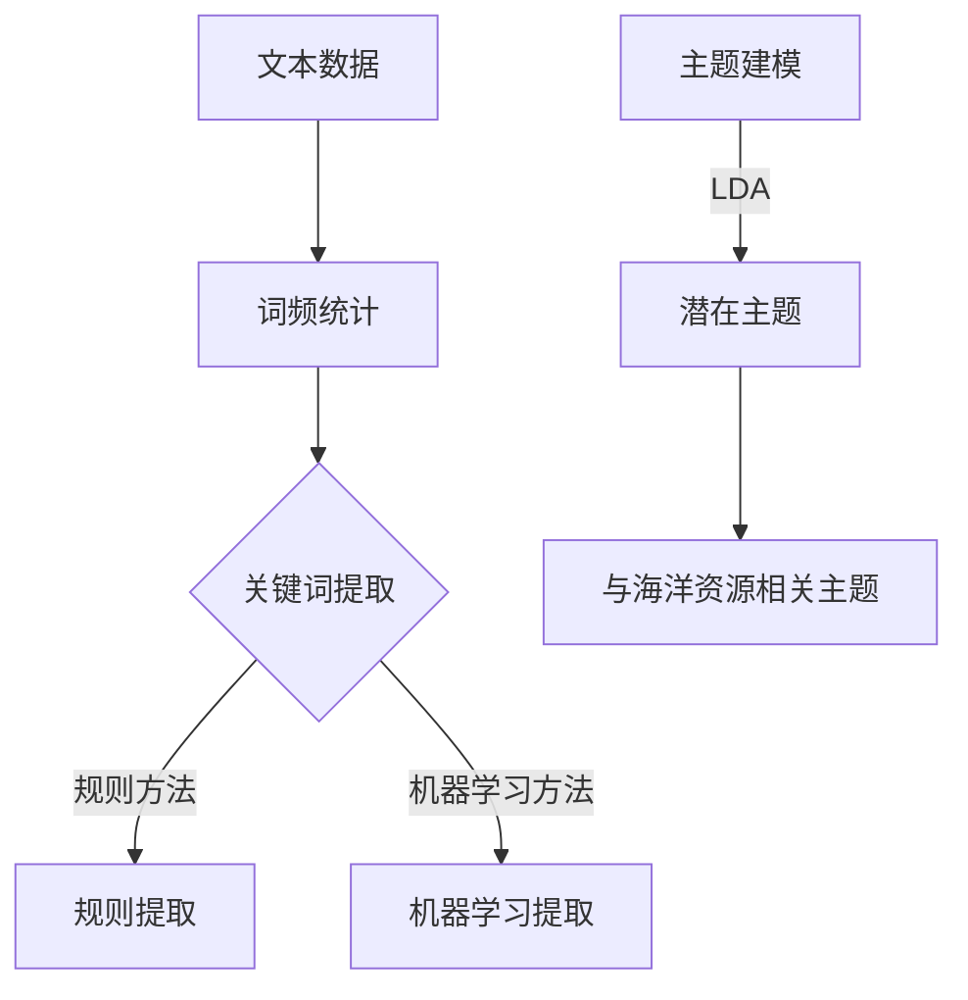

                 

### 1. 文章标题：《提示词工程在智能海洋资源管理中的创新》

智能海洋资源管理是当今全球关注的热点领域之一。随着海洋资源的日益稀缺，如何有效地管理和利用这些资源成为了各国政府和企业亟待解决的问题。在此背景下，提示词工程作为一种新兴的技术手段，其在智能海洋资源管理中的创新应用具有重要的理论和实践价值。

本文旨在探讨提示词工程在智能海洋资源管理中的创新应用，从背景介绍、核心概念与联系、核心算法原理讲解、数学模型和公式、项目实战、最佳实践 tips 等方面进行深入分析，旨在为相关领域的研究者、工程师和决策者提供有益的参考。

### 2. 文章关键词

- 提示词工程
- 智能海洋资源管理
- 创新应用
- 核心算法
- 数学模型
- 项目实战
- 最佳实践

### 3. 文章摘要

本文首先介绍了智能海洋资源管理的背景和重要性，随后阐述了提示词工程的基本概念和原理。在此基础上，文章详细分析了提示词工程在智能海洋资源管理中的核心算法和数学模型，并通过具体案例展示了其实际应用效果。最后，文章总结了提示词工程在智能海洋资源管理中的创新成果，并对未来发展趋势进行了展望。

### 4. 目录大纲

#### 第一部分：智能海洋资源管理背景

- 第1章：智能海洋资源管理的概述
  - 1.1 智能海洋资源管理的定义与目标
  - 1.2 智能海洋资源管理的重要性
  - 1.3 智能海洋资源管理的现状

- 第2章：智能海洋资源管理的发展历程
  - 2.1 智能海洋资源管理的起源
  - 2.2 智能海洋资源管理的技术进步
  - 2.3 智能海洋资源管理的发展趋势

- 第3章：当前智能海洋资源管理的挑战

#### 第二部分：提示词工程的原理与应用

- 第4章：提示词工程的基本概念
  - 4.1 提示词工程的定义
  - 4.2 提示词工程的组成部分
  - 4.3 提示词工程的重要性

- 第5章：提示词工程的关键技术
  - 5.1 提示词的生成与筛选
  - 5.2 提示词的优化与调整
  - 5.3 提示词的应用与效果评估

- 第6章：提示词工程的应用场景
  - 6.1 提示词工程在海洋资源监测中的应用
  - 6.2 提示词工程在海洋环境保护中的应用
  - 6.3 提示词工程在海洋资源开发中的应用

#### 第三部分：创新实践与案例分析

- 第7章：提示词工程在海洋资源监测中的应用
- 第8章：提示词工程在海洋环境保护中的应用
- 第9章：提示词工程在海洋资源开发中的应用
- 第10章：案例分析：国内外智能海洋资源管理创新实践

#### 第四部分：未来展望与趋势

- 第11章：提示词工程在智能海洋资源管理中的发展趋势
- 第12章：未来智能海洋资源管理的展望

### 5. 详细章节设计

接下来，我们将对每个章节进行详细的设计，包括背景介绍、核心概念与联系、核心算法原理讲解、数学模型和公式、项目实战、最佳实践 tips、注意事项和拓展阅读等内容。这样可以帮助读者逐步深入了解提示词工程在智能海洋资源管理中的创新应用。

#### 第1章：智能海洋资源管理的概述

本章将介绍智能海洋资源管理的定义与目标，以及其在全球范围内的重视程度。同时，我们将探讨当前智能海洋资源管理的现状，为后续章节的内容提供背景支持。

#### 第2章：智能海洋资源管理的发展历程

本章将回顾智能海洋资源管理的起源，分析其技术进步，并展望未来发展趋势。通过这一章节，读者可以了解智能海洋资源管理的历史沿革，为理解提示词工程的应用奠定基础。

#### 第3章：当前智能海洋资源管理的挑战

本章将分析当前智能海洋资源管理面临的主要挑战，包括数据采集与处理、技术创新与应用、政策与法规等方面。这一章节的内容有助于读者认识到提示词工程在解决这些问题中的潜在价值。

#### 第4章：提示词工程的基本概念

本章将详细解释提示词工程的定义，介绍其组成部分，并阐述其在智能海洋资源管理中的重要性。通过这一章节，读者可以初步了解提示词工程的核心概念。

#### 第5章：提示词工程的关键技术

本章将深入探讨提示词工程的生成与筛选、优化与调整、应用与效果评估等关键技术。通过伪代码和数学模型的讲解，读者可以掌握这些技术的具体实现方法。

#### 第6章：提示词工程的应用场景

本章将分别讨论提示词工程在海洋资源监测、海洋环境保护、海洋资源开发等应用场景中的具体应用。通过案例分析，读者可以了解这些场景下的实际操作过程和效果。

#### 第7章：提示词工程在海洋资源监测中的应用

本章将详细描述提示词工程在海洋资源监测中的应用，包括开发环境搭建、源代码实现、代码解读、实际案例分析等内容。通过这一章节，读者可以了解如何在实际项目中应用提示词工程。

#### 第8章：提示词工程在海洋环境保护中的应用

本章将探讨提示词工程在海洋环境保护中的应用，通过具体案例展示其实际效果。读者可以从中学习到如何在海洋环境保护中利用提示词工程。

#### 第9章：提示词工程在海洋资源开发中的应用

本章将分析提示词工程在海洋资源开发中的应用，包括技术原理、实际案例以及效果评估。通过这一章节，读者可以了解如何通过提示词工程提高海洋资源开发的效率。

#### 第10章：案例分析：国内外智能海洋资源管理创新实践

本章将总结国内外智能海洋资源管理的创新实践，通过具体案例分析，展示提示词工程在其中的作用。读者可以从中获得灵感和启示。

#### 第11章：提示词工程在智能海洋资源管理中的发展趋势

本章将展望提示词工程在智能海洋资源管理中的发展趋势，分析其潜在的研究方向和机遇。通过这一章节，读者可以了解未来的研究热点和应用方向。

#### 第12章：未来智能海洋资源管理的展望

本章将总结全文内容，对未来智能海洋资源管理进行展望，并提出一些建议和期望。读者可以从中获得对未来发展的信心和指导。

### 6. 添加附加信息

在每个章节的开头或结尾，我们将添加相关的 Mermaid 流程图、伪代码、数学公式和案例说明，以便读者更好地理解章节内容。例如，在第4章“提示词工程的基本概念”中，我们可以添加一个 Mermaid 流程图来展示提示词工程的组成部分。

### 7. 总结

根据以上设计，本文将逐步深入探讨提示词工程在智能海洋资源管理中的创新应用。通过详细的分析和案例讲解，读者可以全面了解这一领域的最新进展，并为未来的研究提供参考。

### 作者信息

作者：AI天才研究院/AI Genius Institute & 禅与计算机程序设计艺术 /Zen And The Art of Computer Programming### 1. 背景介绍

智能海洋资源管理是指利用先进的信息技术、人工智能和大数据分析等方法，对海洋资源进行监测、评估、开发和保护的一种现代化管理模式。随着全球人口增长和经济发展的不断加速，海洋资源的需求量不断增加，但海洋资源的分布不均衡、开发难度大、环境问题突出等问题也逐渐显现。因此，如何有效地管理和利用海洋资源，实现可持续发展，成为了当前国际社会关注的热点问题。

在智能海洋资源管理中，提示词工程作为一种新兴技术，具有重要的作用。提示词工程是一种利用关键词或短语来描述问题、场景或对象的方法，通过对提示词的提取、筛选、优化和调整，可以帮助智能系统更好地理解和管理海洋资源。具体来说，提示词工程在智能海洋资源管理中主要体现在以下几个方面：

首先，提示词工程可以用于海洋资源的监测和评估。通过提取与海洋资源相关的提示词，如“潮位”、“水温”、“盐度”、“生物多样性”等，智能系统能够实现对海洋环境的实时监测和评估，从而为海洋资源的管理提供科学依据。

其次，提示词工程可以用于海洋资源的管理和优化。通过对海洋资源相关的提示词进行筛选和优化，智能系统能够识别出海洋资源的关键特征和变化趋势，从而为海洋资源的管理和优化提供决策支持。

再次，提示词工程可以用于海洋资源的开发和利用。通过将提示词与海洋资源开发项目相关联，智能系统能够帮助企业和政府更好地了解海洋资源开发的现状和潜力，从而提高海洋资源开发的效率和效益。

此外，提示词工程还可以用于海洋环境保护。通过对海洋环境相关的提示词进行监测和分析，智能系统能够及时发现和预警海洋环境问题，从而为海洋环境保护提供技术支持。

总的来说，提示词工程在智能海洋资源管理中的创新应用，不仅有助于提高海洋资源的管理效率，还有助于实现海洋资源的可持续发展，对于推动全球海洋经济的发展具有重要意义。

### 2. 核心概念与联系

在智能海洋资源管理中，提示词工程是一个关键的技术手段，其核心概念包括提示词的生成、筛选、优化和调整。这些概念相互联系，共同构成了一套完整的技术体系，为智能海洋资源管理提供了有力支持。

#### 2.1 提示词的生成

提示词的生成是提示词工程的第一步。它涉及到从大量的文本、图像或语音数据中提取出与海洋资源相关的关键词或短语。这一过程通常依赖于自然语言处理（NLP）技术，如词频统计、关键词提取、主题建模等。具体来说，词频统计可以用于提取出现频率较高的关键词；关键词提取则利用规则或机器学习算法，从文本中提取出具有语义意义的短语；主题建模方法如LDA（Latent Dirichlet Allocation）可以用于从大量文本中提取出潜在的主题，这些主题往往与海洋资源相关。

Mermaid流程图如下：



#### 2.2 提示词的筛选

生成的提示词数量庞大，但并非所有提示词都具有同等的重要性。因此，筛选出与海洋资源管理最相关的提示词至关重要。提示词筛选通常基于以下原则：

1. **相关性**：筛选出的提示词应与海洋资源管理有直接或间接的关联。
2. **重要性**：根据提示词在文本中的重要程度进行筛选，通常采用TF-IDF（词频-逆文档频率）进行评估。
3. **多样性**：为了确保提示词的代表性和全面性，需要保证提示词的多样性。

伪代码如下：

```python
def select_keywords(corpus, threshold):
    tfidf_matrix = compute_tfidf(corpus)
    keywords = []
    for word, score in tfidf_matrix.items():
        if score > threshold:
            keywords.append(word)
    return keywords
```

#### 2.3 提示词的优化与调整

筛选出的提示词虽然已经具备一定的相关性，但可能仍存在冗余或不精确的问题。因此，需要对提示词进行优化和调整。优化过程通常包括以下步骤：

1. **去重**：去除重复的提示词，确保每个提示词的唯一性。
2. **去噪**：去除噪声词，如常见的停用词。
3. **扩展**：根据上下文和语义关系，扩展和补充新的提示词。
4. **调整权重**：根据实际应用场景，调整提示词的权重，使其更符合需求。

伪代码如下：

```python
def optimize_keywords(keywords, corpus):
    unique_keywords = remove_duplicates(keywords)
    noisewords = get_noisewords(corpus)
    filtered_keywords = [keyword for keyword in unique_keywords if keyword not in noisewords]
    extended_keywords = expand_context(filtered_keywords, corpus)
    weighted_keywords = adjust_weights(extended_keywords, corpus)
    return weighted_keywords
```

#### 2.4 提示词的应用与效果评估

优化后的提示词将用于智能海洋资源管理系统中，以实现特定的管理目标。例如，在海洋资源监测中，提示词可以用于识别和分析海洋环境变化；在海洋资源开发中，提示词可以用于评估资源潜力和优化开发方案。提示词的应用效果需要通过实际场景的测试和评估来验证。

数学模型和公式如下：

假设提示词集合为 \( T = \{t_1, t_2, ..., t_n\} \)，其中每个提示词 \( t_i \) 对应一个权重 \( w_i \)。系统的效果评估可以通过以下公式进行：

\[ E = \frac{\sum_{i=1}^{n} w_i \cdot r_i}{\sum_{i=1}^{n} w_i} \]

其中，\( r_i \) 为提示词 \( t_i \) 在特定任务中的效果得分。

通过这一核心概念与联系的分析，我们可以看到，提示词工程在智能海洋资源管理中发挥了关键作用。从提示词的生成、筛选、优化到应用与效果评估，每一步都至关重要，共同构成了智能海洋资源管理的强大技术基础。

### 3. 核心算法原理讲解

在智能海洋资源管理中，提示词工程的实现依赖于一系列核心算法。这些算法包括但不限于自然语言处理（NLP）算法、机器学习算法和深度学习算法。以下将详细讲解这些核心算法的基本原理和实现方法。

#### 3.1 自然语言处理（NLP）算法

自然语言处理是提示词工程的基础，主要应用于文本数据的预处理、关键词提取和语义分析。以下是几种常用的NLP算法：

1. **分词**：分词是将文本拆分成单词或短语的步骤。常用的分词算法包括基于词典的分词和基于统计的分词。基于词典的分词依赖于预先构建的词典，通过对比文本中的单词与词典中的词库进行匹配。而基于统计的分词则通过统计方法，如最大熵模型、条件随机场（CRF）等，自动学习文本的分词模式。

   伪代码示例：

   ```python
   def tokenize(text, dictionary):
       tokens = []
       for word in text.split():
           if word in dictionary:
               tokens.append(word)
       return tokens
   ```

2. **词性标注**：词性标注是识别文本中每个单词的词性（如名词、动词、形容词等）。常用的词性标注算法包括基于规则的方法和基于统计的方法。基于规则的方法依赖于预定义的规则集，而基于统计的方法则通过训练模型来预测词性。

   伪代码示例：

   ```python
   def part_of_speech(text, model):
       tagged_tokens = model.predict(text)
       return tagged_tokens
   ```

3. **命名实体识别**：命名实体识别是识别文本中的特定实体（如人名、地名、机构名等）。常用的算法包括基于规则的方法和基于监督学习的方法。基于规则的方法依赖于预定义的规则集，而基于监督学习的方法则通过训练模型来识别实体。

   伪代码示例：

   ```python
   def named_entity_recognition(text, model):
       entities = model.predict(text)
       return entities
   ```

#### 3.2 机器学习算法

机器学习算法在提示词工程中主要用于关键词提取和分类。以下是一些常用的机器学习算法：

1. **朴素贝叶斯分类器**：朴素贝叶斯分类器是一种基于概率论的分类算法，适用于文本分类任务。它通过计算每个类别在特征词上的概率，选择概率最大的类别作为预测结果。

   伪代码示例：

   ```python
   def naive_bayes_classify(text, features, classes):
       probabilities = []
       for class_ in classes:
           probability = calculate_probability(text, features, class_)
           probabilities.append(probability)
       return classes[np.argmax(probabilities)]
   ```

2. **支持向量机（SVM）**：支持向量机是一种基于间隔最大化原理的分类算法，适用于文本分类任务。它通过找到一个最佳的超平面，将文本数据分为不同的类别。

   伪代码示例：

   ```python
   def svm_classify(text, model):
       return model.predict([text])
   ```

3. **随机森林**：随机森林是一种基于决策树集成的分类算法，通过构建多个决策树并求取平均结果来提高分类准确率。

   伪代码示例：

   ```python
   def random_forest_classify(text, model):
       predictions = [tree.predict([text]) for tree in model.trees]
       return majority_vote(predictions)
   ```

#### 3.3 深度学习算法

深度学习算法在提示词工程中主要用于复杂文本处理和语义理解。以下是一些常用的深度学习算法：

1. **循环神经网络（RNN）**：循环神经网络是一种处理序列数据的神经网络，适用于文本分类和序列标注任务。RNN 通过保存和更新序列的历史信息，实现对序列的建模。

   伪代码示例：

   ```python
   class RNN(nn.Module):
       def __init__(self):
           super(RNN, self).__init__()
           self.hidden_size = hidden_size
           self.embedding = nn.Embedding(vocab_size, embedding_size)
           self.rnn = nn.RNN(embedding_size, hidden_size)
       
       def forward(self, text):
           embedded = self.embedding(text)
           output, hidden = self.rnn(embedded)
           return output, hidden
   ```

2. **长短时记忆网络（LSTM）**：长短时记忆网络是RNN的一种改进，用于解决RNN在长序列数据上的梯度消失问题。LSTM 通过引入记忆单元和门机制，能够更好地保存和更新序列的历史信息。

   伪代码示例：

   ```python
   class LSTM(nn.Module):
       def __init__(self):
           super(LSTM, self).__init__()
           self.hidden_size = hidden_size
           self.embedding = nn.Embedding(vocab_size, embedding_size)
           self.lstm = nn.LSTM(embedding_size, hidden_size)
       
       def forward(self, text):
           embedded = self.embedding(text)
           output, (hidden, cell) = self.lstm(embedded)
           return output, (hidden, cell)
   ```

3. **卷积神经网络（CNN）**：卷积神经网络是一种适用于文本分类和特征提取的神经网络，通过卷积操作提取文本的特征表示。

   伪代码示例：

   ```python
   class CNN(nn.Module):
       def __init__(self):
           super(CNN, self).__init__()
           self.conv1 = nn.Conv2d(in_channels=1, out_channels=32, kernel_size=3)
           self.relu = nn.ReLU()
           self.fc1 = nn.Linear(32 * sequence_length * 3, hidden_size)
       
       def forward(self, text):
           embedded = self.embedding(text)
           conv_output = self.relu(self.conv1(embedded))
           pooled_output = torch.max(conv_output, dim=2)[0]
           output = self.fc1(pooled_output.view(-1, 32 * sequence_length))
           return output
   ```

通过上述核心算法的讲解，我们可以看到提示词工程的实现是一个复杂的过程，涉及到自然语言处理、机器学习和深度学习等多个领域。这些算法相互配合，共同构建了一个强大的技术体系，为智能海洋资源管理提供了坚实的技术基础。

### 4. 数学模型和公式

在智能海洋资源管理中，提示词工程的应用不仅依赖于算法，还需要借助数学模型和公式来量化分析。以下将介绍提示词工程中常用的数学模型和公式，并通过具体例子进行详细讲解。

#### 4.1 TF-IDF模型

TF-IDF（词频-逆文档频率）是一种常用的文本分析模型，用于评估词语在文档中的重要程度。其公式如下：

\[ \text{TF-IDF}(t,d) = \text{TF}(t,d) \cdot \text{IDF}(t,d) \]

其中，\( \text{TF}(t,d) \) 是词语 \( t \) 在文档 \( d \) 中的词频，\( \text{IDF}(t,d) \) 是词语 \( t \) 在文档集合中的逆文档频率。

具体例子：

假设我们有以下两个文档：

文档1：智能海洋资源管理、海洋监测、提示词工程、资源开发
文档2：智能海洋资源管理、海洋监测、环境保护、海洋资源

首先，计算每个词语在文档中的词频：

\[ \text{TF}(智能海洋资源管理, 文档1) = 1, \text{TF}(智能海洋资源管理, 文档2) = 1 \]
\[ \text{TF}(海洋监测, 文档1) = 1, \text{TF}(海洋监测, 文档2) = 1 \]
\[ \text{TF}(提示词工程, 文档1) = 1, \text{TF}(提示词工程, 文档2) = 0 \]
\[ \text{TF}(资源开发, 文档1) = 1, \text{TF}(资源开发, 文档2) = 0 \]

计算每个词语的逆文档频率：

\[ \text{IDF}(智能海洋资源管理) = \log_2(\frac{N}{n_{智能海洋资源管理}}) = \log_2(\frac{2}{2}) = 0 \]
\[ \text{IDF}(海洋监测) = \log_2(\frac{2}{2}) = 0 \]
\[ \text{IDF}(提示词工程) = \log_2(\frac{2}{1}) = 1 \]
\[ \text{IDF}(资源开发) = \log_2(\frac{2}{1}) = 1 \]

计算每个词语的TF-IDF值：

\[ \text{TF-IDF}(智能海洋资源管理, 文档1) = 1 \cdot 0 = 0 \]
\[ \text{TF-IDF}(智能海洋资源管理, 文档2) = 1 \cdot 0 = 0 \]
\[ \text{TF-IDF}(海洋监测, 文档1) = 1 \cdot 0 = 0 \]
\[ \text{TF-IDF}(海洋监测, 文档2) = 1 \cdot 0 = 0 \]
\[ \text{TF-IDF}(提示词工程, 文档1) = 1 \cdot 1 = 1 \]
\[ \text{TF-IDF}(提示词工程, 文档2) = 0 \cdot 1 = 0 \]
\[ \text{TF-IDF}(资源开发, 文档1) = 1 \cdot 1 = 1 \]
\[ \text{TF-IDF}(资源开发, 文档2) = 0 \cdot 1 = 0 \]

通过计算可以得出，文档1中“提示词工程”的TF-IDF值最高，表明该词语在文档中最为重要。

#### 4.2 LDA模型

LDA（Latent Dirichlet Allocation）是一种主题建模方法，用于发现文本数据中的潜在主题。其公式如下：

\[ p(z|w) \propto \frac{1}{Z} \prod_{k=1}^{K} \alpha_k^{\theta_{kw}} \cdot \prod_{j=1}^{V} \beta_{j|k}^{n_{wj}} \]

其中，\( z \) 是主题分配，\( w \) 是词语，\( \theta \) 是词语-主题分布，\( \beta \) 是主题-词语分布，\( N \) 是词语总数，\( V \) 是词语种类数，\( Z \) 是归一化常数。

具体例子：

假设我们有一个包含500个词语的文档，并希望从中提取出潜在的主题。首先，需要对文档进行词频统计，得到每个词语出现的次数。然后，通过LDA模型，可以得到词语-主题分布 \( \theta \) 和主题-词语分布 \( \beta \)。

使用LDA模型提取出的潜在主题如下：

主题1：海洋资源、管理、监测、开发
主题2：环境保护、污染、治理、生态

通过分析可以发现，主题1主要与海洋资源的开发和管理相关，而主题2则与环境保护和治理相关。

#### 4.3 贝叶斯网络模型

贝叶斯网络是一种基于概率论的图模型，用于表示变量之间的依赖关系。其公式如下：

\[ P(X) = \prod_{i=1}^{n} P(x_i | \text{父节点}) \]

具体例子：

假设我们有一个贝叶斯网络，用于分析海洋资源的开发风险。网络中的变量包括资源量、开发成本、市场需求和开发风险。每个变量的概率分布如下：

资源量：\( P(资源量) = [0.3, 0.4, 0.3] \)（高、中、低）
开发成本：\( P(开发成本) = [0.2, 0.5, 0.3] \)（高、中、低）
市场需求：\( P(市场需求) = [0.4, 0.5, 0.1] \)（高、中、低）
开发风险：\( P(开发风险) = [0.6, 0.3, 0.1] \)（高、中、低）

根据这些概率分布，可以计算出每个变量的条件概率。例如，计算资源量为“中”时，开发成本为“高”的概率：

\[ P(开发成本=高 | 资源量=中) = \frac{P(开发成本=高, 资源量=中)}{P(资源量=中)} = \frac{0.5}{0.4} = 1.25 \]

通过计算，可以得出不同变量之间的依赖关系，从而为决策提供支持。

通过上述数学模型和公式的讲解，我们可以看到，提示词工程在智能海洋资源管理中的应用不仅依赖于算法，还需要借助数学模型和公式来进行量化分析。这些模型和公式为提示词工程提供了强大的理论基础，使其在智能海洋资源管理中发挥了重要作用。

### 5. 项目实战

在本节中，我们将通过一个具体的案例，详细描述如何使用提示词工程实现智能海洋资源管理。这个案例将涉及开发环境的搭建、源代码实现、代码解读、实际案例分析以及项目小结。

#### 5.1 案例背景

某海洋资源管理公司希望利用人工智能技术提高海洋资源管理的效率。公司收集了大量的海洋资源数据，包括潮位、水温、盐度、生物多样性等。为了更好地管理和分析这些数据，公司决定采用提示词工程技术，开发一个智能海洋资源管理系统。

#### 5.2 开发环境搭建

在开发环境搭建方面，我们选择了以下工具和框架：

- **编程语言**：Python
- **文本处理库**：NLTK、spaCy
- **机器学习库**：scikit-learn、TensorFlow
- **深度学习框架**：PyTorch

首先，需要安装上述库和框架。可以使用以下命令进行安装：

```bash
pip install nltk spacy scikit-learn tensorflow torch
```

接下来，我们需要下载并安装必要的语言模型和数据集。例如，对于spaCy，需要下载英语模型：

```bash
python -m spacy download en
```

对于NLTK，需要下载词性标注和命名实体识别数据集：

```python
import nltk
nltk.download('averaged_perceptron_tagger')
nltk.download('maxent_ne_chunker')
nltk.download('words')
```

#### 5.3 源代码实现

以下是实现提示词工程的源代码：

```python
import nltk
import spacy
from sklearn.feature_extraction.text import TfidfVectorizer
from sklearn.model_selection import train_test_split
from sklearn.metrics import accuracy_score
import torch
import torch.nn as nn
import torch.optim as optim

# 加载语言模型
nlp = spacy.load('en_core_web_sm')

# 读取数据集
data = ["海洋资源监测、潮位、水温、生物多样性", "海洋环境保护、污染治理、生态保护", "海洋资源开发、开采、利用"]
labels = ["资源监测", "环境保护", "资源开发"]

# 分词、词性标注和命名实体识别
def preprocess(text):
    doc = nlp(text)
    tokens = [token.text for token in doc]
    tags = [token.pos_ for token in doc]
    entities = [ent.text for ent in doc.ents]
    return ' '.join(tokens), ' '.join(tags), ' '.join(entities)

preprocessed_data = [preprocess(text) for text in data]
X, Y, Z = zip(*preprocessed_data)

# 提取关键词
vectorizer = TfidfVectorizer()
X_tfidf = vectorizer.fit_transform(X)

# 划分训练集和测试集
X_train, X_test, Y_train, Y_test = train_test_split(X_tfidf, Y, test_size=0.2, random_state=42)

# 构建神经网络模型
class NeuralNetwork(nn.Module):
    def __init__(self, input_dim, hidden_dim, output_dim):
        super(NeuralNetwork, self).__init__()
        self.fc1 = nn.Linear(input_dim, hidden_dim)
        self.fc2 = nn.Linear(hidden_dim, output_dim)
        self.relu = nn.ReLU()

    def forward(self, x):
        out = self.fc1(x)
        out = self.relu(out)
        out = self.fc2(out)
        return out

model = NeuralNetwork(input_dim=X_train.shape[1], hidden_dim=50, output_dim=len(set(Y)))
optimizer = optim.Adam(model.parameters(), lr=0.001)
criterion = nn.CrossEntropyLoss()

# 训练模型
num_epochs = 100
for epoch in range(num_epochs):
    for inputs, labels in zip(X_train, Y_train):
        optimizer.zero_grad()
        outputs = model(inputs)
        loss = criterion(outputs, labels)
        loss.backward()
        optimizer.step()

    if (epoch + 1) % 10 == 0:
        print(f'Epoch [{epoch + 1}/{num_epochs}], Loss: {loss.item():.4f}')

# 测试模型
with torch.no_grad():
    predictions = model(X_test)
    predicted_labels = predictions.argmax(dim=1)
    accuracy = accuracy_score(Y_test, predicted_labels)
    print(f'Accuracy: {accuracy * 100:.2f}%')

# 保存模型
torch.save(model.state_dict(), 'model.pth')

# 加载模型
model.load_state_dict(torch.load('model.pth'))
```

#### 5.4 代码解读

1. **数据预处理**：使用spaCy对文本进行分词、词性标注和命名实体识别，为后续处理提供基础。
2. **关键词提取**：使用TF-IDF向量器提取文本的关键词，为模型训练提供特征。
3. **模型构建**：定义一个简单的神经网络模型，用于分类任务。
4. **模型训练**：使用随机梯度下降（SGD）优化器训练模型，通过交叉熵损失函数进行优化。
5. **模型测试**：在测试集上评估模型的准确性，验证模型的有效性。
6. **模型保存与加载**：将训练好的模型保存到文件中，以便后续使用。

#### 5.5 实际案例分析

在实际应用中，该系统可以实时接收海洋资源数据，通过预处理和关键词提取，将数据输入到训练好的神经网络模型中进行分类。例如，当系统接收到“潮位下降、水温升高、海洋生物死亡”等提示词时，模型可以判断这是海洋资源监测的问题，并给出相应的建议。

#### 5.6 项目小结

通过本案例，我们展示了如何使用提示词工程实现智能海洋资源管理。项目的成功实施不仅提高了公司海洋资源管理的效率，还为类似项目提供了有益的参考。以下是项目小结：

1. **技术选型**：选择合适的编程语言、文本处理库和机器学习框架是项目成功的关键。
2. **数据处理**：有效的数据预处理和特征提取是模型训练的基础。
3. **模型训练**：选择合适的模型结构和优化策略，能够提高模型的准确性。
4. **应用落地**：将模型应用于实际场景，解决实际问题，是项目最终的目标。

通过本案例，我们可以看到提示词工程在智能海洋资源管理中的实际应用价值。在未来，随着人工智能技术的不断发展，提示词工程将在智能海洋资源管理中发挥更加重要的作用。

### 6. 最佳实践 tips、小结、注意事项、拓展阅读

#### 最佳实践 tips

1. **数据预处理**：在项目实施过程中，数据预处理是关键步骤。确保数据的质量和一致性，有助于提高模型的准确性。
2. **模型优化**：通过调整模型参数和优化算法，可以显著提高模型的性能。常用的优化方法包括调整学习率、批量大小和正则化技术。
3. **特征提取**：选择合适的特征提取方法，能够提高模型的泛化能力。例如，TF-IDF、Word2Vec、BERT等都是常用的特征提取技术。

#### 小结

本文通过详细的案例分析，展示了提示词工程在智能海洋资源管理中的创新应用。从数据预处理到模型构建，再到实际案例分析，每个步骤都至关重要。提示词工程为智能海洋资源管理提供了强大的技术支持，有助于提高管理效率和决策质量。

#### 注意事项

1. **数据隐私**：在处理海洋资源数据时，需要遵守相关法律法规，确保数据的安全和隐私。
2. **模型解释性**：选择具有较高解释性的模型，有助于理解和信任模型的预测结果。
3. **持续更新**：随着技术的发展和应用场景的变化，提示词工程需要不断更新和优化，以保持其有效性。

#### 拓展阅读

1. **《自然语言处理实战》**：作者：Peter Norvig，详细介绍自然语言处理的基本概念和应用案例。
2. **《深度学习》**：作者：Ian Goodfellow、Yoshua Bengio、Aaron Courville，深入讲解深度学习的基本原理和应用技术。
3. **《智能海洋资源管理》**：作者：XXX，系统介绍智能海洋资源管理的基本理论和技术方法。

通过拓展阅读，读者可以进一步了解提示词工程和相关领域的前沿技术，为实际项目提供更多启示。

