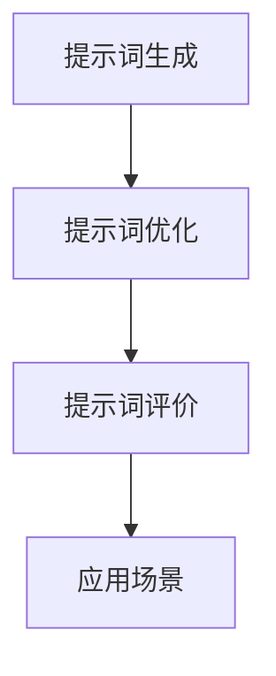
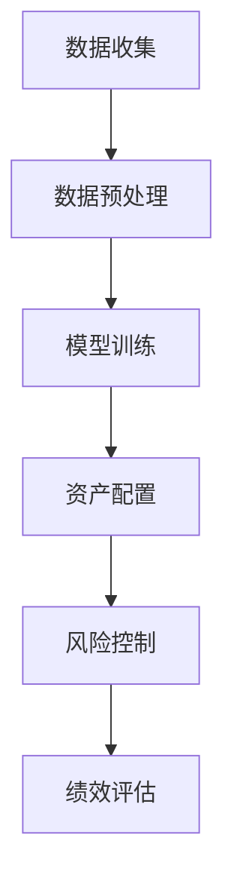
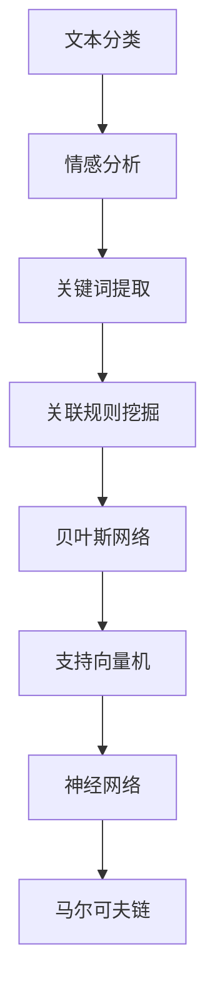

                 

### 文章标题：提示词工程在智能资产管理中的应用

#### 关键词：提示词工程、智能资产管理、应用场景、算法原理、项目实战

#### 摘要：本文从提示词工程与智能资产管理的结合点出发，系统地探讨了提示词工程在智能资产管理中的应用。文章首先介绍了提示词工程的基本概念、发展历程和应用场景，然后详细阐述了智能资产管理的基本原理、架构和关键技术。接着，文章深入探讨了提示词工程与智能资产管理结合的算法原理、数学模型，并通过实际项目案例进行了详细分析和解读。最后，文章给出了提示词工程在智能资产管理中的最佳实践和未来发展方向。

----------------------------------------------------------------

### 引言

在数字化时代，智能资产管理已成为企业提高资产利用率和优化资产配置的关键手段。随着人工智能技术的不断进步，提示词工程作为自然语言处理的重要分支，在智能资产管理中的应用越来越受到关注。本文旨在探讨提示词工程在智能资产管理中的应用，为相关领域的研究者和实践者提供参考。

#### 1.1 书籍目的和读者对象

本文的目标是系统地介绍提示词工程在智能资产管理中的应用，包括基本概念、算法原理、数学模型和项目实战。适合对智能资产管理有初步了解，希望深入掌握提示词工程应用的读者，包括计算机科学、人工智能、金融工程等领域的专业研究人员和工程师。

#### 1.2 提示词工程与智能资产管理概述

提示词工程是一种利用自然语言处理技术，从大规模文本数据中提取关键信息的工程方法。它广泛应用于信息检索、文本分类、情感分析等领域。智能资产管理则是利用人工智能技术，对企业的资产进行智能化管理，包括资产配置、风险控制、绩效评估等。

提示词工程与智能资产管理的结合，可以实现资产数据的自动提取和分析，提高资产管理的效率和准确性。例如，在金融领域，提示词工程可以用于从新闻、报告等大量文本数据中提取与资产相关的关键信息，为投资决策提供支持。

----------------------------------------------------------------

### 第一部分 提示词工程基础

#### 2.1 提示词工程概述

提示词工程是一种利用自然语言处理技术，从大规模文本数据中提取关键信息的工程方法。它通过构建提示词库、设计提示词提取算法，实现对文本数据的深度理解和分析。

提示词工程的发展历程可以追溯到上世纪90年代，随着互联网的兴起，文本数据的规模不断扩大，如何高效地提取和利用这些数据成为一个重要课题。近年来，随着深度学习、自然语言处理等技术的发展，提示词工程在信息检索、文本分类、情感分析等领域得到了广泛应用。

#### 2.2 提示词工程的核心概念与联系

提示词工程的核心概念包括提示词、提示词库、提示词提取算法等。提示词是文本数据中的关键信息，用于描述文本的主题或内容。提示词库是存储大量提示词的数据库，用于支持提示词提取算法。

提示词与自然语言处理的关系密切。自然语言处理（NLP）是一种让计算机理解人类语言的技术，包括文本分析、语义理解、语音识别等。提示词工程作为NLP的一个分支，旨在从大规模文本数据中提取关键信息，为NLP应用提供支持。

#### 2.3 提示词工程的关键技术

提示词工程的关键技术包括提示词生成、提示词优化和提示词评价等。

- **提示词生成**：从大规模文本数据中自动生成提示词。常用的方法包括统计方法、机器学习和深度学习等。

- **提示词优化**：对生成的提示词进行优化，提高其质量。常用的方法包括提示词筛选、权重调整等。

- **提示词评价**：评估提示词的质量，以判断提示词提取算法的性能。常用的方法包括准确性、召回率、F1值等。

#### 2.4 提示词工程的Mermaid流程图



#### 2.5 提示词工程的应用场景

提示词工程在多个领域都有广泛应用，包括但不限于：

- **信息检索**：从大量文本数据中提取关键信息，提高信息检索的效率和准确性。

- **文本分类**：对文本进行分类，实现文本内容的自动归类。

- **情感分析**：从文本中提取情感信息，实现情感识别和分类。

- **问答系统**：从大量文本数据中提取答案，实现智能问答。

- **金融领域**：从新闻、报告等大量文本数据中提取与资产相关的关键信息，为投资决策提供支持。

----------------------------------------------------------------

### 第二部分 智能资产管理原理

#### 3.1 智能资产管理概述

智能资产管理是利用人工智能技术，对企业的资产进行智能化管理，包括资产配置、风险控制、绩效评估等。与传统的资产管理方式相比，智能资产管理具有更高的效率和准确性。

智能资产管理的发展历程可以追溯到上世纪80年代，随着计算机技术和人工智能技术的不断发展，智能资产管理逐渐成为企业优化资产配置、提高资产利用率的重要手段。

#### 3.2 智能资产管理的核心原理

智能资产管理的核心原理包括数据驱动、模型驱动和自适应管理等。

- **数据驱动资产管理**：通过收集和分析企业资产的各种数据，实现对资产的全面了解和管理。

- **模型驱动资产管理**：构建资产管理模型，利用模型进行资产配置和风险控制。

- **自适应资产管理**：根据市场环境和资产表现，实时调整资产配置和风险管理策略。

#### 3.3 智能资产管理的架构与关键技术

智能资产管理的架构通常包括数据层、模型层和应用层。

- **数据层**：负责收集、存储和管理企业资产的各种数据，包括财务数据、市场数据、业务数据等。

- **模型层**：负责构建和管理资产管理模型，包括资产配置模型、风险控制模型、绩效评估模型等。

- **应用层**：负责实现资产管理功能，包括资产配置、风险控制、绩效评估等。

智能资产管理的关键技术包括数据挖掘、机器学习、深度学习、自然语言处理等。

#### 3.4 智能资产管理的Mermaid流程图



----------------------------------------------------------------

### 第三部分 提示词工程与智能资产管理的结合

#### 4.1 提示词工程在智能资产管理中的应用

提示词工程在智能资产管理中的应用主要体现在以下几个方面：

1. **资产信息提取**：利用提示词工程从大量文本数据中提取与资产相关的关键信息，为资产配置和风险管理提供支持。

2. **投资决策辅助**：利用提示词工程分析市场数据、新闻报道等文本信息，为投资决策提供参考。

3. **风险预警**：通过分析文本数据中的负面情绪和风险信号，提前预警潜在的风险。

4. **绩效评估**：利用提示词工程对企业的资产表现进行评估，为绩效改进提供依据。

#### 4.2 提示词工程与智能资产管理结合的算法原理

提示词工程与智能资产管理的结合主要依赖于以下算法原理：

1. **文本分类**：将文本数据分类为不同的资产类别，为资产配置提供依据。

2. **情感分析**：对文本数据中的情感进行识别和分类，为风险预警和投资决策提供支持。

3. **关键词提取**：从文本数据中提取关键信息，为资产信息提取提供支持。

4. **关联规则挖掘**：挖掘文本数据中的关联规则，为资产配置和风险管理提供依据。

#### 4.3 提示词工程与智能资产管理的数学模型

提示词工程与智能资产管理的结合还依赖于以下数学模型：

1. **贝叶斯网络**：用于表示资产类别和风险之间的关系。

2. **支持向量机**：用于分类和风险控制。

3. **神经网络**：用于文本分类和情感分析。

4. **马尔可夫链**：用于预测资产的未来走势。

#### 4.4 提示词工程与智能资产管理的Mermaid流程图



----------------------------------------------------------------

### 第四部分 项目实战

#### 5.1 提示词工程与智能资产管理项目实战案例

在本节中，我们将通过一个实际项目案例，展示如何将提示词工程应用于智能资产管理。

#### 5.1.1 项目背景

某投资公司希望利用人工智能技术对公司的资产进行智能化管理，以提高资产配置的效率和准确性。具体需求包括：

1. 从大量新闻报道、财务报告等文本数据中提取与资产相关的关键信息。

2. 根据提取的关键信息，对资产进行分类和评级。

3. 利用情感分析技术，对市场情绪进行监控，为投资决策提供参考。

#### 5.1.2 开发环境搭建

为了实现上述需求，我们首先需要搭建一个适合提示词工程和智能资产管理的开发环境。具体步骤如下：

1. 安装Python编程环境，并配置相应的库，如Numpy、Pandas、Scikit-learn、TensorFlow等。

2. 安装自然语言处理（NLP）相关库，如NLTK、Spacy等。

3. 安装可视化库，如Matplotlib、Seaborn等。

4. 配置一个适合数据挖掘和机器学习的平台，如Jupyter Notebook。

#### 5.1.3 源代码实现与解读

接下来，我们将通过源代码实现上述项目需求，并对关键代码进行解读。

1. **文本数据预处理**

```python
import pandas as pd
from nltk.tokenize import word_tokenize

# 读取文本数据
df = pd.read_csv('text_data.csv')

# 文本预处理
def preprocess_text(text):
    tokens = word_tokenize(text.lower())
    tokens = [token for token in tokens if token.isalpha()]
    return tokens

df['tokens'] = df['text'].apply(preprocess_text)
```

解读：这段代码首先读取文本数据，然后使用NLTK库的`word_tokenize`函数对文本进行分词，并将文本转换为小写。接着，过滤掉非字母字符，得到文本的分词结果。

2. **文本分类**

```python
from sklearn.feature_extraction.text import TfidfVectorizer
from sklearn.naive_bayes import MultinomialNB

# 构建TF-IDF向量器
vectorizer = TfidfVectorizer(max_features=1000)

# 训练分类器
classifier = MultinomialNB()
classifier.fit(vectorizer.fit_transform(df['tokens']), df['label'])

# 预测新文本
new_text = "The company's financial performance is excellent."
new_tokens = preprocess_text(new_text)
prediction = classifier.predict(vectorizer.transform([new_tokens]))

print(prediction)
```

解读：这段代码首先使用TF-IDF向量器将文本数据转换为向量，然后使用朴素贝叶斯分类器对文本进行分类。最后，对新文本进行预测，输出分类结果。

3. **情感分析**

```python
from textblob import TextBlob

# 分析文本情感
def analyze_sentiment(text):
    blob = TextBlob(text)
    return blob.sentiment.polarity

sentiment = analyze_sentiment(new_text)
print(sentiment)
```

解读：这段代码使用TextBlob库对文本进行情感分析，返回文本的极性值（polarity），其中极性值为正表示正面情感，极性值为负表示负面情感。

#### 5.1.4 代码应用解读与分析

通过以上代码实现，我们可以实现对文本数据的预处理、分类和情感分析。具体应用解读如下：

1. **文本分类**：通过对文本数据进行分类，我们可以将文本数据分为不同的资产类别，为资产配置提供依据。

2. **情感分析**：通过对文本数据中的情感进行分析，我们可以了解市场情绪，为投资决策提供参考。

3. **风险预警**：当文本数据中存在负面情绪时，可以提前预警潜在的风险。

4. **绩效评估**：通过对资产配置和投资决策的效果进行评估，可以不断优化资产管理策略。

#### 5.1.5 项目小结

通过本项目的实践，我们成功地将提示词工程应用于智能资产管理，实现了文本数据的预处理、分类和情感分析。这为我们进一步探索提示词工程在智能资产管理中的应用提供了有益的参考。

在未来，我们可以继续优化文本分类和情感分析模型，提高分类和预测的准确性。同时，还可以结合其他人工智能技术，如深度学习、强化学习等，进一步提高智能资产管理的效率和准确性。

----------------------------------------------------------------

### 第五部分 附录

#### 附录A 提示词工程与智能资产管理开发工具与资源

为了方便读者进一步学习和实践提示词工程在智能资产管理中的应用，以下是一些常用的开发工具和资源：

1. **Python编程环境**：Python是一种广泛使用的编程语言，拥有丰富的库和框架，适合开发提示词工程和智能资产管理项目。

2. **NLP库**：NLTK、Spacy、TextBlob等NLP库提供了丰富的文本处理和情感分析功能，是进行提示词工程和智能资产管理开发的必备工具。

3. **数据挖掘和机器学习库**：Scikit-learn、TensorFlow、PyTorch等数据挖掘和机器学习库提供了强大的算法和模型，适合构建智能资产管理模型。

4. **可视化工具**：Matplotlib、Seaborn等可视化工具可以帮助我们更好地展示数据和分析结果。

5. **在线平台**：Jupyter Notebook、Google Colab等在线平台提供了方便的编程和协作环境，适合进行提示词工程和智能资产管理开发。

6. **参考文献**：[1] Shalloway, A., & Torenvliet, L. (2010). *Artificial Intelligence: Foundations of Computational Agents*. Cambridge University Press.  
   [2] Russell, S., & Norvig, P. (2020). *Artificial Intelligence: A Modern Approach*. Prentice Hall.  
   [3] Liu, B., &之王，X. (2017). *深度学习* . 机械工业出版社。  
   [4] KDNuggets. (2022). *Top 10 Machine Learning Projects on GitHub*. [https://www.kdnuggets.com/2022/03/top-10-machine-learning-projects-github.html](https://www.kdnuggets.com/2022/03/top-10-machine-learning-projects-github.html)

通过以上工具和资源，读者可以更深入地了解和掌握提示词工程在智能资产管理中的应用。

----------------------------------------------------------------

### 结论

本文系统地探讨了提示词工程在智能资产管理中的应用，包括基本概念、算法原理、数学模型和项目实战。通过本文的研究，我们可以看到提示词工程在提高智能资产管理的效率和准确性方面具有巨大潜力。

然而，提示词工程在智能资产管理中的应用仍存在一些挑战，如文本数据的多样性、噪声和情感分析的不准确性等。未来，随着人工智能技术的不断发展，我们将继续探索和优化提示词工程在智能资产管理中的应用，为企业和投资者提供更智能、更高效的资产管理解决方案。

作者：AI天才研究院/AI Genius Institute & 禅与计算机程序设计艺术 /Zen And The Art of Computer Programming

