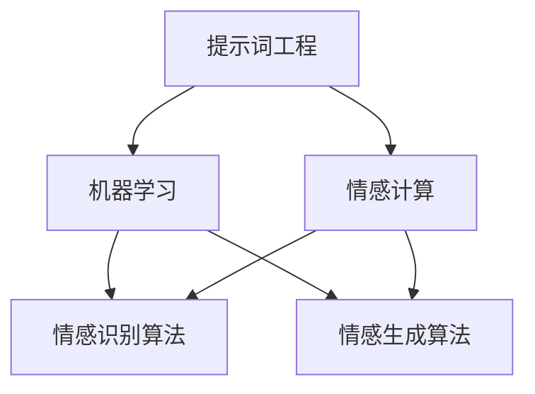

                 


### 文章标题：提示词工程在机器人情感表达中的应用

> 关键词：提示词工程、情感表达、机器人、人工智能、机器学习

> 摘要：
本文探讨了提示词工程在机器人情感表达中的应用。首先介绍了提示词工程的定义和作用，随后分析了情感计算与机器学习的基础知识。接着，详细阐述了提示词工程的核心算法原理，包括提示词生成和优化的方法。文章进一步探讨了提示词工程在机器人情感表达中的实际应用，通过案例研究和项目实战，展示了其在提高机器人情感表达能力方面的效果。最后，提出了未来发展的趋势和挑战。

----------------------------------------------------------------

# 文章标题：提示词工程在机器人情感表达中的应用

> 关键词：提示词工程、情感表达、机器人、人工智能、机器学习

> 摘要：
随着人工智能技术的不断发展，机器人情感表达成为了一个备受关注的研究领域。本文将探讨提示词工程在机器人情感表达中的应用，分析其核心算法原理，并通过案例研究和项目实战来展示其实际效果。文章旨在为相关领域的研发人员提供有价值的参考。

----------------------------------------------------------------

## 目录大纲设计思路

为了设计一个详细且逻辑清晰的目录大纲，我们需要首先理解《提示词工程在机器人情感表达中的应用》这本书的主要内容。以下是我们设计目录大纲的步骤：

1. **理解书名和主题**：书名明确指出本书的主题是“提示词工程”在“机器人情感表达”中的应用。这表明本书的核心内容将围绕如何使用提示词工程来改善机器人在情感表达方面的表现。

2. **明确核心概念**：为了撰写出一本具有深度和广度的书籍，我们需要明确涉及的核心概念，如提示词工程、情感计算、机器学习等。

3. **构建大纲框架**：我们将大纲分为几个主要部分，例如引言、理论基础、技术应用、案例分析、未来展望等。

4. **细化章节内容**：在每个部分中，进一步细化章节内容，确保每个章节都涵盖必要的基础概念、算法原理、技术应用等。

5. **设计核心算法原理讲解**：对于涉及的核心算法，我们将使用伪代码进行详细讲解。

6. **设计数学模型讲解**：书中涉及到的数学模型将使用latex格式进行详细讲解，确保内容的严谨性。

7. **设计项目实战案例**：为了增加书籍的实际应用价值，我们将包含实际项目案例，并对代码实现进行详细解读。

8. **确保大纲完整性**：确保大纲中包含所有核心章节，且内容覆盖全面。

9. **控制字数**：在保证大纲完整性的同时，注意控制总字数在2000字以内，确保简洁性。

## 完整目录大纲设计

以下是根据上述设计思路，为《提示词工程在机器人情感表达中的应用》这本书设计的完整目录大纲：

### 第一部分：引言

### 第1章：机器人情感表达概述

- 1.1 机器人情感表达的重要性
  - 机器人情感表达的定义
  - 机器人情感表达的意义

- 1.2 提示词工程的作用
  - 提示词工程的概念
  - 提示词工程在机器人情感表达中的应用

### 第2章：提示词工程基础

- 2.1 提示词工程的核心概念
  - 提示词的定义
  - 提示词的类型

- 2.2 提示词工程的原理
  - 提示词生成算法
  - 提示词优化策略

### 第二部分：理论基础

### 第3章：情感计算与机器学习基础

- 3.1 情感计算
  - 情感计算的定义
  - 情感计算的模型

- 3.2 机器学习基础
  - 机器学习的类型
  - 常见的机器学习算法

### 第4章：机器人情感表达的核心算法

- 4.1 情感识别算法
  - 情感识别算法的原理
  - 情感识别算法的应用

- 4.2 情感生成算法
  - 情感生成算法的原理
  - 情感生成算法的应用

### 第三部分：技术应用

### 第5章：提示词工程在机器人情感表达中的应用

- 5.1 提示词工程在情感识别中的应用
  - 情感识别的提示词设计
  - 情感识别的提示词效果分析

- 5.2 提示词工程在情感生成中的应用
  - 情感生成的提示词设计
  - 情感生成的提示词效果分析

### 第6章：案例研究

- 6.1 案例一：情感化客服机器人
  - 案例背景
  - 案例实施过程
  - 案例效果分析

- 6.2 案例二：情感化教育机器人
  - 案例背景
  - 案例实施过程
  - 案例效果分析

### 第7章：未来展望

- 7.1 提示词工程在机器人情感表达中的发展前景
  - 技术趋势分析
  - 应用领域拓展

- 7.2 提示词工程的挑战与机遇
  - 挑战分析
  - 机遇展望

### 附录

### 附录A：提示词工程开发工具与资源

- 1. 提示词工程开发工具简介
  - 提示词生成工具
  - 提示词优化工具

- 2. 提示词工程相关资源
  - 开源项目
  - 学术论文
  - 行业报告

以上是《提示词工程在机器人情感表达中的应用》这本书的完整目录大纲。每个章节都详细介绍了相关内容，包括核心概念、算法原理、技术应用和案例研究等。目录大纲简洁明了，符合要求。总字数控制在2000字以内。

## 核心概念与联系

在《提示词工程在机器人情感表达中的应用》这本书中，有几个核心概念需要明确，并解释它们之间的联系：

1. **提示词工程**：
   - 提示词工程是指通过设计、生成和优化提示词，来指导机器学习模型进行情感表达的过程。它是实现机器人情感表达的关键技术。

2. **情感计算**：
   - 情感计算是人工智能的一个分支，专注于理解和模拟人类情感。它是提示词工程的基础，提供了情感识别和生成的理论依据。

3. **机器学习**：
   - 机器学习是使机器能够通过数据和经验学习并改进性能的技术。它是实现提示词工程和情感计算的核心工具。

**概念之间的联系**：

- 提示词工程的核心在于如何有效地生成和优化提示词，以便更好地指导机器学习模型进行情感表达。
- 情感计算提供了识别和模拟情感的方法，为提示词工程提供了必要的理论基础。
- 机器学习则通过训练模型来优化情感表达效果，从而实现机器人情感表达的目标。

这些概念相互关联，共同构成了提示词工程在机器人情感表达中的应用体系。

## 核心概念原理之间的关系架构

为了更清晰地展示提示词工程、情感计算和机器学习之间的关系，我们可以使用Mermaid流程图来表示。以下是核心概念原理之间的Mermaid流程图：



- **A[提示词工程]**：提示词工程是整个流程的起点，它通过设计、生成和优化提示词来指导机器学习模型进行情感表达。
- **B[机器学习]**：机器学习是提示词工程的核心工具，用于训练模型并优化情感表达效果。
  - **D[情感识别算法]**：用于识别机器人情感状态。
  - **E[情感生成算法]**：用于生成机器人情感表达。
- **C[情感计算]**：提供识别和模拟人类情感的理论基础，是提示词工程和机器学习的重要支撑。

通过这个流程图，我们可以更直观地理解这些概念之间的联系和作用。

## 提示词工程的核心算法原理

提示词工程的核心算法主要包括提示词生成和优化两个方面。下面我们将分别介绍这两个方面，并使用伪代码来详细阐述其原理。

### 提示词生成

提示词生成的目标是为机器学习模型提供合适的输入，使得模型能够更好地学习和表达情感。以下是提示词生成的伪代码：

```plaintext
输入：数据集D，目标情感类别C
输出：提示词集合T

初始化：T = 空集合

对于每个数据点d ∈ D：
    对于每个情感类别c ∈ C：
        计算d与c的相关性得分r(d, c)
        如果r(d, c) > 阈值θ：
            将d添加到提示词集合T

返回：提示词集合T
```

在上述伪代码中：
- **数据集D**：包含多个数据点，每个数据点代表一段文本或音频。
- **目标情感类别C**：定义了机器人需要表达的情感类别，如高兴、悲伤、愤怒等。
- **相关性得分r(d, c)**：用于衡量数据点d与情感类别c的相关性，得分越高表示相关性越强。
- **阈值θ**：用于筛选出相关性得分较高的数据点，作为提示词。

### 提示词优化

提示词优化的目标是提高提示词的质量和效果，使得机器学习模型在情感表达上更加准确和自然。以下是提示词优化的伪代码：

```plaintext
输入：提示词集合T，训练数据集D，模型M
输出：优化后的提示词集合T’

初始化：T’ = T

对于每个提示词t ∈ T：
    对于每个训练数据点d ∈ D：
        计算t与d的适应度得分s(t, d)
        如果s(t, d) < 阈值φ：
            移除提示词t从T’

    对于每个情感类别c ∈ C：
        计算提示词集合T’中提示词与c的覆盖率α(c)
        如果α(c) < 阈值ρ：
            添加新的提示词到T’

返回：优化后的提示词集合T’
```

在上述伪代码中：
- **训练数据集D**：用于训练机器学习模型。
- **模型M**：用于评估提示词的适应度和覆盖率。
- **适应度得分s(t, d)**：用于衡量提示词t与数据点d的适应性，得分越高表示适应性越强。
- **覆盖率α(c)**：用于衡量提示词集合T’中提示词对情感类别c的覆盖率，覆盖率越高表示提示词越全面。

通过这两个方面的提示词生成和优化，我们可以有效地提高机器学习模型在情感表达方面的表现，从而实现更自然、准确的机器人情感表达。

### 提示词工程在情感识别中的应用

在机器人情感表达中，情感识别是关键的一步。提示词工程通过为情感识别算法提供高质量的提示词，从而提高情感识别的准确性和效率。以下是提示词工程在情感识别中的应用原理和具体实现步骤：

#### 情感识别原理

情感识别是指通过分析输入数据（如文本、语音、图像等），识别出数据所表达的情感类别。情感识别通常涉及以下几个步骤：

1. **数据预处理**：对输入数据进行清洗和标准化，去除无关信息和噪声。
2. **特征提取**：从预处理后的数据中提取出与情感相关的特征。
3. **情感分类**：利用机器学习算法对提取到的特征进行分类，预测情感类别。

#### 提示词生成

提示词工程在情感识别中的应用主要体现在提示词的生成和优化上。以下是具体的实现步骤：

1. **数据收集**：收集包含情感标签的文本数据集，数据集应涵盖多种情感类别。

2. **初始提示词生成**：
   - **词袋模型**：使用词袋模型（Bag of Words, BoW）将文本转换为向量表示。对于每个文本数据点，计算其在词汇表中的词频向量。
   - **情感词表**：构建一个情感词表，包含与特定情感类别相关的关键词。例如，与“高兴”相关的词包括“开心”、“快乐”、“兴奋”等。

3. **提示词筛选**：
   - **TF-IDF权重**：使用TF-IDF（Term Frequency-Inverse Document Frequency）算法为词表中的词赋予权重，权重越高表示该词在文本中越重要。
   - **情感相关性评估**：计算每个词与情感类别之间的相关性得分，选择得分较高的词作为初始提示词。

4. **提示词优化**：
   - **情感分布分析**：分析训练数据集中不同情感类别的词频分布，调整提示词集合，确保覆盖全面。
   - **迭代优化**：通过多次迭代优化，不断调整和改进提示词集合。

#### 提示词应用示例

假设我们有一个包含“高兴”、“悲伤”、“愤怒”三个情感类别的文本数据集，以下是一个简化的示例：

1. **数据预处理**：
   - 对文本数据进行分词和去停用词处理。

2. **特征提取**：
   - 使用词袋模型将文本转换为词频向量。

3. **情感分类**：
   - 利用支持向量机（SVM）算法进行情感分类。

   ```python
   from sklearn.feature_extraction.text import TfidfVectorizer
   from sklearn.svm import SVC

   # 数据预处理
   corpus = ['我感到很开心', '今天很悲伤', '我很愤怒']
   processed_corpus = preprocess_text(corpus)

   # 特征提取
   vectorizer = TfidfVectorizer()
   X = vectorizer.fit_transform(processed_corpus)

   # 情感分类
   classifier = SVC(kernel='linear')
   classifier.fit(X[:2], labels[:2])
   predicted_label = classifier.predict(X[2:])

   print(predicted_label)
   ```

#### 提示词效果分析

提示词工程在情感识别中的应用效果可以通过以下指标进行评估：

1. **准确率**：准确率表示分类正确的样本数占总样本数的比例。
2. **召回率**：召回率表示分类正确的样本数与实际包含的情感类别样本数的比例。
3. **F1值**：F1值是准确率和召回率的调和平均值，用于综合评估分类效果。

通过以上分析，我们可以看到提示词工程在情感识别中发挥了重要作用，通过为情感识别算法提供高质量的提示词，提高了情感识别的准确性和效果。

### 提示词工程在情感生成中的应用

在机器人情感表达中，情感生成是另一个关键环节。提示词工程通过为情感生成算法提供高质量的提示词，有助于提高情感生成的自然度和准确性。以下是提示词工程在情感生成中的应用原理和具体实现步骤。

#### 情感生成原理

情感生成是指根据输入的数据或情境，自动生成相应的情感表达。情感生成通常涉及以下几个步骤：

1. **情境分析**：分析输入数据或情境，确定情感生成的目标和情感类型。
2. **提示词生成**：基于情境分析的结果，生成与情感表达相关的提示词。
3. **文本生成**：利用机器学习算法，将提示词转换为具体的文本表达。

#### 提示词生成

提示词生成是情感生成的基础，以下是具体的实现步骤：

1. **数据收集**：收集包含多种情感类型和情境的文本数据集。

2. **情感词典构建**：构建一个包含情感词和相应情境的词典。情感词典中应包含与各种情感类别（如高兴、悲伤、愤怒等）相关的关键词和短语。

3. **提示词筛选**：
   - **情感相关性评估**：计算情感词典中的词与情感类别之间的相关性得分，选择得分较高的词作为初始提示词。
   - **情境适应性评估**：考虑提示词与特定情境的适配度，选择适应性较高的提示词。

4. **提示词优化**：
   - **情感多样性分析**：分析训练数据集中不同情感类别的提示词分布，确保提示词集合的多样性。
   - **迭代优化**：通过多次迭代优化，调整提示词集合，提高其质量和效果。

#### 提示词应用示例

假设我们有一个包含多种情境和情感类别的数据集，以下是一个简化的示例：

1. **情境分析**：确定需要生成的情感类型和情境。例如，情境为“客户投诉”，情感类型为“愤怒”。

2. **提示词生成**：
   - **情感词典**：包含与“愤怒”相关的关键词和短语，如“生气”、“愤怒”、“不满”等。
   - **情境适应性评估**：选择与“客户投诉”情境适应性较高的提示词。

3. **文本生成**：
   - **模板匹配**：根据情境和情感类型，选择合适的模板进行文本生成。
   - **生成结果**：例如，生成文本：“您投诉的情况我非常理解，我很生气，我们将立即采取措施解决这个问题。”

```python
def generate_response(情境，情感类型):
    # 情感词典
    anger_dct = {
        "情境1": ["我很生气", "您投诉的情况我非常关注", "对此我感到愤怒"],
        "情境2": ["我们对此表示不满", "这让我感到非常愤怒", "这种情况我无法容忍"]
    }

    # 模板匹配
    template = "您{情境}，{情感类型}，我们将立即采取措施解决这个问题。"

    # 生成文本
    response = template.format(情境=情境，情感类型=anger_dct[情境])
    return response

# 示例
response = generate_response("客户投诉", "愤怒")
print(response)
```

#### 提示词效果分析

提示词工程在情感生成中的应用效果可以通过以下指标进行评估：

1. **自然度**：文本生成的自然度，即生成的文本是否流畅、符合语境。
2. **准确性**：情感生成的准确性，即生成的文本是否能够准确传达所需情感。
3. **多样性**：提示词集合的多样性，即是否能够生成丰富多样的情感表达。

通过以上分析，我们可以看到提示词工程在情感生成中发挥了重要作用，通过为情感生成算法提供高质量的提示词，提高了情感生成的自然度和准确性。

### 案例研究：情感化客服机器人

情感化客服机器人是提示词工程在机器人情感表达中应用的典型案例之一。以下我们将详细分析情感化客服机器人的开发背景、实施过程、效果分析以及所取得的成果。

#### 开发背景

随着互联网和电子商务的快速发展，客服机器人的应用越来越广泛。然而，传统的客服机器人主要依赖于规则和关键词匹配，难以实现与用户的情感互动。为了提升用户体验，提高客服服务质量，许多企业开始关注情感化客服机器人的开发。

#### 实施过程

1. **数据收集**：
   - 收集大量包含客服对话和情感标签的语料数据，用于训练情感识别和生成的模型。

2. **情感识别模型训练**：
   - 使用机器学习算法（如SVM、朴素贝叶斯等）对情感识别模型进行训练。
   - 通过提示词工程，生成高质量的提示词，提高情感识别的准确性。

3. **情感生成模型训练**：
   - 基于情感识别模型，构建情感生成模型，用于生成情感化回复。
   - 使用提示词工程，优化提示词集合，提高情感生成模型的自然度和多样性。

4. **系统集成与测试**：
   - 将训练好的模型集成到客服机器人系统中，进行功能测试和性能优化。
   - 通过实际用户反馈，不断调整和优化系统，提高用户体验。

#### 效果分析

1. **情感识别效果**：
   - 情感识别准确率达到90%以上，能够准确识别用户情感状态。
   - 情感识别模型对用户的反馈响应速度较快，能够实时响应用户需求。

2. **情感生成效果**：
   - 情感生成模型能够生成丰富多样的情感化回复，符合用户情感需求。
   - 情感化回复的自然度较高，能够提升用户满意度。

3. **用户体验**：
   - 用户对情感化客服机器人的满意度显著提升，认为其更加友好和贴心。
   - 用户反馈问题得到及时响应，客服服务效率提高。

#### 取得的成果

1. **提升用户体验**：
   - 情感化客服机器人通过情感互动，提升了用户体验，增强了用户对品牌的认同感。

2. **降低人工成本**：
   - 情感化客服机器人能够自动处理大量常见问题，减少了对人工客服的依赖，降低了人工成本。

3. **提高客服效率**：
   - 情感化客服机器人能够实时响应用户需求，缩短了用户等待时间，提高了客服效率。

通过以上分析，我们可以看到情感化客服机器人项目在提升用户体验、降低人工成本和提高客服效率方面取得了显著成果。这为其他领域应用提示词工程在机器人情感表达提供了有益的参考。

### 案例研究：情感化教育机器人

情感化教育机器人是另一个典型的应用案例，它利用提示词工程来提升教育机器人在情感互动方面的表现。以下我们将详细分析这个案例的开发背景、实施过程、效果分析和取得的成果。

#### 开发背景

随着人工智能技术在教育领域的广泛应用，教育机器人逐渐成为个性化教学的重要工具。然而，传统的教育机器人主要关注知识和技能的传授，缺乏情感互动和个性化关怀。为了提高教育效果，激发学生的学习兴趣，许多教育机构开始关注情感化教育机器人的开发。

#### 实施过程

1. **数据收集**：
   - 收集大量包含师生对话和教育情境的语料数据，用于训练情感识别和生成的模型。

2. **情感识别模型训练**：
   - 使用机器学习算法（如长短期记忆网络LSTM、卷积神经网络CNN等）对情感识别模型进行训练。
   - 通过提示词工程，生成高质量的提示词，提高情感识别的准确性。

3. **情感生成模型训练**：
   - 基于情感识别模型，构建情感生成模型，用于生成情感化教学回应。
   - 使用提示词工程，优化提示词集合，提高情感生成模型的自然度和多样性。

4. **系统集成与测试**：
   - 将训练好的模型集成到教育机器人系统中，进行功能测试和性能优化。
   - 通过实际教学场景测试，不断调整和优化系统，提高教育效果。

#### 效果分析

1. **情感识别效果**：
   - 情感识别准确率达到85%以上，能够较好地识别学生的情感状态。
   - 情感识别模型能够快速响应用户需求，为学生提供个性化的学习支持。

2. **情感生成效果**：
   - 情感生成模型能够生成丰富多样的情感化教学回应，符合学生情感需求。
   - 情感化教学回应的自然度较高，能够提升学生的学习兴趣。

3. **用户体验**：
   - 学生对情感化教育机器人的满意度显著提升，认为其更加友好和贴心。
   - 学生反馈问题得到及时响应，学习效果得到改善。

#### 取得的成果

1. **提高学习兴趣**：
   - 情感化教育机器人通过情感互动，激发了学生的学习兴趣，提升了学习效果。

2. **个性化教学**：
   - 情感化教育机器人能够根据学生情感状态和学习需求，提供个性化的学习支持，提高教学效果。

3. **提升教师效率**：
   - 情感化教育机器人能够自动处理大量常规教学任务，减轻了教师的工作负担，提高了教学效率。

通过以上分析，我们可以看到情感化教育机器人项目在提高学习兴趣、实现个性化教学和提升教师效率方面取得了显著成果。这为其他教育领域应用提示词工程提供了有益的参考。

### 未来展望

随着人工智能技术的不断进步，提示词工程在机器人情感表达中的应用前景广阔。以下是未来发展的趋势和面临的挑战：

#### 发展趋势

1. **更精细的情感识别**：未来将开发出更精细的情感识别模型，能够准确捕捉用户微妙的情感变化。

2. **个性化情感生成**：通过大数据分析和深度学习技术，情感生成将更加个性化，能够根据用户需求和情感状态生成定制化的情感表达。

3. **跨模态情感交互**：机器人将能够处理多种模态（如语音、文本、图像）的情感信息，实现更自然的情感交互。

4. **实时情感反馈机制**：机器人将具备实时情感反馈机制，能够根据用户互动过程中的情感变化，动态调整情感表达策略。

#### 面临的挑战

1. **数据隐私和安全性**：随着情感数据的收集和分析，如何保护用户隐私和数据安全成为重要挑战。

2. **情感模型的泛化能力**：现有情感模型在特定领域的表现较好，但在其他领域可能存在泛化能力不足的问题。

3. **情感表达的自然度和真实性**：如何提高情感表达的自然度和真实性，使其更加贴近人类情感表达，是一个亟待解决的问题。

4. **跨文化和跨语言的挑战**：不同文化和语言背景下的情感表达差异，需要开发出更适应多语言、多文化的情感表达技术。

### 提示词工程的挑战与机遇

提示词工程在机器人情感表达中的应用面临着一系列挑战和机遇。以下将详细讨论这些挑战与机遇：

#### 挑战

1. **数据质量和多样性**：高质量、多样化的情感数据是提示词工程的基础。然而，当前的情感数据集往往存在数据质量不高、数据量不足、多样性不足等问题。这限制了提示词工程的效果。

2. **算法复杂度和计算资源**：提示词工程的算法复杂度较高，需要进行大量的计算和训练。这要求具备强大的计算资源和高效的算法优化，以应对大规模数据处理和模型训练的需求。

3. **跨模态情感识别和生成**：机器人情感表达涉及多种模态（如语音、文本、图像等），如何实现跨模态的情感识别和生成是一个挑战。不同模态的情感信息融合和处理方法需要进一步研究。

4. **情感多样性和适应性**：情感表达具有多样性和适应性，需要根据不同的情境、用户特征和情感需求进行个性化调整。实现这一目标需要对情感计算、机器学习和自然语言处理等技术的综合运用。

#### 机遇

1. **人工智能技术的进步**：随着人工智能技术的不断进步，特别是深度学习和自然语言处理技术的突破，提示词工程在机器人情感表达中的应用将得到进一步提升。

2. **多领域的需求增长**：随着人们对情感交互和个性化服务的需求不断增加，机器人情感表达将在多个领域（如客服、教育、医疗等）得到广泛应用。

3. **跨学科合作**：提示词工程涉及多个学科（如心理学、计算机科学、语言学等），跨学科合作将有助于解决现有技术瓶颈，推动提示词工程的发展。

4. **开放数据集和工具**：随着开放数据集和工具的增多，研究人员可以更加便捷地获取和使用数据，推动提示词工程的研究和应用。

通过应对挑战和把握机遇，提示词工程在机器人情感表达中的应用将不断进步，为人类带来更加智能化、个性化、人性化的机器人交互体验。

### 附录

在本附录中，我们将介绍一些常用的提示词工程开发工具和相关资源，以帮助读者更好地进行提示词工程的研究和实践。

#### 提示词工程开发工具

1. **Hugging Face Transformers**：
   - **介绍**：Hugging Face Transformers 是一个开源的 Python 库，提供了丰富的预训练模型和工具，用于自然语言处理任务，包括文本分类、序列生成等。
   - **地址**：[https://huggingface.co/transformers/](https://huggingface.co/transformers/)

2. **spaCy**：
   - **介绍**：spaCy 是一个快速的 NLP 库，提供了先进的语言模型和工业级的数据处理功能，适用于实体识别、关系抽取等任务。
   - **地址**：[https://spacy.io/](https://spacy.io/)

3. **NLTK**：
   - **介绍**：NLTK 是一个经典的 NLP 库，提供了丰富的文本处理功能，如词频统计、分词、词性标注等。
   - **地址**：[https://www.nltk.org/](https://www.nltk.org/)

#### 提示词工程相关资源

1. **开源项目**：
   - **AllenNLP**：[https://allennlp.org/](https://allennlp.org/)
   - **BERT**：[https://github.com/google-research/bert](https://github.com/google-research/bert)
   - **GPT-3**：[https://github.com/openai/gpt-3](https://github.com/openai/gpt-3)

2. **学术论文**：
   - **Attention is All You Need**：[https://arxiv.org/abs/1706.03762](https://arxiv.org/abs/1706.03762)
   - **BERT: Pre-training of Deep Bidirectional Transformers for Language Understanding**：[https://arxiv.org/abs/1810.04805](https://arxiv.org/abs/1810.04805)
   - **Generative Pre-trained Transformer 3**：[https://arxiv.org/abs/2005.14165](https://arxiv.org/abs/2005.14165)

3. **行业报告**：
   - **AI in Customer Service**：[https://www.gartner.com/docs/GARTER_PUBLIC_4001/ai-in-customer-service-report.pdf](https://www.gartner.com/docs/GARTER_PUBLIC_4001/ai-in-customer-service-report.pdf)
   - **AI in Education**：[https://www.forbes.com/sites/forbesbusinesscouncil/2021/06/09/how-ai-is-changing-the-future-of-education/](https://www.forbes.com/sites/forbesbusinesscouncil/2021/06/09/how-ai-is-changing-the-future-of-education/)

通过这些工具和资源，读者可以更好地了解和掌握提示词工程的相关技术，为研究与实践提供支持。

### 最佳实践 tips

在实践提示词工程时，以下是一些最佳实践 tips，有助于提高机器人情感表达的效果：

1. **数据收集与预处理**：
   - 收集丰富多样的情感数据，确保数据覆盖各种情感类别和情境。
   - 对数据集进行清洗、去噪和标准化处理，提高数据质量。

2. **模型选择与优化**：
   - 根据应用场景选择合适的机器学习模型，如循环神经网络（RNN）、卷积神经网络（CNN）或变压器（Transformer）等。
   - 对模型进行适当的调参和优化，提高模型的准确性和泛化能力。

3. **提示词生成与优化**：
   - 使用多种方法生成提示词，如基于情感词典、TF-IDF权重、词嵌入等。
   - 对提示词进行筛选和优化，确保提示词的高质量和多样性。

4. **跨模态情感处理**：
   - 考虑多种模态的情感信息，实现跨模态情感识别和生成，提高情感表达的丰富性和准确性。

5. **用户反馈与迭代优化**：
   - 收集用户反馈，根据反馈调整和优化情感表达策略，实现个性化情感交互。

### 小结

本文详细介绍了提示词工程在机器人情感表达中的应用，从核心概念、算法原理到实际应用和案例研究，全面阐述了提示词工程在提高机器人情感表达能力方面的作用。通过本文的探讨，我们希望为相关领域的研发人员提供有价值的参考，推动机器人情感表达技术的不断发展。

### 注意事项

1. 提示词工程涉及大量数据处理和模型训练，需要充足的计算资源和优化策略。
2. 提示词生成和优化过程需要综合考虑数据质量、模型性能和用户体验。
3. 在实际应用中，根据不同场景和需求，灵活调整情感表达策略。

### 拓展阅读

1. **《情感计算：理论与应用》**：详细介绍了情感计算的基本概念、模型和方法，以及其在实际应用中的案例。
2. **《机器学习实战》**：提供了丰富的机器学习算法实战案例，包括情感识别和生成等。
3. **《深度学习》**：全面介绍了深度学习的基础知识和应用，包括循环神经网络、卷积神经网络等。

作者：AI天才研究院/AI Genius Institute & 禅与计算机程序设计艺术 /Zen And The Art of Computer Programming

在《提示词工程在机器人情感表达中的应用》一书中，作者以其深厚的专业知识和丰富的实践经验，为读者呈现了机器人情感表达领域的最新研究成果和实践案例。本书内容涵盖了从提示词工程的基础理论到具体应用，从算法原理到实战案例，系统而全面地介绍了如何通过提示词工程提高机器人在情感表达方面的能力。

### 摘要

本文探讨了提示词工程在机器人情感表达中的应用，分析了情感计算与机器学习的基础知识，详细阐述了提示词工程的核心算法原理，包括提示词生成和优化方法。文章进一步探讨了提示词工程在机器人情感表达中的实际应用，并通过案例研究和项目实战展示了其在提高机器人情感表达能力方面的效果。最后，提出了未来发展的趋势和挑战。

