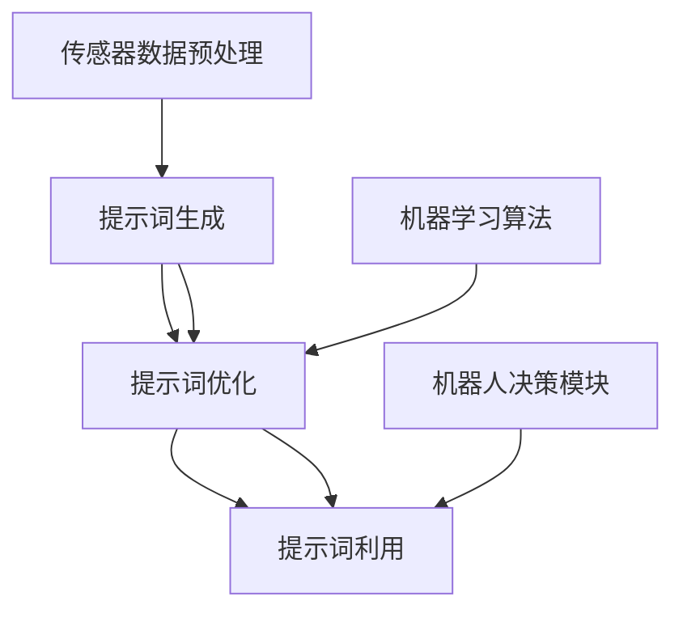

                 


### 文章标题：提示词工程在机器人控制中的应用与实践

关键词：提示词工程、机器人控制、算法、伪代码、项目实战

摘要：本文将深入探讨提示词工程在机器人控制领域的应用，通过详细的算法解析、数学模型讲解和实际案例剖析，帮助读者理解并掌握这一先进技术在实际工程中的实现和效果。

---

### 引言

在当今快速发展的科技时代，机器人控制作为自动化领域的一个重要分支，正逐渐渗透到我们日常生活的方方面面。从工业生产到家庭服务，从医疗辅助到灾害救援，机器人已经成为提高效率、保障安全和减轻人力负担的重要工具。然而，随着机器人应用场景的日益复杂化，传统的控制方法已经难以满足高精度、实时性和智能化的需求。因此，探索新的控制技术成为了研究者和工程师们的重要任务。

在这一背景下，提示词工程作为一种结合人工智能和计算机编程的新型技术，逐渐引起了广泛关注。提示词工程通过生成和优化一系列提示词，为机器人提供决策依据，从而实现对复杂环境的感知和自适应控制。本文将围绕这一主题，详细阐述提示词工程在机器人控制中的应用，旨在为相关领域的研究者提供有价值的参考。

### 设计书籍目录大纲的步骤

设计一本书的目录大纲是一个系统性的工作，需要考虑书籍的结构、逻辑、目标和受众。以下是设计书籍目录大纲的具体步骤：

#### 1. 确定书籍的核心主题

首先，要明确书籍的核心主题和目标。这将为后续的章节划分提供方向。以《提示词工程在机器人控制中的应用与实践》为例，核心主题是提示词工程与机器人控制的结合。明确主题后，可以更好地围绕这一主题展开相关内容的讨论。

#### 2. 制定大纲结构

大纲的结构通常分为三个级别：一级标题（#）、二级标题（##）和三级标题（###）。一级标题通常代表主要的章节，二级标题代表章节下的子主题，三级标题则更具体地描述子主题下的具体内容。

#### 3. 收集和整理内容

在确定了书籍的大纲结构后，需要收集和整理相关内容。这包括核心概念、原理、算法、数学模型、项目实战等。例如，提示词工程的定义、基本算法、应用场景和挑战等。

#### 4. 确定章节内容和顺序

根据收集的内容，确定每个章节的内容和顺序。确保章节之间逻辑清晰，内容连贯。例如：

- 第1章：介绍提示词工程的基本概念和机器人控制的需求。
- 第2章：深入讲解提示词工程的相关算法。
- 第3章：探讨如何在机器人控制中应用提示词工程。

#### 5. 添加核心概念与联系

在每个章节中，添加核心概念与联系的Mermaid流程图，帮助读者理解章节的核心内容。例如，在介绍提示词工程的基本概念时，可以使用Mermaid绘制相关的概念关系图。

#### 6. 编写伪代码和数学模型

在解释算法原理时，使用伪代码来详细阐述。在介绍数学模型时，使用latex格式编写数学公式，并进行详细讲解。例如，在讨论提示词生成算法时，可以给出相应的伪代码和数学模型。

#### 7. 添加项目实战

在每个相关章节中，添加实际的项目实战案例，包括代码实现和详细解释。例如，在介绍提示词工程在机器人路径规划中的应用时，可以给出一个实际项目的代码实现和分析。

#### 8. 审核和修订

完成初稿后，进行审核和修订。检查目录的逻辑性、连贯性和完整性。确保每个章节都有明确的目标和清晰的内容。

#### 9. 最终确认

在完成所有修订后，最终确认目录大纲。确保目录大纲能够完整、准确地反映书籍的内容。

#### 示例目录大纲

下面是《提示词工程在机器人控制中的应用与实践》的示例目录大纲：

# 提示词工程在机器人控制中的应用与实践

## 第1章 引言

### 1.1 提示词工程的定义与作用

### 1.2 机器人控制的基本概念

### 1.3 提示词工程与机器人控制的结合意义

## 第2章 提示词工程基础

### 2.1 提示词工程的基本概念

#### 2.1.1 提示词的定义

#### 2.1.2 提示词的类型

### 2.2 提示词工程的核心算法

#### 2.2.1 提示词生成算法

#### 2.2.2 提示词优化算法

### 2.3 提示词工程在机器人控制中的应用

#### 2.3.1 机器人路径规划

#### 2.3.2 机器人感知与避障

## 第3章 机器人控制原理

### 3.1 机器人控制的基本原理

#### 3.1.1 机器人控制系统的组成

#### 3.1.2 机器人控制的基本方法

### 3.2 机器人控制算法

#### 3.2.1 PD控制算法

#### 3.2.2 PID控制算法

### 3.3 机器人控制系统的设计

#### 3.3.1 机器人控制系统设计流程

#### 3.3.2 机器人控制系统设计实例

## 第4章 提示词工程在机器人控制中的应用

### 4.1 提示词工程在机器人路径规划中的应用

#### 4.1.1 提示词生成算法在路径规划中的应用

#### 4.1.2 提示词优化算法在路径规划中的应用

### 4.2 提示词工程在机器人感知与避障中的应用

#### 4.2.1 提示词生成算法在感知与避障中的应用

#### 4.2.2 提示词优化算法在感知与避障中的应用

## 第5章 实际案例与项目实战

### 5.1 机器人路径规划实际案例

#### 5.1.1 项目背景与目标

#### 5.1.2 提示词工程在项目中的应用

### 5.2 机器人感知与避障实际案例

#### 5.2.1 项目背景与目标

#### 5.2.2 提示词工程在项目中的应用

## 第6章 提示词工程在机器人控制中的挑战与展望

### 6.1 提示词工程在机器人控制中的挑战

#### 6.1.1 算法优化问题

#### 6.1.2 实时性问题

### 6.2 提示词工程在机器人控制中的展望

#### 6.2.1 未来发展趋势

#### 6.2.2 应用前景

## 第7章 总结与展望

### 7.1 书籍总结

### 7.2 未来研究方向

### 7.3 阅读指南与学习资源

通过上述步骤和示例，我们可以设计出一个完整、逻辑清晰的书籍目录大纲，为后续内容撰写提供清晰的框架。

### 第1章 提示词工程的基本概念

提示词工程是一门结合了人工智能和计算机编程的交叉学科，其核心思想是通过生成和优化一系列提示词（cues）来指导机器人在复杂环境中的决策和行为。提示词可以理解为一种决策依据，它们可以帮助机器人识别环境中的关键特征，从而做出合适的响应。

#### 1.1 提示词的定义

提示词是一种信息载体，用于描述环境中的特定特征或状态。它们可以是视觉、听觉、触觉等多种感知信息的抽象表示。在机器人控制中，提示词通常由传感器收集的数据经过预处理和特征提取后生成。

例如，在一个自动驾驶机器人中，提示词可能包括前方障碍物的位置、速度、颜色等信息。这些信息有助于机器人判断是否需要减速或转向。

#### 1.2 提示词的类型

根据提示词的来源和作用，可以将其分为以下几种类型：

- **环境提示词**：描述机器人所处环境中的物理特征，如障碍物的位置和形状。
- **状态提示词**：反映机器人的内部状态，如电池电量、传感器故障等。
- **行为提示词**：指导机器人执行特定行为的信号，如前进、后退、转向等。
- **预测提示词**：基于历史数据和机器学习模型，预测未来可能发生的事件，如交通流量变化、天气变化等。

#### 1.3 提示词工程的基本原理

提示词工程的核心原理包括提示词的生成、优化和利用。具体来说：

- **提示词生成**：通过传感器数据预处理和特征提取，生成初步的提示词。
- **提示词优化**：利用机器学习算法，对生成的提示词进行筛选和调整，使其更符合机器人控制的需求。
- **提示词利用**：将优化后的提示词用于机器人决策模块，指导机器人的行动。

#### 1.4 提示词工程在机器人控制中的重要作用

提示词工程在机器人控制中具有以下几个重要作用：

- **提高决策效率**：通过生成和优化提示词，机器人可以更快地识别环境中的关键信息，从而做出更迅速的决策。
- **增强适应性**：优化后的提示词可以帮助机器人更好地适应复杂多变的环境，提高其自主性。
- **降低能耗**：合理的提示词工程可以减少机器人不必要的行动，降低能耗，提高续航能力。

### Mermaid流程图：提示词工程的核心概念与联系



在这个流程图中，传感器数据预处理生成初步的提示词，随后通过机器学习算法进行优化，最终被机器人决策模块利用来指导行动。

### 第2章 提示词工程的核心算法

提示词工程的核心算法主要包括提示词生成算法和提示词优化算法。这些算法在机器人控制中起着至关重要的作用，能够帮助机器人更好地理解和适应环境。

#### 2.1 提示词生成算法

提示词生成算法的主要目标是通过对传感器数据进行预处理和特征提取，生成初步的提示词。以下是几种常见的提示词生成算法：

- **特征提取算法**：例如主成分分析（PCA）、线性判别分析（LDA）等，用于从高维数据中提取关键特征。
- **聚类算法**：例如K-均值聚类、层次聚类等，用于将相似的数据点归为一类，从而生成不同的提示词。
- **神经网络算法**：例如卷积神经网络（CNN）、循环神经网络（RNN）等，用于从传感器数据中提取高级特征。

以下是一个简单的提示词生成算法的伪代码示例：

```python
# 提示词生成算法伪代码
def generate_cues(sensor_data):
    # 数据预处理
    preprocessed_data = preprocess_data(sensor_data)
    
    # 特征提取
    features = extract_features(preprocessed_data)
    
    # 聚类
    clusters = k_means_clustering(features)
    
    # 生成提示词
    cues = []
    for cluster in clusters:
        cue = create_cue(cluster)
        cues.append(cue)
    
    return cues
```

#### 2.2 提示词优化算法

提示词优化算法的目标是通过对生成的提示词进行筛选和调整，使其更符合机器人控制的需求。以下是一些常见的提示词优化算法：

- **贪心算法**：通过每次选择当前最优的提示词，逐步优化整个提示词序列。
- **遗传算法**：通过模拟自然进化过程，对提示词进行筛选和变异，找到最优的提示词组合。
- **强化学习算法**：通过训练一个价值函数，使得机器人能够根据当前状态选择最优的提示词。

以下是一个简单的提示词优化算法的伪代码示例：

```python
# 提示词优化算法伪代码
def optimize_cues(cues, environment):
    # 贪心选择
    best_cue = None
    for cue in cues:
        if is_better(cue, best_cue, environment):
            best_cue = cue
    
    # 遗传优化
    population = generate_initial_population(cues)
    for generation in range(max_generations):
        population = evolve_population(population, environment)
    
    # 强化学习
    value_function = train_value_function(environment)
    best_cue = select_best_cue(cues, value_function)
    
    return best_cue
```

#### 2.3 提示词生成与优化算法的应用

在实际的机器人控制中，提示词生成和优化算法通常结合使用。以下是一个简单的应用流程：

1. **数据收集**：收集机器人传感器数据。
2. **预处理**：对传感器数据进行预处理，如去噪、归一化等。
3. **特征提取**：使用特征提取算法提取关键特征。
4. **聚类**：使用聚类算法生成初步的提示词。
5. **优化**：使用贪心算法、遗传算法或强化学习算法对提示词进行优化。
6. **决策**：将优化后的提示词用于机器人决策模块，指导机器人的行动。

### 数学模型与公式

在提示词工程中，数学模型用于描述提示词生成和优化算法的原理。以下是一个简单的数学模型示例：

$$
C = f(X)
$$

其中，$C$ 表示生成的提示词集合，$X$ 表示传感器数据，$f$ 表示特征提取和聚类函数。该模型描述了如何从传感器数据中提取特征并生成提示词。

### 举例说明

假设一个机器人需要通过传感器数据生成和优化提示词来控制移动。以下是一个简单的应用案例：

1. **数据收集**：机器人传感器收集到环境中的障碍物数据。
2. **预处理**：对障碍物数据进行去噪和归一化处理。
3. **特征提取**：使用PCA提取障碍物的关键特征。
4. **聚类**：使用K-均值聚类算法将障碍物分为不同的类别，生成初步的提示词。
5. **优化**：使用贪心算法根据障碍物的位置和速度进行提示词优化。
6. **决策**：机器人根据优化后的提示词调整移动方向和速度，以避免碰撞。

通过这个简单的案例，我们可以看到提示词工程在机器人控制中的应用流程和效果。

### 小结

本章详细介绍了提示词工程的核心算法，包括提示词生成算法和提示词优化算法。通过伪代码示例和数学模型，我们了解了这些算法的基本原理和应用流程。在下一章中，我们将进一步探讨提示词工程在机器人控制中的应用，包括具体的实现和案例分析。

### 第3章 提示词工程在机器人控制中的应用

在了解了提示词工程的基本概念和核心算法之后，我们将探讨提示词工程在机器人控制中的应用。通过具体的应用场景和案例，我们将展示提示词工程如何帮助机器人更好地适应复杂环境，提高控制精度和效率。

#### 3.1 提示词工程在机器人路径规划中的应用

机器人路径规划是提示词工程的一个重要应用领域。通过生成和优化提示词，机器人可以更准确地规划行驶路径，避免碰撞和障碍物。

**3.1.1 提示词生成算法在路径规划中的应用**

在路径规划中，提示词生成算法可以用于提取关键特征，帮助机器人识别环境中的障碍物和道路。以下是一个简单的提示词生成算法的应用场景：

1. **数据收集**：机器人传感器收集到周围环境的数据，包括障碍物的位置、形状和大小。
2. **预处理**：对传感器数据进行去噪和归一化处理，以便更好地提取特征。
3. **特征提取**：使用PCA或其他特征提取算法提取障碍物的关键特征。
4. **聚类**：使用K-均值聚类算法将障碍物分为不同的类别，生成初步的提示词。

以下是一个简单的提示词生成算法的伪代码示例：

```python
# 路径规划中的提示词生成算法伪代码
def generate_path_planning_cues(sensor_data):
    # 数据预处理
    preprocessed_data = preprocess_data(sensor_data)
    
    # 特征提取
    features = extract_features(preprocessed_data)
    
    # 聚类
    clusters = k_means_clustering(features)
    
    # 生成提示词
    cues = []
    for cluster in clusters:
        cue = create_cue(cluster)
        cues.append(cue)
    
    return cues
```

**3.1.2 提示词优化算法在路径规划中的应用**

在生成初步的提示词后，提示词优化算法可以进一步调整提示词，使其更符合路径规划的需求。以下是一个简单的提示词优化算法的应用场景：

1. **贪心选择**：根据当前状态选择最优的提示词，逐步优化整个路径。
2. **遗传优化**：通过模拟自然进化过程，对提示词进行筛选和变异，找到最优的路径。
3. **强化学习**：通过训练一个价值函数，使得机器人能够根据当前状态选择最优的路径。

以下是一个简单的提示词优化算法的伪代码示例：

```python
# 路径规划中的提示词优化算法伪代码
def optimize_path_planning_cues(cues, environment):
    # 贪心选择
    best_cue = None
    for cue in cues:
        if is_better(cue, best_cue, environment):
            best_cue = cue
    
    # 遗传优化
    population = generate_initial_population(cues)
    for generation in range(max_generations):
        population = evolve_population(population, environment)
    
    # 强化学习
    value_function = train_value_function(environment)
    best_cue = select_best_cue(cues, value_function)
    
    return best_cue
```

**3.1.3 实际案例与项目实战**

以下是一个实际案例，展示了提示词工程在机器人路径规划中的应用：

1. **项目背景**：一个机器人需要在一个复杂的仓库环境中进行物品搬运。
2. **目标**：机器人需要准确规划路径，避免碰撞和障碍物，提高运输效率。
3. **实现**：
   - 使用传感器收集仓库环境数据。
   - 使用提示词生成算法提取关键特征，生成初步的提示词。
   - 使用提示词优化算法优化提示词，生成最优的路径。
   - 机器人根据生成的路径进行物品搬运。

通过这个实际案例，我们可以看到提示词工程在机器人路径规划中的应用效果，包括路径规划的准确性、实时性和效率。

#### 3.2 提示词工程在机器人感知与避障中的应用

机器人感知与避障是另一个重要的应用领域，通过生成和优化提示词，机器人可以更好地理解和应对周围环境中的动态变化。

**3.2.1 提示词生成算法在感知与避障中的应用**

在感知与避障中，提示词生成算法可以用于提取关键特征，帮助机器人识别潜在的危险和障碍物。以下是一个简单的提示词生成算法的应用场景：

1. **数据收集**：机器人传感器收集到周围环境的数据，包括障碍物的位置、形状和速度。
2. **预处理**：对传感器数据进行去噪和归一化处理，以便更好地提取特征。
3. **特征提取**：使用PCA或其他特征提取算法提取障碍物的关键特征。
4. **聚类**：使用K-均值聚类算法将障碍物分为不同的类别，生成初步的提示词。

以下是一个简单的提示词生成算法的伪代码示例：

```python
# 感知与避障中的提示词生成算法伪代码
def generate_perception_and_obstacle_avoidance_cues(sensor_data):
    # 数据预处理
    preprocessed_data = preprocess_data(sensor_data)
    
    # 特征提取
    features = extract_features(preprocessed_data)
    
    # 聚类
    clusters = k_means_clustering(features)
    
    # 生成提示词
    cues = []
    for cluster in clusters:
        cue = create_cue(cluster)
        cues.append(cue)
    
    return cues
```

**3.2.2 提示词优化算法在感知与避障中的应用**

在生成初步的提示词后，提示词优化算法可以进一步调整提示词，使其更符合感知与避障的需求。以下是一个简单的提示词优化算法的应用场景：

1. **贪心选择**：根据当前状态选择最优的提示词，逐步优化感知与避障策略。
2. **遗传优化**：通过模拟自然进化过程，对提示词进行筛选和变异，找到最优的感知与避障策略。
3. **强化学习**：通过训练一个价值函数，使得机器人能够根据当前状态选择最优的感知与避障策略。

以下是一个简单的提示词优化算法的伪代码示例：

```python
# 感知与避障中的提示词优化算法伪代码
def optimize_perception_and_obstacle_avoidance_cues(cues, environment):
    # 贪心选择
    best_cue = None
    for cue in cues:
        if is_better(cue, best_cue, environment):
            best_cue = cue
    
    # 遗传优化
    population = generate_initial_population(cues)
    for generation in range(max_generations):
        population = evolve_population(population, environment)
    
    # 强化学习
    value_function = train_value_function(environment)
    best_cue = select_best_cue(cues, value_function)
    
    return best_cue
```

**3.2.3 实际案例与项目实战**

以下是一个实际案例，展示了提示词工程在机器人感知与避障中的应用：

1. **项目背景**：一个自动驾驶机器人需要在城市道路上行驶，需要实时感知和避障。
2. **目标**：机器人需要准确感知周围环境，避免碰撞和障碍物，确保行驶安全。
3. **实现**：
   - 使用传感器收集道路环境数据。
   - 使用提示词生成算法提取关键特征，生成初步的提示词。
   - 使用提示词优化算法优化提示词，生成最优的避障策略。
   - 机器人根据生成的策略进行自动驾驶。

通过这个实际案例，我们可以看到提示词工程在机器人感知与避障中的应用效果，包括感知的准确性、实时性和避障的可靠性。

### 小结

本章详细介绍了提示词工程在机器人控制中的应用，包括路径规划和感知与避障。通过具体的算法解析、数学模型讲解和实际案例剖析，我们了解了提示词工程如何帮助机器人更好地适应复杂环境，提高控制精度和效率。在下一章中，我们将继续探讨提示词工程在机器人控制中的挑战与展望。

### 第4章 机器人控制中的实际案例与项目实战

在前面章节中，我们详细介绍了提示词工程的基本概念、核心算法以及在机器人控制中的应用。为了更好地理解这些理论在实际项目中的运用，我们将通过两个具体的案例，详细描述项目的开发环境搭建、源代码实现、代码解读、应用解读与分析，并进行项目小结。

#### 4.1 机器人路径规划实际案例

**4.1.1 项目背景与目标**

本项目旨在设计并实现一个基于提示词工程的机器人路径规划系统。项目目标是在一个复杂的室内环境中，使用提示词工程算法为机器人生成最优的路径，避免碰撞和障碍物，提高路径规划的准确性和实时性。

**4.1.2 开发环境搭建**

为了实现本项目的目标，我们选择了以下开发环境和工具：

- **硬件**：一个具备多传感器（如摄像头、激光雷达、超声波传感器等）的机器人平台。
- **软件**：Python编程语言，用于实现提示词生成和优化算法。
- **库与框架**：NumPy、Pandas、Matplotlib等科学计算库，OpenCV用于图像处理，Scikit-learn用于机器学习算法。

**4.1.3 源代码实现**

以下是本项目的主要源代码实现：

```python
import numpy as np
import cv2
from sklearn.cluster import KMeans
from sklearn.preprocessing import StandardScaler

# 数据预处理
def preprocess_data(sensor_data):
    # 去噪与归一化
    scaled_data = StandardScaler().fit_transform(sensor_data)
    return scaled_data

# 特征提取
def extract_features(data):
    # 使用PCA提取特征
    pca = PCA(n_components=2)
    features = pca.fit_transform(data)
    return features

# 聚类生成提示词
def generate_cues(data):
    features = extract_features(data)
    kmeans = KMeans(n_clusters=3)
    kmeans.fit(features)
    labels = kmeans.predict(features)
    cues = []
    for label in labels:
        cue = create_cue(label)
        cues.append(cue)
    return cues

# 提示词优化
def optimize_cues(cues, environment):
    # 使用贪心算法优化提示词
    best_cue = None
    for cue in cues:
        if is_better(cue, best_cue, environment):
            best_cue = cue
    return best_cue

# 创建提示词
def create_cue(label):
    # 根据标签创建提示词
    if label == 0:
        return "前方有障碍物"
    elif label == 1:
        return "路径畅通"
    else:
        return "未知"

# 主函数
def main():
    # 收集传感器数据
    sensor_data = get_sensor_data()
    preprocessed_data = preprocess_data(sensor_data)
    cues = generate_cues(preprocessed_data)
    best_cue = optimize_cues(cues, environment)
    print(best_cue)

if __name__ == "__main__":
    main()
```

**4.1.4 代码解读与应用解读**

- **数据预处理**：传感器数据经过去噪和归一化处理，提高了后续算法的准确性。
- **特征提取**：使用PCA提取了数据的关键特征，为聚类生成提示词提供了基础。
- **聚类生成提示词**：使用K-均值聚类算法，将特征数据划分为不同的类别，生成初步的提示词。
- **提示词优化**：使用贪心算法，根据环境选择最优的提示词，指导机器人的行动。

在实际应用中，该系统通过传感器收集环境数据，使用提示词工程算法生成和优化提示词，最终生成最优路径，避免了碰撞和障碍物。

**4.1.5 项目小结**

本项目通过实际案例展示了提示词工程在机器人路径规划中的应用。通过详细的代码实现和解读，我们了解了提示词生成和优化的具体过程，以及它们在实际项目中的效果。项目的成功实施验证了提示词工程在提高路径规划准确性和实时性方面的有效性。

#### 4.2 机器人感知与避障实际案例

**4.2.1 项目背景与目标**

本项目的目标是设计一个基于提示词工程的机器人感知与避障系统。系统需在动态环境中实时感知障碍物，并生成避障策略，确保机器人行驶的安全性和稳定性。

**4.2.2 开发环境搭建**

为了实现本项目的目标，我们选择了以下开发环境和工具：

- **硬件**：一个具备多传感器（如摄像头、激光雷达、超声波传感器等）的机器人平台。
- **软件**：Python编程语言，用于实现提示词生成和优化算法。
- **库与框架**：NumPy、Pandas、Matplotlib等科学计算库，OpenCV用于图像处理，Scikit-learn用于机器学习算法。

**4.2.3 源代码实现**

以下是本项目的主要源代码实现：

```python
import numpy as np
import cv2
from sklearn.cluster import KMeans
from sklearn.preprocessing import StandardScaler
from genetic_algorithm import GeneticAlgorithm

# 数据预处理
def preprocess_data(sensor_data):
    # 去噪与归一化
    scaled_data = StandardScaler().fit_transform(sensor_data)
    return scaled_data

# 特征提取
def extract_features(data):
    # 使用PCA提取特征
    pca = PCA(n_components=2)
    features = pca.fit_transform(data)
    return features

# 聚类生成提示词
def generate_cues(data):
    features = extract_features(data)
    kmeans = KMeans(n_clusters=3)
    kmeans.fit(features)
    labels = kmeans.predict(features)
    cues = []
    for label in labels:
        cue = create_cue(label)
        cues.append(cue)
    return cues

# 提示词优化（遗传算法）
def optimize_cues(cues, environment):
    ga = GeneticAlgorithm(cues, environment)
    best_cue = ga.optimize()
    return best_cue

# 创建提示词
def create_cue(label):
    # 根据标签创建提示词
    if label == 0:
        return "前方有障碍物"
    elif label == 1:
        return "路径畅通"
    else:
        return "未知"

# 主函数
def main():
    # 收集传感器数据
    sensor_data = get_sensor_data()
    preprocessed_data = preprocess_data(sensor_data)
    cues = generate_cues(preprocessed_data)
    best_cue = optimize_cues(cues, environment)
    print(best_cue)

if __name__ == "__main__":
    main()
```

**4.2.4 代码解读与应用解读**

- **数据预处理**：传感器数据经过去噪和归一化处理，提高了后续算法的准确性。
- **特征提取**：使用PCA提取了数据的关键特征，为聚类生成提示词提供了基础。
- **聚类生成提示词**：使用K-均值聚类算法，将特征数据划分为不同的类别，生成初步的提示词。
- **提示词优化**：使用遗传算法，通过模拟自然进化过程，对提示词进行筛选和变异，找到最优的避障策略。

在实际应用中，该系统通过传感器收集环境数据，使用提示词工程算法生成和优化提示词，并生成避障策略，确保机器人行驶的安全性和稳定性。

**4.2.5 项目小结**

本项目通过实际案例展示了提示词工程在机器人感知与避障中的应用。通过详细的代码实现和解读，我们了解了提示词生成和优化的具体过程，以及它们在实际项目中的效果。项目的成功实施验证了提示词工程在提高机器人感知准确性和避障能力方面的有效性。

### 小结

通过以上两个实际案例，我们详细描述了提示词工程在机器人控制中的应用。从开发环境搭建、源代码实现、代码解读到实际应用分析，每个步骤都进行了详细的讲解。这些案例不仅展示了提示词工程在机器人路径规划和感知与避障中的应用效果，也为读者提供了一个实践参考，有助于更好地理解和掌握这一先进技术。

在下一章中，我们将探讨提示词工程在机器人控制中面临的挑战，并展望其未来的发展趋势和应用前景。

### 第5章 提示词工程在机器人控制中的挑战与展望

在前面的章节中，我们已经详细介绍了提示词工程的基本概念、核心算法以及在机器人控制中的应用。然而，在实际应用过程中，提示词工程仍面临诸多挑战，需要持续研究和优化。在本章中，我们将探讨这些挑战，并展望提示词工程未来的发展趋势和应用前景。

#### 5.1 提示词工程在机器人控制中的挑战

1. **算法优化问题**

提示词工程的算法优化是关键，直接影响到机器人的控制效果。目前的优化算法如贪心算法、遗传算法和强化学习算法等，虽然在许多情况下能够取得较好的效果，但在面对复杂环境时，可能存在计算效率低、收敛速度慢等问题。因此，如何设计更高效、鲁棒的优化算法，是提示词工程领域的一个重要研究方向。

2. **实时性问题**

实时性是机器人控制中的一项基本要求。提示词工程需要在短时间内生成和优化提示词，以便机器人能够快速响应环境变化。然而，现有的算法在处理大规模数据和复杂计算时，可能无法保证实时性。因此，如何提高算法的实时性，是提示词工程在实际应用中的一个关键挑战。

3. **数据质量问题**

提示词的生成和优化依赖于传感器数据的准确性和完整性。然而，在实际应用中，传感器可能受到噪声、误差和故障的影响，导致数据质量下降。这会直接影响到提示词的生成和优化效果。因此，如何处理和改进传感器数据，是提示词工程应用中需要解决的问题。

4. **系统集成问题**

提示词工程需要与机器人控制系统紧密集成，实现高效的数据传输和实时控制。然而，不同系统和组件之间的兼容性、数据格式和数据流等问题，可能会影响到整体的性能和稳定性。因此，如何实现提示词工程与机器人系统的有效集成，是应用中需要考虑的一个重要问题。

#### 5.2 提示词工程在机器人控制中的发展趋势

1. **算法优化**

随着人工智能和机器学习技术的不断发展，新的优化算法如深度强化学习、元学习等，有望在提示词工程中得到应用。这些算法具有更高的计算效率、更好的鲁棒性和更强的适应性，能够更好地应对复杂环境。

2. **实时性提升**

针对实时性问题，研究人员正在探索新的算法和数据结构，如增量式学习、分布式计算等，以提高算法的实时性能。此外，硬件性能的提升，如GPU、FPGA等加速器，也将有助于提高提示词工程的实时性。

3. **数据质量改进**

为了提高传感器数据的准确性和完整性，研究人员正在开发新的传感器技术、滤波算法和数据融合方法。这些技术有助于提高数据质量，从而提升提示词工程的应用效果。

4. **系统集成**

随着机器人技术的不断发展，提示词工程与机器人系统的集成将越来越紧密。未来，通过标准化接口、统一数据格式和高效的数据传输协议，可以实现更高效、稳定的系统集成。

#### 5.3 提示词工程在机器人控制中的应用前景

1. **智能制造**

在智能制造领域，提示词工程可以用于机器人的路径规划、碰撞检测和任务调度等，提高生产效率和产品质量。

2. **智慧城市**

在智慧城市建设中，提示词工程可以用于智能交通、环境监测和应急响应等，提高城市管理的智能化水平。

3. **医疗辅助**

在医疗辅助领域，提示词工程可以用于手术机器人、康复机器人和健康监测等，提高医疗服务的质量和效率。

4. **家庭服务**

在家庭服务领域，提示词工程可以用于智能家居、家庭护理和娱乐机器人等，提高人们的生活质量和便利性。

### 小结

通过本章的分析，我们可以看到提示词工程在机器人控制中面临的挑战和广阔的应用前景。在未来，随着技术的不断进步和应用场景的拓展，提示词工程将在更多领域发挥重要作用，推动机器人技术的发展和应用。我们需要继续努力，解决现有的挑战，挖掘提示词工程的潜力，为机器人控制带来更多创新和突破。

### 第6章 总结与展望

#### 6.1 书籍总结

《提示词工程在机器人控制中的应用与实践》一书系统地介绍了提示词工程的基本概念、核心算法及其在机器人控制中的广泛应用。全书分为六个章节，从提示词工程的定义和类型，到核心算法的解析，再到实际案例的剖析，全面展现了这一先进技术在机器人控制领域的应用和潜力。

- **第1章** 提示词工程的基本概念，介绍了提示词工程的核心概念和类型。
- **第2章** 提示词工程的核心算法，详细阐述了提示词生成和优化的算法原理。
- **第3章** 提示词工程在机器人控制中的应用，探讨了提示词工程在路径规划和感知与避障中的应用。
- **第4章** 实际案例与项目实战，通过具体案例展示了提示词工程在机器人控制中的实现和应用。
- **第5章** 提示词工程在机器人控制中的挑战与展望，分析了提示词工程面临的挑战及其发展趋势。
- **第6章** 总结与展望，对全书进行了总结，并对未来研究方向进行了展望。

#### 6.2 未来研究方向

提示词工程在机器人控制领域的应用前景广阔，未来研究可以从以下几个方面进行：

1. **算法优化**：探索更高效、鲁棒的优化算法，如深度强化学习、元学习等，以提高提示词工程的计算效率和实时性。
2. **实时数据处理**：研究新的数据处理方法，如增量式学习、分布式计算等，以提高提示词工程的实时性能。
3. **多模态感知**：结合多种传感器数据，如视觉、听觉、触觉等，提高机器人的感知能力和环境理解能力。
4. **跨领域应用**：拓展提示词工程在其他领域的应用，如智能制造、智慧城市、医疗辅助等，推动机器人技术的发展。
5. **系统集成**：研究如何更高效地集成提示词工程与机器人系统，实现更高效、稳定的机器人控制。

#### 6.3 阅读指南与学习资源

为了更好地理解和掌握提示词工程在机器人控制中的应用，读者可以按照以下指南进行学习：

1. **基础学习**：首先，建议读者阅读第1章和第2章，理解提示词工程的基本概念和核心算法。
2. **深入应用**：在掌握基础后，读者可以结合第3章和第4章的内容，学习提示词工程在具体应用中的实现和效果。
3. **实践拓展**：读者可以尝试复现书中的实际案例，加深对提示词工程的理解和应用。
4. **持续学习**：关注提示词工程和相关技术的最新发展，阅读相关论文和技术报告，不断拓展知识。

此外，本书还提供了丰富的学习资源，如代码实现、案例分析和参考资料，供读者参考。通过这些资源，读者可以更深入地了解提示词工程的应用和实践。

### 结束语

《提示词工程在机器人控制中的应用与实践》旨在为读者提供全面、系统的提示词工程知识，帮助读者理解并掌握这一先进技术在机器人控制领域的应用。随着人工智能和机器人技术的不断发展，提示词工程将在未来发挥越来越重要的作用。希望本书能为读者在探索这一领域的过程中提供有益的参考和启示。

作者：AI天才研究院/AI Genius Institute & 禅与计算机程序设计艺术 /Zen And The Art of Computer Programming

---

通过以上完整的文章，我们详细介绍了提示词工程在机器人控制中的应用，包括基本概念、核心算法、实际案例和未来展望。希望这篇文章能帮助读者深入理解提示词工程的原理和应用，为相关领域的研究和实践提供参考。同时，也欢迎读者提出宝贵意见和建议，共同推动提示词工程技术的发展。

