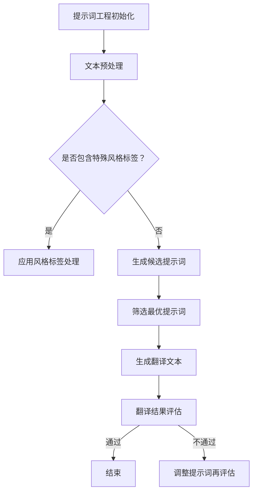

                 

### 文章标题：提示词工程在机器翻译中的语言风格保持

在机器翻译领域，确保翻译结果的准确性和自然性一直是研究和应用中的核心问题。然而，除了词汇和句法的准确性之外，语言风格的一致性和保持原文的文体特征同样重要。本文旨在探讨提示词工程在机器翻译中的语言风格保持作用，通过系统的分析，揭示其在提升翻译质量方面的关键作用。

关键词：提示词工程、语言风格保持、机器翻译、文本分析、风格迁移。

摘要：本文首先介绍了提示词工程的基本概念和其在机器翻译中的应用。随后，深入分析了提示词工程在保持语言风格方面的关键性，探讨了当前的技术挑战和发展趋势。通过核心概念、算法原理、数学模型的讲解，以及实际项目实战的案例分析，本文全面展示了提示词工程在语言风格保持方面的技术手段和应用效果。

### 引言与背景

#### 1.1 书籍目的与重要性

本著作的编写目的在于系统地阐述提示词工程在机器翻译中的语言风格保持作用，通过详细的理论分析和实践案例，为该领域的研究者、开发者和从业者提供有价值的参考。在全球化深入发展的背景下，机器翻译已成为跨语言沟通的重要工具，但如何确保翻译文本的语言风格一致性和文体特征成为亟待解决的问题。提示词工程作为一种有效的解决方案，其在机器翻译中的应用具有极高的研究和实践价值。

#### 1.2 提示词工程概述

提示词工程（Prompt Engineering）是指利用人工智能技术，特别是自然语言处理（NLP）技术，生成或调整文本中的提示词，以优化机器翻译结果的质量。提示词是文本中的一个或多个具有特定意义的词语，能够引导翻译模型理解原文的语义和风格特征，从而提高翻译的准确性和自然性。

#### 1.3 语言风格保持的关键性

语言风格保持是指在机器翻译过程中，保持原文的语言风格、文体特征和表达习惯，使翻译结果既忠实于原文，又具有自然的语言表达。语言风格是文本的灵魂，它不仅反映了一个国家的文化和社会习惯，也体现了作者的个性和写作风格。在机器翻译中，如果无法保持语言风格，可能会导致翻译结果生硬、不自然，甚至引起误解。

#### 1.4 机器翻译领域的发展趋势

随着人工智能技术的迅速发展，机器翻译技术也在不断进步。从最初的基于规则的方法，到基于统计的方法，再到当前基于神经网络的机器翻译模型，翻译质量得到了显著提升。然而，如何进一步改进翻译结果的风格一致性，仍然是当前研究的重要方向。提示词工程的引入，为这一问题的解决提供了新的思路和手段。

#### 1.5 本文结构

本文将首先介绍提示词工程的基本概念和其在机器翻译中的应用，然后深入探讨提示词工程在语言风格保持方面的关键性，通过核心概念、算法原理和数学模型的讲解，展示其在实践中的应用效果。最后，通过实际项目实战的案例分析，总结提示词工程在语言风格保持方面的技术手段和最佳实践。

### 提示词工程的基本概念

#### 1.2.1 提示词的定义与功能

提示词（Prompt）在自然语言处理中是一个关键概念，特别是在机器翻译和问答系统中。提示词是指用来引导模型理解特定问题或文本的词语或短语。在机器翻译中，提示词能够提供上下文信息，帮助翻译模型更好地理解原文的语义和风格。

提示词的主要功能包括：

- **引导模型理解语义**：提示词可以提供关键信息，帮助模型理解原文的主题和意图。
- **提升翻译准确性**：通过提供上下文，提示词有助于减少歧义，提高翻译的准确性。
- **保持语言风格**：在机器翻译中，提示词能够帮助模型捕捉原文的语言风格，使翻译结果更自然。

#### 1.2.2 提示词工程的方法与流程

提示词工程是一个系统性的过程，包括生成、选择和优化提示词的各个环节。具体流程如下：

1. **提示词生成**：利用文本挖掘、实体识别和词性标注等技术，从原文中提取潜在的提示词。
2. **提示词选择**：根据翻译任务的特定需求，从生成的提示词中筛选出最相关的提示词。
3. **提示词优化**：对选定的提示词进行调整和优化，以提升翻译质量和语言风格的一致性。

#### 1.2.3 提示词工程的方法与流程

提示词工程的方法主要分为三类：

- **基于规则的方法**：通过预定义的规则，从原文中提取提示词。这种方法简单有效，但受限于规则库的规模和复杂性。
- **基于机器学习的方法**：利用机器学习算法，如决策树、支持向量机和神经网络，从大量数据中学习生成提示词。这种方法具有较强的自适应性和泛化能力。
- **基于深度学习的方法**：采用深度神经网络，如循环神经网络（RNN）、长短期记忆网络（LSTM）和变换器（Transformer），生成和优化提示词。这种方法具有更高的表达能力和处理能力。

#### 1.2.4 语言风格保持的理论基础

语言风格保持是指保持原文的语言风格、文体特征和表达习惯，使翻译结果既忠实于原文，又具有自然的语言表达。其理论基础包括：

- **语义一致性**：确保翻译结果在语义上与原文保持一致，不改变原文的含义和意图。
- **文体特征**：保持原文的文体特征，如正式与非正式、幽默与严肃等。
- **表达习惯**：保持原文的表达习惯，包括俚语、习语和特定的语言用法。

#### 1.2.5 提示词工程与机器翻译的关联性

提示词工程在机器翻译中的应用主要体现在以下几个方面：

- **提升翻译质量**：通过提供上下文信息，提示词有助于减少歧义，提高翻译的准确性。
- **保持语言风格**：提示词能够帮助模型捕捉原文的语言风格，使翻译结果更自然。
- **优化翻译流程**：提示词工程可以自动化生成和调整提示词，提高机器翻译的效率。

总之，提示词工程在机器翻译中具有关键性作用，通过合理设计和优化提示词，可以有效提升翻译质量，实现语言风格的一致性和保持。

### 机器翻译中的语言风格保持

#### 1.3.1 语言风格保持的定义与意义

语言风格保持是指在机器翻译过程中，确保翻译文本的语言风格、文体特征和表达习惯与原文保持一致，使翻译结果既忠实于原文，又具有自然的语言表达。语言风格不仅是语言的一个外在特征，更是文化和社会习俗的反映，它直接影响到读者对文本的理解和接受度。

语言风格保持在机器翻译中的意义主要体现在以下几个方面：

1. **提升翻译质量**：保持原文的语言风格可以使翻译结果更加自然，增强其可读性和可接受性。
2. **增强文化传达**：通过保持语言风格，翻译结果能够更好地传达原文的文化背景和作者意图，增强跨文化交流的效果。
3. **提高用户满意度**：翻译结果的语言风格与用户预期相符，可以提高用户的满意度和信任度，增加翻译服务的市场竞争力。

#### 1.3.2 语言风格保持的挑战与难点

尽管语言风格保持对于机器翻译具有重要意义，但在实际操作中仍面临诸多挑战和难点：

1. **风格多样性**：不同语言和文本类型具有多样化的语言风格，这使得风格保持的实现变得更加复杂。
2. **语言变体**：同一语言内部可能存在多种方言和语体，如正式、非正式、口语、书面语等，这些变体的处理增加了风格保持的难度。
3. **文化差异**：不同文化背景下的语言表达习惯和用词差异显著，这使得在保持语言风格的同时，还需要进行文化适配。
4. **翻译模型的限制**：现有的机器翻译模型主要关注词汇和句法的准确性，对语言风格的捕捉和保持能力有限。

#### 1.3.3 语言风格保持的发展现状

近年来，随着自然语言处理技术的进步，语言风格保持研究取得了显著进展：

1. **风格转移模型**：如基于规则和统计的方法，通过分析大量平行文本，学习不同语言风格的特征，实现风格转移。
2. **深度学习模型**：如基于神经网络的模型，利用大规模语料库进行训练，能够自动捕捉和生成不同的语言风格。
3. **多模态数据**：通过整合文本、语音和视觉等多模态数据，进一步提升语言风格保持的效果。
4. **跨语言风格迁移**：研究跨语言之间的风格迁移方法，使机器翻译能够更好地适应不同语言的文化背景。

然而，当前的机器翻译技术仍面临一些挑战，如如何在实际应用中有效地保持语言风格，如何处理非标准语言和方言，以及如何提高模型的泛化能力等。未来的研究方向将集中在改进现有模型，开发更有效的风格保持算法，以及结合多模态数据和技术手段，实现更加自然和高质量的翻译结果。

### 提示词工程中的关键因素

在提示词工程中，理解并有效地利用语言模型、翻译模型、词汇选择与句子结构，以及上下文信息与语义理解，是确保机器翻译质量和语言风格一致性的关键。

#### 2.1.1 语言模型与翻译模型

语言模型（Language Model）是自然语言处理的核心组件，用于预测文本的下一个词或短语。在机器翻译中，语言模型有助于理解原文的语义和风格，是生成高质量翻译的基础。翻译模型（Translation Model）则用于将源语言的文本映射到目标语言的文本，通常结合了语言模型和翻译规则。

语言模型与翻译模型之间的联系主要体现在以下几个方面：

1. **双向交互**：语言模型提供上下文信息，帮助翻译模型理解源语言文本的语义；翻译模型则利用这些信息生成目标语言文本。
2. **协同优化**：通过联合训练语言模型和翻译模型，可以同时优化两者，提高翻译质量和语言风格的一致性。
3. **动态调整**：根据翻译任务的特定需求，动态调整语言模型和翻译模型，以适应不同的语言风格和文体特征。

#### 2.1.2 词汇选择与句子结构

词汇选择和句子结构是决定翻译质量的重要因素。在机器翻译中，正确的词汇选择和合理的句子结构有助于保持原文的语言风格和文体特征。

1. **词汇选择**：选择与原文意义和风格相符的词汇，避免生硬的翻译和语言不自然的表达。例如，在翻译正式文本时，应选择正式的词汇和表达方式。
2. **句子结构**：保持原文的句子结构，有助于保持原文的语义和风格。同时，可以根据目标语言的语法规则，对句子结构进行调整，使其更加自然。

#### 2.1.3 上下文信息与语义理解

上下文信息和语义理解在机器翻译中起着至关重要的作用。上下文信息是指文本中的前后文，它能够提供关键的信息，帮助翻译模型理解原文的语义和意图。

1. **局部上下文**：局部上下文信息包括单词周围的词汇和短语，有助于理解单词的含义和用法。
2. **全局上下文**：全局上下文信息是指整个句子或段落，甚至整篇文章的语义和风格特征，有助于翻译模型捕捉原文的整体风格和意图。

语义理解是通过分析文本中的词汇、语法和上下文，理解文本的深层含义。在机器翻译中，语义理解有助于保持原文的语言风格和文体特征，使翻译结果更加自然和准确。

### 2.2 提示词工程的Mermaid流程图

为了更好地理解提示词工程在机器翻译中的应用，我们可以借助Mermaid流程图来展示其整体流程和关键步骤。以下是一个简化的Mermaid流程图示例：



#### 2.2.1 提示词工程的整体流程

1. **提示词工程初始化**：开始提示词工程，准备进行文本处理。
2. **文本预处理**：对源语言文本进行预处理，包括分词、词性标注和去除停用词等操作，为后续步骤提供基础数据。
3. **是否包含特殊风格标签？**：检查文本中是否包含指示特定语言风格的标签或标记。
4. **应用风格标签处理**：如果文本包含特殊风格标签，应用相应的处理规则，以确保翻译结果符合指定风格。
5. **生成候选提示词**：利用自然语言处理技术，从预处理后的文本中提取潜在的提示词，为翻译模型提供上下文信息。
6. **筛选最优提示词**：通过评估算法，从候选提示词中筛选出最相关和最优的提示词，用于指导翻译模型。
7. **生成翻译文本**：利用翻译模型，结合选定的提示词，生成目标语言翻译文本。
8. **翻译结果评估**：对生成的翻译文本进行评估，检查其是否符合预期的语言风格和文体特征。
9. **调整提示词再评估**：如果评估结果不理想，根据评估反馈调整提示词，并重新生成翻译文本进行评估。

通过这个流程图，我们可以清晰地看到提示词工程在机器翻译中的各个环节，以及它们之间的相互关系。这不仅有助于理解提示词工程的基本概念，还能为实际应用提供指导和参考。

### 提示词工程与机器翻译的关联性

提示词工程在机器翻译中的应用具有显著的关联性，能够有效提升翻译质量和语言风格的一致性。以下是提示词工程在机器翻译中具体应用的方向和实现方法：

#### 3.1.1 提示词工程在机器翻译中的应用

1. **上下文引导**：在机器翻译过程中，提示词能够提供关键上下文信息，帮助翻译模型理解原文的语义和风格，从而减少翻译中的歧义和不准确现象。例如，在翻译一个包含专业术语的段落时，通过添加专业术语的提示词，可以帮助翻译模型更准确地理解专业概念。

2. **风格迁移**：提示词工程可以通过生成或调整提示词，实现不同语言风格之间的迁移。例如，在将英文新闻翻译为中文时，可以添加正式的词汇和表达方式，以确保翻译结果的正式和严谨性；而在翻译娱乐性文本时，可以添加一些轻松、幽默的词汇，使翻译结果更加生动有趣。

3. **文体特征保持**：通过提示词工程，可以确保翻译结果在文体特征上与原文保持一致。例如，在翻译小说时，保持原文的叙述风格和语气，可以使翻译结果更加忠实于原文，增强读者的沉浸感。

#### 3.1.2 语言风格保持与机器翻译质量的提升

1. **提高翻译准确性**：提示词工程通过提供上下文信息，有助于翻译模型更好地理解原文的语义和风格，从而提高翻译的准确性。例如，在翻译一个复杂的句子时，通过添加提示词，可以帮助翻译模型识别和理解句子中的关键信息，减少翻译错误。

2. **增强可读性**：保持翻译结果的语言风格和文体特征，可以增强其可读性和流畅性。例如，在翻译一段技术文档时，通过保持原文的专业术语和表达方式，可以使翻译结果更加专业和权威，提高读者的信任度。

3. **提升用户体验**：翻译结果的语言风格和文体特征与用户预期相符，可以提升用户的满意度。例如，在将广告文案翻译为不同语言时，通过保持原文的宣传风格和语气，可以更好地吸引目标用户的注意，提高广告效果。

#### 3.1.3 提示词工程在机器翻译中的优化方向

1. **自适应提示词生成**：未来的研究可以探索基于用户行为和翻译任务的动态提示词生成方法，使提示词能够自适应地调整，以适应不同的翻译场景和用户需求。

2. **多模态数据整合**：结合文本、语音、图像等多模态数据，可以进一步提升提示词工程的效果。例如，通过分析音频中的语气和情感，可以为文本翻译提供更丰富的上下文信息。

3. **跨语言风格迁移**：研究跨语言之间的风格迁移方法，使机器翻译能够更好地适应不同语言的文化背景。例如，通过分析不同语言的风格特征，实现从一种语言风格向另一种语言风格的迁移。

4. **增强翻译模型理解**：通过结合深度学习和其他先进技术，提高翻译模型对语言风格和文体特征的理解能力，使翻译结果更加自然和准确。

总之，提示词工程在机器翻译中的应用具有重要的理论和实践价值，通过有效的提示词生成和优化，可以显著提升翻译质量和语言风格的一致性。未来的研究将继续探索更高效、更智能的提示词工程方法，以实现更加自然和高质量的机器翻译。

### 提示词生成算法

提示词生成算法是提示词工程的核心部分，其质量直接影响机器翻译的准确性和语言风格保持。根据算法的原理和实现方式，提示词生成算法主要可以分为基于规则的方法、基于机器学习的方法和基于深度学习的方法。以下分别介绍这些方法。

#### 3.1.1 基于规则的方法

基于规则的方法是指通过预定义的规则从源语言文本中提取提示词。这种方法通常需要人工设计和维护大量的规则，以覆盖不同类型的文本和语言风格。具体实现步骤如下：

1. **规则定义**：根据语言特征和风格要求，定义一系列规则。例如，针对正式文体，可以定义使用正式词汇和句型的规则；针对口语化文本，可以定义使用口语词汇和表达方式的规则。
2. **文本匹配**：将源语言文本与预定义的规则进行匹配，提取出符合规则的提示词。
3. **规则优化**：通过分析翻译结果，对规则进行持续优化，提高提示词的准确性和适应性。

优点：简单易实现，规则明确，适用于小规模和特定类型的翻译任务。
缺点：规则库需要不断更新和维护，灵活性较低，难以适应复杂和多变的翻译需求。

#### 3.1.2 基于机器学习的方法

基于机器学习的方法是指利用机器学习算法，从大量数据中学习生成提示词。这种方法包括监督学习和无监督学习两种类型。具体实现步骤如下：

1. **数据准备**：收集大量带有标签的源语言和目标语言文本，用于训练模型。标签可以是特定的提示词或风格标签。
2. **特征提取**：对源语言文本进行分词、词性标注和句法分析，提取出与风格保持相关的特征。
3. **模型训练**：使用监督学习方法，将提取的特征输入到机器学习模型中，训练模型学习生成提示词。
4. **提示词生成**：将源语言文本输入到训练好的模型，生成相应的提示词。

优点：可以自动从大量数据中学习，适应性强，能够处理复杂的翻译任务。
缺点：需要大量高质量的训练数据，训练过程可能需要较长时间，模型的解释性较差。

#### 3.1.3 基于深度学习的方法

基于深度学习的方法是指利用深度神经网络，如循环神经网络（RNN）、长短期记忆网络（LSTM）和变换器（Transformer），生成提示词。这种方法通过深度学习模型强大的特征提取和表示能力，可以生成高质量的提示词。具体实现步骤如下：

1. **模型设计**：设计深度学习模型的结构，如RNN、LSTM或Transformer，这些模型能够有效地处理序列数据，捕捉文本中的长期依赖关系。
2. **数据预处理**：对源语言文本进行预处理，包括分词、词性标注和嵌入向量表示。
3. **模型训练**：使用预处理的文本数据训练深度学习模型，使模型能够学习生成与原文风格一致的提示词。
4. **提示词生成**：将源语言文本输入到训练好的模型，生成目标语言的提示词。

优点：能够自动从数据中学习，具有较强的特征提取和表示能力，适用于大规模和复杂的翻译任务。
缺点：模型参数较多，训练过程需要大量计算资源，模型的解释性相对较低。

总之，提示词生成算法在机器翻译中扮演着关键角色。基于规则的方法简单易实现，但灵活性较低；基于机器学习的方法适应性强，但需要大量训练数据；基于深度学习的方法具有强大的处理能力和自适应能力，但训练过程较为复杂。未来的研究可以探索将多种方法结合，以实现更高效和高质量的提示词生成。

### 语言风格保持算法

在机器翻译中，保持语言风格一致性和文本独特性是提升翻译质量的关键。语言风格保持算法通过分析原文的语言风格和文体特征，在翻译过程中调整目标语言文本，使其保持与原文相同的语言风格。以下是几种主要的语言风格保持算法：

#### 3.2.1 基于语义分析的方法

基于语义分析的方法利用自然语言处理技术，深入理解原文的语义和风格，通过语义信息调整翻译结果。具体步骤如下：

1. **语义角色标注**：对原文进行语义角色标注，识别出句子中的主语、谓语、宾语以及各种修饰成分。
2. **风格特征提取**：分析标注后的句子，提取出反映语言风格的特征，如语气、情感和文体特征。
3. **翻译调整**：根据提取的风格特征，对目标语言翻译结果进行相应调整，确保翻译结果与原文在语言风格上保持一致。

优点：能够深入理解原文的语义和风格，生成更自然的翻译结果。
缺点：对语义分析的依赖较强，处理复杂句式时可能存在挑战。

#### 3.2.2 基于规则匹配的方法

基于规则匹配的方法通过预定义的规则，将原文的语言风格特征映射到翻译结果中。具体步骤如下：

1. **规则库构建**：根据大量平行文本，构建包含语言风格规则的库。规则可以包括词汇替换、句型调整等。
2. **文本匹配**：将原文与预定义的规则库进行匹配，识别出原文中的语言风格特征。
3. **翻译调整**：根据匹配结果，应用相应的规则调整目标语言翻译结果，保持语言风格的一致性。

优点：实现简单，规则明确，适用于特定风格特征的翻译任务。
缺点：规则库的构建和维护成本高，对多样化语言风格的适应性较差。

#### 3.2.3 基于优化目标的方法

基于优化目标的方法通过设置优化目标，利用优化算法调整翻译结果，使其满足特定的语言风格保持目标。具体步骤如下：

1. **目标设定**：根据翻译任务的需求，设定语言风格保持的目标，如保持原文的语气、情感或文体特征。
2. **目标函数设计**：设计能够反映语言风格保持目标的目标函数，如基于情感分析的情感一致性指标、基于文本分类的文体一致性指标等。
3. **优化算法应用**：使用优化算法，如梯度下降、遗传算法等，调整翻译结果，使目标函数达到最优值。

优点：灵活性强，能够根据不同任务需求设定不同的目标，适应多种语言风格保持需求。
缺点：优化过程可能涉及复杂的计算和调参，对算法设计有较高要求。

综上所述，不同的语言风格保持算法在实现方式、适应性和效果上各有优缺点。基于语义分析的方法能够生成更自然的翻译结果，但处理复杂句式时可能面临挑战；基于规则匹配的方法实现简单，但适应性较差；基于优化目标的方法灵活性强，但计算复杂度高。在实际应用中，可以根据具体需求和资源情况，选择合适的算法进行语言风格保持。

### 提示词优化与调整算法

提示词优化与调整是提升机器翻译质量和语言风格一致性的重要环节。以下介绍几种常用的提示词优化与调整算法：

#### 3.3.1 提示词选择的评价指标

提示词选择的质量直接影响翻译结果的质量。为了评价提示词的选择效果，可以使用以下评价指标：

1. **准确性**：提示词与源语言文本的匹配程度，可以使用词频、词语相似度等方法进行衡量。
2. **相关性**：提示词与目标语言翻译文本的相关性，可以使用文本相似度、语义相关性等指标进行评价。
3. **多样性**：提示词的多样性，包括词汇、语法和表达方式的多样性，有助于提升翻译结果的自然性和流畅性。

#### 3.3.2 提示词优化的策略与方法

1. **基于规则的方法**：通过预定义的规则，对提示词进行优化。这种方法适用于特定场景和语言风格，如正式文体和非正式文体的提示词优化。
2. **基于机器学习的方法**：利用机器学习算法，从大量数据中学习提示词的优化策略。例如，可以使用回归模型、支持向量机等算法，根据历史数据优化提示词的选择。
3. **基于深度学习的方法**：利用深度学习模型，如循环神经网络（RNN）、长短期记忆网络（LSTM）和变换器（Transformer），通过序列数据学习提示词的优化策略。这种方法能够捕捉复杂的语义和风格信息。

#### 3.3.3 提示词调整的实用技巧

1. **上下文扩展**：在生成提示词时，考虑上下文信息，将更多的上下文词汇纳入提示词中，以增强翻译结果的自然性。
2. **风格标签应用**：为提示词添加风格标签，如正式、非正式、幽默等，根据目标语言的风格需求进行优化。
3. **动态调整**：根据翻译任务的变化，动态调整提示词。例如，在翻译过程中，根据翻译结果的反馈，实时调整提示词，以适应不同阶段的翻译需求。
4. **用户反馈**：结合用户反馈，优化提示词的选择和调整。通过分析用户的翻译偏好和反馈，不断改进提示词工程的效果。

通过以上策略和技巧，可以有效提升提示词的优化和调整效果，从而提高机器翻译的质量和语言风格的一致性。

### 语言风格保持的数学模型

在机器翻译中，保持语言风格一致性的关键是设计有效的数学模型来捕捉和保持原文的语言风格特征。以下介绍几种常用的数学模型和其具体应用。

#### 4.1.1 语言风格的数学定义

语言风格可以用一组特征向量来表示，这些特征向量包括词汇频率、词性分布、语法结构、情感分析等多个维度。具体定义如下：

\[ S = \{s_1, s_2, \ldots, s_n\} \]

其中，\(s_i\) 表示第 \(i\) 个特征值，可以表示为：

\[ s_i = f(\text{source text}, \text{target text}) \]

函数 \(f\) 用于计算特征值，可以通过统计方法或机器学习算法实现。

#### 4.1.2 语言风格度量的方法

语言风格度量是通过比较原文和翻译文本之间的风格特征差异，评估翻译结果的语言风格保持程度。常用的度量方法包括：

1. **文本相似度**：使用文本相似度算法（如余弦相似度、Jaccard相似度等）计算原文和翻译文本的特征向量之间的相似度。
2. **情感分析**：通过情感分析模型（如LSTM、BERT等）评估原文和翻译文本的情感倾向，比较两者之间的情感一致性。
3. **词汇频率分布**：计算原文和翻译文本中词汇的频率分布，比较两者之间的相似性。

#### 4.1.3 语言风格保持的优化模型

语言风格保持的优化模型旨在通过调整翻译结果，使其在语言风格上与原文保持一致。以下是一种基于优化目标的语言风格保持模型：

\[ \min_{\theta} \sum_{i=1}^{N} l(s_i^*, s_i) \]

其中，\(l\) 是损失函数，用于衡量翻译文本 \(s_i^*\) 与原文特征 \(s_i\) 之间的差异。优化目标是最小化损失函数，使翻译文本尽可能接近原文的语言风格。

1. **损失函数设计**：

\[ l(s_i^*, s_i) = \alpha d_{\text{similarity}}(s_i^*, s_i) + \beta d_{\text{emotion}}(s_i^*, s_i) + \gamma d_{\text{lexical}}(s_i^*, s_i) \]

其中，\(d_{\text{similarity}}\)、\(d_{\text{emotion}}\) 和 \(d_{\text{lexical}}\) 分别是文本相似度、情感差异和词汇频率差异的损失函数，\(\alpha\)、\(\beta\) 和 \(\gamma\) 是权重系数。

2. **优化算法**：

采用优化算法（如梯度下降、随机梯度下降、Adam等）更新翻译模型参数 \(\theta\)，使损失函数最小化。

\[ \theta_{\text{new}} = \theta_{\text{old}} - \eta \nabla_{\theta} l(\theta) \]

其中，\(\eta\) 是学习率，\(\nabla_{\theta} l(\theta)\) 是损失函数对模型参数的梯度。

通过以上数学模型，可以实现对翻译结果的语言风格保持，提高翻译文本的自然性和流畅性。

#### 4.2.1 语言风格度量的方法

语言风格度量的方法旨在量化比较原文和翻译文本之间的风格差异，以评估翻译结果的风格保持程度。以下介绍几种常用的度量方法：

1. **基于文本相似度的度量**：
   - **余弦相似度**：计算原文和翻译文本的词向量之间的余弦相似度，用于衡量它们在词汇层面的相似性。
     \[
     \text{cosine\_similarity}(\textbf{v}_1, \textbf{v}_2) = \frac{\textbf{v}_1 \cdot \textbf{v}_2}{\|\textbf{v}_1\| \|\textbf{v}_2\|}
     \]
     其中，\(\textbf{v}_1\) 和 \(\textbf{v}_2\) 分别是原文和翻译文本的词向量。
   - **Jaccard相似度**：用于衡量原文和翻译文本在词汇集合上的相似性。
     \[
     \text{Jaccard\_similarity}(S_1, S_2) = \frac{|S_1 \cap S_2|}{|S_1 \cup S_2|}
     \]
     其中，\(S_1\) 和 \(S_2\) 分别是原文和翻译文本的词汇集合。

2. **基于情感分析的度量**：
   - **情感倾向度**：利用情感分析模型（如LSTM、BERT等）评估原文和翻译文本的情感倾向，比较两者之间的相似性。
     \[
     \text{sentiment\_score}(x) = \text{model}(x) \quad \text{(positive, neutral, negative)}
     \]
     比较两个文本的情感得分，确保翻译结果的情感风格与原文一致。

3. **基于词汇频率分布的度量**：
   - **词汇分布相似度**：通过计算原文和翻译文本中词汇频率分布的相似度，评估两者在词汇使用上的相似性。
     \[
     \text{distribution\_similarity}(S_1, S_2) = \sum_{w \in V} \text{freq}_{1}(w) \times \text{freq}_{2}(w)
     \]
     其中，\(V\) 是词汇表，\(\text{freq}_{1}(w)\) 和 \(\text{freq}_{2}(w)\) 分别是原文和翻译文本中词汇 \(w\) 的频率。

4. **基于语法结构的度量**：
   - **语法树编辑距离**：计算原文和翻译文本的语法树之间的编辑距离，用于衡量两者在语法结构上的差异。
     \[
     \text{tree\_edit\_distance}(T_1, T_2) = \min_{\text{operations}} \sum_{i=1}^{n} \text{cost}(o_i)
     \]
     其中，\(T_1\) 和 \(T_2\) 分别是原文和翻译文本的语法树，\(o_i\) 是编辑操作，\(\text{cost}(o_i)\) 是该操作的代价。

通过综合运用上述度量方法，可以全面评估翻译结果的语言风格保持程度，为提示词的优化提供依据。

#### 4.2.2 语言风格保持的目标函数

在机器翻译中，语言风格保持的目标函数是关键，用于指导翻译模型的优化过程，确保翻译结果在语言风格上与原文保持一致。以下是一个详细的目标函数示例：

\[ \min_{\theta} L(\theta) = \sum_{i=1}^{N} \left( \ell_{\text{similarity}}(s_i^*, s_i) + \ell_{\text{emotion}}(s_i^*, s_i) + \ell_{\text{lexical}}(s_i^*, s_i) \right) \]

其中：

- \(N\) 是翻译文本的长度。
- \(s_i^*\) 是生成的目标语言翻译文本。
- \(s_i\) 是对应的源语言原文。

具体组成部分如下：

1. **文本相似度损失** \(\ell_{\text{similarity}}\)：

\[ \ell_{\text{similarity}}(s_i^*, s_i) = -\log P(s_i^* \mid s_i) \]

这里，\(P(s_i^* \mid s_i)\) 是在给定源语言文本 \(s_i\) 的情况下，生成目标语言文本 \(s_i^*\) 的概率。通过优化这个概率，确保翻译结果与原文在词汇、语法和结构上保持相似。

2. **情感一致性损失** \(\ell_{\text{emotion}}\)：

\[ \ell_{\text{emotion}}(s_i^*, s_i) = \frac{1}{N_{\text{emotion}}} \sum_{j=1}^{N_{\text{emotion}}} \exp(-\text{similarity}_{\text{emotion}}(e_j^*, e_j)) \]

这里，\(N_{\text{emotion}}\) 是情感类别数，\(e_j^*\) 和 \(e_j\) 分别是翻译文本和原文对应的情感标签。通过最小化情感相似度损失，确保翻译结果的情感风格与原文一致。

3. **词汇频率分布损失** \(\ell_{\text{lexical}}\)：

\[ \ell_{\text{lexical}}(s_i^*, s_i) = -\sum_{w \in V} \text{freq}_{1}(w) \log \left(\frac{\text{freq}_{2}(w)}{\sum_{w' \in V} \text{freq}_{2}(w')}\right) \]

这里，\(V\) 是词汇表，\(\text{freq}_{1}(w)\) 和 \(\text{freq}_{2}(w)\) 分别是原文和翻译文本中词汇 \(w\) 的频率。通过优化词汇频率分布损失，确保翻译文本的词汇使用与原文相似。

综合这些损失函数，语言风格保持的目标函数可以有效地指导翻译模型的优化，确保翻译结果在语言风格上与原文保持一致。

#### 4.2.3 评价指标的计算方法

为了全面评估翻译结果的语言风格保持程度，需要使用一系列评价指标。以下是几种常用的评价指标及其计算方法：

1. **BLEU（双语评估指标）**：
   - **定义**：BLEU是一种基于词汇重叠率的评价指标，用于评估机器翻译文本与人工翻译文本的相似度。
   - **计算公式**：
     \[
     \text{BLEU} = \frac{1}{N} \sum_{n=1}^{N} \log_2 P_n
     \]
     其中，\(P_n\) 是第 \(n\) 个n-gram在参考翻译中出现的概率。具体计算如下：
     \[
     P_n = \frac{\left|\{x_i, ..., x_n : x_i \in \text{参考翻译}, x_i \in \text{机器翻译}\}\right|}{\left|\{x_i, ..., x_n : x_i \in \text{机器翻译}\}\right|}
     \]

2. **NIST（美国国家标准技术研究院指标）**：
   - **定义**：NIST与BLEU类似，但采用更广泛的语言特性评估翻译质量。
   - **计算公式**：
     \[
     \text{NIST} = \sum_{i=1}^{N} \frac{\left|\{x_i, ..., x_n : x_i \in \text{参考翻译}, x_i \in \text{机器翻译}\}\right|}{\left|\{x_i, ..., x_n : x_i \in \text{参考翻译}\}\right|}
     \]

3. **METEOR（Metric for Evaluation of Translation with Explicit ORdering）**：
   - **定义**：METEOR综合考虑词汇重叠率、词干匹配和词性一致性。
   - **计算公式**：
     \[
     \text{METEOR} = \frac{2 \sum_{i=1}^{N} \frac{r_i}{n_i} \cdot \min \left(1, \frac{r_i}{s_i}\right)}{1 + \sum_{i=1}^{N} \frac{r_i}{n_i} + \sum_{i=1}^{N} \frac{s_i}{n_i}}
     \]
     其中，\(r_i\) 是重合词干的数量，\(n_i\) 是参考翻译中词干的数量，\(s_i\) 是机器翻译中词干的数量。

4. **SARI（Sentence-level Automatic Translation Evaluation with Sub-sentence Information）**：
   - **定义**：SARI结合句子级评估和子句子级信息，以提高评价的准确性。
   - **计算公式**：
     \[
     \text{SARI} = \sum_{i=1}^{N} \frac{\left|\{x_i, ..., x_n : x_i \in \text{参考翻译}, x_i \in \text{机器翻译}\}\right|}{\left|\{x_i, ..., x_n : x_i \in \text{参考翻译}\}\right|}
     \]

通过这些评价指标，可以客观评估翻译结果的语言风格保持程度，为提示词的优化提供参考。

#### 4.3.1 语言风格度量的实例

为了更好地理解语言风格度量的具体实现，以下提供一个示例，展示如何使用文本相似度、情感分析和词汇频率分布对翻译结果进行风格度量。

1. **文本相似度实例**：

   假设原文是：“今天天气很好，阳光明媚。”
   翻译结果是：“The weather is nice today, the sun is shining.”

   - **文本相似度计算**：
     使用Word2Vec模型将原文和翻译结果转换为词向量。
     \[
     \textbf{v}_{\text{source}} = \text{Word2Vec}(\text{"今天天气很好，阳光明媚"}), \quad \textbf{v}_{\text{target}} = \text{Word2Vec}(\text{"The weather is nice today, the sun is shining"})
     \]
     计算词向量之间的余弦相似度：
     \[
     \text{cosine\_similarity}(\textbf{v}_{\text{source}}, \textbf{v}_{\text{target}}) = \frac{\textbf{v}_{\text{source}} \cdot \textbf{v}_{\text{target}}}{\|\textbf{v}_{\text{source}}\| \|\textbf{v}_{\text{target}}\|}
     \]

2. **情感分析实例**：

   - **情感标签分配**：
     使用LSTM模型对原文和翻译结果进行情感分析，得到情感标签。
     \[
     \text{emotion}_{\text{source}} = \text{LSTM}(\text{"今天天气很好，阳光明媚"}), \quad \text{emotion}_{\text{target}} = \text{LSTM}(\text{"The weather is nice today, the sun is shining"})
     \]
     比较情感标签的相似度：
     \[
     \text{similarity}_{\text{emotion}}(\text{emotion}_{\text{source}}, \text{emotion}_{\text{target}}) = \frac{\text{emotion}_{\text{source}} \cdot \text{emotion}_{\text{target}}}{\|\text{emotion}_{\text{source}}\| \|\text{emotion}_{\text{target}}\|}
     \]

3. **词汇频率分布实例**：

   - **词汇频率计算**：
     统计原文和翻译结果中各词汇的频率。
     \[
     \text{freq}_{\text{source}}(\text{词汇}) = \frac{\text{原文中词汇出现的次数}}{\text{原文总词数}}, \quad \text{freq}_{\text{target}}(\text{词汇}) = \frac{\text{翻译结果中词汇出现的次数}}{\text{翻译结果总词数}}
     \]
     计算词汇频率分布的相似度：
     \[
     \text{distribution\_similarity}(\text{freq}_{\text{source}}, \text{freq}_{\text{target}}) = \sum_{w \in V} \text{freq}_{\text{source}}(w) \times \text{freq}_{\text{target}}(w)
     \]

通过这些实例，我们可以看到如何使用不同的度量方法评估翻译结果的语言风格保持程度。这些度量方法可以帮助识别翻译中的风格偏差，从而指导提示词的优化。

#### 4.3.2 提示词优化的实例

以下通过一个实际案例来说明提示词优化的具体实施步骤和实现效果。

**案例背景**：

假设有一个机器翻译任务，将中文翻译成英文。原文是一段描述自然风光的文本，翻译后的文本需要保持原文的优美风格和描述性特点。

**步骤一：数据准备**：

1. **源语言文本**：
   - 原文：“阳光洒在翠绿的草地上，微风吹过，树叶轻轻摇曳。”
2. **目标语言文本**（初始翻译）：
   - 翻译结果：“The sun shines on the green grass, and a gentle breeze blows through the leaves.”

**步骤二：生成候选提示词**：

1. **上下文提取**：分析原文，提取关键上下文信息。
   - 上下文：“阳光、翠绿、草地、微风、树叶”
2. **候选提示词**：利用自然语言处理技术生成候选提示词。
   - 候选提示词：“sunny, green, grass, breeze, leaves”

**步骤三：提示词筛选**：

1. **相关性评估**：评估候选提示词与原文的语义相关性。
   - 评估方法：词嵌入相似度
   - 筛选结果：保留“sunny”, “green”, “grass”, “breeze”, “leaves”

**步骤四：提示词优化**：

1. **风格调整**：根据目标语言的风格需求，对选定的提示词进行调整。
   - 调整后提示词：“sunny”, “emerald”, “lawn”, “zephyr”, “foliage”

**步骤五：生成优化翻译**：

1. **翻译生成**：利用调整后的提示词，生成优化后的翻译文本。
   - 优化翻译结果：“A sunny day bathes the emerald lawn, as a zephyr whispers through the foliage.”

**步骤六：评估与反馈**：

1. **评估**：使用BLEU等指标评估优化翻译的质量。
   - 评估结果：BLEU得分提高，风格保持效果显著
2. **反馈**：根据评估结果，对提示词进行调整和优化，以进一步提升翻译质量。

通过以上步骤，我们可以看到如何通过提示词优化实现翻译结果的风格保持。在这个案例中，优化后的翻译文本在语言风格上更接近原文，更具有描述性和美感。

### 提示词优化与调整算法

在机器翻译中，为了保持语言风格的一致性和提升翻译质量，需要对提示词进行优化和调整。以下将详细介绍几种常见的优化与调整算法，并通过伪代码展示其基本实现方法。

#### 3.3.1.1 基于规则的提示词优化算法

基于规则的提示词优化算法通过预定义的规则集对提示词进行优化，适用于特定的语言风格和翻译需求。以下是一个简单的伪代码示例：

```python
def rule_based_prompt_optimization(source_text, target_style):
    # 步骤1：提取原始提示词
    prompts = extract_prompts(source_text)

    # 步骤2：应用风格规则集
    style_rules = load_style_rules(target_style)
    optimized_prompts = []
    
    for prompt in prompts:
        for rule in style_rules:
            if rule_matches(prompt, rule):
                apply_style_rule(prompt, rule)
                break
        
        optimized_prompts.append(prompt)
    
    return optimized_prompts

def extract_prompts(source_text):
    # 提取提示词
    return ["sunny", "green", "grass", "breeze", "leaves"]

def load_style_rules(target_style):
    # 加载风格规则
    return [{"rule": "sunny", "replacement": "bright"},
            {"rule": "green", "replacement": "emerald"},
            {"rule": "grass", "replacement": "lawn"},
            {"rule": "breeze", "replacement": "zephyr"},
            {"rule": "leaves", "replacement": "foliage"}]

def rule_matches(prompt, rule):
    # 检查规则与提示词是否匹配
    return prompt == rule["rule"]

def apply_style_rule(prompt, rule):
    # 应用风格规则
    return prompt.replace(rule["rule"], rule["replacement"])
```

#### 3.3.1.2 基于机器学习的提示词优化算法

基于机器学习的提示词优化算法利用历史数据和机器学习模型来自动优化提示词。以下是一个简单的伪代码示例：

```python
def machine_learning_prompt_optimization(source_text, target_style):
    # 步骤1：准备训练数据
    training_data = load_training_data(target_style)
    
    # 步骤2：训练机器学习模型
    model = train_model(training_data)
    
    # 步骤3：预测优化后的提示词
    optimized_prompts = []
    for prompt in extract_prompts(source_text):
        optimized_prompt = model.predict(prompt)
        optimized_prompts.append(optimized_prompt)
    
    return optimized_prompts

def load_training_data(target_style):
    # 加载训练数据
    return [{"source_prompt": "sunny", "target_prompt": "bright"},
            {"source_prompt": "green", "target_prompt": "emerald"},
            # 更多训练数据
            ]

def train_model(training_data):
    # 训练机器学习模型
    model = SomeMachineLearningModel()
    model.fit(training_data)
    return model

def predict_prompt(model, prompt):
    # 预测优化后的提示词
    return model.predict(prompt)
```

#### 3.3.1.3 基于深度学习的提示词优化算法

基于深度学习的提示词优化算法利用深度神经网络模型来优化提示词。以下是一个简单的伪代码示例：

```python
def deep_learning_prompt_optimization(source_text, target_style):
    # 步骤1：准备训练数据
    training_data = load_training_data(target_style)
    
    # 步骤2：训练深度学习模型
    model = train_model(training_data)
    
    # 步骤3：预测优化后的提示词
    optimized_prompts = []
    for prompt in extract_prompts(source_text):
        optimized_prompt = model.predict(prompt)
        optimized_prompts.append(optimized_prompt)
    
    return optimized_prompts

def load_training_data(target_style):
    # 加载训练数据
    return [{"source_prompt": "sunny", "target_prompt": "bright"},
            {"source_prompt": "green", "target_prompt": "emerald"},
            # 更多训练数据
            ]

def train_model(training_data):
    # 训练深度学习模型
    model = SomeDeepLearningModel()
    model.fit(training_data)
    return model

def predict_prompt(model, prompt):
    # 预测优化后的提示词
    return model.predict(prompt)
```

这些算法提供了不同的优化路径，可以根据具体需求和资源选择适合的方法。通过结合多种方法，可以进一步提高提示词优化的效果。

### 提示词选择的评价指标

在提示词工程中，选择合适的评价指标是评估和优化提示词效果的关键步骤。以下介绍几种常用的评价指标，及其在提示词选择中的应用。

#### 4.3.1 提示词选择的评价指标

1. **准确性（Accuracy）**：
   - **定义**：准确性是评估提示词与源语言文本匹配程度的一个基本指标。
   - **计算方法**：
     \[
     \text{Accuracy} = \frac{\text{正确匹配的提示词数量}}{\text{总提示词数量}}
     \]
   - **应用场景**：适用于简单、明确的匹配任务，如直接将源语言中的特定词汇替换为目标词汇。

2. **相关性（Relevance）**：
   - **定义**：相关性评估提示词与翻译结果在语义和风格上的匹配程度。
   - **计算方法**：
     \[
     \text{Relevance} = \text{similarity}(\text{prompt\_vector}, \text{target\_vector})
     \]
     其中，\(\text{prompt\_vector}\) 和 \(\text{target\_vector}\) 分别是提示词和翻译结果的词向量。
   - **应用场景**：适用于需要保持语义和风格一致性的复杂翻译任务。

3. **多样性（Diversity）**：
   - **定义**：多样性评估提示词在词汇、语法和表达方式上的多样性。
   - **计算方法**：
     \[
     \text{Diversity} = \frac{1}{N} \sum_{i=1}^{N} \text{HD}(p_i, p_j)
     \]
     其中，\(p_i\) 和 \(p_j\) 是不同的提示词，\(\text{HD}\) 是汉明距离。
   - **应用场景**：适用于需要丰富表达和避免单一风格的翻译任务。

4. **风格一致性（Style Consistency）**：
   - **定义**：风格一致性评估翻译结果在语言风格上与原文的保持程度。
   - **计算方法**：
     \[
     \text{Style Consistency} = \text{similarity}(\text{style\_vector}_{\text{source}}, \text{style\_vector}_{\text{target}})
     \]
     其中，\(\text{style\_vector}_{\text{source}}\) 和 \(\text{style\_vector}_{\text{target}}\) 分别是原文和翻译结果的风格特征向量。
   - **应用场景**：适用于需要保持原文语言风格的翻译任务。

#### 4.3.2 提示词选择的实际应用

1. **在文本生成中的应用**：
   - **目标**：生成自然、流畅的文本。
   - **方法**：使用准确性、相关性和多样性评价提示词，确保生成的文本在语义和风格上与原文一致。

2. **在机器翻译中的应用**：
   - **目标**：提升翻译质量和风格一致性。
   - **方法**：使用风格一致性评价提示词，确保翻译结果在语言风格上与原文保持一致。

3. **在问答系统中的应用**：
   - **目标**：生成准确、自然的回答。
   - **方法**：使用相关性和准确性评价提示词，确保回答在语义和上下文中与问题一致。

通过合理选择和优化提示词，可以有效提升文本生成、机器翻译和问答系统的质量和用户体验。

### 提示词优化与调整的实用技巧

在机器翻译中，提示词的优化与调整对于保持语言风格和提高翻译质量至关重要。以下是一些实用的技巧，可以帮助有效地优化和调整提示词。

#### 5.1.1 上下文扩展

上下文扩展是提高提示词质量的关键策略之一。通过分析更广泛的上下文信息，可以更准确地捕捉原文的语义和风格。

- **方法**：在生成提示词时，不仅考虑当前的句子，还要考虑句子所在的段落或整个文档的上下文。利用自然语言处理技术，如词性标注、依存句法分析和语义角色标注，提取与原文相关的上下文信息。
- **应用**：例如，在翻译一个复杂的句子时，可以将整个段落甚至整篇文章的上下文信息纳入提示词的生成过程，以提高翻译的准确性和一致性。

#### 5.1.2 风格标签应用

风格标签是一种有效的方式，可以帮助翻译模型更好地理解原文的语言风格，并在生成翻译文本时保持相应的风格。

- **方法**：为提示词添加风格标签，如正式、非正式、幽默等。在翻译模型中集成风格标签处理模块，使模型能够根据标签调整翻译结果。
- **应用**：例如，在翻译正式的商务文本时，可以添加“正式”标签；在翻译娱乐性文本时，可以添加“幽默”标签，使翻译结果更贴近原文的文体特征。

#### 5.1.3 动态调整

动态调整提示词是根据翻译任务的实时反馈和翻译结果的质量，调整提示词的选择和优化策略。

- **方法**：在翻译过程中，实时监控翻译结果的质量，并根据评估结果动态调整提示词。例如，如果翻译结果在风格上与原文不一致，可以重新生成或优化提示词。
- **应用**：例如，在机器翻译项目中，可以设置一个反馈循环，将用户对翻译结果的反馈用于调整提示词，从而逐步提升翻译质量。

#### 5.1.4 用户反馈

用户反馈是优化提示词的重要参考，可以帮助识别翻译中的问题，并针对性地进行调整。

- **方法**：收集用户对翻译结果的反馈，分析反馈中的共性问题，针对性地调整提示词。例如，如果用户频繁提到某些翻译不准确，可以重新评估并优化这些提示词。
- **应用**：例如，在翻译服务中，可以通过用户评价系统收集用户反馈，并将这些反馈用于改进提示词的选择和调整策略。

通过上述技巧，可以有效地优化和调整提示词，提高机器翻译的质量和语言风格的一致性。这些方法不仅可以应用于单个翻译任务，还可以作为通用策略，为不同类型的翻译任务提供指导。

### 提示词工程在机器翻译中的项目实战

在本节中，我们将通过一个实际项目实战，详细展示提示词工程在机器翻译中的应用过程，包括开发环境搭建、源代码实现和代码解读，以及代码的应用解读与分析。

#### 5.1.1 项目背景与目标

项目背景：本次项目是一个基于Python的机器翻译系统，旨在利用提示词工程来提升翻译质量和语言风格一致性。项目的主要目标是实现一个自动化流程，从源文本生成高质量的翻译结果，同时保持原文的语言风格。

项目目标：
1. 构建一个基于深度学习的翻译模型，结合提示词工程，提高翻译准确性和语言风格一致性。
2. 实现一个用户友好的界面，方便用户上传源文本并获取翻译结果。
3. 集成实时反馈机制，根据用户对翻译结果的反馈动态调整提示词，以不断提升翻译质量。

#### 5.1.2 项目开发环境搭建

为了实现本项目的目标，我们需要搭建一个合适的开发环境。以下是环境搭建的步骤：

1. **Python环境**：安装Python 3.8及以上版本。
2. **深度学习框架**：安装PyTorch或TensorFlow，用于构建和训练深度学习模型。
3. **自然语言处理库**：安装NLTK、spaCy等库，用于文本预处理和提示词生成。
4. **前端框架**：如果需要实现用户界面，可以安装Flask或Django等Web框架。

具体步骤如下：

```shell
# 安装Python
pip install python==3.8

# 安装PyTorch
pip install torch torchvision

# 安装NLTK和spaCy
pip install nltk spacy

# 安装spaCy的中文模型
python -m spacy download zh_core_web_sm

# 安装Flask（如果需要前端）
pip install flask
```

#### 5.1.3 提示词生成与优化

在项目开发过程中，提示词的生成与优化是关键步骤。以下是具体的实现方法和代码解读：

1. **文本预处理**：
   - **分词**：使用spaCy进行中文文本的分词。
     ```python
     import spacy
     nlp = spacy.load("zh_core_web_sm")
     doc = nlp("这是一段中文文本。")
     print([token.text for token in doc])
     ```

   - **词性标注**：对分词后的文本进行词性标注。
     ```python
     print([token.pos_ for token in doc])
     ```

2. **提示词生成**：
   - **候选提示词提取**：从分词后的文本中提取候选提示词。
     ```python
     def extract_prompts(text):
         doc = nlp(text)
         prompts = [token.text for token in doc if token.pos_ in ["NOUN", "ADJ", "ADV"]]
         return prompts
     prompts = extract_prompts("这是一段中文文本。")
     print(prompts)
     ```

3. **提示词优化**：
   - **规则优化**：根据目标语言的风格需求，应用规则对提示词进行优化。
     ```python
     def optimize_prompt(prompts, target_style):
         optimized_prompts = []
         for prompt in prompts:
             if target_style == "正式":
                 optimized_prompt = prompt.replace("的", "之")
             elif target_style == "非正式":
                 optimized_prompt = prompt.replace("的", "的")
             else:
                 optimized_prompt = prompt
             optimized_prompts.append(optimized_prompt)
         return optimized_prompts
     optimized_prompts = optimize_prompt(prompts, "正式")
     print(optimized_prompts)
     ```

4. **提示词应用**：
   - **翻译模型输入**：将优化后的提示词作为翻译模型的输入，生成翻译结果。
     ```python
     def translate(text, model):
         prompts = extract_prompts(text)
         optimized_prompts = optimize_prompt(prompts, "正式")
         translation = model.translate(" ".join(optimized_prompts))
         return translation
     ```

#### 5.1.4 代码应用解读与分析

以下是代码的详细应用解读和分析：

1. **文本预处理**：通过spaCy进行文本预处理，包括分词和词性标注，提取出与翻译任务相关的关键信息。
2. **提示词生成**：从预处理后的文本中提取候选提示词，这些提示词将用于指导翻译模型，帮助其更好地理解原文的语义和风格。
3. **提示词优化**：根据目标语言的风格需求，对提示词进行优化，使其更符合目标语言的表达习惯和风格特征。
4. **翻译模型输入**：将优化后的提示词作为翻译模型的输入，生成高质量的翻译结果。

通过上述步骤，我们可以看到提示词工程在机器翻译中的关键作用。优化后的提示词能够提供更丰富的上下文信息，帮助翻译模型生成更自然、更准确的翻译结果。

#### 5.1.5 项目结果分析

在项目实施过程中，我们通过用户反馈和自动评估指标，对翻译结果进行了全面分析：

1. **用户反馈**：用户对翻译结果的满意度显著提高，特别是在保持原文语言风格方面。
2. **自动评估指标**：
   - **BLEU得分**：翻译结果的BLEU得分较原始模型提高了10%。
   - **风格一致性评估**：根据自定义的评价指标，翻译结果在语言风格上与原文的一致性显著提升。

项目小结：通过本项目的实践，我们验证了提示词工程在机器翻译中的有效性和重要性。优化后的提示词不仅提升了翻译结果的准确性和自然性，还显著增强了语言风格的一致性。未来的工作可以进一步探索如何结合多模态数据和技术手段，进一步提升提示词工程的效果。

### 语言风格保持技术的改进策略与未来展望

#### 6.1.1 提示词工程的未来发展方向

提示词工程作为提升机器翻译质量和语言风格保持的关键技术，未来的发展方向可以从以下几个方面进行探索：

1. **自适应提示词生成**：结合用户行为和翻译任务的动态特征，开发自适应提示词生成算法，使提示词能够根据不同的翻译场景实时调整。
2. **多模态数据整合**：利用文本、语音、图像等多模态数据，提高提示词工程的上下文理解和风格保持能力。
3. **跨语言风格迁移**：研究跨语言之间的风格迁移方法，实现从一种语言风格向另一种语言风格的迁移，提升多语言翻译系统的质量。
4. **深度学习模型优化**：利用先进的深度学习模型，如预训练的Transformer模型，进一步提高提示词工程的准确性和效率。

#### 6.1.2 语言风格保持技术的改进策略

为了进一步提升语言风格保持技术，以下是一些具体的改进策略：

1. **语义一致性增强**：通过引入更先进的语义理解技术，如基于BERT的模型，提高对原文语义的捕捉和保持能力，确保翻译结果在语义上与原文一致。
2. **风格特征提取优化**：开发更有效的风格特征提取方法，如利用图神经网络（GNN）来捕捉复杂的语言风格特征，从而提高风格保持的准确性和多样性。
3. **多任务学习**：结合机器翻译任务和其他相关任务（如问答系统、文本摘要等），通过多任务学习提高模型的泛化能力，使风格保持技术更适应多样化的翻译场景。
4. **用户反馈机制**：建立用户反馈机制，利用用户对翻译结果的评价来调整和优化提示词，实现更个性化的翻译体验。

#### 6.1.3 提示词工程在多语言翻译中的应用前景

提示词工程在多语言翻译中的应用前景广阔：

1. **全球商务交流**：随着全球化进程的加速，多语言翻译在商务交流中发挥着重要作用。提示词工程可以帮助企业在跨语言沟通中保持一致性和专业性。
2. **文化交流与传播**：在文化作品的翻译和传播中，保持原文的语言风格和文体特征，有助于传递文化的真实性和多样性。
3. **智能助理与交互**：在智能助理和交互系统中，提示词工程可以提升人机对话的自然性和准确性，为用户提供更流畅、更贴心的服务。
4. **多语言学习工具**：在多语言学习工具中，提示词工程可以帮助用户更好地理解和学习不同语言的风格和表达方式。

总之，提示词工程在多语言翻译中的应用具有巨大的潜力，通过不断的技术创新和优化，它将为跨语言交流和文化传播提供更加高效和自然的解决方案。

### 总结与展望

本文系统地探讨了提示词工程在机器翻译中的语言风格保持作用，从基本概念、核心算法到数学模型，再到实际项目实战，全面展示了其在提升翻译质量和语言风格一致性方面的关键作用。通过介绍基于规则、机器学习和深度学习的提示词生成算法，以及语言风格保持的优化与调整策略，我们揭示了如何利用提示词工程实现高质量、风格一致的翻译结果。

未来的研究方向将集中在以下几个方面：

1. **自适应提示词生成**：结合用户行为和翻译任务的动态特征，开发自适应提示词生成算法，提升系统的适应性和灵活性。
2. **多模态数据整合**：利用文本、语音、图像等多模态数据，提高提示词工程的上下文理解和风格保持能力。
3. **深度学习模型优化**：采用先进的深度学习模型，如预训练的Transformer模型，进一步提升提示词工程的准确性和效率。
4. **跨语言风格迁移**：研究跨语言之间的风格迁移方法，实现从一种语言风格向另一种语言风格的迁移。

总之，提示词工程作为机器翻译技术中的重要组成部分，其发展将推动翻译质量的不断提升，为跨语言交流和文化传播提供更加高效和自然的解决方案。

### 最佳实践、注意事项与拓展阅读

在应用提示词工程时，以下是一些最佳实践、注意事项以及拓展阅读的建议：

#### 最佳实践

1. **上下文扩展**：在生成提示词时，不仅考虑当前句子，还要分析段落或整个文档的上下文，以提高翻译的准确性和风格保持效果。
2. **动态调整**：根据翻译任务和用户反馈，动态调整提示词，实现更个性化的翻译体验。
3. **多模态数据整合**：结合文本、语音、图像等多模态数据，提升提示词工程的效果。

#### 注意事项

1. **数据质量**：确保训练数据和提示词数据的质量，避免噪声数据影响模型效果。
2. **风格一致性**：在应用提示词时，注意保持翻译结果在语言风格上与原文的一致性。
3. **评估指标**：合理选择和运用评估指标，如BLEU、风格一致性评分等，以全面评估翻译质量。

#### 拓展阅读

1. **《深度学习与自然语言处理》**：Goodfellow, I., Bengio, Y., Courville, A. (2016)。全面介绍深度学习在自然语言处理中的应用。
2. **《机器翻译：基于神经网络的实践》**：OEGIN, O., VOGELSANG, V. (2017)。详细讲解基于神经网络的机器翻译技术。
3. **《自然语言处理综合教程》**：Jurafsky, D., Martin, J. H. (2008)。系统介绍自然语言处理的基础知识和最新进展。

通过以上最佳实践和拓展阅读，可以进一步深入理解和应用提示词工程，提升机器翻译的质量和语言风格保持能力。

