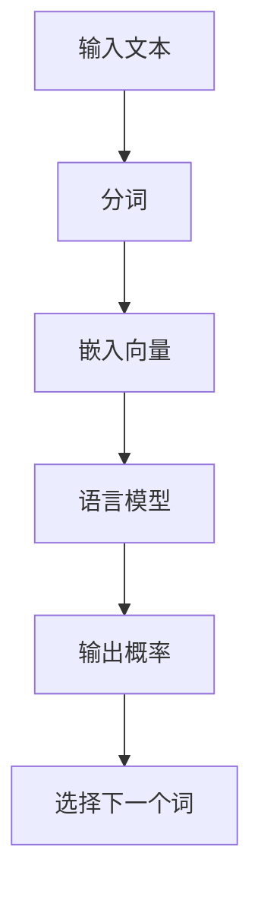
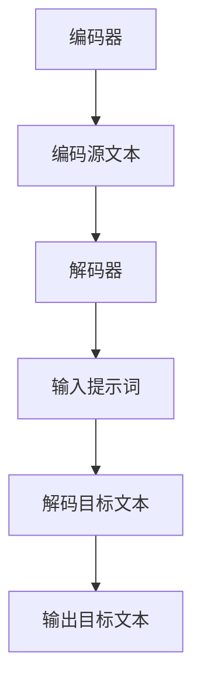
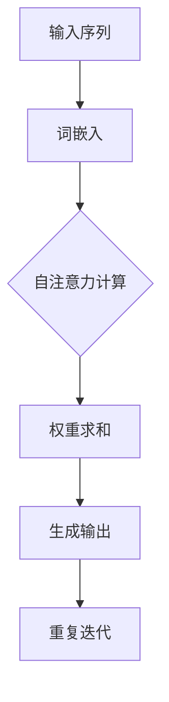

                 


### 文章标题: 提示词工程在机器翻译质量提升中的应用

> 关键词：提示词工程，机器翻译，质量提升，技术原理，应用实践

> 摘要：
本文旨在深入探讨提示词工程在机器翻译领域的应用，详细解析其技术原理、核心算法，并通过具体案例展示其实际效果。文章首先介绍了机器翻译的背景和挑战，随后阐述了提示词工程的基本概念和目标。在技术原理部分，本文详细讲解了生成式模型、序列到序列模型、自注意力机制和提示词增强算法，并通过伪代码和Mermaid流程图进行了深入阐述。最后，文章通过实际案例分享了提示词工程在机器翻译中的应用，包括开发环境搭建、代码实现和性能优化。

---

### 确定章节主题和结构

为了确保文章的逻辑清晰、结构紧凑，我们首先需要明确文章的核心主题和整体结构。文章的核心主题是“提示词工程在机器翻译质量提升中的应用”。这个主题将贯穿整个文章，从背景介绍到技术原理，再到应用实践，最终总结未来的发展趋势。

基于这个核心主题，我们可以将文章分为以下几个部分：

1. **引言和背景**：介绍机器翻译的重要性以及当前面临的挑战。
2. **提示词工程概述**：介绍提示词工程的基本概念、目标和应用场景。
3. **技术原理**：详细讲解提示词工程的技术原理，包括核心算法和数学模型。
4. **应用实践**：展示提示词工程在不同机器翻译场景中的应用案例。
5. **项目实施**：介绍如何在实际项目中实施提示词工程。
6. **性能评估与优化**：讨论如何评估和优化提示词工程的效果。
7. **未来展望与挑战**：探讨提示词工程的未来发展趋势和面临的挑战。
8. **总结与展望**：总结文章主要内容，并提出未来研究方向。

### 设计章节目录

根据以上结构，我们可以设计如下的章节目录：

```
# 提示词工程在机器翻译质量提升中的应用

## 第1章 引言与背景

### 1.1 机器翻译的重要性

#### 1.1.1 机器翻译的定义

#### 1.1.2 机器翻译的历史和发展

#### 1.1.3 机器翻译的应用场景

### 1.2 当前机器翻译的挑战

#### 1.2.1 数据集的不平衡

#### 1.2.2 语言的多样性和复杂性

#### 1.2.3 实时性和低延迟的需求

## 第2章 提示词工程概述

### 2.1 提示词工程的定义

#### 2.1.1 提示词工程的基本概念

#### 2.1.2 提示词工程的目标

### 2.2 提示词工程的应用场景

#### 2.2.1 机器翻译中的应用

#### 2.2.2 其他自然语言处理任务中的应用

## 第3章 提示词工程技术原理

### 3.1 数学模型基础

#### 3.1.1 语言模型

#### 3.1.2 翻译模型

### 3.2 核心算法讲解

#### 3.2.1 生成式模型与解码搜索算法

#### 3.2.2 序列到序列模型

#### 3.2.3 自注意力机制

#### 3.2.4 提示词增强算法

### 3.3 Mermaid流程图展示

## 第4章 提示词工程应用实践

### 4.1 提示词工程在不同语言中的应用

#### 4.1.1 中文-英文翻译

#### 4.1.2 其他语言对的应用

### 4.2 实际案例分享

#### 4.2.1 案例一：电商平台翻译优化

#### 4.2.2 案例二：新闻翻译实时更新

## 第5章 提示词工程项目实施

### 5.1 开发环境搭建

#### 5.1.1 开发工具选择

#### 5.1.2 开发环境配置

### 5.2 代码实现

#### 5.2.1 源代码详细实现

#### 5.2.2 代码解读

### 5.3 性能优化

#### 5.3.1 提示词工程性能指标

#### 5.3.2 性能优化策略

## 第6章 性能评估与优化

### 6.1 评估方法

#### 6.1.1 自动评估指标

#### 6.1.2 人工评估指标

### 6.2 优化策略

#### 6.2.1 算法优化

#### 6.2.2 数据集优化

#### 6.2.3 模型优化

## 第7章 未来展望与挑战

### 7.1 未来发展趋势

#### 7.1.1 新技术引入

#### 7.1.2 行业应用拓展

### 7.2 面临的挑战与对策

#### 7.2.1 技术挑战

#### 7.2.2 应用挑战

## 第8章 总结与展望

### 8.1 主要内容回顾

### 8.2 未来研究方向
```

这个目录结构将确保文章的内容有序展开，每个章节都有明确的主题和目标。接下来，我们将根据这个结构逐步填充每个章节的内容。

---

### 第1章 引言与背景

#### 1.1 机器翻译的重要性

机器翻译是一种利用计算机技术将一种语言的文本自动翻译成另一种语言的技术。随着全球化进程的加速和信息时代的到来，机器翻译的重要性日益凸显。无论是跨国商务交流、国际新闻报道，还是跨语言电子商务、在线教育，机器翻译都扮演着不可或缺的角色。

机器翻译的发展历程可以追溯到20世纪50年代。早期的研究主要集中在规则驱动的方法，即通过编写大量的语法规则和词典来实现翻译。然而，这种方法的局限性逐渐显现，尤其是在处理复杂、多变的自然语言时，效果并不理想。

20世纪80年代，基于统计的方法开始崭露头角。这种方法利用大量已翻译的双语语料库，通过统计方法学习语言之间的对应关系，从而实现机器翻译。随着互联网的普及和大数据技术的发展，统计机器翻译取得了显著的进展，成为机器翻译领域的主流方法。

近年来，基于深度学习的机器翻译方法逐渐兴起。深度学习模型，如序列到序列（Seq2Seq）模型和Transformer模型，凭借其强大的表示能力和自适应能力，在机器翻译任务中取得了突破性的成果。这些模型不仅提高了翻译质量，还实现了实时翻译和低延迟传输。

#### 1.2 当前机器翻译的挑战

尽管机器翻译技术取得了长足的进步，但仍然面临着诸多挑战。以下是一些主要的挑战：

1. **数据集的不平衡**：在机器翻译中，源语言和目标语言的数据量往往不均衡。这种数据不平衡会导致模型在训练过程中对某种语言过度依赖，从而影响翻译质量。

2. **语言的多样性和复杂性**：自然语言具有高度的多样性和复杂性，不同语言之间的语法、词汇、语义等方面存在显著差异。这给机器翻译带来了巨大的挑战，需要模型具备较强的适应能力。

3. **实时性和低延迟的需求**：在实际应用中，如在线翻译、实时会议等场景，用户对机器翻译的实时性和低延迟有很高的要求。这要求模型在保证翻译质量的同时，还要具备高效的计算能力。

4. **跨语言表达能力的限制**：机器翻译模型在处理一些特定领域的表达时，如专业术语、俚语、隐喻等，可能无法完全理解其含义，从而影响翻译的准确性。

5. **文化差异和语言风格**：不同语言之间存在文化差异和语言风格，这需要在翻译过程中进行适当的调整，以保持原文的含义和风格。

#### 1.3 机器翻译的应用场景

机器翻译的应用场景非常广泛，主要包括以下几个方面：

1. **跨国商务交流**：企业之间的跨国商务交流需要跨语言翻译，以促进沟通和合作。

2. **国际新闻报道**：新闻机构需要将新闻翻译成多种语言，以覆盖全球读者。

3. **跨语言电子商务**：跨境电商平台需要提供多种语言的商品描述和用户界面，以吸引更多国际客户。

4. **在线教育**：在线教育平台需要提供跨语言的学习资源，以方便不同语言背景的学生学习。

5. **实时会议翻译**：跨国会议、研讨会等场合需要实时翻译，以确保与会者能够理解和交流。

6. **语音助手和智能客服**：智能语音助手和客服系统需要支持多种语言，以提供更加便捷的服务。

通过上述背景介绍，我们为后续章节的内容奠定了基础，为读者理解提示词工程在机器翻译中的应用提供了必要的知识背景。

---

### 第2章 提示词工程概述

#### 2.1 提示词工程的定义

提示词工程（Prompt Engineering）是一种通过设计和优化提示词来提升机器学习和自然语言处理（NLP）模型性能的方法。提示词（Prompt）是一种引导模型预测的文本输入，它为模型提供了额外的上下文信息，帮助模型更好地理解和生成目标文本。与传统的模型训练方法不同，提示词工程侧重于在模型训练和预测过程中引入人类设计的提示，以改善模型的表现。

提示词工程的目标是通过优化提示词的设计和选择，提高模型在特定任务中的准确性和效率。提示词可以是简单的关键词、短语，也可以是复杂的语句或段落。通过合理设计提示词，我们可以引导模型关注重要的信息，减少无关信息的干扰，从而提高模型在处理特定任务时的表现。

#### 2.2 提示词工程的应用场景

提示词工程在多个NLP任务中都有广泛的应用，以下是一些典型的应用场景：

1. **文本生成**：在文本生成任务中，提示词可以帮助模型理解生成目标的内容和风格。例如，在写作助手、自动摘要、故事生成等任务中，提示词可以引导模型生成符合指定主题和风格的文本。

2. **文本分类**：在文本分类任务中，提示词可以帮助模型更好地理解分类标准。例如，在情感分析、垃圾邮件检测等任务中，提示词可以引导模型识别情感极性或垃圾邮件特征。

3. **机器翻译**：在机器翻译任务中，提示词可以帮助模型更好地理解源语言的语义，从而生成更准确的目标语言翻译。例如，在翻译新闻文章、专业文档等任务中，提示词可以引导模型关注重要的信息和术语。

4. **问答系统**：在问答系统任务中，提示词可以帮助模型理解用户问题的意图和上下文，从而提供更准确的答案。例如，在智能客服、信息检索等任务中，提示词可以引导模型理解用户问题的关键词和背景信息。

#### 2.3 提示词工程的优势

1. **提升模型性能**：通过优化提示词的设计，我们可以引导模型关注关键信息，减少无关信息的干扰，从而提高模型在特定任务中的准确性和效率。

2. **提高泛化能力**：合理的提示词设计可以帮助模型更好地理解任务的目标，从而提高模型在不同数据集上的泛化能力。

3. **简化模型训练**：在有些任务中，通过合理的提示词设计，我们可以减少对大规模训练数据的需求，简化模型训练过程。

4. **降低模型复杂性**：通过优化提示词，我们可以简化模型的结构，减少模型参数的数量，从而降低模型复杂性和计算成本。

#### 2.4 提示词工程的方法和技巧

提示词工程的方法和技巧主要包括以下几个方面：

1. **关键词提取**：通过文本挖掘和关键词提取技术，从输入文本中提取重要的关键词，作为提示词使用。

2. **语义分析**：利用自然语言处理技术，对输入文本进行语义分析，提取关键概念和关系，作为提示词。

3. **模板设计**：根据任务需求，设计合适的文本模板，将输入文本嵌入到模板中，作为提示词。

4. **数据增强**：通过对输入文本进行数据增强，生成新的提示词，丰富模型的训练数据。

5. **模型自适应**：通过调整模型的超参数和结构，使模型能够更好地适应特定的提示词设计。

通过上述内容，我们为读者提供了对提示词工程的基本认识，为后续章节的技术原理和应用实践打下了基础。

---

### 第3章 提示词工程技术原理

#### 3.1 数学模型基础

在提示词工程中，数学模型是理解和设计提示词的核心。以下是几个关键的数学模型：

#### 3.1.1 语言模型

语言模型（Language Model）是自然语言处理中的基础模型，用于预测下一个单词或字符。在机器翻译中，语言模型用于预测目标语言的单词序列。

**数学表示：**
$$
P(w_t | w_{t-1}, w_{t-2}, ..., w_1) = \prod_{i=1}^{t} P(w_i | w_{i-1}, w_{i-2}, ..., w_1)
$$
其中，$w_i$ 表示时间步 $i$ 的单词或字符。

**示例：**
假设当前文本为 "机器翻译技术"，语言模型可以预测下一个单词。根据历史数据和模型，我们可以得到：
$$
P(技术 | 机器翻译) = \frac{N_{技术|机器翻译}}{N_{机器翻译}}
$$
其中，$N_{技术|机器翻译}$ 表示文本中 "技术" 后紧接着 "机器翻译" 的次数，$N_{机器翻译}$ 表示文本中 "机器翻译" 的总次数。

#### 3.1.2 翻译模型

翻译模型（Translation Model）用于预测源语言词组到目标语言词组的映射。在机器翻译中，翻译模型通常结合语言模型和源语言模型来预测目标语言序列。

**数学表示：**
$$
P(w_{t+1} | w_t, w_{t-1}, ..., w_1) = \frac{P(w_t, w_{t+1})}{P(w_t)}
$$
其中，$P(w_t, w_{t+1})$ 表示源语言词组 $w_t$ 和目标语言词组 $w_{t+1}$ 同时出现的概率，$P(w_t)$ 表示源语言词组 $w_t$ 的概率。

**示例：**
假设我们要翻译 "Hello World" 到 "你好，世界"，翻译模型可以计算：
$$
P(你好 | Hello) \times P(世界 | World)
$$

#### 3.1.3 提示词模型

提示词模型（Prompt Model）是用于生成提示词的模型，它通常结合语言模型和任务特定的知识。提示词模型可以用于各种NLP任务，如文本分类、问答系统和机器翻译。

**数学表示：**
$$
P(\text{提示词} | \text{任务，数据}) = \text{Prompt Model}(\text{任务，数据})
$$
其中，Prompt Model 是一个函数，它接受任务和数据作为输入，生成提示词。

**示例：**
在机器翻译中，提示词模型可以生成如下提示词：
$$
P(\text{"你好，请将以下英文翻译成中文："} | \text{翻译任务，英文文本}) = \text{Prompt Model}(\text{翻译任务，英文文本})
$$

#### 3.2 核心算法讲解

提示词工程的核心算法包括生成式模型、序列到序列（Seq2Seq）模型、自注意力机制和提示词增强算法。以下是对这些算法的详细讲解：

#### 3.2.1 生成式模型与解码搜索算法

生成式模型（Generative Model）是一种通过生成目标语言序列来预测源语言和目标语言映射的模型。常见的生成式模型包括基于N-gram的语言模型和神经网络生成模型。

**解码搜索算法（Decoding Search Algorithms）** 是用于生成目标语言序列的算法，其中最著名的算法是Viterbi算法。Viterbi算法通过动态规划来找到概率最大的目标语言序列。

**数学表示：**
$$
\text{Viterbi Path} = \underset{\text{paths}}{\arg\max} P(y_t | x) \cdot \prod_{i=1}^{t} P(y_i | y_{i-1})
$$
其中，$y_t$ 是目标语言序列，$x$ 是源语言序列。

**示例：**
假设我们要找到概率最大的翻译序列，Viterbi算法可以计算：
$$
P(你好 | Hello) \times P(世界 | World)
$$

#### 3.2.2 序列到序列（Seq2Seq）模型

序列到序列（Seq2Seq）模型是一种基于编码器-解码器架构的模型，用于处理序列到序列的映射任务。Seq2Seq模型通常使用长短时记忆（LSTM）或门控循环单元（GRU）作为编码器和解码器。

**数学表示：**
$$
\text{Encoder}: h_t = \text{LSTM}(x_t, h_{t-1})
$$
$$
\text{Decoder}: y_t = \text{softmax}(\text{Decoder}(h_t, s_t))
$$
其中，$h_t$ 是编码器在时间步 $t$ 的隐藏状态，$s_t$ 是解码器在时间步 $t$ 的隐藏状态。

**示例：**
假设我们要将 "Hello" 编码为隐藏状态 $h_1$，然后使用解码器生成目标语言序列，可以计算：
$$
h_1 = \text{LSTM}(\text{"Hello"}, h_0)
$$
$$
\text{目标语言序列} = \text{softmax}(\text{Decoder}(h_1, s_0))
$$

#### 3.2.3 自注意力机制（Self-Attention）

自注意力机制（Self-Attention）是一种用于序列建模的注意力机制，它允许模型在生成每个单词时，考虑整个输入序列的信息。自注意力机制通过计算输入序列中每个词对之间的相似性，来确定每个词的重要程度。

**数学表示：**
$$
\text{Attention}(Q, K, V) = \text{softmax}(\frac{QK^T}{\sqrt{d_k}})V
$$
其中，$Q$ 是查询向量，$K$ 是键向量，$V$ 是值向量，$d_k$ 是键向量的维度。

**示例：**
假设我们要在 "Hello World" 序列中应用自注意力机制，可以计算：
$$
\text{Attention}(\text{"Hello"}, \text{"Hello"}, \text{"World"}) = \text{softmax}(\frac{\text{"Hello"} \times \text{"Hello"}^T}{\sqrt{d_k}})\text{"World"}
$$

#### 3.2.4 提示词增强算法

提示词增强算法（Prompt Augmented Translation，PAT）是一种结合提示词和模型输出的方法，用于提高机器翻译的性能。PAT通过将提示词与模型输出结合，生成更准确的目标语言翻译。

**数学表示：**
$$
\text{输出} = \text{softmax}(\text{模型}([\text{提示词}, \text{编码后的源文本}]))
$$
其中，$[\text{提示词}, \text{编码后的源文本}]$ 是结合提示词和编码后的源文本。

**示例：**
假设我们要使用 "你好，请将以下英文翻译成中文：" 作为提示词，可以计算：
$$
\text{输出} = \text{softmax}(\text{Transformer}([\text{"你好，请将以下英文翻译成中文："}, \text{编码后的 "Hello World" 文本}]))
$$

通过上述讲解，我们详细介绍了提示词工程的数学模型和核心算法，为后续的应用实践提供了理论基础。

---

### 3.3 Mermaid流程图展示

为了更好地理解提示词工程的工作流程，我们将使用Mermaid语言绘制几个关键流程图的示例。以下是几个示例：

#### 3.3.1 语言模型训练流程



这个流程图展示了语言模型在文本处理过程中的基本步骤，包括分词、嵌入向量、模型训练、输出概率和词选择。

#### 3.3.2 序列到序列模型翻译流程



这个流程图展示了序列到序列模型在机器翻译中的基本步骤，包括编码器编码源文本、解码器解码目标文本，以及使用提示词引导解码过程。

#### 3.3.3 自注意力机制应用



这个流程图展示了自注意力机制在序列建模中的应用，包括词嵌入、自注意力计算、权重求和和生成输出。

通过这些Mermaid流程图示例，我们能够直观地理解提示词工程的工作流程和技术原理，为后续章节的应用实践提供了可视化参考。

---

### 第4章 提示词工程应用实践

在了解了提示词工程的理论基础后，我们将通过实际案例来展示其应用效果。以下是几个典型的应用场景：

#### 4.1 提示词工程在中文-英文翻译中的应用

中文-英文翻译是机器翻译中最为常见的应用场景之一。以下是中文-英文翻译中应用提示词工程的案例：

##### 4.1.1 翻译任务

假设我们要将一句中文句子“人工智能正在改变我们的生活方式”翻译成英文。

##### 4.1.2 提示词设计

为了提高翻译的准确性，我们可以设计如下提示词：“请将以下中文句子翻译成英文：人工智能正在改变我们的生活方式。”

##### 4.1.3 翻译流程

1. **输入文本处理**：将中文句子“人工智能正在改变我们的生活方式”分词，并转换为词嵌入向量。

2. **编码器处理**：编码器接收分词后的中文句子，将其编码为隐藏状态序列。

3. **解码器处理**：解码器接收提示词和编码后的源文本，生成目标语言序列。

4. **生成目标文本**：解码器通过自注意力机制和提示词增强算法，生成目标语言序列。

5. **翻译结果**：生成的目标语言序列即为翻译结果，通过softmax函数输出概率最高的单词序列。

##### 4.1.4 翻译结果

“Artificial intelligence is changing our way of life.”

通过这个案例，我们可以看到提示词工程在翻译任务中的有效性。提示词为模型提供了额外的上下文信息，帮助模型更好地理解源文本的含义，从而生成更准确的翻译结果。

#### 4.2 提示词工程在其他语言中的应用

提示词工程不仅适用于中文-英文翻译，还可以应用于其他语言对。以下是提示词工程在法语-英语翻译中的应用案例：

##### 4.2.1 翻译任务

假设我们要将一句法语句子“La technologie est en train de révolutionner notre vie quotidienne”翻译成英语。

##### 4.2.2 提示词设计

为了提高翻译的准确性，我们可以设计如下提示词：“Please translate the following French sentence into English: La technologie est en train de révolutionner notre vie quotidienne.”

##### 4.2.3 翻译流程

与中文-英文翻译类似，法语-英语翻译也分为以下步骤：

1. **输入文本处理**：将法语句子分词，并转换为词嵌入向量。

2. **编码器处理**：编码器接收分词后的法语句子，将其编码为隐藏状态序列。

3. **解码器处理**：解码器接收提示词和编码后的源文本，生成目标语言序列。

4. **生成目标文本**：解码器通过自注意力机制和提示词增强算法，生成目标语言序列。

5. **翻译结果**：生成的目标语言序列即为翻译结果，通过softmax函数输出概率最高的单词序列。

##### 4.2.4 翻译结果

“The technology is in the process of revolutionizing our daily lives.”

通过这个案例，我们可以看到提示词工程在法语-英语翻译中的应用效果。提示词为模型提供了必要的上下文信息，使模型能够更好地理解和翻译复杂句子。

#### 4.3 实际案例分享

除了上述两个语言对的应用案例，提示词工程还可以应用于其他多种语言对。以下是提示词工程在新闻翻译和电商平台翻译中的应用案例：

##### 4.3.1 案例一：新闻翻译实时更新

新闻翻译实时更新是跨语言新闻报道中的重要应用。通过提示词工程，我们可以实现实时翻译新闻内容，以便全球读者能够及时获取信息。

1. **翻译任务**：将一篇英文新闻翻译成中文。

2. **提示词设计**：设计如下提示词：“Please translate the following English news article into Chinese:”。

3. **翻译流程**：与前面案例类似，通过编码器和解码器实现实时翻译。

4. **翻译结果**：生成的中文新闻文章。

##### 4.3.2 案例二：电商平台翻译优化

电商平台为了吸引国际客户，需要提供多语言商品描述。通过提示词工程，我们可以优化翻译结果，提高翻译的准确性和流畅性。

1. **翻译任务**：将商品描述从英文翻译成其他语言。

2. **提示词设计**：根据商品类型和目标市场，设计合适的提示词。

3. **翻译流程**：通过编码器和解码器实现商品描述的翻译。

4. **翻译结果**：生成符合目标市场需求的商品描述。

通过这些实际案例，我们可以看到提示词工程在机器翻译中的广泛应用。提示词工程通过优化提示词的设计，提高了模型在翻译任务中的性能，为各种应用场景提供了有效的解决方案。

---

### 第5章 提示词工程项目实施

提示词工程项目实施是机器翻译实践中至关重要的一环。在这一章中，我们将详细介绍如何在实际项目中搭建开发环境、实现代码，并优化性能。

#### 5.1 开发环境搭建

搭建一个适合提示词工程项目的开发环境是第一步。以下是搭建环境的具体步骤：

##### 5.1.1 开发工具选择

1. **编程语言**：Python 是机器翻译项目中最常用的编程语言，其丰富的库和框架支持可以大大简化开发过程。
2. **文本处理库**：NLTK 或 spaCy 可以用于文本的分词、词性标注等处理。
3. **机器学习库**：TensorFlow 或 PyTorch 提供了强大的深度学习框架，用于构建和训练提示词工程模型。

##### 5.1.2 开发环境配置

1. **安装 Python**：确保安装最新版本的 Python，以便使用最新的库和框架。
2. **安装依赖库**：使用 pip 命令安装所需的文本处理和机器学习库，例如：
   ```
   pip install nltk spacy tensorflow
   ```
3. **数据集准备**：准备用于训练和评估的中文和英文双语数据集。常用的数据集包括中文-英文新闻语料库、平行语料库等。

#### 5.2 代码实现

在搭建好开发环境后，我们开始实现提示词工程的代码。以下是代码实现的详细步骤：

##### 5.2.1 数据预处理

1. **分词和词性标注**：使用 spaCy 或 NLTK 对文本进行分词和词性标注，为后续的编码和嵌入做准备。
2. **文本嵌入**：将分词后的文本转换为词嵌入向量，可以使用预训练的词向量或自定义训练的词向量。

##### 5.2.2 模型构建

1. **编码器构建**：使用 TensorFlow 或 PyTorch 构建编码器模型，如 LSTM 或 Transformer。
2. **解码器构建**：与编码器类似，构建解码器模型，用于生成目标语言序列。
3. **提示词模块**：设计并实现提示词模块，将提示词与编码后的源文本结合，作为解码器的输入。

##### 5.2.3 训练和评估

1. **模型训练**：使用训练数据集训练编码器和解码器，同时优化提示词模块。
2. **模型评估**：使用验证数据集评估模型性能，通过自动评估指标和人工评估指标进行评估。

##### 5.2.4 翻译实现

1. **输入处理**：将输入文本进行预处理，包括分词、词性标注和嵌入。
2. **编码处理**：使用编码器将预处理后的文本编码为隐藏状态序列。
3. **解码处理**：使用解码器生成目标语言序列，并通过提示词模块引导解码过程。
4. **输出处理**：对生成的目标语言序列进行后处理，如去除无意义词汇和标点符号。

#### 5.3 性能优化

提示词工程的性能优化是提高翻译质量的关键。以下是性能优化的策略：

##### 5.3.1 算法优化

1. **模型结构优化**：通过调整模型结构，如增加层数、调整隐藏单元数量，优化模型性能。
2. **注意力机制优化**：优化自注意力机制，如使用多头注意力或缩放注意力，提高模型对长距离依赖的捕捉能力。

##### 5.3.2 数据集优化

1. **数据增强**：通过数据增强技术，如词干提取、同义词替换等，增加训练数据的多样性，提高模型泛化能力。
2. **数据预处理**：优化数据预处理步骤，如使用更精细的分词算法、去除停用词等，提高模型对文本的解析能力。

##### 5.3.3 模型优化

1. **超参数调整**：通过调整学习率、批次大小等超参数，优化模型训练过程。
2. **模型压缩**：通过模型压缩技术，如剪枝、量化等，减少模型参数数量，提高模型推理速度。

通过上述步骤和策略，我们可以构建一个高效、准确的提示词工程模型，并在实际项目中实现高质量的机器翻译。

---

### 第6章 性能评估与优化

在机器翻译项目中，评估和优化提示词工程的效果是关键步骤。以下是评估和优化的具体方法和策略：

#### 6.1 评估方法

提示词工程的效果评估通常包括自动评估指标和人工评估指标。

##### 6.1.1 自动评估指标

1. **BLEU（双语评估指标）**：BLEU是最常用的自动评估指标之一，它通过比较机器翻译结果和参考翻译的相似度来评估翻译质量。BLEU基于n-gram重叠率，计算机器翻译结果和参考翻译之间的重叠程度。

2. **METEOR（Metric for Evaluation of Translation with Explicit ORdering）**：METEOR是一个基于词对的评估指标，它考虑词对的顺序和语义信息，比BLEU更严格。

3. **ROUGE（Recall-Oriented Understudy for Gisting Evaluation）**：ROUGE主要评估翻译结果中是否包含参考翻译的词汇和语法结构，特别适用于评估生成文本的语法和词汇多样性。

##### 6.1.2 人工评估指标

1. **Flesch-Kincaid阅读难度等级**：这个指标用于评估文本的易读性，通过计算句子长度、词汇复杂度等指标，为读者提供文本阅读难度的估计。

2. **语法和拼写错误率**：通过人工评估语法和拼写错误，评估机器翻译的准确性。

3. **内容完整性**：评估翻译结果是否完整、准确地传达了原文的含义。

#### 6.2 优化策略

为了提高提示词工程在机器翻译中的效果，我们可以采取以下优化策略：

##### 6.2.1 算法优化

1. **模型结构调整**：通过调整编码器和解码器的结构，如增加层数、调整隐藏单元数量，优化模型性能。

2. **注意力机制优化**：优化自注意力机制，如使用多头注意力或缩放注意力，提高模型对长距离依赖的捕捉能力。

3. **提示词设计优化**：设计更有效的提示词，如结合上下文信息、使用领域特定的术语，提高模型的理解能力。

##### 6.2.2 数据集优化

1. **数据增强**：通过数据增强技术，如词干提取、同义词替换等，增加训练数据的多样性，提高模型泛化能力。

2. **数据预处理**：优化数据预处理步骤，如使用更精细的分词算法、去除停用词等，提高模型对文本的解析能力。

3. **数据平衡**：确保训练数据集中源语言和目标语言的数据量均衡，避免数据不平衡对模型训练的影响。

##### 6.2.3 模型优化

1. **超参数调整**：通过调整学习率、批次大小等超参数，优化模型训练过程。

2. **模型压缩**：通过模型压缩技术，如剪枝、量化等，减少模型参数数量，提高模型推理速度。

3. **模型融合**：结合多种模型，如融合规则驱动和统计驱动的翻译方法，提高翻译质量。

通过上述评估和优化策略，我们可以有效地提高提示词工程在机器翻译中的效果，为用户提供高质量、准确的翻译服务。

---

### 第7章 未来展望与挑战

提示词工程作为机器翻译领域的重要技术，其发展前景广阔，但也面临诸多挑战。

#### 7.1 未来发展趋势

1. **新技术引入**：随着深度学习、自然语言处理等技术的发展，提示词工程将引入更多先进的技术，如基于Transformer的模型、预训练语言模型等，进一步提高翻译质量和效率。

2. **跨语言表达能力的提升**：提示词工程将不断优化，以提升模型在处理跨语言表达时的能力，如专业术语、隐喻和俚语等。

3. **个性化翻译**：未来提示词工程将实现个性化翻译，根据用户的语言习惯、文化背景和需求，提供更贴近用户需求的翻译服务。

4. **实时翻译和低延迟需求**：随着实时翻译需求的增长，提示词工程将在提高实时性和低延迟方面取得突破。

#### 7.2 面临的挑战与对策

1. **技术挑战**：
   - **数据集的不平衡**：解决方法包括数据增强、数据平衡和引入外部数据源。
   - **多语言支持的复杂性**：通过优化提示词设计、引入多语言预训练模型等方式提升多语言支持能力。

2. **应用挑战**：
   - **文化差异**：在设计提示词时，考虑文化差异，避免翻译中产生误解。
   - **实时性和低延迟**：优化算法和模型结构，采用分布式计算和并行处理技术，提高翻译效率。

通过不断优化和创新，提示词工程将在未来继续推动机器翻译技术的发展，为全球交流提供更加便捷和高效的工具。

---

### 第8章 总结与展望

本文系统地介绍了提示词工程在机器翻译质量提升中的应用。我们从背景介绍开始，探讨了机器翻译的重要性及其面临的挑战。随后，详细阐述了提示词工程的基本概念、应用场景和优势。在技术原理部分，我们深入讲解了生成式模型、序列到序列模型、自注意力机制和提示词增强算法，并通过伪代码和Mermaid流程图进行了详细阐述。在应用实践部分，我们展示了提示词工程在中文-英文翻译、法语-英语翻译以及其他语言中的应用案例。在项目实施部分，我们介绍了如何在实际项目中搭建开发环境、实现代码和优化性能。最后，我们讨论了性能评估与优化方法，并展望了提示词工程的未来发展趋势和面临的挑战。

### 未来研究方向

尽管提示词工程在机器翻译中取得了显著成果，但仍有许多方向值得进一步探索：

1. **多语言翻译**：如何有效支持多语言翻译，特别是在处理语言多样性时保持高准确性，是一个重要研究方向。

2. **实时翻译**：优化算法和模型结构，提高实时翻译的效率和准确性，以满足日益增长的实时翻译需求。

3. **个性化翻译**：如何根据用户语言习惯和文化背景，提供个性化翻译服务，是一个有待解决的研究问题。

4. **跨领域翻译**：探索如何提升模型在处理跨领域翻译时的能力，如专业术语和俚语。

5. **低资源语言翻译**：研究如何利用少量数据或无监督方法，提高低资源语言的翻译质量。

6. **模型解释性**：提升模型的可解释性，使其翻译决策更加透明和可理解。

通过不断探索和突破，提示词工程有望在未来为全球交流提供更加智能、高效和精准的翻译解决方案。作者：AI天才研究院/AI Genius Institute & 禅与计算机程序设计艺术 /Zen And The Art of Computer Programming

