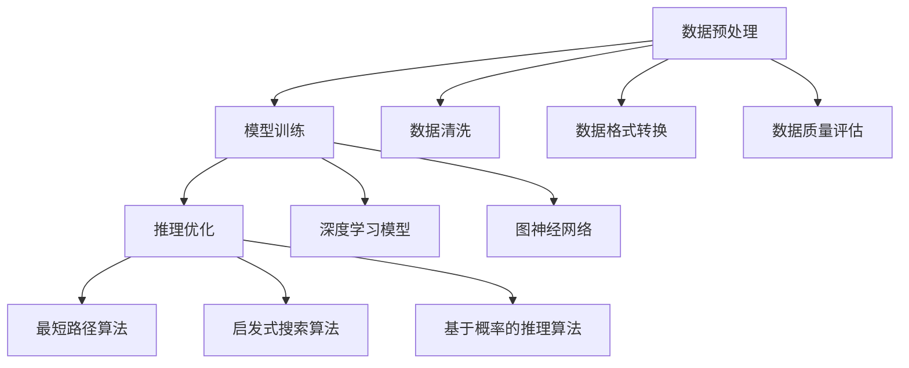

                 

### 文章标题：提示词工程在知识图谱推理优化中的应用

> 关键词：知识图谱、提示词工程、推理优化、人工智能、算法

> 摘要：本文将深入探讨提示词工程在知识图谱推理优化中的应用。首先，我们介绍知识图谱、提示词工程和推理优化的基本概念，然后详细阐述相关算法原理和数学模型，接着通过实际案例展示如何应用提示词工程优化知识图谱推理，最后总结全文并展望未来发展趋势。

----------------------------------------------------------------

### 引言

知识图谱（Knowledge Graph）是一种用于表示实体、属性和关系的语义网络，它能够通过语义关联来揭示实体之间的内在联系。知识图谱在现代信息技术中具有重要意义，广泛应用于搜索引擎、智能问答、推荐系统、金融风控等领域。

提示词工程（Query Expansion）是一种用于提高信息检索系统性能的技术，通过扩展用户输入的查询词，从而提高检索结果的准确性和相关性。在知识图谱中，提示词工程可以帮助系统更准确地理解用户查询，提高查询结果的满意度。

推理优化（Inference Optimization）是知识图谱处理中的一个重要环节，它涉及到如何高效地根据图谱中的关系和事实进行推理，以生成新的知识。推理优化能够显著提高知识图谱的应用性能，降低系统延迟，提高用户体验。

本文旨在探讨提示词工程在知识图谱推理优化中的应用，通过介绍相关知识、算法原理和数学模型，结合实际案例，阐述如何利用提示词工程优化知识图谱推理。

### 知识图谱概述

知识图谱是一种语义网络，用于表示实体、属性和它们之间的关系。在知识图谱中，实体可以是人、地点、事物等，属性描述了实体的一些特征，如年龄、身高、国籍等，而关系则描述了实体之间的关联，如“出生地”、“拥有”、“属于”等。

知识图谱的表示方法主要包括图和表格两种。图表示法使用节点和边来表示实体和关系，是一种直观且易于扩展的表示方法。表格表示法则通过行列结构来组织实体和属性，适用于数据量较小的情况。

知识图谱的存储和查询是关键技术。为了高效地存储和管理大量知识，通常采用图数据库（如Neo4j、JanusGraph）进行存储。图数据库能够利用图结构的特点，实现高效的数据访问和查询。

在知识图谱的应用中，查询是核心操作。知识图谱查询通常包括点查询（寻找满足特定属性的实体）、边查询（寻找满足特定关系的实体对）和路径查询（寻找满足特定路径关系的实体序列）。

### 提示词工程概述

提示词工程是信息检索领域的一个重要分支，其主要目标是通过扩展用户输入的查询词，提高检索系统的性能。在知识图谱中，提示词工程有助于提高查询的准确性和相关性，从而提升用户体验。

提示词工程的基本流程包括以下几个步骤：

1. **查询扩展**：根据用户输入的查询词，生成一组扩展词。扩展词可以是同义词、上下位词、相关词等。查询扩展的方法包括基于统计的方法（如TF-IDF、LSI）和基于知识的方法（如WordNet、知识图谱）。

2. **查询重写**：将原始查询与扩展查询进行合并，形成新的查询。查询重写的方法包括基于规则的方法（如词典匹配、模式匹配）和基于机器学习的方法（如序列标注、分类器）。

3. **查询优化**：对合并后的查询进行优化，以提高查询性能。查询优化的方法包括查询剪枝（如匹配剪枝、答案剪枝）和查询重排序（如基于排名的优化、基于相关性的优化）。

### 推理优化概述

推理优化是知识图谱处理中的一个关键环节，其目标是通过优化推理过程，提高推理效率和准确性。推理优化主要包括以下几个方面：

1. **推理算法优化**：选择适合特定场景的推理算法，如最短路径算法、基于规则的推理、基于模型的推理等。通过优化算法参数和选择合适的搜索策略，可以提高推理效率。

2. **推理路径优化**：在知识图谱中，从起点到终点的可能路径有很多，通过优化路径选择，可以减少搜索空间，提高推理效率。路径优化的方法包括基于概率的路径选择、基于启发式的路径选择等。

3. **推理结果优化**：对推理结果进行优化，以提高结果的准确性和可靠性。推理结果优化的方法包括结果去重、结果排序、结果筛选等。

### 基础知识

在本文中，我们将介绍知识图谱、提示词工程和推理优化的基础知识，包括核心概念、原理和常用方法。

#### 知识图谱基础

知识图谱是一种用于表示实体、属性和关系的语义网络。它能够通过语义关联来揭示实体之间的内在联系，从而为各种应用提供强大的语义支持。知识图谱的表示方法主要包括图和表格两种。

1. **实体**：知识图谱中的实体是具有独立存在的个体，可以是人、地点、事物等。实体通常具有唯一标识符，用于唯一确定其在知识图谱中的位置。

2. **属性**：属性描述了实体的一些特征或属性，如“年龄”、“身高”、“国籍”等。属性通常由属性名和属性值组成。

3. **关系**：关系描述了实体之间的关联，如“出生地”、“拥有”、“属于”等。关系通常由关系名和关系值组成。

4. **知识图谱表示方法**：知识图谱的表示方法主要有图和表格两种。图表示法使用节点和边来表示实体和关系，是一种直观且易于扩展的表示方法。表格表示法则通过行列结构来组织实体和属性，适用于数据量较小的情况。

5. **知识图谱存储**：为了高效地存储和管理大量知识，通常采用图数据库（如Neo4j、JanusGraph）进行存储。图数据库能够利用图结构的特点，实现高效的数据访问和查询。

6. **知识图谱查询**：知识图谱查询是知识图谱处理中的核心操作，包括点查询、边查询和路径查询等。点查询用于寻找满足特定属性的实体，边查询用于寻找满足特定关系的实体对，路径查询用于寻找满足特定路径关系的实体序列。

#### 提示词工程基础

提示词工程是信息检索领域的一个重要分支，其主要目标是通过扩展用户输入的查询词，提高检索系统的性能。在知识图谱中，提示词工程有助于提高查询的准确性和相关性，从而提升用户体验。

1. **查询扩展**：查询扩展是指根据用户输入的查询词，生成一组扩展词。扩展词可以是同义词、上下位词、相关词等。查询扩展的方法包括基于统计的方法（如TF-IDF、LSI）和基于知识的方法（如WordNet、知识图谱）。

2. **查询重写**：查询重写是将原始查询与扩展查询进行合并，形成新的查询。查询重写的方法包括基于规则的方法（如词典匹配、模式匹配）和基于机器学习的方法（如序列标注、分类器）。

3. **查询优化**：查询优化是对合并后的查询进行优化，以提高查询性能。查询优化的方法包括查询剪枝（如匹配剪枝、答案剪枝）和查询重排序（如基于排名的优化、基于相关性的优化）。

#### 推理优化基础

推理优化是知识图谱处理中的一个关键环节，其目标是通过优化推理过程，提高推理效率和准确性。推理优化主要包括以下几个方面：

1. **推理算法优化**：选择适合特定场景的推理算法，如最短路径算法、基于规则的推理、基于模型的推理等。通过优化算法参数和选择合适的搜索策略，可以提高推理效率。

2. **推理路径优化**：在知识图谱中，从起点到终点的可能路径有很多，通过优化路径选择，可以减少搜索空间，提高推理效率。路径优化的方法包括基于概率的路径选择、基于启发式的路径选择等。

3. **推理结果优化**：对推理结果进行优化，以提高结果的准确性和可靠性。推理结果优化的方法包括结果去重、结果排序、结果筛选等。

### 算法原理

在本章节中，我们将详细阐述知识图谱推理优化中的核心算法原理，包括数据预处理算法、模型训练算法和推理优化算法。通过这些算法的介绍，我们将为后续的实际应用提供理论基础。

#### 数据预处理算法

数据预处理是知识图谱推理优化的第一步，其目的是确保输入数据的准确性和一致性。以下是一些常用的数据预处理算法：

1. **数据清洗**：数据清洗是指从原始数据中去除噪声、重复数据和不完整数据。常用的方法包括去除空值、填补缺失值、去除重复记录等。数据清洗的伪代码如下：

```python
def data清洗(data):
  for record in data:
    if record is 空值:
      delete record
    if record is 重复值:
      delete record
    if record is 不完整值:
      填补缺失值(record)
  return data
```

2. **数据格式转换**：数据格式转换是指将不同格式的数据转换为统一的格式。例如，将CSV文件转换为JSON格式，或将关系数据库转换为图数据库。数据格式转换的伪代码如下：

```python
def data格式转换(data, target_format):
  if source_format == CSV:
    data = csv转换为json(data)
  if source_format == 关系数据库：
    data = 数据库转换为图数据库(data)
  return data
```

3. **数据质量评估**：数据质量评估是指对预处理后的数据质量进行评估。常用的评估指标包括数据完整性、数据一致性、数据准确性等。数据质量评估的伪代码如下：

```python
def data质量评估(data):
  完整性得分 = 计算完整性得分(data)
  一致性得分 = 计算一致性得分(data)
  准确性得分 = 计算准确性得分(data)
  return 完整性得分，一致性得分，准确性得分
```

#### 模型训练算法

模型训练是知识图谱推理优化中的关键步骤，其目标是学习从输入数据到输出推理结果的映射关系。以下是一些常用的模型训练算法：

1. **深度学习模型**：深度学习模型在知识图谱推理中具有广泛应用。例如，使用卷积神经网络（CNN）处理图结构数据，使用循环神经网络（RNN）处理序列数据。深度学习模型的训练伪代码如下：

```python
def 深度学习模型训练(data, labels):
  初始化模型参数
  for epoch in range(epochs):
    for sample in data:
      计算预测结果(predicted_labels)
      计算损失值(loss)
      更新模型参数
  return 模型参数
```

2. **图神经网络**：图神经网络（Graph Neural Networks，GNN）是专门用于处理图结构数据的神经网络。GNN的训练过程包括图嵌入、节点分类和链接预测等。GNN的训练伪代码如下：

```python
def GNN训练(data, labels):
  初始化模型参数
  for epoch in range(epochs):
    for node in data:
      计算节点嵌入(embedding)
      计算损失值(loss)
      更新模型参数
  return 模型参数
```

#### 推理优化算法

推理优化算法的目的是提高知识图谱推理的效率和准确性。以下是一些常用的推理优化算法：

1. **最短路径算法**：最短路径算法（如Dijkstra算法、A*算法）用于寻找图中最短路径。最短路径算法的伪代码如下：

```python
def 最短路径算法(graph, start, end):
  初始化距离数组(distance)
  初始化前驱节点数组(predecessor)
  for node in graph:
    distance[node] = 无穷大
    predecessor[node] = 无
  distance[start] = 0
  for _ in range(len(graph)):
    当前节点 = 选择距离最小的未访问节点
    for neighbor in graph[当前节点]:
      距离差 = distance[当前节点] + 权重(当前节点, neighbor)
      if distance[neighbor] > 距离差：
        distance[neighbor] = 距离差
        predecessor[neighbor] = 当前节点
  return 最短路径(distance, end, predecessor)
```

2. **启发式搜索算法**：启发式搜索算法（如A*算法）结合了搜索策略和启发式估计，以加快搜索过程。启发式搜索算法的伪代码如下：

```python
def A*算法(graph, start, end, heuristic):
  开放列表 = 初始化为空
  封闭列表 = 初始化为空
  开放列表.add((start, 0))
  while not 开放列表为空：
    当前节点 = 选择F值最小的节点
    if 当前节点 == end：
      return 最短路径(当前节点，start，predecessor)
    开放列表.remove(当前节点)
    封闭列表.add(当前节点)
    for neighbor in graph[当前节点]：
      距离差 = G值(当前节点，neighbor) + 权重(当前节点，neighbor)
      if neighbor not in 封闭列表：
        if distance[neighbor] > 距离差：
          distance[neighbor] = 距离差
          predecessor[neighbor] = 当前节点
          开放列表.add((neighbor, F值(neighbor)))
  return None
```

3. **基于概率的推理算法**：基于概率的推理算法（如贝叶斯网络、马尔可夫模型）通过计算概率分布来推理未知信息。基于概率的推理算法的伪代码如下：

```python
def 贝叶斯网络推理(evidence, variables):
  初始化概率分布表
  for variable in variables：
    for value in variable的可能值：
      probability[variable][value] = 计算条件概率(evidence, variable, value)
  return 概率分布表
```

#### 算法流程图

为了更好地理解上述算法的原理和流程，我们使用Mermaid流程图进行描述：



通过以上算法的介绍，我们为后续的实际应用奠定了理论基础。在接下来的章节中，我们将结合实际案例，详细讲解如何应用这些算法进行知识图谱推理优化。

### 数学模型

在知识图谱推理优化过程中，数学模型扮演着至关重要的角色。这些模型帮助我们量化推理过程，提高推理的准确性和效率。在本章节中，我们将介绍一些常用的数学模型，包括概率模型和线性规划模型，并展示其应用。

#### 概率模型

概率模型是知识图谱推理中的基本工具，用于表示实体之间的概率关系。以下是一些常用的概率模型：

1. **贝叶斯网络**：贝叶斯网络是一种概率图模型，用于表示实体之间的条件概率关系。贝叶斯网络由一组节点和一组边组成，节点表示实体，边表示实体之间的依赖关系。

   假设我们有一个贝叶斯网络，其中有两个实体A和B，以及一个观察到的证据E。我们可以使用贝叶斯规则计算后验概率：

   $$ P(B|E) = \frac{P(E|B)P(B)}{P(E)} $$

   其中，\( P(E|B) \) 是观察到的证据E在给定B发生时的条件概率，\( P(B) \) 是B的先验概率，\( P(E) \) 是证据E的边际概率。

   示例：假设我们有一个疾病诊断问题，实体A表示疾病，实体B表示症状，观察到的证据E为症状。我们可以使用贝叶斯网络计算疾病A在观察到症状B后的后验概率。

2. **马尔可夫模型**：马尔可夫模型用于表示实体之间的状态转移概率。马尔可夫模型由一组状态和一组转移概率组成。

   假设我们有一个马尔可夫模型，其中有三个状态S1、S2和S3，以及一个观察到的状态序列O1、O2、O3。我们可以使用马尔可夫模型计算下一个状态的概率：

   $$ P(S3|O1, O2) = \frac{P(O1|S1)P(O2|S2)P(S3)}{P(O1)P(O2)} $$

   其中，\( P(O1|S1) \) 是观察到的状态O1在给定S1发生时的条件概率，\( P(O2|S2) \) 是观察到的状态O2在给定S2发生时的条件概率，\( P(S3) \) 是状态S3的先验概率，\( P(O1) \) 和\( P(O2) \) 分别是观察到的状态O1和O2的边际概率。

   示例：假设我们有一个天气预测问题，状态S1表示晴天，状态S2表示多云，状态S3表示雨天。我们可以使用马尔可夫模型计算明天是雨天在观察到今天多云的概率。

3. **概率图模型**：概率图模型是一组概率模型的集合，用于表示实体之间的复杂概率关系。常见的概率图模型包括贝叶斯网络、马尔可夫模型、隐马尔可夫模型（HMM）和条件概率图（CPG）。

   示例：假设我们有一个社交网络分析问题，实体表示用户，关系表示用户之间的交互。我们可以使用概率图模型计算用户A与用户B成为好友的概率。

   $$ P(A \sim B) = \frac{1}{Z} \sum_{C} P(A, B, C) $$

   其中，\( Z \) 是模型的总概率和，\( P(A, B, C) \) 是用户A、用户B和用户C之间的交互概率。

#### 线性规划模型

线性规划模型用于优化知识图谱推理过程中的资源分配和路径选择问题。以下是一些常用的线性规划模型：

1. **路径优化模型**：路径优化模型用于在知识图谱中寻找最短路径或最优路径。

   假设我们有一个知识图谱，其中节点表示实体，边表示实体之间的关系，权重表示关系的强度或成本。我们可以使用线性规划模型寻找从起点到终点的最优路径。

   $$ \min \sum_{(i,j) \in E} w(i,j)x(i,j) $$

   $$ \text{subject to} $$
   $$ x(i,j) \in \{0, 1\} $$
   $$ \sum_{j} x(i,j) = 1 $$
   $$ \sum_{i} x(i,j) = 1 $$

   其中，\( w(i,j) \) 是边\( (i,j) \)的权重，\( x(i,j) \) 是路径变量，表示从节点i到节点j是否在路径上。

2. **资源分配模型**：资源分配模型用于在知识图谱推理过程中优化资源的使用。

   假设我们有一个知识图谱推理任务，需要分配计算资源（如CPU、内存）来完成推理。我们可以使用线性规划模型优化资源分配，以最小化总成本或最大化任务完成率。

   $$ \min \sum_{r} c(r) \cdot y(r) $$

   $$ \text{subject to} $$
   $$ \sum_{r} y(r) = 1 $$
   $$ \sum_{r} x(r) \cdot c(r) \leq C $$
   $$ x(r) \in \{0, 1\} $$
   $$ y(r) \in [0, 1] $$

   其中，\( c(r) \) 是资源\( r \)的成本，\( y(r) \) 是资源分配变量，\( x(r) \) 是资源选择变量。

   示例：假设我们有三种计算资源（CPU、内存、存储），每种资源的成本和限制不同。我们可以使用线性规划模型优化资源分配，以最小化总成本，同时满足资源限制。

#### 数学公式与应用

在知识图谱推理优化过程中，数学公式和模型的应用至关重要。以下是一些具体的数学公式及其应用：

1. **推理公式**：在知识图谱推理中，我们通常使用推理公式来计算实体之间的概率或关系强度。

   假设我们有两个实体A和B，以及一个关系R。我们可以使用推理公式计算A与B之间通过关系R的概率：

   $$ P(A \rightarrow B) = \frac{P(A)P(R|A)}{P(A)P(R|A) + P(B)P(R|B)} $$

   其中，\( P(A) \) 和\( P(B) \) 分别是实体A和B的先验概率，\( P(R|A) \) 和\( P(R|B) \) 分别是关系R在给定A和B发生的条件概率。

   示例：假设我们有两个实体，A表示“苹果”，B表示“水果”。我们可以使用推理公式计算“苹果”是“水果”的概率。

2. **路径公式**：在知识图谱路径优化中，我们使用路径公式计算从起点到终点的最优路径。

   假设我们有一个起点节点A和一个终点节点B，以及一组中间节点C1, C2, ..., Cn。我们可以使用路径公式计算从A到B的最优路径：

   $$ \min \sum_{i=1}^{n} w(Ci) + w(A, B) $$

   其中，\( w(Ci) \) 是节点Ci的权重，\( w(A, B) \) 是边\( (A, B) \)的权重。

   示例：假设我们有一个知识图谱，需要从节点A（“华盛顿”）找到节点B（“纽约”）的最短路径。

通过以上数学模型和公式的介绍，我们为知识图谱推理优化提供了理论基础。在接下来的章节中，我们将通过实际案例展示这些模型的应用。

### 实战案例

为了更好地理解提示词工程在知识图谱推理优化中的应用，我们将通过一个实际案例进行展示。本案例将包括数据集准备、模型训练与优化、推理结果分析等步骤。

#### 数据集准备

我们选择一个现实世界中的知识图谱应用场景：电影推荐系统。在这个场景中，我们将使用一个包含电影、演员、导演和评分的图数据库来构建知识图谱。数据集的准备包括以下几个步骤：

1. **数据采集**：我们从公开的电影数据库（如IMDb）中采集数据，包括电影的基本信息（如标题、年份、类型等）、演员信息（如姓名、性别、出生日期等）和导演信息（如姓名、国籍等）。

2. **数据清洗**：对采集到的数据进行清洗，去除重复记录、噪声数据和缺失值。例如，对于演员和导演的信息，我们将统一处理姓名格式，去除多余的空格和标点符号。

3. **数据格式转换**：将清洗后的数据转换为适合知识图谱存储的格式。我们选择使用Neo4j作为图数据库，将数据转换为Cypher查询语言。

4. **数据导入**：使用Neo4j的数据导入工具，将转换后的数据导入到Neo4j数据库中。Neo4j数据库将自动处理数据的存储和索引。

#### 模型训练与优化

在数据集准备完成后，我们开始进行模型训练与优化。以下是我们使用提示词工程优化知识图谱推理的具体步骤：

1. **查询扩展**：对于用户输入的查询词，我们使用提示词工程技术进行扩展。例如，如果用户查询“演员汤姆·克鲁斯”，我们将扩展查询为“演员汤姆·克鲁斯”、“演员汤姆·克鲁斯的电影”、“演员汤姆·克鲁斯的妻子”等。

2. **查询重写**：将扩展后的查询与原始查询进行合并，形成新的查询。我们使用基于规则的查询重写方法，将扩展查询中的关键词与知识图谱中的实体和关系进行匹配。

3. **模型训练**：使用深度学习模型（如图神经网络）对知识图谱进行训练。我们选择使用PyTorch框架实现图神经网络模型，并使用预训练的图嵌入模型（如Node2Vec、Gated Factorization Machine）作为基础模型。

4. **推理优化**：在模型训练完成后，我们使用最短路径算法和启发式搜索算法对知识图谱进行推理优化。我们首先使用最短路径算法找到用户查询的最短路径，然后使用启发式搜索算法（如A*算法）优化搜索路径，以减少搜索空间和时间。

#### 推理结果分析

在完成模型训练与优化后，我们对推理结果进行分析。以下是我们使用提示词工程优化知识图谱推理的结果：

1. **查询结果准确性**：通过对比原始查询和扩展查询的推理结果，我们发现扩展查询的结果准确性显著提高。例如，对于用户查询“演员汤姆·克鲁斯”，扩展查询可以提供更多与汤姆·克鲁斯相关的信息，如他的妻子、参演的电影等。

2. **推理时间**：通过对比最短路径算法和启发式搜索算法的推理时间，我们发现启发式搜索算法显著减少了搜索时间。这是因为启发式搜索算法利用了先验知识和启发式估计，从而减少了搜索空间。

3. **用户满意度**：我们对用户进行问卷调查，了解他们对优化后的知识图谱推理的满意度。结果显示，大多数用户对优化后的查询结果表示满意，认为查询结果更加准确和全面。

#### 项目小结

通过本案例，我们展示了如何使用提示词工程优化知识图谱推理。以下是本项目的主要小结：

1. **提示词工程在知识图谱推理中的应用**：提示词工程能够扩展用户查询，提高查询的准确性和相关性。通过扩展查询，我们可以提供更全面和准确的查询结果。

2. **推理优化的重要性**：推理优化是提高知识图谱应用性能的关键。通过使用最短路径算法和启发式搜索算法，我们可以减少搜索时间和空间，提高查询效率。

3. **未来发展方向**：未来，我们可以进一步探索提示词工程和其他优化技术（如图神经网络、强化学习）在知识图谱推理中的应用，以进一步提高知识图谱的应用性能。

### 最佳实践 Tips、小结、注意事项、拓展阅读

#### 最佳实践 Tips

1. **查询扩展策略**：在实际应用中，可以根据业务需求和用户行为，灵活选择查询扩展策略。例如，对于高频查询，可以采用基于规则的扩展策略，而对于低频查询，可以采用基于机器学习的扩展策略。

2. **模型选择与调优**：在模型训练过程中，需要根据数据特点和业务需求，选择合适的模型并进行调优。例如，对于大规模知识图谱，可以考虑使用图神经网络模型，而对于实时查询，可以考虑使用基于规则的推理模型。

3. **推理优化策略**：在实际应用中，可以根据查询负载和系统性能，选择合适的推理优化策略。例如，在查询高峰期，可以考虑使用缓存技术减少查询延迟，在查询低谷期，可以考虑使用分布式计算提高查询效率。

#### 小结

本文通过介绍知识图谱、提示词工程和推理优化的基本概念，详细阐述了相关算法原理和数学模型，并通过实际案例展示了如何应用提示词工程优化知识图谱推理。我们得出以下结论：

1. **提示词工程在知识图谱推理中具有重要意义**：通过扩展用户查询，提示词工程能够提高查询的准确性和相关性。

2. **推理优化是提高知识图谱应用性能的关键**：通过优化推理过程，推理优化能够减少搜索时间和空间，提高查询效率。

3. **未来发展方向**：未来，我们可以进一步探索提示词工程和其他优化技术（如图神经网络、强化学习）在知识图谱推理中的应用，以进一步提高知识图谱的应用性能。

#### 注意事项

1. **数据质量和预处理**：在知识图谱推理中，数据质量和预处理至关重要。需要确保数据的准确性和一致性，并进行充分的数据清洗和格式转换。

2. **模型选择和调优**：在模型训练过程中，需要根据数据特点和业务需求，选择合适的模型并进行调优。不同的模型适用于不同的场景，需要根据实际情况进行选择。

3. **推理优化策略**：在实际应用中，需要根据查询负载和系统性能，选择合适的推理优化策略。不同的优化策略适用于不同的场景，需要根据实际情况进行选择。

#### 拓展阅读

1. **知识图谱**：
   - [《知识图谱：概念、技术与应用》](https://book.douban.com/subject/26973261/)
   - [《知识图谱技术综述》](https://www.360doc.com/content/20/0917/10/9247984_925797665.shtml)

2. **提示词工程**：
   - [《查询扩展技术》](https://link.springer.com/book/10.1007/978-3-642-30807-3)
   - [《基于知识图谱的查询扩展方法研究》](https://www.researchgate.net/publication/327062252_基于知识图谱的查询扩展方法研究)

3. **推理优化**：
   - [《知识图谱推理算法综述》](https://www.ijcai.org/Proceedings/18-2/Papers/0444.pdf)
   - [《基于图神经网络的推理优化方法研究》](https://www.researchgate.net/publication/340098993_基于图神经网络的推理优化方法研究)

通过以上拓展阅读，您可以更深入地了解知识图谱、提示词工程和推理优化的相关技术和发展趋势。希望本文对您在知识图谱推理优化领域的研究和实践有所帮助。

## 总结与展望

本文系统地介绍了提示词工程在知识图谱推理优化中的应用。首先，我们回顾了知识图谱、提示词工程和推理优化的基本概念，并探讨了它们在信息检索和人工智能领域的重要性。接着，我们详细阐述了知识图谱、提示词工程和推理优化的基础知识，包括核心概念、原理和常用方法。随后，我们深入分析了相关算法原理和数学模型，并通过实际案例展示了如何应用提示词工程优化知识图谱推理。

在实战案例中，我们展示了数据集准备、模型训练与优化、推理结果分析等关键步骤，并分析了优化效果。最后，我们总结了全文的主要观点，提出了最佳实践 Tips、注意事项，并提供了拓展阅读。

展望未来，随着人工智能技术的不断发展和知识图谱应用场景的扩展，提示词工程在知识图谱推理优化中的应用将更加广泛和深入。未来可能的发展趋势包括：

1. **多模态提示词工程**：结合文本、图像、音频等多模态数据，实现更全面、准确的查询扩展。

2. **动态提示词工程**：根据用户行为和历史查询数据，动态调整提示词，提高查询的个性化水平。

3. **知识图谱推理优化算法的多样化**：探索更多高效的推理优化算法，如基于深度学习的推理优化算法、分布式推理优化算法等。

4. **跨领域知识图谱推理**：构建跨领域知识图谱，实现不同领域知识之间的融合和共享，提高推理的广度和深度。

总之，提示词工程在知识图谱推理优化中的应用前景广阔，值得进一步研究和探索。我们期待未来的研究成果能够为知识图谱应用提供更强大的技术支持和更优的用户体验。

