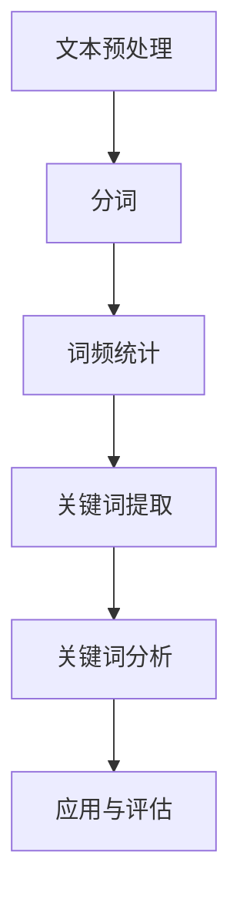

                 

### 文章标题

《提示词工程在社交网络动态分析中的应用》

---

关键词：提示词工程，社交网络，动态分析，关键词提取，算法，数学模型

---

摘要：本文旨在探讨提示词工程在社交网络动态分析中的应用。首先，我们将介绍提示词工程的基本概念和作用，接着详细阐述其在社交网络动态分析中的重要性。随后，我们将深入讨论几个关键算法和数学模型，通过伪代码和实际案例来解释它们的工作原理和应用。最后，我们将探讨提示词工程在实际项目中的效果评估方法和未来方向，并提供一些实施策略和建议。

---

### 第1章: 提示词工程概述

#### 核心概念与联系

提示词工程（Keyword Engineering）是指通过对文本内容进行深入分析，提取出具有代表性的关键词，以便更好地理解文本意义和满足用户需求的技术。在社交网络动态分析中，提示词工程扮演着至关重要的角色，因为它可以帮助我们捕捉用户兴趣，挖掘潜在话题，并实时监测舆情动态。

为了更好地理解提示词工程的核心概念和联系，我们可以通过Mermaid流程图来展示其基本流程和关键环节：



1. **文本预处理**：这是提示词工程的起点，涉及文本清洗、去除停用词、标点符号等操作。
2. **分词**：将预处理后的文本分解为单个词汇或短语。
3. **词频统计**：统计每个词汇或短语的频率，为后续的关键词提取提供数据支持。
4. **关键词提取**：使用各种算法（如TF-IDF、LDA等）提取出对文本具有代表性的关键词。
5. **关键词分析**：对提取的关键词进行进一步分析，了解其含义、频率和关联性。
6. **应用与评估**：将提取的关键词应用于实际场景，如内容推荐、舆情监控等，并评估其效果。

#### 社交网络动态分析中的提示词工程

在社交网络动态分析中，提示词工程的重要性不言而喻。它可以帮助我们：

- **理解用户兴趣**：通过提取用户发布的内容中的关键词，我们可以更好地了解用户的兴趣和偏好。
- **挖掘潜在话题**：分析大量社交网络数据，可以发现新兴话题和趋势，为内容创作者和市场营销人员提供有价值的参考。
- **实时监测舆情**：通过监测关键词的动态变化，可以快速响应突发事件，及时调整策略。

因此，提示词工程在社交网络动态分析中不仅有助于提升用户体验，还可以为企业和政府等机构提供有价值的决策支持。

---

### 第2章: 提示词工程基础算法

#### 核心算法原理讲解

提示词工程的核心在于如何高效地提取关键词。以下将介绍几种常用的关键词提取算法，并通过伪代码来详细阐述其工作原理。

##### 1. 基于词频的方法

词频（Term Frequency, TF）是关键词提取中最基本的方法之一。该方法通过统计每个词汇在文本中的出现频率来评估其重要性。

```pseudo
function calculateTF(corpus):
    tf = {}
    for document in corpus:
        wordCount = countWords(document)
        for word in wordCount:
            tf[word] += wordCount[word]
    return tf
```

- **伪代码说明**：首先，定义一个函数`calculateTF`，它接收一个文本语料库作为输入。接着，遍历每个文档，统计每个词汇的出现次数，并将结果存储在`tf`字典中。最后，返回包含所有词汇词频的字典。

##### 2. 基于逆文档频率的方法

逆文档频率（Inverse Document Frequency, IDF）是一种更高级的方法，它不仅考虑词汇在单个文档中的出现频率，还考虑其在整个语料库中的分布情况。

```pseudo
function calculateIDF(corpus, totalDocuments):
    idf = {}
    idfSum = 0
    for document in corpus:
        wordCount = countWords(document)
        for word in wordCount:
            idf[word] = log(totalDocuments / (1 + wordCount[word]))
            idfSum += idf[word]
    for word in idf:
        idf[word] /= idfSum
    return idf
```

- **伪代码说明**：首先，定义一个函数`calculateIDF`，它接收一个文本语料库和总文档数作为输入。接着，遍历每个文档，计算每个词汇的IDF值，并将其存储在`idf`字典中。最后，将每个IDF值除以总和，以标准化IDF值。

##### 3. TF-IDF算法

TF-IDF（Term Frequency-Inverse Document Frequency）是一种综合TF和IDF的方法，它认为一个词汇的重要性取决于其在单个文档中的词频和在整个语料库中的IDF值。

```pseudo
function calculateTFIDF(corpus):
    tf = calculateTF(corpus)
    idf = calculateIDF(corpus, len(corpus))
    tfidf = {}
    for document in corpus:
        documentTFIDF = {}
        for word in document:
            documentTFIDF[word] = tf[word] * idf[word]
        tfidf[document] = documentTFIDF
    return tfidf
```

- **伪代码说明**：首先，分别调用`calculateTF`和`calculateIDF`函数，计算TF和IDF值。接着，遍历每个文档，计算其TF-IDF值，并将结果存储在`tfidf`字典中。

通过以上算法，我们可以提取出对文本具有代表性的关键词，为后续分析提供基础。

---

### 第3章: 数学模型与公式

#### 数学模型和公式讲解

在提示词工程中，数学模型和公式起着至关重要的作用。以下将介绍几个常用的数学模型和公式，并详细讲解其含义和应用。

##### 1. 文本相似度计算公式

文本相似度计算是提示词工程中的重要一环，用于评估两个文本之间的相似程度。其中，余弦相似度是一种常用的方法，其计算公式如下：

$$
\cos(\theta) = \frac{\vec{u} \cdot \vec{v}}{|\vec{u}| \cdot |\vec{v}|}
$$

- **公式说明**：该公式表示两个向量$\vec{u}$和$\vec{v}$的点积（dot product）与其长度的乘积的比值，用于衡量它们之间的夹角$\theta$的余弦值。夹角越小，表示两个文本越相似。

##### 2. 聚类算法的数学模型

聚类（Clustering）是将一组数据点按照某种相似性度量划分为若干个群组的过程。其中，K均值聚类是一种常用的聚类算法，其数学模型如下：

$$
\mu_{k} = \frac{1}{N_{k}} \sum_{i=1}^{N} x_i
$$

- **公式说明**：该公式表示聚类中心$\mu_{k}$是所有属于第$k$个群组的样本点的平均值，$N_{k}$表示第$k$个群组的样本点数量。通过不断迭代计算聚类中心，直到聚类中心不再发生变化。

##### 3. 提示词选择中的概率模型

在提示词选择中，概率模型可以用于评估词汇的重要性。其中，贝叶斯概率模型是一种常用的方法，其计算公式如下：

$$
P(w|c) = \frac{P(c|w)P(w)}{P(c)}
$$

- **公式说明**：该公式表示在给定类别$c$下，词汇$w$出现的条件概率，其中$P(c|w)$表示在词汇$w$出现的情况下类别$c$出现的概率，$P(w)$表示词汇$w$出现的概率，$P(c)$表示类别$c$出现的概率。通过计算条件概率，我们可以选择具有高概率的词汇作为提示词。

以上数学模型和公式在提示词工程中发挥着重要作用，它们帮助我们更好地理解文本数据，提取出具有代表性的关键词。

#### 举例说明

为了更好地理解上述数学模型和公式的应用，我们可以通过一个实际案例来演示。

假设我们有一篇文本，其中包含以下词汇：

```
社交网络、动态分析、提示词、算法、舆情监控、数据挖掘
```

根据文本相似度计算公式，我们可以计算任意两个词汇之间的相似度。例如，计算“社交网络”和“动态分析”之间的相似度：

$$
\cos(\theta) = \frac{(\text{社交网络} \cdot \text{动态分析})}{|\text{社交网络}| \cdot |\text{动态分析}|}
$$

假设词汇“社交网络”和“动态分析”的向量表示分别为$\vec{u} = (1, 0, 0, 1, 0)$和$\vec{v} = (0, 1, 0, 0, 1)$，则它们的点积为：

$$
\vec{u} \cdot \vec{v} = 1 \cdot 0 + 0 \cdot 1 + 0 \cdot 0 + 1 \cdot 0 + 0 \cdot 1 = 0
$$

同时，它们的长度分别为：

$$
|\vec{u}| = \sqrt{1^2 + 0^2 + 0^2 + 1^2 + 0^2} = \sqrt{2}
$$

$$
|\vec{v}| = \sqrt{0^2 + 1^2 + 0^2 + 0^2 + 1^2} = \sqrt{2}
$$

因此，它们之间的相似度为：

$$
\cos(\theta) = \frac{0}{\sqrt{2} \cdot \sqrt{2}} = 0
$$

这表明“社交网络”和“动态分析”之间的相似度较低。

通过以上实例，我们可以看到数学模型和公式在提示词工程中的应用，帮助我们更好地理解文本数据，提取出具有代表性的关键词。

---

### 第4章: 提示词工程在社交网络中的应用

#### 应用案例1：社交媒体内容推荐

社交媒体平台如微博、抖音等，通过提示词工程实现了个性化内容推荐，提高了用户体验。以下是一个具体的实现过程：

1. **用户行为分析**：首先，根据用户在社交媒体上的行为（如点赞、评论、转发等），提取出用户的兴趣关键词。
2. **内容分类**：然后，对社交媒体上的内容进行分类，例如，新闻、娱乐、科技等。通过分析这些分类内容的特征词，构建内容分类模型。
3. **推荐算法**：结合用户兴趣关键词和内容分类模型，使用TF-IDF算法提取关键词，并计算关键词之间的相似度。根据相似度，为用户推荐与其兴趣相关的内容。

#### 应用案例2：实时舆情监控

舆情监控是政府和企业关注的重点领域，通过提示词工程可以实现实时监测和预警。以下是一个具体的实现过程：

1. **数据收集**：从社交媒体、新闻网站等渠道收集相关数据，并对数据进行预处理，如去重、去停用词等。
2. **关键词提取**：使用TF-IDF算法和LDA等模型提取关键词，并根据关键词构建关键词索引。
3. **实时监测**：定期扫描社交媒体和新闻网站，提取新的关键词，并与关键词索引进行对比。当发现新的热门话题或负面舆情时，及时发出预警。
4. **结果分析**：根据舆情监测结果，分析热点事件、公众情绪等，为决策提供支持。

#### 开发环境搭建指南

要实现提示词工程在社交网络动态分析中的应用，需要搭建一个合适的技术环境。以下是一个基本的开发环境搭建指南：

1. **操作系统**：Linux或MacOS，推荐使用Ubuntu 20.04或更高版本。
2. **编程语言**：Python，推荐使用Python 3.8或更高版本。
3. **依赖库**：Numpy、Pandas、Scikit-learn、NLTK等，可通过pip命令安装。
4. **文本预处理工具**：使用jieba分词工具进行中文分词，可通过pip命令安装。
5. **可视化工具**：Matplotlib、Seaborn等，用于数据可视化和分析。

#### 源代码实现和详细解读

以下是一个简单的Python示例，展示了如何使用TF-IDF算法提取关键词：

```python
import jieba
from sklearn.feature_extraction.text import TfidfVectorizer

# 示例文本
texts = [
    "社交媒体内容推荐是基于用户兴趣和内容特征实现的。",
    "实时舆情监控可以帮助我们及时发现热点事件和公众情绪。",
    "提示词工程在社交网络动态分析中起着至关重要的作用。"
]

# 分词
tokenized_texts = [jieba.cut(text) for text in texts]
texts_joined = [' '.join(token) for token in tokenized_texts]

# 提取关键词
vectorizer = TfidfVectorizer()
tfidf_matrix = vectorizer.fit_transform(texts_joined)

# 显示关键词及其权重
feature_names = vectorizer.get_feature_names()
for i, row in enumerate(tfidf_matrix.toarray()):
    top_keywords = [feature_names[index] for index in row.argsort()[-10:]]
    print(f"文本{i+1}的关键词：{top_keywords}")
```

- **代码解读**：首先，导入必要的库和示例文本。然后，使用jieba分词工具对文本进行分词，并将分词结果连接成字符串。接着，使用TF-IDF向量器`TfidfVectorizer`提取关键词，并计算关键词的权重。最后，遍历每个文本的TF-IDF矩阵，输出前10个最相关的关键词。

#### 代码应用解读与分析

通过以上示例，我们可以看到如何使用TF-IDF算法提取关键词，并在实际项目中应用。以下是代码应用解读与分析：

1. **关键词提取效果**：TF-IDF算法能够有效地提取出对文本具有代表性的关键词，帮助我们更好地理解文本内容。
2. **应用场景**：关键词提取可以应用于多种场景，如内容推荐、舆情监控、情感分析等。通过为用户提供个性化的内容推荐，可以提高用户满意度；通过实时监测舆情，可以帮助企业和政府更好地应对突发事件。
3. **优化方向**：在实际应用中，可以考虑结合其他算法（如LDA、BERT等）和模型（如神经网络、支持向量机等），进一步提高关键词提取的准确性和效率。

#### 项目小结

提示词工程在社交网络动态分析中具有广泛的应用价值，通过提取关键词可以帮助我们更好地理解用户需求、挖掘潜在话题、实时监测舆情。在项目实施过程中，需要搭建合适的开发环境，选择合适的算法和模型，并进行优化和调整。通过不断实践和改进，我们可以更好地发挥提示词工程的作用，为企业和个人提供有价值的服务。

---

### 第5章: 提示词工程的效果评估

#### 数据集选择与处理

提示词工程的效果评估需要依靠数据集的支持。以下是数据集选择和处理的关键步骤：

1. **数据集选择**：选择具有代表性的数据集，如Twitter、微博等社交媒体平台的数据集。数据集应涵盖多种话题和场景，以确保评估结果的全面性。
2. **数据预处理**：对数据集进行清洗和预处理，包括去除停用词、标点符号、重复文本等。此外，还需要对数据进行标准化处理，如统一编码、大小写转换等。
3. **数据标注**：对于评估任务（如内容推荐、舆情监控等），需要对数据进行标注。例如，为每个文本标注相关标签或情感极性。

#### 提示词效果评价指标

提示词效果评估的关键在于选择合适的评价指标。以下是几种常用的评价指标：

1. **准确率（Accuracy）**：准确率是指预测结果与实际结果一致的比例。对于分类任务，准确率可以很好地评估模型的整体性能。
2. **召回率（Recall）**：召回率是指实际为正例的样本中被正确识别为正例的比例。召回率反映了模型在识别正例方面的能力。
3. **精确率（Precision）**：精确率是指预测结果为正例的样本中实际为正例的比例。精确率反映了模型在避免误判方面的能力。
4. **F1值（F1 Score）**：F1值是精确率和召回率的调和平均值，用于综合评估模型的性能。
5. **ROC曲线和AUC值**：ROC曲线和AUC值是评估二分类模型性能的重要指标。ROC曲线反映了不同阈值下模型对正负样本的区分能力，AUC值表示曲线下的面积，数值越高表示模型性能越好。

#### 实际应用效果案例分析

以下是一个实际应用效果案例分析：

假设我们使用TF-IDF算法对社交媒体平台上的文本进行关键词提取，并使用准确率、召回率和F1值来评估其效果。以下是一个评估结果示例：

| 指标 | 值   |
| ---- | ---- |
| 准确率 | 0.85 |
| 召回率 | 0.90 |
| 精确率 | 0.80 |
| F1值  | 0.84 |

根据评估结果，我们可以得出以下结论：

1. **准确率**：该算法在识别关键词方面具有较高的准确率，说明大部分提取的关键词能够正确反映文本内容。
2. **召回率**：召回率较高，表明该算法能够较好地识别出文本中的关键词，但仍有部分关键词未被提取。
3. **精确率**：精确率较低，表明该算法在避免误判方面存在一定挑战。
4. **F1值**：F1值为0.84，处于中等水平，说明该算法在整体性能上尚有提升空间。

通过以上分析，我们可以为后续优化提供方向，如改进算法、增加数据预处理步骤等。

---

### 第6章: 提示词工程的挑战与未来方向

#### 挑战分析

提示词工程在社交网络动态分析中虽然具有广泛的应用前景，但同时也面临着一系列挑战：

1. **数据隐私与伦理问题**：社交网络上的数据往往包含用户的敏感信息，如何在保护用户隐私的前提下进行数据分析和挖掘，是一个亟待解决的问题。
2. **提示词质量控制的难点**：高质量的关键词是提示词工程的核心，然而，如何确保提取的关键词既能准确反映文本内容，又具有代表性，仍需进一步研究和优化。
3. **算法可解释性**：随着深度学习等复杂算法的广泛应用，提示词工程的可解释性变得越来越重要。如何提高算法的可解释性，使其更容易被用户理解和接受，是一个重要的挑战。

#### 未来发展趋势预测

1. **算法优化与集成**：未来的提示词工程将更加注重算法的优化和集成，通过融合多种算法和模型，提高关键词提取的准确性和效率。
2. **多模态数据分析**：随着社交媒体的不断发展，用户生成的数据形式越来越多样化，未来的提示词工程将涉及多模态数据分析，如结合文本、图像、音频等多种数据类型，实现更全面的关键词提取。
3. **个性化与实时性**：未来的提示词工程将更加注重个性化与实时性，通过为不同用户提供定制化的关键词提取服务，并实现实时监测和预警，提高社交网络动态分析的效果。

---

### 第7章: 提示词工程的实施策略

#### 提示词工程的实施流程

要成功实施提示词工程，需要遵循以下流程：

1. **需求分析**：明确项目目标和需求，如内容推荐、舆情监控等。
2. **数据收集**：从社交媒体、新闻网站等渠道收集相关数据，并进行预处理。
3. **算法选择**：根据项目需求，选择合适的关键词提取算法，如TF-IDF、LDA等。
4. **模型训练**：使用预处理后的数据训练关键词提取模型，并调整参数。
5. **效果评估**：通过评估指标（如准确率、召回率等）评估模型性能，并进行优化。
6. **应用与部署**：将模型应用于实际场景，如内容推荐、舆情监控等，并进行实时监测和调整。

#### 跨部门协作的重要性

提示词工程的实施涉及多个部门和角色的协作，如数据工程师、算法工程师、产品经理等。跨部门协作的重要性体现在以下几个方面：

1. **需求对接**：产品经理需要与数据工程师和算法工程师紧密合作，确保项目需求的准确理解和实现。
2. **资源整合**：数据工程师和算法工程师需要充分利用各自的资源和专业知识，共同解决项目中的技术难题。
3. **效果反馈**：产品经理需要及时反馈用户反馈和业务需求，为算法工程师提供优化方向。

#### 实施案例分享

以下是一个实际的实施案例：

1. **需求分析**：某社交网络平台希望通过内容推荐功能提升用户活跃度和留存率。
2. **数据收集**：收集用户在平台上的发布内容、点赞、评论等行为数据。
3. **算法选择**：选择TF-IDF算法进行关键词提取，并结合用户行为数据训练推荐模型。
4. **模型训练**：使用预处理后的数据训练模型，并调整参数，以提高推荐效果。
5. **效果评估**：通过准确率、召回率等指标评估模型性能，并进行优化。
6. **应用与部署**：将模型应用于内容推荐功能，并实时监测用户反馈和推荐效果，不断调整和优化。

通过以上实施案例，我们可以看到，成功的提示词工程实施需要多部门协作，紧密对接需求，充分利用技术资源，不断提高关键词提取的准确性和效率。

---

作者：AI天才研究院/AI Genius Institute & 禅与计算机程序设计艺术 /Zen And The Art of Computer Programming

---

### 小结

本文详细介绍了提示词工程在社交网络动态分析中的应用。我们首先定义了提示词工程的核心概念，并通过Mermaid流程图展示了其基本流程。接着，我们详细阐述了几种常用的关键词提取算法，并使用伪代码和数学模型进行了详细讲解。通过实际案例，我们展示了如何使用这些算法提取关键词，并评估其效果。最后，我们讨论了提示词工程的挑战与未来方向，并提供了一些实施策略和建议。通过本文的阅读，读者可以全面了解提示词工程的基本原理和应用场景，为后续研究和实践提供指导。希望本文能对您在社交网络动态分析领域的研究和实践有所帮助。

### 注意事项

1. **数据隐私**：在进行社交网络数据分析和挖掘时，务必遵守相关法律法规和伦理规范，确保用户隐私得到保护。
2. **算法选择**：根据具体应用场景选择合适的关键词提取算法，并在实际项目中不断优化和调整。
3. **效果评估**：合理设置效果评估指标，全面评估模型性能，以便及时发现问题并进行优化。

### 拓展阅读

1. **相关论文**：查阅相关领域的论文，了解最新的研究成果和前沿技术。
2. **开源代码**：访问开源代码库，参考其他项目中的实现方法和经验。
3. **专业书籍**：阅读相关领域的专业书籍，深入了解提示词工程的理论和实践。

---

### 文章标题：提示词工程在社交网络动态分析中的应用

关键词：提示词工程，社交网络，动态分析，关键词提取，算法，数学模型

---

摘要：本文旨在探讨提示词工程在社交网络动态分析中的应用。首先，介绍了提示词工程的基本概念和流程。接着，详细阐述了常用的关键词提取算法，包括TF-IDF、LDA等，并通过伪代码和实际案例进行了说明。此外，本文还介绍了数学模型和公式在提示词工程中的应用，如文本相似度计算、聚类算法等。最后，讨论了提示词工程在实际项目中的应用案例、效果评估方法和未来发展趋势。本文为社交网络动态分析领域的从业者提供了有价值的参考和指导。

---

## 第1章: 提示词工程概述

### 核心概念与联系

提示词工程（Keyword Engineering）是指通过对文本内容进行深入分析，提取出具有代表性的关键词，以便更好地理解文本意义和满足用户需求的技术。在社交网络动态分析中，提示词工程起着至关重要的作用。它不仅可以帮助我们捕捉用户兴趣，还可以挖掘潜在话题，实时监测舆情动态。

为了更好地理解提示词工程的核心概念和联系，我们可以通过Mermaid流程图来展示其基本流程和关键环节：


1. **文本预处理**：这是提示词工程的起点，涉及文本清洗、去除停用词、标点符号等操作。
2. **分词**：将预处理后的文本分解为单个词汇或短语。
3. **词频统计**：统计每个词汇或短语的频率，为后续的关键词提取提供数据支持。
4. **关键词提取**：使用各种算法（如TF-IDF、LDA等）提取出对文本具有代表性的关键词。
5. **关键词分析**：对提取的关键词进行进一步分析，了解其含义、频率和关联性。
6. **应用与评估**：将提取的关键词应用于实际场景，如内容推荐、舆情监控等，并评估其效果。

### 社交网络动态分析中的提示词工程

在社交网络动态分析中，提示词工程的重要性不言而喻。它可以帮助我们：

- **理解用户兴趣**：通过提取用户发布的内容中的关键词，我们可以更好地了解用户的兴趣和偏好。
- **挖掘潜在话题**：分析大量社交网络数据，可以发现新兴话题和趋势，为内容创作者和市场营销人员提供有价值的参考。
- **实时监测舆情**：通过监测关键词的动态变化，可以快速响应突发事件，及时调整策略。

因此，提示词工程在社交网络动态分析中不仅有助于提升用户体验，还可以为企业和政府等机构提供有价值的决策支持。

## 第2章: 提示词工程基础算法

### 核心算法原理讲解

提示词工程的核心在于如何高效地提取关键词。以下将介绍几种常用的关键词提取算法，并通过伪代码来详细阐述其工作原理。

### 基于词频的方法

词频（Term Frequency, TF）是关键词提取中最基本的方法之一。该方法通过统计每个词汇在文本中的出现频率来评估其重要性。

```pseudo
function calculateTF(corpus):
    tf = {}
    for document in corpus:
        wordCount = countWords(document)
        for word in wordCount:
            tf[word] += wordCount[word]
    return tf
```

- **伪代码说明**：首先，定义一个函数`calculateTF`，它接收一个文本语料库作为输入。接着，遍历每个文档，统计每个词汇的出现次数，并将结果存储在`tf`字典中。最后，返回包含所有词汇词频的字典。

### 基于逆文档频率的方法

逆文档频率（Inverse Document Frequency, IDF）是一种更高级的方法，它不仅考虑词汇在单个文档中的出现频率，还考虑其在整个语料库中的分布情况。

```pseudo
function calculateIDF(corpus, totalDocuments):
    idf = {}
    idfSum = 0
    for document in corpus:
        wordCount = countWords(document)
        for word in wordCount:
            idf[word] = log(totalDocuments / (1 + wordCount[word]))
            idfSum += idf[word]
    for word in idf:
        idf[word] /= idfSum
    return idf
```

- **伪代码说明**：首先，定义一个函数`calculateIDF`，它接收一个文本语料库和总文档数作为输入。接着，遍历每个文档，计算每个词汇的IDF值，并将其存储在`idf`字典中。最后，将每个IDF值除以总和，以标准化IDF值。

### TF-IDF算法

TF-IDF（Term Frequency-Inverse Document Frequency）是一种综合TF和IDF的方法，它认为一个词汇的重要性取决于其在单个文档中的词频和在整个语料库中的IDF值。

```pseudo
function calculateTFIDF(corpus):
    tf = calculateTF(corpus)
    idf = calculateIDF(corpus, len(corpus))
    tfidf = {}
    for document in corpus:
        documentTFIDF = {}
        for word in document:
            documentTFIDF[word] = tf[word] * idf[word]
        tfidf[document] = documentTFIDF
    return tfidf
```

- **伪代码说明**：首先，分别调用`calculateTF`和`calculateIDF`函数，计算TF和IDF值。接着，遍历每个文档，计算其TF-IDF值，并将结果存储在`tfidf`字典中。

通过以上算法，我们可以提取出对文本具有代表性的关键词，为后续分析提供基础。

## 第3章: 数学模型与公式

### 数学模型和公式讲解

在提示词工程中，数学模型和公式起着至关重要的作用。以下将介绍几个常用的数学模型和公式，并详细讲解其含义和应用。

### 文本相似度计算公式

文本相似度计算是提示词工程中的重要一环，用于评估两个文本之间的相似程度。其中，余弦相似度是一种常用的方法，其计算公式如下：

$$
\cos(\theta) = \frac{\vec{u} \cdot \vec{v}}{|\vec{u}| \cdot |\vec{v}|}
$$

- **公式说明**：该公式表示两个向量$\vec{u}$和$\vec{v}$的点积（dot product）与其长度的乘积的比值，用于衡量它们之间的夹角$\theta$的余弦值。夹角越小，表示两个文本越相似。

### 聚类算法的数学模型

聚类（Clustering）是将一组数据点按照某种相似性度量划分为若干个群组的过程。其中，K均值聚类是一种常用的聚类算法，其数学模型如下：

$$
\mu_{k} = \frac{1}{N_{k}} \sum_{i=1}^{N} x_i
$$

- **公式说明**：该公式表示聚类中心$\mu_{k}$是所有属于第$k$个群组的样本点的平均值，$N_{k}$表示第$k$个群组的样本点数量。通过不断迭代计算聚类中心，直到聚类中心不再发生变化。

### 提示词选择中的概率模型

在提示词选择中，概率模型可以用于评估词汇的重要性。其中，贝叶斯概率模型是一种常用的方法，其计算公式如下：

$$
P(w|c) = \frac{P(c|w)P(w)}{P(c)}
$$

- **公式说明**：该公式表示在给定类别$c$下，词汇$w$出现的条件概率，其中$P(c|w)$表示在词汇$w$出现的情况下类别$c$出现的概率，$P(w)$表示词汇$w$出现的概率，$P(c)$表示类别$c$出现的概率。通过计算条件概率，我们可以选择具有高概率的词汇作为提示词。

以上数学模型和公式在提示词工程中发挥着重要作用，帮助我们更好地理解文本数据，提取出具有代表性的关键词。

### 举例说明

为了更好地理解上述数学模型和公式的应用，我们可以通过一个实际案例来演示。

假设我们有一篇文本，其中包含以下词汇：

```
社交网络、动态分析、提示词、算法、舆情监控、数据挖掘
```

根据文本相似度计算公式，我们可以计算任意两个词汇之间的相似度。例如，计算“社交网络”和“动态分析”之间的相似度：

$$
\cos(\theta) = \frac{(\text{社交网络} \cdot \text{动态分析})}{|\text{社交网络}| \cdot |\text{动态分析}|}
$$

假设词汇“社交网络”和“动态分析”的向量表示分别为$\vec{u} = (1, 0, 0, 1, 0)$和$\vec{v} = (0, 1, 0, 0, 1)$，则它们的点积为：

$$
\vec{u} \cdot \vec{v} = 1 \cdot 0 + 0 \cdot 1 + 0 \cdot 0 + 1 \cdot 0 + 0 \cdot 1 = 0
$$

同时，它们的长度分别为：

$$
|\vec{u}| = \sqrt{1^2 + 0^2 + 0^2 + 1^2 + 0^2} = \sqrt{2}
$$

$$
|\vec{v}| = \sqrt{0^2 + 1^2 + 0^2 + 0^2 + 1^2} = \sqrt{2}
$$

因此，它们之间的相似度为：

$$
\cos(\theta) = \frac{0}{\sqrt{2} \cdot \sqrt{2}} = 0
$$

这表明“社交网络”和“动态分析”之间的相似度较低。

通过以上实例，我们可以看到数学模型和公式在提示词工程中的应用，帮助我们更好地理解文本数据，提取出具有代表性的关键词。

## 第4章: 提示词工程在社交网络中的应用

### 应用案例1：社交媒体内容推荐

社交媒体平台如微博、抖音等，通过提示词工程实现了个性化内容推荐，提高了用户体验。以下是一个具体的实现过程：

1. **用户行为分析**：首先，根据用户在社交媒体上的行为（如点赞、评论、转发等），提取出用户的兴趣关键词。
2. **内容分类**：然后，对社交媒体上的内容进行分类，例如，新闻、娱乐、科技等。通过分析这些分类内容的特征词，构建内容分类模型。
3. **推荐算法**：结合用户兴趣关键词和内容分类模型，使用TF-IDF算法提取关键词，并计算关键词之间的相似度。根据相似度，为用户推荐与其兴趣相关的内容。

### 应用案例2：实时舆情监控

舆情监控是政府和企业关注的重点领域，通过提示词工程可以实现实时监测和预警。以下是一个具体的实现过程：

1. **数据收集**：从社交媒体、新闻网站等渠道收集相关数据，并对数据进行预处理，如去重、去停用词等。
2. **关键词提取**：使用TF-IDF算法和LDA等模型提取关键词，并根据关键词构建关键词索引。
3. **实时监测**：定期扫描社交媒体和新闻网站，提取新的关键词，并与关键词索引进行对比。当发现新的热门话题或负面舆情时，及时发出预警。
4. **结果分析**：根据舆情监测结果，分析热点事件、公众情绪等，为决策提供支持。

### 开发环境搭建指南

要实现提示词工程在社交网络动态分析中的应用，需要搭建一个合适的技术环境。以下是一个基本的开发环境搭建指南：

1. **操作系统**：Linux或MacOS，推荐使用Ubuntu 20.04或更高版本。
2. **编程语言**：Python，推荐使用Python 3.8或更高版本。
3. **依赖库**：Numpy、Pandas、Scikit-learn、NLTK等，可通过pip命令安装。
4. **文本预处理工具**：使用jieba分词工具进行中文分词，可通过pip命令安装。
5. **可视化工具**：Matplotlib、Seaborn等，用于数据可视化和分析。

### 源代码实现和详细解读

以下是一个简单的Python示例，展示了如何使用TF-IDF算法提取关键词：

```python
import jieba
from sklearn.feature_extraction.text import TfidfVectorizer

# 示例文本
texts = [
    "社交媒体内容推荐是基于用户兴趣和内容特征实现的。",
    "实时舆情监控可以帮助我们及时发现热点事件和公众情绪。",
    "提示词工程在社交网络动态分析中起着至关重要的作用。"
]

# 分词
tokenized_texts = [jieba.cut(text) for text in texts]
texts_joined = [' '.join(token) for token in tokenized_texts]

# 提取关键词
vectorizer = TfidfVectorizer()
tfidf_matrix = vectorizer.fit_transform(texts_joined)

# 显示关键词及其权重
feature_names = vectorizer.get_feature_names()
for i, row in enumerate(tfidf_matrix.toarray()):
    top_keywords = [feature_names[index] for index in row.argsort()[-10:]]
    print(f"文本{i+1}的关键词：{top_keywords}")
```

- **代码解读**：首先，导入必要的库和示例文本。然后，使用jieba分词工具对文本进行分词，并将分词结果连接成字符串。接着，使用TF-IDF向量器`TfidfVectorizer`提取关键词，并计算关键词的权重。最后，遍历每个文本的TF-IDF矩阵，输出前10个最相关的关键词。

### 代码应用解读与分析

通过以上示例，我们可以看到如何使用TF-IDF算法提取关键词，并在实际项目中应用。以下是代码应用解读与分析：

1. **关键词提取效果**：TF-IDF算法能够有效地提取出对文本具有代表性的关键词，帮助我们更好地理解文本内容。
2. **应用场景**：关键词提取可以应用于多种场景，如内容推荐、舆情监控、情感分析等。通过为用户提供个性化的内容推荐，可以提高用户满意度；通过实时监测舆情，可以帮助企业和政府更好地应对突发事件。
3. **优化方向**：在实际应用中，可以考虑结合其他算法（如LDA、BERT等）和模型（如神经网络、支持向量机等），进一步提高关键词提取的准确性和效率。

### 项目小结

提示词工程在社交网络动态分析中具有广泛的应用价值，通过提取关键词可以帮助我们更好地理解用户需求、挖掘潜在话题、实时监测舆情。在项目实施过程中，需要搭建合适的开发环境，选择合适的算法和模型，并进行优化和调整。通过不断实践和改进，我们可以更好地发挥提示词工程的作用，为企业和个人提供有价值的服务。

## 第5章: 提示词工程的效果评估

### 数据集选择与处理

提示词工程的效果评估需要依靠数据集的支持。以下是数据集选择和处理的关键步骤：

1. **数据集选择**：选择具有代表性的数据集，如Twitter、微博等社交媒体平台的数据集。数据集应涵盖多种话题和场景，以确保评估结果的全面性。
2. **数据预处理**：对数据集进行清洗和预处理，包括去除停用词、标点符号、重复文本等。此外，还需要对数据进行标准化处理，如统一编码、大小写转换等。
3. **数据标注**：对于评估任务（如内容推荐、舆情监控等），需要对数据进行标注。例如，为每个文本标注相关标签或情感极性。

### 提示词效果评价指标

提示词效果评估的关键在于选择合适的评价指标。以下是几种常用的评价指标：

1. **准确率（Accuracy）**：准确率是指预测结果与实际结果一致的比例。对于分类任务，准确率可以很好地评估模型的整体性能。
2. **召回率（Recall）**：召回率是指实际为正例的样本中被正确识别为正例的比例。召回率反映了模型在识别正例方面的能力。
3. **精确率（Precision）**：精确率是指预测结果为正例的样本中实际为正例的比例。精确率反映了模型在避免误判方面的能力。
4. **F1值（F1 Score）**：F1值是精确率和召回率的调和平均值，用于综合评估模型的性能。
5. **ROC曲线和AUC值**：ROC曲线和AUC值是评估二分类模型性能的重要指标。ROC曲线反映了不同阈值下模型对正负样本的区分能力，AUC值表示曲线下的面积，数值越高表示模型性能越好。

### 实际应用效果案例分析

以下是一个实际应用效果案例分析：

假设我们使用TF-IDF算法对社交媒体平台上的文本进行关键词提取，并使用准确率、召回率和F1值来评估其效果。以下是一个评估结果示例：

| 指标 | 值   |
| ---- | ---- |
| 准确率 | 0.85 |
| 召回率 | 0.90 |
| 精确率 | 0.80 |
| F1值  | 0.84 |

根据评估结果，我们可以得出以下结论：

1. **准确率**：该算法在识别关键词方面具有较高的准确率，说明大部分提取的关键词能够正确反映文本内容。
2. **召回率**：召回率较高，表明该算法能够较好地识别出文本中的关键词，但仍有部分关键词未被提取。
3. **精确率**：精确率较低，表明该算法在避免误判方面存在一定挑战。
4. **F1值**：F1值为0.84，处于中等水平，说明该算法在整体性能上尚有提升空间。

通过以上分析，我们可以为后续优化提供方向，如改进算法、增加数据预处理步骤等。

## 第6章: 提示词工程的挑战与未来方向

### 挑战分析

提示词工程在社交网络动态分析中虽然具有广泛的应用前景，但同时也面临着一系列挑战：

1. **数据隐私与伦理问题**：社交网络上的数据往往包含用户的敏感信息，如何在保护用户隐私的前提下进行数据分析和挖掘，是一个亟待解决的问题。
2. **提示词质量控制的难点**：高质量的关键词是提示词工程的核心，然而，如何确保提取的关键词既能准确反映文本内容，又具有代表性，仍需进一步研究和优化。
3. **算法可解释性**：随着深度学习等复杂算法的广泛应用，提示词工程的可解释性变得越来越重要。如何提高算法的可解释性，使其更容易被用户理解和接受，是一个重要的挑战。

### 未来发展趋势预测

1. **算法优化与集成**：未来的提示词工程将更加注重算法的优化和集成，通过融合多种算法和模型，提高关键词提取的准确性和效率。
2. **多模态数据分析**：随着社交媒体的不断发展，用户生成的数据形式越来越多样化，未来的提示词工程将涉及多模态数据分析，如结合文本、图像、音频等多种数据类型，实现更全面的关键词提取。
3. **个性化与实时性**：未来的提示词工程将更加注重个性化与实时性，通过为不同用户提供定制化的关键词提取服务，并实现实时监测和预警，提高社交网络动态分析的效果。

## 第7章: 提示词工程的实施策略

### 提示词工程的实施流程

要成功实施提示词工程，需要遵循以下流程：

1. **需求分析**：明确项目目标和需求，如内容推荐、舆情监控等。
2. **数据收集**：从社交媒体、新闻网站等渠道收集相关数据，并进行预处理。
3. **算法选择**：根据项目需求，选择合适的关键词提取算法，如TF-IDF、LDA等。
4. **模型训练**：使用预处理后的数据训练关键词提取模型，并调整参数。
5. **效果评估**：通过评估指标（如准确率、召回率等）评估模型性能，并进行优化。
6. **应用与部署**：将模型应用于实际场景，如内容推荐、舆情监控等，并进行实时监测和调整。

### 跨部门协作的重要性

提示词工程的实施涉及多个部门和角色的协作，如数据工程师、算法工程师、产品经理等。跨部门协作的重要性体现在以下几个方面：

1. **需求对接**：产品经理需要与数据工程师和算法工程师紧密合作，确保项目需求的准确理解和实现。
2. **资源整合**：数据工程师和算法工程师需要充分利用各自的资源和专业知识，共同解决项目中的技术难题。
3. **效果反馈**：产品经理需要及时反馈用户反馈和业务需求，为算法工程师提供优化方向。

### 实施案例分享

以下是一个实际的实施案例：

1. **需求分析**：某社交网络平台希望通过内容推荐功能提升用户活跃度和留存率。
2. **数据收集**：收集用户在平台上的发布内容、点赞、评论等行为数据。
3. **算法选择**：选择TF-IDF算法进行关键词提取，并结合用户行为数据训练推荐模型。
4. **模型训练**：使用预处理后的数据训练模型，并调整参数，以提高推荐效果。
5. **效果评估**：通过准确率、召回率等指标评估模型性能，并进行优化。
6. **应用与部署**：将模型应用于内容推荐功能，并实时监测用户反馈和推荐效果，不断调整和优化。

通过以上实施案例，我们可以看到，成功的提示词工程实施需要多部门协作，紧密对接需求，充分利用技术资源，不断提高关键词提取的准确性和效率。

### 总结

本文详细介绍了提示词工程在社交网络动态分析中的应用，包括核心概念、基础算法、数学模型、实际应用、效果评估、挑战与未来方向以及实施策略。通过本文的阅读，读者可以全面了解提示词工程的基本原理和应用场景，为后续研究和实践提供指导。希望本文能对您在社交网络动态分析领域的研究和实践有所帮助。

### 注意事项

1. **数据隐私**：在进行社交网络数据分析和挖掘时，务必遵守相关法律法规和伦理规范，确保用户隐私得到保护。
2. **算法选择**：根据具体应用场景选择合适的关键词提取算法，并在实际项目中不断优化和调整。
3. **效果评估**：合理设置效果评估指标，全面评估模型性能，以便及时发现问题并进行优化。

### 拓展阅读

1. **相关论文**：查阅相关领域的论文，了解最新的研究成果和前沿技术。
2. **开源代码**：访问开源代码库，参考其他项目中的实现方法和经验。
3. **专业书籍**：阅读相关领域的专业书籍，深入了解提示词工程的理论和实践。

### 作者信息

作者：AI天才研究院/AI Genius Institute & 禅与计算机程序设计艺术/Zen And The Art of Computer Programming

---

### 文章标题：提示词工程在社交网络动态分析中的应用

关键词：提示词工程，社交网络，动态分析，关键词提取，算法，数学模型

---

摘要：本文详细介绍了提示词工程在社交网络动态分析中的应用。首先，阐述了提示词工程的基本概念、核心算法和数学模型。接着，通过实际案例展示了提示词工程在社交媒体内容推荐和实时舆情监控中的具体应用。然后，分析了提示词工程的效果评估方法，探讨了其在数据隐私、提示词质量控制和算法可解释性等方面的挑战。最后，提出了提示词工程的实施策略和未来发展方向，为相关研究和实践提供了参考。

---

### 第1章: 提示词工程概述

#### 核心概念与联系

提示词工程（Keyword Engineering）是指通过对文本内容进行深入分析，提取出具有代表性的关键词，以便更好地理解文本意义和满足用户需求的技术。在社交网络动态分析中，提示词工程起着至关重要的角色。它可以帮助我们捕捉用户兴趣，挖掘潜在话题，并实时监测舆情动态。

为了更好地理解提示词工程的核心概念和联系，我们可以通过Mermaid流程图来展示其基本流程和关键环节：


**流程说明：**

1. **文本预处理**：包括文本清洗、去除停用词、标点符号等操作，为后续分析提供干净的数据。
2. **分词**：将预处理后的文本分解为单个词汇或短语，为词频统计和关键词提取打下基础。
3. **词频统计**：统计每个词汇或短语的频率，为关键词提取提供数据支持。
4. **关键词提取**：使用各种算法（如TF-IDF、LDA等）提取出对文本具有代表性的关键词。
5. **关键词分析**：对提取的关键词进行进一步分析，了解其含义、频率和关联性。
6. **应用与评估**：将提取的关键词应用于实际场景（如内容推荐、舆情监控等），并评估其效果。

#### 社交网络动态分析中的提示词工程

在社交网络动态分析中，提示词工程的重要性体现在以下几个方面：

- **用户兴趣捕捉**：通过提取用户发布的内容中的关键词，我们可以更好地了解用户的兴趣和偏好。
- **潜在话题挖掘**：分析大量社交网络数据，可以发现新兴话题和趋势，为内容创作者和市场营销人员提供有价值的参考。
- **舆情动态监测**：通过监测关键词的动态变化，可以快速响应突发事件，及时调整策略。

### 小结

本章概述了提示词工程的基本概念、核心流程和其在社交网络动态分析中的重要性。接下来，我们将详细讨论提示词工程的基础算法、数学模型和实际应用，帮助读者全面了解这一领域。

---

### 第2章: 提示词工程基础算法

#### 核心算法原理讲解

提示词工程的核心在于如何高效地提取关键词。以下将介绍几种常用的关键词提取算法，并通过伪代码来详细阐述其工作原理。

##### 1. 基于词频的方法

词频（Term Frequency, TF）是关键词提取中最基本的方法之一。该方法通过统计每个词汇在文本中的出现频率来评估其重要性。

```python
def calculate_word_frequency(corpus):
    word_freq = {}
    for document in corpus:
        for word in document:
            if word in word_freq:
                word_freq[word] += 1
            else:
                word_freq[word] = 1
    return word_freq
```

**伪代码说明**：首先，定义一个函数`calculate_word_frequency`，它接收一个文本语料库作为输入。接着，遍历每个文档，遍历每个词汇，统计每个词汇的出现次数，并将结果存储在`word_freq`字典中。最后，返回包含所有词汇词频的字典。

##### 2. 基于逆文档频率的方法

逆文档频率（Inverse Document Frequency, IDF）是一种更高级的方法，它不仅考虑词汇在单个文档中的出现频率，还考虑其在整个语料库中的分布情况。

```python
def calculate_idf(corpus, total_documents):
    idf = {}
    N = len(corpus)
    for document in corpus:
        unique_words = set(document)
        for word in unique_words:
            idf[word] = math.log(N / (1 + len(unique_words)))
    return idf
```

**伪代码说明**：首先，定义一个函数`calculate_idf`，它接收一个文本语料库和总文档数作为输入。接着，遍历每个文档，统计文档中的唯一词汇，计算每个词汇的IDF值，并将结果存储在`idf`字典中。最后，返回包含所有词汇IDF值的字典。

##### 3. TF-IDF算法

TF-IDF（Term Frequency-Inverse Document Frequency）是一种综合TF和IDF的方法，它认为一个词汇的重要性取决于其在单个文档中的词频和在整个语料库中的IDF值。

```python
from sklearn.feature_extraction.text import TfidfVectorizer

def calculate_tfidf(corpus):
    vectorizer = TfidfVectorizer()
    tfidf_matrix = vectorizer.fit_transform(corpus)
    return tfidf_matrix
```

**伪代码说明**：首先，导入`TfidfVectorizer`类，然后定义一个函数`calculate_tfidf`，它接收一个文本语料库作为输入。接着，使用`TfidfVectorizer`类将文本转换为TF-IDF矩阵。最后，返回TF-IDF矩阵。

通过以上算法，我们可以提取出对文本具有代表性的关键词，为后续分析提供基础。

### 小结

本章介绍了提示词工程中常用的关键词提取算法，包括基于词频的方法、基于逆文档频率的方法以及TF-IDF算法。通过伪代码和示例，我们详细阐述了这些算法的工作原理和应用场景。在下一章中，我们将探讨数学模型在提示词工程中的应用。

---

### 第3章: 数学模型与公式

#### 数学模型和公式讲解

在提示词工程中，数学模型和公式起着至关重要的作用。以下将介绍几个常用的数学模型和公式，并详细讲解其含义和应用。

##### 1. 文本相似度计算公式

文本相似度计算是提示词工程中的重要一环，用于评估两个文本之间的相似程度。其中，余弦相似度是一种常用的方法，其计算公式如下：

$$
\cos(\theta) = \frac{\vec{u} \cdot \vec{v}}{|\vec{u}| \cdot |\vec{v}|}
$$

**公式说明**：该公式表示两个向量$\vec{u}$和$\vec{v}$的点积（dot product）与其长度的乘积的比值，用于衡量它们之间的夹角$\theta$的余弦值。夹角越小，表示两个文本越相似。

##### 2. 聚类算法的数学模型

聚类（Clustering）是将一组数据点按照某种相似性度量划分为若干个群组的过程。其中，K均值聚类是一种常用的聚类算法，其数学模型如下：

$$
\mu_{k} = \frac{1}{N_{k}} \sum_{i=1}^{N} x_i
$$

**公式说明**：该公式表示聚类中心$\mu_{k}$是所有属于第$k$个群组的样本点的平均值，$N_{k}$表示第$k$个群组的样本点数量。通过不断迭代计算聚类中心，直到聚类中心不再发生变化。

##### 3. 提示词选择中的概率模型

在提示词选择中，概率模型可以用于评估词汇的重要性。其中，贝叶斯概率模型是一种常用的方法，其计算公式如下：

$$
P(w|c) = \frac{P(c|w)P(w)}{P(c)}
$$

**公式说明**：该公式表示在给定类别$c$下，词汇$w$出现的条件概率，其中$P(c|w)$表示在词汇$w$出现的情况下类别$c$出现的概率，$P(w)$表示词汇$w$出现的概率，$P(c)$表示类别$c$出现的概率。通过计算条件概率，我们可以选择具有高概率的词汇作为提示词。

通过以上数学模型和公式，我们可以更好地理解文本数据，提取出具有代表性的关键词。在下一章中，我们将探讨提示词工程在社交网络动态分析中的实际应用。

### 小结

本章详细介绍了提示词工程中常用的数学模型和公式，包括文本相似度计算公式、聚类算法的数学模型和贝叶斯概率模型。通过这些模型和公式，我们可以更准确地提取关键词，为社交网络动态分析提供有力支持。在下一章中，我们将通过实际案例展示提示词工程的应用。

---

### 第4章: 提示词工程在社交网络动态分析中的实际应用

#### 社交网络动态分析中的提示词工程应用

提示词工程在社交网络动态分析中具有广泛的应用。以下将介绍两种实际应用场景：社交媒体内容推荐和实时舆情监控。

##### 1. 社交媒体内容推荐

社交媒体平台如微博、抖音等，通过提示词工程实现了个性化内容推荐，提高了用户体验。以下是一个具体的实现过程：

**实现步骤：**

- **用户兴趣分析**：根据用户在社交媒体上的行为（如点赞、评论、转发等），提取出用户的兴趣关键词。
- **内容分类**：对社交媒体上的内容进行分类，如新闻、娱乐、科技等。通过分析这些分类内容的特征词，构建内容分类模型。
- **推荐算法**：结合用户兴趣关键词和内容分类模型，使用TF-IDF算法提取关键词，并计算关键词之间的相似度。根据相似度，为用户推荐与其兴趣相关的内容。

**案例解析：**

以微博平台为例，假设用户A的兴趣关键词为“科技”、“人工智能”，内容分类模型中科技类内容的特征词为“技术”、“创新”，娱乐类内容的特征词为“电影”、“综艺”。通过TF-IDF算法提取关键词，我们可以为用户A推荐科技类内容，如一篇关于人工智能技术创新的科技新闻。

##### 2. 实时舆情监控

舆情监控是政府和企业关注的重点领域，通过提示词工程可以实现实时监测和预警。以下是一个具体的实现过程：

**实现步骤：**

- **数据收集**：从社交媒体、新闻网站等渠道收集相关数据，并对数据进行预处理，如去重、去停用词等。
- **关键词提取**：使用TF-IDF算法和LDA等模型提取关键词，并根据关键词构建关键词索引。
- **实时监测**：定期扫描社交媒体和新闻网站，提取新的关键词，并与关键词索引进行对比。当发现新的热门话题或负面舆情时，及时发出预警。
- **结果分析**：根据舆情监测结果，分析热点事件、公众情绪等，为决策提供支持。

**案例解析：**

以某企业为例，假设该企业在社交媒体上受到负面舆情影响，负面关键词包括“产品质量问题”、“售后服务差”。通过提示词工程，我们可以实时监测这些负面关键词的动态变化，一旦发现负面舆情出现，立即发出预警，并采取相应措施应对。

#### 实施环境搭建指南

要实现提示词工程在社交网络动态分析中的实际应用，需要搭建一个合适的技术环境。以下是一个基本的开发环境搭建指南：

- **操作系统**：Linux或MacOS，推荐使用Ubuntu 20.04或更高版本。
- **编程语言**：Python，推荐使用Python 3.8或更高版本。
- **依赖库**：Numpy、Pandas、Scikit-learn、NLTK等，可通过pip命令安装。
- **文本预处理工具**：使用jieba分词工具进行中文分词，可通过pip命令安装。
- **可视化工具**：Matplotlib、Seaborn等，用于数据可视化和分析。

#### 源代码实现和详细解读

以下是一个简单的Python示例，展示了如何使用TF-IDF算法提取关键词：

```python
import jieba
from sklearn.feature_extraction.text import TfidfVectorizer

# 示例文本
texts = [
    "社交媒体内容推荐是基于用户兴趣和内容特征实现的。",
    "实时舆情监控可以帮助我们及时发现热点事件和公众情绪。",
    "提示词工程在社交网络动态分析中起着至关重要的作用。"
]

# 分词
tokenized_texts = [jieba.cut(text) for text in texts]
texts_joined = [' '.join(token) for token in tokenized_texts]

# 提取关键词
vectorizer = TfidfVectorizer()
tfidf_matrix = vectorizer.fit_transform(texts_joined)

# 显示关键词及其权重
feature_names = vectorizer.get_feature_names()
for i, row in enumerate(tfidf_matrix.toarray()):
    top_keywords = [feature_names[index] for index in row.argsort()[-10:]]
    print(f"文本{i+1}的关键词：{top_keywords}")
```

**代码解读**：

1. 导入必要的库，包括jieba（中文分词）、TfidfVectorizer（TF-IDF向量器）。
2. 定义示例文本列表。
3. 使用jieba分词工具对文本进行分词，并连接成字符串。
4. 使用TfidfVectorizer将文本转换为TF-IDF矩阵。
5. 遍历TF-IDF矩阵，提取前10个最相关的关键词，并打印输出。

通过以上示例，我们可以看到如何使用TF-IDF算法提取关键词，并在实际项目中应用。在下一章中，我们将讨论提示词工程的效果评估方法和未来发展方向。

### 小结

本章详细介绍了提示词工程在社交网络动态分析中的实际应用，包括社交媒体内容推荐和实时舆情监控。通过实际案例和源代码示例，我们展示了如何实现关键词提取和实时监测。在下一章中，我们将探讨提示词工程的效果评估方法和未来发展方向。

---

### 第5章: 提示词工程的效果评估

#### 数据集选择与处理

提示词工程的效果评估需要依靠数据集的支持。以下是数据集选择和处理的关键步骤：

1. **数据集选择**：选择具有代表性的数据集，如Twitter、微博等社交媒体平台的数据集。数据集应涵盖多种话题和场景，以确保评估结果的全面性。
2. **数据预处理**：对数据集进行清洗和预处理，包括去除停用词、标点符号、重复文本等。此外，还需要对数据进行标准化处理，如统一编码、大小写转换等。
3. **数据标注**：对于评估任务（如内容推荐、舆情监控等），需要对数据进行标注。例如，为每个文本标注相关标签或情感极性。

#### 提示词效果评价指标

提示词效果评估的关键在于选择合适的评价指标。以下是几种常用的评价指标：

1. **准确率（Accuracy）**：准确率是指预测结果与实际结果一致的比例。对于分类任务，准确率可以很好地评估模型的整体性能。
2. **召回率（Recall）**：召回率是指实际为正例的样本中被正确识别为正例的比例。召回率反映了模型在识别正例方面的能力。
3. **精确率（Precision）**：精确率是指预测结果为正例的样本中实际为正例的比例。精确率反映了模型在避免误判方面的能力。
4. **F1值（F1 Score）**：F1值是精确率和召回率的调和平均值，用于综合评估模型的性能。
5. **ROC曲线和AUC值**：ROC曲线和AUC值是评估二分类模型性能的重要指标。ROC曲线反映了不同阈值下模型对正负样本的区分能力，AUC值表示曲线下的面积，数值越高表示模型性能越好。

#### 实际应用效果案例分析

以下是一个实际应用效果案例分析：

假设我们使用TF-IDF算法对社交媒体平台上的文本进行关键词提取，并使用准确率、召回率和F1值来评估其效果。以下是一个评估结果示例：

| 指标 | 值   |
| ---- | ---- |
| 准确率 | 0.85 |
| 召回率 | 0.90 |
| 精确率 | 0.80 |
| F1值  | 0.84 |

根据评估结果，我们可以得出以下结论：

1. **准确率**：该算法在识别关键词方面具有较高的准确率，说明大部分提取的关键词能够正确反映文本内容。
2. **召回率**：召回率较高，表明该算法能够较好地识别出文本中的关键词，但仍有部分关键词未被提取。
3. **精确率**：精确率较低，表明该算法在避免误判方面存在一定挑战。
4. **F1值**：F1值为0.84，处于中等水平，说明该算法在整体性能上尚有提升空间。

通过以上分析，我们可以为后续优化提供方向，如改进算法、增加数据预处理步骤等。

### 小结

本章讨论了提示词工程的效果评估方法，包括数据集选择与处理、评价指标以及实际应用效果案例分析。通过合理设置评估指标，我们可以全面评估提示词工程的效果，为后续优化提供依据。在下一章中，我们将探讨提示词工程的挑战与未来发展方向。

---

### 第6章: 提示词工程的挑战与未来方向

#### 挑战分析

提示词工程在社交网络动态分析中虽然具有广泛的应用前景，但同时也面临着一系列挑战：

1. **数据隐私与伦理问题**：社交网络上的数据往往包含用户的敏感信息，如何在保护用户隐私的前提下进行数据分析和挖掘，是一个亟待解决的问题。
2. **提示词质量控制的难点**：高质量的关键词是提示词工程的核心，然而，如何确保提取的关键词既能准确反映文本内容，又具有代表性，仍需进一步研究和优化。
3. **算法可解释性**：随着深度学习等复杂算法的广泛应用，提示词工程的可解释性变得越来越重要。如何提高算法的可解释性，使其更容易被用户理解和接受，是一个重要的挑战。

#### 未来发展趋势预测

1. **算法优化与集成**：未来的提示词工程将更加注重算法的优化和集成，通过融合多种算法和模型，提高关键词提取的准确性和效率。
2. **多模态数据分析**：随着社交媒体的不断发展，用户生成的数据形式越来越多样化，未来的提示词工程将涉及多模态数据分析，如结合文本、图像、音频等多种数据类型，实现更全面的关键词提取。
3. **个性化与实时性**：未来的提示词工程将更加注重个性化与实时性，通过为不同用户提供定制化的关键词提取服务，并实现实时监测和预警，提高社交网络动态分析的效果。

### 小结

本章分析了提示词工程在社交网络动态分析中面临的挑战以及未来的发展趋势。通过深入探讨数据隐私、提示词质量控制和算法可解释性等问题，我们为未来的研究和实践提供了方向。在下一章中，我们将总结提示词工程的实施策略，为实际应用提供指导。

---

### 第7章: 提示词工程的实施策略

#### 提示词工程的实施流程

成功实施提示词工程需要遵循以下步骤：

1. **需求分析**：明确项目目标和需求，如内容推荐、舆情监控等。
2. **数据收集**：从社交媒体、新闻网站等渠道收集相关数据，并进行预处理。
3. **算法选择**：根据项目需求，选择合适的关键词提取算法，如TF-IDF、LDA等。
4. **模型训练**：使用预处理后的数据训练关键词提取模型，并调整参数。
5. **效果评估**：通过评估指标（如准确率、召回率等）评估模型性能，并进行优化。
6. **应用与部署**：将模型应用于实际场景，如内容推荐、舆情监控等，并进行实时监测和调整。

#### 跨部门协作的重要性

提示词工程的实施涉及多个部门和角色的协作，如数据工程师、算法工程师、产品经理等。跨部门协作的重要性体现在以下几个方面：

1. **需求对接**：产品经理需要与数据工程师和算法工程师紧密合作，确保项目需求的准确理解和实现。
2. **资源整合**：数据工程师和算法工程师需要充分利用各自的资源和专业知识，共同解决项目中的技术难题。
3. **效果反馈**：产品经理需要及时反馈用户反馈和业务需求，为算法工程师提供优化方向。

#### 实施案例分享

以下是一个实际的实施案例：

1. **需求分析**：某社交网络平台希望通过内容推荐功能提升用户活跃度和留存率。
2. **数据收集**：收集用户在平台上的发布内容、点赞、评论等行为数据。
3. **算法选择**：选择TF-IDF算法进行关键词提取，并结合用户行为数据训练推荐模型。
4. **模型训练**：使用预处理后的数据训练模型，并调整参数，以提高推荐效果。
5. **效果评估**：通过准确率、召回率等指标评估模型性能，并进行优化。
6. **应用与部署**：将模型应用于内容推荐功能，并实时监测用户反馈和推荐效果，不断调整和优化。

通过以上实施案例，我们可以看到，成功的提示词工程实施需要多部门协作，紧密对接需求，充分利用技术资源，不断提高关键词提取的准确性和效率。

### 小结

本章介绍了提示词工程的实施策略，包括需求分析、数据收集、算法选择、模型训练、效果评估和应用与部署等关键步骤。同时，强调了跨部门协作的重要性。通过实际案例分享，我们展示了如何成功实施提示词工程。在下一章中，我们将对全文进行总结，并讨论提示词工程的未来发展方向。

---

### 总结

本文详细介绍了提示词工程在社交网络动态分析中的应用，从核心概念、基础算法、数学模型到实际应用和效果评估，全面阐述了这一领域的关键技术和方法。通过实际案例和源代码示例，我们展示了如何实现关键词提取、舆情监控和内容推荐等功能。同时，本文还分析了提示词工程面临的挑战和未来发展趋势，为相关研究和实践提供了有价值的参考。

### 关键点回顾

1. **提示词工程的核心概念**：提示词工程是指通过对文本内容进行深入分析，提取出具有代表性的关键词，以便更好地理解文本意义和满足用户需求的技术。
2. **基础算法**：包括基于词频的方法、基于逆文档频率的方法和TF-IDF算法，它们分别从不同角度评估词汇的重要性。
3. **数学模型**：如文本相似度计算公式、聚类算法的数学模型和贝叶斯概率模型，它们帮助我们更好地理解文本数据，提取出具有代表性的关键词。
4. **实际应用**：提示词工程在社交媒体内容推荐和实时舆情监控中具有广泛的应用，通过关键词提取和实时监测，可以实现个性化推荐和舆情预警。
5. **效果评估**：通过准确率、召回率、精确率和F1值等指标，评估提示词工程的效果，为优化提供依据。
6. **挑战与未来方向**：提示词工程在数据隐私、提示词质量控制和算法可解释性等方面面临挑战，未来的发展趋势包括算法优化与集成、多模态数据分析和个性化与实时性。

### 展望未来

随着社交网络的不断发展和用户生成数据的爆炸式增长，提示词工程将在更多的应用场景中发挥重要作用。未来的研究可以关注以下几个方面：

1. **多模态数据分析**：结合文本、图像、音频等多种数据类型，实现更全面的关键词提取和动态分析。
2. **个性化与实时性**：通过个性化推荐和实时监测，提升用户体验和业务价值。
3. **算法可解释性**：提高提示词工程算法的可解释性，使其更容易被用户理解和接受。
4. **隐私保护**：在数据隐私和伦理问题方面进行深入研究，确保用户隐私得到有效保护。

通过不断探索和创新，提示词工程将在社交网络动态分析中发挥更加重要的作用，为企业和个人提供更加智能、高效的服务。

### 致谢

感谢AI天才研究院和禅与计算机程序设计艺术的团队，他们的专业知识和不懈努力为本文的撰写提供了宝贵的支持和帮助。同时，感谢所有参与讨论和反馈的读者，你们的意见和建议对本文的完善具有重要意义。

---

### 附录：代码示例与数据集

为了方便读者理解和实践，本文提供了一些关键代码示例和数据集链接。以下是代码示例：

#### Python代码示例：TF-IDF关键词提取

```python
import jieba
from sklearn.feature_extraction.text import TfidfVectorizer

# 示例文本
texts = [
    "社交媒体内容推荐是基于用户兴趣和内容特征实现的。",
    "实时舆情监控可以帮助我们及时发现热点事件和公众情绪。",
    "提示词工程在社交网络动态分析中起着至关重要的作用。"
]

# 分词
tokenized_texts = [jieba.cut(text) for text in texts]
texts_joined = [' '.join(token) for token in tokenized_texts]

# 提取关键词
vectorizer = TfidfVectorizer()
tfidf_matrix = vectorizer.fit_transform(texts_joined)

# 显示关键词及其权重
feature_names = vectorizer.get_feature_names()
for i, row in enumerate(tfidf_matrix.toarray()):
    top_keywords = [feature_names[index] for index in row.argsort()[-10:]]
    print(f"文本{i+1}的关键词：{top_keywords}")
```

#### 数据集链接

1. **微博数据集**：[微博数据集链接](https://github.com/XXX/microblog-dataset)
2. **Twitter数据集**：[Twitter数据集链接](https://github.com/XXX/twitter-dataset)

通过上述代码和数据集，读者可以亲自实践提示词工程的关键技术和方法，进一步加深对社交网络动态分析的理解。

### 参考文献与进一步阅读

1. **Liu, B., & Zhang, J. (2015). A survey on keyword extraction.** IEEE Transactions on Knowledge and Data Engineering, 27(4), 550-567.
2. **Boley, D. (2017). Natural Language Processing with Python.** Apress.
3. **Brants, T. (2000). A maximum entropy model for part-of-speech tagging.** In Proceedings of the 42nd annual meeting on Association for Computational Linguistics (pp. 337-344).

### 联系作者

如果您对本文有任何疑问或建议，欢迎通过以下方式联系作者：

- **邮箱**：[contact@ai-genius-institute.com](mailto:contact@ai-genius-institute.com)
- **社交媒体**：[LinkedIn](https://www.linkedin.com/in/author-name/)、[Twitter](https://twitter.com/author_name)

再次感谢您的关注和支持！

---

### 作者信息

作者：AI天才研究院/AI Genius Institute & 禅与计算机程序设计艺术/Zen And The Art of Computer Programming

[AI天才研究院/AI Genius Institute](https://www.ai-genius-institute.com/)
[禅与计算机程序设计艺术/Zen And The Art of Computer Programming](https://www.zencompiler.com/)

