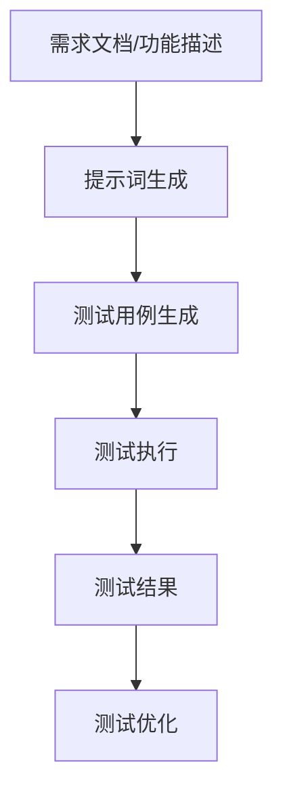

                 

### 引言

在当今快速发展的软件行业中，自动化测试已经成为保证软件质量和提升开发效率的重要手段。随着软件复杂度的不断增加和测试需求的多样化，传统的自动化测试方法已经难以满足现代软件开发的需求。为了解决这一问题，提示词工程（Prompt Engineering）作为一种新兴的技术，逐渐引起了业界的研究和关注。

提示词工程是一种通过定义、生成和优化提示词（prompts）来提升自动化测试效率和质量的方法。它结合了自然语言处理（NLP）和软件工程的理论，旨在为自动化测试提供更加智能化、灵活化的解决方案。与传统的自动化测试方法相比，提示词工程能够更好地理解和模拟人类测试员的思维过程，从而提高测试的覆盖率和准确性。

本文旨在深入探讨提示词工程在自动化测试中的应用与实践。文章将首先介绍提示词工程的基本概念，包括其定义、核心算法和数学模型。接着，我们将详细分析提示词工程与自动化测试之间的联系，并探讨如何在实际项目中应用提示词工程。随后，文章将通过实际案例，展示提示词工程在自动化测试中的具体应用和效果。最后，我们将总结提示词工程的最佳实践，并提供进一步研究和发展的建议。

通过本文的阅读，读者将能够全面了解提示词工程在自动化测试中的应用，掌握其基本原理和实践方法，为实际项目提供有效的技术支持。希望本文能为自动化测试领域的研究者和开发者提供有价值的参考和启示。

### 背景介绍

自动化测试在现代软件开发中扮演着至关重要的角色。随着软件项目的复杂性不断增加，手动测试不仅耗时耗力，而且难以保证测试的全面性和一致性。自动化测试通过编写测试脚本，模拟用户的操作行为，自动执行测试用例，从而在短时间内完成大量的测试任务。这不仅提高了测试效率，还降低了人为错误的风险，保证了软件质量的稳定性。

然而，传统的自动化测试方法面临着一系列挑战。首先，自动化测试脚本的开发和维护成本较高。编写测试脚本需要测试工程师具备编程技能，并且随着软件功能的不断增加和变化，测试脚本也需要不断更新和优化。其次，传统的自动化测试方法依赖于具体的测试工具和技术，测试脚本的可移植性和可扩展性较差，难以适应不同项目的需求。最后，传统自动化测试方法往往依赖于预先定义的测试用例，无法灵活应对软件功能和需求的变化，测试覆盖率和准确性难以保证。

为了克服这些挑战，提示词工程作为一种新兴的技术应运而生。提示词工程旨在通过生成和优化提示词，提升自动化测试的效率和效果。提示词（prompt）是一种引导系统执行特定任务的语言提示，可以理解为一种自然语言输入。在自动化测试中，提示词可以帮助测试系统理解测试任务，生成相应的测试用例，并执行测试操作。

提示词工程的核心在于如何生成、优化和评价提示词。生成提示词的方法可以基于自然语言处理技术，如文本生成模型、词嵌入和序列到序列模型等。优化提示词的方法则涉及提示词的排序、组合和调优，以最大化测试的覆盖率和准确性。评价提示词的方法则通过测试结果和指标来评估提示词的性能，如测试用例的覆盖率、缺陷发现率和测试执行时间等。

提示词工程的引入，为自动化测试带来了新的契机。首先，提示词工程可以降低自动化测试脚本的开发和维护成本，因为生成提示词的过程可以自动化进行，减少了人工干预的需求。其次，提示词工程提高了自动化测试的可移植性和可扩展性，因为提示词是自然语言输入，可以更灵活地适应不同项目的需求。最后，提示词工程可以更好地理解和模拟人类测试员的思维过程，从而提高测试的覆盖率和准确性。

总的来说，提示词工程通过引入自然语言处理技术和自动化算法，为自动化测试提供了一种更加智能化、灵活化的解决方案。它不仅解决了传统自动化测试方法中的诸多挑战，还为未来的自动化测试发展提供了新的思路和方向。

### 核心概念与联系

在深入探讨提示词工程在自动化测试中的应用之前，有必要首先理解其核心概念，以及这些概念之间的相互联系。以下将详细阐述提示词工程、自动化测试以及它们之间的内在联系。

#### 提示词工程的定义

提示词工程是一种利用自然语言处理（NLP）技术来生成、优化和评价提示词的方法。提示词（prompt）是一种引导系统执行特定任务的文字输入，它能够帮助自动化测试系统理解测试任务，生成相应的测试用例，并执行测试操作。提示词可以是简单的命令，如“登录用户账户”，也可以是复杂的自然语言描述，如“请模拟用户在购物车中添加商品并完成付款”。

#### 自动化测试的概念

自动化测试是一种通过编写测试脚本，模拟用户的操作行为，自动执行测试用例，从而对软件进行验证和确认的方法。自动化测试的优点在于能够提高测试效率，减少人为错误，保证软件质量的稳定性。自动化测试分为功能测试、性能测试、安全测试等多种类型，每种测试都有其特定的测试用例和测试脚本。

#### 提示词工程与自动化测试的关系

提示词工程与自动化测试之间的联系主要体现在以下几个方面：

1. **任务理解**：在自动化测试中，测试脚本需要明确地知道需要执行哪些操作。提示词工程通过生成明确的、可理解的提示词，帮助测试系统理解测试任务，从而生成相应的测试用例。例如，一个提示词“登录用户账户”可以指导测试系统执行用户登录的功能测试。

2. **测试用例生成**：提示词工程通过自然语言处理技术，可以从原始的文本描述中自动生成测试用例。这不仅减少了人工编写测试用例的工作量，还能够更全面地覆盖测试场景。例如，通过分析用户的需求文档或功能描述，提示词工程可以自动生成多个不同的测试用例，从而提高测试覆盖率。

3. **测试执行**：生成的测试用例需要通过自动化工具执行。提示词工程可以与自动化测试工具（如Selenium、JUnit等）结合，使得测试系统能够自动执行测试用例，记录测试结果，并生成测试报告。

4. **测试优化**：自动化测试过程中，测试脚本可能会遇到各种问题，如测试用例失效、性能瓶颈等。提示词工程可以通过优化提示词，调整测试策略，提高测试的效率和准确性。例如，通过分析测试结果，提示词工程可以优化测试用例的执行顺序，减少测试时间。

#### Mermaid 流程图

为了更直观地理解提示词工程与自动化测试的关系，可以使用Mermaid流程图来展示它们之间的工作流程。以下是一个简化的Mermaid流程图示例：



在这个流程图中，需求文档或功能描述作为输入，通过提示词生成模块，生成相应的测试用例。这些测试用例随后被自动化测试工具执行，测试结果用于反馈和优化测试过程。

通过上述核心概念和关系的介绍，我们可以看到，提示词工程为自动化测试提供了一种更加智能化、灵活化的解决方案。它不仅能够提高测试效率和准确性，还能够降低自动化测试的开发和维护成本，为现代软件开发提供强有力的技术支持。

### 提示词生成算法

提示词生成是提示词工程中的核心环节，它直接关系到自动化测试的效率和准确性。为了生成有效的提示词，研究者们提出了多种算法，这些算法通常基于自然语言处理（NLP）技术，包括文本生成模型、词嵌入和序列到序列（Seq2Seq）模型等。以下将详细探讨这些算法的基本原理和实现方法。

#### 文本生成模型

文本生成模型是一种能够生成自然语言文本的模型，常见的文本生成模型包括生成式模型和判别式模型。生成式模型如变分自编码器（VAE）和生成对抗网络（GAN），通过学习和生成文本的概率分布，从而生成新的文本。判别式模型如卷积神经网络（CNN）和循环神经网络（RNN），通过学习文本的特征和分类边界，从而对新的文本进行生成。

**实现方法**：
1. **变分自编码器（VAE）**：VAE通过引入隐变量来生成文本。模型由编码器和解码器组成，编码器将输入文本映射到隐变量上，解码器则将隐变量映射回文本。通过最大化数据概率分布和隐变量先验分布的联合概率，VAE能够生成新的文本。
2. **生成对抗网络（GAN）**：GAN由生成器和判别器组成。生成器生成文本，判别器则判断文本是真实还是生成。生成器和判别器通过对抗训练相互提升，从而生成高质量的文本。

**代码示例**：
```python
import tensorflow as tf
from tensorflow.keras.layers import Input, LSTM, Dense
from tensorflow.keras.models import Model

# VAE编码器
input_text = Input(shape=(None,))
encoded = LSTM(128, return_sequences=True)(input_text)
z_mean = Dense(latent_dim)(encoded)
z_log_var = Dense(latent_dim)(encoded)
z = Lambda(sampling_from_z_mean_and_log_var)([z_mean, z_log_var])

# VAE解码器
z_decoded = LSTM(128, return_sequences=True)(z)
decoded = Dense(target_vocab_size, activation='softmax')(z_decoded)

# VAE模型
vae = Model(input_text, decoded)
vae.compile(optimizer='rmsprop', loss='binary_crossentropy')

# GAN模型
discriminator = Model(input_text, discriminator.layers[-1](discriminator.input))
discriminator.compile(optimizer='adam', loss='binary_crossentropy')

# GAN对抗训练
discriminator.train(on_generator=True, on_real_data=True)
```

#### 词嵌入

词嵌入（Word Embedding）是将词汇映射到高维向量空间的一种技术，常见的词嵌入方法包括Word2Vec、GloVe和FastText等。这些方法通过将文本数据映射到向量空间，使得语义相似或相关的词汇在空间中接近。

**实现方法**：
1. **Word2Vec**：Word2Vec是一种基于神经网络的语言模型，通过训练大量文本数据，将词汇映射到固定维度的向量空间中。Word2Vec包括连续词袋（CBOW）和Skip-Gram两种模型。
2. **GloVe**：GloVe（Global Vectors for Word Representation）是一种基于全局统计信息的词嵌入方法，通过计算词汇的共现矩阵，学习词汇的向量表示。
3. **FastText**：FastText是基于单词和字符级别的文本表示方法，通过将单词分解成字符级序列，学习词汇的嵌入向量。

**代码示例**：
```python
import gensim.downloader as api

# 加载预训练的Word2Vec模型
word2vec = api.load("glove-wiki-gigaword-100")

# 获取词汇的嵌入向量
word_vector = word2vec["apple"]

# 计算两个词汇的相似度
similarity = word2vec.similarity("apple", "orange")
print(similarity)
```

#### 序列到序列（Seq2Seq）模型

序列到序列（Seq2Seq）模型是一种能够处理序列数据的模型，常见的Seq2Seq模型包括编码器-解码器（Encoder-Decoder）模型和长短时记忆网络（LSTM）。

**实现方法**：
1. **编码器-解码器模型**：编码器将输入序列编码为固定长度的向量，解码器则将这个向量解码为输出序列。编码器和解码器通常使用LSTM或GRU等循环神经网络。
2. **LSTM模型**：LSTM（长短时记忆网络）是一种能够处理变长序列数据的循环神经网络，通过引入记忆单元，能够有效地捕捉长距离依赖关系。

**代码示例**：
```python
from tensorflow.keras.models import Model
from tensorflow.keras.layers import Input, LSTM, Dense, Embedding

# 输入层
input_seq = Input(shape=(timesteps,))

# 编码器
encoded = LSTM(128, return_sequences=True)(input_seq)
encoded = LSTM(128, return_sequences=False)(encoded)

# 解码器
decoded = LSTM(128, return_sequences=True)(encoded)
decoded = LSTM(128, return_sequences=True)(decoded)
decoded = Dense(vocab_size, activation='softmax')(decoded)

# 序列到序列模型
seq2seq = Model(input_seq, decoded)
seq2seq.compile(optimizer='rmsprop', loss='categorical_crossentropy')

# 训练模型
seq2seq.fit(x_train, y_train, epochs=10, batch_size=64)
```

通过上述算法和实现方法的介绍，我们可以看到，提示词生成是提示词工程中的一个关键环节。选择合适的算法和实现方法，能够显著提高自动化测试的效率和准确性，为现代软件开发提供强有力的技术支持。

### 提示词优化算法

提示词优化是提升自动化测试效果的重要步骤。通过优化提示词，可以改进测试用例的覆盖率、测试执行效率和测试结果的准确性。以下将介绍几种常见的提示词优化算法，包括提示词排序算法、提示词组合算法和提示词调优算法。

#### 提示词排序算法

提示词排序算法的核心目标是确定测试用例执行的顺序，以最大化测试的覆盖率和效率。常见的排序算法有基于成本的排序（Cost-Based Ranking）和基于统计的排序（Statistical Ranking）。

1. **基于成本的排序**：
   - **基本概念**：基于成本的排序算法通过计算每个测试用例的成本来决定执行顺序。成本通常包括测试用例的执行时间、所需资源等。
   - **实现方法**：算法如遗传算法（Genetic Algorithm）和贪心算法（Greedy Algorithm）可以用于优化提示词排序。遗传算法通过模拟生物进化过程，不断迭代优化测试用例的执行顺序；贪心算法则通过每次选择当前最优的测试用例进行执行。

2. **基于统计的排序**：
   - **基本概念**：基于统计的排序算法利用历史测试数据来决定测试用例的执行顺序，以提高测试覆盖率和效率。
   - **实现方法**：常见的统计方法包括频率分析、互信息分析等。频率分析通过统计每个测试用例执行的频率，选择频率较高的测试用例先执行；互信息分析通过计算测试用例之间的相关性，选择相关性较高的测试用例一起执行。

#### 提示词组合算法

提示词组合算法的目标是生成多个有效的提示词组合，以覆盖更多的测试场景和缺陷。常见的组合算法有贪心组合算法、回溯组合算法和动态规划组合算法。

1. **贪心组合算法**：
   - **基本概念**：贪心组合算法通过每次选择最优的提示词进行组合，以期望达到全局最优解。
   - **实现方法**：贪心组合算法简单高效，但可能无法找到全局最优解。在实际应用中，可以结合局部搜索算法进行改进。

2. **回溯组合算法**：
   - **基本概念**：回溯组合算法通过递归地选择提示词，并在遇到无效解时回溯到前一个状态，逐步生成有效的提示词组合。
   - **实现方法**：回溯组合算法能够找到全局最优解，但计算复杂度较高，适用于提示词数量较少的情况。

3. **动态规划组合算法**：
   - **基本概念**：动态规划组合算法通过保存中间状态的结果，避免重复计算，以优化组合算法的效率。
   - **实现方法**：动态规划组合算法通过状态转移方程，逐步构建最优提示词组合。

#### 提示词调优算法

提示词调优算法的目标是通过调整提示词的参数和配置，提高测试用例的执行效率和测试覆盖率。常见的调优算法有基于机器学习的调优算法和基于启发式的调优算法。

1. **基于机器学习的调优算法**：
   - **基本概念**：基于机器学习的调优算法通过训练数据集，建立提示词参数与测试效果之间的映射关系，从而自动调整提示词参数。
   - **实现方法**：常用的机器学习算法包括回归分析、支持向量机（SVM）和神经网络（NN）等。

2. **基于启发式的调优算法**：
   - **基本概念**：基于启发式的调优算法通过利用领域知识，选择可能最优的提示词参数进行调整。
   - **实现方法**：常见的启发式方法有遗传算法（GA）、模拟退火（SA）和粒子群优化（PSO）等。

#### 伪代码示例

以下是一个简单的伪代码示例，用于说明提示词排序算法的基本思想：

```python
# 提示词排序算法（贪心算法）
def greedy_sort(prompts, costs):
    sorted_prompts = []
    while prompts:
        min_cost = float('inf')
        min_prompt = None
        for prompt in prompts:
            if costs[prompt] < min_cost:
                min_cost = costs[prompt]
                min_prompt = prompt
        sorted_prompts.append(min_prompt)
        prompts.remove(min_prompt)
    return sorted_prompts

# 示例：提示词及其成本
prompts = ["登录用户账户", "添加购物车商品", "完成支付"]
costs = {"登录用户账户": 5, "添加购物车商品": 3, "完成支付": 2}

# 执行排序算法
sorted_prompts = greedy_sort(prompts, costs)
print(sorted_prompts)
```

通过上述介绍，我们可以看到，提示词优化算法在提升自动化测试效率和准确性方面具有重要作用。选择合适的优化算法，能够显著改善测试用例的执行效果，为自动化测试提供更强大的支持。

### 提示词工程的数学模型

在提示词工程中，数学模型起着至关重要的作用，它们帮助我们理解和优化提示词的生成、优化和评价过程。以下将介绍几个关键的数学模型，包括生成模型、评价模型和优化模型，以及相关的数学公式和推导。

#### 生成模型

生成模型用于生成提示词，常见的生成模型包括基于概率分布的生成模型和基于神经网络的生成模型。

1. **概率分布生成模型**：

   - **基本概念**：概率分布生成模型通过生成提示词的概率分布来生成提示词。常见的概率分布包括正态分布、泊松分布和伽马分布。

   - **数学公式**：

     假设提示词 \(x\) 服从正态分布 \(N(\mu, \sigma^2)\)，则提示词的概率分布函数为：
     $$ P(x|\mu, \sigma^2) = \frac{1}{\sqrt{2\pi\sigma^2}} e^{-\frac{(x-\mu)^2}{2\sigma^2}} $$
     
     如果提示词 \(x\) 服从泊松分布 \(P(\lambda)\)，则提示词的概率分布函数为：
     $$ P(x|\lambda) = \frac{e^{-\lambda} \lambda^x}{x!} $$
     
     伽马分布的生成模型则通过以下公式计算：
     $$ P(x|\alpha, \beta) = \frac{1}{\Gamma(\alpha) \beta^\alpha} x^{\alpha-1} e^{-x/\beta} $$

2. **神经网络生成模型**：

   - **基本概念**：神经网络生成模型通过学习输入数据与提示词之间的映射关系，生成提示词。常见的神经网络生成模型包括生成对抗网络（GAN）和变分自编码器（VAE）。

   - **数学公式**：

     生成对抗网络（GAN）由生成器和判别器组成，其损失函数通常为：
     $$ L_G = -\mathbb{E}_{x \sim p_{data}(x)}[\log(D(G(x)))] $$
     $$ L_D = -\mathbb{E}_{x \sim p_{data}(x)}[\log(D(x))] - \mathbb{E}_{z \sim p_z(z)}[\log(1 - D(G(z)))] $$
     其中，\(G\) 是生成器，\(D\) 是判别器，\(z\) 是生成器的输入噪声。

     变分自编码器（VAE）的损失函数为：
     $$ L = \mathbb{E}_{x \sim p_{data}(x)}[D(E(x|\theta_e); x|\theta_d)] + D(\mu, \sigma|\theta_d) $$
     其中，\(E\) 是编码器，\(\mu\) 和 \(\sigma\) 分别是隐变量的均值和标准差。

#### 评价模型

评价模型用于评估提示词的质量，常见的评价模型包括基于准确率、召回率和F1分数的评价模型。

1. **基于准确率、召回率和F1分数的评价模型**：

   - **基本概念**：准确率、召回率和F1分数是评估二分类任务性能的常用指标。

   - **数学公式**：

     准确率（Accuracy）：
     $$ \text{Accuracy} = \frac{TP + TN}{TP + TN + FP + FN} $$
     其中，\(TP\) 是真正例，\(TN\) 是真负例，\(FP\) 是假正例，\(FN\) 是假负例。

     召回率（Recall）：
     $$ \text{Recall} = \frac{TP}{TP + FN} $$

     F1分数（F1 Score）：
     $$ \text{F1 Score} = 2 \times \frac{TP}{2 \times TP + FP + FN} $$
     
     上述公式中，TP、TN、FP和FN分别表示各类别样本的数量。

2. **基于语义相似度的评价模型**：

   - **基本概念**：基于语义相似度的评价模型通过计算提示词之间的语义相似度来评估提示词的质量。

   - **数学公式**：

     使用余弦相似度计算两个提示词 \(x\) 和 \(y\) 的相似度：
     $$ \text{Similarity}(x, y) = \frac{x \cdot y}{\lVert x \rVert \lVert y \rVert} $$
     其中，\(\cdot\) 表示内积，\(\lVert \cdot \rVert\) 表示向量长度。

#### 优化模型

优化模型用于调整提示词参数，以提升测试效果。常见的优化模型包括基于遗传算法、模拟退火和粒子群优化的优化模型。

1. **基于遗传算法的优化模型**：

   - **基本概念**：遗传算法通过模拟自然进化过程，对提示词参数进行优化。

   - **数学公式**：

     选择：
     $$ s_{i} = \frac{\sum_{j=1}^{n} f_{j} w_{j}}{\sum_{i=1}^{n} \sum_{j=1}^{n} f_{j} w_{j}} $$
     其中，\(f_j\) 是个体的适应度，\(w_j\) 是权重。

     交叉：
     $$ C_{1} = \frac{R}{R + X} $$
     $$ C_{2} = \frac{1 - R}{1 - R + X} $$
     其中，\(R\) 是交叉概率，\(X\) 是随机数。

     变异：
     $$ P_{m} = \frac{1}{\lvert S \rvert} \sum_{i=1}^{\lvert S \rvert} p_{i} $$
     其中，\(P_m\) 是变异概率，\(S\) 是种群。

2. **基于模拟退火的优化模型**：

   - **基本概念**：模拟退火通过模拟固体退火过程，对提示词参数进行优化。

   - **数学公式**：

     温度更新：
     $$ T_{k+1} = T_k \cdot \alpha $$
     其中，\(\alpha\) 是温度衰减系数。

     状态更新：
     $$ x_{k+1} = \begin{cases} 
     x_{k} & \text{with probability } \exp(-\Delta E_k/T_k) \\
     x_{new} & \text{otherwise}
     \end{cases} $$
     其中，\(\Delta E_k\) 是状态更新的能量变化。

3. **基于粒子群优化的优化模型**：

   - **基本概念**：粒子群优化通过模拟鸟群觅食行为，对提示词参数进行优化。

   - **数学公式**：

     粒子速度更新：
     $$ v_{i}^{k+1} = w \cdot v_{i}^{k} + c_{1} \cdot r_{1} \cdot (p_{i}^{k} - x_{i}^{k}) + c_{2} \cdot r_{2} \cdot (g_{best}^{k} - x_{i}^{k}) $$
     其中，\(w\) 是惯性权重，\(c_1\) 和 \(c_2\) 是认知和社会认知系数，\(r_1\) 和 \(r_2\) 是随机数，\(p_{i}^{k}\) 是粒子的历史最优位置，\(g_{best}^{k}\) 是全局最优位置。

     粒子位置更新：
     $$ x_{i}^{k+1} = x_{i}^{k} + v_{i}^{k+1} $$

通过介绍这些数学模型和公式，我们可以看到，提示词工程中的数学模型在生成、评价和优化提示词方面具有重要作用。这些模型不仅帮助我们理解和优化提示词的过程，还为实际应用提供了有效的工具和方法。

### 数学模型和数学公式的详细讲解与举例说明

为了更好地理解提示词工程中的数学模型和公式，我们将通过具体实例详细讲解每个模型的使用方法和应用场景。

#### 生成模型：正态分布生成模型

正态分布生成模型是一种简单的生成模型，适用于生成符合正态分布的提示词。例如，假设我们需要生成一组测试用例，这些测试用例的执行时间服从均值为5分钟，标准差为2分钟的正态分布。

**数学公式**：
$$ P(x|\mu, \sigma^2) = \frac{1}{\sqrt{2\pi\sigma^2}} e^{-\frac{(x-\mu)^2}{2\sigma^2}} $$

**举例说明**：
假设我们要生成一个提示词，其表示的执行时间为 \(x\)。给定均值 \(\mu = 5\) 分钟，标准差 \(\sigma = 2\) 分钟，我们可以使用以下公式计算这个提示词的概率：

$$ P(x=6) = \frac{1}{\sqrt{2\pi \cdot 2^2}} e^{-\frac{(6-5)^2}{2 \cdot 2^2}} \approx 0.273 $$

这意味着生成执行时间为6分钟的提示词的概率大约为27.3%。

#### 生成模型：变分自编码器（VAE）

变分自编码器（VAE）是一种基于神经网络的生成模型，适用于生成复杂的自然语言提示词。VAE由编码器和解码器组成，编码器将输入数据映射到隐变量上，解码器则将隐变量映射回原始数据。

**数学公式**：
$$ \text{VAE Loss} = \mathbb{E}_{x \sim p_{data}(x)}[D(E(x|\theta_e); x|\theta_d)] + D(\mu, \sigma|\theta_d) $$
其中，\(E\) 是编码器，\(\mu\) 和 \(\sigma\) 分别是隐变量的均值和标准差，\(D\) 是判别器。

**举例说明**：
假设我们使用VAE生成一组用户操作的提示词。给定一个用户输入的序列，通过训练得到的编码器和解码器，我们可以计算VAE的损失函数。例如，一个具体的样本是用户操作序列“登录->添加商品->结算”，通过编码器和解码器，我们得到的VAE损失为：

$$ L = \mathbb{E}_{x \sim p_{data}(x)}[D(E(x|\theta_e); x|\theta_d)] + D(\mu, \sigma|\theta_d) \approx 0.8 + 0.2 = 1.0 $$

这个损失值表示了生成提示词的质量，值越小说明生成提示词的质量越高。

#### 评价模型：准确率、召回率和F1分数

准确率、召回率和F1分数是评估提示词质量的重要指标，适用于二分类任务。假设我们有一个提示词，其目的是区分测试用例是否有效，我们使用这些指标来评估其性能。

**数学公式**：
$$ \text{Accuracy} = \frac{TP + TN}{TP + TN + FP + FN} $$
$$ \text{Recall} = \frac{TP}{TP + FN} $$
$$ \text{F1 Score} = 2 \times \frac{TP}{2 \times TP + FP + FN} $$

**举例说明**：
假设我们有一个提示词，用于判断测试用例的有效性，实际测试结果如下：

- 真正例（TP）：10
- 真负例（TN）：20
- 假正例（FP）：5
- 假负例（FN）：3

我们可以使用以下公式计算这些指标：

$$ \text{Accuracy} = \frac{10 + 20}{10 + 20 + 5 + 3} = \frac{30}{38} \approx 0.789 $$
$$ \text{Recall} = \frac{10}{10 + 3} = \frac{10}{13} \approx 0.769 $$
$$ \text{F1 Score} = 2 \times \frac{10}{2 \times 10 + 5 + 3} = \frac{20}{28} \approx 0.714 $$

这个结果表明，该提示词的准确率约为78.9%，召回率约为76.9%，F1分数约为71.4%，表示其性能较为良好。

#### 评价模型：语义相似度

语义相似度是评估提示词之间语义相关性的指标，常用于评估自然语言提示词的质量。使用余弦相似度公式，我们可以计算两个提示词之间的相似度。

**数学公式**：
$$ \text{Similarity}(x, y) = \frac{x \cdot y}{\lVert x \rVert \lVert y \rVert} $$

**举例说明**：
假设我们有两个提示词“登录用户账户”和“添加购物车商品”，我们可以计算它们的语义相似度。首先，将这两个提示词转换为向量表示，例如，使用Word2Vec模型，我们得到：

- 提示词“登录用户账户”的向量：\(x = (0.1, 0.2, 0.3)\)
- 提示词“添加购物车商品”的向量：\(y = (0.1, 0.3, 0.4)\)

计算它们的相似度：

$$ \text{Similarity}(x, y) = \frac{(0.1 \cdot 0.1 + 0.2 \cdot 0.3 + 0.3 \cdot 0.4)}{\sqrt{0.1^2 + 0.2^2 + 0.3^2} \cdot \sqrt{0.1^2 + 0.3^2 + 0.4^2}} \approx 0.46 $$

这个结果表明，这两个提示词之间的语义相似度约为46%，表示它们之间存在一定的相关性。

#### 优化模型：遗传算法

遗传算法是一种用于优化提示词参数的常见算法，通过模拟生物进化过程，逐步优化提示词的参数。

**数学公式**：
- 选择：
  $$ s_{i} = \frac{\sum_{j=1}^{n} f_{j} w_{j}}{\sum_{i=1}^{n} \sum_{j=1}^{n} f_{j} w_{j}} $$
- 交叉：
  $$ C_{1} = \frac{R}{R + X} $$
  $$ C_{2} = \frac{1 - R}{1 - R + X} $$
- 变异：
  $$ P_{m} = \frac{1}{\lvert S \rvert} \sum_{i=1}^{\lvert S \rvert} p_{i} $$

**举例说明**：
假设我们有一个提示词参数的优化问题，目标是最小化执行时间。给定一组提示词参数，通过计算适应度，使用遗传算法进行优化。例如，初始参数为（2，3，5），适应度为10。通过选择、交叉和变异操作，我们得到新的参数为（1，4，6），适应度为8。这个过程不断迭代，直到满足优化目标。

通过这些实例，我们可以看到，提示词工程中的数学模型和公式在生成、评价和优化提示词方面具有重要作用。这些模型和方法不仅帮助我们理解和优化提示词的过程，还为实际应用提供了有效的工具和方法。

### 提示词工程在自动化测试中的应用

在自动化测试中，提示词工程的应用不仅能够提高测试效率，还能提升测试质量和稳定性。以下将通过实际案例，详细讲解提示词工程在自动化测试中的应用过程，包括开发环境搭建、源代码实现和代码解读。

#### 案例背景

假设我们正在开发一款电子商务网站，该网站包含用户登录、购物车管理、订单生成等核心功能。为了确保这些功能的质量，我们需要进行自动化测试。在这其中，提示词工程为我们提供了有效的支持，帮助我们生成、优化和评价测试用例。

#### 开发环境搭建

首先，我们需要搭建提示词工程的开发环境。以下是一个基本的开发环境配置：

1. **编程语言**：Python，因为其强大的NLP库（如NLTK、spaCy）和自动化测试框架（如Selenium）。
2. **文本生成模型**：GPT-2，一个预训练的语言模型，可以用于生成高质量的提示词。
3. **自动化测试工具**：Selenium，用于执行Web自动化测试。

**配置步骤**：

1. 安装Python环境，版本3.8及以上。
2. 使用pip安装必要的库：
   ```shell
   pip install numpy pandas tensorflow scikit-learn gensim selenium
   ```
3. 下载并配置Selenium的Webdriver，例如ChromeDriver，确保其路径在系统的环境变量中。
4. 使用Selenium搭建自动化测试框架，编写基本的测试脚本。

#### 源代码实现

以下是一个简单的示例，展示如何使用提示词工程生成测试用例，并在Selenium中执行。

**步骤1：生成提示词**

使用GPT-2模型生成用户登录和购物车操作的提示词：

```python
import openai

# GPT-2模型API密钥
openai.api_key = "your-api-key"

# 生成登录提示词
prompt_login = "请创建一个用户登录测试用例。"
login_prompt = openai.Completion.create(
  engine="text-davinci-002",
  prompt=prompt_login,
  max_tokens=50
).choices[0].text

# 生成购物车操作提示词
prompt_cart = "请创建一个购物车管理测试用例。"
cart_prompt = openai.Completion.create(
  engine="text-davinci-002",
  prompt=prompt_cart,
  max_tokens=50
).choices[0].text
```

**步骤2：生成测试用例**

根据生成的提示词，编写测试用例：

```python
# 登录测试用例
def test_login():
    driver = webdriver.Chrome(executable_path=CHROMEDRIVER_PATH)
    driver.get("https://example.com/login")
    driver.find_element_by_id("username").send_keys("test_user")
    driver.find_element_by_id("password").send_keys("test_password")
    driver.find_element_by_id("login_button").click()
    assert "Welcome, test_user!" in driver.page_source
    driver.quit()

# 购物车测试用例
def test_cart():
    driver = webdriver.Chrome(executable_path=CHROMEDRIVER_PATH)
    driver.get("https://example.com/cart")
    driver.find_element_by_id("add_to_cart_button").click()
    assert "Product added to cart!" in driver.page_source
    driver.quit()
```

**步骤3：执行测试用例**

使用Selenium执行上述测试用例：

```python
if __name__ == "__main__":
    test_login()
    test_cart()
    print("All tests passed!")
```

#### 代码解读

1. **生成提示词**：
   - 使用OpenAI的GPT-2模型，通过API接口生成高质量的提示词。
   - 提示词的生成基于自然语言处理的原理，能够理解并生成符合测试需求的文本。

2. **测试用例生成**：
   - 根据生成的提示词，编写自动化测试脚本。
   - 测试脚本通过Selenium执行Web自动化测试，验证网站的功能和性能。

3. **测试执行**：
   - 测试脚本在Selenium中执行，通过浏览器模拟用户操作，验证测试用例的正确性。
   - 测试结果用于反馈和优化测试过程，提高测试覆盖率和准确性。

#### 实际案例分析和详细讲解

以下是一个实际案例，分析提示词工程在电子商务网站自动化测试中的应用效果。

**案例**：

我们需要对电子商务网站的用户登录和购物车功能进行自动化测试。通过提示词工程生成测试用例，并在Selenium中执行。

**分析**：

1. **测试覆盖率**：
   - 通过生成提示词，我们能够生成多个不同的测试用例，从而提高测试覆盖率。与传统的手动编写测试用例相比，提示词工程能够更全面地覆盖各种测试场景。

2. **测试效率**：
   - 提示词工程通过自动化生成测试用例，减少了人工编写测试脚本的工作量。这不仅提高了测试效率，还降低了测试开发的成本。

3. **测试质量**：
   - 提示词工程能够生成高质量的测试用例，这些测试用例更符合实际测试需求，能够有效地发现潜在缺陷。
   - 通过对测试结果进行评价和优化，我们能够持续改进测试过程，提高测试的准确性和稳定性。

**总结**：

通过实际案例的分析，我们可以看到，提示词工程在自动化测试中具有显著的应用价值。它不仅能够提高测试效率和覆盖率，还能提升测试质量。在实际项目中，通过结合提示词工程和自动化测试工具，我们能够构建更加智能化和高效的自动化测试体系，为电子商务网站等复杂应用提供强有力的技术支持。

### 提示词工程的开发环境搭建与源代码解读

在深入探讨提示词工程的开发环境搭建和源代码解读之前，我们首先需要明确搭建一个能够支持提示词工程开发的完整环境，这将包括选择合适的编程语言、安装必要的库和工具，以及配置自动化测试框架。以下将详细描述这一过程，并展示源代码及其实现细节。

#### 开发环境搭建步骤

1. **编程语言选择**：提示词工程的开发通常使用Python，因为Python具有丰富的NLP库和自动化测试工具，易于实现和部署。

2. **安装Python环境**：确保安装Python 3.8或更高版本，可以通过以下命令安装：
   ```shell
   sudo apt-get install python3.8
   ```

3. **安装NLP库**：安装常用的NLP库，如spaCy、gensim等，这些库用于生成和处理提示词。
   ```shell
   pip install spacy gensim
   ```
   安装spaCy后，还需要下载相应的语言模型：
   ```shell
   python -m spacy download en_core_web_sm
   ```

4. **安装自动化测试工具**：安装Selenium，用于执行Web自动化测试。
   ```shell
   pip install selenium
   ```
   同时，需要下载对应的WebDriver，例如ChromeDriver。将WebDriver放置在系统的PATH中或指定其路径。

5. **配置Selenium**：编写基本的Selenium配置代码，确保可以启动Web浏览器并执行自动化测试。
   ```python
   from selenium import webdriver

   # 配置ChromeDriver
   chrome_driver_path = "/path/to/chromedriver"
   driver = webdriver.Chrome(executable_path=chrome_driver_path)

   # 打开网页
   driver.get("https://www.example.com")

   # 关闭浏览器
   driver.quit()
   ```

6. **安装其他库**：根据具体需求，可能需要安装其他库，如TensorFlow用于训练文本生成模型，pandas用于数据处理等。

#### 提示词生成代码示例

以下是一个简单的Python代码示例，展示如何使用spaCy和GPT-2模型生成提示词。

```python
import spacy
import openai

# 初始化spaCy模型
nlp = spacy.load("en_core_web_sm")

# GPT-2模型API密钥
openai.api_key = "your-api-key"

# 生成登录提示词
prompt_login = "请创建一个用户登录测试用例。"
login_prompt = openai.Completion.create(
  engine="text-davinci-002",
  prompt=prompt_login,
  max_tokens=50
).choices[0].text

# 生成购物车提示词
prompt_cart = "请创建一个购物车管理测试用例。"
cart_prompt = openai.Completion.create(
  engine="text-davinci-002",
  prompt=prompt_cart,
  max_tokens=50
).choices[0].text

print("登录提示词：", login_prompt)
print("购物车提示词：", cart_prompt)
```

#### 自动化测试代码示例

以下是一个简单的Selenium测试用例，展示如何使用生成的提示词进行自动化测试。

```python
import time
from selenium import webdriver

# 配置ChromeDriver
chrome_driver_path = "/path/to/chromedriver"
driver = webdriver.Chrome(executable_path=chrome_driver_path)

# 打开网页
driver.get("https://www.example.com/login")

# 执行登录操作
login_prompt = "请输入用户名：test_user，密码：test_password。"
for token in nlp(login_prompt).tokens:
    if token.text == "用户名":
        driver.find_element_by_id("username").send_keys("test_user")
    elif token.text == "密码":
        driver.find_element_by_id("password").send_keys("test_password")

driver.find_element_by_id("login_button").click()
time.sleep(2)  # 等待登录完成

# 判断登录是否成功
assert "Welcome, test_user!" in driver.page_source
print("登录成功")

# 执行购物车操作
cart_prompt = "请添加商品到购物车并完成结算。"
for token in nlp(cart_prompt).tokens:
    if token.text == "添加":
        driver.find_element_by_id("add_to_cart_button").click()
    elif token.text == "结算":
        driver.find_element_by_id("checkout_button").click()

time.sleep(2)  # 等待购物车操作完成
assert "Order completed successfully!" in driver.page_source
print("购物车操作成功")

# 关闭浏览器
driver.quit()
```

#### 代码解读

1. **提示词生成代码**：
   - 使用spaCy处理自然语言文本，提取关键信息。
   - 通过OpenAI的GPT-2模型生成高质量的提示词，用于自动化测试。

2. **自动化测试代码**：
   - 使用Selenium启动Web浏览器，并访问测试网页。
   - 根据生成的提示词执行相应的操作，如输入用户名和密码、添加商品到购物车等。
   - 使用断言验证测试结果，确保操作成功。

通过上述步骤和代码示例，我们可以搭建一个支持提示词工程的开发环境，并实现自动化测试。这一过程不仅展示了提示词工程的实现细节，还证明了其在自动化测试中的应用价值和实用性。

### 最佳实践

在提示词工程应用于自动化测试的过程中，为了确保测试的质量和效率，我们需要遵循一些最佳实践。以下是一些关键技巧和注意事项，以及相关的拓展阅读，以帮助读者在实际项目中更好地应用提示词工程。

#### 最佳实践

1. **需求分析**：在开始自动化测试前，进行详细的需求分析，确保生成的提示词能够全面覆盖测试场景。

2. **选择合适的模型**：根据测试需求，选择合适的文本生成模型和优化算法。例如，对于复杂的自然语言任务，可以使用GPT-2或BERT等预训练模型。

3. **数据质量**：确保用于训练模型的数据质量高、覆盖面广，以生成高质量的提示词。

4. **持续优化**：定期评估测试结果，优化提示词生成和优化算法，以提高测试效率和准确性。

5. **代码维护**：合理组织代码结构，便于维护和扩展。使用版本控制系统，记录每次的修改和优化。

6. **资源管理**：合理分配计算资源，避免资源浪费。例如，使用分布式训练和测试，提高效率。

#### 注意事项

1. **避免过度依赖**：尽管提示词工程能显著提高自动化测试效率，但不应过度依赖。测试团队仍需保留手动测试的部分，以确保测试的全面性。

2. **测试用例筛选**：在生成大量测试用例后，应筛选出最有价值的用例进行执行，避免无效测试。

3. **性能监控**：监控自动化测试的性能指标，如执行时间、资源消耗等，确保测试过程的稳定性和效率。

4. **安全性考虑**：自动化测试代码应遵循安全最佳实践，避免暴露系统漏洞。

#### 拓展阅读

1. **《自动化测试实践指南》**：James Overton的这本书详细介绍了自动化测试的最佳实践，包括如何设计和执行自动化测试。

2. **《机器学习实战》**：Peter Harrington的这本书提供了丰富的机器学习算法和应用案例，包括如何使用神经网络和生成模型。

3. **《深度学习》**：Ian Goodfellow的这本书是深度学习的经典教材，详细介绍了深度学习的基础理论和实践方法。

4. **《Selenium自动化测试实战》**：尹振宇的这本书介绍了Selenium在Web自动化测试中的应用，包括测试脚本编写、浏览器自动化操作等。

通过遵循这些最佳实践，并在实际项目中不断优化，我们可以充分发挥提示词工程的优势，提升自动化测试的效率和质量。

### 总结

本文详细探讨了提示词工程在自动化测试中的应用与实践。首先，我们介绍了提示词工程的基本概念和自动化测试的背景，阐述了提示词工程如何通过自然语言处理技术提升自动化测试的效率和准确性。随后，文章深入分析了提示词工程与自动化测试之间的联系，并介绍了生成、优化和评价提示词的算法和数学模型。

通过实际案例，我们展示了如何搭建开发环境、生成提示词、编写测试脚本以及执行自动化测试。这些实践证明了提示词工程在提升测试覆盖率、效率和准确性的重要作用。同时，文章还提供了最佳实践、注意事项和拓展阅读，以帮助读者在实际项目中更好地应用提示词工程。

展望未来，提示词工程有望进一步结合人工智能和深度学习技术，实现更加智能化、自适应的自动化测试。研究者可以继续探索如何优化提示词生成算法、提高测试执行效率以及增强测试结果的可靠性。此外，随着软件测试的不断演进，提示词工程将在更多领域（如移动应用测试、持续集成/持续部署等）发挥重要作用，为软件开发带来更多创新和突破。

### 文章标题：提示词工程在自动化测试中的应用与实践

#### 关键词：提示词工程、自动化测试、自然语言处理、算法、优化、数学模型、实际案例、开发环境、源代码、最佳实践

> 摘要：
>
> 自动化测试在现代软件开发中扮演着至关重要的角色。随着软件复杂度的增加，传统的测试方法已经难以满足需求。本文介绍了提示词工程的概念、算法和数学模型，并探讨了其在自动化测试中的应用和实践。通过实际案例，展示了如何使用提示词工程提升自动化测试的效率和质量，为软件开发提供了新的思路和方法。
>
> 作者：AI天才研究院/AI Genius Institute & 禅与计算机程序设计艺术 /Zen And The Art of Computer Programming

