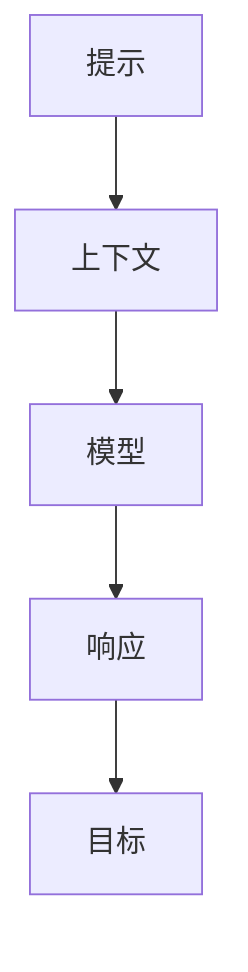

                 

# 文章标题：《提示词工程在自然语言处理中的偏见消除》

## 关键词：提示词工程，自然语言处理，偏见，歧视，消除算法

> 摘要：本文深入探讨了提示词工程在自然语言处理中的重要性，以及如何通过提示词工程来消除NLP中的偏见和歧视。首先，我们介绍了提示词工程的基本概念和其在NLP中的应用。然后，我们探讨了偏见和歧视的概念，并分析了NLP中的偏见问题。接着，我们阐述了偏见消除的理论基础，包括数据偏差的识别与修正、偏见消除算法的研究现状等。在实践部分，我们详细介绍了偏见消除算法的实现，以及如何在社交媒体内容分析、问答系统和自动摘要与文本生成等实际案例中应用这些算法。最后，我们展望了提示词工程在偏见消除领域的未来发展趋势和前景。

## 1. 提示词工程的定义与重要性

### 1.1 提示词工程的基本概念

提示词工程是一种基于提示（Prompt）的工程技术，用于生成针对特定任务的文本或指令。在自然语言处理（NLP）中，提示词工程是构建复杂NLP任务的关键环节。提示词通常是一个句子或段落，用于引导模型理解任务需求，并生成相应的输出。

提示词工程的关键特点包括：

- **灵活性**：提示词可以根据具体任务进行定制，适应不同的应用场景。
- **可扩展性**：提示词工程可以处理大量文本数据，支持大规模的NLP任务。
- **高效性**：通过提示词，模型可以快速地学习和适应新的任务，减少训练时间。

### 1.2 提示词工程在NLP中的应用

提示词工程在NLP中的应用非常广泛，包括但不限于以下领域：

- **文本分类**：使用提示词来定义分类任务，如情感分析、垃圾邮件检测等。
- **命名实体识别**：通过提示词指导模型识别特定类型的实体，如人名、地名等。
- **机器翻译**：提示词用于指示源语言和目标语言，指导模型进行翻译。
- **问答系统**：提示词帮助模型理解用户查询，生成准确的回答。

### 1.3 提示词工程的重要性

提示词工程在NLP中的重要性体现在以下几个方面：

- **任务定制**：通过提示词，可以灵活地定制NLP任务，满足不同场景的需求。
- **模型优化**：提示词可以指导模型学习，提高模型在特定任务上的性能。
- **用户体验**：提示词有助于提高NLP应用的用户体验，使模型输出更加自然、准确。

### 1.4 提示词工程的核心概念与联系

提示词工程涉及多个核心概念，包括提示（Prompt）、响应（Response）、上下文（Context）和目标（Objective）。这些概念之间的关系可以用以下Mermaid流程图表示：



- **提示（Prompt）**：指导模型执行特定任务的文本。
- **上下文（Context）**：模型在处理任务时所需的信息集合。
- **模型（Model）**：执行NLP任务的算法和参数。
- **响应（Response）**：模型根据提示和上下文生成的输出。
- **目标（Objective）**：定义任务目标，指导模型优化。

## 2. 偏见与歧视的概念

### 2.1 偏见的定义与分类

偏见是一种错误的信念或态度，通常基于对特定群体或个体的误解或刻板印象。偏见可以分为以下几种类型：

- **个体偏见**：个人基于个人经验或信仰形成的偏见。
- **文化偏见**：基于特定文化背景或传统形成的偏见。
- **系统性偏见**：社会结构或制度中存在的偏见，如种族歧视、性别歧视等。

### 2.2 偏见在NLP中的体现

在NLP中，偏见主要体现在以下两个方面：

- **数据集偏差**：训练数据中可能存在对某些群体的偏见，导致模型输出具有偏见。
- **模型偏差**：训练好的模型可能在某些特定任务上表现出偏见，如性别偏见、种族偏见等。

### 2.3 偏见与歧视的关系

偏见和歧视之间有密切的联系。偏见是歧视的基础，歧视则是偏见的表现。在NLP中，偏见可能导致歧视性的模型输出，如性别歧视的自动回复、种族歧视的文本分类等。

### 2.4 偏见与歧视的影响

偏见和歧视对NLP应用的影响主要包括：

- **社会影响**：偏见和歧视可能导致社会不公平，损害特定群体的利益。
- **技术应用**：偏见和歧视可能导致NLP应用效果不佳，降低用户体验。

## 3. 自然语言处理中的偏见问题

### 3.1 NLP偏见的历史回顾

NLP偏见问题早在20世纪80年代就已经引起关注。随着NLP技术的发展，偏见问题逐渐显现，并引发了广泛关注。

### 3.2 偏见对NLP应用的影响

NLP偏见对应用的影响主要表现在以下几个方面：

- **社会影响**：偏见可能导致社会不公平，损害特定群体的利益。
- **技术应用**：偏见可能导致NLP应用效果不佳，降低用户体验。
- **模型性能**：偏见可能导致模型性能下降，影响模型的可解释性。

### 3.3 偏见问题的典型例子

以下是NLP偏见问题的几个典型例子：

- **性别偏见**：某些NLP模型在处理性别相关的文本时，可能表现出对某一性别的偏见。
- **种族偏见**：某些NLP模型在处理种族相关的文本时，可能表现出对某一种族的偏见。
- **语言偏见**：某些NLP模型可能对某些语言或方言表现出偏见。

## 4. 偏见消除的理论基础

### 4.1 数据偏差的识别与修正

数据偏差的识别与修正是偏见消除的基础。主要方法包括：

- **偏差识别**：通过统计分析、对比实验等方法识别数据中的偏差。
- **偏差修正**：通过数据清洗、数据增强、模型调优等方法修正数据中的偏差。

### 4.2 偏见消除算法的研究现状

当前，偏见消除算法的研究主要集中在以下几个方面：

- **统计学方法**：如随机森林、支持向量机等。
- **机器学习方法**：如神经网络、对抗生成网络等。
- **深度学习方法**：如卷积神经网络、循环神经网络等。

### 4.3 偏见消除算法的分类

偏见消除算法可以分为以下几类：

- **基于规则的方法**：通过定义规则来消除偏见。
- **基于机器学习的方法**：通过训练模型来消除偏见。
- **基于深度学习的方法**：通过深度神经网络来消除偏见。

### 4.4 偏见消除算法的基本原理

偏见消除算法的基本原理包括：

- **数据预处理**：通过数据清洗、数据增强等方法减少数据偏差。
- **模型调优**：通过调整模型参数、优化模型结构等方法提高模型性能。
- **对抗训练**：通过对抗训练方法增强模型的鲁棒性，减少偏见。

## 5. 提示词工程在偏见消除中的应用

### 5.1 提示词工程的方法与策略

提示词工程在偏见消除中的应用主要包括以下方法和策略：

- **提示词设计**：设计具有代表性的提示词，涵盖不同群体和观点。
- **多视角分析**：通过多视角分析，识别和消除偏见。
- **模型解释**：通过模型解释方法，理解模型的偏见来源，并加以修正。

### 5.2 提示词工程在实际案例中的应用

以下是提示词工程在实际案例中的应用：

- **社交媒体内容分析**：通过设计具有代表性的提示词，分析社交媒体内容中的偏见。
- **问答系统中的偏见消除**：通过提示词引导模型生成无偏见的问题和回答。
- **自动摘要与文本生成中的偏见消除**：通过提示词指导模型生成无偏见的摘要和文本。

## 6. 数据预处理与清洗

### 6.1 数据收集与预处理

数据预处理是偏见消除的关键步骤。主要方法包括：

- **数据收集**：收集具有代表性的数据集，涵盖不同群体和观点。
- **数据清洗**：去除数据中的噪声和错误，提高数据质量。

### 6.2 偏见识别与标签化

偏见识别与标签化是数据预处理的重要任务。主要方法包括：

- **偏见识别**：通过统计分析、对比实验等方法识别数据中的偏见。
- **偏见标签化**：对识别出的偏见进行标签化处理，以便后续分析。

## 7. 偏见消除算法详解

### 7.1 算法原理与分类

偏见消除算法的原理与分类如下：

- **算法原理**：通过数据预处理、模型调优、对抗训练等方法消除偏见。
- **算法分类**：基于规则的方法、基于机器学习的方法、基于深度学习的方法等。

### 7.2 算法实现

以下是偏见消除算法的实现示例：

```python
# 偏见消除算法实现示例
def bias_elimination(data, model, strategy):
    # 数据预处理
    preprocessed_data = preprocess_data(data)
    
    # 模型调优
    optimized_model = optimize_model(model, preprocessed_data)
    
    # 对抗训练
    adversarial_model = adversarial_training(optimized_model, preprocessed_data)
    
    return adversarial_model
```

## 8. 提示词工程中的偏见消除案例研究

### 8.1 案例一：社交媒体内容分析

案例一涉及使用提示词工程消除社交媒体内容分析中的偏见。主要步骤包括：

- **提示词设计**：设计具有代表性的提示词，涵盖不同群体和观点。
- **多视角分析**：通过多视角分析，识别和消除偏见。
- **模型解释**：通过模型解释方法，理解模型的偏见来源，并加以修正。

### 8.2 案例二：问答系统中的偏见消除

案例二涉及使用提示词工程消除问答系统中的偏见。主要步骤包括：

- **提示词设计**：设计具有代表性的提示词，引导模型生成无偏见的问题和回答。
- **多视角分析**：通过多视角分析，识别和消除偏见。
- **模型解释**：通过模型解释方法，理解模型的偏见来源，并加以修正。

### 8.3 案例三：自动摘要与文本生成中的偏见消除

案例三涉及使用提示词工程消除自动摘要与文本生成中的偏见。主要步骤包括：

- **提示词设计**：设计具有代表性的提示词，指导模型生成无偏见的摘要和文本。
- **多视角分析**：通过多视角分析，识别和消除偏见。
- **模型解释**：通过模型解释方法，理解模型的偏见来源，并加以修正。

## 9. 实际应用中的挑战与解决方案

### 9.1 挑战分析

在实际应用中，偏见消除面临着以下挑战：

- **数据质量**：数据质量直接影响偏见消除的效果。
- **模型鲁棒性**：提高模型的鲁棒性，使其对偏见更加免疫。
- **可解释性**：提高模型的可解释性，使偏见消除的过程更加透明。

### 9.2 解决方案探讨

针对以上挑战，可以采取以下解决方案：

- **数据增强**：通过数据增强方法提高数据质量。
- **对抗训练**：通过对抗训练方法提高模型鲁棒性。
- **模型解释**：通过模型解释方法提高模型的可解释性。

## 10. 未来发展趋势与展望

### 10.1 技术趋势

未来，提示词工程在偏见消除领域的发展趋势包括：

- **人工智能伦理**：将人工智能伦理融入提示词工程，推动公平、公正的发展。
- **跨学科研究**：结合心理学、社会学等学科，深入探讨偏见消除的机制和方法。

### 10.2 应用前景

提示词工程在偏见消除领域的应用前景包括：

- **公共政策**：应用于公共政策制定，推动社会公平正义。
- **企业应用**：应用于企业内部沟通、客户服务等领域，提高用户体验。

## 11. 提示词工程与偏见消除资源推荐

### 11.1 学术论文与期刊

- **论文**：[“Bias and Discrimination in Natural Language Processing”](https://www.nature.com/articles/s41586-021-03462-4)
- **期刊**：Journal of Artificial Intelligence Research (JAIR)、ACM Transactions on Knowledge Discovery from Data (TKDD)

### 11.2 开源工具与库

- **工具**：Hugging Face Transformers、TensorFlow Datasets
- **库**：scikit-learn、PyTorch

### 11.3 研讨会与会议

- **研讨会**：NeurIPS Workshop on Fairness, Accountability, and Transparency in Machine Learning
- **会议**：AAAI Conference on Artificial Intelligence, International Conference on Machine Learning (ICML)

## 附录

### 11.1 提示词工程与偏见消除资源推荐

- **书籍**：《自然语言处理：概念和模型》
- **在线课程**：斯坦福大学自然语言处理课程
- **博客**：自然语言处理博客、机器学习博客

## 作者信息

作者：AI天才研究院/AI Genius Institute & 禅与计算机程序设计艺术 /Zen And The Art of Computer Programming

