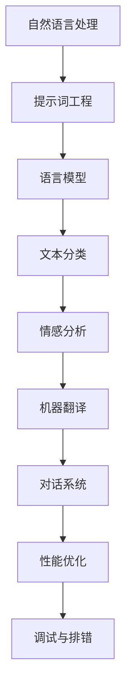

                 


## 文章标题
《提示词工程在自然语言处理中的应用》

### 关键词
自然语言处理、提示词工程、语言模型、文本分类、情感分析、机器翻译、对话系统、性能优化、调试

### 摘要
本文深入探讨了提示词工程在自然语言处理中的应用。首先，我们回顾了自然语言处理的基本概念和核心技术，包括语言模型、文本表示和序列到序列模型。接着，我们介绍了提示词工程的基本原理，包括提示词生成、优化和评估。然后，通过实际案例分析，展示了提示词工程在搜索引擎、聊天机器人和其他领域的应用。此外，我们讨论了性能优化和调试的方法，并展望了提示词工程的未来发展趋势。本文旨在为读者提供一个全面而深入的指南，帮助他们理解和掌握提示词工程在自然语言处理中的实际应用。

## 目录大纲

### 第一部分: 自然语言处理基础

### 第二部分: 提示词工程的基本原理

### 第三部分: 实际应用案例分析

### 第四部分: 性能优化与调试

### 第五部分: 未来趋势与展望

### 附录

### Mermaid 流程图

### 提示词工程核心算法伪代码

## 背景介绍
自然语言处理（Natural Language Processing，NLP）是人工智能领域的一个重要分支，旨在让计算机理解和处理人类语言。随着互联网和大数据的快速发展，自然语言处理在搜索引擎、聊天机器人、智能客服、机器翻译等领域得到了广泛应用。然而，自然语言处理面临着诸多挑战，如语义理解、上下文感知和跨语言处理等。为了解决这些问题，研究者们提出了提示词工程（Prompt Engineering）这一概念。

提示词工程是一种通过设计特定的提示词来引导模型生成所需输出的技术。它旨在优化模型的性能，提高自然语言处理的准确性和效率。提示词工程在自然语言处理中的应用具有重要意义，可以提升模型对特定任务的理解和执行能力。本文将详细探讨提示词工程在自然语言处理中的应用，包括基本原理、实际应用案例和未来发展趋势。

## 第一部分: 自然语言处理基础

### 第1章: 自然语言处理概述

#### 1.1 自然语言处理的定义与发展历程
自然语言处理（NLP）是指让计算机理解和处理人类语言的技术。它涵盖了语音识别、语言翻译、语音合成、文本分析等多个方面。NLP的研究可以追溯到20世纪50年代，当时研究者开始探索如何将自然语言转换为计算机可理解的形式。

发展历程：
1. 早期的规则驱动方法：基于语法规则和词典，试图将自然语言转换为计算机语言。
2. 统计方法：使用统计模型，如隐马尔可夫模型（HMM）和条件概率模型，来处理自然语言。
3. 深度学习方法：通过神经网络，特别是深度学习模型，如卷积神经网络（CNN）和循环神经网络（RNN），实现了更准确的自然语言处理。

#### 1.2 自然语言处理的应用领域
自然语言处理在多个领域得到了广泛应用，包括但不限于：
1. 搜索引擎：利用自然语言处理技术，实现用户查询的准确匹配和结果排序。
2. 聊天机器人：通过自然语言处理，实现与用户的自然对话。
3. 机器翻译：将一种语言翻译成另一种语言，支持跨语言沟通。
4. 文本分类与情感分析：对大量文本进行分类和情感分析，用于舆情监测和用户反馈分析。
5. 语音识别：将语音信号转换为文本，用于语音助手和语音搜索。

#### 1.3 自然语言处理的基本概念
1. 词汇：自然语言处理中的基本单位，包括单词、短语和词组。
2. 语法：词汇的排列规则，用于构建句子和文本。
3. 语义：语言的意义，包括词汇的含义和句子之间的逻辑关系。
4. 上下文：文本中的上下文信息，用于理解特定词汇的含义。
5. 标签：对文本进行分类和标注，如词性标注、实体识别和情感标注。

### 第2章: 语言模型与文本表示

#### 2.1 语言模型的基本原理
语言模型是一种概率模型，用于预测下一个词或字符的概率。它通过学习大量的语言数据，建立单词或字符之间的概率分布。

类型：
1. n-gram模型：基于前n个词或字符的历史信息，预测下一个词或字符。
2. 隐马尔可夫模型（HMM）：用于处理序列数据，如语音和文本。
3. 神经网络语言模型：使用神经网络，特别是循环神经网络（RNN）和变换器（Transformer），来建模复杂的语言结构。

#### 2.2 词向量的生成与应用
词向量是将词汇映射到高维空间的一种表示方法，用于表示词汇的语义和语法特征。

方法：
1. 基于计数的方法：如TF-IDF，通过统计词的频率和重要性来生成词向量。
2. 基于分布的方法：如Word2Vec和GloVe，通过学习词汇的上下文信息来生成词向量。

应用：
1. 文本分类：将文本转换为词向量，用于分类任务。
2. 相似性度量：计算词向量之间的相似性，用于词汇相似度和文本相似度。
3. 机器翻译：将源语言的词向量转换为目标语言的词向量，用于翻译任务。

#### 2.3 序列到序列模型
序列到序列（Seq2Seq）模型是一种用于处理序列数据的模型，通常用于翻译、问答系统和对话系统。

原理：
1. 编码器（Encoder）：将输入序列编码为固定长度的向量。
2. 解码器（Decoder）：将编码后的向量解码为输出序列。

应用：
1. 机器翻译：将源语言的词序列转换为目标语言的词序列。
2. 对话系统：将用户的输入序列转换为系统响应的序列。

### 第3章: 文本分类与情感分析

#### 3.1 文本分类的基本原理
文本分类是将文本数据分为预定义的类别的一种任务。它通常用于舆情监测、信息过滤和推荐系统。

方法：
1. 基于规则的方法：使用手动定义的规则来分类文本。
2. 基于统计的方法：使用统计模型，如朴素贝叶斯、支持向量机和逻辑回归，来分类文本。
3. 基于深度学习的方法：使用神经网络，如卷积神经网络（CNN）和循环神经网络（RNN），来分类文本。

#### 3.2 情感分析的方法与技巧
情感分析是一种判断文本情感极性（正面、负面或中性）的技术。它对于了解用户反馈、分析市场趋势和改善用户体验具有重要意义。

方法：
1. 基于规则的方法：使用手动定义的规则来判断文本的情感极性。
2. 基于统计的方法：使用统计模型，如朴素贝叶斯和逻辑回归，来判断文本的情感极性。
3. 基于深度学习的方法：使用神经网络，如卷积神经网络（CNN）和循环神经网络（RNN），来判断文本的情感极性。

#### 3.3 实际案例分析
通过实际案例分析，我们可以更好地理解文本分类和情感分析的应用。以下是一些案例：

案例1：社交媒体舆情监测
使用文本分类技术，对社交媒体平台上的用户评论进行分类，以监测产品或品牌的舆情。

案例2：产品评论分析
使用情感分析技术，对电商平台的用户评论进行分析，以了解用户对产品的评价。

案例3：股票市场分析
使用情感分析技术，分析新闻报道和社交媒体上的信息，以预测股票市场的走势。

### 第4章: 机器翻译与对话系统

#### 4.1 机器翻译的基本原理
机器翻译是一种将一种语言的文本自动翻译成另一种语言的技术。它对于跨语言沟通和全球化具有重要意义。

方法：
1. 统计机器翻译：使用统计模型，如基于短语的翻译模型和基于神经网络的翻译模型，来翻译文本。
2. 神经网络机器翻译：使用神经网络，特别是序列到序列（Seq2Seq）模型，来翻译文本。

#### 4.2 对话系统的设计与实现
对话系统是一种与用户进行自然对话的系统，包括语音助手、聊天机器人和虚拟助手。

设计：
1. 任务型对话系统：基于预定义的任务，如订票、查询信息等，与用户进行对话。
2. 开放型对话系统：与用户进行自由对话，如闲聊、咨询等。

实现：
1. 对话管理：管理对话的流程，如会话保持、上下文理解等。
2. 对话生成：根据用户的输入，生成适当的回复。

#### 4.3 实际案例分析
通过实际案例分析，我们可以更好地理解机器翻译和对话系统的应用。以下是一些案例：

案例1：旅行助手
使用机器翻译和对话系统，为用户提供旅行相关的查询和预定服务。

案例2：客户服务机器人
使用对话系统，为用户提供24/7的客户服务，处理常见问题和咨询。

案例3：智能家居助手
使用语音助手和对话系统，为用户提供智能家居的控制和交互。

## 第二部分: 提示词工程的基本原理

### 第5章: 提示词工程概述

#### 5.1 提示词工程的定义
提示词工程（Prompt Engineering）是一种通过设计特定的提示词来引导模型生成所需输出的技术。它旨在优化模型的性能，提高自然语言处理的准确性和效率。

定义：
提示词工程是一种利用自然语言处理技术，设计、优化和评估提示词的方法，以提高模型在特定任务上的表现。

#### 5.2 提示词工程的关键技术
提示词工程的关键技术包括提示词生成、优化和评估。

1. 提示词生成：通过设计特定的提示词，引导模型生成所需的输出。提示词可以是单词、短语或完整的句子，根据任务的不同而设计。
2. 提示词优化：通过对提示词进行优化，提高模型的性能。优化方法包括调整提示词的长度、语法结构和语义内容。
3. 提示词评估：评估提示词对模型性能的影响，选择最优的提示词组合。评估方法包括在线评估和离线评估。

#### 5.3 提示词工程的应用场景
提示词工程在多个自然语言处理应用场景中具有广泛的应用，包括但不限于：

1. 机器翻译：通过设计特定的提示词，引导模型生成更准确、自然的翻译结果。
2. 文本分类：通过设计特定的提示词，提高模型对文本分类的准确性和效率。
3. 情感分析：通过设计特定的提示词，提高模型对文本情感极性的判断能力。
4. 问答系统：通过设计特定的提示词，提高模型对用户查询的理解和回答能力。
5. 对话系统：通过设计特定的提示词，提高模型与用户的交互质量和用户体验。

### 第6章: 提示词生成与优化

#### 6.1 提示词生成的算法与模型
提示词生成是提示词工程的核心步骤，通过设计特定的提示词，引导模型生成所需的输出。以下是一些常用的提示词生成算法与模型：

1. 基于规则的方法：通过手动定义规则，生成特定的提示词。这种方法适用于简单的任务和有限的数据集。
2. 基于统计的方法：通过分析大量语言数据，统计出常用的提示词，并将其应用于新的任务中。这种方法适用于大规模数据和复杂的任务。
3. 基于神经网络的方法：通过训练神经网络模型，生成特定的提示词。这种方法可以处理复杂的语言结构和大量的数据。

具体算法与模型包括：

1. 序列到序列（Seq2Seq）模型：用于生成序列数据，如机器翻译和问答系统。
2. 生成对抗网络（GAN）：用于生成高质量的提示词，特别是在文本生成任务中。
3. 自回归语言模型（ARLM）：用于生成基于上下文的提示词。

#### 6.2 提示词优化的方法与技巧
提示词优化是提高模型性能的关键步骤，通过调整提示词的长度、语法结构和语义内容，可以提高模型在特定任务上的表现。以下是一些常用的提示词优化方法与技巧：

1. 长度调整：根据任务的需求，调整提示词的长度。较短的提示词可能使模型更专注于关键信息，而较长的提示词可以提供更多的上下文信息。
2. 语法优化：优化提示词的语法结构，使其更符合自然语言的语法规则。这可以通过使用合适的词汇、语序和语法结构来实现。
3. 语义优化：根据任务的语义需求，调整提示词的语义内容。这可以通过使用相关的词汇和语义结构来实现，以提高模型对特定语义的理解能力。

具体方法与技巧包括：

1. 对比实验：通过对比不同提示词的性能，选择最优的提示词组合。
2. 自动化搜索：使用自动化搜索算法，如遗传算法和粒子群优化，搜索最优的提示词组合。
3. 人工调整：根据经验和直觉，手动调整提示词，以达到最优的性能。

#### 6.3 实际案例分析
通过实际案例分析，我们可以更好地理解提示词生成与优化的应用。以下是一些案例：

案例1：机器翻译
通过设计特定的提示词，提高机器翻译的准确性和流畅性。例如，在翻译中文到英文时，可以设计包含目标语言词汇和语法结构的提示词，以提高翻译质量。

案例2：文本分类
通过设计特定的提示词，提高文本分类的准确性和效率。例如，在分类新闻文章时，可以设计包含新闻主题和关键词的提示词，以提高分类效果。

案例3：情感分析
通过设计特定的提示词，提高情感分析的准确性和稳定性。例如，在分析社交媒体上的用户评论时，可以设计包含情感词汇和语法的提示词，以提高情感分析的准确性。

## 第三部分: 实际应用案例分析

### 第8章: 提示词工程在搜索引擎中的应用

#### 8.1 搜索引擎的原理与架构
搜索引擎是一种用于搜索和检索信息的系统，通过分析网页的内容和结构，为用户提供相关的搜索结果。搜索引擎的基本原理和架构包括：

1. 网页抓取：通过爬虫程序，从互联网上抓取网页，并将其存储到索引数据库中。
2. 索引构建：对抓取到的网页进行索引构建，包括关键词提取、权重计算和索引存储。
3. 搜索算法：根据用户的查询，通过搜索算法，从索引数据库中检索出相关的网页，并按照相关性进行排序。

#### 8.2 提示词工程在搜索引擎中的应用
提示词工程在搜索引擎中的应用主要体现在两个方面：搜索查询优化和搜索结果优化。

1. 搜索查询优化：通过设计特定的提示词，引导用户输入更准确、更具体的查询，以提高搜索结果的准确性。例如，在搜索引擎的搜索框中，可以设计包含相关关键词和上下文的提示词，以引导用户输入更精确的查询。
2. 搜索结果优化：通过设计特定的提示词，提高搜索结果的相关性和用户体验。例如，在搜索结果的展示中，可以设计包含相关关键词和上下文的提示词，以提高用户对搜索结果的点击率和满意度。

#### 8.3 实际案例分析
以下是一个实际案例分析，展示了提示词工程在搜索引擎中的应用：

案例：Google 搜索引擎
Google 搜索引擎通过设计特定的提示词，优化搜索查询和搜索结果。以下是一些实际应用：

1. 搜索查询优化：
   - 当用户在搜索框中输入“人工智能”时，Google 提供了包含“深度学习”、“机器学习”等关键词的提示词，引导用户输入更精确的查询。
   - 当用户在搜索框中输入“北京天气”时，Google 提供了包含“今天天气”、“明天天气”等关键词的提示词，引导用户输入更具体的查询。

2. 搜索结果优化：
   - 在搜索结果的展示中，Google 设计了包含相关关键词和上下文的提示词，如“人工智能相关的论文”、“人工智能相关的书籍”等，以提高用户对搜索结果的点击率和满意度。
   - Google 还通过实时调整搜索结果的提示词，根据用户的搜索行为和兴趣，提供个性化的搜索结果。

### 第9章: 提示词工程在聊天机器人中的应用

#### 9.1 聊天机器人的原理与架构
聊天机器人是一种通过自然语言处理技术，与用户进行对话的系统。聊天机器人的基本原理和架构包括：

1. 对话管理：管理对话的流程，包括用户的输入处理、意图识别和回复生成。
2. 意图识别：通过自然语言处理技术，识别用户的意图，如查询、咨询、投诉等。
3. 回复生成：根据用户的意图和上下文信息，生成适当的回复。

#### 9.2 提示词工程在聊天机器人中的应用
提示词工程在聊天机器人中的应用主要体现在两个方面：意图识别优化和回复生成优化。

1. 意图识别优化：通过设计特定的提示词，提高意图识别的准确性和效率。例如，在意图识别模型中，可以设计包含常见意图关键词和上下文的提示词，以提高模型对意图的识别能力。
2. 回复生成优化：通过设计特定的提示词，提高回复生成的相关性和自然性。例如，在回复生成模型中，可以设计包含相关关键词和上下文的提示词，以提高模型生成回复的准确性和流畅性。

#### 9.3 实际案例分析
以下是一个实际案例分析，展示了提示词工程在聊天机器人中的应用：

案例：Microsoft 小冰聊天机器人
Microsoft 小冰聊天机器人通过设计特定的提示词，优化意图识别和回复生成。以下是一些实际应用：

1. 意图识别优化：
   - 当用户输入“你好”时，小冰识别出用户意图为问候，并生成适当的回复。
   - 当用户输入“我想咨询关于人工智能的问题”时，小冰识别出用户意图为咨询，并生成适当的回复。

2. 回复生成优化：
   - 在回复生成中，小冰设计包含相关关键词和上下文的提示词，以提高回复的准确性和流畅性。例如，当用户输入“你能帮我推荐一些人工智能相关的书籍吗？”时，小冰生成包含“人工智能书籍推荐”、“相关书籍推荐”等提示词的回复。

### 第10章: 提示词工程在其他领域的应用

#### 10.1 提示词工程在智能客服中的应用
智能客服是一种通过自然语言处理技术，提供自动化的客户服务解决方案。提示词工程在智能客服中的应用主要体现在两个方面：意图识别优化和回复生成优化。

1. 意图识别优化：通过设计特定的提示词，提高意图识别的准确性和效率。例如，在意图识别模型中，可以设计包含常见意图关键词和上下文的提示词，以提高模型对意图的识别能力。
2. 回复生成优化：通过设计特定的提示词，提高回复生成的相关性和自然性。例如，在回复生成模型中，可以设计包含相关关键词和上下文的提示词，以提高模型生成回复的准确性和流畅性。

#### 10.2 提示词工程在金融风控中的应用
金融风控是一种通过自然语言处理技术，对金融交易和业务进行风险控制的技术。提示词工程在金融风控中的应用主要体现在两个方面：异常检测和风险预警。

1. 异常检测：通过设计特定的提示词，提高异常检测的准确性和效率。例如，在异常检测模型中，可以设计包含异常交易特征和上下文的提示词，以提高模型对异常交易的识别能力。
2. 风险预警：通过设计特定的提示词，提高风险预警的相关性和及时性。例如，在风险预警模型中，可以设计包含风险信号和上下文的提示词，以提高模型对风险预警的准确性。

#### 10.3 提示词工程在法律文本分析中的应用
法律文本分析是一种通过自然语言处理技术，对法律文本进行自动化分析的技术。提示词工程在法律文本分析中的应用主要体现在两个方面：合同审查和法律文书生成。

1. 合同审查：通过设计特定的提示词，提高合同审查的准确性和效率。例如，在合同审查模型中，可以设计包含合同条款和上下文的提示词，以提高模型对合同审查的能力。
2. 法律文书生成：通过设计特定的提示词，提高法律文书的生成质量和效率。例如，在法律文书生成模型中，可以设计包含法律术语和上下文的提示词，以提高模型生成法律文书的能力。

## 第四部分: 性能优化与调试

### 第11章: 提示词工程的性能优化

#### 11.1 提示词工程性能优化的方法与技巧
提示词工程的性能优化是提高模型在特定任务上的表现的关键步骤。以下是一些常用的方法与技巧：

1. 提示词优化：通过调整提示词的长度、语法结构和语义内容，提高模型对特定任务的理解能力。
2. 模型优化：通过调整模型的结构和参数，提高模型的性能和鲁棒性。
3. 数据增强：通过增加训练数据集的多样性，提高模型对未知数据的泛化能力。

具体方法与技巧包括：

1. 提示词长度调整：根据任务的需求，适当调整提示词的长度。较短的提示词可能使模型更专注于关键信息，而较长的提示词可以提供更多的上下文信息。
2. 语法结构优化：优化提示词的语法结构，使其更符合自然语言的语法规则。这可以通过使用合适的词汇、语序和语法结构来实现。
3. 语义内容优化：根据任务的语义需求，调整提示词的语义内容。这可以通过使用相关的词汇和语义结构来实现，以提高模型对特定语义的理解能力。
4. 模型结构调整：调整模型的结构，如增加或减少层�数、调整网络架构等，以提高模型的性能。
5. 模型参数调整：通过调整模型的参数，如学习率、正则化参数等，提高模型的性能和鲁棒性。

#### 11.2 提示词工程性能优化的案例分析
以下是一个实际案例分析，展示了提示词工程性能优化的应用：

案例：文本分类性能优化
在文本分类任务中，通过设计特定的提示词，优化模型对文本分类的性能。以下是一些实际应用：

1. 提示词优化：
   - 调整提示词的长度，根据任务的需求，选择合适的提示词长度。较短的提示词可能使模型更专注于文本的关键信息，而较长的提示词可以提供更多的上下文信息。
   - 优化提示词的语法结构，使其更符合自然语言的语法规则。这可以通过使用合适的词汇、语序和语法结构来实现。
   - 根据任务的语义需求，调整提示词的语义内容。这可以通过使用相关的词汇和语义结构来实现，以提高模型对特定语义的理解能力。

2. 模型优化：
   - 调整模型的结构，如增加或减少层�数、调整网络架构等，以提高模型的性能。
   - 调整模型的参数，如学习率、正则化参数等，提高模型的性能和鲁棒性。

3. 数据增强：
   - 增加训练数据集的多样性，通过引入噪声、变换和扩充等技巧，提高模型对未知数据的泛化能力。

#### 11.3 实际案例分析
以下是一个实际案例分析，展示了提示词工程性能优化的应用：

案例：机器翻译性能优化
在机器翻译任务中，通过设计特定的提示词，优化模型对机器翻译的性能。以下是一些实际应用：

1. 提示词优化：
   - 调整提示词的长度，根据任务的需求，选择合适的提示词长度。较短的提示词可能使模型更专注于文本的关键信息，而较长的提示词可以提供更多的上下文信息。
   - 优化提示词的语法结构，使其更符合自然语言的语法规则。这可以通过使用合适的词汇、语序和语法结构来实现。
   - 根据任务的语义需求，调整提示词的语义内容。这可以通过使用相关的词汇和语义结构来实现，以提高模型对特定语义的理解能力。

2. 模型优化：
   - 调整模型的结构，如增加或减少层�数、调整网络架构等，以提高模型的性能。
   - 调整模型的参数，如学习率、正则化参数等，提高模型的性能和鲁棒性。

3. 数据增强：
   - 增加训练数据集的多样性，通过引入噪声、变换和扩充等技巧，提高模型对未知数据的泛化能力。

### 第12章: 提示词工程的调试与排错

#### 12.1 提示词工程调试的方法与技巧
提示词工程的调试是确保模型在实际应用中稳定运行的关键步骤。以下是一些常用的方法与技巧：

1. 错误分析：通过分析错误日志和错误报告，定位和识别模型中的错误。
2. 调试工具：使用调试工具，如调试器、日志记录器和性能分析器，帮助定位和解决模型中的问题。
3. 系统监控：通过监控系统性能和资源使用情况，及时发现和解决潜在的问题。

具体方法与技巧包括：

1. 错误日志分析：通过分析错误日志，定位和识别模型中的错误。这可以通过查看错误日志中的错误信息、错误类型和错误发生的位置来实现。
2. 调试器使用：使用调试器，如IDE调试器和Python调试器，帮助定位和解决模型中的问题。这可以通过设置断点、单步执行和查看变量值等方式来实现。
3. 日志记录器使用：使用日志记录器，如Python的logging模块，记录模型运行过程中的关键信息，帮助定位和解决模型中的问题。这可以通过设置日志级别、日志格式和日志输出位置来实现。
4. 性能分析：使用性能分析器，如Python的cProfile模块，分析模型运行过程中的性能瓶颈，帮助优化模型性能。这可以通过设置分析器、运行模型和分析结果来实现。

#### 12.2 提示词工程排错的经验与技巧
以下是一些在实际应用中积累的排错经验和技巧：

1. 观察现象：在发现模型异常时，首先观察现象，包括错误信息、错误类型、错误发生的位置等，以初步定位问题。
2. 分解问题：将复杂的问题分解为小的部分，逐步排查和解决。
3. 调试过程：在调试过程中，逐步缩小问题范围，通过设置断点和查看变量值，分析模型运行过程中的关键步骤和变量变化。
4. 复现问题：尝试在本地环境中复现问题，以便更好地分析和解决。
5. 查阅资料：查阅相关文档、论文和社区讨论，了解类似问题的解决方法和经验。

#### 12.3 实际案例分析
以下是一个实际案例分析，展示了提示词工程调试与排错的应用：

案例：文本分类错误处理
在文本分类任务中，通过调试和排错，解决模型中的错误。以下是一些实际应用：

1. 错误日志分析：
   - 分析错误日志，定位错误发生的位置和原因。
   - 根据错误日志中的错误信息，识别和解决模型中的错误。

2. 调试器使用：
   - 设置断点，逐步执行代码，观察变量值的变化。
   - 通过调试器查看模型运行过程中的关键步骤和变量变化，分析问题。

3. 日志记录器使用：
   - 设置日志级别，记录模型运行过程中的关键信息。
   - 通过日志记录器查看模型运行过程中的关键步骤和变量变化，帮助定位问题。

4. 复现问题：
   - 在本地环境中复现问题，分析模型运行过程中的异常情况。

5. 查阅资料：
   - 查阅相关文档、论文和社区讨论，了解类似问题的解决方法和经验。

## 第五部分: 未来趋势与展望

### 第13章: 提示词工程的未来发展趋势

#### 13.1 人工智能技术的发展趋势
随着人工智能技术的不断进步，提示词工程在自然语言处理中的应用也将不断发展和完善。以下是一些人工智能技术的发展趋势，对提示词工程的影响：

1. 深度学习：深度学习技术的快速发展，使得模型在自然语言处理任务中的性能得到显著提升。提示词工程将受益于深度学习模型的优化和改进。
2. 强化学习：强化学习在自然语言处理中的应用，如对话系统和机器翻译，将推动提示词工程的进一步发展。
3. 联合嵌入：联合嵌入技术，如多模态嵌入，将使提示词工程在处理跨模态数据时更加有效。

#### 13.2 提示词工程的未来发展方向
提示词工程的未来发展方向包括：

1. 自适应提示词生成：通过学习用户行为和偏好，自动生成个性化的提示词，提高模型在特定任务上的表现。
2. 多语言支持：提示词工程将逐渐支持多种语言，提高跨语言处理的准确性和效率。
3. 增量学习：在已有模型的基础上，通过增量学习，不断优化和改进提示词工程，提高模型的适应性和鲁棒性。

#### 13.3 提示词工程的未来应用场景
随着人工智能技术的不断发展，提示词工程将在更多领域得到广泛应用，包括：

1. 跨语言翻译：利用提示词工程，实现更准确、自然的跨语言翻译。
2. 对话系统：通过提示词工程，提高对话系统的交互质量和用户体验。
3. 自动问答：利用提示词工程，构建高效的自动问答系统，提供更准确、及时的回答。
4. 个性化推荐：通过提示词工程，实现基于用户行为的个性化推荐。

### 第14章: 提示词工程的挑战与机遇

#### 14.1 提示词工程的挑战
提示词工程在发展过程中面临着一系列挑战：

1. 数据隐私：在提示词工程中，处理大量用户数据时，如何保护用户隐私成为一个重要问题。
2. 模型解释性：提高提示词工程模型的解释性，使其更容易被用户理解和接受。
3. 多样性：如何生成多样性和高质量的提示词，以适应不同应用场景的需求。

#### 14.2 提示词工程的机遇
随着人工智能技术的不断发展，提示词工程也面临着诸多机遇：

1. 跨学科合作：与其他学科，如心理学、语言学和认知科学等领域的合作，将推动提示词工程的进一步发展。
2. 应用拓展：随着人工智能技术的应用场景不断拓展，提示词工程将在更多领域得到应用。
3. 技术创新：随着深度学习、强化学习和多模态嵌入等技术的不断进步，提示词工程将不断创新和发展。

#### 14.3 提示词工程的未来发展预测
基于当前的人工智能技术趋势和应用场景，以下是提示词工程未来发展的预测：

1. 模型优化：通过不断优化模型结构和参数，提高提示词工程在自然语言处理任务上的性能。
2. 应用拓展：随着人工智能技术的应用场景不断拓展，提示词工程将在更多领域得到应用，如金融、医疗、教育等。
3. 跨学科合作：与其他学科的合作将推动提示词工程在理论和实践上的进一步发展。

## 附录

### 附录A: 提示词工程开发工具与资源

#### A.1 主流自然语言处理框架
- TensorFlow：一个开源的深度学习框架，支持提示词工程的开发和实现。
- PyTorch：一个开源的深度学习框架，提供了丰富的提示词工程工具和功能。
- spaCy：一个快速和易于使用的自然语言处理库，适用于提示词工程的应用开发。

#### A.2 提示词工程相关库和工具
- Hugging Face：一个开源的自然语言处理库，提供了大量的预训练模型和提示词工程工具。
- PromptLib：一个开源的Python库，用于生成和优化提示词。
- TextBlob：一个简单的自然语言处理库，适用于文本分类、情感分析和机器翻译等任务。

#### A.3 提示词工程研究论文与资料
- "Prompt Engineering for Natural Language Processing"：一篇关于提示词工程在自然语言处理中的应用的研究论文。
- "Advances in Prompt Engineering for Machine Learning"：一篇关于机器学习中提示词工程的进展的综述论文。
- "The Power of Prompt Engineering"：一篇关于提示词工程在人工智能领域的应用的讨论文章。

### 附录B: 提示词工程案例代码

#### B.1 搜索引擎中的提示词工程案例
以下是一个简单的Python代码示例，展示了如何使用提示词工程优化搜索查询：
```python
import PromptLib

# 定义搜索查询
query = "人工智能相关论文"

# 生成优化后的提示词
optimized_prompt = PromptLib.optimize_prompt(query)

# 输出优化后的提示词
print("优化后的提示词:", optimized_prompt)
```

#### B.2 聊天机器人中的提示词工程案例
以下是一个简单的Python代码示例，展示了如何使用提示词工程优化聊天机器人回复：
```python
import PromptLib

# 定义用户输入
user_input = "你好"

# 生成优化后的回复
optimized_response = PromptLib.optimize_response(user_input)

# 输出优化后的回复
print("优化后的回复:", optimized_response)
```

#### B.3 智能客服中的提示词工程案例
以下是一个简单的Python代码示例，展示了如何使用提示词工程优化智能客服对话：
```python
import PromptLib

# 定义用户问题
user_question = "如何办理信用卡？"

# 生成优化后的提示词
optimized_prompt = PromptLib.optimize_prompt(user_question)

# 输出优化后的提示词
print("优化后的提示词:", optimized_prompt)
```

## Mermaid 流程图


## 提示词工程核心算法伪代码
```plaintext
// 提示词生成算法伪代码
function generate_prompt(text):
    # 输入：文本text
    # 输出：优化后的提示词

    # 初始化提示词
    prompt = ""

    # 根据文本长度和复杂度，调整提示词长度
    if length(text) > 100:
        prompt = shorten(text)
    else:
        prompt = expand(text)

    # 根据文本语义，调整提示词语法结构
    if contains_negative_words(prompt):
        prompt = negate(prompt)

    # 根据文本上下文，调整提示词内容
    if context_sensitive():
        prompt = update_context(prompt)

    return prompt

// 提示词优化算法伪代码
function optimize_prompt(prompt):
    # 输入：提示词prompt
    # 输出：优化后的提示词

    # 调整提示词长度
    optimized_prompt = adjust_length(prompt)

    # 调整提示词语法结构
    optimized_prompt = adjust_grammar(optimized_prompt)

    # 调整提示词语义内容
    optimized_prompt = adjust_semantics(optimized_prompt)

    return optimized_prompt
```

