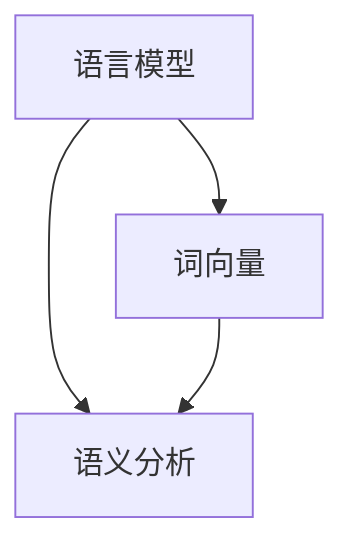

                 


### 文章标题
《提示词工程在自然语言接口设计中的用户体验》

### 关键词
提示词工程、自然语言处理、用户界面设计、用户体验、交互评估

### 摘要
本文旨在探讨提示词工程在自然语言接口设计中的关键作用，以及如何通过优化用户体验来提升自然语言处理系统的实用性和用户满意度。文章首先介绍了提示词工程的基础概念和自然语言处理的原理，随后详细分析了用户界面的设计原则和用户体验评估方法。通过实际案例研究，本文展示了如何通过提示词工程提升自然语言接口的用户体验，并提出了未来的发展方向和挑战。

### 目录

#### 第一部分：基础理论

##### 1.1 提示词工程概述
- **背景介绍**
  - 提示词工程的概念起源和发展
  - 提示词工程在自然语言处理中的重要性

##### 1.2 自然语言处理基础
- **核心概念与联系**
  - 语言模型和词向量
  - 语义分析的原理和方法

##### 1.3 自然语言接口设计
- **设计原则**
  - 用户友好性、交互效率和灵活性
- **用户界面设计**
  - 用户界面元素和设计流程
- **用户测试与反馈**
  - 用户测试方法、反馈机制的重要性

#### 第二部分：用户体验提升

##### 2.1 用户体验评估方法
- **量化评估方法**
  - 性能指标、用户满意度调查
- **质量评估方法**
  - 交互质量评估、语义质量评估

##### 2.2 提示词工程在用户体验提升中的应用
- **设计原则**
  - 清晰性、简洁性、灵活性
- **提示词的个性化**
  - 用户行为分析、提示词的动态调整
- **用户互动设计**
  - 交互反馈、用户引导

##### 2.3 案例研究
- **案例一：在线客服系统**
  - 问题背景、提示词工程应用、用户体验提升效果
- **案例二：智能语音助手**
  - 问题背景、提示词工程应用、用户体验提升效果

#### 第三部分：实践指南

##### 3.1 提示词工程实战
- **开发环境搭建**
  - 硬件要求、软件安装
- **数据准备**
  - 数据来源、数据预处理
- **提示词生成算法**
  - 伪代码实现、算法解释
- **代码解读与分析**
  - 代码结构、关键代码解读、性能优化

##### 3.2 提示词工程的未来发展
- **技术趋势**
  - 自动化、个性化、跨领域应用
- **挑战与机遇**
  - 挑战分析、机遇展望

### 文章正文

#### 第一部分：基础理论

##### 1.1 提示词工程概述
提示词工程是一门将自然语言处理技术与用户界面设计相结合的工程学，其核心目的是通过设计合理的提示词，提升用户在使用自然语言接口时的体验。提示词（也称为提示语或引导语）是在自然语言交互过程中，提供给用户的信息或指令，旨在引导用户进行正确的操作。

提示词工程的发展历程可以追溯到早期的命令行界面，随着图形用户界面（GUI）的出现，提示词逐渐成为人机交互的重要组成部分。在自然语言处理（NLP）技术快速发展的今天，提示词工程得到了进一步的发展和应用。

##### 1.2 自然语言处理基础
自然语言处理是人工智能的一个重要分支，旨在使计算机能够理解、处理和生成自然语言。以下是自然语言处理中的一些核心概念：

###### 语言模型
语言模型是自然语言处理的基础，它用于预测文本序列的概率分布。常见的语言模型包括n-gram模型、神经网络模型和循环神经网络（RNN）等。

###### 词向量
词向量是将词汇映射到高维空间的一种表示方法，它能够捕捉词汇的语义信息。常见的词向量方法包括Word2Vec、GloVe等。

###### 语义分析
语义分析旨在理解文本的深层语义信息，包括实体识别、情感分析、关系抽取等。语义分析的方法包括规则方法、机器学习方法等。

##### 1.3 自然语言接口设计
自然语言接口设计是提示词工程的重要应用领域，其目标是创建易于使用、直观和高效的交互界面。

###### 设计原则
自然语言接口设计应遵循以下原则：

- **用户友好性**：界面应易于用户理解和操作，减少学习成本。
- **交互效率**：界面设计应优化用户的交互流程，提高操作效率。
- **适应性与灵活性**：界面应能够适应不同的用户需求和使用场景。

###### 用户界面设计
用户界面设计包括以下关键点：

- **用户界面元素**：如按钮、文本框、图标等。
- **设计流程**：包括需求分析、原型设计、用户测试和迭代优化等。

###### 用户测试与反馈
用户测试是评估自然语言接口设计的重要环节，它有助于发现设计中的问题和不足。反馈机制则能够收集用户的意见和建议，用于改进界面设计。

#### 第二部分：用户体验提升

##### 2.1 用户体验评估方法
用户体验评估是提升自然语言接口设计的关键步骤。以下介绍两种常用的评估方法：

###### 量化评估方法
量化评估方法主要依赖于定量数据，如性能指标和用户满意度调查。性能指标包括响应时间、准确率、错误率等。用户满意度调查则可以通过问卷调查、用户访谈等方式进行。

###### 质量评估方法
质量评估方法主要关注用户在使用自然语言接口时的主观体验，如交互质量评估和语义质量评估。交互质量评估包括用户的操作流畅度、界面的直观性等；语义质量评估则关注文本内容的准确性和相关性。

##### 2.2 提示词工程在用户体验提升中的应用
提示词工程在提升用户体验方面具有重要作用。以下介绍提示词设计的原则、个性化以及用户互动设计。

###### 设计原则
提示词设计应遵循以下原则：

- **清晰性**：提示词应简洁明了，避免使用复杂的语言和术语。
- **简洁性**：提示词应尽量简洁，避免冗长的描述。
- **灵活性**：提示词应根据不同的用户场景和需求进行调整。

###### 提示词的个性化
个性化提示词能够提高用户的满意度。以下介绍两种实现个性化提示词的方法：

- **用户行为分析**：通过分析用户的历史操作行为，为用户提供个性化的提示词。
- **提示词的动态调整**：根据用户的实时反馈和操作，动态调整提示词的内容和形式。

###### 用户互动设计
用户互动设计包括以下关键点：

- **交互反馈**：及时向用户提供操作反馈，如确认信息、错误提示等。
- **用户引导**：通过提示词引导用户完成复杂的操作，如流程导航、操作步骤提示等。

##### 2.3 案例研究
为了更好地展示提示词工程在用户体验提升中的应用，以下介绍两个实际案例。

###### 案例一：在线客服系统
在线客服系统是自然语言接口的一个典型应用场景。以下介绍如何通过提示词工程提升在线客服系统的用户体验。

- **问题背景**：在线客服系统在处理大量用户咨询时，存在响应速度慢、信息不准确等问题。
- **提示词工程应用**：通过优化提示词设计，提高客服系统的响应速度和信息准确性。具体措施包括：
  - **清晰性**：将复杂的术语和指示简化，使用易于理解的词汇。
  - **简洁性**：缩短响应时间，减少冗余信息。
  - **灵活性**：根据用户的问题类型和紧急程度，动态调整提示词。

- **用户体验提升效果**：经过优化，在线客服系统的用户满意度显著提高，客服效率得到提升。

###### 案例二：智能语音助手
智能语音助手是近年来备受关注的自然语言接口应用。以下介绍如何通过提示词工程提升智能语音助手的用户体验。

- **问题背景**：智能语音助手在处理复杂指令时，存在理解不准确、响应迟缓等问题。
- **提示词工程应用**：通过优化提示词设计，提高智能语音助手的理解准确性和响应速度。具体措施包括：
  - **清晰性**：使用简单、直接的指令，避免使用复杂的句式。
  - **简洁性**：优化语音识别算法，提高识别准确率。
  - **灵活性**：根据用户的语音输入，动态调整提示词。

- **用户体验提升效果**：经过优化，智能语音助手的用户满意度显著提高，用户交互体验得到显著改善。

#### 第三部分：实践指南

##### 3.1 提示词工程实战
为了帮助读者更好地理解和应用提示词工程，以下介绍一个具体的实践案例。

###### 开发环境搭建
- **硬件要求**：计算机、网络连接等。
- **软件安装**：Python环境、自然语言处理库（如NLTK、spaCy等）。

###### 数据准备
- **数据来源**：开源数据集、自定义数据集。
- **数据预处理**：数据清洗、数据标注等。

###### 提示词生成算法
以下是一个简单的提示词生成算法的伪代码：

```python
def generate_prompt(question):
    # 根据问题类型生成提示词
    if is_faq(question):
        return "请问您需要了解哪个方面的信息？"
    else:
        return "请问您有什么疑问或需求？"

def is_faq(question):
    # 判断问题是否为常见问题
    # 简单示例：仅判断包含"什么是"关键字的问题
    return "什么是" in question
```

###### 代码解读与分析
以下是对上述代码的详细解读：

```python
# 定义生成提示词的函数
def generate_prompt(question):
    # 判断问题类型
    if is_faq(question):
        # 如果是常见问题（FAQ），生成相应的提示词
        return "请问您需要了解哪个方面的信息？"
    else:
        # 如果不是常见问题，生成一般的提问提示词
        return "请问您有什么疑问或需求？"

# 定义判断问题是否为常见问题的函数
def is_faq(question):
    # 判断问题中是否包含特定关键字
    # 这里以“什么是”为例
    return "什么是" in question
```

在代码中，`generate_prompt` 函数根据传入的问题类型（常见问题或一般问题）生成相应的提示词。`is_faq` 函数则用于判断传入的问题是否为常见问题。

###### 性能优化
在提示词生成过程中，性能优化是一个重要考虑因素。以下是一些性能优化的建议：

- **缓存策略**：缓存常用的提示词，减少生成提示词的运算量。
- **并行处理**：利用多线程或多进程技术，提高处理速度。
- **模型压缩**：对提示词生成模型进行压缩，减小模型大小，降低计算成本。

##### 3.2 提示词工程的未来发展
随着技术的不断发展，提示词工程在自然语言接口设计中的应用前景十分广阔。

###### 技术趋势
- **自动化**：自动化提示词生成和优化，降低人力成本。
- **个性化**：基于用户行为和偏好，提供个性化的提示词。
- **跨领域应用**：将提示词工程应用于更多领域，如医疗、金融等。

###### 挑战与机遇
- **挑战**：提高提示词生成的准确性和多样性，应对复杂多样的用户需求。
- **机遇**：随着人工智能技术的发展，提示词工程有望在更多领域得到应用。

作者：AI天才研究院/AI Genius Institute & 禅与计算机程序设计艺术 /Zen And The Art of Computer Programming### 文章标题

《提示词工程在自然语言接口设计中的用户体验》

### 关键词

提示词工程、自然语言处理、用户界面设计、用户体验、交互评估

### 摘要

本文探讨了提示词工程在自然语言接口设计中的关键作用，分析了如何通过优化用户体验来提升自然语言处理系统的实用性和用户满意度。文章首先介绍了提示词工程的基础概念和自然语言处理的原理，随后详细分析了用户界面的设计原则和用户体验评估方法。通过实际案例研究，本文展示了如何通过提示词工程提升自然语言接口的用户体验，并提出了未来的发展方向和挑战。

### 第一部分：基础理论

#### 1.1 提示词工程概述

**背景介绍**

提示词工程是一门结合自然语言处理和用户界面设计的交叉学科，旨在通过设计有效的提示词来提高用户在自然语言交互中的体验。这一概念源于早期的命令行界面设计，随着图形用户界面（GUI）的发展，提示词逐渐成为人机交互中不可或缺的元素。

**提示词的定义与作用**

提示词，也被称为提示语或引导语，是在自然语言交互过程中提供给用户的信息或指令，旨在引导用户进行正确的操作。在自然语言处理（NLP）中，提示词工程的作用主要体现在以下几个方面：

1. **用户引导**：通过提供清晰、简洁的提示词，帮助用户理解系统功能和操作步骤。
2. **交互优化**：提示词的设计可以减少用户的认知负担，提高交互效率。
3. **错误预防**：提示词可以提前告知用户可能出现的错误，减少错误发生的概率。

**提示词工程的范畴**

提示词工程涵盖多个方面，包括：

1. **设计原则**：明确提示词的设计标准，确保其具备清晰性、简洁性和灵活性。
2. **生成算法**：研究如何自动生成高质量的提示词，提高系统的智能化水平。
3. **评估方法**：评估提示词的实际效果，包括用户满意度、交互质量和性能指标等。

**提示词工程的发展历程**

提示词工程的发展历程可以追溯到早期计算机系统，当时提示词主要用于简化命令行的使用。随着NLP技术的发展，提示词工程逐渐引入了自然语言处理算法，使得提示词能够更加智能地适应用户需求。近年来，随着人工智能技术的兴起，提示词工程在自动化和个性化方面取得了显著进展。

#### 1.2 自然语言处理基础

**核心概念与联系**

自然语言处理（NLP）是人工智能领域的一个重要分支，旨在使计算机能够理解和生成自然语言。以下是NLP中的一些核心概念及其相互关系：

1. **语言模型**：语言模型是预测文本序列概率分布的模型，如n-gram模型和神经网络模型。
2. **词向量**：词向量是将词汇映射到高维空间的表示方法，如Word2Vec和GloVe。
3. **语义分析**：语义分析是理解文本深层语义信息的过程，包括实体识别、情感分析和关系抽取等。

**核心概念与联系 Mermaid 流程图**

以下是一个简单的Mermaid流程图，展示了NLP中核心概念之间的联系：



**语言模型**

语言模型是NLP的基础，它用于预测文本序列的概率分布。常见的语言模型包括：

1. **n-gram模型**：基于前n个词的历史信息预测下一个词。
2. **神经网络模型**：如循环神经网络（RNN）和变压器（Transformer）等。

**词向量**

词向量是将词汇映射到高维空间的一种表示方法，它能够捕捉词汇的语义信息。常见的词向量方法包括：

1. **Word2Vec**：基于神经网络训练的词向量方法。
2. **GloVe**：全局向量表示方法，通过矩阵分解训练词向量。

**语义分析**

语义分析旨在理解文本的深层语义信息，包括实体识别、情感分析和关系抽取等。语义分析的方法包括：

1. **规则方法**：基于预定义的规则进行语义分析。
2. **机器学习方法**：如支持向量机（SVM）和循环神经网络（RNN）等。

#### 1.3 自然语言接口设计

**设计原则**

自然语言接口设计应遵循以下原则：

1. **用户友好性**：界面设计应易于用户理解和操作，减少学习成本。
2. **交互效率**：界面设计应优化用户的交互流程，提高操作效率。
3. **适应性与灵活性**：界面设计应能够适应不同的用户需求和使用场景。

**用户界面设计**

用户界面设计是自然语言接口设计的核心部分，它包括以下关键点：

1. **用户界面元素**：如按钮、文本框、图标等。
2. **设计流程**：包括需求分析、原型设计、用户测试和迭代优化等。

**用户测试与反馈**

用户测试是评估自然语言接口设计的重要环节，它有助于发现设计中的问题和不足。反馈机制则能够收集用户的意见和建议，用于改进界面设计。用户测试方法包括：

1. **可用性测试**：评估用户在使用界面时的操作流畅度和满意度。
2. **用户访谈**：通过与用户进行面对面访谈，收集对界面设计的意见和建议。

### 第二部分：用户体验提升

#### 2.1 用户体验评估方法

**量化评估方法**

量化评估方法主要依赖于定量数据，以下是一些常见的量化评估方法：

1. **性能指标**：如响应时间、准确率、错误率等。
2. **用户满意度调查**：通过问卷调查或访谈，了解用户对界面设计的满意程度。

**质量评估方法**

质量评估方法主要关注用户在使用自然语言接口时的主观体验，以下是一些常见的方法：

1. **交互质量评估**：评估用户在交互过程中的流畅度和直观性。
2. **语义质量评估**：评估生成的响应文本的准确性和相关性。

#### 2.2 提示词工程在用户体验提升中的应用

**设计原则**

提示词工程在用户体验提升中的应用应遵循以下原则：

1. **清晰性**：提示词应简洁明了，避免使用复杂的语言和术语。
2. **简洁性**：提示词应尽量简洁，避免冗长的描述。
3. **灵活性**：提示词应根据不同的用户场景和需求进行调整。

**提示词的个性化**

个性化提示词能够提高用户的满意度，以下介绍两种实现个性化提示词的方法：

1. **用户行为分析**：通过分析用户的历史操作行为，为用户提供个性化的提示词。
2. **提示词的动态调整**：根据用户的实时反馈和操作，动态调整提示词的内容和形式。

**用户互动设计**

用户互动设计是提升用户体验的关键，以下介绍几个关键点：

1. **交互反馈**：及时向用户提供操作反馈，如确认信息、错误提示等。
2. **用户引导**：通过提示词引导用户完成复杂的操作，如流程导航、操作步骤提示等。

#### 2.3 案例研究

**案例一：在线客服系统**

**问题背景**：在线客服系统在处理大量用户咨询时，存在响应速度慢、信息不准确等问题。

**提示词工程应用**：通过优化提示词设计，提高在线客服系统的响应速度和信息准确性。具体措施包括：

- **清晰性**：将复杂的术语和指示简化，使用易于理解的词汇。
- **简洁性**：缩短响应时间，减少冗余信息。
- **灵活性**：根据用户的问题类型和紧急程度，动态调整提示词。

**用户体验提升效果**：经过优化，在线客服系统的用户满意度显著提高，客服效率得到提升。

**案例二：智能语音助手**

**问题背景**：智能语音助手在处理复杂指令时，存在理解不准确、响应迟缓等问题。

**提示词工程应用**：通过优化提示词设计，提高智能语音助手的理解准确性和响应速度。具体措施包括：

- **清晰性**：使用简单、直接的指令，避免使用复杂的句式。
- **简洁性**：优化语音识别算法，提高识别准确率。
- **灵活性**：根据用户的语音输入，动态调整提示词。

**用户体验提升效果**：经过优化，智能语音助手的用户满意度显著提高，用户交互体验得到显著改善。

### 第三部分：实践指南

#### 3.1 提示词工程实战

**开发环境搭建**

**硬件要求**：计算机、网络连接等。

**软件安装**：Python环境、自然语言处理库（如NLTK、spaCy等）。

**数据准备**

**数据来源**：开源数据集、自定义数据集。

**数据预处理**：数据清洗、数据标注等。

**提示词生成算法**

**伪代码实现**

```python
def generate_prompt(question):
    # 根据问题类型生成提示词
    if is_faq(question):
        return "请问您需要了解哪个方面的信息？"
    else:
        return "请问您有什么疑问或需求？"

def is_faq(question):
    # 判断问题是否为常见问题
    # 简单示例：仅判断包含"什么是"关键字的问题
    return "什么是" in question
```

**算法解释**

在代码中，`generate_prompt` 函数根据传入的问题类型（常见问题或一般问题）生成相应的提示词。`is_faq` 函数则用于判断传入的问题是否为常见问题。

**代码解读与分析**

以下是对上述代码的详细解读：

```python
# 定义生成提示词的函数
def generate_prompt(question):
    # 判断问题类型
    if is_faq(question):
        # 如果是常见问题（FAQ），生成相应的提示词
        return "请问您需要了解哪个方面的信息？"
    else:
        # 如果不是常见问题，生成一般的提问提示词
        return "请问您有什么疑问或需求？"

# 定义判断问题是否为常见问题的函数
def is_faq(question):
    # 判断问题中是否包含特定关键字
    # 这里以“什么是”为例
    return "什么是" in question
```

在代码中，`generate_prompt` 函数根据传入的问题类型（常见问题或一般问题）生成相应的提示词。`is_faq` 函数则用于判断传入的问题是否为常见问题。

**性能优化**

在提示词生成过程中，性能优化是一个重要考虑因素。以下是一些性能优化的建议：

- **缓存策略**：缓存常用的提示词，减少生成提示词的运算量。
- **并行处理**：利用多线程或多进程技术，提高处理速度。
- **模型压缩**：对提示词生成模型进行压缩，减小模型大小，降低计算成本。

#### 3.2 提示词工程的未来发展

**技术趋势**

随着技术的不断发展，提示词工程在自然语言接口设计中的应用前景十分广阔。

- **自动化**：自动化提示词生成和优化，降低人力成本。
- **个性化**：基于用户行为和偏好，提供个性化的提示词。
- **跨领域应用**：将提示词工程应用于更多领域，如医疗、金融等。

**挑战与机遇**

- **挑战**：提高提示词生成的准确性和多样性，应对复杂多样的用户需求。
- **机遇**：随着人工智能技术的发展，提示词工程有望在更多领域得到应用。

### 总结与展望

提示词工程在自然语言接口设计中扮演着至关重要的角色。通过优化提示词设计，可以提高用户在自然语言交互中的体验，从而提升系统的整体性能和用户满意度。未来，随着人工智能技术的不断进步，提示词工程将在更广泛的领域得到应用，为用户带来更加智能、便捷的交互体验。

作者：AI天才研究院/AI Genius Institute & 禅与计算机程序设计艺术 /Zen And The Art of Computer Programming

