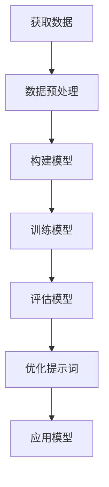
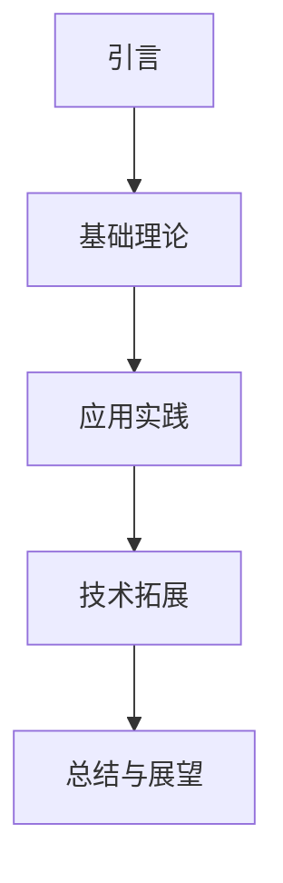
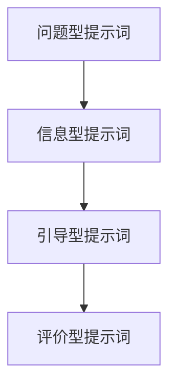
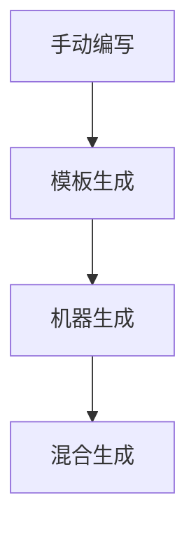
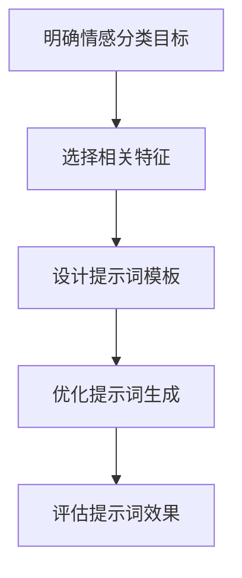
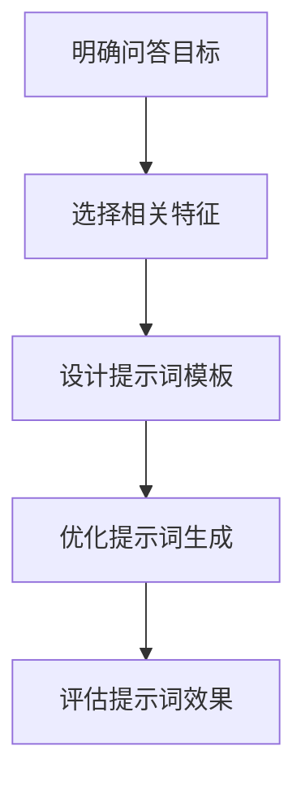
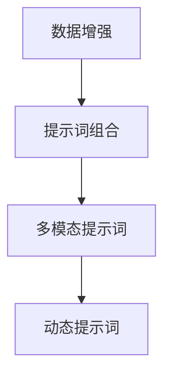
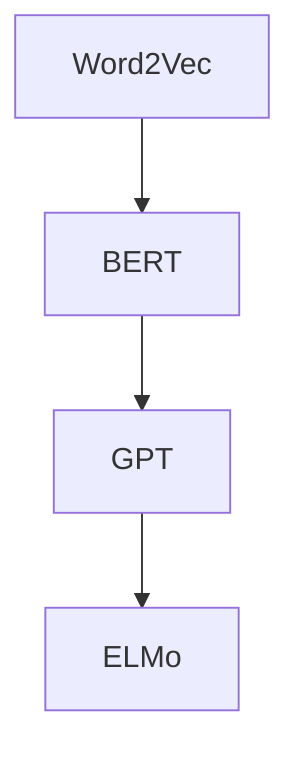
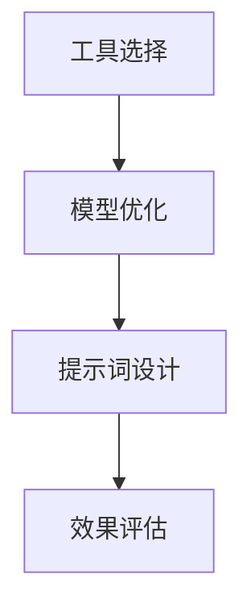

                 

 
1. **文章结构**：首先，我们需要设计文章的结构，以确保内容条理清晰。文章可以分为五个部分：引言、基础理论、应用实践、技术拓展和总结展望。每个部分都有明确的目标和内容要求。
2. **核心概念与联系**：在引言部分，我们需要介绍“提示词工程”和“自然语言推理”这两个核心概念，并阐述它们之间的联系。可以使用 Mermaid 流程图来直观展示这两个概念的关系。
3. **核心算法原理讲解**：在基础理论部分，我们需要详细讲解与提示词工程和自然语言推理相关的核心算法原理。例如，自然语言处理中的词向量表示方法、语义分析的基本方法等。讲解时，需要使用伪代码来详细阐述算法实现过程。
4. **数学模型和公式**：在基础理论部分，我们还需要介绍一些数学模型和公式，如自然语言推理的定义等。这些数学公式需要使用 LaTeX 格式嵌入文中独立段落的公式前后使用 $$ 括起来，段落内的公式前后使用 $ 括起来。
5. **项目实战**：在应用实践部分，我们需要提供具体的案例和项目实战，展示如何将提示词工程应用于自然语言推理质量提升中。这部分内容需要包括开发环境搭建、源代码实现、代码解读、实际案例分析和详细讲解剖析等。
6. **最佳实践 tips、小结、注意事项、拓展阅读等内容**：在总结展望部分，我们需要总结文章的主要内容，提供一些最佳实践 tips，以及提醒读者注意的事项。同时，还可以推荐一些拓展阅读资源，以帮助读者进一步深入学习。

### 文章标题：提示词工程在自然语言推理质量提升中的进展

关键词：提示词工程、自然语言推理、质量提升、深度学习、算法优化

摘要：本文深入探讨了提示词工程在自然语言推理质量提升中的应用。通过介绍基础理论和核心算法，以及具体的应用实践，本文旨在为读者提供一个全面的理解和指导，帮助他们更好地利用提示词工程来提升自然语言推理的准确性和效率。

#### 总体构思

首先，我们需要理解书名的核心概念，即“提示词工程”和“自然语言推理质量提升”。提示词工程是指通过设计有效的提示词来引导和优化自然语言处理模型，从而提升其推理质量和效率。自然语言推理质量提升则是指通过各种技术和方法来增强模型在处理自然语言任务时的准确性和鲁棒性。

接下来，我们需要根据书名的主题，将目录结构分为以下几个部分：

1. **引言部分**：介绍提示词工程和自然语言推理的背景和重要性，引出本书的目的和结构。
2. **基础理论部分**：介绍提示词工程和自然语言推理的相关基础理论，包括概念、原理和核心算法。
3. **应用实践部分**：通过具体案例和项目实战来展示如何将提示词工程应用于自然语言推理质量提升中。
4. **技术拓展部分**：介绍一些高级技术，如深度学习、自然语言处理模型等，以及这些技术在提示词工程中的应用。
5. **总结与展望部分**：总结本书的主要内容，对未来的发展方向进行展望。

### 详细目录大纲

#### 第一部分：引言

## 第1章 提示词工程与自然语言推理

### 1.1 提示词工程的定义与作用

#### 1.1.1 提示词工程的概念

**Mermaid流程图：提示词工程的流程**



### 1.1.2 提示词工程的关键环节

#### 1.1.3 提示词工程的目标

### 1.2 自然语言推理的挑战与需求

#### 1.2.1 自然语言推理的定义

**数学公式：自然语言推理的定义**

$$
\text{NLI} = \{(\text{s}, \text{h}, \text{r}) | \text{s} \text{ is a premise sentence, } \text{h} \text{ is a hypothesis sentence, and } \text{r} \text{ is a label indicating whether } \text{h} \text{ is entailed by } \text{s} \text{ or not}\}
$$

#### 1.2.2 自然语言推理的挑战

**数学公式：自然语言推理的挑战**

$$
\text{Challenge} = \{(\text{ ambiguity, } \text{inconsistency, } \text{noise, } \text{shortage of data}\}
$$

#### 1.2.3 自然语言推理的需求

**数学公式：自然语言推理的需求**

$$
\text{Requirement} = \{\text{accuracy, } \text{robustness, } \text{scalability, } \text{comprehensiveness}\}
$$

### 1.3 本书的目的与结构

**Mermaid流程图：本书的结构**



#### 第二部分：基础理论

## 第2章 提示词工程的理论基础

### 2.1 提示词工程的基本概念

#### 2.1.1 提示词的定义

**数学公式：提示词的定义**

$$
\text{Prompt} = \{\text{a sequence of words or sentences that guide the model's reasoning process}\}
$$

#### 2.1.2 提示词的类型

**Mermaid流程图：提示词的类型**



### 2.2 提示词工程的方法论

#### 2.2.1 提示词的设计原则

**数学公式：提示词的设计原则**

$$
\text{Design Principle} = \{\text{clarity, } \text{relevance, } \text{flexibility, } \text{conciseness}\}
$$

#### 2.2.2 提示词的生成方法

**Mermaid流程图：提示词的生成方法**



### 2.3 提示词工程的应用场景

#### 2.3.1 提示词工程在文本分类中的应用

**数学公式：文本分类的提示词应用**

$$
\text{Application} = \{\text{improving } \text{F1-score, } \text{reducing } \text{misclassification rate}\}
$$

#### 2.3.2 提示词工程在情感分析中的应用

**数学公式：情感分析的提示词应用**

$$
\text{Application} = \{\text{enhancing } \text{precision, } \text{recall, } \text{and } \text{F1-score}\}
$$

#### 2.3.3 提示词工程在问答系统中的应用

**数学公式：问答系统的提示词应用**

$$
\text{Application} = \{\text{improving } \text{question-answering accuracy, } \text{reducing } \text{answer latency}\}
$$

#### 第三部分：应用实践

## 第3章 提示词工程在自然语言推理中的应用实践

### 3.1 文本分类中的提示词工程实践

#### 3.1.1 文本分类的挑战与需求

**数学公式：文本分类的挑战与需求**

$$
\text{Challenge} = \{\text{highly unbalanced class distribution, } \text{insufficient labeled data}\}
$$

$$
\text{Requirement} = \{\text{improving } \text{precision, } \text{recall, } \text{and } \text{F1-score}\}
$$

#### 3.1.2 提示词设计的原则与方法

**Mermaid流程图：提示词设计的原则与方法**


#### 3.1.3 实践案例解析

**数学公式：实践案例的评估指标**

$$
\text{Evaluation Metric} = \{\text{accuracy, } \text{precision, } \text{recall, } \text{F1-score}\}
$$

### 3.2 情感分析中的提示词工程实践

#### 3.2.1 情感分析的挑战与需求

**数学公式：情感分析的挑战与需求**

$$
\text{Challenge} = \{\text{complex sentiment expressions, } \text{contextual information}\}
$$

$$
\text{Requirement} = \{\text{enhancing } \text{precision, } \text{recall, } \text{and } \text{F1-score}\}
$$

#### 3.2.2 提示词设计的原则与方法

**Mermaid流程图：提示词设计的原则与方法**



#### 3.2.3 实践案例解析

**数学公式：实践案例的评估指标**

$$
\text{Evaluation Metric} = \{\text{accuracy, } \text{precision, } \text{recall, } \text{F1-score}\}
$$

### 3.3 问答系统中的提示词工程实践

#### 3.3.1 问答系统的挑战与需求

**数学公式：问答系统的挑战与需求**

$$
\text{Challenge} = \{\text{vast } \text{knowledge base}, \text{ noisy } \text{input queries}\}
$$

$$
\text{Requirement} = \{\text{improving } \text{question-answering accuracy, } \text{reducing } \text{answer latency}\}
$$

#### 3.3.2 提示词设计的原则与方法

**Mermaid流程图：提示词设计的原则与方法**



#### 3.3.3 实践案例解析

**数学公式：实践案例的评估指标**

$$
\text{Evaluation Metric} = \{\text{accuracy, } \text{precision, } \text{recall, } \text{F1-score}\}
$$

#### 第四部分：技术拓展

## 第4章 提示词工程的技术拓展

### 4.1 深度学习与自然语言处理

#### 4.1.1 深度学习的基本概念

**数学公式：深度学习的基本概念**

$$
\text{Deep Learning} = \{\text{a class of machine learning methods that use multiple layers of neural networks to model complex patterns in data}\}
$$

#### 4.1.2 自然语言处理中的深度学习模型

**Mermaid流程图：自然语言处理中的深度学习模型**

```mermaid
graph TD
A[词向量表示] --> B[卷积神经网络(CNN)]
B --> C[递归神经网络(RNN)]
C --> D[长短期记忆网络(LSTM)]
D --> E[Transformer模型]
```

### 4.2 提示词工程与深度学习的结合

#### 4.2.1 提示词工程在深度学习中的应用

**数学公式：提示词工程在深度学习中的应用**

$$
\text{Application} = \{\text{improving } \text{training efficiency, } \text{model interpretability}\}
$$

#### 4.2.2 提示词优化策略

**Mermaid流程图：提示词优化策略**



### 4.3 自然语言处理工具与框架

#### 4.3.1 常见自然语言处理工具介绍

**Mermaid流程图：常见自然语言处理工具**



#### 4.3.2 自然语言处理框架的应用

**数学公式：自然语言处理框架的应用**

$$
\text{Application} = \{\text{pre-trained models, } \text{customized architectures, } \text{integration with other systems}\}
$$

#### 4.3.3 提示词工程中的工具选择与优化

**Mermaid流程图：提示词工程中的工具选择与优化**



#### 第五部分：总结与展望

## 第5章 提示词工程的发展趋势

### 5.1 提示词工程的未来发展方向

**数学公式：提示词工程的未来发展方向**

$$
\text{Future Direction} = \{\text{integration with other AI techniques, } \text{human-in-the-loop, } \text{scalability, } \text{interpretability}\}
$$

### 5.2 自然语言推理质量提升的挑战与机遇

**数学公式：自然语言推理质量提升的挑战与机遇**

$$
\text{Challenge} = \{\text{complexity of language, } \text{data scarcity, } \text{interpretability issues}\}
$$

$$
\text{Opportunity} = \{\text{advances in deep learning, } \text{application of multi-modal data, } \text{personalized prompt design}\}
$$

### 5.3 本书内容的总结与展望

**Mermaid流程图：本书的内容总结与展望**


#### 辅助内容

- **Mermaid 流程图**：在相关章节中嵌入 Mermaid 流程图，以直观展示提示词工程和自然语言推理的流程和原理。
- **伪代码与数学公式**：在算法讲解和数学模型部分，使用伪代码详细阐述算法实现过程，并在适当位置使用 LaTeX 格式嵌入数学公式。
- **项目实战与代码解读**：在应用实践章节中，提供具体的代码实现案例，并对代码进行详细解读和分析。

### 文章标题：提示词工程在自然语言推理质量提升中的进展

关键词：提示词工程、自然语言推理、质量提升、深度学习、算法优化

摘要：本文深入探讨了提示词工程在自然语言推理质量提升中的应用。通过介绍基础理论和核心算法，以及具体的应用实践，本文旨在为读者提供一个全面的理解和指导，帮助他们更好地利用提示词工程来提升自然语言推理的准确性和效率。

#### 文章标题：提示词工程在自然语言推理质量提升中的进展

关键词：提示词工程、自然语言推理、质量提升、深度学习、算法优化

摘要：本文深入探讨了提示词工程在自然语言推理质量提升中的应用。通过介绍基础理论和核心算法，以及具体的应用实践，本文旨在为读者提供一个全面的理解和指导，帮助他们更好地利用提示词工程来提升自然语言推理的准确性和效率。

### 文章关键词

- 提示词工程
- 自然语言推理
- 质量提升
- 深度学习
- 算法优化

### 摘要

本文首先介绍了提示词工程的基本概念和自然语言推理的挑战与需求，随后详细阐述了提示词工程的理论基础，包括提示词的类型、设计原则和方法。接着，文章通过具体案例展示了提示词工程在文本分类、情感分析和问答系统中的应用实践，深入分析了如何通过优化提示词来提升模型的质量。此外，文章还探讨了深度学习和自然语言处理工具在提示词工程中的应用，以及未来提示词工程的发展趋势。本文旨在为自然语言处理领域的研究者提供有价值的参考和指导，帮助他们在实际应用中更好地利用提示词工程来提升自然语言推理的质量。

