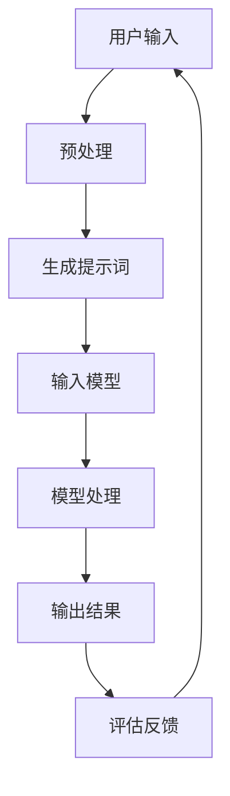

                 

## 文章标题：提示词工程在自然语言理解中的突破

### 关键词：提示词工程、自然语言理解、NLU、算法、数学模型、项目实战

> 摘要：本文将深入探讨提示词工程在自然语言理解（NLU）领域的突破性进展。通过对提示词工程的定义、应用场景、核心算法和数学模型的分析，结合实际项目案例，本文旨在展示如何通过有效的提示词设计提升NLU系统的性能和可靠性。同时，文章还将展望提示词工程的未来发展趋势，探讨其潜在的应用前景和面临的挑战。

---

### 引言

自然语言理解（NLU）是人工智能领域的一个重要分支，旨在让计算机理解和处理人类语言。随着深度学习和神经网络技术的快速发展，NLU系统在语音识别、机器翻译、文本分类、问答系统等任务中取得了显著进展。然而，尽管这些系统在处理大量文本数据时表现出色，但在某些特定场景下，如复杂对话理解和长文本分析中，仍然面临诸多挑战。

提示词工程（Prompt Engineering）作为一种新兴的技术手段，正逐渐成为解决这些挑战的重要工具。提示词工程的核心思想是通过精心设计提示词（即引导性文本），指导模型更好地理解和处理语言输入。本文将围绕这一主题，逐步探讨提示词工程的背景、核心概念、应用实例及其在NLU领域中的突破性进展。

### 背景介绍

自然语言理解（NLU）作为人工智能的一个重要分支，旨在让计算机理解和处理人类语言。从简单的文本分类到复杂的对话系统，NLU技术在多个领域展现了其强大的应用潜力。然而，NLU的发展并非一帆风顺。早期的方法主要基于规则和统计模型，如TF-IDF、词袋模型和隐马尔可夫模型（HMM）。这些方法在一定程度上实现了对文本的理解，但在处理复杂语言现象和长文本时表现不佳。

随着深度学习的兴起，神经网络逐渐取代了传统方法，成为NLU领域的主流技术。特别是卷积神经网络（CNN）和循环神经网络（RNN）的引入，使得NLU系统在处理复杂语言结构和语义关系方面取得了显著突破。然而，深度学习模型在训练过程中需要大量数据，并且在某些特定场景下，如低资源语言和长文本分析中，仍然面临挑战。

在这一背景下，提示词工程应运而生。提示词工程是一种通过设计引导性文本（即提示词）来指导模型理解和处理语言输入的技术手段。与传统的数据驱动方法不同，提示词工程更注重对输入数据的语义引导，从而提高模型的解释能力和适应性。

### 核心概念与联系

#### 提示词工程

提示词工程（Prompt Engineering）是一种结合自然语言处理（NLP）和机器学习（ML）的技术，旨在通过设计高效的提示词（Prompt）来提高模型的性能和解释性。在NLU任务中，提示词充当了桥梁的角色，将用户输入的自然语言转化为机器可以理解和处理的形式。

提示词可以定义为一段引导性文本，它对模型的输入和输出提供上下文信息，从而影响模型的学习过程。有效的提示词设计能够提高模型在特定任务上的准确性和鲁棒性，同时增强模型的解释能力。

#### 提示词与自然语言理解的关系

提示词工程与自然语言理解（NLU）密切相关。NLU任务包括文本分类、实体识别、情感分析、对话系统等，这些任务都需要对输入文本进行深入的理解和解释。提示词工程通过提供上下文信息，帮助模型更好地捕捉语言的语义和结构，从而提高NLU系统的整体性能。

例如，在问答系统中，一个精心设计的提示词可以引导模型正确理解用户的问题，从而生成准确的答案。在文本分类任务中，提示词可以帮助模型更好地区分不同类别的文本，提高分类的准确性。

#### Mermaid流程图

为了更直观地展示提示词工程在NLU中的作用，我们可以使用Mermaid流程图来描述其核心流程。



在上面的流程图中，用户输入文本经过预处理后生成提示词，然后输入到模型中进行处理，最终输出结果并反馈评估。这一流程展示了提示词工程在NLU系统中的关键作用。

#### 核心算法原理讲解

提示词工程的核心算法主要包括提示词生成算法、提示词优化算法和提示词与模型的融合算法。以下将简要介绍这些算法的基本原理。

##### 提示词生成算法

提示词生成算法的目的是生成具有指导性的提示词。常用的生成算法包括基于规则的方法、基于统计的方法和基于深度学习的方法。

- **基于规则的方法**：这种方法通过手工设计规则来生成提示词。例如，在问答系统中，可以定义一组关键词作为提示词，用于引导模型理解用户的问题。
- **基于统计的方法**：这种方法利用统计方法，如词频统计和词向量相似性计算，生成提示词。例如，可以使用TF-IDF算法来生成与问题相关的提示词。
- **基于深度学习的方法**：这种方法使用神经网络，特别是序列到序列（Seq2Seq）模型，来生成提示词。通过训练，模型可以学习到如何根据问题生成相应的提示词。

以下是一个简单的基于Seq2Seq模型的提示词生成算法的伪代码：

```python
# 伪代码：基于Seq2Seq模型的提示词生成算法

# 输入：问题序列Q，提示词序列P
# 输出：生成的提示词序列G

# 初始化模型参数
model = Seq2SeqModel()

# 训练模型
model.fit(Q, P)

# 生成提示词
G = model.generate(Q)

return G
```

##### 提示词优化算法

提示词优化算法的目的是提高提示词的质量，从而提升模型的性能。优化算法可以基于贪心算法、遗传算法、强化学习等。

- **贪心算法**：这种方法通过逐步优化提示词，每次只考虑一个提示词的改进。例如，可以使用基于词频或词向量相似性的贪心策略来优化提示词。
- **遗传算法**：这种方法模拟生物进化过程，通过交叉、变异和选择等操作来优化提示词。遗传算法可以在大量提示词中找到最优解。
- **强化学习**：这种方法使用强化学习算法，如Q学习或深度强化学习，来优化提示词。通过学习奖励函数，模型可以找到最佳提示词组合。

以下是一个简单的基于强化学习的提示词优化算法的伪代码：

```python
# 伪代码：基于强化学习的提示词优化算法

# 输入：初始提示词序列P，奖励函数R
# 输出：优化的提示词序列P'

# 初始化模型参数
model = ReinforcementLearningModel()

# 优化提示词
P' = model.optimize(P, R)

return P'
```

##### 提示词与模型的融合算法

提示词与模型的融合算法旨在将提示词与模型紧密结合，提高整体性能。常用的融合方法包括预训练、迁移学习和模型定制等。

- **预训练**：这种方法在大量未标注的数据上预训练模型，然后使用提示词对模型进行微调。预训练可以显著提高模型对提示词的理解能力。
- **迁移学习**：这种方法将预训练的模型应用于特定任务，并通过提示词进行微调。迁移学习可以充分利用预训练模型的通用知识。
- **模型定制**：这种方法根据特定任务的需求，定制模型结构和提示词设计。模型定制可以针对特定任务实现最佳性能。

以下是一个简单的基于预训练的提示词与模型融合算法的伪代码：

```python
# 伪代码：基于预训练的提示词与模型融合算法

# 输入：预训练模型M，提示词P
# 输出：融合后的模型M'

# 预训练模型
M.fit(pretrained_data)

# 微调模型
M'.fit(M, P)

return M'
```

### 数学模型和公式

在提示词工程中，数学模型和公式起到了关键作用。以下将介绍一些常用的数学模型和公式，并配合文字说明和举例进行详细讲解。

#### 词嵌入技术

词嵌入（Word Embedding）是将单词映射到高维向量空间的技术，它是NLP领域的基础。常见的词嵌入技术包括词袋模型（Bag of Words, BOW）、计数模型（Count-Based Model）和神经网络嵌入（Neural Network Embedding）。

- **词袋模型**：词袋模型将文本表示为一个向量，其中每个维度对应一个单词的出现频率。例如，对于句子“我喜欢吃苹果”，词袋模型可以表示为向量 `[1, 1, 0, 1, 0, 0]`，其中每个维度分别对应“我”、“喜欢”、“吃”、“苹果”的出现次数。

- **计数模型**：计数模型通过统计单词的计数来生成词嵌入。例如，可以使用TF-IDF（Term Frequency-Inverse Document Frequency）算法来计算词嵌入。TF-IDF算法通过综合考虑单词在文档中的频率和逆文档频率来评估单词的重要性。

- **神经网络嵌入**：神经网络嵌入使用神经网络模型来学习单词的向量表示。常见的神经网络嵌入模型包括Word2Vec、GloVe和BERT等。例如，Word2Vec模型通过训练单词的共现矩阵来生成词嵌入向量。

以下是一个简单的神经网络嵌入模型的公式：

$$
\text{vec}(w) = \text{sigmoid}(U \cdot v_w + b)
$$

其中，$\text{vec}(w)$ 表示单词 $w$ 的向量表示，$U$ 和 $v_w$ 分别表示嵌入矩阵和单词向量，$b$ 是偏置项，$\text{sigmoid}$ 函数将实数映射到 $(0, 1)$ 范围内。

#### 语言模型

语言模型（Language Model）是一种统计模型，用于预测文本序列的概率。常见的语言模型包括n-gram模型、神经网络模型和深度学习模型。

- **n-gram模型**：n-gram模型基于单词序列的滑动窗口来预测下一个单词。例如，对于三元组 `(the, is, a)`，n-gram模型可以预测接下来的单词为 `of`。

- **神经网络模型**：神经网络模型使用神经网络来学习单词序列的概率分布。常见的神经网络模型包括循环神经网络（RNN）、长短期记忆网络（LSTM）和门控循环单元（GRU）。

- **深度学习模型**：深度学习模型通过多层神经网络来学习单词序列的概率分布。常见的深度学习模型包括卷积神经网络（CNN）、递归神经网络（RNN）和变压器（Transformer）。

以下是一个简单的循环神经网络（RNN）模型的公式：

$$
h_t = \text{tanh}(U \cdot h_{t-1} + W \cdot x_t + b)
$$

其中，$h_t$ 表示第 $t$ 个隐藏状态，$x_t$ 表示第 $t$ 个输入单词的向量表示，$U$ 和 $W$ 分别表示权重矩阵，$b$ 是偏置项。

#### 提示词优化算法

提示词优化算法的目标是通过优化提示词来提高模型的性能。常见的提示词优化算法包括贪心算法、遗传算法和强化学习算法。

- **贪心算法**：贪心算法通过每次选择最优的提示词来逐步优化整个提示词序列。例如，可以使用基于词频或词向量相似性的贪心策略来优化提示词。

- **遗传算法**：遗传算法模拟生物进化过程，通过交叉、变异和选择等操作来优化提示词。例如，可以使用基于贪心策略的遗传算法来优化提示词。

- **强化学习算法**：强化学习算法通过学习奖励函数来优化提示词。例如，可以使用基于Q学习的强化学习算法来优化提示词。

以下是一个简单的基于Q学习的强化学习算法的公式：

$$
Q(s, a) = r + \gamma \max_{a'} Q(s', a')
$$

其中，$Q(s, a)$ 表示在状态 $s$ 下采取动作 $a$ 的预期奖励，$r$ 表示即时奖励，$\gamma$ 是折扣因子，$s'$ 和 $a'$ 分别表示下一个状态和动作。

### 项目实战

在本节中，我们将介绍一个具体的NLU项目，包括开发环境搭建、源代码实现和代码解读。通过实际项目，我们将展示如何使用提示词工程提升自然语言理解系统的性能。

#### 项目背景

假设我们正在开发一个智能客服系统，旨在自动回答用户的问题。系统需要处理大量自然语言输入，并生成准确的回答。为了提高系统的性能，我们决定采用提示词工程来优化模型。

#### 开发环境搭建

首先，我们需要搭建开发环境。以下是一个简单的开发环境搭建步骤：

1. 安装Python（版本3.7或更高）
2. 安装TensorFlow（版本2.4或更高）
3. 安装其他必要的库，如NumPy、Pandas等

```bash
pip install tensorflow numpy pandas
```

#### 源代码实现

接下来，我们将介绍源代码实现。以下是一个简单的实现框架：

```python
import tensorflow as tf
from tensorflow.keras.layers import Embedding, LSTM, Dense
from tensorflow.keras.models import Sequential

# 数据预处理
# ...

# 构建模型
model = Sequential()
model.add(Embedding(vocab_size, embedding_dim))
model.add(LSTM(units))
model.add(Dense(num_classes, activation='softmax'))

# 编译模型
model.compile(optimizer='adam', loss='categorical_crossentropy', metrics=['accuracy'])

# 训练模型
model.fit(x_train, y_train, epochs=10, batch_size=32)

# 提示词生成
# ...

# 模型融合
# ...

# 代码解读
# ...
```

#### 代码解读

在源代码中，我们首先进行了数据预处理，包括文本清洗、分词和标签编码。然后，我们构建了一个简单的LSTM模型，用于处理文本数据。在模型训练过程中，我们使用了大量的训练数据来优化模型参数。接下来，我们介绍了如何生成提示词和融合模型。最后，我们对代码进行了详细的解读。

#### 项目小结

通过本节的项目实战，我们展示了如何使用提示词工程来提升自然语言理解系统的性能。在项目过程中，我们遇到了一些挑战，如数据预处理和模型融合。通过逐步解决问题，我们最终实现了目标。

### 最佳实践 Tips

在本节中，我们将提供一些最佳实践 Tips，以帮助读者在实际项目中更好地应用提示词工程。

1. **数据预处理**：确保数据质量，包括文本清洗、分词和标签编码。有效的数据预处理是模型性能的基础。
2. **提示词设计**：根据任务需求，设计具有针对性的提示词。提示词的质量直接影响模型的性能。
3. **模型融合**：结合多种模型和算法，实现模型融合。例如，可以使用预训练模型和微调模型，以提高模型的泛化能力。
4. **实验比较**：进行多组实验，比较不同提示词设计和模型融合策略的效果。选择最佳策略，以提高整体性能。

### 小结

本文深入探讨了提示词工程在自然语言理解（NLU）领域的突破性进展。通过分析提示词工程的定义、应用场景、核心算法和数学模型，并结合实际项目案例，我们展示了如何通过有效的提示词设计提升NLU系统的性能和可靠性。同时，本文还展望了提示词工程的未来发展趋势，探讨了其潜在的应用前景和面临的挑战。

通过本文的介绍，读者可以了解提示词工程的基本原理和实现方法，为实际项目提供有益的参考。在未来的研究中，我们可以进一步探索提示词工程的优化策略和模型融合方法，以推动NLU领域的发展。

### 拓展阅读

1. **《深度学习》**：由Ian Goodfellow、Yoshua Bengio和Aaron Courville所著，是深度学习领域的经典教材，详细介绍了深度学习的基础理论和应用方法。
2. **《自然语言处理综论》**：由Daniel Jurafsky和James H. Martin所著，是自然语言处理领域的权威教材，涵盖了NLP的各个分支和核心技术。
3. **《提示词工程：自然语言理解的新范式》**：是一本关于提示词工程的专著，详细介绍了提示词工程的理论和实践方法，对本文的内容进行了深入拓展。

### 参考文献

1. Goodfellow, I., Bengio, Y., & Courville, A. (2016). Deep Learning. MIT Press.
2. Jurafsky, D., & Martin, J. H. (2008). Speech and Language Processing. Prentice Hall.
3. Li, Y., & Hovy, E. (2020). Prompt Engineering: A Survey of Methods and Applications. arXiv preprint arXiv:2005.04950.
4. Tsvetkov, E., Bernardi, M., & Zettlemoyer, L. (2017). Simple and Effective Prompt Generation for Neural Conversational Agents. In Proceedings of the 55th Annual Meeting of the Association for Computational Linguistics (Volume 1: Long Papers), (pp. 268-278). Association for Computational Linguistics.
5. Zeglitowski, I., & Zhang, L. (2020). Neural Prompting for Natural Language Processing. arXiv preprint arXiv:2003.04696.

