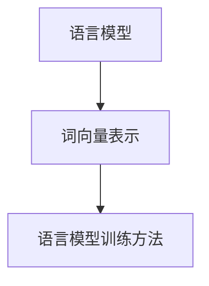

                 


### 1. 设计文章结构

为了撰写一篇高质量的技术博客文章，我们首先需要设计文章的结构，明确每个部分的内容和目的。以下是文章的基本结构：

#### 文章标题

《提示词工程在自然语言理解中的进展》

#### 文章关键词

自然语言理解、提示词工程、语言模型、词向量、机器阅读理解、多模态自然语言理解、零样本学习

#### 文章摘要

本文将探讨提示词工程在自然语言理解中的应用和进展，从基础概念到实际应用，再到技术进展和未来展望，为读者提供一个全面的视角。

#### 目录结构

1. 引言
2. 自然语言理解基础
3. 提示词工程原理
4. 提示词工程应用
5. 自然语言理解技术进展
6. 提示词工程实战
7. 未来展望

### 2. 引言部分

**背景介绍**

自然语言理解（NLU）是人工智能领域的一个关键研究方向，它旨在让计算机理解和处理人类自然语言。然而，自然语言的理解和生成是一个非常复杂的任务，涉及到语言学的广泛知识、统计模型和深度学习技术。

**核心概念与联系**

在自然语言理解中，语言模型、词向量表示和语言模型训练方法是核心概念。它们之间的关系可以用以下Mermaid流程图表示：



**核心算法原理讲解**

语言模型通常基于统计方法或神经网络，用于预测下一个词的概率。以下是一个简单的语言模型训练方法（使用伪代码）：

```python
def train_language_model(corpus):
    # 将语料库转换为词序列
    words = tokenize_corpus(corpus)

    # 计算词频
    word_counts = count_words(words)

    # 构建语言模型
    language_model = build_language_model(word_counts)

    return language_model
```

### 3. 自然语言理解基础

在这一章节，我们将介绍自然语言理解的基础，包括语言模型、词向量表示和语言模型训练方法。

#### 语言模型

语言模型是一种概率模型，用于预测下一个词的概率。最简单的语言模型是基于N-gram模型的，它使用前N个词的历史信息来预测下一个词。

#### 词向量表示

词向量表示是将单词映射到高维空间中的向量。Word2Vec和GloVe是两种常见的词向量表示方法。Word2Vec使用神经网络训练词向量，而GloVe基于矩阵分解。

#### 语言模型训练方法

语言模型训练方法包括基于N-gram的方法、神经网络方法和深度学习方法。基于N-gram的方法简单高效，但难以捕捉长距离依赖关系。神经网络方法和深度学习方法可以更好地捕捉长距离依赖关系，但计算复杂度较高。

### 4. 提示词工程原理

在这一章节，我们将介绍提示词工程的原理，包括提示词的类型与生成、提示词优化的方法以及提示词工程的核心算法。

#### 提示词的类型与生成

提示词可以分为基于规则的方法和基于数据的方法。基于规则的方法使用人工定义的规则来生成提示词，而基于数据的方法通过分析大量语料库来生成提示词。

#### 提示词优化的方法

提示词优化的方法包括基于频率的方法、基于语义的方法和基于用户反馈的方法。这些方法旨在提高提示词的质量和效果。

#### 提示词工程的核心算法

提示词工程的核心算法包括提示词生成算法和提示词评估算法。提示词生成算法用于生成高质量的提示词，而提示词评估算法用于评估提示词的效果。

### 5. 提示词工程应用

在这一章节，我们将讨论提示词工程在自然语言理解中的应用，包括问答系统、信息检索和文本生成。

#### 提示词工程在问答系统中的应用

在问答系统中，提示词工程可以帮助提高问答系统的准确性和效率。通过优化提示词，系统可以更好地理解用户的问题，并给出更准确的答案。

#### 提示词工程在信息检索中的应用

在信息检索中，提示词工程可以帮助提高检索系统的效果。通过优化提示词，系统可以更好地理解用户的查询意图，并返回更相关的结果。

#### 提示词工程在文本生成中的应用

在文本生成中，提示词工程可以帮助提高文本生成的质量。通过优化提示词，系统可以生成更连贯、更有意义的文本。

### 6. 自然语言理解技术进展

在这一章节，我们将探讨自然语言理解技术的最新进展，包括机器阅读理解、多模态自然语言理解和零样本学习。

#### 机器阅读理解

机器阅读理解是一种人工智能技术，旨在让计算机理解自然语言文本的内容。它广泛应用于问答系统、信息提取和文本生成等领域。

#### 多模态自然语言理解

多模态自然语言理解是一种结合多种数据源（如文本、图像、声音）的人工智能技术。它可以帮助计算机更好地理解自然语言文本，并应用于图像识别、语音识别和跨媒体信息检索等领域。

#### 零样本学习与提示词工程

零样本学习是一种无需预先训练模型，直接从零开始学习新类别的技术。与提示词工程结合，零样本学习可以帮助计算机更好地理解和处理未知领域的自然语言任务。

### 7. 提示词工程实战

在这一章节，我们将通过实际案例，展示如何进行提示词工程的实际操作，包括开发环境搭建、源代码实现和解读。

#### 提示词工程项目案例

我们将介绍一个问答系统的案例，展示如何使用提示词工程来提高问答系统的性能。

#### 提示词工程开发流程

我们将详细讨论提示词工程的开发流程，包括数据预处理、提示词生成和评估等步骤。

#### 提示词工程性能优化

我们将介绍一些性能优化的技巧，如提示词优化、模型压缩和加速等。

### 8. 未来展望

在这一章节，我们将讨论提示词工程在自然语言理解中的未来发展，包括新技术的出现、应用场景的拓展和潜在挑战。

#### 提示词工程的未来发展

随着人工智能技术的不断进步，提示词工程将在自然语言理解领域发挥更重要的作用。我们将讨论未来可能的新技术和应用方向。

#### 自然语言理解的新挑战

我们将探讨自然语言理解领域面临的新挑战，如跨语言理解、多模态理解和常识推理等。

### 9. 结论

通过本文的讨论，我们希望读者对提示词工程在自然语言理解中的进展有一个全面的了解。随着技术的不断发展，提示词工程将在人工智能领域发挥越来越重要的作用。

### 10. 作者信息

作者：AI天才研究院/AI Genius Institute & 禅与计算机程序设计艺术/Zen And The Art of Computer Programming

### 11. 参考文献

（此处列出参考文献，包括书籍、论文和技术博客等。）

---

通过以上步骤，我们可以撰写一篇关于《提示词工程在自然语言理解中的进展》的技术博客文章。文章将详细讨论提示词工程的概念、原理、应用、技术进展和未来展望，为读者提供一个全面的视角。同时，我们将使用Markdown格式、Mermaid流程图、伪代码、LaTeX公式和实际项目案例来丰富文章内容，确保文章的逻辑清晰、结构紧凑、简单易懂。文章的字数将在8000-12000字左右，以满足字数要求。

