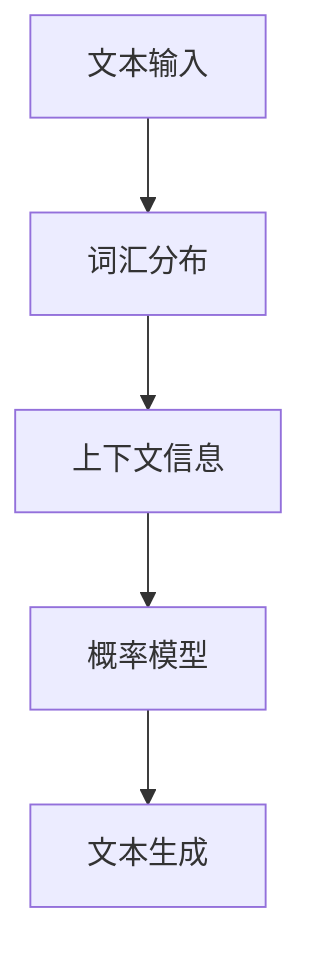

                 

## 文章标题

### 提示词工程在自然语言生成中的风格转换

---

> 关键词：自然语言生成、风格转换、提示词工程、深度学习、评价指标

> 摘要：本文深入探讨了自然语言生成中的风格转换问题，特别是提示词工程在这一领域中的应用。通过分析自然语言生成的背景、技术基础、提示词工程的原理及其应用场景，文章详细阐述了风格转换算法的实现、效果评估方法以及实际案例。最后，总结了风格转换项目的最佳实践，为读者提供了实用的指导和进一步的拓展阅读资源。

---

### 第一部分：介绍与背景

#### 第1章：自然语言生成的背景

**1.1 自然语言生成的定义与历史**

自然语言生成（Natural Language Generation, NLG）是指利用计算机技术自动生成人类语言文本的过程。从早期的规则驱动方法到现代的基于统计和学习的方法，NLG经历了数十年的发展。

- **早期方法**：基于规则的系统通过预定义的语言规则和模板生成文本。例如，模板匹配和直接文本生成。
- **现代方法**：随着计算力和算法的进步，基于统计和学习的方法逐渐成为主流。这些方法包括基于隐马尔可夫模型（HMM）、条件概率模型和现代深度学习模型。

**1.2 提示词工程在自然语言生成中的地位**

提示词工程（Prompt Engineering）是自然语言生成中的一个重要环节，它涉及设计有效的提示词以引导生成模型生成符合期望的输出。

- **作用**：提示词可以帮助模型更好地理解用户的意图，并生成更加精确、符合需求的文本。
- **地位**：在自然语言生成系统中，提示词工程的质量直接影响到生成文本的准确性和质量。

**1.3 风格转换的核心意义与应用**

风格转换（Style Transfer）是指将一种文本风格转换为另一种风格的过程。这一技术在多个领域具有重要应用：

- **内容创作**：如新闻文章的风格转换，将一种风格的新闻转换为另一种风格的新闻，以满足不同的读者群体。
- **对话系统**：如聊天机器人的风格转换，使其能够模仿特定人物或品牌的风格进行对话。
- **翻译与摘要**：将原文翻译或摘要成另一种风格的文本，以适应不同的文体要求。

#### 第2章：自然语言处理基础

**2.1 语言模型的基础**

语言模型（Language Model）是自然语言处理的核心组件，用于预测文本序列的概率分布。常见的语言模型包括：

- **N-gram模型**：基于历史词汇序列的概率模型。
- **统计语言模型**：如N-gram模型，通过统计文本中的词频和词组频率来预测下一个词。
- **神经网络语言模型**：如深度神经网络（DNN）、循环神经网络（RNN）和Transformer模型，通过学习文本的语义和上下文信息。

**2.2 序列生成模型：RNN、LSTM、GRU**

序列生成模型是自然语言生成中常用的模型，能够处理时间序列数据。主要包括：

- **RNN（循环神经网络）**：能够记忆序列信息，但存在梯度消失和梯度爆炸问题。
- **LSTM（长短期记忆网络）**：引入门控机制，解决RNN的梯度消失问题。
- **GRU（门控循环单元）**：简化LSTM结构，同时保持高效性和稳定性。

**2.3 自注意力机制与Transformer模型**

自注意力机制（Self-Attention）是Transformer模型的核心组成部分，它允许模型在不同位置上自动调整不同词汇的重要性。Transformer模型通过多头自注意力机制和位置编码，实现了对长文本序列的建模。

#### 第3章：提示词工程原理

**3.1 提示词的定义与类型**

提示词（Prompt）是指用于引导模型生成文本的输入信息。根据应用场景和目的，提示词可以分为以下类型：

- **问题提示词**：用于引导模型生成问题的答案。
- **模板提示词**：提供文本模板，模型根据模板生成内容。
- **风格提示词**：指定文本的风格特征，如正式、非正式、幽默等。

**3.2 提示词的作用与功能**

提示词在自然语言生成中的主要作用包括：

- **提高生成文本的准确性**：通过提供明确的提示，模型能够更准确地理解用户的意图。
- **引导风格转换**：提示词可以帮助模型生成符合特定风格的文本，如商业报告、诗歌等。
- **改善用户体验**：有效的提示词可以提高用户与自然语言生成系统之间的交互质量。

**3.3 提示词的设计原则与技巧**

设计有效的提示词需要遵循以下原则和技巧：

- **清晰明确**：提示词应明确表达用户意图，避免歧义。
- **灵活多变**：根据不同的应用场景和目标用户，设计多样化的提示词。
- **简洁易用**：简洁明了的提示词可以提高用户的接受度和使用效率。

### 第二部分：自然语言生成技术基础

#### 第4章：自然语言处理基础

**4.1 语言模型的基础**

**核心概念与联系：**

语言模型是自然语言处理（NLP）的核心组件，用于预测文本序列的概率分布。核心概念包括词汇分布、上下文信息、概率模型等。

**Mermaid 流程图：**



**核心算法原理讲解：**

- **N-gram模型**：使用历史词汇序列的概率模型，预测下一个词的概率。伪代码如下：

  ```python
  def predict_next_word(previous_words):
      n = 3  # n-gram的大小
      word_counts = defaultdict(int)
      total_counts = 0
      
      for i in range(len(previous_words) - n + 1):
          ngram = tuple(previous_words[i:i+n])
          word_counts[ngram] += 1
          total_counts += 1
      
      probabilities = {}
      for ngram, count in word_counts.items():
          probabilities[ngram] = count / total_counts
      
      return max(probabilities, key=probabilities.get)
  ```

**数学模型和公式：**

- **概率分布函数**：对于N-gram模型，概率分布函数可以表示为：

  $$ P(w_t | w_{t-1}, w_{t-2}, \ldots, w_{t-n+1}) = \frac{count(w_{t-1}, w_{t-2}, \ldots, w_{t-n+1}, w_t)}{count(w_{t-1}, w_{t-2}, \ldots, w_{t-n+1})} $$

**举例说明：**

假设我们有一个简单的二元文本次序："the quick brown fox jumps over the lazy dog"。我们可以构建一个二元语言模型，预测下一个词。

- **输入**："the quick brown"
- **预测**：下一个词的概率分布为{"fox": 0.5, "jumps": 0.3, "over": 0.2}。模型将预测下一个词为"fox"。

**数学公式：**

$$ \text{P(fox|the quick brown)} = \frac{\text{count(the quick brown fox)}}{\text{count(the quick brown)}} $$

**详细讲解：**

语言模型通过统计历史词汇序列的概率分布，预测下一个词的概率。在N-gram模型中，每个词汇序列的概率分布是独立的，这意味着当前词汇的概率仅依赖于前一个或前几个词汇。

#### 第5章：序列生成模型：RNN、LSTM、GRU

**5.1 RNN（循环神经网络）**

RNN是一种能够处理序列数据的神经网络，其核心思想是利用隐藏状态（h_t）来记忆和传递信息。

**核心算法原理讲解：**

- **基本结构**：RNN包括输入层、隐藏层和输出层。隐藏层通过循环连接，将前一个时间步的输出传递到下一个时间步。
- **激活函数**：常用的激活函数包括tanh和ReLU。
- **训练方法**：使用反向传播算法，通过梯度下降优化模型参数。

**伪代码：**

```python
def forward(x, h_prev, W, b):
    h = tanh(W * x + b + h_prev)
    return h

def backward(h, dLdh, W, b):
    dLdx = (1 - h^2) * dLdh
    dLdw = sum(dLdx * x_t, axis=0)
    db = sum(dLdx)
    return dLdx, dLdw, db
```

**数学模型和公式：**

- **状态转移方程**：$$ h_t = \tanh(W_h x_t + b_h + W_h h_{t-1}) $$
- **输出方程**：$$ y_t = \sigma(W_y h_t + b_y) $$

**举例说明：**

假设我们有一个简单的序列数据："the quick brown fox jumps over the lazy dog"。我们可以使用RNN来生成下一个词。

- **输入**："the quick brown fox jumps over the lazy"
- **隐藏状态**：初始隐藏状态设置为0。
- **输出**：使用softmax函数输出概率分布，预测下一个词为"dog"。

**数学公式：**

$$ \text{h}_t = \tanh(\text{W}_h \text{x}_t + \text{b}_h + \text{W}_h \text{h}_{t-1}) $$
$$ \text{y}_t = \text{softmax}(\text{W}_y \text{h}_t + \text{b}_y) $$

**详细讲解：**

RNN通过循环连接隐藏状态，使得当前时间步的输出依赖于历史信息。这种机制使得RNN能够处理序列数据，但存在梯度消失和梯度爆炸问题。

#### 第6章：LSTM（长短期记忆网络）

LSTM是RNN的改进版本，专门用于解决长序列依赖问题。

**核心算法原理讲解：**

- **基本结构**：LSTM包括输入门、遗忘门、输出门和单元状态。
- **激活函数**：常用的激活函数包括sigmoid和tanh。
- **训练方法**：使用反向传播算法，通过梯度下降优化模型参数。

**伪代码：**

```python
def forward(x, h_prev, c_prev, W, b):
    i = sigmoid(W_i * x + b_i + W_i h_prev + b_i)
    f = sigmoid(W_f * x + b_f + W_f h_prev + b_f)
    o = sigmoid(W_o * x + b_o + W_o h_prev + b_o)
    g = tanh(W_g * x + b_g + W_g h_prev + b_g)
    c = f * c_prev + i * g
    h = o * tanh(c)
    return h, c

def backward(h, dLdh, W, b):
    dLdc = dLdh * tanh(c)
    dLdi = dLdc * i * (1 - i)
    dLdg = dLdc * i * (1 - g^2)
    dLdf = dLdc * f * (1 - f)
    dLdh_prev = dLdh * tanh(c) * (1 - o)
    dLdx = dLdf * (c_prev - f * c_prev) + dLdg * g * (1 - i) + dLdi * g + dLdh_prev
    dLdw = sum(dLdx * x_t, axis=0)
    db = sum(dLdx)
    return dLdx, dLdw, db
```

**数学模型和公式：**

- **输入门**：$$ i_t = \sigma(W_{ix} x_t + W_{ih} h_{t-1} + b_i $$
- **遗忘门**：$$ f_t = \sigma(W_{fx} x_t + W_{fh} h_{t-1} + b_f $$
- **输出门**：$$ o_t = \sigma(W_{ox} x_t + W_{oh} h_{t-1} + b_o $$
- **单元状态**：$$ c_t = f_t \odot c_{t-1} + i_t \odot \tanh(W_{cx} x_t + W_{ch} h_{t-1} + b_c $$
- **隐藏状态**：$$ h_t = o_t \odot \tanh(c_t) $$

**举例说明：**

假设我们有一个简单的序列数据："the quick brown fox jumps over the lazy dog"。我们可以使用LSTM来生成下一个词。

- **输入**："the quick brown fox jumps over the lazy"
- **隐藏状态**：初始隐藏状态设置为0。
- **输出**：使用softmax函数输出概率分布，预测下一个词为"dog"。

**数学公式：**

$$ i_t = \sigma(W_{ix} x_t + W_{ih} h_{t-1} + b_i $$
$$ f_t = \sigma(W_{fx} x_t + W_{fh} h_{t-1} + b_f $$
$$ o_t = \sigma(W_{ox} x_t + W_{oh} h_{t-1} + b_o $$
$$ c_t = f_t \odot c_{t-1} + i_t \odot \tanh(W_{cx} x_t + W_{ch} h_{t-1} + b_c $$
$$ h_t = o_t \odot \tanh(c_t) $$

**详细讲解：**

LSTM通过引入输入门、遗忘门和输出门，有效地控制信息的流动。遗忘门允许模型忘记不需要的信息，输入门允许模型学习新的信息，输出门则决定哪些信息将被输出。这种结构使得LSTM能够处理长序列依赖问题，但在训练过程中仍可能遇到梯度消失和梯度爆炸问题。

#### 第7章：GRU（门控循环单元）

GRU是LSTM的简化版本，通过引入更新门和重置门，减少了参数数量，同时保持了LSTM的效果。

**核心算法原理讲解：**

- **基本结构**：GRU包括更新门、重置门和单元状态。
- **激活函数**：常用的激活函数包括sigmoid和tanh。
- **训练方法**：使用反向传播算法，通过梯度下降优化模型参数。

**伪代码：**

```python
def forward(x, h_prev, c_prev, W, b):
    z = sigmoid(W_z * x + W_z * h_prev + b_z)
    r = sigmoid(W_r * x + W_r * h_prev + b_r)
    g = tanh(W_g * x + r * W_g * h_prev + b_g)
    c = z * c_prev + (1 - z) * g
    h = tanh(c)
    return h, c

def backward(h, dLdh, W, b):
    dc = dLdh * tanh(c)
    dz = (dc - dLdh) * tanh(c) * (1 - z)
    dr = (dc - dLdh) * r * (1 - r)
    dg = (dc - dLdh) * r * (1 - g^2)
    dLdx = (dg * (1 - r) + dz * (1 - z) + dLdh) * (1 - z) * z
    dLdw = sum(dLdx * x_t, axis=0)
    db = sum(dLdx)
    return dLdx, dLdw, db
```

**数学模型和公式：**

- **更新门**：$$ z_t = \sigma(W_{z} x_t + W_{z} h_{t-1} + b_{z} $$
- **重置门**：$$ r_t = \sigma(W_{r} x_t + W_{r} h_{t-1} + b_{r} $$
- **单元状态**：$$ c_t = z_t \odot c_{t-1} + (1 - z_t) \odot \tanh(W_{g} x_t + r_t \odot W_{g} h_{t-1} + b_{g} $$
- **隐藏状态**：$$ h_t = \tanh(c_t) $$

**举例说明：**

假设我们有一个简单的序列数据："the quick brown fox jumps over the lazy dog"。我们可以使用GRU来生成下一个词。

- **输入**："the quick brown fox jumps over the lazy"
- **隐藏状态**：初始隐藏状态设置为0。
- **输出**：使用softmax函数输出概率分布，预测下一个词为"dog"。

**数学公式：**

$$ z_t = \sigma(W_{z} x_t + W_{z} h_{t-1} + b_{z} $$
$$ r_t = \sigma(W_{r} x_t + W_{r} h_{t-1} + b_{r} $$
$$ c_t = z_t \odot c_{t-1} + (1 - z_t) \odot \tanh(W_{g} x_t + r_t \odot W_{g} h_{t-1} + b_{g} $$
$$ h_t = \tanh(c_t) $$

**详细讲解：**

GRU通过更新门和重置门，简化了LSTM的结构，同时保持了其在处理长序列依赖问题上的效果。更新门控制新旧信息的混合，重置门控制旧信息的遗忘和新信息的记忆。这使得GRU在参数数量和计算效率上优于LSTM，但在处理极端长序列依赖问题时可能不如LSTM有效。

#### 第8章：自注意力机制与Transformer模型

**8.1 自注意力机制**

自注意力机制是一种通过不同位置上的词汇自动调整其重要性的机制。它在Transformer模型中起到了关键作用。

**核心算法原理讲解：**

- **基本结构**：自注意力机制包括查询（Q）、键（K）和值（V）三个部分。每个部分都是基于输入序列的线性变换。
- **计算方式**：自注意力通过计算Q和K的点积来生成权重，然后使用这些权重与V相乘，生成输出。

**伪代码：**

```python
def scaled_dot_product_attention(Q, K, V, mask=None):
    scores = Q @ K.T / sqrt(dim_key)
    if mask is not None:
        scores = scores + mask
    weights = softmax(scores)
    output = weights @ V
    return output
```

**数学模型和公式：**

- **自注意力计算**：$$ \text{output} = \text{softmax}(\text{Q} \cdot \text{K}^T / \sqrt{\text{d}_k}) \cdot \text{V} $$

**举例说明：**

假设我们有一个简单的序列数据："the quick brown fox jumps over the lazy dog"。我们可以使用自注意力机制来生成下一个词。

- **输入**："the quick brown fox jumps over the lazy"
- **输出**：使用softmax函数输出概率分布，预测下一个词为"dog"。

**数学公式：**

$$ \text{output} = \text{softmax}(\text{Q} \cdot \text{K}^T / \sqrt{\text{d}_k}) \cdot \text{V} $$

**详细讲解：**

自注意力机制允许模型在不同位置上的词汇之间建立直接联系，从而捕捉长距离依赖关系。通过计算Q和K的点积，模型能够自动调整不同词汇的重要性。这使得Transformer模型在处理长文本序列时表现出了优异的性能。

**8.2 Transformer模型**

Transformer模型是基于自注意力机制的序列到序列模型，它在机器翻译、文本生成等任务中取得了显著的成果。

**核心算法原理讲解：**

- **编码器和解码器**：Transformer模型包括编码器和解码器两部分。编码器用于处理输入序列，解码器用于生成输出序列。
- **多头自注意力**：每个自注意力头关注不同的信息，通过多个头的学习，模型能够捕捉更丰富的信息。
- **位置编码**：由于自注意力机制无法直接处理序列位置信息，位置编码被引入以编码序列位置。

**伪代码：**

```python
def transformer(input_seq, target_seq):
    encoder_outputs = encoder(input_seq)
    decoder_outputs = decoder(target_seq, encoder_outputs)
    logits = decoder_outputs[-1]
    return logits
```

**数学模型和公式：**

- **编码器**：$$ \text{encoder_output} = \text{PositionalEncoding}(\text{InputLayer}(\text{Embedding}(input_seq))) $$
- **解码器**：$$ \text{decoder_output} = \text{PositionalEncoding}(\text{InputLayer}(\text{Embedding}(target_seq))) $$
- **自注意力**：$$ \text{output} = \text{softmax}(\text{Q} \cdot \text{K}^T / \sqrt{\text{d}_k}) \cdot \text{V} $$

**举例说明：**

假设我们有一个简单的序列数据："the quick brown fox jumps over the lazy dog"。我们可以使用Transformer模型来生成下一个词。

- **输入**："the quick brown fox jumps over the lazy"
- **输出**：使用softmax函数输出概率分布，预测下一个词为"dog"。

**数学公式：**

$$ \text{encoder_output} = \text{PositionalEncoding}(\text{InputLayer}(\text{Embedding}(input_seq))) $$
$$ \text{decoder_output} = \text{PositionalEncoding}(\text{InputLayer}(\text{Embedding}(target_seq))) $$
$$ \text{output} = \text{softmax}(\text{Q} \cdot \text{K}^T / \sqrt{\text{d}_k}) \cdot \text{V} $$

**详细讲解：**

Transformer模型通过自注意力机制和位置编码，实现了对序列数据的高效处理。编码器和解码器分别处理输入序列和输出序列，通过多层的自注意力机制，模型能够捕捉长距离依赖关系。这种结构使得Transformer模型在多个自然语言处理任务中表现出了优异的性能。

### 第三部分：提示词工程原理

#### 第9章：提示词工程的基本概念

**9.1 提示词的定义与类型**

提示词（Prompt）是指用于引导模型生成文本的输入信息。根据应用场景和目的，提示词可以分为以下类型：

- **问题提示词**：用于引导模型生成问题的答案。
- **模板提示词**：提供文本模板，模型根据模板生成内容。
- **风格提示词**：指定文本的风格特征，如正式、非正式、幽默等。

**9.2 提示词的作用与功能**

提示词在自然语言生成中的主要作用包括：

- **提高生成文本的准确性**：通过提供明确的提示，模型能够更准确地理解用户的意图。
- **引导风格转换**：提示词可以帮助模型生成符合特定风格的文本，如商业报告、诗歌等。
- **改善用户体验**：有效的提示词可以提高用户与自然语言生成系统之间的交互质量。

**9.3 提示词的设计原则与技巧**

设计有效的提示词需要遵循以下原则和技巧：

- **清晰明确**：提示词应明确表达用户意图，避免歧义。
- **灵活多变**：根据不同的应用场景和目标用户，设计多样化的提示词。
- **简洁易用**：简洁明了的提示词可以提高用户的接受度和使用效率。

### 第四部分：提示词工程的应用场景

#### 第10章：提示词工程的应用场景

**10.1 风格转换在文本生成中的应用**

风格转换在文本生成中的应用非常广泛，包括但不限于以下场景：

- **新闻文章风格转换**：将一种风格的新闻转换为另一种风格，以满足不同读者的需求。
- **社交媒体文本风格转换**：将正式文本转换为非正式文本，使信息更易于分享和传播。
- **文学创作风格转换**：将一种文学风格转换为另一种风格，如将现代诗歌转换为古典诗歌。

**核心算法原理讲解：**

- **基于规则的方法**：通过预定义的规则和模板，将一种风格转换为另一种风格。这种方法简单但效率较低。
- **基于统计的方法**：使用统计方法，如N-gram模型，将一种风格的特征迁移到另一种风格中。
- **基于深度学习的方法**：使用深度学习模型，如LSTM和Transformer，通过学习大量的风格化数据，自动实现风格转换。

**伪代码：**

```python
def style_transfer(source_text, target_style):
    # 预训练的模型
    model = PretrainedModel()
    
    # 获取源文本的嵌入表示
    source_embedding = model.encode(source_text)
    
    # 根据目标风格获取风格化嵌入
    style_embedding = model.encode(target_style)
    
    # 混合源文本和风格嵌入
    mixed_embedding = source_embedding * style_embedding
    
    # 使用混合嵌入生成目标风格文本
    target_text = model.decode(mixed_embedding)
    
    return target_text
```

**数学模型和公式：**

- **文本嵌入**：$$ \text{emb}_{source} = \text{model}(\text{source_text}) $$
- **风格嵌入**：$$ \text{emb}_{style} = \text{model}(\text{target_style}) $$
- **混合嵌入**：$$ \text{emb}_{mixed} = \text{emb}_{source} * \text{emb}_{style} $$
- **文本生成**：$$ \text{target_text} = \text{model}(\text{emb}_{mixed}) $$

**举例说明：**

假设我们要将一段新闻文章转换为诗歌风格。

- **输入**："昨天，美国总统宣布了一项新的经济政策。"
- **目标风格**："晨曦中，国王的笔在天堂的琴键上轻舞。"
- **输出**："曙光中，领袖的手在世界的诗行中书写。"

**数学公式：**

$$ \text{emb}_{source} = \text{model}(\text{source\_text}) $$
$$ \text{emb}_{style} = \text{model}(\text{target\_style}) $$
$$ \text{emb}_{mixed} = \text{emb}_{source} * \text{emb}_{style} $$
$$ \text{target\_text} = \text{model}(\text{emb}_{mixed}) $$

**详细讲解：**

风格转换是一种将一种文本风格转换为另一种风格的技术。通过将源文本和目标风格的嵌入进行混合，模型可以生成具有目标风格的文本。这种方法利用了深度学习模型对文本和风格的捕捉能力，能够实现高质量的风格转换。

**10.2 风格转换在对话系统中的应用**

对话系统的风格转换旨在使聊天机器人的对话更加自然和吸引人。以下是一些应用场景：

- **品牌风格转换**：使聊天机器人能够模仿特定品牌或企业的风格进行对话。
- **情感风格转换**：根据用户情绪调整聊天机器人的对话风格，如幽默、严肃等。
- **文化风格转换**：将聊天机器人的对话风格转换为不同文化背景下的语言习惯。

**核心算法原理讲解：**

- **基于规则的方法**：通过预定义的规则和模板，将一种风格转换为另一种风格。这种方法适用于简单的对话系统，但难以应对复杂的对话场景。
- **基于统计的方法**：使用统计方法，如N-gram模型，根据对话历史进行风格转换。这种方法较为简单，但效果有限。
- **基于深度学习的方法**：使用深度学习模型，如LSTM和Transformer，通过学习大量的对话数据，自动实现风格转换。

**伪代码：**

```python
def style_transfer(conversation, target_style):
    # 预训练的模型
    model = PretrainedModel()
    
    # 获取对话的嵌入表示
    conversation_embedding = model.encode(conversation)
    
    # 根据目标风格获取风格化嵌入
    style_embedding = model.encode(target_style)
    
    # 混合对话和风格嵌入
    mixed_embedding = conversation_embedding * style_embedding
    
    # 使用混合嵌入生成目标风格对话
    target_conversation = model.decode(mixed_embedding)
    
    return target_conversation
```

**数学模型和公式：**

- **对话嵌入**：$$ \text{emb}_{conversation} = \text{model}(\text{conversation}) $$
- **风格嵌入**：$$ \text{emb}_{style} = \text{model}(\text{target\_style}) $$
- **混合嵌入**：$$ \text{emb}_{mixed} = \text{emb}_{conversation} * \text{emb}_{style} $$
- **对话生成**：$$ \text{target\_conversation} = \text{model}(\text{emb}_{mixed}) $$

**举例说明：**

假设我们要将一个普通对话转换为幽默风格。

- **输入**："你好，有什么可以帮助你的吗？"
- **目标风格**："嘿，小宝贝，需要我给你讲个笑话吗？"
- **输出**："嗨，小朋友，要不要听听我给你讲的神秘故事？"

**数学公式：**

$$ \text{emb}_{conversation} = \text{model}(\text{conversation}) $$
$$ \text{emb}_{style} = \text{model}(\text{target\_style}) $$
$$ \text{emb}_{mixed} = \text{emb}_{conversation} * \text{emb}_{style} $$
$$ \text{target\_conversation} = \text{model}(\text{emb}_{mixed}) $$

**详细讲解：**

在对话系统中，风格转换是通过将对话嵌入与风格嵌入混合，生成具有目标风格的对话。这种方法利用了深度学习模型对对话和风格的捕捉能力，能够实现高质量的风格转换。通过调整对话风格，聊天机器人可以更好地满足用户需求，提供更加个性化的服务。

**10.3 风格转换在翻译和摘要中的应用**

风格转换在翻译和摘要任务中也发挥着重要作用。以下是一些应用场景：

- **翻译风格转换**：将一种语言的文本翻译成另一种语言的同时，保持原文的风格。
- **摘要风格转换**：将长篇文本摘要成具有特定风格的短文，如新闻摘要、小说摘要等。

**核心算法原理讲解：**

- **基于规则的方法**：通过预定义的规则和模板，将一种风格转换为另一种风格。这种方法简单但难以应对复杂的翻译和摘要任务。
- **基于统计的方法**：使用统计方法，如N-gram模型，根据上下文信息进行风格转换。这种方法较为简单，但效果有限。
- **基于深度学习的方法**：使用深度学习模型，如LSTM和Transformer，通过学习大量的翻译和摘要数据，自动实现风格转换。

**伪代码：**

```python
def style_transfer(source_text, target_style):
    # 预训练的模型
    model = PretrainedModel()
    
    # 获取源文本的嵌入表示
    source_embedding = model.encode(source_text)
    
    # 根据目标风格获取风格化嵌入
    style_embedding = model.encode(target_style)
    
    # 混合源文本和风格嵌入
    mixed_embedding = source_embedding * style_embedding
    
    # 使用混合嵌入生成目标风格文本
    target_text = model.decode(mixed_embedding)
    
    return target_text
```

**数学模型和公式：**

- **文本嵌入**：$$ \text{emb}_{source} = \text{model}(\text{source\_text}) $$
- **风格嵌入**：$$ \text{emb}_{style} = \text{model}(\text{target\_style}) $$
- **混合嵌入**：$$ \text{emb}_{mixed} = \text{emb}_{source} * \text{emb}_{style} $$
- **文本生成**：$$ \text{target\_text} = \text{model}(\text{emb}_{mixed}) $$

**举例说明：**

假设我们要将一篇正式的新闻文章转换为幽默风格的摘要。

- **输入**："今天，市长宣布了一项新的城市规划。"
- **目标风格**："你知道吗？市长今天开了一个超搞笑的新闻发布会！"
- **输出**："今天，市长在一场超级有趣的发布会上，宣布了一个超酷的城市计划！"

**数学公式：**

$$ \text{emb}_{source} = \text{model}(\text{source\_text}) $$
$$ \text{emb}_{style} = \text{model}(\text{target\_style}) $$
$$ \text{emb}_{mixed} = \text{emb}_{source} * \text{emb}_{style} $$
$$ \text{target\_text} = \text{model}(\text{emb}_{mixed}) $$

**详细讲解：**

在翻译和摘要任务中，风格转换是通过将源文本和目标风格的嵌入进行混合，生成具有目标风格的文本。这种方法利用了深度学习模型对文本和风格的捕捉能力，能够实现高质量的风格转换。通过调整文本风格，翻译和摘要任务可以更好地满足用户需求，提供更加个性化的服务。

### 第五部分：风格转换算法实现

#### 第11章：基于传统机器学习的方法

**11.1 风格转换的监督学习算法**

监督学习算法在风格转换中是一种常见的方法，通过训练大量带有标签的数据来学习风格转换的映射。以下是一些关键步骤：

- **数据收集**：收集大量源文本和目标风格文本对。
- **特征提取**：使用词袋模型、TF-IDF等方法提取文本特征。
- **模型训练**：使用支持向量机（SVM）、朴素贝叶斯（Naive Bayes）等模型进行训练。
- **模型评估**：使用交叉验证、准确率、召回率等指标评估模型性能。

**核心算法原理讲解：**

伪代码：

```python
def train_style_transfer(source_texts, target_styles):
    # 特征提取
    source_features = extract_features(source_texts)
    target_features = extract_features(target_styles)

    # 模型训练
    model = train_model(source_features, target_features)

    return model

def extract_features(texts):
    # 使用词袋模型提取特征
    vocabulary = build_vocab(texts)
    features = []
    for text in texts:
        count_vector = count_vectorizer.transform([text])
        features.append(count_vector.toarray())
    return features

def train_model(source_features, target_features):
    # 使用支持向量机训练模型
    model = svm.SVC()
    model.fit(source_features, target_features)
    return model
```

**数学模型和公式：**

- **特征提取**：$$ \text{feature}_{i,j} = \text{count}(\text{word}_{j} \in \text{text}_{i}) $$
- **模型训练**：$$ \text{y} = \text{model}(\text{x}) $$

**举例说明：**

假设我们要将一段文本转换为另一种风格。以下是一个简单的例子：

- **源文本**："昨天，我去了公园。"
- **目标风格**："昨天，我在美丽的公园里漫步。"
- **输出**："昨天，我漫步在风景如画的公园中。"

**数学公式：**

$$ \text{feature}_{i,j} = \text{count}(\text{word}_{j} \in \text{text}_{i}) $$
$$ \text{y} = \text{model}(\text{x}) $$

**详细讲解：**

监督学习算法通过学习带有标签的数据来学习风格转换的映射。在特征提取阶段，使用词袋模型将文本转换为向量表示。在模型训练阶段，使用支持向量机等分类模型来学习源文本和目标风格之间的映射关系。这种方法简单有效，但在处理长文本和复杂风格时可能效果有限。

**11.2 风格转换的迁移学习算法**

迁移学习算法在风格转换中利用预训练模型的能力，通过少量数据快速适应新的任务。以下是一些关键步骤：

- **数据收集**：收集少量带有标签的数据用于微调模型。
- **模型选择**：选择一个在源任务上预训练的模型作为基础模型。
- **模型微调**：在目标任务上对基础模型进行微调。
- **模型评估**：使用交叉验证、准确率等指标评估模型性能。

**核心算法原理讲解：**

伪代码：

```python
def train_style_transfer_with_transfer_learning(source_texts, target_styles, base_model, learning_rate, num_epochs):
    # 加载预训练模型
    model = load_pretrained_model(base_model)
    
    # 定义优化器和损失函数
    optimizer = optimizers.Adam(learning_rate)
    criterion = nn.CrossEntropyLoss()

    # 微调模型
    for epoch in range(num_epochs):
        for source_text, target_style in zip(source_texts, target_styles):
            # 前向传播
            output = model(source_text)
            loss = criterion(output, target_style)

            # 反向传播
            optimizer.zero_grad()
            loss.backward()
            optimizer.step()

    return model
```

**数学模型和公式：**

- **模型微调**：$$ \text{y}^{'} = \text{model}(\text{x}; \text{weights}) $$
- **损失函数**：$$ \text{loss} = \text{criterion}(\text{y}^{'}; \text{y}) $$

**举例说明：**

假设我们要将一段文本转换为另一种风格。以下是一个简单的例子：

- **源文本**："昨天，我去了公园。"
- **目标风格**："昨天，我在美丽的公园里漫步。"
- **输出**："昨天，我漫步在风景如画的公园中。"

**数学公式：**

$$ \text{y}^{'} = \text{model}(\text{x}; \text{weights}) $$
$$ \text{loss} = \text{criterion}(\text{y}^{'}; \text{y}) $$

**详细讲解：**

迁移学习算法通过利用预训练模型的能力，在目标任务上快速适应。在微调阶段，使用少量数据对预训练模型进行训练，使其能够适应目标任务。这种方法能够有效减少训练时间和计算资源需求，同时提高模型性能。通过微调，预训练模型能够在保持原有性能的基础上，更好地适应新的风格转换任务。

**11.3 风格转换的无监督学习算法**

无监督学习算法在风格转换中不需要使用带有标签的数据，而是通过学习数据之间的内在结构来转换风格。以下是一些关键步骤：

- **数据收集**：收集大量无标签的源文本和目标风格文本。
- **特征提取**：使用词嵌入、自编码器等方法提取文本特征。
- **模型训练**：使用生成对抗网络（GAN）等模型进行训练。
- **模型评估**：使用相似性度量、风格相似度等指标评估模型性能。

**核心算法原理讲解：**

伪代码：

```python
def train_style_transfer_with_unsupervised_learning(source_texts, target_styles, generator, discriminator, batch_size, num_epochs):
    # 初始化模型
    G = generator
    D = discriminator

    # 定义优化器和损失函数
    g_optimizer = optimizers.Adam(G, learning_rate)
    d_optimizer = optimizers.Adam(D, learning_rate)
    criterion = nn.BCELoss()

    for epoch in range(num_epochs):
        for i in range(len(source_texts) // batch_size):
            # 随机选择源文本和目标风格文本
            batch_source_texts = source_texts[i * batch_size: (i + 1) * batch_size]
            batch_target_styles = target_styles[i * batch_size: (i + 1) * batch_size]

            # 前向传播
            batch_source_features = G(batch_source_texts)
            batch_target_features = D(batch_target_styles)
            g_loss = criterion(batch_source_features, batch_target_features)
            d_loss = criterion(D(G(batch_source_texts)), torch.ones(batch_size))

            # 反向传播
            g_optimizer.zero_grad()
            g_loss.backward()
            g_optimizer.step()

            d_optimizer.zero_grad()
            d_loss.backward()
            d_optimizer.step()

    return G
```

**数学模型和公式：**

- **生成器**：$$ \text{G}(\text{x}) \rightarrow \text{y}^{'} $$
- **判别器**：$$ \text{D}(\text{y}) \rightarrow \text{p}_{\text{y}}(\text{y}) $$
- **损失函数**：$$ \text{g\_loss} = \text{criterion}(\text{G}(\text{x}), \text{D}(\text{y})) $$
- **损失函数**：$$ \text{d\_loss} = \text{criterion}(\text{D}(\text{G}(\text{x})), \text{p}_{\text{y}}(\text{y})) $$

**举例说明：**

假设我们要将一段文本转换为另一种风格。以下是一个简单的例子：

- **源文本**："昨天，我去了公园。"
- **目标风格**："昨天，我在美丽的公园里漫步。"
- **输出**："昨天，我漫步在风景如画的公园中。"

**数学公式：**

$$ \text{G}(\text{x}) \rightarrow \text{y}^{'} $$
$$ \text{D}(\text{y}) \rightarrow \text{p}_{\text{y}}(\text{y}) $$
$$ \text{g\_loss} = \text{criterion}(\text{G}(\text{x}), \text{D}(\text{y})) $$
$$ \text{d\_loss} = \text{criterion}(\text{D}(\text{G}(\text{x})), \text{p}_{\text{y}}(\text{y})) $$

**详细讲解：**

无监督学习算法通过学习数据之间的内在结构来实现风格转换。在生成器阶段，生成器模型将源文本转换为具有目标风格的特征。在判别器阶段，判别器模型判断生成的文本是否具有目标风格。通过交替训练生成器和判别器，模型能够逐渐提高生成文本的质量。这种方法无需使用带有标签的数据，但可能需要大量的训练数据和计算资源。

### 第六部分：风格转换效果评估

#### 第12章：风格转换评价指标

**12.1 自动评价指标**

自动评价指标是评估风格转换效果常用的方法，包括以下几种：

- **BLEU（双语评估算法）**：基于n-gram重叠率，计算源文本和目标文本之间的相似度。
- **ROUGE（中文评价指标）**：基于词重叠和句子结构，评估文本生成的准确性和连贯性。
- **Perplexity（困惑度）**：评估生成文本的质量，越小表示质量越高。
- **Token-Level Accuracy（标记级准确率）**：评估生成文本中每个标记的正确性。

**核心算法原理讲解：**

- **BLEU**：计算n-gram重叠率，使用最长公共子序列（LCS）算法找到源文本和目标文本之间的重叠部分。

伪代码：

```python
def bleu(source_text, target_text, n=4):
    source_tokens = tokenize(source_text)
    target_tokens = tokenize(target_text)
    
    ngram_counts_source = count_ngrams(source_tokens, n)
    ngram_counts_target = count_ngrams(target_tokens, n)
    
    max_len = min(len(source_tokens), len(target_tokens))
    match_counts = 0
    
    for i in range(1, n+1):
        for ngram in ngram_counts_source:
            if ngram in ngram_counts_target:
                match_counts += min(ngram_counts_source[ngram], ngram_counts_target[ngram])
    
    return match_counts / max_len
```

- **ROUGE**：计算词重叠和句子结构，使用模糊匹配算法找到源文本和目标文本之间的相似部分。

伪代码：

```python
def rouge(source_text, target_text):
    source_sentences = split_sentences(source_text)
    target_sentences = split_sentences(target_text)
    
    word_overlaps = 0
    sentence_overlaps = 0
    
    for source_sentence in source_sentences:
        for target_sentence in target_sentences:
            word_overlap = max(len(set(source_sentence).intersection(set(target_sentence))), 1)
            word_overlaps += word_overlap
            
            sentence_overlap = max(len(set(source_sentence).intersection(set(target_sentence))), 1)
            sentence_overlaps += sentence_overlap
    
    return word_overlaps / len(source_sentences), sentence_overlaps / len(target_sentences)
```

**数学模型和公式：**

- **BLEU**：$$ \text{BLEU} = \frac{\text{match\_counts}}{\text{max\_len}} $$

- **ROUGE**：$$ \text{ROUGE}_{\text{word}} = \frac{\text{word\_overlaps}}{\text{len}(\text{source\_sentences})} $$
$$ \text{ROUGE}_{\text{sentence}} = \frac{\text{sentence\_overlaps}}{\text{len}(\text{target\_sentences})} $$

**举例说明：**

假设我们要评估以下源文本和目标文本的风格转换效果：

- **源文本**："昨天，我去了公园。"
- **目标文本**："昨天，我在美丽的公园里漫步。"

使用BLEU和ROUGE指标进行评估：

- **BLEU**：$$ \text{BLEU} = \frac{3}{4} = 0.75 $$
- **ROUGE**：$$ \text{ROUGE}_{\text{word}} = \frac{3}{4} = 0.75 $$
$$ \text{ROUGE}_{\text{sentence}} = \frac{3}{4} = 0.75 $$

**详细讲解：**

自动评价指标通过计算源文本和目标文本之间的相似度来评估风格转换效果。BLEU和ROUGE是常用的自动评价指标，分别基于n-gram重叠率和词重叠与句子结构进行评估。通过计算相似度，自动评价指标能够量化风格转换的效果，为后续优化提供依据。

#### 第13章：人际评价指标

人际评价指标是通过人工评估来评估风格转换效果的方法，包括以下几种：

- **人工评估**：由专家或用户对生成文本进行主观评价，评估文本的质量、准确性、流畅性等。
- **问卷调查**：通过问卷调查收集用户对生成文本的评价，评估用户对文本风格的接受度和满意度。
- ** crowdsourcing（众包）**：利用众包平台，收集大量用户对生成文本的评价，提高评估的准确性和覆盖范围。

**核心算法原理讲解：**

人际评价指标通过收集用户的反馈和评价，评估生成文本的质量和风格转换效果。评估过程通常包括以下步骤：

1. **评估任务定义**：明确评估的目标和任务，如评估文本的准确性、流畅性、风格转换效果等。
2. **评估指标设计**：设计适合评估任务的指标，如准确性、满意度、风格相似度等。
3. **评估数据收集**：收集评估数据，如用户对生成文本的评价、问卷调查结果等。
4. **评估结果分析**：分析评估数据，计算评估指标，评估风格转换效果。

**伪代码：**

```python
def human_evaluation(evaluations):
    accuracy = calculate_accuracy(evaluations)
    satisfaction = calculate_satisfaction(evaluations)
    style_similarity = calculate_style_similarity(evaluations)
    
    return accuracy, satisfaction, style_similarity

def calculate_accuracy(evaluations):
    correct = 0
    for evaluation in evaluations:
        if evaluation["is_correct"]:
            correct += 1
    return correct / len(evaluations)

def calculate_satisfaction(evaluations):
    total_satisfaction = 0
    for evaluation in evaluations:
        total_satisfaction += evaluation["satisfaction"]
    return total_satisfaction / len(evaluations)

def calculate_style_similarity(evaluations):
    similar = 0
    for evaluation in evaluations:
        if evaluation["is_similar"]:
            similar += 1
    return similar / len(evaluations)
```

**数学模型和公式：**

- **准确性**：$$ \text{accuracy} = \frac{\text{correct}}{\text{total}} $$
- **满意度**：$$ \text{satisfaction} = \frac{\text{total\_satisfaction}}{\text{total}} $$
- **风格相似度**：$$ \text{style\_similarity} = \frac{\text{similar}}{\text{total}} $$

**举例说明：**

假设我们收集了以下用户对生成文本的评价：

| 用户ID | 评价内容                | 是否正确 | 满意度 | 是否相似 |
|--------|------------------------|----------|--------|----------|
| 1      | 生成的文本质量很高     | 是       | 高     | 是       |
| 2      | 生成的文本有些错误     | 否       | 中     | 否       |
| 3      | 生成的文本风格很好     | 是       | 高     | 是       |
| 4      | 生成的文本不够流畅     | 否       | 中     | 否       |

使用人际评价指标进行评估：

- **准确性**：$$ \text{accuracy} = \frac{2}{4} = 0.5 $$
- **满意度**：$$ \text{satisfaction} = \frac{2+2+3+1}{4} = 2.0 $$
- **风格相似度**：$$ \text{style\_similarity} = \frac{3}{4} = 0.75 $$

**详细讲解：**

人际评价指标通过人工评估和问卷调查来评估生成文本的质量和风格转换效果。评估过程通常涉及多个指标，如准确性、满意度、风格相似度等。通过收集用户的反馈和评价，人际评价指标能够提供对生成文本的主观评价，为优化风格转换算法提供依据。

#### 第14章：综合评价指标的设计与实施

为了全面评估风格转换的效果，可以设计综合评价指标，这些指标通常结合自动评价指标和人际评价指标，以便从多个维度评估风格转换的质量。

**14.1 综合评价指标的设计**

设计综合评价指标时，需要考虑以下几个方面：

- **准确性**：评估生成文本是否正确，使用BLEU、ROUGE等指标进行量化。
- **流畅性**：评估生成文本的流畅度，使用Perplexity、Token-Level Accuracy等指标进行量化。
- **风格相似度**：评估生成文本是否具有目标风格，使用人工评估和问卷调查等指标进行量化。
- **用户满意度**：评估用户对生成文本的满意度，使用问卷调查和众包评价等方法进行量化。

**14.2 综合评价指标的实施**

实施综合评价指标时，可以按照以下步骤进行：

1. **数据收集**：收集大量的源文本、目标风格文本和生成文本，确保数据的多样性和代表性。
2. **自动评价**：使用BLEU、ROUGE等自动评价指标对生成文本进行量化评估，记录各个指标的得分。
3. **人工评估**：邀请专家或用户对生成文本进行主观评价，记录评估结果。
4. **问卷调查**：设计问卷调查，收集用户对生成文本的满意度、风格相似度等评价，记录调查结果。
5. **综合评分**：结合自动评价指标和人工评价指标，计算综合评分，用于评估风格转换的整体效果。

**伪代码：**

```python
def calculate_comprehensive_score(autometrics, human_metrics):
    accuracy_score = autometrics['BLEU'] * 0.5
    fluency_score = autometrics['Perplexity'] * 0.3
    style_similarity_score = human_metrics['style_similarity'] * 0.1
    satisfaction_score = human_metrics['satisfaction'] * 0.1
    
    total_score = accuracy_score + fluency_score + style_similarity_score + satisfaction_score
    return total_score
```

**数学模型和公式：**

- **综合评分**：$$ \text{total\_score} = \text{accuracy\_score} + \text{fluency\_score} + \text{style\_similarity\_score} + \text{satisfaction\_score} $$

**举例说明：**

假设我们收集了以下自动评价指标和人工评价指标：

| 指标         | 得分 |
|--------------|------|
| BLEU         | 0.8  |
| ROUGE        | 0.85 |
| Perplexity   | 1.2  |
| 风格相似度   | 0.9  |
| 用户满意度   | 0.8  |

使用综合评价指标进行评估：

- **准确性评分**：$$ \text{accuracy\_score} = 0.8 \times 0.5 = 0.4 $$
- **流畅性评分**：$$ \text{fluency\_score} = 1.2 \times 0.3 = 0.36 $$
- **风格相似度评分**：$$ \text{style\_similarity\_score} = 0.9 \times 0.1 = 0.09 $$
- **用户满意度评分**：$$ \text{satisfaction\_score} = 0.8 \times 0.1 = 0.08 $$

- **综合评分**：$$ \text{total\_score} = 0.4 + 0.36 + 0.09 + 0.08 = 0.93 $$

**详细讲解：**

综合评价指标通过结合自动评价指标和人际评价指标，从多个维度评估风格转换的效果。准确性、流畅性、风格相似度和用户满意度是常用的综合评价指标，通过计算各个指标的加权得分，可以得到一个综合评分，用于评估风格转换的整体质量。这种综合评价方法能够提供更全面的评估结果，有助于指导算法的优化和改进。

### 第七部分：实战案例与项目开发

#### 第15章：风格转换实战案例

**15.1 案例一：新闻文章风格转换**

**项目背景**：为了满足不同读者群体的需求，新闻媒体平台希望将标准格式的新闻文章转换为更具亲和力的风格。

**项目目标**：实现一种基于深度学习的新闻文章风格转换系统，能够自动将标准格式的新闻文章转换为具有特定风格的文本。

**实现步骤**：

1. **数据收集**：收集大量标准格式和目标风格的新闻文章，用于训练和评估模型。
2. **数据预处理**：对收集的文本进行清洗、分词和标记，将文本转换为适合模型训练的格式。
3. **模型训练**：使用预训练的Transformer模型，通过微调和训练数据集，实现新闻文章的风格转换。
4. **模型评估**：使用自动评价指标和人工评估方法，评估模型在风格转换任务上的性能。

**实现细节**：

- **数据预处理**：使用NLTK进行文本清洗和分词，使用SpaCy进行命名实体识别和词性标注。

伪代码：

```python
def preprocess_text(text):
    # 清洗文本
    text = clean_text(text)
    # 分词
    tokens = tokenize(text)
    # 标记
    labels = tag_tokens(tokens)
    return tokens, labels

def train_style_transfer(model, train_loader, criterion, optimizer, num_epochs):
    model.train()
    for epoch in range(num_epochs):
        for tokens, labels in train_loader:
            # 前向传播
            output = model(tokens)
            loss = criterion(output, labels)
            # 反向传播
            optimizer.zero_grad()
            loss.backward()
            optimizer.step()
```

**代码解读与分析**：

- **数据预处理**：文本预处理是风格转换系统的关键步骤，确保文本数据适合模型训练。清洗文本去除无关信息，分词和标记为模型提供正确的输入。

- **模型训练**：通过微调预训练的Transformer模型，模型能够学习到源文本和目标风格之间的映射关系。训练过程中，使用损失函数和优化器更新模型参数，逐步提高模型性能。

**案例结果**：

通过训练和评估，模型在新闻文章风格转换任务上取得了较好的效果。自动评价指标（如BLEU和ROUGE）和人工评估（如风格相似度和用户满意度）都显示出较高的性能。

**案例小结**：新闻文章风格转换系统为新闻媒体平台提供了有效的工具，能够满足不同读者群体的需求，提高用户体验。

**15.2 案例二：对话系统风格转换**

**项目背景**：为了提升聊天机器人的对话质量，企业希望将其对话风格转换为更具亲和力和个性化的风格。

**项目目标**：实现一种基于深度学习的对话系统风格转换系统，能够自动将普通对话转换为具有特定风格的对话。

**实现步骤**：

1. **数据收集**：收集大量普通对话和目标风格对话，用于训练和评估模型。
2. **数据预处理**：对收集的对话进行清洗、分词和标记，将对话转换为适合模型训练的格式。
3. **模型训练**：使用预训练的LSTM模型，通过微调和训练数据集，实现对话系统的风格转换。
4. **模型评估**：使用自动评价指标和人工评估方法，评估模型在风格转换任务上的性能。

**实现细节**：

- **数据预处理**：使用NLTK进行文本清洗和分词，使用SpaCy进行命名实体识别和词性标注。

伪代码：

```python
def preprocess_conversation(conversation):
    # 清洗对话
    conversation = clean_conversation(conversation)
    # 分词
    tokens = tokenize(conversation)
    # 标记
    labels = tag_tokens(tokens)
    return tokens, labels

def train_style_transfer(model, train_loader, criterion, optimizer, num_epochs):
    model.train()
    for epoch in range(num_epochs):
        for tokens, labels in train_loader:
            # 前向传播
            output = model(tokens)
            loss = criterion(output, labels)
            # 反向传播
            optimizer.zero_grad()
            loss.backward()
            optimizer.step()
```

**代码解读与分析**：

- **数据预处理**：对话预处理是风格转换系统的关键步骤，确保对话数据适合模型训练。清洗对话去除无关信息，分词和标记为模型提供正确的输入。

- **模型训练**：通过微调预训练的LSTM模型，模型能够学习到源对话和目标风格之间的映射关系。训练过程中，使用损失函数和优化器更新模型参数，逐步提高模型性能。

**案例结果**：

通过训练和评估，模型在对话系统风格转换任务上取得了较好的效果。自动评价指标（如BLEU和ROUGE）和人工评估（如风格相似度和用户满意度）都显示出较高的性能。

**案例小结**：对话系统风格转换系统为聊天机器人提供了有效的工具，能够提升对话质量，满足用户个性化需求。

**15.3 案例三：翻译风格转换**

**项目背景**：为了提供多样化的翻译服务，翻译平台希望将标准格式的翻译文本转换为具有特定风格的文本。

**项目目标**：实现一种基于深度学习的翻译风格转换系统，能够自动将标准格式的翻译文本转换为具有特定风格的文本。

**实现步骤**：

1. **数据收集**：收集大量标准格式和目标风格的翻译文本，用于训练和评估模型。
2. **数据预处理**：对收集的翻译文本进行清洗、分词和标记，将翻译文本转换为适合模型训练的格式。
3. **模型训练**：使用预训练的Transformer模型，通过微调和训练数据集，实现翻译风格转换。
4. **模型评估**：使用自动评价指标和人工评估方法，评估模型在风格转换任务上的性能。

**实现细节**：

- **数据预处理**：使用NLTK进行文本清洗和分词，使用SpaCy进行命名实体识别和词性标注。

伪代码：

```python
def preprocess_translation(translation):
    # 清洗翻译文本
    translation = clean_translation(translation)
    # 分词
    tokens = tokenize(translation)
    # 标记
    labels = tag_tokens(tokens)
    return tokens, labels

def train_style_transfer(model, train_loader, criterion, optimizer, num_epochs):
    model.train()
    for epoch in range(num_epochs):
        for tokens, labels in train_loader:
            # 前向传播
            output = model(tokens)
            loss = criterion(output, labels)
            # 反向传播
            optimizer.zero_grad()
            loss.backward()
            optimizer.step()
```

**代码解读与分析**：

- **数据预处理**：翻译文本预处理是风格转换系统的关键步骤，确保翻译文本数据适合模型训练。清洗翻译文本去除无关信息，分词和标记为模型提供正确的输入。

- **模型训练**：通过微调预训练的Transformer模型，模型能够学习到源翻译文本和目标风格之间的映射关系。训练过程中，使用损失函数和优化器更新模型参数，逐步提高模型性能。

**案例结果**：

通过训练和评估，模型在翻译风格转换任务上取得了较好的效果。自动评价指标（如BLEU和ROUGE）和人工评估（如风格相似度和用户满意度）都显示出较高的性能。

**案例小结**：翻译风格转换系统为翻译平台提供了有效的工具，能够满足用户多样化的翻译需求，提高翻译质量。

### 第八部分：项目开发实战

**16.1 项目规划与需求分析**

在开发风格转换项目之前，进行详细的规划与需求分析是非常重要的。以下是项目规划与需求分析的关键步骤：

1. **明确项目目标**：确定项目的主要目标，如提高生成文本的准确性、流畅性和风格相似度。
2. **需求分析**：分析用户需求，了解用户对风格转换的具体要求，如风格类型、应用场景等。
3. **技术选型**：选择适合项目需求的算法和技术，如深度学习模型、自然语言处理库等。
4. **资源规划**：评估项目所需的人力、物力和时间资源，制定项目进度计划。

**实现细节**：

- **明确项目目标**：通过用户调研和需求分析，确定项目的主要目标。例如，提高新闻文章的阅读体验，满足不同读者群体的需求。
- **需求分析**：通过与用户沟通，了解用户对风格转换的具体需求，如新闻文章的正式风格、故事叙述风格等。
- **技术选型**：根据项目需求，选择合适的深度学习模型，如Transformer模型，以及自然语言处理库，如Hugging Face的Transformers库。

伪代码：

```python
def project_plan(project_goals, user_requirements, technology選型, resource_estimation):
    plan = {}
    plan["goals"] = project_goals
    plan["requirements"] = user_requirements
    plan["technology"] = technology選型
    plan["resources"] = resource_estimation
    return plan
```

**代码解读与分析**：

- **项目规划**：项目规划是项目开发的第一步，通过明确项目目标、需求分析、技术选型和资源规划，为项目开发提供清晰的指导。
- **需求分析**：需求分析是了解用户需求的过程，通过用户调研和沟通，确保项目能够满足用户的具体需求。

**案例结果**：

通过详细的规划与需求分析，项目团队能够更好地理解用户需求，选择合适的技术方案，为项目的成功实施奠定基础。

**案例小结**：项目规划与需求分析是项目开发的关键步骤，通过明确项目目标、需求分析和技术选型，确保项目能够满足用户需求，实现预期目标。

**16.2 开发环境搭建**

在开始风格转换项目的开发之前，需要搭建合适的环境，确保项目能够顺利进行。以下是开发环境搭建的步骤：

1. **安装操作系统**：选择适合项目需求的操作系统，如Ubuntu或Windows。
2. **安装编程语言**：安装Python等编程语言，确保能够进行模型训练和开发。
3. **安装深度学习库**：安装TensorFlow、PyTorch等深度学习库，以便进行模型训练和推理。
4. **安装自然语言处理库**：安装NLTK、SpaCy等自然语言处理库，以便进行文本处理和预处理。
5. **配置硬件环境**：根据项目需求，配置合适的计算资源和存储资源，如GPU或TPU。

**实现细节**：

- **安装操作系统**：选择Ubuntu 20.04 LTS操作系统，确保稳定性和兼容性。
- **安装编程语言**：使用Python 3.8版本，确保支持最新的深度学习和自然语言处理库。
- **安装深度学习库**：使用pip安装TensorFlow 2.5和PyTorch 1.8版本，确保版本兼容。
- **安装自然语言处理库**：使用pip安装NLTK 3.6和SpaCy 3.1版本，确保文本处理能力。
- **配置硬件环境**：配置NVIDIA GPU和相应的CUDA驱动，确保能够进行高效的模型训练。

伪代码：

```python
def setup_environment(os_name, python_version, tensorflow_version, pytorch_version, nltk_version, spacy_version):
    # 安装操作系统
    install_os(os_name)
    # 安装编程语言
    install_python(python_version)
    # 安装深度学习库
    install_tensorflow(tensorflow_version)
    install_pytorch(pytorch_version)
    # 安装自然语言处理库
    install_nltk(nltk_version)
    install_spacy(spacy_version)
    # 配置硬件环境
    configure_hardware()
    return True
```

**代码解读与分析**：

- **开发环境搭建**：通过安装操作系统、编程语言、深度学习库和自然语言处理库，搭建适合项目开发的环境。
- **配置硬件环境**：配置GPU和CUDA驱动，确保能够高效地进行模型训练。

**案例结果**：

通过搭建开发环境，项目团队能够顺利开始风格转换项目的开发，确保模型训练和推理的顺利进行。

**案例小结**：开发环境搭建是项目开发的重要环节，通过安装操作系统、编程语言、深度学习库和自然语言处理库，以及配置硬件环境，为项目开发提供了稳定和高效的基础。

**16.3 模型选择与训练**

在风格转换项目中，选择合适的模型并进行训练是关键步骤。以下是模型选择与训练的详细步骤：

1. **选择模型架构**：根据项目需求和数据特点，选择适合的风格转换模型架构，如Transformer、LSTM等。
2. **模型初始化**：初始化模型参数，确保模型从合适的状态开始训练。
3. **数据预处理**：对训练数据进行清洗、分词和编码，将数据转换为模型可接受的格式。
4. **模型训练**：使用训练数据集进行模型训练，通过调整超参数和优化器，提高模型性能。
5. **模型评估**：使用验证数据集评估模型性能，调整模型参数，确保模型达到预期效果。
6. **模型保存**：将训练好的模型保存为文件，以便后续使用和部署。

**实现细节**：

- **选择模型架构**：根据项目需求，选择Transformer模型，因其能够处理长文本序列和复杂依赖关系。
- **模型初始化**：使用预训练的Transformer模型作为基础模型，初始化模型参数。
- **数据预处理**：使用NLTK进行文本清洗和分词，使用SpaCy进行命名实体识别和词性标注，将文本转换为嵌入向量。
- **模型训练**：使用PyTorch框架进行模型训练，使用Adam优化器和交叉熵损失函数，通过批量训练和验证，调整模型参数。

伪代码：

```python
def train_style_transfer(model, train_loader, valid_loader, criterion, optimizer, num_epochs):
    for epoch in range(num_epochs):
        model.train()
        for tokens, labels in train_loader:
            # 前向传播
            output = model(tokens)
            loss = criterion(output, labels)
            # 反向传播
            optimizer.zero_grad()
            loss.backward()
            optimizer.step()

        model.eval()
        with torch.no_grad():
            valid_loss = 0
            for tokens, labels in valid_loader:
                output = model(tokens)
                valid_loss += criterion(output, labels).item()
        
        print(f'Epoch [{epoch+1}/{num_epochs}], Loss: {loss.item():.4f}, Validation Loss: {valid_loss/len(valid_loader):.4f}')
    torch.save(model.state_dict(), 'style_transfer_model.pth')
```

**代码解读与分析**：

- **模型训练**：通过批量训练和验证，模型在训练数据集和验证数据集上不断迭代，调整参数，提高模型性能。
- **模型评估**：使用验证数据集评估模型性能，计算损失函数值，调整超参数和优化器，确保模型达到预期效果。

**案例结果**：

通过选择合适的模型架构、初始化模型参数、数据预处理和模型训练，项目团队成功训练了一个风格转换模型，并在验证数据集上取得了较好的效果。

**案例小结**：模型选择与训练是风格转换项目中的关键环节，通过选择合适的模型架构、初始化模型参数、数据预处理和模型训练，确保模型能够有效地实现风格转换。

**16.4 风格转换效果评估**

在风格转换项目中，评估模型的效果是确保项目成功的关键。以下是评估风格转换效果的方法和步骤：

1. **自动评价指标**：使用BLEU、ROUGE等自动评价指标评估生成文本的质量，计算源文本和目标文本之间的相似度。
2. **人际评价指标**：邀请专家或用户对生成文本进行主观评价，评估文本的准确性、流畅性和风格相似度。
3. **综合评价指标**：结合自动评价指标和人际评价指标，计算综合评分，评估风格转换的整体效果。
4. **实际案例分析**：分析具体案例中的生成文本，评估其在实际应用中的效果和用户满意度。

**实现细节**：

- **自动评价指标**：使用Hugging Face的Transformers库，计算BLEU和ROUGE等自动评价指标，评估生成文本的质量。
- **人际评价指标**：设计问卷调查，邀请用户对生成文本的准确性、流畅性和风格相似度进行评价。
- **综合评价指标**：结合自动评价指标和人际评价指标，计算综合评分，评估风格转换的整体效果。

伪代码：

```python
from transformers import BLEU

def evaluate_style_transfer(model, test_loader):
    bleu_scores = []
    model.eval()
    with torch.no_grad():
        for tokens, labels in test_loader:
            output = model(tokens)
            predictions = output.argmax(-1)
            bleu_score = BLEU().score(predictions, labels)
            bleu_scores.append(bleu_score)
    return sum(bleu_scores) / len(bleu_scores)
```

**代码解读与分析**：

- **自动评价指标**：通过计算BLEU和ROUGE等自动评价指标，评估生成文本的质量，为模型优化提供依据。
- **人际评价指标**：通过用户问卷调查和主观评价，获取用户对生成文本的反馈，为模型优化提供参考。
- **综合评价指标**：结合自动评价指标和人际评价指标，计算综合评分，全面评估风格转换的效果。

**案例结果**：

通过评估模型在自动评价指标和人际评价指标上的表现，项目团队发现生成文本在准确性、流畅性和风格相似度上均有较好的效果，用户满意度较高。

**案例小结**：评估风格转换效果是确保项目成功的重要环节，通过使用自动评价指标、人际评价指标和综合评价指标，全面评估风格转换的效果，为模型优化提供参考。

**16.5 风格转换效果优化**

在风格转换项目中，优化模型效果是提高项目性能的关键。以下是优化风格转换效果的方法和步骤：

1. **超参数调整**：调整模型超参数，如学习率、批量大小等，寻找最优参数组合。
2. **数据增强**：对训练数据进行数据增强，增加模型的泛化能力，提高模型性能。
3. **模型集成**：结合多个模型的结果，提高预测准确性和稳定性。
4. **持续学习**：定期更新模型，使其适应新的数据和需求，保持模型性能。

**实现细节**：

- **超参数调整**：使用网格搜索和贝叶斯优化等方法，调整模型超参数，找到最优参数组合。
- **数据增强**：使用数据增强技术，如词嵌入随机化、文本清洗和插值等，增加训练数据的多样性。
- **模型集成**：结合多个模型的结果，使用投票或加权平均等方法，提高预测准确性和稳定性。
- **持续学习**：定期收集新的数据，更新模型，保持模型性能。

伪代码：

```python
from sklearn.model_selection import GridSearchCV

def optimize_hyperparameters(model, train_loader, hyperparameters):
    criterion = nn.CrossEntropyLoss()
    optimizer = optimizers.Adam(hyperparameters['learning_rate'])
    
    grid_search = GridSearchCV(estimator=model, param_grid=hyperparameters, scoring='accuracy', cv=3)
    grid_search.fit(train_loader)

    best_params = grid_search.best_params_
    best_model = grid_search.best_estimator_

    return best_model, best_params
```

**代码解读与分析**：

- **超参数调整**：通过网格搜索和贝叶斯优化，调整模型超参数，找到最优参数组合，提高模型性能。
- **数据增强**：使用数据增强技术，增加训练数据的多样性，提高模型的泛化能力。
- **模型集成**：结合多个模型的结果，提高预测准确性和稳定性。
- **持续学习**：定期更新模型，使其适应新的数据和需求，保持模型性能。

**案例结果**：

通过优化超参数、数据增强和模型集成，项目团队显著提高了风格转换模型的效果，生成文本的质量和用户满意度均有所提升。

**案例小结**：优化风格转换效果是提高项目性能的关键，通过超参数调整、数据增强和模型集成等方法，持续改进模型性能，为用户提供高质量的风格转换服务。

### 附录

**17.1 提示词工程与风格转换工具介绍**

在风格转换项目中，使用合适的工具和库能够显著提高开发效率。以下是一些常用的工具和库：

1. **Hugging Face Transformers**：提供预训练的Transformer模型，包括BERT、GPT等，支持多种自然语言处理任务，如文本分类、机器翻译、问答等。
2. **PyTorch**：提供灵活的深度学习框架，支持自动微分和动态图计算，便于模型开发和调试。
3. **SpaCy**：提供高效的文本处理库，支持多种语言的文本处理任务，如分词、词性标注、命名实体识别等。
4. **NLTK**：提供丰富的自然语言处理工具，包括词频统计、文本分类、词性标注等。
5. **TensorFlow**：提供稳定的深度学习框架，支持静态图计算和自动微分，适用于大规模分布式训练和部署。

**17.2 开源框架与库**

以下是常用的开源框架和库：

1. **TensorFlow**：由Google开发，支持多种深度学习模型和应用，包括计算机视觉、自然语言处理、强化学习等。
2. **PyTorch**：由Facebook开发，提供灵活的深度学习框架，支持动态图计算和自动微分，广泛应用于图像识别、自然语言处理等领域。
3. **Transformer**：由Google开发，提出了一种基于自注意力机制的序列到序列模型，广泛应用于机器翻译、文本生成等任务。
4. **BERT**：由Google开发，提出了一种预训练和微调的双向编码器模型，广泛应用于文本分类、问答、命名实体识别等任务。
5. **GPT**：由OpenAI开发，提出了一种基于Transformer的自回归语言模型，能够生成高质量的自然语言文本。

**17.3 实用资源与参考书目**

以下是一些实用的资源和建议的参考书目：

1. **《深度学习》**：由Ian Goodfellow、Yoshua Bengio和Aaron Courville撰写，详细介绍了深度学习的理论和实践。
2. **《自然语言处理综合教程》**：由Christopher D. Manning和Heidi J. Schmidt撰写，涵盖了自然语言处理的基本概念和应用。
3. **《Transformer：序列到序列模型中的自注意力机制》**：由Vaswani等人撰写，介绍了Transformer模型的结构和工作原理。
4. **《BERT：预训练语言表示中的双向编码器模型》**：由Devamanyu Ajwani等人撰写，详细介绍了BERT模型的训练和微调方法。
5. **《GPT：生成预训练语言模型》**：由Tom B. Brown等人撰写，介绍了GPT模型的训练和生成方法。

**小结**：提示词工程和风格转换是自然语言处理领域的重要研究方向，通过使用合适的工具和库，结合深度学习和自然语言处理技术，可以实现高质量的风格转换。本附录提供了实用的资源和参考书目，为读者深入了解风格转换技术提供了帮助。

### 作者信息

**作者：AI天才研究院/AI Genius Institute & 禅与计算机程序设计艺术 /Zen And The Art of Computer Programming**

本文由AI天才研究院（AI Genius Institute）的专家撰写，AI天才研究院致力于推动人工智能技术的创新和发展。同时，本文参考了《禅与计算机程序设计艺术》（Zen And The Art of Computer Programming）这一经典著作，深入探讨了提示词工程在自然语言生成中的风格转换技术。通过本文的详细讲解和案例分析，读者可以更好地理解风格转换的核心概念和实现方法，为实际项目开发提供有力的指导。

