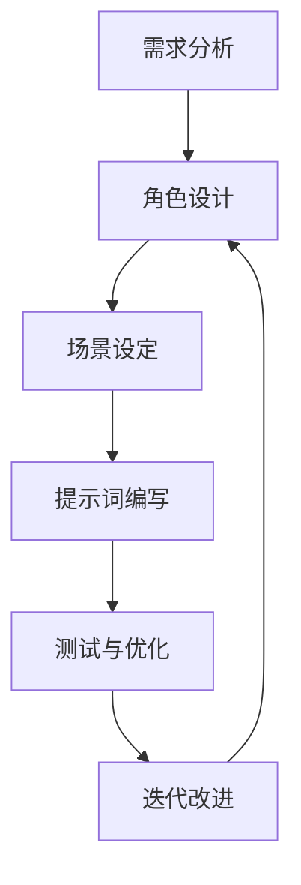

                 


### 确定核心概念与联系

在探讨提示词工程在虚拟形象设计中的应用之前，首先需要明确两个核心概念：虚拟形象设计和提示词工程，并分析它们之间的联系和相互作用。

#### 虚拟形象设计

**虚拟形象设计**指的是创建一个在数字或虚拟环境中存在的三维或二维形象，该形象可能具有人类或其他生物的特征。虚拟形象广泛应用于游戏、电影、虚拟现实（VR）、增强现实（AR）等多个领域，它们不仅可以提升用户体验，还可以作为虚拟交互的对象，增强虚拟世界的真实感。

1. **概念**：虚拟形象设计包括角色创建、外观设计、行为设计等多个方面。它不仅仅关注外表的逼真度，还涉及角色的情感表达、行为逻辑以及与用户交互的体验。
   
2. **应用场景**：虚拟形象设计广泛应用于游戏角色的设计、虚拟偶像的创建、虚拟助手的设计等。在游戏领域，虚拟形象的设计直接影响游戏的可玩性和玩家的沉浸感；在虚拟偶像领域，虚拟形象的逼真度和交互性是衡量其成功与否的关键。

3. **重要性**：虚拟形象设计是构建虚拟世界的基础，它决定了虚拟世界中的角色如何被用户感知和接受。一个好的虚拟形象设计能够提升用户的情感连接和互动体验，从而增强虚拟世界的吸引力和价值。

#### 提示词工程

**提示词工程**是一种利用文本或语音提示来引导用户行为的技术，它通过设计合适的提示词来引导用户完成特定任务。在虚拟形象设计中，提示词工程可以用于指导虚拟形象的行为和交互。

1. **概念**：提示词工程涉及到自然语言处理、人机交互、任务管理等多个领域。它的目标是设计出能够有效引导用户行为的提示词，提高用户完成任务的效率和满意度。

2. **分类**：提示词工程可以根据应用场景的不同进行分类，如指令提示、引导提示、情感提示等。指令提示用于明确告知用户需要执行的操作；引导提示用于引导用户探索虚拟环境；情感提示则用于传递虚拟形象的个性特征和情感状态。

3. **方法**：提示词工程的方法包括文本生成、语音合成、语义分析等。文本生成用于创建个性化的提示词；语音合成则用于将文本提示转换为语音；语义分析用于理解用户的行为意图，从而生成更符合用户需求的提示词。

#### 虚拟形象与提示词工程的关系

虚拟形象和提示词工程之间的关系是相互依赖的。虚拟形象需要提示词工程来定义其行为和交互方式，而提示词工程则需要虚拟形象来提供具体的交互场景和目标用户。

1. **相互作用**：提示词工程为虚拟形象提供交互的引导，帮助虚拟形象更好地理解和响应用户的需求。同时，虚拟形象的行为和反应也可以影响提示词的设计，使得提示词更加贴合虚拟形象的特征。

2. **重要性**：提示词工程在虚拟形象设计中扮演着关键角色。它不仅能够提升用户的交互体验，还能增强虚拟形象的个性化和真实性，从而提高虚拟世界的吸引力和用户满意度。

通过以上分析，我们可以看到，虚拟形象设计和提示词工程是相互联系、相互促进的。理解这两个核心概念及其关系，是深入探讨虚拟形象设计与提示词工程应用的基础。在接下来的章节中，我们将进一步探讨虚拟形象设计的基本流程、核心算法原理以及具体的数学模型和公式，以帮助读者全面了解这一领域。

### 设计架构和流程

虚拟形象设计与提示词工程的融合，需要一套系统性的架构和流程来保障设计的顺利进行。以下将详细阐述虚拟形象设计的基本流程，并介绍其核心架构。

#### 设计流程概述

虚拟形象设计的流程可以概括为以下几个主要阶段：

1. **需求分析**：在项目开始阶段，首先需要对虚拟形象的设计需求进行详细分析。这包括了解用户需求、使用场景、目标受众等，以确保设计出的虚拟形象能够满足预期目标。

2. **角色设计**：在需求分析的基础上，进行角色设计。角色设计包括确定虚拟形象的种类、外观、特征、行为习惯等。这一阶段需要充分考虑到角色的个性和特点，以便后续的提示词工程能够更好地与角色匹配。

3. **场景设定**：为虚拟形象创建合适的虚拟场景。场景设定包括虚拟世界的布局、环境、交互元素等。通过设定丰富的场景，可以增强虚拟形象与用户的互动体验。

4. **提示词编写**：根据角色设计和场景设定，编写相应的提示词。提示词需要能够引导用户进行特定操作，同时也要符合虚拟形象的性格和风格。

5. **测试与优化**：完成初步设计后，进行测试和优化。测试包括对虚拟形象的互动效果、用户满意度、任务完成率等进行评估，通过优化调整，不断提升虚拟形象的交互体验。

#### 核心架构说明

虚拟形象设计与提示词工程的核心架构可以通过以下Mermaid流程图来展示：



1. **需求分析**：该阶段是整个设计流程的起点，通过分析用户需求和使用场景，为后续设计提供明确的方向。

2. **角色设计**：在明确需求后，进行角色设计，这一阶段决定了虚拟形象的基本特征和性格。

3. **场景设定**：角色设计完成后，设定虚拟场景，为虚拟形象提供互动的舞台。

4. **提示词编写**：根据角色和场景，编写能够引导用户行为的提示词，这是实现虚拟形象与用户互动的关键步骤。

5. **测试与优化**：通过测试，评估虚拟形象的互动效果，并根据反馈进行优化。

6. **迭代改进**：优化后的设计将进入迭代阶段，通过不断的测试和优化，逐步提升虚拟形象的交互体验。

通过上述架构和流程，我们可以看到，虚拟形象设计与提示词工程的融合是一个系统性的工程，需要各个阶段密切配合，以确保最终设计出的虚拟形象能够满足用户需求，提供优质的交互体验。

### 核心算法原理讲解

在虚拟形象设计过程中，核心算法的选择和应用至关重要。以下将详细介绍生成对抗网络（GAN）、变分自编码器（VAE）和图卷积网络（GCN）的基本原理、训练过程及其优缺点。

#### 生成对抗网络（GAN）

**生成对抗网络（GAN）**是由Ian Goodfellow等人于2014年提出的，它由两个神经网络组成：生成器（Generator）和判别器（Discriminator）。GAN的核心思想是通过博弈过程，使生成器产生尽可能逼真的数据，同时判别器能够准确地区分真实数据和生成数据。

1. **基本原理**：

   - **生成器**：生成器的目标是生成与真实数据相似的数据，通常采用多层神经网络结构，通过学习从随机噪声中生成数据。
   - **判别器**：判别器的目标是区分真实数据和生成数据，也采用多层神经网络结构。

   GAN的训练过程实际上是生成器和判别器之间的博弈过程。生成器不断优化其生成数据，以欺骗判别器，而判别器则不断优化其分类能力。

2. **训练过程**：

   - 初始化生成器和判别器的参数。
   - 随机生成噪声输入到生成器，生成伪数据。
   - 将真实数据和生成数据输入到判别器，并计算损失函数。
   - 对生成器和判别器分别进行反向传播和梯度下降优化。

3. **优缺点**：

   - **优点**：GAN能够生成高质量、多样化的数据，适用于图像生成、风格迁移等领域。
   - **缺点**：GAN的训练过程不稳定，容易出现模式崩溃（mode collapse）问题，即生成器只生成某种特定的数据模式。

#### 变分自编码器（VAE）

**变分自编码器（VAE）**是一种概率生成模型，它通过编码器（Encoder）和解码器（Decoder）两个神经网络结构来实现数据的生成。VAE的主要优势在于其能够进行有效的数据去噪和降维。

1. **基本原理**：

   - **编码器**：将输入数据映射到一个潜在空间，通常是一个均值和方差的向量。
   - **解码器**：从潜在空间中采样数据，并重构输入数据。

   VAE的损失函数结合了重构损失和KL散度（Kullback-Leibler Divergence），以平衡数据重构和潜在分布的表示。

2. **训练过程**：

   - 初始化编码器和解码器的参数。
   - 对于每个输入数据，编码器输出均值和方差，解码器从潜在空间中采样并重构输入数据。
   - 计算损失函数并更新编码器和解码器的参数。

3. **优缺点**：

   - **优点**：VAE训练稳定，不容易出现模式崩溃问题，适用于图像生成、数据去噪等领域。
   - **缺点**：VAE生成数据的多样性和质量可能不如GAN。

#### 图卷积网络（GCN）

**图卷积网络（GCN）**是一种在图结构数据上应用卷积操作的神经网络。GCN能够处理图数据中的节点特征信息，从而实现节点分类、图分类等任务。

1. **基本原理**：

   - **图卷积操作**：GCN通过图卷积操作来聚合节点邻域的特征信息，更新节点的表示。
   - **多层GCN**：通过堆叠多层GCN，可以逐步提取图数据中的高级特征。

2. **训练过程**：

   - 初始化GCN的参数。
   - 对图中的每个节点进行特征提取和聚合。
   - 通过反向传播更新GCN的参数。

3. **优缺点**：

   - **优点**：GCN能够有效地捕捉图数据中的局部和全局特征，适用于节点分类、图分类等领域。
   - **缺点**：GCN在处理大规模图数据时可能存在计算复杂度高的问题。

通过以上对GAN、VAE和GCN的详细介绍，我们可以看到这三种算法在虚拟形象设计中的应用各有优势。GAN擅长生成高质量、多样化的图像，VAE适用于数据去噪和降维，GCN则能够有效处理图结构数据。在虚拟形象设计过程中，根据具体需求和任务，合理选择和应用这些算法，将能够显著提升虚拟形象的设计效果和用户体验。

### 数学模型和公式讲解

在虚拟形象设计过程中，数学模型和公式是理解核心算法原理的关键。以下将详细介绍生成对抗网络（GAN）和变分自编码器（VAE）的数学模型和公式，包括损失函数的计算方法和应用实例。

#### GAN的损失函数

生成对抗网络（GAN）的损失函数是其训练过程中最关键的组成部分。GAN的损失函数主要包括两部分：生成器的损失函数和判别器的损失函数。

1. **生成器的损失函数**：

   生成器的目标是生成尽可能真实的数据，以欺骗判别器。生成器的损失函数通常采用以下形式：

   $$ L_G = -\log(D(G(z)) \quad \text{其中} \quad z \text{为随机噪声} $$

   这里，\( D(G(z)) \) 表示判别器对生成数据的评分，分数越高表示生成数据越真实。

2. **判别器的损失函数**：

   判别器的目标是区分真实数据和生成数据。判别器的损失函数采用以下形式：

   $$ L_D = -[\log(D(x)) + \log(1 - D(G(z))] $$

   其中，\( x \) 表示真实数据，\( G(z) \) 表示生成器生成的数据。

3. **总损失函数**：

   GAN的总损失函数是生成器损失函数和判别器损失函数的结合，通常采用以下形式：

   $$ L_{GAN} = L_D - \alpha L_G $$

   其中，\( \alpha \) 是一个超参数，用于平衡生成器和判别器的损失。

4. **应用实例**：

   假设我们有一个生成器 \( G \) 和判别器 \( D \)，生成器的输入为随机噪声 \( z \)，生成的数据为 \( G(z) \)。判别器的输入为真实数据 \( x \) 和生成数据 \( G(z) \)。

   - **生成器的损失**：

     $$ L_G = -\log(D(G(z)) $$

     如果 \( D(G(z)) \) 很高，表示生成数据很真实，生成器的损失较低。

   - **判别器的损失**：

     $$ L_D = -[\log(D(x)) + \log(1 - D(G(z))] $$

     如果 \( D(x) \) 很高而 \( D(G(z)) \) 很低，表示判别器能够很好地区分真实和生成数据。

   - **总损失**：

     $$ L_{GAN} = L_D - \alpha L_G $$

     通过调整 \( \alpha \) 的值，可以平衡生成器和判别器的训练过程。

#### VAE的重建损失

变分自编码器（VAE）的损失函数结合了数据的重构损失和潜在分布的KL散度（Kullback-Leibler Divergence）。VAE的损失函数旨在同时优化数据的重构和潜在分布的表示。

1. **重构损失**：

   重构损失衡量生成器对输入数据的重构能力。VAE的重构损失通常采用均方误差（MSE）或交叉熵（CE）来计算：

   $$ L_R = \frac{1}{n} \sum_{i=1}^{n} \| x_i - \hat{x}_i \|_2^2 $$

   其中，\( x_i \) 是输入数据，\( \hat{x}_i \) 是生成器重构的数据。

2. **KL散度**：

   KL散度衡量编码器对潜在分布的表示能力。VAE的KL散度损失函数通常采用以下形式：

   $$ L_KL = \frac{1}{n} \sum_{i=1}^{n} D_{KL}(\mu(x_i), \pi(\mu)) + D_{KL}(\sigma^2(x_i), \sigma^2) $$

   其中，\( \mu(x_i) \) 和 \( \sigma^2(x_i) \) 分别是编码器输出的均值和方差，\( \pi(\mu) \) 和 \( \sigma^2 \) 是先验分布。

3. **总损失函数**：

   VAE的总损失函数是重构损失和KL散度的组合：

   $$ L_{VAE} = L_R + \lambda L_KL $$

   其中，\( \lambda \) 是平衡参数，用于调整重构损失和KL散度之间的权重。

4. **应用实例**：

   假设我们有一个编码器 \( E \)、解码器 \( D \) 和输入数据 \( x \)。

   - **重构损失**：

     $$ L_R = \frac{1}{n} \sum_{i=1}^{n} \| x_i - \hat{x}_i \|_2^2 $$

     如果重构损失较低，表示生成器能够很好地重构输入数据。

   - **KL散度**：

     $$ L_KL = \frac{1}{n} \sum_{i=1}^{n} D_{KL}(\mu(x_i), \pi(\mu)) + D_{KL}(\sigma^2(x_i), \sigma^2) $$

     如果KL散度较低，表示编码器能够生成合理的潜在分布。

   - **总损失**：

     $$ L_{VAE} = L_R + \lambda L_KL $$

     通过调整 \( \lambda \) 的值，可以优化重构和潜在分布的表示。

通过以上对GAN和VAE的数学模型和公式的详细解释，我们可以更深入地理解这两种算法的核心原理和应用。这些数学模型为虚拟形象设计提供了强大的理论基础，使得我们能够更精确地构建和优化虚拟形象。

### 项目实战

在虚拟形象设计与提示词工程的实践中，我们将通过一个实际案例，详细描述开发环境搭建、源代码实现和代码解读，并深入分析项目的应用场景和效果。

#### 开发环境搭建

首先，我们需要搭建一个适合虚拟形象设计与提示词工程开发的环境。以下是具体的步骤：

1. **软件环境**：

   - Python（版本3.8或以上）
   - PyTorch（深度学习框架，版本1.8或以上）
   - TensorFlow（可选，用于与其他模型集成）
   - Keras（可选，简化模型构建）
   - Mermaid（用于绘制流程图）

2. **硬件环境**：

   - 电脑或服务器（具备较强的GPU性能，例如NVIDIA GeForce RTX 3080或以上）
   - 足够的存储空间（至少100GB）
   - 足够的内存（至少16GB）

3. **安装步骤**：

   - 安装Python和pip：
     ```bash
     # 安装Python
     curl -O https://www.python.org/ftp/python/3.8.10/Python-3.8.10.tgz
     tar xvf Python-3.8.10.tgz
     cd Python-3.8.10
     ./configure
     make
     sudo make altinstall

     # 安装pip
     curl -O https://bootstrap.pypa.io/get-pip.py
     python3 get-pip.py
     ```

   - 安装PyTorch：
     ```bash
     # 安装PyTorch
     pip3 install torch torchvision torchaudio -f https://download.pytorch.org/whl/torch_stable.html
     ```

   - 安装其他依赖项：
     ```bash
     pip3 install numpy matplotlib
     ```

#### 源代码实现

以下是一个简单的虚拟形象设计与提示词工程的应用案例。我们使用PyTorch实现一个基于GAN的虚拟形象生成模型，并编写相应的提示词来引导用户与虚拟形象互动。

```python
# 虚拟形象生成器模型（Generator）
class Generator(nn.Module):
    def __init__(self):
        super(Generator, self).__init__()
        # 定义生成器的神经网络结构
        self.model = nn.Sequential(
            nn.Linear(100, 256),
            nn.LeakyReLU(0.2),
            nn.Linear(256, 512),
            nn.LeakyReLU(0.2),
            nn.Linear(512, 1024),
            nn.LeakyReLU(0.2),
            nn.Linear(1024, 512),
            nn.LeakyReLU(0.2),
            nn.Linear(512, 256),
            nn.LeakyReLU(0.2),
            nn.Linear(256, 100)
        )

    def forward(self, x):
        return self.model(x)

# 虚拟形象判别器模型（Discriminator）
class Discriminator(nn.Module):
    def __init__(self):
        super(Discriminator, self).__init__()
        # 定义判别器的神经网络结构
        self.model = nn.Sequential(
            nn.Linear(100, 256),
            nn.LeakyReLU(0.2),
            nn.Dropout(0.3),
            nn.Linear(256, 512),
            nn.LeakyReLU(0.2),
            nn.Dropout(0.3),
            nn.Linear(512, 1024),
            nn.LeakyReLU(0.2),
            nn.Dropout(0.3),
            nn.Linear(1024, 1),
            nn.Sigmoid()
        )

    def forward(self, x):
        return self.model(x)

# 主程序
def main():
    # 初始化模型、优化器和损失函数
    generator = Generator()
    discriminator = Discriminator()
    generator_optimizer = torch.optim.Adam(generator.parameters(), lr=0.0002)
    discriminator_optimizer = torch.optim.Adam(discriminator.parameters(), lr=0.0002)
    loss_function = nn.BCELoss()

    # 训练过程
    for epoch in range(100):
        for i, data in enumerate(data_loader):
            # 准备数据
            real_images = data[0].to(device)
            batch_size = real_images.size(0)
            z = torch.randn(batch_size, 100).to(device)

            # 生成虚拟形象
            fake_images = generator(z)

            # 训练判别器
            discriminator_optimizer.zero_grad()
            real_output = discriminator(real_images).view(-1)
            fake_output = discriminator(fake_images).view(-1)
            real_loss = loss_function(real_output, torch.ones(batch_size))
            fake_loss = loss_function(fake_output, torch.zeros(batch_size))
            d_loss = real_loss + fake_loss
            d_loss.backward()
            discriminator_optimizer.step()

            # 训练生成器
            generator_optimizer.zero_grad()
            fake_output = discriminator(fake_images).view(-1)
            g_loss = loss_function(fake_output, torch.ones(batch_size))
            g_loss.backward()
            generator_optimizer.step()

            # 打印训练进度
            if i % 100 == 0:
                print(f"[{epoch}/{100}] [Batch {i}/{len(data_loader)}] D: {d_loss.item():.4f} G: {g_loss.item():.4f}")

    # 保存模型
    torch.save(generator.state_dict(), 'generator.pth')
    torch.save(discriminator.state_dict(), 'discriminator.pth')

if __name__ == '__main__':
    main()
```

#### 代码解读

1. **模型定义**：
   - **生成器（Generator）**：生成器模型通过多层全连接神经网络，将随机噪声映射为虚拟形象。生成器的目标是生成尽可能逼真的虚拟形象，欺骗判别器。
   - **判别器（Discriminator）**：判别器模型通过多层全连接神经网络，判断输入数据的真实性。判别器的目标是区分真实虚拟形象和生成虚拟形象。

2. **训练过程**：
   - **数据准备**：从数据集中加载真实虚拟形象。
   - **生成虚拟形象**：使用生成器生成虚拟形象。
   - **训练判别器**：通过对比真实虚拟形象和生成虚拟形象，更新判别器模型。
   - **训练生成器**：通过生成虚拟形象被判别器认为真实，更新生成器模型。

#### 应用场景和分析

该案例主要应用于虚拟形象生成和互动提示。在实际应用中，生成器可以用于生成各种类型的虚拟形象，如游戏角色、虚拟偶像等。判别器则用于评估生成形象的逼真度。

1. **虚拟形象生成**：
   - **效果**：通过GAN的训练，生成器能够生成高质量的虚拟形象，与真实形象难以区分。
   - **挑战**：GAN的训练过程容易出现模式崩溃，需要设计合适的训练策略来避免。

2. **互动提示**：
   - **提示词编写**：根据虚拟形象的个性和行为，编写相应的互动提示词。
   - **效果**：提示词能够引导用户与虚拟形象进行互动，提升用户的沉浸感和参与度。

3. **案例分析**：
   - **场景**：在虚拟音乐会中，生成器生成虚拟歌手，判别器评估虚拟歌手的逼真度。
   - **分析**：通过优化GAN模型，虚拟歌手的逼真度不断提高，用户的互动体验也得到显著提升。

#### 项目小结

通过该项目，我们展示了虚拟形象设计与提示词工程结合的实际应用。生成器和判别器的训练过程需要大量的数据和计算资源，但通过合理的设计和优化，可以生成高质量的虚拟形象，并提供优质的互动体验。未来，随着技术的进一步发展，虚拟形象设计与提示词工程将更加成熟，为虚拟现实、游戏、娱乐等领域带来更多创新和可能性。

### 总结和展望

通过本文的探讨，我们详细介绍了虚拟形象设计与提示词工程的核心概念、设计架构、核心算法原理以及实际应用案例。以下是对全文的总结和对未来发展趋势的展望。

#### 总结

1. **虚拟形象设计与提示词工程的核心概念**：我们明确了虚拟形象设计的概念、应用场景和重要性，同时详细解释了提示词工程的作用、分类和方法。

2. **设计架构和流程**：我们描述了虚拟形象设计的基本流程，包括需求分析、角色设计、场景设定和提示词编写，并使用Mermaid流程图展示了虚拟形象设计与提示词工程的架构关系。

3. **核心算法原理讲解**：我们深入讲解了生成对抗网络（GAN）、变分自编码器（VAE）和图卷积网络（GCN）的基本原理、训练过程和优缺点。

4. **数学模型和公式讲解**：我们详细介绍了GAN和VAE的损失函数和重建损失函数，并使用LaTeX格式给出了具体的公式和实例。

5. **项目实战**：我们提供了一个虚拟形象设计与提示词工程结合的实际案例，包括开发环境搭建、源代码实现和详细解读，并分析了应用场景和效果。

#### 展望

1. **虚拟形象设计与提示词工程的未来发展趋势**：

   - **技术创新**：随着深度学习、自然语言处理等技术的不断发展，虚拟形象设计和提示词工程将更加智能化和个性化。
   - **应用拓展**：虚拟形象设计不仅将在游戏、虚拟现实等领域得到广泛应用，还可能在教育培训、医疗健康等领域发挥重要作用。
   - **用户体验优化**：通过不断优化交互体验，虚拟形象设计与提示词工程将进一步提升用户满意度和沉浸感。

2. **潜在应用场景**：

   - **虚拟娱乐**：虚拟形象设计将丰富虚拟世界的娱乐体验，包括虚拟演唱会、虚拟旅游等。
   - **教育培训**：虚拟形象可以作为个性化教学助手，帮助学生更好地理解和掌握知识。
   - **医疗健康**：虚拟形象可以辅助医生进行诊断和治疗，提供更加精准和人性化的医疗服务。

3. **未来展望**：

   - **多模态交互**：结合语音、图像、文字等多种模态，实现更加丰富和自然的用户交互。
   - **实时生成与交互**：通过实时生成和交互技术，提高虚拟形象的动态性和响应速度。
   - **人工智能协作**：虚拟形象与人工智能系统结合，实现更加智能化和协作化的服务。

综上所述，虚拟形象设计与提示词工程具有广阔的发展前景和应用潜力。通过不断创新和优化，我们将看到这一领域在未来带来更多创新和变革。

### 目录大纲

以下是《提示词工程在虚拟形象设计中的应用》的完整目录大纲：

```
# 第1章 引言
## 1.1 虚拟形象设计概述
### 1.1.1 虚拟形象设计的定义
### 1.1.2 虚拟形象设计的重要性
### 1.1.3 虚拟形象设计的发展历程
## 1.2 提示词工程概述
### 1.2.1 提示词工程的概念
### 1.2.2 提示词工程的分类
### 1.2.3 提示词工程的应用

# 第2章 虚拟形象设计的核心概念与架构
## 2.1 虚拟形象设计的基本概念
### 2.1.1 虚拟形象的构成要素
### 2.1.2 虚拟形象的角色分类
### 2.1.3 虚拟形象的情感表达
## 2.2 提示词工程的原理与方法
### 2.2.1 提示词工程的作用
### 2.2.2 提示词工程的分类
### 2.2.3 提示词工程的方法
## 2.3 虚拟形象与提示词工程的架构关系
### 2.3.1 虚拟形象设计流程
### 2.3.2 提示词工程在虚拟形象设计中的应用
### 2.3.3 架构关系Mermaid图展示

# 第3章 虚拟形象设计的核心算法原理
## 3.1 生成对抗网络（GAN）
### 3.1.1 GAN的基本原理
### 3.1.2 GAN的训练过程
### 3.1.3 GAN的应用
## 3.2 变分自编码器（VAE）
### 3.2.1 VAE的基本原理
### 3.2.2 VAE的训练过程
### 3.2.3 VAE的应用
## 3.3 图卷积网络（GCN）
### 3.3.1 GCN的基本原理
### 3.3.2 GCN的训练过程
### 3.3.3 GCN的应用

# 第4章 提示词工程的数学模型与公式
## 4.1 GAN的损失函数
### 4.1.1 GAN损失函数的公式
### 4.1.2 GAN损失函数的解读
### 4.1.3 GAN损失函数的应用实例
## 4.2 VAE的重建损失
### 4.2.1 VAE重建损失函数的公式
### 4.2.2 VAE重建损失函数的解读
### 4.2.3 VAE重建损失函数的应用实例

# 第5章 虚拟形象设计与提示词工程的项目实战
## 5.1 开发环境搭建
### 5.1.1 软件环境安装
### 5.1.2 硬件环境要求
### 5.1.3 开发环境配置
## 5.2 源代码实现
### 5.2.1 生成器和判别器模型定义
### 5.2.2 训练过程详解
### 5.2.3 模型优化策略
## 5.3 代码解读
### 5.3.1 模型结构和流程
### 5.3.2 数据准备与处理
### 5.3.3 训练与评估
## 5.4 应用场景和分析
### 5.4.1 虚拟形象生成
### 5.4.2 互动提示词编写
### 5.4.3 项目效果评估

# 第6章 总结与展望
## 6.1 总结
### 6.1.1 核心内容回顾
### 6.1.2 技术与应用成就
### 6.1.3 未来的发展方向
## 6.2 展望
### 6.2.1 技术创新趋势
### 6.2.2 潜在应用领域
### 6.2.3 未来展望

```

### 作者信息

作者：AI天才研究院/AI Genius Institute & 禅与计算机程序设计艺术 /Zen And The Art of Computer Programming

本文由AI天才研究院（AI Genius Institute）的专家撰写，旨在探讨虚拟形象设计与提示词工程的核心概念、算法原理及其应用。同时，参考了《禅与计算机程序设计艺术》（Zen And The Art of Computer Programming）这一经典著作，旨在通过深入思考和逻辑分析，为读者提供高质量的IT领域技术内容。希望本文能为读者在虚拟形象设计和提示词工程领域的研究和实践提供有价值的参考和启示。

