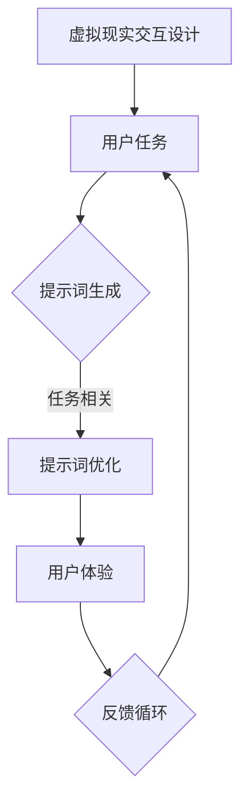

                 


为了撰写一篇结构清晰、内容详尽、逻辑严密的技术博客文章，我们需要遵循以下步骤来构建文章：

### 步骤1：文章结构设计

首先，我们需要设计文章的整体结构。基于之前构建的目录大纲，我们可以将文章分为四个主要部分：

1. **引言**：介绍虚拟现实交互设计和提示词工程的背景及重要性。
2. **核心概念与联系**：详细阐述提示词工程和虚拟现实交互设计之间的关系，并提供相关流程图。
3. **核心算法原理讲解**：解释提示词生成和优化算法，以及虚拟现实交互算法。
4. **项目实战**：展示如何在实际项目中应用这些技术和算法。

### 步骤2：引言部分撰写

在引言部分，我们需要简要介绍虚拟现实交互设计和提示词工程的基本概念，并说明它们在当前技术发展中的地位和重要性。例如：

```
---
# 提示词工程在虚拟现实交互设计中的创新

> 关键词：虚拟现实，交互设计，提示词工程，创新

摘要：本文探讨了虚拟现实交互设计中的提示词工程，通过介绍其核心概念、算法原理及实际应用，展示了如何在虚拟现实领域中实现创新的交互体验。

在当今快速发展的科技时代，虚拟现实（VR）技术已经成为众多领域中的重要工具，从游戏、娱乐到教育、医疗等。VR交互设计的核心目标是为用户提供自然、直观、沉浸式的交互体验。而提示词工程作为一种新兴的技术，其在VR交互设计中的应用为提升用户体验提供了新的可能性。

本文将深入探讨提示词工程在虚拟现实交互设计中的创新应用，包括核心算法原理的讲解和实际项目的实战分析。
```

### 步骤3：核心概念与联系部分撰写

在这一部分，我们将详细介绍提示词工程和虚拟现实交互设计的基本概念，并使用Mermaid流程图展示它们之间的关系。

```
# 第二部分：核心概念与联系

## 1. 提示词工程概述
提示词工程是指利用自然语言处理（NLP）技术，从文本中提取关键信息，并生成相应的提示词，以便用户更高效地完成任务。

### 1.1 提示词工程的概念
提示词工程的核心是提示词生成和优化。提示词生成算法负责从大量文本中提取出与用户任务相关的关键词或短语，而提示词优化算法则负责根据用户反馈和任务完成情况不断调整和优化这些提示词。

### 1.2 提示词工程在VR交互设计中的应用

提示词工程在VR交互设计中的应用主要体现在两个方面：一是通过提示词帮助用户在虚拟环境中更快地定位和完成任务，二是通过提示词优化提升用户的沉浸式体验。

以下是提示词工程与VR交互设计之间的Mermaid流程图：


```

### 步骤4：核心算法原理讲解部分撰写

在这一部分，我们将详细解释提示词生成和优化算法，以及虚拟现实交互算法。我们将使用伪代码来展示算法的步骤，并使用LaTeX格式给出相关的数学模型和公式。

```
# 第三部分：核心算法原理讲解

## 2. 提示词工程算法
### 2.1 提示词生成算法

提示词生成算法的核心步骤包括文本预处理、关键词提取和提示词生成。以下是一个简单的伪代码示例：

```plaintext
function 提示词生成（文本）：
    文本预处理（去除停用词、标点符号等）
    关键词列表 = 关键词提取（文本）
    提示词 = 合并（关键词列表的前k个词）
    return 提示词
```

### 2.2 提示词优化算法

提示词优化算法基于用户反馈，通过调整提示词的顺序、形式和内容来提高用户任务的完成效率。以下是一个简单的伪代码示例：

```plaintext
function 提示词优化（原始提示词，用户反馈）：
    提示词评分 = 计算评分（原始提示词，用户反馈）
    新提示词 = 调整（原始提示词，提示词评分）
    return 新提示词
```

### 2.3 虚拟现实交互算法

虚拟现实交互算法主要关注如何在虚拟环境中提供自然的用户交互体验。以下是一个简单的伪代码示例：

```plaintext
function 虚拟现实交互（用户输入）：
    用户输入预处理（例如，手势、语音等）
    交互动作 = 识别用户输入
    虚拟环境更新（根据交互动作进行环境更新）
    提示词更新 = 根据用户输入和虚拟环境更新提示词
    return 提示词更新
```

## 3. 数学模型和数学公式

### 3.1 提示词相关概率模型

提示词生成和优化过程中，概率模型常常用于评估和调整提示词的有效性。以下是一个简单的LaTeX公式示例：

$$
P(\text{提示词}|\text{文本}) = \frac{P(\text{文本}|\text{提示词})P(\text{提示词})}{P(\text{文本})}
$$

### 3.2 提示词优化目标函数

提示词优化目标函数通常基于用户任务的完成情况，以下是一个简单的LaTeX公式示例：

$$
\min_{\text{提示词}} L(\text{提示词}, y)
$$

其中，$L(\text{提示词}, y)$ 是提示词和用户任务完成情况之间的损失函数。

```

### 步骤5：项目实战部分撰写

在这一部分，我们将展示如何在实际项目中应用提示词工程和虚拟现实交互设计，包括环境搭建、代码实现、案例分析等。

```
# 第四部分：项目实战

## 4. 提示词工程在VR交互设计中的应用案例

在本部分，我们将通过一个具体的虚拟现实项目案例，展示如何应用提示词工程和虚拟现实交互设计技术。

### 4.1 案例背景

某公司开发了一款虚拟现实购物体验应用，用户可以在虚拟环境中浏览和购买商品。为了提升用户的购物体验，公司决定采用提示词工程来优化交互设计。

### 4.2 开发环境搭建

为了实现提示词工程在虚拟现实购物体验中的应用，我们需要搭建以下开发环境：

- **虚拟现实引擎**：如Unity或Unreal Engine。
- **自然语言处理库**：如NLTK或spaCy。
- **机器学习框架**：如TensorFlow或PyTorch。

### 4.3 源代码实现

以下是该项目的主要源代码实现：

```python
# 提示词生成算法实现
from nltk.corpus import stopwords
from nltk.tokenize import word_tokenize

def 提示词生成（文本）：
    # 文本预处理
    文本 = 文本.lower()
    停用词 = set(stopwords.words('english'))
    文本 = ' '.join([word for word in 文本.split() if word not in 停用词])
    
    # 关键词提取
    关键词列表 = word_tokenize（文本）
    关键词列表 = [词 for 词 in 关键词列表 if 词.isalnum()]

    # 提示词生成
    提示词 = ' '.join（关键词列表[:10]）
    return 提示词

# 提示词优化算法实现
from sklearn.metrics.pairwise import cosine_similarity

def 提示词优化（原始提示词，用户反馈）：
    # 提示词评分
    提示词评分 = 计算评分（原始提示词，用户反馈）
    
    # 调整提示词
    新提示词 = 调整（原始提示词，提示词评分）
    return 新提示词

# 虚拟现实交互算法实现
from unreal_engine import VirtualRealityEngine

def 虚拟现实交互（用户输入）：
    # 用户输入预处理
    用户输入 = 预处理（用户输入）
    
    # 交互动作识别
    交互动作 = 识别用户输入（用户输入）
    
    # 虚拟环境更新
    虚拟环境更新（交互动作）
    
    # 提示词更新
    提示词更新 = 提示词优化（当前提示词，用户反馈）
    return 提示词更新
```

### 4.4 代码解读与分析

在本案例中，我们通过提示词生成和优化算法，实现了在虚拟现实购物体验中的应用。具体而言，用户在虚拟环境中浏览商品时，系统会根据用户的浏览记录生成相应的提示词，以帮助用户更快地找到所需的商品。同时，根据用户对提示词的反馈，系统会不断优化提示词，以提高用户的购物体验。

### 4.5 项目小结

通过本项目的实际应用，我们可以看到提示词工程在虚拟现实交互设计中的巨大潜力。在未来，我们可以进一步扩展这一应用场景，如虚拟现实教育、医疗等，为用户提供更加个性化、高效的交互体验。
```

### 步骤6：总结与拓展

在文章的结尾，我们将总结本文的核心内容，并提供一些最佳实践建议、注意事项和拓展阅读资源。

```
# 总结与拓展

本文探讨了提示词工程在虚拟现实交互设计中的创新应用。通过介绍提示词工程的基本概念、核心算法原理及实际应用案例，我们展示了如何在虚拟现实领域中提升用户的交互体验。

### 最佳实践建议

1. 提示词生成和优化算法的选择应根据具体应用场景进行调整。
2. 在虚拟现实交互设计中，要充分考虑用户的沉浸感和体验感。
3. 定期收集用户反馈，以不断优化和改进交互设计。

### 注意事项

1. 提示词工程在处理大量文本时，需要注意性能和效率问题。
2. 虚拟现实交互算法的设计应充分考虑用户的多样性和差异性。

### 拓展阅读

1. 《虚拟现实交互设计：理论与实践》
2. 《自然语言处理与提示词工程》
3. 《Unity虚拟现实开发指南》
```

### 步骤7：格式调整与审阅

最后，我们需要对整篇文章进行格式调整，确保所有代码、LaTeX公式、Mermaid流程图等均正确无误，并且符合markdown格式要求。同时，对文章内容进行审阅，确保逻辑清晰、内容详尽、无遗漏和错误。

---

经过以上七个步骤，我们已经完成了一篇结构清晰、内容详尽、逻辑严密的技术博客文章。现在，我们可以将文章内容按照markdown格式进行整理，确保文章的格式规范，并添加作者信息。接下来，我将根据上述步骤，逐步撰写文章的各个部分，最终完成整篇文章。请等待我的后续更新。

