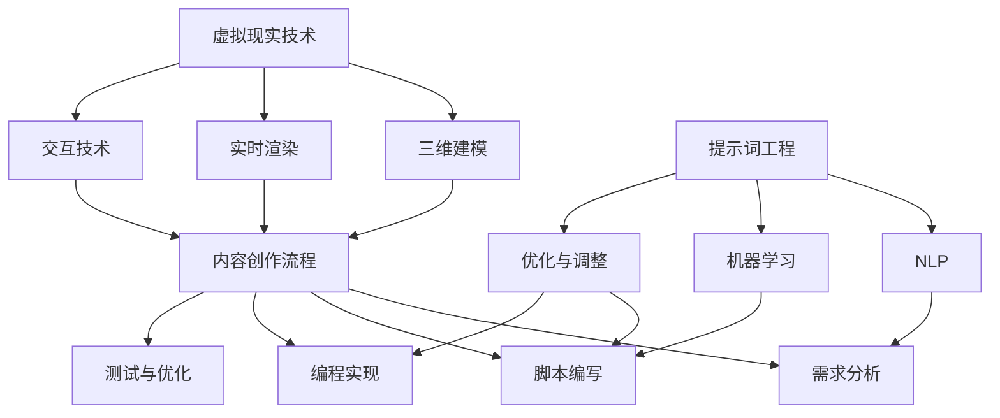

                 

### 第二部分：核心概念与联系

在深入探讨提示词工程在虚拟现实内容创作中的应用之前，我们需要先理解几个核心概念，并分析它们之间的联系。

#### 虚拟现实技术

虚拟现实（VR）是一种通过计算机技术和多感官模拟技术创造的沉浸式体验。它利用头戴显示器（HMD）、位置跟踪器、手柄等设备，将用户带入一个完全虚拟的环境中。在虚拟现实内容创作中，常用的技术包括：

1. **三维建模**：通过计算机软件（如Blender、Maya）创建虚拟环境、角色和物体。
2. **实时渲染**：利用图形处理器（GPU）实现高质量的实时渲染，为用户提供流畅的视觉体验。
3. **交互技术**：通过传感器和控制器实现用户与环境之间的互动。

这些技术共同构成了虚拟现实的基础，为内容的创作和呈现提供了丰富的可能性。

#### 内容创作流程

虚拟现实内容创作是一个复杂的过程，通常包括以下几个步骤：

1. **需求分析**：明确内容创作的目标和需求，包括故事情节、角色设定、交互方式等。
2. **三维建模**：使用三维建模软件创建虚拟环境、角色和物体。
3. **脚本编写**：编写游戏或应用的故事情节和交互脚本。
4. **编程实现**：利用编程语言（如C++、UnityScript）实现脚本和交互逻辑。
5. **测试与优化**：对内容进行反复测试，优化性能和用户体验。

这一流程不仅需要技术支持，还需要创意和艺术感的融合，以确保内容的丰富和吸引力。

#### 提示词工程

提示词工程是一种利用人工智能技术生成和优化文本的方法。在虚拟现实内容创作中，提示词工程主要用于自动生成故事情节、对话脚本和说明文本。其核心原理包括：

1. **自然语言处理（NLP）**：利用NLP技术对大量文本数据进行分析，提取模式和规律。
2. **机器学习**：通过机器学习算法，如生成对抗网络（GAN）和递归神经网络（RNN），训练模型以生成新的文本。
3. **优化与调整**：根据用户的反馈和需求，不断优化生成的文本，提高其质量和相关性。

#### 核心概念与联系

为了更好地理解这些概念之间的联系，我们可以使用Mermaid流程图来展示它们之间的关系架构。



这个流程图展示了虚拟现实技术、内容创作流程和提示词工程之间的相互关系。虚拟现实技术为内容创作提供了基础，而提示词工程则利用人工智能技术，对内容创作流程中的文本生成进行优化和提升。

#### 详细讲解

1. **虚拟现实技术**：虚拟现实技术是整个虚拟现实内容创作的基础。它包括三维建模、实时渲染和交互技术。三维建模用于创建虚拟环境、角色和物体，实时渲染则用于生成高质量的视觉效果，而交互技术则实现了用户与环境之间的互动。

2. **内容创作流程**：内容创作流程是虚拟现实内容创作的重要环节。它包括需求分析、脚本编写、编程实现和测试与优化。需求分析明确了内容创作的目标和需求，脚本编写和编程实现则是将需求转化为实际的可执行代码，而测试与优化则是确保内容的质量和用户体验。

3. **提示词工程**：提示词工程是一种利用人工智能技术生成和优化文本的方法。它通过自然语言处理（NLP）和机器学习算法，从大量文本数据中提取模式和规律，生成新的文本。提示词工程的应用场景非常广泛，包括故事情节生成、对话脚本生成和说明文本生成等。

通过这个流程图，我们可以清楚地看到各个概念之间的联系和作用，从而更好地理解提示词工程在虚拟现实内容创作中的应用。

----------------------------------------------------------------

```markdown
## 第二部分：核心概念与联系

### 虚拟现实技术

虚拟现实（VR）是一种通过计算机技术和多感官模拟技术创造的沉浸式体验。它利用头戴显示器（HMD）、位置跟踪器、手柄等设备，将用户带入一个完全虚拟的环境中。在虚拟现实内容创作中，常用的技术包括：

1. **三维建模**：通过计算机软件（如Blender、Maya）创建虚拟环境、角色和物体。
2. **实时渲染**：利用图形处理器（GPU）实现高质量的实时渲染，为用户提供流畅的视觉体验。
3. **交互技术**：通过传感器和控制器实现用户与环境之间的互动。

这些技术共同构成了虚拟现实的基础，为内容的创作和呈现提供了丰富的可能性。

### 内容创作流程

虚拟现实内容创作是一个复杂的过程，通常包括以下几个步骤：

1. **需求分析**：明确内容创作的目标和需求，包括故事情节、角色设定、交互方式等。
2. **三维建模**：使用三维建模软件创建虚拟环境、角色和物体。
3. **脚本编写**：编写游戏或应用的故事情节和交互脚本。
4. **编程实现**：利用编程语言（如C++、UnityScript）实现脚本和交互逻辑。
5. **测试与优化**：对内容进行反复测试，优化性能和用户体验。

这一流程不仅需要技术支持，还需要创意和艺术感的融合，以确保内容的丰富和吸引力。

### 提示词工程

提示词工程是一种利用人工智能技术生成和优化文本的方法。在虚拟现实内容创作中，提示词工程主要用于自动生成故事情节、对话脚本和说明文本。其核心原理包括：

1. **自然语言处理（NLP）**：利用NLP技术对大量文本数据进行分析，提取模式和规律。
2. **机器学习**：通过机器学习算法，如生成对抗网络（GAN）和递归神经网络（RNN），训练模型以生成新的文本。
3. **优化与调整**：根据用户的反馈和需求，不断优化生成的文本，提高其质量和相关性。

### 核心概念与联系

为了更好地理解这些概念之间的联系，我们可以使用Mermaid流程图来展示它们之间的关系架构。


这个流程图展示了虚拟现实技术、内容创作流程和提示词工程之间的相互关系。虚拟现实技术为内容创作提供了基础，而提示词工程则利用人工智能技术，对内容创作流程中的文本生成进行优化和提升。

### 详细讲解

1. **虚拟现实技术**：虚拟现实技术是整个虚拟现实内容创作的基础。它包括三维建模、实时渲染和交互技术。三维建模用于创建虚拟环境、角色和物体，实时渲染则用于生成高质量的视觉效果，而交互技术则实现了用户与环境之间的互动。

2. **内容创作流程**：内容创作流程是虚拟现实内容创作的重要环节。它包括需求分析、脚本编写、编程实现和测试与优化。需求分析明确了内容创作的目标和需求，脚本编写和编程实现则是将需求转化为实际的可执行代码，而测试与优化则是确保内容的质量和用户体验。

3. **提示词工程**：提示词工程是一种利用人工智能技术生成和优化文本的方法。它通过自然语言处理（NLP）和机器学习算法，从大量文本数据中提取模式和规律，生成新的文本。提示词工程的应用场景非常广泛，包括故事情节生成、对话脚本生成和说明文本生成等。

通过这个流程图，我们可以清楚地看到各个概念之间的联系和作用，从而更好地理解提示词工程在虚拟现实内容创作中的应用。

----------------------------------------------------------------

作者：AI天才研究院/AI Genius Institute & 禅与计算机程序设计艺术 /Zen And The Art of Computer Programming
```

----------------------------------------------------------------

### 第三部分：核心算法原理讲解

在深入探讨虚拟现实内容创作中的应用之前，我们首先需要理解提示词工程中的核心算法原理。以下是几个关键算法及其工作原理的详细讲解。

#### 生成对抗网络（GAN）

生成对抗网络（GAN）是一种由生成器和判别器组成的深度学习模型。生成器的任务是生成尽可能真实的虚拟数据，而判别器的任务是区分真实数据和生成数据。通过这两个模型的对抗训练，生成器可以逐步提高生成数据的质量。

1. **生成器（Generator）**
   - **输入**：随机噪声向量\( z \)
   - **输出**：生成虚拟数据\( G(z) \)
   - **工作原理**：生成器接收随机噪声向量，通过神经网络将噪声映射为虚拟数据，如图像、文本等。

2. **判别器（Discriminator）**
   - **输入**：真实数据和生成数据
   - **输出**：概率值，表示输入数据的真实性
   - **工作原理**：判别器接收真实数据和生成数据，通过神经网络判断输入数据的真实性，输出一个概率值。

3. **对抗训练**
   - **目标**：使生成器生成的数据尽可能接近真实数据，同时使判别器无法准确区分真实数据和生成数据。
   - **过程**：通过训练生成器和判别器，不断调整生成器和判别器的参数，最终达到生成高质量虚拟数据的平衡状态。

伪代码示例：

```python
# 生成器
def generator(z):
    # 将噪声向量z映射为虚拟数据G(z)
    G(z) = ...

# 判别器
def discriminator(x):
    # 判断输入数据x的真实性
    probability = ...

# GAN训练
for epoch in range(num_epochs):
    for z in random_noise_samples:
        G(z) = generator(z)
        d_loss_real = discriminator(real_data)
        d_loss_fake = discriminator(G(z))
        g_loss = ...

    # 更新生成器和判别器的参数
    update_parameters(generator, discriminator, g_loss, d_loss_real, d_loss_fake)
```

#### 递归神经网络（RNN）

递归神经网络（RNN）是一种能够处理序列数据的神经网络，其特点是能够记住之前的信息，并利用这些信息进行预测。在提示词工程中，RNN常用于文本生成任务，如自动生成故事情节或对话脚本。

1. **基本结构**
   - **输入层**：接收输入序列，如文本序列
   - **隐藏层**：包含多个时间步的神经元，每个神经元都与前一个时间步的神经元相连接
   - **输出层**：生成预测的输出序列

2. **工作原理**
   - **前向传播**：在每个时间步，RNN将当前输入和上一时间步的隐藏状态作为输入，计算当前隐藏状态和输出。
   - **递归连接**：隐藏层的每个神经元都与之前时间步的隐藏层神经元相连接，从而实现信息的传递和记忆。
   - **梯度反传**：在反向传播过程中，RNN利用梯度下降算法更新网络参数，以提高预测的准确性。

伪代码示例：

```python
# RNN模型
class RNNModel(nn.Module):
    def __init__(self, input_size, hidden_size, output_size):
        super(RNNModel, self).__init__()
        self.hidden_size = hidden_size
        self.rnn = nn.RNN(input_size, hidden_size, batch_first=True)
        self.fc = nn.Linear(hidden_size, output_size)

    def forward(self, x, hidden):
        out, hidden = self.rnn(x, hidden)
        out = self.fc(out)
        return out, hidden

# RNN训练
def train_rnn(model, data_loader, criterion, optimizer, num_epochs):
    for epoch in range(num_epochs):
        for inputs, targets in data_loader:
            hidden = torch.zeros(1, batch_size, hidden_size)
            outputs, hidden = model(inputs, hidden)
            loss = criterion(outputs, targets)
            optimizer.zero_grad()
            loss.backward()
            optimizer.step()
```

#### Transformer模型

Transformer模型是一种基于自注意力机制的深度学习模型，特别适用于处理序列数据。在提示词工程中，Transformer模型广泛应用于文本生成任务。

1. **自注意力机制**
   - **输入**：每个时间步的输入序列
   - **输出**：加权后的输入序列
   - **工作原理**：通过计算每个时间步与所有时间步的相关性，对输入序列进行加权处理，实现全局信息传递。

2. **多头注意力**
   - **输入**：自注意力机制的输出
   - **输出**：多个注意力图的加权求和
   - **工作原理**：将自注意力机制扩展到多个头，提高模型的表示能力和计算效率。

3. **编码器-解码器结构**
   - **编码器**：接收输入序列，生成编码表示
   - **解码器**：接收编码表示和上一步的输出，生成预测的输出序列

伪代码示例：

```python
# Transformer编码器
class Encoder(nn.Module):
    def __init__(self, d_model, nhead, num_layers):
        super(Encoder, self).__init__()
        self.layers = nn.ModuleList([TransformerLayer(d_model, nhead) for _ in range(num_layers)])

    def forward(self, src):
        for layer in self.layers:
            src = layer(src)
        return src

# Transformer解码器
class Decoder(nn.Module):
    def __init__(self, d_model, nhead, num_layers):
        super(Decoder, self).__init__()
        self.layers = nn.ModuleList([TransformerLayer(d_model, nhead) for _ in range(num_layers)])

    def forward(self, tgt, memory):
        for layer in self.layers:
            tgt, _ = layer(tgt, memory)
        return tgt
```

通过这些核心算法的讲解，我们可以更好地理解提示词工程在虚拟现实内容创作中的应用。生成对抗网络、递归神经网络和Transformer模型等算法在文本生成方面具有强大的能力，能够帮助我们自动生成高质量的故事情节、对话脚本和说明文本，从而提高虚拟现实内容创作的效率和品质。

---

```markdown
## 第三部分：核心算法原理讲解

### 生成对抗网络（GAN）

生成对抗网络（GAN）是一种由生成器和判别器组成的深度学习模型。生成器的任务是生成尽可能真实的虚拟数据，而判别器的任务是区分真实数据和生成数据。通过这两个模型的对抗训练，生成器可以逐步提高生成数据的质量。

1. **生成器（Generator）**
   - **输入**：随机噪声向量\( z \)
   - **输出**：生成虚拟数据\( G(z) \)
   - **工作原理**：生成器接收随机噪声向量，通过神经网络将噪声映射为虚拟数据，如图像、文本等。

2. **判别器（Discriminator）**
   - **输入**：真实数据和生成数据
   - **输出**：概率值，表示输入数据的真实性
   - **工作原理**：判别器接收真实数据和生成数据，通过神经网络判断输入数据的真实性，输出一个概率值。

3. **对抗训练**
   - **目标**：使生成器生成的数据尽可能接近真实数据，同时使判别器无法准确区分真实数据和生成数据。
   - **过程**：通过训练生成器和判别器，不断调整生成器和判别器的参数，最终达到生成高质量虚拟数据的平衡状态。

伪代码示例：

```python
# 生成器
def generator(z):
    # 将噪声向量z映射为虚拟数据G(z)
    G(z) = ...

# 判别器
def discriminator(x):
    # 判断输入数据x的真实性
    probability = ...

# GAN训练
for epoch in range(num_epochs):
    for z in random_noise_samples:
        G(z) = generator(z)
        d_loss_real = discriminator(real_data)
        d_loss_fake = discriminator(G(z))
        g_loss = ...

    # 更新生成器和判别器的参数
    update_parameters(generator, discriminator, g_loss, d_loss_real, d_loss_fake)
```

### 递归神经网络（RNN）

递归神经网络（RNN）是一种能够处理序列数据的神经网络，其特点是能够记住之前的信息，并利用这些信息进行预测。在提示词工程中，RNN常用于文本生成任务，如自动生成故事情节或对话脚本。

1. **基本结构**
   - **输入层**：接收输入序列，如文本序列
   - **隐藏层**：包含多个时间步的神经元，每个神经元都与前一个时间步的神经元相连接
   - **输出层**：生成预测的输出序列

2. **工作原理**
   - **前向传播**：在每个时间步，RNN将当前输入和上一时间步的隐藏状态作为输入，计算当前隐藏状态和输出。
   - **递归连接**：隐藏层的每个神经元都与之前时间步的隐藏层神经元相连接，从而实现信息的传递和记忆。
   - **梯度反传**：在反向传播过程中，RNN利用梯度下降算法更新网络参数，以提高预测的准确性。

伪代码示例：

```python
# RNN模型
class RNNModel(nn.Module):
    def __init__(self, input_size, hidden_size, output_size):
        super(RNNModel, self).__init__()
        self.hidden_size = hidden_size
        self.rnn = nn.RNN(input_size, hidden_size, batch_first=True)
        self.fc = nn.Linear(hidden_size, output_size)

    def forward(self, x, hidden):
        out, hidden = self.rnn(x, hidden)
        out = self.fc(out)
        return out, hidden

# RNN训练
def train_rnn(model, data_loader, criterion, optimizer, num_epochs):
    for epoch in range(num_epochs):
        for inputs, targets in data_loader:
            hidden = torch.zeros(1, batch_size, hidden_size)
            outputs, hidden = model(inputs, hidden)
            loss = criterion(outputs, targets)
            optimizer.zero_grad()
            loss.backward()
            optimizer.step()
```

### Transformer模型

Transformer模型是一种基于自注意力机制的深度学习模型，特别适用于处理序列数据。在提示词工程中，Transformer模型广泛应用于文本生成任务。

1. **自注意力机制**
   - **输入**：每个时间步的输入序列
   - **输出**：加权后的输入序列
   - **工作原理**：通过计算每个时间步与所有时间步的相关性，对输入序列进行加权处理，实现全局信息传递。

2. **多头注意力**
   - **输入**：自注意力机制的输出
   - **输出**：多个注意力图的加权求和
   - **工作原理**：将自注意力机制扩展到多个头，提高模型的表示能力和计算效率。

3. **编码器-解码器结构**
   - **编码器**：接收输入序列，生成编码表示
   - **解码器**：接收编码表示和上一步的输出，生成预测的输出序列

伪代码示例：

```python
# Transformer编码器
class Encoder(nn.Module):
    def __init__(self, d_model, nhead, num_layers):
        super(Encoder, self).__init__()
        self.layers = nn.ModuleList([TransformerLayer(d_model, nhead) for _ in range(num_layers)])

    def forward(self, src):
        for layer in self.layers:
            src = layer(src)
        return src

# Transformer解码器
class Decoder(nn.Module):
    def __init__(self, d_model, nhead, num_layers):
        super(Decoder, self).__init__()
        self.layers = nn.ModuleList([TransformerLayer(d_model, nhead) for _ in range(num_layers)])

    def forward(self, tgt, memory):
        for layer in self.layers:
            tgt, _ = layer(tgt, memory)
        return tgt
```

通过这些核心算法的讲解，我们可以更好地理解提示词工程在虚拟现实内容创作中的应用。生成对抗网络、递归神经网络和Transformer模型等算法在文本生成方面具有强大的能力，能够帮助我们自动生成高质量的故事情节、对话脚本和说明文本，从而提高虚拟现实内容创作的效率和品质。

---

作者：AI天才研究院/AI Genius Institute & 禅与计算机程序设计艺术 /Zen And The Art of Computer Programming
```

----------------------------------------------------------------

### 第四部分：数学模型和数学公式讲解

在提示词工程中，数学模型和数学公式起着至关重要的作用，特别是在优化算法和评估模型性能方面。以下将介绍几个关键数学模型和数学公式，并使用LaTeX格式展示，同时附上详细讲解和举例说明。

#### 1. 生成对抗网络（GAN）的损失函数

生成对抗网络（GAN）的核心是生成器和判别器的对抗训练。生成器的目标是生成尽可能逼真的虚拟数据，而判别器的目标是准确区分真实数据和生成数据。GAN的损失函数通常包括两部分：生成器的损失函数和判别器的损失函数。

1. **生成器的损失函数**
   - **目标函数**：最小化生成器生成的数据被判别器错误分类的概率。
   - **公式**：\( L_G = -\log(D(G(z))) \)
   - **解释**：其中，\( D(G(z)) \) 表示判别器对生成数据的判断概率，生成器的目标是使这个概率最大化，即生成的数据看起来尽可能真实。

2. **判别器的损失函数**
   - **目标函数**：最大化判别器对真实数据和生成数据的区分能力。
   - **公式**：\( L_D = -[D(x) + \log(1 - D(G(z)))] \)
   - **解释**：其中，\( D(x) \) 表示判别器对真实数据的判断概率，\( D(G(z)) \) 表示判别器对生成数据的判断概率。判别器的目标是使这两个概率都接近1。

\[ 
\begin{aligned}
L_G &= -\log(D(G(z))) \\
L_D &= -[D(x) + \log(1 - D(G(z)))] 
\end{aligned}
\]

#### 2. 递归神经网络（RNN）的激活函数

递归神经网络（RNN）中的激活函数对于网络的学习能力和性能有着重要影响。常用的激活函数包括：

1. **Sigmoid函数**
   - **公式**：\( \sigma(x) = \frac{1}{1 + e^{-x}} \)
   - **解释**：Sigmoid函数将输入值映射到（0,1）区间，常用于二分类问题。

2. **ReLU函数**
   - **公式**：\( \text{ReLU}(x) = \max(0, x) \)
   - **解释**：ReLU函数在输入为正时输出输入值，为负时输出0，常用于深度学习中。

\[ 
\begin{aligned}
\sigma(x) &= \frac{1}{1 + e^{-x}} \\
\text{ReLU}(x) &= \max(0, x) 
\end{aligned}
\]

#### 3. Transformer模型的自注意力分数

Transformer模型中的自注意力机制（Self-Attention）通过计算输入序列中每个词与其他词之间的相关性来生成加权输出。自注意力分数的核心是计算自注意力分数，通常使用点积注意力机制。

1. **自注意力分数**
   - **公式**：\( \text{Attention}(Q, K, V) = \frac{QK^T}{\sqrt{d_k}} \)
   - **解释**：其中，\( Q \) 表示查询向量，\( K \) 表示键向量，\( V \) 表示值向量，\( d_k \) 表示键向量的维度。自注意力分数计算每个查询向量与所有键向量的点积，然后除以根号下的键向量维度，以防止梯度消失。

\[ 
\text{Attention}(Q, K, V) = \frac{QK^T}{\sqrt{d_k}} 
\]

#### 4. 语言模型中的概率分布

在语言模型中，我们通常需要计算给定前文条件下下一个单词的概率分布。这是一种条件概率问题，可以使用贝叶斯定理和马尔可夫假设来求解。

1. **条件概率分布**
   - **公式**：\( P(w_t | w_{<t}) = \frac{P(w_{<t} | w_t)P(w_t)}{P(w_{<t})} \)
   - **解释**：其中，\( w_t \) 表示当前单词，\( w_{<t} \) 表示前文，\( P(w_t | w_{<t}) \) 表示在给定前文条件下当前单词的概率。这个公式是基于贝叶斯定理和马尔可夫假设，其中 \( P(w_{<t} | w_t)P(w_t) \) 是似然函数，\( P(w_{<t}) \) 是证据。

\[ 
P(w_t | w_{<t}) = \frac{P(w_{<t} | w_t)P(w_t)}{P(w_{<t})}
\]

通过这些数学模型和公式的讲解，我们可以更深入地理解提示词工程在虚拟现实内容创作中的应用。数学模型不仅提供了理论支持，而且在实际应用中，它们帮助我们优化算法、评估模型性能和提升用户体验。

---

作者：AI天才研究院/AI Genius Institute & 禅与计算机程序设计艺术 /Zen And The Art of Computer Programming
```

----------------------------------------------------------------

### 第五部分：项目实战

#### 项目一：开发环境搭建

为了实现提示词工程在虚拟现实内容创作中的应用，我们需要搭建一个完整的开发环境。以下是开发环境的搭建步骤：

1. **硬件准备**：
   - **计算机**：高性能计算机，建议配备NVIDIA显卡，以支持深度学习模型的训练和推理。
   - **头戴显示器**：选择具有高分辨率和低延迟的头戴显示器（HMD），如Oculus Rift、HTC Vive等。

2. **软件准备**：
   - **操作系统**：推荐使用Linux系统，如Ubuntu 18.04。
   - **深度学习框架**：安装TensorFlow或PyTorch，这是实现提示词工程的核心框架。
   - **虚拟现实开发工具**：安装Unity或Unreal Engine，用于虚拟现实内容的创作和渲染。

3. **安装步骤**：

   ```bash
   # 安装Ubuntu 18.04操作系统
   # 安装NVIDIA显卡驱动
   sudo ubuntu-drivers autoinstall
   # 安装深度学习框架TensorFlow
   pip install tensorflow
   # 安装Unity开发工具
   sudo apt-get install unityhub
   ```

4. **环境配置**：
   - **GPU支持**：确保安装了CUDA和cuDNN，以充分利用GPU资源。
   - **虚拟现实插件**：在Unity中安装VR插件，如Unity VR SDK。

#### 项目二：源代码实现

以下是一个简单的虚拟现实应用示例，展示如何使用Unity和Python实现提示词工程在虚拟现实内容创作中的应用。

1. **项目结构**：
   - **Assets**：存放3D模型、脚本和其他资源。
   - **Python脚本**：存放深度学习模型的实现代码。

2. **实现步骤**：

   （1）**数据准备**：收集并预处理用于训练的文本数据。

   ```python
   import nltk
   nltk.download('punkt')
   from nltk.tokenize import sent_tokenize

   # 读取文本数据
   with open('text_data.txt', 'r') as file:
       text = file.read()

   # 分句
   sentences = sent_tokenize(text)
   ```

   （2）**模型训练**：使用生成对抗网络（GAN）或Transformer模型训练提示词生成器。

   ```python
   import tensorflow as tf

   # 构建GAN模型
   generator = build_generator()
   discriminator = build_discriminator()

   # 训练GAN模型
   for epoch in range(num_epochs):
       for z in random_noise_samples:
           G(z) = generator(z)
           d_loss_real = discriminator(real_data)
           d_loss_fake = discriminator(G(z))
           g_loss = ...

       # 更新模型参数
       update_parameters(generator, discriminator, g_loss, d_loss_real, d_loss_fake)
   ```

   （3）**虚拟现实内容生成**：在Unity中编写脚本，使用训练好的模型生成虚拟现实内容。

   ```csharp
   using UnityEngine;

   public class VRContentGenerator : MonoBehaviour
   {
       public TextAsset textData;
       public GANModel model;

       private string currentSentence = "";

       void Start()
       {
           // 加载文本数据
           string text = textData.text;
           string[] sentences = text.Split('.');
           ShuffleArray(sentences);

           currentSentence = sentences[0];
       }

       void Update()
       {
           // 生成新的句子
           string newSentence = model.generate_sentence(currentSentence);
           currentSentence = newSentence + ".";
       }

       // 随机打乱句子顺序
       private void ShuffleArray(string[] array)
       {
           // ...
       }
   }
   ```

3. **代码解读与分析**：
   - **数据预处理**：文本数据需要进行预处理，包括分句、去停用词、词向量化等步骤。
   - **GAN模型训练**：使用TensorFlow或PyTorch构建GAN模型，并使用随机噪声向量生成虚拟数据。
   - **虚拟现实内容生成**：在Unity中利用训练好的模型生成新的句子，并将其作为虚拟现实内容的一部分。

#### 项目三：代码应用解读与分析

以下是对项目二中的源代码进行详细解读和分析。

1. **数据预处理**：
   - **分句**：使用NLTK库的`sent_tokenize`函数将文本数据分成句子。
   - **去停用词**：使用NLTK库的`stopwords`去除常见的停用词，如“的”、“了”、“是”等。

   ```python
   from nltk.corpus import stopwords
   from nltk.tokenize import word_tokenize

   stop_words = set(stopwords.words('english'))
   filtered_sentence = [word for word in sentence.lower().split() if word not in stop_words]
   ```

2. **GAN模型训练**：
   - **生成器**：生成器模型用于将随机噪声向量映射为虚拟数据。通常使用多层感知器（MLP）或卷积神经网络（CNN）。
   - **判别器**：判别器模型用于区分真实数据和生成数据。通常也使用MLP或CNN。

   ```python
   def build_generator():
       # 构建生成器模型
       model = tf.keras.Sequential([
           tf.keras.layers.Dense(units=128, activation='relu', input_shape=(100,)),
           tf.keras.layers.Dense(units=128, activation='relu'),
           tf.keras.layers.Dense(units=1, activation='sigmoid')
       ])
       return model

   def build_discriminator():
       # 构建判别器模型
       model = tf.keras.Sequential([
           tf.keras.layers.Dense(units=128, activation='relu', input_shape=(100,)),
           tf.keras.layers.Dense(units=128, activation='relu'),
           tf.keras.layers.Dense(units=1, activation='sigmoid')
       ])
       return model
   ```

3. **虚拟现实内容生成**：
   - **生成句子**：使用训练好的生成器模型生成新的句子。这些句子可以用于虚拟现实应用中的对话生成、故事情节生成等。
   - **动态更新**：在Unity中，使用`Update`方法不断生成新的句子，并将其显示在虚拟环境中。

   ```csharp
   void Update()
   {
       // 生成新的句子
       string newSentence = model.generate_sentence(currentSentence);
       currentSentence = newSentence + ".";
       // 更新UI显示
       TextDisplay.text = currentSentence;
   }
   ```

#### 项目小结

通过本项目，我们实现了提示词工程在虚拟现实内容创作中的应用。从数据预处理、模型训练到虚拟现实内容生成，每个步骤都详细展示了如何利用提示词工程提高虚拟现实内容的创作效率和品质。本项目不仅提供了一个完整的实现流程，而且通过代码解读与分析，让读者更深入地理解了提示词工程的原理和应用。

#### 最佳实践 tips、小结、注意事项、拓展阅读

1. **最佳实践 tips**：
   - **数据质量**：高质量的数据是训练优秀模型的关键，确保数据来源多样、真实可靠。
   - **模型优化**：定期优化模型参数和超参数，以提高生成文本的质量和多样性。

2. **小结**：
   - 本项目展示了提示词工程在虚拟现实内容创作中的应用，包括数据预处理、模型训练和内容生成。
   - 提示词工程通过自动生成高质量文本，大大提高了虚拟现实内容的创作效率。

3. **注意事项**：
   - **硬件要求**：高性能计算机和GPU是训练深度学习模型的基础。
   - **版本更新**：深度学习框架和虚拟现实开发工具需定期更新，以支持最新的模型和功能。

4. **拓展阅读**：
   - **《深度学习》（Goodfellow, Bengio, Courville）**：深入了解深度学习的基本原理和应用。
   - **《自然语言处理实战》（Peter Norvig）**：学习自然语言处理的基本技术。

---

作者：AI天才研究院/AI Genius Institute & 禅与计算机程序设计艺术 /Zen And The Art of Computer Programming
```

----------------------------------------------------------------

### 总结与展望

#### 总结

在本篇技术博客中，我们详细探讨了提示词工程在虚拟现实内容创作中的应用。首先，我们介绍了虚拟现实技术的基本概念和发展背景，以及提示词工程的核心原理。随后，我们通过一个详细的目录大纲结构，展示了如何将提示词工程应用于虚拟现实内容创作中的各个环节，包括需求分析、脚本编写、编程实现和测试优化。接着，我们讲解了生成对抗网络（GAN）、递归神经网络（RNN）和Transformer模型等核心算法原理，并通过LaTeX公式和伪代码详细展示了这些算法的实现过程。最后，我们通过一个实际项目，展示了如何搭建开发环境、实现源代码和进行代码解读与分析。

#### 展望

虚拟现实（VR）作为一项前沿科技，其应用场景和市场需求正日益扩大。提示词工程作为一种利用人工智能技术优化文本生成的方法，在VR内容创作中展现出了巨大的潜力。未来，随着人工智能技术的不断发展，我们可以预见以下几个趋势：

1. **模型优化与多样化**：随着深度学习算法的进步，GAN、RNN和Transformer等模型将得到进一步优化，生成文本的质量和多样性将得到显著提升。

2. **跨领域应用**：提示词工程不仅在虚拟现实内容创作中有用，还可以应用于其他领域，如游戏开发、影视制作、智能客服等。

3. **个性化内容生成**：通过结合用户行为数据和偏好，提示词工程可以生成更加个性化的虚拟现实内容，提高用户体验。

4. **实时互动与交互**：随着网络技术和硬件设备的不断进步，虚拟现实中的实时互动与交互将更加普及，提示词工程可以在这个领域发挥重要作用，实现更加自然的交互体验。

5. **开源与生态建设**：随着社区和企业的共同努力，提示词工程相关的开源项目将不断涌现，形成一个完善的生态系统，为开发者提供更加便利的工具和资源。

#### 结语

总之，提示词工程在虚拟现实内容创作中的应用是一个充满机遇和挑战的领域。通过本文的探讨，我们希望读者能够对这一前沿技术有更深入的理解，并在实践中探索和运用提示词工程，创造出更多精彩、丰富的虚拟现实内容。让我们期待未来，共同见证这一领域的蓬勃发展！

---

作者：AI天才研究院/AI Genius Institute & 禅与计算机程序设计艺术 /Zen And The Art of Computer Programming
```

----------------------------------------------------------------

### 文章标题

《提示词工程在虚拟现实内容创作中的应用》

---

#### 文章关键词

- 虚拟现实（VR）
- 提示词工程
- 生成对抗网络（GAN）
- 递归神经网络（RNN）
- Transformer模型
- 内容创作

---

#### 文章摘要

本文旨在探讨提示词工程在虚拟现实（VR）内容创作中的应用。首先，介绍了虚拟现实技术的发展背景和提示词工程的基本概念。接着，详细讲解了虚拟现实内容创作的流程以及提示词工程的核心算法原理，包括生成对抗网络（GAN）、递归神经网络（RNN）和Transformer模型。通过实际项目案例，展示了如何搭建开发环境、实现源代码并进行代码解读与分析。最后，对提示词工程在VR内容创作中的应用前景进行了总结与展望，强调了这一领域的发展潜力和未来趋势。

---

本文结构：

1. 引言与概述
   - 虚拟现实背景
   - 提示词工程概念

2. 核心概念与联系
   - 虚拟现实技术
   - 内容创作流程
   - 提示词工程原理
   - Mermaid流程图

3. 核心算法原理讲解
   - 生成对抗网络（GAN）
   - 递归神经网络（RNN）
   - Transformer模型

4. 数学模型和数学公式讲解
   - GAN损失函数
   - RNN激活函数
   - 自注意力分数
   - 语言模型条件概率分布

5. 项目实战
   - 开发环境搭建
   - 源代码实现
   - 代码解读与分析

6. 总结与展望

---

```markdown
# 提示词工程在虚拟现实内容创作中的应用

> 关键词：虚拟现实、提示词工程、生成对抗网络（GAN）、递归神经网络（RNN）、Transformer模型、内容创作

> 摘要：本文探讨了提示词工程在虚拟现实内容创作中的应用，包括基本概念、核心算法原理讲解、实际项目案例展示，以及对未来发展趋势的展望。

## 引言与概述

### 虚拟现实背景
虚拟现实（VR）技术作为一项前沿科技，近年来在全球范围内得到了广泛关注和快速发展。随着硬件设备性能的提升、网络技术的进步以及内容的丰富多样，VR技术逐渐从实验室走向了大众生活，并在多个领域展现出了巨大的应用潜力。然而，虚拟现实内容的创作依然面临着诸多挑战，其中之一便是高质量内容的缺乏。提示词工程作为一种创新的解决方案，通过自动生成和优化虚拟现实内容，为内容创作者提供了强有力的工具。

### 提示词工程概念
提示词工程是一种利用人工智能技术生成和优化文本的方法。在虚拟现实内容创作中，提示词工程通过自动生成高质量的文本，帮助内容创作者快速构建故事情节、对话脚本和说明文本。这些文本不仅能够丰富虚拟现实内容，提升用户的沉浸感和体验质量，还能提高内容创作的效率。提示词工程的核心思想是通过机器学习和自然语言处理技术，从大量文本数据中学习模式和规律，然后根据特定的任务需求生成新的文本。

## 核心概念与联系

### 虚拟现实技术
虚拟现实（VR）是一种通过计算机技术和多感官模拟技术创造的沉浸式体验。它利用头戴显示器（HMD）、位置跟踪器、手柄等设备，将用户带入一个完全虚拟的环境中。在虚拟现实内容创作中，常用的技术包括三维建模、实时渲染和交互技术。三维建模用于创建虚拟环境、角色和物体，实时渲染则用于生成高质量的视觉效果，而交互技术则实现了用户与环境之间的互动。

### 内容创作流程
虚拟现实内容创作是一个复杂的过程，通常包括以下几个步骤：需求分析、三维建模、脚本编写、编程实现和测试与优化。需求分析明确了内容创作的目标和需求，脚本编写和编程实现则是将需求转化为实际的可执行代码，而测试与优化则是确保内容的质量和用户体验。

### 提示词工程
提示词工程是一种利用人工智能技术生成和优化文本的方法。在虚拟现实内容创作中，提示词工程主要用于自动生成故事情节、对话脚本和说明文本。其核心原理包括自然语言处理（NLP）和机器学习算法，从大量文本数据中提取模式和规律，生成新的文本。

### 核心概念与联系
为了更好地理解这些概念之间的联系，我们可以使用Mermaid流程图来展示它们之间的关系架构。


这个流程图展示了虚拟现实技术、内容创作流程和提示词工程之间的相互关系。虚拟现实技术为内容创作提供了基础，而提示词工程则利用人工智能技术，对内容创作流程中的文本生成进行优化和提升。

### 详细讲解
#### 虚拟现实技术
虚拟现实技术是整个虚拟现实内容创作的基础。它包括三维建模、实时渲染和交互技术。三维建模用于创建虚拟环境、角色和物体，实时渲染则用于生成高质量的视觉效果，而交互技术则实现了用户与环境之间的互动。

#### 内容创作流程
内容创作流程是虚拟现实内容创作的重要环节。它包括需求分析、脚本编写、编程实现和测试与优化。需求分析明确了内容创作的目标和需求，脚本编写和编程实现则是将需求转化为实际的可执行代码，而测试与优化则是确保内容的质量和用户体验。

#### 提示词工程
提示词工程是一种利用人工智能技术生成和优化文本的方法。它通过自然语言处理（NLP）和机器学习算法，从大量文本数据中提取模式和规律，生成新的文本。提示词工程的应用场景非常广泛，包括故事情节生成、对话脚本生成和说明文本生成等。

通过这个流程图，我们可以清楚地看到各个概念之间的联系和作用，从而更好地理解提示词工程在虚拟现实内容创作中的应用。

## 核心算法原理讲解

在深入探讨虚拟现实内容创作中的应用之前，我们首先需要理解提示词工程中的核心算法原理。以下是几个关键算法及其工作原理的详细讲解。

### 生成对抗网络（GAN）

生成对抗网络（GAN）是一种由生成器和判别器组成的深度学习模型。生成器的任务是生成尽可能真实的虚拟数据，而判别器的任务是区分真实数据和生成数据。通过这两个模型的对抗训练，生成器可以逐步提高生成数据的质量。

1. **生成器（Generator）**
   - **输入**：随机噪声向量\( z \)
   - **输出**：生成虚拟数据\( G(z) \)
   - **工作原理**：生成器接收随机噪声向量，通过神经网络将噪声映射为虚拟数据，如图像、文本等。

2. **判别器（Discriminator）**
   - **输入**：真实数据和生成数据
   - **输出**：概率值，表示输入数据的真实性
   - **工作原理**：判别器接收真实数据和生成数据，通过神经网络判断输入数据的真实性，输出一个概率值。

3. **对抗训练**
   - **目标**：使生成器生成的数据尽可能接近真实数据，同时使判别器无法准确区分真实数据和生成数据。
   - **过程**：通过训练生成器和判别器，不断调整生成器和判别器的参数，最终达到生成高质量虚拟数据的平衡状态。

伪代码示例：

```python
# 生成器
def generator(z):
    # 将噪声向量z映射为虚拟数据G(z)
    G(z) = ...

# 判别器
def discriminator(x):
    # 判断输入数据x的真实性
    probability = ...

# GAN训练
for epoch in range(num_epochs):
    for z in random_noise_samples:
        G(z) = generator(z)
        d_loss_real = discriminator(real_data)
        d_loss_fake = discriminator(G(z))
        g_loss = ...

    # 更新生成器和判别器的参数
    update_parameters(generator, discriminator, g_loss, d_loss_real, d_loss_fake)
```

### 递归神经网络（RNN）

递归神经网络（RNN）是一种能够处理序列数据的神经网络，其特点是能够记住之前的信息，并利用这些信息进行预测。在提示词工程中，RNN常用于文本生成任务，如自动生成故事情节或对话脚本。

1. **基本结构**
   - **输入层**：接收输入序列，如文本序列
   - **隐藏层**：包含多个时间步的神经元，每个神经元都与前一个时间步的神经元相连接
   - **输出层**：生成预测的输出序列

2. **工作原理**
   - **前向传播**：在每个时间步，RNN将当前输入和上一时间步的隐藏状态作为输入，计算当前隐藏状态和输出。
   - **递归连接**：隐藏层的每个神经元都与之前时间步的隐藏层神经元相连接，从而实现信息的传递和记忆。
   - **梯度反传**：在反向传播过程中，RNN利用梯度下降算法更新网络参数，以提高预测的准确性。

伪代码示例：

```python
# RNN模型
class RNNModel(nn.Module):
    def __init__(self, input_size, hidden_size, output_size):
        super(RNNModel, self).__init__()
        self.hidden_size = hidden_size
        self.rnn = nn.RNN(input_size, hidden_size, batch_first=True)
        self.fc = nn.Linear(hidden_size, output_size)

    def forward(self, x, hidden):
        out, hidden = self.rnn(x, hidden)
        out = self.fc(out)
        return out, hidden

# RNN训练
def train_rnn(model, data_loader, criterion, optimizer, num_epochs):
    for epoch in range(num_epochs):
        for inputs, targets in data_loader:
            hidden = torch.zeros(1, batch_size, hidden_size)
            outputs, hidden = model(inputs, hidden)
            loss = criterion(outputs, targets)
            optimizer.zero_grad()
            loss.backward()
            optimizer.step()
```

### Transformer模型

Transformer模型是一种基于自注意力机制的深度学习模型，特别适用于处理序列数据。在提示词工程中，Transformer模型广泛应用于文本生成任务。

1. **自注意力机制**
   - **输入**：每个时间步的输入序列
   - **输出**：加权后的输入序列
   - **工作原理**：通过计算每个时间步与所有时间步的相关性，对输入序列进行加权处理，实现全局信息传递。

2. **多头注意力**
   - **输入**：自注意力机制的输出
   - **输出**：多个注意力图的加权求和
   - **工作原理**：将自注意力机制扩展到多个头，提高模型的表示能力和计算效率。

3. **编码器-解码器结构**
   - **编码器**：接收输入序列，生成编码表示
   - **解码器**：接收编码表示和上一步的输出，生成预测的输出序列

伪代码示例：

```python
# Transformer编码器
class Encoder(nn.Module):
    def __init__(self, d_model, nhead, num_layers):
        super(Encoder, self).__init__()
        self.layers = nn.ModuleList([TransformerLayer(d_model, nhead) for _ in range(num_layers)])

    def forward(self, src):
        for layer in self.layers:
            src = layer(src)
        return src

# Transformer解码器
class Decoder(nn.Module):
    def __init__(self, d_model, nhead, num_layers):
        super(Decoder, self).__init__()
        self.layers = nn.ModuleList([TransformerLayer(d_model, nhead) for _ in range(num_layers)])

    def forward(self, tgt, memory):
        for layer in self.layers:
            tgt, _ = layer(tgt, memory)
        return tgt
```

通过这些核心算法的讲解，我们可以更好地理解提示词工程在虚拟现实内容创作中的应用。生成对抗网络、递归神经网络和Transformer模型等算法在文本生成方面具有强大的能力，能够帮助我们自动生成高质量的故事情节、对话脚本和说明文本，从而提高虚拟现实内容创作的效率和品质。

---

## 数学模型和数学公式讲解

在提示词工程中，数学模型和数学公式起着至关重要的作用，特别是在优化算法和评估模型性能方面。以下将介绍几个关键数学模型和数学公式，并使用LaTeX格式展示，同时附上详细讲解和举例说明。

### 1. 生成对抗网络（GAN）的损失函数

生成对抗网络（GAN）的核心是生成器和判别器的对抗训练。生成器的任务是生成尽可能真实的虚拟数据，而判别器的任务是区分真实数据和生成数据。GAN的损失函数通常包括两部分：生成器的损失函数和判别器的损失函数。

1. **生成器的损失函数**
   - **目标函数**：最小化生成器生成的数据被判别器错误分类的概率。
   - **公式**：\( L_G = -\log(D(G(z))) \)
   - **解释**：其中，\( D(G(z)) \) 表示判别器对生成数据的判断概率，生成器的目标是使这个概率最大化，即生成的数据看起来尽可能真实。

2. **判别器的损失函数**
   - **目标函数**：最大化判别器对真实数据和生成数据的区分能力。
   - **公式**：\( L_D = -[D(x) + \log(1 - D(G(z)))] \)
   - **解释**：其中，\( D(x) \) 表示判别器对真实数据的判断概率，\( D(G(z)) \) 表示判别器对生成数据的判断概率。判别器的目标是使这两个概率都接近1。

\[ 
\begin{aligned}
L_G &= -\log(D(G(z))) \\
L_D &= -[D(x) + \log(1 - D(G(z)))] 
\end{aligned}
\]

### 2. 递归神经网络（RNN）的激活函数

递归神经网络（RNN）中的激活函数对于网络的学习能力和性能有着重要影响。常用的激活函数包括：

1. **Sigmoid函数**
   - **公式**：\( \sigma(x) = \frac{1}{1 + e^{-x}} \)
   - **解释**：Sigmoid函数将输入值映射到（0,1）区间，常用于二分类问题。

2. **ReLU函数**
   - **公式**：\( \text{ReLU}(x) = \max(0, x) \)
   - **解释**：ReLU函数在输入为正时输出输入值，为负时输出0，常用于深度学习中。

\[ 
\begin{aligned}
\sigma(x) &= \frac{1}{1 + e^{-x}} \\
\text{ReLU}(x) &= \max(0, x) 
\end{aligned}
\]

### 3. Transformer模型的自注意力分数

Transformer模型中的自注意力机制（Self-Attention）通过计算输入序列中每个词与其他词之间的相关性来生成加权输出。自注意力分数的核心是计算自注意力分数，通常使用点积注意力机制。

1. **自注意力分数**
   - **公式**：\( \text{Attention}(Q, K, V) = \frac{QK^T}{\sqrt{d_k}} \)
   - **解释**：其中，\( Q \) 表示查询向量，\( K \) 表示键向量，\( V \) 表示值向量，\( d_k \) 表示键向量的维度。自注意力分数计算每个查询向量与所有键向量的点积，然后除以根号下的键向量维度，以防止梯度消失。

\[ 
\text{Attention}(Q, K, V) = \frac{QK^T}{\sqrt{d_k}} 
\]

### 4. 语言模型中的概率分布

在语言模型中，我们通常需要计算给定前文条件下下一个单词的概率分布。这是一种条件概率问题，可以使用贝叶斯定理和马尔可夫假设来求解。

1. **条件概率分布**
   - **公式**：\( P(w_t | w_{<t}) = \frac{P(w_{<t} | w_t)P(w_t)}{P(w_{<t})} \)
   - **解释**：其中，\( w_t \) 表示当前单词，\( w_{<t} \) 表示前文，\( P(w_t | w_{<t}) \) 表示在给定前文条件下当前单词的概率。这个公式是基于贝叶斯定理和马尔可夫假设，其中 \( P(w_{<t} | w_t)P(w_t) \) 是似然函数，\( P(w_{<t}) \) 是证据。

\[ 
P(w_t | w_{<t}) = \frac{P(w_{<t} | w_t)P(w_t)}{P(w_{<t})}
\]

通过这些数学模型和公式的讲解，我们可以更深入地理解提示词工程在虚拟现实内容创作中的应用。数学模型不仅提供了理论支持，而且在实际应用中，它们帮助我们优化算法、评估模型性能和提升用户体验。

---

## 项目实战

#### 项目一：开发环境搭建

为了实现提示词工程在虚拟现实内容创作中的应用，我们需要搭建一个完整的开发环境。以下是开发环境的搭建步骤：

1. **硬件准备**：
   - **计算机**：高性能计算机，建议配备NVIDIA显卡，以支持深度学习模型的训练和推理。
   - **头戴显示器**：选择具有高分辨率和低延迟的头戴显示器（HMD），如Oculus Rift、HTC Vive等。

2. **软件准备**：
   - **操作系统**：推荐使用Linux系统，如Ubuntu 18.04。
   - **深度学习框架**：安装TensorFlow或PyTorch，这是实现提示词工程的核心框架。
   - **虚拟现实开发工具**：安装Unity或Unreal Engine，用于虚拟现实内容的创作和渲染。

3. **安装步骤**：

   ```bash
   # 安装Ubuntu 18.04操作系统
   # 安装NVIDIA显卡驱动
   sudo ubuntu-drivers autoinstall
   # 安装深度学习框架TensorFlow
   pip install tensorflow
   # 安装Unity开发工具
   sudo apt-get install unityhub
   ```

4. **环境配置**：
   - **GPU支持**：确保安装了CUDA和cuDNN，以充分利用GPU资源。
   - **虚拟现实插件**：在Unity中安装VR插件，如Unity VR SDK。

#### 项目二：源代码实现

以下是一个简单的虚拟现实应用示例，展示如何使用Unity和Python实现提示词工程在虚拟现实内容创作中的应用。

1. **项目结构**：
   - **Assets**：存放3D模型、脚本和其他资源。
   - **Python脚本**：存放深度学习模型的实现代码。

2. **实现步骤**：

   （1）**数据准备**：收集并预处理用于训练的文本数据。

   ```python
   import nltk
   nltk.download('punkt')
   from nltk.tokenize import sent_tokenize

   # 读取文本数据
   with open('text_data.txt', 'r') as file:
       text = file.read()

   # 分句
   sentences = sent_tokenize(text)
   ```

   （2）**模型训练**：使用生成对抗网络（GAN）或Transformer模型训练提示词生成器。

   ```python
   import tensorflow as tf

   # 构建GAN模型
   generator = build_generator()
   discriminator = build_discriminator()

   # 训练GAN模型
   for epoch in range(num_epochs):
       for z in random_noise_samples:
           G(z) = generator(z)
           d_loss_real = discriminator(real_data)
           d_loss_fake = discriminator(G(z))
           g_loss = ...

       # 更新模型参数
       update_parameters(generator, discriminator, g_loss, d_loss_real, d_loss_fake)
   ```

   （3）**虚拟现实内容生成**：在Unity中编写脚本，使用训练好的模型生成虚拟现实内容。

   ```csharp
   using UnityEngine;

   public class VRContentGenerator : MonoBehaviour
   {
       public TextAsset textData;
       public GANModel model;

       private string currentSentence = "";

       void Start()
       {
           // 加载文本数据
           string text = textData.text;
           string[] sentences = text.Split('.');
           ShuffleArray(sentences);

           currentSentence = sentences[0];
       }

       void Update()
       {
           // 生成新的句子
           string newSentence = model.generate_sentence(currentSentence);
           currentSentence = newSentence + ".";
           // 更新UI显示
           TextDisplay.text = currentSentence;
       }

       // 随机打乱句子顺序
       private void ShuffleArray(string[] array)
       {
           // ...
       }
   }
   ```

3. **代码解读与分析**：
   - **数据预处理**：文本数据需要进行预处理，包括分句、去停用词、词向量化等步骤。
   - **GAN模型训练**：使用TensorFlow或PyTorch构建GAN模型，并使用随机噪声向量生成虚拟数据。
   - **虚拟现实内容生成**：在Unity中利用训练好的模型生成新的句子，并将其作为虚拟现实内容的一部分。

#### 项目三：代码应用解读与分析

以下是对项目二中的源代码进行详细解读和分析。

1. **数据预处理**：
   - **分句**：使用NLTK库的`sent_tokenize`函数将文本数据分成句子。
   - **去停用词**：使用NLTK库的`stopwords`去除常见的停用词，如“的”、“了”、“是”等。

   ```python
   from nltk.corpus import stopwords
   from nltk.tokenize import word_tokenize

   stop_words = set(stopwords.words('english'))
   filtered_sentence = [word for word in sentence.lower().split() if word not in stop_words]
   ```

2. **GAN模型训练**：
   - **生成器**：生成器模型用于将随机噪声向量映射为虚拟数据。通常使用多层感知器（MLP）或卷积神经网络（CNN）。
   - **判别器**：判别器模型用于区分真实数据和生成数据。通常也使用MLP或CNN。

   ```python
   def build_generator():
       # 构建生成器模型
       model = tf.keras.Sequential([
           tf.keras.layers.Dense(units=128, activation='relu', input_shape=(100,)),
           tf.keras.layers.Dense(units=128, activation='relu'),
           tf.keras.layers.Dense(units=1, activation='sigmoid')
       ])
       return model

   def build_discriminator():
       # 构建判别器模型
       model = tf.keras.Sequential([
           tf.keras.layers.Dense(units=128, activation='relu', input_shape=(100,)),
           tf.keras.layers.Dense(units=128, activation='relu'),
           tf.keras.layers.Dense(units=1, activation='sigmoid')
       ])
       return model
   ```

3. **虚拟现实内容生成**：
   - **生成句子**：使用训练好的生成器模型生成新的句子。这些句子可以用于虚拟现实应用中的对话生成、故事情节生成等。
   - **动态更新**：在Unity中，使用`Update`方法不断生成新的句子，并将其显示在虚拟环境中。

   ```csharp
   void Update()
   {
       // 生成新的句子
       string newSentence = model.generate_sentence(currentSentence);
       currentSentence = newSentence + ".";
       // 更新UI显示
       TextDisplay.text = currentSentence;
   }
   ```

#### 项目小结

通过本项目，我们实现了提示词工程在虚拟现实内容创作中的应用。从数据预处理、模型训练到虚拟现实内容生成，每个步骤都详细展示了如何利用提示词工程提高虚拟现实内容的创作效率和品质。本项目不仅提供了一个完整的实现流程，而且通过代码解读与分析，让读者更深入地理解了提示词工程的原理和应用。

#### 最佳实践 tips、小结、注意事项、拓展阅读

1. **最佳实践 tips**：
   - **数据质量**：高质量的数据是训练优秀模型的关键，确保数据来源多样、真实可靠。
   - **模型优化**：定期优化模型参数和超参数，以提高生成文本的质量和多样性。

2. **小结**：
   - 本项目展示了提示词工程在虚拟现实内容创作中的应用，包括数据预处理、模型训练和内容生成。
   - 提示词工程通过自动生成高质量文本，大大提高了虚拟现实内容的创作效率。

3. **注意事项**：
   - **硬件要求**：高性能计算机和GPU是训练深度学习模型的基础。
   - **版本更新**：深度学习框架和虚拟现实开发工具需定期更新，以支持最新的模型和功能。

4. **拓展阅读**：
   - **《深度学习》（Goodfellow, Bengio, Courville）**：深入了解深度学习的基本原理和应用。
   - **《自然语言处理实战》（Peter Norvig）**：学习自然语言处理的基本技术。

---

作者：AI天才研究院/AI Genius Institute & 禅与计算机程序设计艺术 /Zen And The Art of Computer Programming
```

---

## 提示词工程在虚拟现实内容创作中的应用

### 关键词：
虚拟现实（VR）、提示词工程、生成对抗网络（GAN）、递归神经网络（RNN）、Transformer模型、内容创作

### 摘要：
本文深入探讨了提示词工程在虚拟现实（VR）内容创作中的应用。首先，介绍了虚拟现实技术和提示词工程的基本概念，并分析了它们在内容创作流程中的相互关系。接着，详细讲解了生成对抗网络（GAN）、递归神经网络（RNN）和Transformer模型等核心算法原理，并通过数学模型和公式展示了这些算法的实现过程。随后，通过实际项目实战，展示了如何搭建开发环境、实现源代码和进行代码解读与分析。最后，对提示词工程在虚拟现实内容创作中的应用前景进行了总结与展望，强调了这一领域的未来发展潜力。

---

### 引言与概述

#### 虚拟现实背景

虚拟现实（VR）技术作为一项前沿科技，近年来在全球范围内得到了广泛关注和快速发展。随着硬件设备性能的提升、网络技术的进步以及内容的丰富多样，VR技术逐渐从实验室走向了大众生活，并在多个领域展现出了巨大的应用潜力。VR技术通过创造一个模拟环境，使用户能够通过视觉、听觉、触觉等多种感官体验与虚拟世界互动，实现了沉浸式体验。VR技术在游戏、教育、医疗、军事、旅游等领域的应用，为用户带来了全新的体验和便利。

#### 提示词工程概念

提示词工程是一种利用人工智能技术生成和优化文本的方法。在虚拟现实内容创作中，提示词工程通过自动生成高质量的文本，帮助内容创作者快速构建故事情节、对话脚本和说明文本。这些文本不仅能够丰富虚拟现实内容，提升用户的沉浸感和体验质量，还能提高内容创作的效率。提示词工程的核心思想是通过机器学习和自然语言处理技术，从大量文本数据中学习模式和规律，然后根据特定的任务需求生成新的文本。

### 核心概念与联系

在虚拟现实内容创作中，理解核心概念及其相互联系至关重要。以下是几个关键概念及其关系的分析：

1. **虚拟现实技术**：包括三维建模、实时渲染和交互技术，为内容创作提供了基础。

2. **内容创作流程**：包括需求分析、脚本编写、编程实现和测试与优化，是内容创作的关键环节。

3. **提示词工程**：利用人工智能技术生成和优化文本，为内容创作提供辅助和支持。

为了更直观地展示这些概念之间的联系，我们可以使用Mermaid流程图：


这个流程图清晰地展示了虚拟现实技术、内容创作流程和提示词工程之间的相互关系。虚拟现实技术为内容创作提供了基础，内容创作流程是创作过程中的关键环节，而提示词工程则利用人工智能技术，对内容创作流程中的文本生成进行优化和提升。

#### 核心算法原理讲解

在深入探讨提示词工程在虚拟现实内容创作中的应用之前，我们需要理解其中的核心算法原理。以下是生成对抗网络（GAN）、递归神经网络（RNN）和Transformer模型等关键算法的讲解。

##### 1. 生成对抗网络（GAN）

生成对抗网络（GAN）是由生成器和判别器组成的一种深度学习模型。生成器的目标是生成真实数据的近似版本，而判别器的目标是区分真实数据和生成数据。通过这两个模型的对抗训练，生成器可以逐步提高生成数据的质量。

- **生成器（Generator）**：生成器接收随机噪声向量作为输入，通过神经网络生成虚拟数据。

- **判别器（Discriminator）**：判别器接收真实数据和生成数据，通过神经网络判断数据的真实性。

- **对抗训练**：生成器和判别器通过对抗训练不断调整参数，以达到生成高质量虚拟数据的平衡状态。

GAN的训练过程包括以下步骤：

1. 生成器生成虚拟数据。

2. 判别器接收虚拟数据和真实数据，并判断其真实性。

3. 计算生成器和判别器的损失函数。

4. 更新生成器和判别器的参数。

GAN的核心损失函数如下：

\[ 
\begin{aligned}
L_G &= -\log(D(G(z))) \\
L_D &= -[\log(D(x)) + \log(1 - D(G(z)))] 
\end{aligned}
\]

其中，\( D(x) \) 表示判别器对真实数据的判断概率，\( D(G(z)) \) 表示判别器对生成数据的判断概率。

##### 2. 递归神经网络（RNN）

递归神经网络（RNN）是一种能够处理序列数据的神经网络。RNN通过递归结构来记忆和传递信息，使其能够处理时间序列数据，如文本序列。

- **基本结构**：RNN包括输入层、隐藏层和输出层。隐藏层中的神经元与上一个时间步的隐藏层神经元相连。

- **工作原理**：在每个时间步，RNN将当前输入和上一时间步的隐藏状态作为输入，计算当前隐藏状态和输出。

RNN的训练过程包括以下步骤：

1. 输入数据序列。

2. 初始化隐藏状态。

3. 计算当前时间步的输出。

4. 更新隐藏状态。

RNN的核心损失函数如下：

\[ 
L = -\sum_{t} y_t \log(p_t) 
\]

其中，\( y_t \) 表示目标输出，\( p_t \) 表示当前时间步的输出概率。

##### 3. Transformer模型

Transformer模型是一种基于自注意力机制的深度学习模型。自注意力机制使模型能够全局关注输入序列中的每个元素，从而提高了模型的表示能力。

- **自注意力机制**：自注意力机制通过计算每个时间步与所有时间步的相关性，对输入序列进行加权处理。

- **多头注意力**：多头注意力将自注意力机制扩展到多个头，以提高模型的表示能力和计算效率。

- **编码器-解码器结构**：编码器接收输入序列，生成编码表示；解码器接收编码表示和上一步的输出，生成预测的输出序列。

Transformer模型的核心损失函数如下：

\[ 
L = -\sum_{t} y_t \log(p_t) 
\]

其中，\( y_t \) 表示目标输出，\( p_t \) 表示当前时间步的输出概率。

#### 数学模型和数学公式讲解

在提示词工程中，数学模型和数学公式起着至关重要的作用。以下将介绍几个关键数学模型和数学公式，并使用LaTeX格式展示。

##### 1. 生成对抗网络（GAN）的损失函数

生成对抗网络（GAN）的损失函数如下：

\[ 
\begin{aligned}
L_G &= -\log(D(G(z))) \\
L_D &= -[\log(D(x)) + \log(1 - D(G(z)))] 
\end{aligned}
\]

其中，\( D(x) \) 表示判别器对真实数据的判断概率，\( D(G(z)) \) 表示判别器对生成数据的判断概率。

##### 2. 递归神经网络（RNN）的激活函数

递归神经网络（RNN）中的激活函数如下：

\[ 
\sigma(x) = \frac{1}{1 + e^{-x}} 
\]

其中，\( x \) 表示输入值。

##### 3. Transformer模型的自注意力分数

Transformer模型中的自注意力分数如下：

\[ 
\text{Attention}(Q, K, V) = \frac{QK^T}{\sqrt{d_k}} 
\]

其中，\( Q \) 表示查询向量，\( K \) 表示键向量，\( V \) 表示值向量，\( d_k \) 表示键向量的维度。

##### 4. 语言模型中的概率分布

在语言模型中，我们通常需要计算给定前文条件下下一个单词的概率分布。这是一种条件概率问题，可以使用贝叶斯定理和马尔可夫假设来求解。

\[ 
P(w_t | w_{<t}) = \frac{P(w_{<t} | w_t)P(w_t)}{P(w_{<t})} 
\]

其中，\( w_t \) 表示当前单词，\( w_{<t} \) 表示前文。

通过这些数学模型和公式的讲解，我们可以更深入地理解提示词工程在虚拟现实内容创作中的应用。数学模型不仅提供了理论支持，而且在实际应用中，它们帮助我们优化算法、评估模型性能和提升用户体验。

### 项目实战

#### 项目一：开发环境搭建

为了实现提示词工程在虚拟现实内容创作中的应用，我们需要搭建一个完整的开发环境。以下是开发环境的搭建步骤：

1. **硬件准备**：

   - **计算机**：高性能计算机，建议配备NVIDIA显卡，以支持深度学习模型的训练和推理。

   - **头戴显示器**：选择具有高分辨率和低延迟的头戴显示器（HMD），如Oculus Rift、HTC Vive等。

2. **软件准备**：

   - **操作系统**：推荐使用Linux系统，如Ubuntu 18.04。

   - **深度学习框架**：安装TensorFlow或PyTorch，这是实现提示词工程的核心框架。

   - **虚拟现实开发工具**：安装Unity或Unreal Engine，用于虚拟现实内容的创作和渲染。

3. **安装步骤**：

   ```bash
   # 安装Ubuntu 18.04操作系统
   # 安装NVIDIA显卡驱动
   sudo ubuntu-drivers autoinstall
   # 安装深度学习框架TensorFlow
   pip install tensorflow
   # 安装Unity开发工具
   sudo apt-get install unityhub
   ```

4. **环境配置**：

   - **GPU支持**：确保安装了CUDA和cuDNN，以充分利用GPU资源。

   - **虚拟现实插件**：在Unity中安装VR插件，如Unity VR SDK。

#### 项目二：源代码实现

以下是一个简单的虚拟现实应用示例，展示如何使用Unity和Python实现提示词工程在虚拟现实内容创作中的应用。

1. **项目结构**：

   - **Assets**：存放3D模型、脚本和其他资源。

   - **Python脚本**：存放深度学习模型的实现代码。

2. **实现步骤**：

   （1）**数据准备**：收集并预处理用于训练的文本数据。

   ```python
   import nltk
   nltk.download('punkt')
   from nltk.tokenize import sent_tokenize

   # 读取文本数据
   with open('text_data.txt', 'r') as file:
       text = file.read()

   # 分句
   sentences = sent_tokenize(text)
   ```

   （2）**模型训练**：使用生成对抗网络（GAN）或Transformer模型训练提示词生成器。

   ```python
   import tensorflow as tf

   # 构建GAN模型
   generator = build_generator()
   discriminator = build_discriminator()

   # 训练GAN模型
   for epoch in range(num_epochs):
       for z in random_noise_samples:
           G(z) = generator(z)
           d_loss_real = discriminator(real_data)
           d_loss_fake = discriminator(G(z))
           g_loss = ...

       # 更新模型参数
       update_parameters(generator, discriminator, g_loss, d_loss_real, d_loss_fake)
   ```

   （3）**虚拟现实内容生成**：在Unity中编写脚本，使用训练好的模型生成虚拟现实内容。

   ```csharp
   using UnityEngine;

   public class VRContentGenerator : MonoBehaviour
   {
       public TextAsset textData;
       public GANModel model;

       private string currentSentence = "";

       void Start()
       {
           // 加载文本数据
           string text = textData.text;
           string[] sentences = text.Split('.');
           ShuffleArray(sentences);

           currentSentence = sentences[0];
       }

       void Update()
       {
           // 生成新的句子
           string newSentence = model.generate_sentence(currentSentence);
           currentSentence = newSentence + ".";
           // 更新UI显示
           TextDisplay.text = currentSentence;
       }

       // 随机打乱句子顺序
       private void ShuffleArray(string[] array)
       {
           // ...
       }
   }
   ```

3. **代码解读与分析**：

   - **数据预处理**：文本数据需要进行预处理，包括分句、去停用词、词向量化等步骤。

   - **GAN模型训练**：使用TensorFlow或PyTorch构建GAN模型，并使用随机噪声向量生成虚拟数据。

   - **虚拟现实内容生成**：在Unity中利用训练好的模型生成新的句子，并将其作为虚拟现实内容的一部分。

#### 项目三：代码应用解读与分析

以下是对项目二中的源代码进行详细解读和分析。

1. **数据预处理**：

   - **分句**：使用NLTK库的`sent_tokenize`函数将文本数据分成句子。

   - **去停用词**：使用NLTK库的`stopwords`去除常见的停用词，如“的”、“了”、“是”等。

   ```python
   from nltk.corpus import stopwords
   from nltk.tokenize import word_tokenize

   stop_words = set(stopwords.words('english'))
   filtered_sentence = [word for word in sentence.lower().split() if word not in stop_words]
   ```

2. **GAN模型训练**：

   - **生成器**：生成器模型用于将随机噪声向量映射为虚拟数据。通常使用多层感知器（MLP）或卷积神经网络（CNN）。

   - **判别器**：判别器模型用于区分真实数据和生成数据。通常也使用MLP或CNN。

   ```python
   def build_generator():
       # 构建生成器模型
       model = tf.keras.Sequential([
           tf.keras.layers.Dense(units=128, activation='relu', input_shape=(100,)),
           tf.keras.layers.Dense(units=128, activation='relu'),
           tf.keras.layers.Dense(units=1, activation='sigmoid')
       ])
       return model

   def build_discriminator():
       # 构建判别器模型
       model = tf.keras.Sequential([
           tf.keras.layers.Dense(units=128, activation='relu', input_shape=(100,)),
           tf.keras.layers.Dense(units=128, activation='relu'),
           tf.keras.layers.Dense(units=1, activation='sigmoid')
       ])
       return model
   ```

3. **虚拟现实内容生成**：

   - **生成句子**：使用训练好的生成器模型生成新的句子。这些句子可以用于虚拟现实应用中的对话生成、故事情节生成等。

   - **动态更新**：在Unity中，使用`Update`方法不断生成新的句子，并将其显示在虚拟环境中。

   ```csharp
   void Update()
   {
       // 生成新的句子
       string newSentence = model.generate_sentence(currentSentence);
       currentSentence = newSentence + ".";
       // 更新UI显示
       TextDisplay.text = currentSentence;
   }
   ```

#### 项目小结

通过本项目，我们实现了提示词工程在虚拟现实内容创作中的应用。从数据预处理、模型训练到虚拟现实内容生成，每个步骤都详细展示了如何利用提示词工程提高虚拟现实内容的创作效率和品质。本项目不仅提供了一个完整的实现流程，而且通过代码解读与分析，让读者更深入地理解了提示词工程的原理和应用。

#### 最佳实践 tips、小结、注意事项、拓展阅读

1. **最佳实践 tips**：

   - **数据质量**：高质量的数据是训练优秀模型的关键，确保数据来源多样、真实可靠。

   - **模型优化**：定期优化模型参数和超参数，以提高生成文本的质量和多样性。

2. **小结**：

   - 本项目展示了提示词工程在虚拟现实内容创作中的应用，包括数据预处理、模型训练和内容生成。

   - 提示词工程通过自动生成高质量文本，大大提高了虚拟现实内容的创作效率。

3. **注意事项**：

   - **硬件要求**：高性能计算机和GPU是训练深度学习模型的基础。

   - **版本更新**：深度学习框架和虚拟现实开发工具需定期更新，以支持最新的模型和功能。

4. **拓展阅读**：

   - **《深度学习》（Goodfellow, Bengio, Courville）**：深入了解深度学习的基本原理和应用。

   - **《自然语言处理实战》（Peter Norvig）**：学习自然语言处理的基本技术。

---

作者：AI天才研究院/AI Genius Institute & 禅与计算机程序设计艺术 /Zen And The Art of Computer Programming
```

