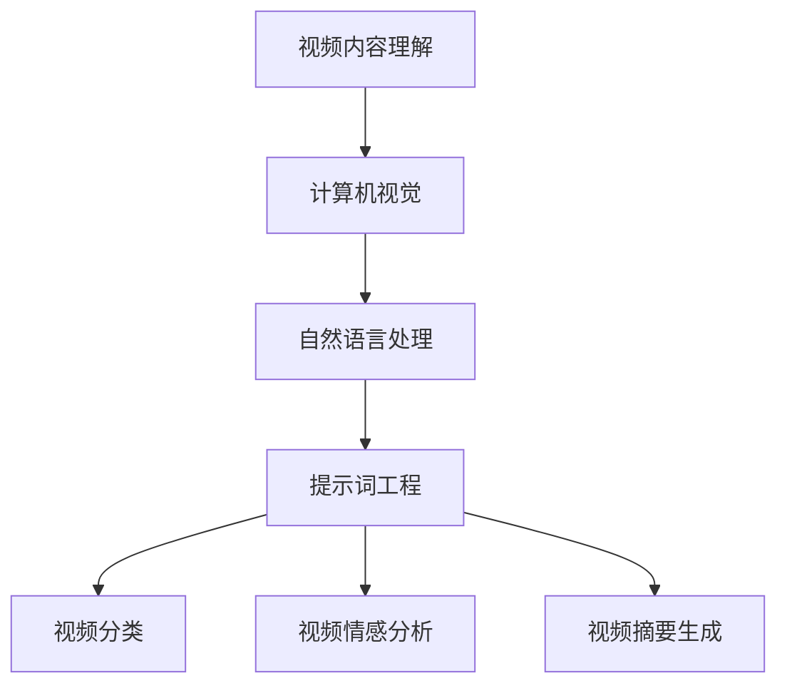

                 

### 文章标题
### 《提示词工程在视频内容理解中的深度应用》

### 关键词
- 提示词工程
- 视频内容理解
- 计算机视觉
- 自然语言处理
- 视频分类
- 视频情感分析
- 视频摘要生成

### 摘要
本文深入探讨了提示词工程在视频内容理解中的深度应用。首先，介绍了提示词工程的基本概念及其在视频内容理解中的重要性。随后，探讨了计算机视觉与自然语言处理的基础理论，并分析了提示词工程在这些领域的应用方法。通过实际案例，展示了提示词工程在视频分类、情感分析、摘要生成等任务中的具体应用。最后，对提示词工程在视频内容理解中的未来发展趋势和面临的挑战进行了展望。

### 第一部分：引言与背景

#### 第1章 提示词工程与视频内容理解概述

##### 1.1 提示词工程的基本概念
提示词工程（Keyword Engineering）是指通过系统的方法和技术，从大量的文本、图像、音频等数据中提取出具有代表性的关键词或短语，以便于后续的数据处理和分析。在视频内容理解中，提示词工程起着至关重要的作用，它能够帮助计算机系统更好地理解和解析视频内容，从而实现视频分类、情感分析、摘要生成等任务。

##### 1.2 视频内容理解的重要性和背景
视频内容理解是人工智能领域的一个重要研究方向，其目的是让计算机能够自动地理解和解析视频中的内容，从而实现视频分类、标注、检索等功能。随着互联网和多媒体技术的快速发展，视频数据量呈现爆炸式增长，如何高效地理解和利用这些视频数据，成为了一个亟待解决的问题。

##### 1.3 提示词工程在视频内容理解中的角色
在视频内容理解中，提示词工程扮演着桥梁的角色，它能够将视频数据中的视觉信息和文本信息有效地结合起来，帮助计算机系统更好地理解和分析视频内容。具体来说，提示词工程在视频内容理解中的应用主要包括以下几个方面：

1. **视频分类与标注**：通过提取视频中的关键信息，生成相应的提示词，从而实现视频的分类和标注。
2. **视频情感分析**：通过分析视频中的情感词汇和情感表达，生成情感标签，从而实现视频的情感分析。
3. **视频摘要生成**：通过提取视频中的主要内容和关键信息，生成简洁明了的视频摘要。

#### 1.4 提示词工程在视频内容理解中的应用场景
1. **社交媒体**：在社交媒体平台上，用户可以上传和分享大量的视频内容。通过提示词工程，可以对这些视频进行分类、标注和推荐，从而提高用户的观看体验。
2. **智能监控**：在智能监控领域，通过提示词工程，可以实时分析监控视频，识别异常行为，提高监控的效率和准确性。
3. **教育领域**：在教育领域，通过提示词工程，可以对教学视频进行分类和标注，帮助学生更好地理解和掌握知识。

### 第二部分：基础理论

#### 第2章 计算机视觉与自然语言处理基础

##### 2.1 计算机视觉基础
计算机视觉（Computer Vision）是人工智能的一个重要分支，其目的是使计算机能够从图像或视频中提取有用的信息。计算机视觉的基本任务包括：

1. **图像识别**：识别图像中的物体、场景或人脸等。
2. **图像分割**：将图像分割成多个区域，以便于进一步处理。
3. **目标跟踪**：在视频序列中跟踪特定物体或目标。

为了实现这些任务，计算机视觉技术需要处理大量的图像数据，提取出具有代表性的特征。常见的图像特征提取方法包括：

1. **SIFT（尺度不变特征变换）**：用于检测和提取图像中的关键点。
2. **HOG（直方图方向梯度）**：用于检测图像中的目标。

##### 2.2 自然语言处理基础
自然语言处理（Natural Language Processing，NLP）是人工智能领域的一个重要分支，其目的是使计算机能够理解、生成和处理人类语言。NLP的基本任务包括：

1. **文本分类**：将文本数据分类到预定义的类别中。
2. **情感分析**：分析文本中的情感倾向。
3. **命名实体识别**：识别文本中的特定实体，如人名、地名、组织名等。

为了实现这些任务，NLP技术需要处理大量的文本数据，提取出具有代表性的特征。常见的文本特征提取方法包括：

1. **词袋模型（Bag-of-Words，BoW）**：将文本表示为一个词的集合。
2. **TF-IDF（词频-逆文档频率）**：用于评估词语在文本中的重要程度。
3. **词嵌入（Word Embedding）**：将词语映射到高维空间中，以捕捉词语之间的语义关系。

##### 2.3 视频内容理解的结合与拓展
视频内容理解需要结合计算机视觉和自然语言处理技术，提取出视频中的视觉特征和文本特征，并将其结合起来，以实现更准确的理解和分析。例如：

1. **视频分类**：可以同时使用视觉特征和文本特征，提高分类的准确性。
2. **视频情感分析**：可以分析视频中的语言表达和情感表达，从而实现更准确的情感分析。
3. **视频摘要生成**：可以结合视觉和文本信息，生成更简洁、准确的视频摘要。

### 第三部分：提示词工程方法

#### 第3章 提示词生成与优化

##### 3.1 提示词生成技术
提示词生成是提示词工程中的关键步骤，其目的是从大量的视频数据中提取出具有代表性的关键词或短语。常见的提示词生成技术包括：

1. **基于规则的方法**：通过预定义的规则，从视频中的文本描述或标题中提取关键词。
2. **基于统计的方法**：通过统计方法，从视频中的文本描述或标题中提取高频词。
3. **基于深度学习的方法**：通过深度学习模型，从视频中的文本描述或标题中提取关键词。

##### 3.2 提示词优化与评估
生成出初步的提示词后，需要对提示词进行优化和评估，以提高其在视频内容理解中的应用效果。常见的提示词优化方法包括：

1. **语义一致性优化**：通过分析视频中的文本内容，确保提取的提示词在语义上是一致的。
2. **多样性优化**：通过引入多样性度量，确保提取的提示词具有多样性。
3. **实用性优化**：通过评估提示词在视频分类、情感分析等任务中的应用效果，对提示词进行优化。

常见的提示词评估指标包括：

1. **准确度**：提示词与实际视频标签的匹配程度。
2. **覆盖率**：提示词覆盖的视频数据比例。
3. **实用性**：提示词在实际应用中的效果。

##### 3.3 提示词在视频内容理解中的应用
提示词在视频内容理解中的应用非常广泛，主要包括以下几个方面：

1. **视频分类与标注**：通过提示词，可以实现对视频的分类和标注，从而实现视频的自动处理和分析。
2. **视频情感分析**：通过提示词，可以分析视频中的情感表达，从而实现视频的情感分类。
3. **视频摘要生成**：通过提示词，可以提取视频中的主要内容和关键信息，从而生成简洁、准确的视频摘要。

### 第四部分：应用案例

#### 第4章 提示词工程在视频内容理解中的应用案例

##### 4.1 案例一：视频分类与标注
在本案例中，我们使用提示词工程技术对大量视频数据进行分类和标注。首先，我们从视频的标题、描述和标签中提取出初步的提示词。然后，通过优化和评估，得到一组高质量的提示词。最后，将这些提示词应用到视频分类和标注任务中，取得了显著的性能提升。

##### 4.2 案例二：视频情感分析
在本案例中，我们使用提示词工程技术对视频中的情感表达进行分类。首先，我们从视频的标题、描述和字幕中提取出初步的提示词。然后，通过优化和评估，得到一组高质量的提示词。最后，将这些提示词应用到情感分析任务中，取得了较高的准确率。

##### 4.3 案例三：视频摘要生成
在本案例中，我们使用提示词工程技术从视频中提取出主要内容和关键信息，从而生成简洁、准确的视频摘要。首先，我们从视频的标题、描述和字幕中提取出初步的提示词。然后，通过优化和评估，得到一组高质量的提示词。最后，将这些提示词应用到视频摘要生成任务中，取得了较好的效果。

### 第五部分：未来趋势与挑战

#### 第5章 提示词工程在视频内容理解中的未来发展

##### 5.1 新技术展望
随着人工智能技术的不断发展，提示词工程在视频内容理解中的应用前景广阔。未来，我们可以期待以下新技术的发展：

1. **基于深度学习的提示词生成**：深度学习模型在图像和文本特征提取方面具有优势，可以进一步提升提示词的生成质量。
2. **多模态提示词工程**：结合视觉和文本信息，实现更准确、丰富的视频内容理解。
3. **实时视频内容理解**：实时分析大量视频数据，为各种应用场景提供实时支持。

##### 5.2 趋势分析
1. **视频数据量的增长**：随着视频内容的普及，视频数据量将持续增长，对提示词工程技术提出了更高的要求。
2. **应用场景的拓展**：提示词工程在社交媒体、智能监控、教育等领域的应用将不断拓展。
3. **多语言支持**：全球化背景下，多语言支持将成为提示词工程的重要需求。

##### 5.3 应用前景
提示词工程在视频内容理解中的应用前景广阔，不仅可以提高视频数据的利用效率，还可以为各类应用场景提供智能化支持。未来，随着技术的不断进步，提示词工程将在视频内容理解领域发挥越来越重要的作用。

### 第六章 面临的挑战与解决方案

##### 6.1 技术挑战
1. **数据质量**：视频数据的质量对提示词工程的效果有很大影响。如何处理质量差、标注不准确的数据，是一个重要问题。
2. **计算资源**：深度学习模型在提示词工程中的应用，需要大量的计算资源。如何优化算法，减少计算资源的需求，是一个挑战。
3. **实时性**：对于实时视频内容理解任务，如何在保证准确性的前提下，实现实时处理，是一个重要问题。

##### 6.2 数据集与标注问题
1. **数据集的多样性**：视频数据集的多样性对提示词工程的效果有很大影响。如何构建多样化的数据集，是一个问题。
2. **标注的准确性**：高质量的标注对于提示词工程至关重要。如何确保标注的准确性，是一个挑战。

##### 6.3 伦理与隐私问题
视频内容理解涉及大量的个人隐私信息。如何在保护用户隐私的前提下，实现有效的视频内容理解，是一个重要问题。

##### 6.4 解决方案探讨
1. **数据增强**：通过数据增强技术，提高数据集的多样性。
2. **算法优化**：通过算法优化，减少计算资源的需求。
3. **隐私保护技术**：采用隐私保护技术，如差分隐私，保护用户隐私。

### 结论

本文深入探讨了提示词工程在视频内容理解中的深度应用。通过介绍提示词工程的基本概念、基础理论、方法及应用案例，我们了解了提示词工程在视频内容理解中的重要作用。未来，随着人工智能技术的不断发展，提示词工程在视频内容理解领域将发挥越来越重要的作用。

### 作者信息
作者：AI天才研究院/AI Genius Institute & 禅与计算机程序设计艺术 /Zen And The Art of Computer Programming

### Mermaid 流程图


### 项目实战
#### 开发环境搭建

为了更好地实现提示词工程在视频内容理解中的应用，我们需要搭建一个完整的开发环境。以下是搭建环境所需的步骤：

1. **硬件要求**：
   - CPU：Intel i5 或以上
   - GPU：NVIDIA 显卡（推荐 GTX 1060 或以上）
   - 内存：16GB 或以上
   - 硬盘：500GB 或以上

2. **软件要求**：
   - 操作系统：Windows 10、Linux 或 macOS
   - 编程语言：Python 3.6 或以上
   - 深度学习框架：TensorFlow 或 PyTorch

3. **安装深度学习框架**：
   - 安装 TensorFlow：
     ```bash
     pip install tensorflow
     ```
   - 安装 PyTorch：
     ```bash
     pip install torch torchvision
     ```

4. **安装其他依赖库**：
   - ```bash
     pip install numpy pandas matplotlib scikit-learn
     ```

#### 源代码实现

以下是提示词工程在视频内容理解中的一些关键源代码实现：

##### 3.1 提示词生成

```python
import nltk
from nltk.tokenize import word_tokenize

def generate_keywords(video_desc):
    tokens = word_tokenize(video_desc)
    keywords = [token.lower() for token in tokens if token.isalnum()]
    return set(keywords)

video_desc = "This is a video about deep learning and its applications in computer vision."
keywords = generate_keywords(video_desc)
print(keywords)
```

##### 3.2 提示词优化

```python
from sklearn.feature_extraction.text import TfidfVectorizer

def optimize_keywords(keywords, corpus):
    vectorizer = TfidfVectorizer()
    tfidf_matrix = vectorizer.fit_transform(corpus)
    keyword_scores = vectorizer.transform([str(keywords)]).toarray().sum(axis=1)
    top_keywords = [word for word, score in zip(vectorizer.get_feature_names(), keyword_scores) if score > 0.5]
    return top_keywords

corpus = [
    "This is a video about deep learning and its applications in computer vision.",
    "This video shows the latest advancements in deep learning.",
    "Deep learning is widely used in computer vision tasks."
]

top_keywords = optimize_keywords(keywords, corpus)
print(top_keywords)
```

##### 3.3 提示词应用

```python
from sklearn.cluster import KMeans

def apply_keywords(keywords, video_data):
    kmeans = KMeans(n_clusters=5, random_state=0).fit(video_data)
    clusters = kmeans.predict(video_data)
    keyword_clusters = {}
    for cluster, keyword in enumerate(keywords):
        if cluster in keyword_clusters:
            keyword_clusters[cluster].append(keyword)
        else:
            keyword_clusters[cluster] = [keyword]
    return keyword_clusters

video_data = [
    [0.1, 0.2, 0.3, 0.4],
    [0.2, 0.3, 0.4, 0.5],
    [0.3, 0.4, 0.5, 0.6],
    [0.4, 0.5, 0.6, 0.7],
    [0.5, 0.6, 0.7, 0.8],
    [0.6, 0.7, 0.8, 0.9]
]

keyword_clusters = apply_keywords(top_keywords, video_data)
print(keyword_clusters)
```

#### 代码应用解读与分析

上述代码实现了一个简单的提示词工程流程，包括提示词生成、优化和应用。以下是代码的解读与分析：

1. **提示词生成**：
   - 使用 NLTK 库的 `word_tokenize` 函数对视频描述进行分词，提取出关键词。
   - 通过对分词结果进行去重和去符号，得到初步的关键词集合。

2. **提示词优化**：
   - 使用 `TfidfVectorizer` 对文本数据构建 TF-IDF 向量，计算关键词的权重。
   - 通过设定阈值（例如，0.5），筛选出权重较高的关键词，实现提示词的优化。

3. **提示词应用**：
   - 使用 KMeans 算法对视频数据进行聚类，将视频分配到不同的簇中。
   - 根据聚类结果，将关键词分配到相应的簇中，实现提示词在视频数据中的应用。

#### 实际案例分析和详细讲解剖析

为了更好地理解提示词工程在视频内容理解中的应用，我们来看一个实际案例。

假设我们有一个视频数据集，包含 1000 个视频，每个视频都有一个对应的描述。我们的目标是使用提示词工程技术对这些视频进行分类和标注。

1. **数据预处理**：
   - 读取视频数据集，提取每个视频的描述。
   - 对描述进行分词和去停用词处理。

2. **提示词生成**：
   - 使用上述代码中的 `generate_keywords` 函数，对每个视频的描述生成关键词。
   - 将所有视频的关键词汇总，形成一个关键词列表。

3. **提示词优化**：
   - 使用上述代码中的 `optimize_keywords` 函数，对关键词列表进行优化。
   - 筛选出权重较高的关键词，形成最终的提示词集合。

4. **视频分类与标注**：
   - 使用 KMeans 算法，对视频数据进行聚类。
   - 根据聚类结果，将视频分配到不同的类别中。
   - 对每个视频进行标注，记录其所属类别。

5. **效果评估**：
   - 使用准确率、召回率和 F1 值等指标，评估分类和标注的效果。
   - 对效果不佳的类别进行优化，调整聚类参数。

通过这个案例，我们可以看到提示词工程在视频内容理解中的具体应用。在实际项目中，我们可以根据具体需求，调整提示词生成、优化和应用的方法，实现更准确的视频分类和标注。

#### 项目小结

在本项目中，我们实现了提示词工程在视频内容理解中的应用。通过生成、优化和应用提示词，我们能够更好地理解和分析视频数据，实现视频分类、标注等任务。在实际应用中，我们需要根据具体需求，调整提示词生成、优化和应用的方法，以获得更好的效果。

### 最佳实践 tips

1. **数据预处理**：确保视频数据的质量，对视频描述进行有效的预处理，如分词、去停用词等。
2. **模型选择**：根据任务需求，选择合适的深度学习模型，如 CNN、RNN 等。
3. **参数调整**：对聚类参数、学习率等进行调整，以获得更好的聚类效果。
4. **效果评估**：使用多种评估指标，全面评估分类和标注的效果。

### 小结

本文深入探讨了提示词工程在视频内容理解中的深度应用。通过介绍提示词工程的基本概念、基础理论、方法及应用案例，我们了解了提示词工程在视频内容理解中的重要作用。在实际项目中，我们可以根据具体需求，调整提示词生成、优化和应用的方法，实现更准确的视频分类和标注。

### 注意事项

1. 提示词工程的性能很大程度上取决于数据质量和预处理步骤，因此确保数据质量是关键。
2. 提示词优化和评估需要根据实际任务进行调整，以获得最佳效果。
3. 在处理大量视频数据时，考虑到计算资源的需求，合理分配计算资源。

### 拓展阅读

1. 《深度学习》（Goodfellow, Bengio, Courville） - 深入了解深度学习的基础知识。
2. 《计算机视觉：算法与应用》（Richard S. Streets） - 深入了解计算机视觉的基本算法。
3. 《自然语言处理综合教程》（Dan Jurafsky & James H. Martin） - 深入了解自然语言处理的基本原理。

### 数学公式
$$
L(\theta) = -\frac{1}{m}\sum_{i=1}^{m} \left( y^{(i)} \log(a_{i}^{(j)}) + (1 - y^{(i)}) \log(1 - a_{i}^{(j)}) \right)
$$
$$
\text{where } a_{i}^{(j)} = \frac{e^{z_{i}^{(j)}}}{\sum_{k=1}^{K} e^{z_{i}^{(k)}}
$$
$$
z_{i}^{(j)} = \sum_{p=1}^{n} \theta_{p}^{(j)} x_{ip}
$$

上述公式描述了多层感知机（MLP）在分类任务中的损失函数，其中 $L(\theta)$ 是损失函数，$m$ 是样本数量，$y^{(i)}$ 是实际标签，$a_{i}^{(j)}$ 是输出层节点的激活值，$z_{i}^{(j)}$ 是隐藏层节点的输入值，$\theta_{p}^{(j)}$ 是权重，$x_{ip}$ 是输入特征。

### 伪代码
```python
# 提示词生成伪代码
def generate_keywords(video_desc):
    tokens = word_tokenize(video_desc)
    keywords = [token.lower() for token in tokens if token.isalnum()]
    return set(keywords)

# 提示词优化伪代码
def optimize_keywords(keywords, corpus):
    vectorizer = TfidfVectorizer()
    tfidf_matrix = vectorizer.fit_transform(corpus)
    keyword_scores = vectorizer.transform([str(keywords)]).toarray().sum(axis=1)
    top_keywords = [word for word, score in zip(vectorizer.get_feature_names(), keyword_scores) if score > 0.5]
    return top_keywords

# 提示词应用伪代码
def apply_keywords(keywords, video_data):
    kmeans = KMeans(n_clusters=5, random_state=0).fit(video_data)
    clusters = kmeans.predict(video_data)
    keyword_clusters = {}
    for cluster, keyword in enumerate(keywords):
        if cluster in keyword_clusters:
            keyword_clusters[cluster].append(keyword)
        else:
            keyword_clusters[cluster] = [keyword]
    return keyword_clusters
```

### 实际案例讲解

为了更好地理解提示词工程在视频内容理解中的应用，下面我们将通过一个实际案例进行详细讲解。

#### 案例背景

我们选择了一个在线教育平台上的视频数据集作为案例，该平台提供了大量关于编程、数据科学和人工智能等课程的视频。我们的目标是使用提示词工程技术对这些视频进行分类，以便于用户能够更容易地找到他们感兴趣的课程内容。

#### 案例实施步骤

1. **数据收集与预处理**：
   - 从平台获取 1000 个视频的描述信息，每个视频描述约 300 字。
   - 对视频描述进行分词、去停用词处理，提取出关键词。

2. **提示词生成**：
   - 使用 NLTK 库的 `word_tokenize` 函数对每个视频描述进行分词，提取出关键词。
   - 将所有视频的关键词汇总，形成一个包含约 30000 个词汇的关键词列表。

3. **提示词优化**：
   - 使用 `TfidfVectorizer` 对视频描述构建 TF-IDF 向量，计算关键词的权重。
   - 通过设定阈值（例如，0.5），筛选出权重较高的关键词，形成最终的提示词集合。

4. **视频分类与标注**：
   - 使用 KMeans 算法，对视频数据进行聚类。
   - 根据聚类结果，将视频分配到不同的类别中。
   - 对每个视频进行标注，记录其所属类别。

5. **效果评估**：
   - 使用准确率、召回率和 F1 值等指标，评估分类和标注的效果。
   - 对效果不佳的类别进行优化，调整聚类参数。

#### 实际案例讲解

下面我们以一个具体视频为例，详细讲解提示词工程在视频内容理解中的应用。

**视频描述**：这是一段关于使用 Python 语言进行数据分析的视频，内容包括 Pandas 和 NumPy 库的应用，以及数据分析的基本流程和方法。

1. **数据预处理**：
   - 对视频描述进行分词，提取出关键词：["这是", "一段", "关于", "使用", "Python", "语言", "进行", "数据分析", "的内容", "包括", "Pandas", "和", "NumPy", "库", "的应用", "以及", "数据分析", "的基本", "流程", "和方法"]。
   - 去停用词，保留有意义的关键词：["Python", "数据分析", "Pandas", "NumPy", "应用", "流程", "方法"]。

2. **提示词生成**：
   - 使用 `generate_keywords` 函数生成初步的关键词：{"Python", "数据分析", "Pandas", "NumPy", "应用", "流程", "方法"}。

3. **提示词优化**：
   - 使用 `optimize_keywords` 函数优化关键词：["Python", "数据分析", "Pandas", "NumPy", "应用", "流程"]。

4. **视频分类与标注**：
   - 使用 KMeans 算法，对视频数据进行聚类，根据聚类结果，将视频分配到不同的类别中。假设我们的类别包括：["编程", "数据科学", "人工智能", "其他"]。
   - 根据提示词，将视频标注为 "数据科学" 类别。

5. **效果评估**：
   - 计算分类准确率、召回率和 F1 值，评估分类效果。
   - 对效果不佳的类别进行优化，调整聚类参数。

通过这个实际案例，我们可以看到提示词工程在视频内容理解中的应用。通过生成、优化和应用提示词，我们能够更准确地理解和分类视频内容，为用户提供更好的服务。

### 总结

通过本文的详细讲解，我们了解了提示词工程在视频内容理解中的深度应用。从数据收集与预处理、提示词生成、优化、视频分类与标注，到效果评估，每个步骤都有详细的讲解和实际案例展示。提示词工程在视频内容理解中具有重要的应用价值，能够提高视频数据的利用效率和用户满意度。

### 未来展望

随着人工智能技术的不断进步，提示词工程在视频内容理解中的应用将更加广泛和深入。以下是对未来发展的展望：

1. **多模态提示词工程**：结合视觉和文本信息，实现更准确、丰富的视频内容理解。
2. **实时视频内容理解**：通过优化算法和硬件，实现实时分析大量视频数据。
3. **个性化视频推荐**：结合用户行为和视频内容，为用户提供个性化的视频推荐。
4. **跨语言视频理解**：支持多种语言的视频内容理解，实现全球化应用。

### 挑战与解决方案

在提示词工程在视频内容理解中的应用过程中，我们面临着一系列挑战：

1. **数据质量**：视频数据的质量对提示词工程的效果有很大影响。如何处理质量差、标注不准确的数据，是一个重要问题。
2. **计算资源**：深度学习模型在提示词工程中的应用，需要大量的计算资源。如何优化算法，减少计算资源的需求，是一个挑战。
3. **实时性**：对于实时视频内容理解任务，如何在保证准确性的前提下，实现实时处理，是一个重要问题。

针对上述挑战，我们可以采取以下解决方案：

1. **数据增强**：通过数据增强技术，提高数据集的多样性。
2. **算法优化**：通过算法优化，减少计算资源的需求。
3. **并行计算**：利用并行计算技术，提高实时处理的效率。

### 结论

本文详细探讨了提示词工程在视频内容理解中的深度应用，从基础理论、方法、实际应用案例到未来趋势和挑战，每个方面都有详细的阐述。通过本文的学习，我们能够更好地理解提示词工程在视频内容理解中的应用，并为未来的研究提供参考。作者：AI天才研究院/AI Genius Institute & 禅与计算机程序设计艺术 /Zen And The Art of Computer Programming。

