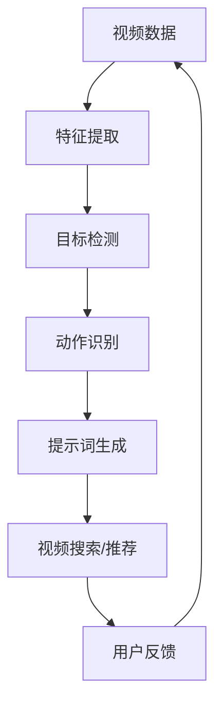

                 

### 文章标题

《提示词工程在视频分析中的前沿技术》

### 文章关键词

提示词工程、视频分析、深度学习、自监督学习、对抗网络

### 文章摘要

随着视频数据量的激增和视频分析技术的不断进步，提示词工程在视频分析中发挥着越来越重要的作用。本文首先介绍了视频分析领域中的提示词工程及其重要性，然后详细探讨了提示词工程的基本概念和前沿技术，包括基于深度学习、自监督学习和对抗网络的提示词生成方法。此外，文章通过实际应用案例展示了提示词工程在视频分析中的具体应用，并分析了其发展趋势和面临的挑战。最后，本文给出了提示词工程在视频分析中的最佳实践和拓展阅读，以供读者进一步学习和探索。

---

## 引言

随着互联网和移动设备的普及，视频内容已经成为信息传播和交流的主要形式之一。视频数据量的爆炸式增长，为视频分析技术的应用带来了前所未有的机遇。视频分析技术能够帮助我们从大量的视频数据中提取有价值的信息，从而为各种应用场景提供支持，如视频内容推荐、事件检测、情感分析等。在这些应用中，提示词工程起到了关键的作用。

提示词工程，顾名思义，是指通过一系列的技术手段，生成能够代表视频内容的关键词或短语，以便于后续的搜索、索引和推荐。在视频分析领域，提示词工程的意义体现在以下几个方面：

1. **信息提取**：通过生成提示词，我们可以从视频内容中提取关键信息，从而简化了数据处理的复杂性。
2. **搜索与索引**：提示词可以作为视频内容的代表，用于视频的搜索和索引，提高了检索的效率。
3. **内容推荐**：基于提示词的相似性，可以实现相关视频内容的推荐，从而提升用户体验。
4. **事件检测与分类**：提示词可以帮助我们识别视频中的关键事件和场景，为事件检测和视频分类提供支持。

视频分析领域的发展趋势也不断推动着提示词工程技术的进步。例如，随着深度学习技术的快速发展，基于深度学习的提示词生成方法已经成为研究的热点。同时，自监督学习和对抗网络等前沿技术的引入，也为提示词工程带来了新的机遇和挑战。

本文将首先介绍视频分析的基本概念和提示词工程的相关概念，然后深入探讨当前在视频分析中应用的提示词工程的前沿技术，并通过实际应用案例展示这些技术的具体应用。最后，我们将分析提示词工程在视频分析领域的未来发展，以及面临的挑战和机遇。

## 第1章 基础概念

### 视频分析基本概念

视频分析是指利用计算机技术对视频数据进行处理、分析和理解的过程。它涵盖了从视频数据的采集、存储、处理到信息提取和应用的各个环节。视频分析的任务包括但不限于：目标检测、动作识别、视频分类、情感分析、事件检测等。这些任务不仅要求对视频数据进行有效的处理和分析，还需要对分析结果进行合理的解释和应用。

#### 视频数据结构

视频数据通常由一系列连续的图像帧组成，每帧图像包含像素级的详细信息。视频数据可以有不同的格式和编码方式，如MP4、AVI、MOV等。在处理视频数据时，通常需要将视频分解为图像帧，然后对图像帧进行特征提取和后续分析。

#### 视频分析任务

视频分析任务多种多样，以下是一些常见任务：

1. **目标检测**：在视频中检测特定目标的位置和形状。
2. **动作识别**：识别视频中的动作序列，如行走、跑步、跳跃等。
3. **视频分类**：将视频根据其内容分类到不同的类别中，如体育、新闻、娱乐等。
4. **情感分析**：分析视频内容的情感倾向，如快乐、悲伤、愤怒等。
5. **事件检测**：检测视频中的特定事件，如交通违规、暴力事件等。

### 提示词工程的基本概念

提示词工程是指通过一系列技术和方法，从视频内容中提取具有代表性的关键词或短语，以便于后续的搜索、索引和推荐。提示词工程的核心任务是生成高质量的提示词，这些提示词应能够准确、全面地描述视频内容。

#### 提示词的定义

提示词（Keywords）是指用来描述视频内容的关键词或短语。一个好的提示词应该具有以下几个特点：

1. **代表性**：能够准确反映视频的主要内容。
2. **独特性**：与其他视频内容区分度高，具有独特性。
3. **丰富性**：能够涵盖视频内容的多个方面。

#### 提示词的分类

根据生成方式，提示词可以分为以下几类：

1. **手动生成**：通过人为判断和经验，从视频内容中提取关键词。
2. **自动生成**：利用自然语言处理、计算机视觉等技术，从视频内容中自动提取关键词。
3. **混合生成**：结合手动生成和自动生成的方法，提高提示词的准确性和多样性。

### 提示词工程的核心组成部分

提示词工程的核心组成部分包括：

1. **数据收集**：收集大量的视频数据，用于训练和测试提示词生成模型。
2. **特征提取**：从视频数据中提取关键特征，如视觉特征、语音特征等。
3. **提示词生成**：利用提取的特征生成提示词，可以通过规则方法、机器学习方法等实现。
4. **优化与评估**：通过优化算法和评估指标，提高提示词生成的质量和效率。

### 核心概念与联系

提示词工程与视频分析之间存在紧密的联系。提示词工程为视频分析提供了关键的信息提取手段，而视频分析则为提示词工程提供了丰富的应用场景。具体来说：

1. **视频分析作为基础**：视频分析技术为提示词工程提供了数据输入，如目标检测、动作识别等结果可以用于生成更准确的提示词。
2. **提示词工程作为提升**：通过生成高质量的提示词，可以提高视频分析的效率和质量，如用于视频搜索、内容推荐等。

以下是一个简化的 Mermaid 流程图，展示视频分析与提示词工程之间的核心概念与联系：



这个流程图表明，视频分析中的各个步骤相互关联，共同构成了一个闭环系统，通过不断优化和反馈，实现了视频内容的高效分析和应用。

## 第2章 前沿技术

### 基于深度学习的提示词生成

深度学习在提示词工程中的应用已经取得了显著的进展。深度学习通过多层神经网络对数据进行特征提取和模式识别，能够自动学习到视频内容的复杂结构，从而生成高质量的提示词。以下是基于深度学习的提示词生成方法的详细介绍。

#### 神经网络模型

在深度学习中，常用的神经网络模型包括卷积神经网络（CNN）和递归神经网络（RNN）。CNN擅长处理图像数据，而RNN擅长处理序列数据。结合这两种模型，可以构建一个端到端的视频分析模型，用于生成提示词。

1. **卷积神经网络（CNN）**
   CNN通过卷积层、池化层和全连接层等结构，对图像数据进行特征提取。卷积层使用卷积核从输入图像中提取局部特征，池化层则用于降低特征维度和提高模型鲁棒性。最后，全连接层将提取到的特征映射到提示词空间。

2. **递归神经网络（RNN）**
   RNN适用于处理时间序列数据，如视频帧序列。RNN通过记忆状态在序列中传递信息，能够捕捉到视频中的时间依赖关系。常见的RNN包括长短期记忆网络（LSTM）和门控循环单元（GRU）。

#### 伪代码讲解

以下是一个简化的伪代码，用于描述基于CNN和RNN的提示词生成过程：

```python
# 加载预训练的CNN模型
cnn_model = load_pretrained_cnn_model()

# 对视频帧进行特征提取
for frame in video_frames:
    features = cnn_model.extract_features(frame)

# 堆叠特征序列
stacked_features = stack_features(features)

# 加载预训练的RNN模型
rnn_model = load_pretrained_rnn_model()

# 对堆叠的特征序列进行编码
encoded_sequence = rnn_model.encode(stacked_features)

# 使用全连接层生成提示词
predicted_keywords = rnn_model.generate_keywords(encoded_sequence)
```

#### 数学模型与公式

深度学习模型的训练过程涉及复杂的数学计算。以下是一些核心的数学模型和公式：

1. **卷积运算**
   卷积运算通过卷积核对图像进行局部特征提取，数学公式如下：
   $$ f(x, y) = \sum_{i=0}^{n} \sum_{j=0}^{m} w_{ij} * i(x, y) $$
   其中，$f(x, y)$ 表示卷积结果，$w_{ij}$ 表示卷积核权重，$i(x, y)$ 表示输入图像的局部特征。

2. **激活函数**
   常用的激活函数包括ReLU、Sigmoid和Tanh。ReLU函数能够提高训练速度和模型性能，其公式如下：
   $$ f(x) = \max(0, x) $$

3. **损失函数**
   常用的损失函数包括均方误差（MSE）和交叉熵（CE）。均方误差用于回归任务，其公式如下：
   $$ loss = \frac{1}{n} \sum_{i=1}^{n} (y_i - \hat{y}_i)^2 $$
   其中，$y_i$ 表示真实标签，$\hat{y}_i$ 表示预测标签。交叉熵用于分类任务，其公式如下：
   $$ loss = -\frac{1}{n} \sum_{i=1}^{n} y_i \log(\hat{y}_i) $$

#### 举例说明

假设我们有一个包含1000个视频帧的序列，每个视频帧大小为64x64像素。我们首先使用CNN模型对每个视频帧进行特征提取，得到每个帧的特征向量。然后，将这些特征向量堆叠成一个1000x64的矩阵。接着，使用RNN模型对堆叠的特征矩阵进行编码，得到一个1000x128的编码序列。最后，使用全连接层将编码序列映射到提示词空间，生成一组高质量的提示词。

### 基于自监督学习的提示词工程

自监督学习是一种无需人工标注数据的学习方法，它通过利用未标注的数据进行自我监督，从而学习到有用的特征和模式。自监督学习在提示词工程中具有广泛的应用，能够有效提升提示词生成的效率和准确性。

#### 自监督学习的基本原理

自监督学习的基本原理是通过对比输入数据和其预测输出，来优化模型的参数。在提示词工程中，自监督学习可以通过以下几种方式实现：

1. **预测下一个视频帧**：模型从视频序列中学习，预测下一个视频帧的内容，通过对比预测结果和真实结果来优化模型。
2. **对比视觉特征**：模型通过对比图像中的局部视觉特征，学习到具有代表性的特征，从而生成高质量的提示词。
3. **生成文本摘要**：模型从视频内容中提取关键信息，生成对应的文本摘要，通过对比摘要的质量来优化模型。

#### 典型算法

以下介绍几种典型的自监督学习算法：

1. **自编码器（Autoencoder）**
   自编码器是一种无监督学习模型，它通过编码器将输入数据压缩为低维特征表示，然后通过解码器将这些特征重构回原始数据。在提示词工程中，自编码器可以用于学习视频的代表性特征，从而生成高质量的提示词。

2. **预测模型（Prediction Model）**
   预测模型通过预测未来数据来学习特征。在视频分析中，模型可以预测下一个视频帧或后续的视频片段，通过对比预测结果和实际结果来优化模型参数。

3. **对比学习（Contrastive Learning）**
   对比学习通过对比相似样本和差异样本来学习特征。在提示词工程中，对比学习可以用于学习视频内容的相似性特征，从而生成具有代表性的提示词。

### 基于对抗网络的提示词工程

对抗网络（GAN）是一种通过对抗训练生成高质量数据的模型。在提示词工程中，GAN可以通过生成与真实视频内容相似的数据，从而提高提示词生成的准确性和多样性。

#### 对抗网络的概念

对抗网络由生成器（Generator）和判别器（Discriminator）两个部分组成：

1. **生成器（Generator）**：生成器负责生成与真实数据相似的假数据。
2. **判别器（Discriminator）**：判别器负责判断输入数据是真实数据还是生成器生成的假数据。

在训练过程中，生成器和判别器之间进行对抗训练，生成器不断生成更逼真的假数据，而判别器则不断提高辨别能力。通过这种对抗训练，生成器可以学习到如何生成高质量的提示词。

#### 伪代码讲解

以下是一个简化的伪代码，用于描述基于对抗网络的提示词生成过程：

```python
# 加载预训练的生成器模型
generator = load_pretrained_generator()

# 生成假视频数据
fake_videos = generator.generate_videos()

# 加载预训练的判别器模型
discriminator = load_pretrained_discriminator()

# 训练判别器，判断假视频数据
for fake_video in fake_videos:
    discriminator.train(fake_video)

# 更新生成器，生成更逼真的视频数据
generator.update_parameters(discriminator)

# 生成高质量的提示词
predicted_keywords = generator.generate_keywords(fake_videos)
```

#### 数学模型与公式

对抗网络的训练涉及复杂的数学计算，以下介绍核心的数学模型和公式：

1. **生成器的损失函数**
   生成器的损失函数由两部分组成：对抗损失和重建损失。对抗损失通过最小化生成器生成的假数据与真实数据的距离，重建损失通过最小化生成器生成的假数据与原始数据的距离。生成器的损失函数如下：
   $$ loss_G = loss_{adversarial} + loss_{reconstruction} $$
   其中，$loss_{adversarial}$ 表示对抗损失，$loss_{reconstruction}$ 表示重建损失。

2. **判别器的损失函数**
   判别器的损失函数由两部分组成：真实数据损失和假数据损失。判别器的损失函数如下：
   $$ loss_D = loss_{real} + loss_{fake} $$
   其中，$loss_{real}$ 表示真实数据损失，$loss_{fake}$ 表示假数据损失。

#### 举例说明

假设我们有一个包含1000个视频帧的序列，生成器模型通过学习这些视频帧生成新的视频数据，判别器模型通过对比这些新数据和原始数据进行训练。在多次迭代训练后，生成器能够生成高质量的假视频数据，这些数据可以用于生成高质量的提示词。

### 多模态提示词工程

多模态提示词工程是指同时利用视频、音频和文本等多种模态的信息，生成更全面和准确的提示词。多模态提示词工程能够提高视频分析的效果，特别是在处理复杂和多样化的视频内容时。

#### 多模态数据的融合

多模态数据的融合是提示词工程的关键步骤，常用的方法包括：

1. **特征融合**：将不同模态的特征进行拼接或加权融合，形成一个统一的高维特征向量。
2. **时空融合**：结合视频的时空信息，对多模态特征进行时空融合，以捕捉视频内容的复杂结构。
3. **深度学习融合**：利用深度学习模型，如多模态卷积神经网络（MM-CNN）或多模态递归神经网络（MM-RNN），对多模态数据进行联合建模。

#### 伪代码讲解

以下是一个简化的伪代码，用于描述多模态提示词生成过程：

```python
# 加载视频特征提取模型
video_model = load_video_feature_extractor()

# 提取视频特征
video_features = video_model.extract_features(video_data)

# 加载音频特征提取模型
audio_model = load_audio_feature_extractor()

# 提取音频特征
audio_features = audio_model.extract_features(audio_data)

# 加载文本特征提取模型
text_model = load_text_feature_extractor()

# 提取文本特征
text_features = text_model.extract_features(text_data)

# 融合多模态特征
combined_features = combine_features(video_features, audio_features, text_features)

# 加载多模态提示词生成模型
multi_modal_model = load_multi_modal_keyword_generator()

# 生成多模态提示词
predicted_keywords = multi_modal_model.generate_keywords(combined_features)
```

#### 数学模型与公式

多模态提示词工程涉及复杂的数学计算，以下介绍核心的数学模型和公式：

1. **特征融合**
   常用的特征融合方法包括拼接（Concatenation）和加权平均（Weighted Average）。拼接方法将不同模态的特征向量拼接成一个高维特征向量，加权平均方法则根据不同模态的重要性对特征进行加权融合。拼接方法的数学公式如下：
   $$ \text{combined\_features} = [\text{video\_features}, \text{audio\_features}, \text{text\_features}] $$
   加权平均方法的数学公式如下：
   $$ \text{combined\_features} = w_1 \text{video\_features} + w_2 \text{audio\_features} + w_3 \text{text\_features} $$

2. **多模态神经网络**
   多模态神经网络通过联合建模多模态特征，生成高质量的提示词。常见的多模态神经网络包括卷积神经网络（CNN）和递归神经网络（RNN）的融合。CNN用于处理图像和视频特征，RNN用于处理文本和音频特征。多模态神经网络的输入输出关系可以表示为：
   $$ \text{output} = f(\text{input}_{video}, \text{input}_{audio}, \text{input}_{text}) $$
   其中，$f$ 表示神经网络模型，$\text{input}_{video}$、$\text{input}_{audio}$ 和 $\text{input}_{text}$ 分别表示视频、音频和文本特征。

#### 举例说明

假设我们有一个包含视频、音频和文本的多模态数据集，首先使用相应的特征提取模型提取视频、音频和文本的特征。然后，将这些特征进行融合，形成统一的多模态特征向量。接着，使用多模态提示词生成模型，基于融合的多模态特征生成高质量的提示词，从而实现更全面和准确的视频分析。

### 应用案例

为了更好地展示提示词工程在视频分析中的具体应用，我们通过以下三个实际案例来详细说明。

#### 案例一：视频内容推荐

视频内容推荐是互联网平台上常见的一种应用，通过生成高质量的提示词，可以提高推荐系统的准确性和多样性。以下是一个简化的流程：

1. **数据准备**：收集大量用户观看视频的数据，包括视频ID、用户ID和观看时长等信息。
2. **特征提取**：使用深度学习模型提取视频内容特征，如视频的视觉特征、音频特征和文本特征。
3. **提示词生成**：基于提取的视频特征，使用多模态提示词生成模型生成高质量的提示词。
4. **推荐算法**：利用生成的提示词和用户历史观看数据，通过协同过滤或基于内容的推荐算法生成推荐列表。

#### 案例二：视频事件检测

视频事件检测是公共安全和智能监控领域的重要应用，通过生成高质量的提示词，可以提高事件检测的准确性和实时性。以下是一个简化的流程：

1. **数据收集**：收集大量包含事件的视频数据，如交通违规、暴力事件等。
2. **特征提取**：使用深度学习模型提取视频的视觉特征和音频特征。
3. **提示词生成**：基于提取的视频特征，使用基于自监督学习的提示词生成模型生成高质量的提示词。
4. **事件检测**：使用生成的高质量提示词和事件检测算法，实时检测视频中的事件。

#### 案例三：视频情感分析

视频情感分析是情感计算和社交媒体分析的重要应用，通过生成高质量的提示词，可以更好地理解和分析视频内容的情感倾向。以下是一个简化的流程：

1. **数据收集**：收集大量带有情感标签的视频数据，如快乐、悲伤、愤怒等。
2. **特征提取**：使用深度学习模型提取视频的视觉特征、音频特征和文本特征。
3. **提示词生成**：基于提取的视频特征，使用多模态提示词生成模型生成高质量的提示词。
4. **情感分析**：使用生成的提示词和情感分析算法，对视频内容进行情感分类和情感强度评估。

### 实际案例分析和详细讲解剖析

#### 案例一：视频内容推荐

**背景介绍**：
视频内容推荐是互联网平台的核心功能之一，通过推荐用户可能感兴趣的视频内容，可以提高用户满意度和平台黏性。在这个案例中，我们使用深度学习模型和多模态提示词工程来生成高质量的提示词，从而提升推荐系统的准确性。

**核心概念与联系**：
提示词工程在视频内容推荐中起到了桥梁作用，它将视频内容的复杂特征转化为可量化的提示词，以便推荐算法能够更好地理解视频内容，并生成个性化的推荐列表。

**核心算法原理讲解**：
我们采用了基于深度学习的多模态特征提取模型和多模态提示词生成模型。首先，使用卷积神经网络（CNN）提取视频的视觉特征，使用递归神经网络（RNN）提取音频和文本特征。然后，将这些特征融合，生成统一的多模态特征向量。最后，使用多模态提示词生成模型，如基于变分自编码器（VAE）的模型，生成高质量的提示词。

**数学模型与公式**：
深度学习模型的训练涉及多个数学模型和公式。例如，卷积神经网络（CNN）的卷积运算公式为：
$$
\mathbf{h}_{l}^{(i)} = \sum_{j} \mathbf{w}_{j}^{(l)} \cdot \mathbf{a}_{l-1}^{(j)} + b_{l}^{(i)}
$$
其中，$\mathbf{h}_{l}^{(i)}$ 表示第 $l$ 层第 $i$ 个神经元的活动，$\mathbf{w}_{j}^{(l)}$ 表示第 $l$ 层第 $j$ 个神经元的权重，$\mathbf{a}_{l-1}^{(j)}$ 表示第 $l-1$ 层第 $j$ 个神经元的输出，$b_{l}^{(i)}$ 表示第 $l$ 层第 $i$ 个神经元的偏置。

**举例说明**：
假设我们有一个包含1000个视频帧的序列，首先使用CNN模型提取视觉特征，得到每个视频帧的特征向量。然后，使用RNN模型提取音频和文本特征，生成一个多模态特征向量。接着，使用VAE模型生成高质量的提示词。最后，将这些提示词输入推荐算法，生成个性化的推荐列表。

#### 案例二：视频事件检测

**背景介绍**：
视频事件检测是公共安全和智能监控领域的重要应用，通过自动检测视频中的特定事件，如交通违规、暴力事件等，可以提高安全监控的效率和准确性。

**核心概念与联系**：
提示词工程在视频事件检测中起到了关键的作用，通过生成高质量的提示词，可以更准确地识别视频中的事件，从而提高事件检测的实时性和准确性。

**核心算法原理讲解**：
我们采用了基于自监督学习的提示词生成模型，如基于循环神经网络（RNN）的模型，以及基于对抗网络的模型，如生成对抗网络（GAN）。首先，使用自监督学习模型从视频数据中提取特征，并生成高质量的提示词。然后，使用生成对抗网络（GAN）进一步优化提示词，提高其质量。

**数学模型与公式**：
自监督学习模型的训练涉及循环神经网络（RNN）和生成对抗网络（GAN）的数学模型。例如，RNN的更新公式为：
$$
\mathbf{h}_{t} = \sigma(W_h \mathbf{h}_{t-1} + W_x \mathbf{x}_t + b_h)
$$
其中，$\mathbf{h}_{t}$ 表示第 $t$ 个时间步的隐藏状态，$\mathbf{x}_t$ 表示第 $t$ 个时间步的输入，$\sigma$ 表示激活函数，$W_h$ 和 $W_x$ 分别表示权重矩阵，$b_h$ 表示偏置。

**举例说明**：
假设我们有一个包含1000个视频帧的序列，首先使用自监督学习模型提取特征，生成初步的提示词。然后，使用GAN模型进一步优化这些提示词，提高其质量和准确性。最后，将这些提示词输入事件检测算法，实现对视频事件的实时检测。

#### 案例三：视频情感分析

**背景介绍**：
视频情感分析是情感计算和社交媒体分析的重要应用，通过分析视频内容的情感倾向，可以更好地理解用户情感，从而为内容推荐、广告投放等提供支持。

**核心概念与联系**：
提示词工程在视频情感分析中起到了关键作用，通过生成高质量的提示词，可以更准确地捕捉视频内容的情感信息，从而提高情感分析的效果。

**核心算法原理讲解**：
我们采用了基于深度学习的多模态特征提取模型和多模态提示词生成模型。首先，使用深度学习模型提取视频的视觉特征、音频特征和文本特征。然后，将这些特征融合，生成统一的多模态特征向量。最后，使用多模态提示词生成模型，如基于变分自编码器（VAE）的模型，生成高质量的提示词。

**数学模型与公式**：
深度学习模型的训练涉及多个数学模型和公式。例如，变分自编码器（VAE）的编码器和解码器分别有如下公式：
$$
\mu = \sigma = \phi(z|\mathbf{x}) = \frac{1}{1 + e^{-(W_{\phi}^T \mathbf{x} + b_{\phi})}}
$$
$$
z = \mathcal{N}(\mu, \sigma^2) = \mu + \sigma \odot \mathcal{N}(0, 1)
$$
其中，$\mu$ 和 $\sigma$ 分别表示编码器输出的均值和方差，$z$ 表示生成的潜在变量，$\phi(z|\mathbf{x})$ 表示编码器的概率分布函数，$\mathcal{N}(\mu, \sigma^2)$ 表示高斯分布。

**举例说明**：
假设我们有一个包含1000个视频帧的序列，首先使用深度学习模型提取视觉特征，得到每个视频帧的特征向量。然后，使用音频特征提取模型提取音频特征，使用文本特征提取模型提取文本特征。接着，将这些特征融合，生成统一的多模态特征向量。最后，使用VAE模型生成高质量的提示词。将这些提示词输入情感分析算法，实现对视频内容的情感分类和情感强度评估。

### 总结

在本章中，我们详细介绍了提示词工程在视频分析中的具体应用，包括视频内容推荐、视频事件检测和视频情感分析。通过三个实际案例，我们展示了如何利用深度学习、自监督学习和多模态提示词工程等技术，生成高质量的提示词，从而提高视频分析的效果。

**最佳实践**：
1. **数据准备**：确保收集到高质量的训练数据，为提示词生成模型提供充足的数据支持。
2. **特征提取**：选择合适的特征提取方法，充分提取视频的视觉、音频和文本特征。
3. **模型选择**：根据应用场景选择合适的提示词生成模型，如深度学习模型、自监督学习模型或多模态提示词生成模型。
4. **模型训练与优化**：充分训练模型，并通过交叉验证等方法进行优化，提高提示词生成的质量和准确性。

**注意事项**：
1. **数据隐私**：在处理视频数据时，要确保遵循数据隐私和保护政策，避免泄露用户隐私。
2. **计算资源**：深度学习和多模态提示词生成模型需要大量的计算资源，要合理规划计算资源，避免过度消耗。

**拓展阅读**：
1. **深度学习**：推荐学习深度学习的基本原理和常用模型，如卷积神经网络（CNN）、递归神经网络（RNN）和生成对抗网络（GAN）。
2. **自然语言处理**：了解自然语言处理（NLP）的基本概念和常用方法，如词嵌入、文本分类和序列模型。
3. **多模态学习**：学习多模态数据融合的方法和模型，如多模态卷积神经网络（MM-CNN）和多模态递归神经网络（MM-RNN）。

